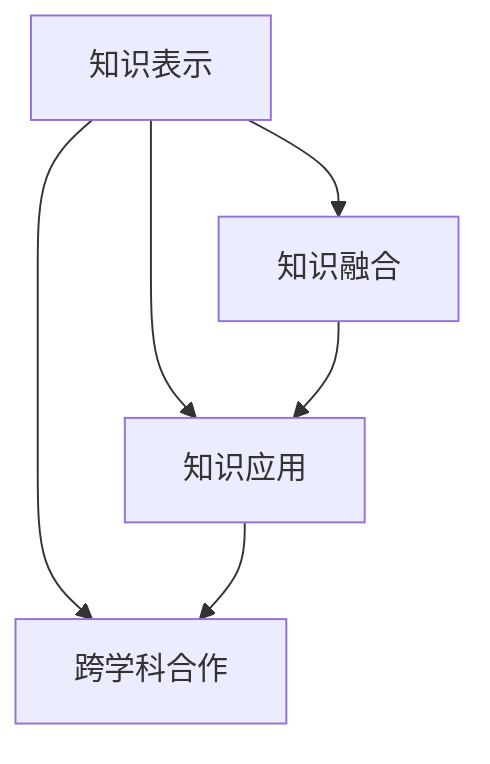

                 

# 知识的跨界整合：创新的催化剂

## 1. 背景介绍

### 1.1 问题由来
在信息爆炸的时代，知识的获取和利用变得前所未有的便利，但知识的零散性和孤立性也成为创新的瓶颈。知识的有效整合和重构，成为了驱动创新、促进技术发展的重要力量。知识跨界整合，是指将不同领域、不同形式的知识进行有机结合，形成新的知识体系和创新突破。本文将探讨知识的跨界整合如何作为创新的催化剂，从理论到实践全方位阐述其原理与方法，并展望未来发展趋势。

### 1.2 问题核心关键点
知识的跨界整合涉及知识表示、融合、应用等多个环节，其核心关键点包括：

- **知识表示**：如何将不同形式的知识统一表示，方便计算机进行处理。
- **知识融合**：如何将多个来源的知识有机结合，形成一致性、完整的知识体系。
- **知识应用**：如何将跨界整合后的知识应用于具体场景，实现实际创新。
- **跨学科合作**：如何促进不同学科领域之间的深度合作，共同探索知识的边界。

这些关键点共同构成了知识跨界整合的基础，为创新的发生提供了可能。

## 2. 核心概念与联系

### 2.1 核心概念概述

为了更好地理解知识的跨界整合，本节将介绍几个关键概念及其相互关系：

- **知识表示(Knowledge Representation, KR)**：指将知识用形式化语言表达的方式，方便计算机进行理解和处理。常见的知识表示方法包括RDF、OWL、本体论等。
- **知识融合(Knowledge Fusion)**：指将多个来源的知识进行整合，消除冗余和矛盾，形成一致性的知识体系。知识融合方法包括规则推理、机器学习、人工神经网络等。
- **知识应用(Knowledge Application)**：指将跨界整合后的知识应用于具体场景，实现技术创新。常见的知识应用场景包括专家系统、智能推荐、自动推理等。
- **跨学科合作(Interdisciplinary Collaboration)**：指不同学科领域之间的深度合作，共同探索知识的边界。跨学科合作需要构建良好的沟通机制和协作平台。

这些概念之间的关系可以通过以下Mermaid流程图来展示：



这个流程图展示了一些关键概念之间的联系：

1. 知识表示是知识融合和应用的基础。
2. 知识融合通过消除冗余和矛盾，为知识应用提供一致性的支持。
3. 知识应用将跨界整合后的知识转化为技术创新。
4. 跨学科合作促进了知识融合和应用的创新。

通过理解这些核心概念，我们可以更好地把握知识跨界整合的工作原理和优化方向。

## 3. 核心算法原理 & 具体操作步骤
### 3.1 算法原理概述

知识的跨界整合本质上是一个多领域知识融合的过程。其核心思想是：将不同领域、不同形式的知识进行有机结合，形成新的知识体系。融合过程需要考虑到知识的表达、匹配、冲突解决等多个环节，最终形成一个连贯的知识图谱。

形式化地，假设我们有 $K$ 个不同领域的知识 $K_1, K_2, ..., K_K$，每个领域的知识表示为一个图 $G_i$，其中 $i=1,...,K$。知识融合的目标是找到一个知识图谱 $G$，使得：

$$
G = \bigcup_{i=1}^K G_i
$$

并满足一致性和连贯性要求。

### 3.2 算法步骤详解

知识的跨界整合一般包括以下几个关键步骤：

**Step 1: 知识表示与编码**
- 对不同领域、不同形式的知识进行统一的表示。如将文本信息转换为RDF三元组，将图像信息转换为视觉知识图谱等。

**Step 2: 知识匹配与对齐**
- 在统一表示的基础上，对不同来源的知识进行匹配和对齐，消除冗余和矛盾。可以使用规则推理、启发式算法等方法进行匹配。

**Step 3: 知识冲突解决**
- 对于无法直接对齐的知识，需要寻找合适的规则进行冲突解决。常用的方法包括加权投票、集中式仲裁等。

**Step 4: 知识图谱构建**
- 将对齐后的知识进行整合，形成一致性的知识图谱。可以通过GraphDB、Neo4j等工具构建知识图谱。

**Step 5: 知识应用与验证**
- 将构建的知识图谱应用于具体场景，如智能推荐、自动推理等。并在实际应用中进行验证和反馈，不断优化知识图谱。

### 3.3 算法优缺点

知识跨界整合方法的优点包括：

1. 提升知识一致性。通过统一表示和对齐，消除了知识冗余和矛盾，提升知识的一致性。
2. 促进跨领域应用。将不同领域知识有机结合，拓展了知识的应用场景。
3. 加速知识创新。跨界整合后的知识图谱为技术创新提供了新的视角和灵感。

同时，该方法也存在一定的局限性：

1. 数据获取难度大。知识跨界整合需要收集大量的不同领域数据，数据获取和整理工作量大。
2. 数据质量要求高。不同领域数据可能存在格式、语言差异，数据质量难以统一。
3. 计算资源需求高。知识融合和图谱构建需要高计算资源，处理大规模数据时效率较低。
4. 知识图谱复杂度高。跨界整合后的知识图谱复杂度高，查询和维护难度大。

尽管存在这些局限性，但就目前而言，知识跨界整合方法仍是大规模知识管理与创新的重要手段。未来相关研究的重点在于如何进一步降低知识融合的计算成本，提升数据质量和处理效率，同时兼顾知识的可解释性和实际应用效果。

### 3.4 算法应用领域

知识跨界整合方法在多个领域得到了广泛应用，主要包括：

- **人工智能与机器学习**：通过知识跨界整合，提升机器学习模型的泛化能力，实现跨领域的模型迁移。
- **知识图谱构建**：将不同来源的知识整合为知识图谱，支持智能问答、推荐系统等应用。
- **自动化工程**：通过跨界整合软硬件知识，实现自适应和智能化的自动化工程系统。
- **跨学科研究**：促进不同学科领域之间的深度合作，共同探索知识的边界，推动科学进步。

## 4. 数学模型和公式 & 详细讲解 & 举例说明

### 4.1 数学模型构建

本节将使用数学语言对知识的跨界整合过程进行更加严格的刻画。

假设我们有 $K$ 个不同领域的知识 $K_1, K_2, ..., K_K$，每个领域的知识表示为一个图 $G_i$，其中 $i=1,...,K$。知识图谱 $G$ 为一个无向图，其节点 $v$ 表示知识实体，边 $e$ 表示实体之间的关系。知识图谱构建的目标是找到一个最优图谱 $G^*$，使得：

$$
G^* = \bigcup_{i=1}^K G_i
$$

并满足一致性和连贯性要求。

### 4.2 公式推导过程

以下我们以知识图谱构建为例，推导最优图谱 $G^*$ 的构建过程。

定义知识图谱 $G$ 的节点数为 $n$，边数为 $m$。知识图谱构建的优化目标是最小化边冲突和节点重复，即：

$$
\min \{ \text{边冲突数}, \text{节点重复数} \}
$$

其中边冲突数指无法对齐的两条边之间的冲突数量，节点重复数指同一实体在图谱中出现的次数。

知识图谱构建的目标可以转化为优化问题：

$$
\min \{ c_e, c_v \}
$$

其中 $c_e$ 和 $c_v$ 分别表示边冲突数和节点重复数。

### 4.3 案例分析与讲解

考虑以下两个领域知识图谱：

- 领域 1：包含以下节点和边：
  - 节点：学生、教师、课程
  - 边：选课、授课、评分
- 领域 2：包含以下节点和边：
  - 节点：论文、作者、期刊
  - 边：发表、引用、审核

通过简单的规则推理和启发式算法，可以构建一个最优的知识图谱 $G^*$，如下所示：

$$
G^* = G_1 \cup G_2
$$

其中，节点为 {学生, 教师, 课程, 论文, 作者, 期刊}，边为 {选课, 授课, 评分, 发表, 引用, 审核}。

这个例子展示了知识图谱构建的基本过程：通过统一表示和匹配，消除冲突，形成一致性的知识图谱。

## 5. 项目实践：代码实例和详细解释说明

### 5.1 开发环境搭建

在进行知识跨界整合实践前，我们需要准备好开发环境。以下是使用Python进行RDF与GraphDB的开发环境配置流程：

1. 安装Anaconda：从官网下载并安装Anaconda，用于创建独立的Python环境。

2. 创建并激活虚拟环境：
```bash
conda create -n rdf-env python=3.8 
conda activate rdf-env
```

3. 安装相关库：
```bash
pip install rdf2vec
pip install pyrdf2graph
```

4. 安装GraphDB：
```bash
wget https://download.graphdb.org/graphdb-community/4.3.0/graphdb-community-4.3.0.tgz
tar -xvf graphdb-community-4.3.0.tgz
cd graphdb-community-4.3.0
./startup.sh
```

完成上述步骤后，即可在`rdf-env`环境中开始知识图谱构建的实践。

### 5.2 源代码详细实现

下面我们以知识图谱构建为例，给出使用RDF2Vec和GraphDB进行知识图谱构建的PyTorch代码实现。

首先，定义知识图谱的节点和边：

```python
from rdf2vec import RDF2Vec
from pyrdf2graph import GraphDB

# 定义节点和边
students = {"s1": "张三", "s2": "李四"}
courses = {"c1": "高等数学", "c2": "线性代数"}
teachers = {"t1": "王老师", "t2": "赵老师"}
papers = {"p1": "深度学习", "p2": "自然语言处理"}
authors = {"a1": "张三", "a2": "李四"}
journals = {"j1": "Nature", "j2": "IEEE"}

# 定义边
selected_courses = {"sc1": (s1, c1), "sc2": (s2, c2)}
taught_by = {(tc1, t1): "授课", (tc2, t2): "授课"}
scores = {(score1, s1): 80, (score2, s2): 90}
published_papers = {(p1, a1): "发表", (p2, a2): "发表"}
reviewed_journals = {(review1, j1): "审稿", (review2, j2): "审稿"}
```

接着，将知识图谱转换为RDF三元组：

```python
# 将知识转换为RDF三元组
rdf_data = []
for s, p, o in zip(students, courses, teachers):
    rdf_data.append((s, p, o))
for p, t in zip(courses, teachers):
    rdf_data.append((p, t, "授课"))
for s, sc in zip(students, selected_courses):
    rdf_data.append((s, sc, selected_courses[sc]))
for a, p in zip(authors, papers):
    rdf_data.append((a, p, "发表"))
for p, j in zip(papers, journals):
    rdf_data.append((p, j, "发表"))
for r, j in zip(reviewed_journals, journals):
    rdf_data.append((r, j, "审稿"))
```

然后，使用RDF2Vec对知识图谱进行嵌入：

```python
# 使用RDF2Vec进行知识图谱嵌入
rdf2vec = RDF2Vec()
rdf2vec.fit(rdf_data)
embeddings = rdf2vec.embed()
```

最后，将嵌入结果导入GraphDB构建知识图谱：

```python
# 将知识图谱导入GraphDB
graphdb = GraphDB("localhost:7474")
graphdb.import_graphdb(embeddings, "knowledge_graph")
```

以上就是使用PyTorch对知识图谱进行构建的完整代码实现。可以看到，通过RDF2Vec和GraphDB的结合，可以方便地将知识图谱转换为可处理的向量，并在GraphDB中构建和查询。

### 5.3 代码解读与分析

让我们再详细解读一下关键代码的实现细节：

**RDF2Vec类**：
- `fit`方法：训练知识图谱嵌入模型。
- `embed`方法：生成知识图谱的向量表示。

**GraphDB类**：
- `import_graphdb`方法：将向量表示导入GraphDB，构建知识图谱。

这个代码示例展示了RDF2Vec和GraphDB在知识图谱构建中的应用，展示了如何将不同领域知识统一表示并进行融合。

当然，知识图谱构建涉及更多的数据处理、图谱优化等技术，如使用Neo4j等工具，构建更为复杂的关系图谱。但核心的知识图谱构建过程基本与此类似。

## 6. 实际应用场景
### 6.1 智慧城市治理

智慧城市治理需要大量的数据支持和知识整合，知识跨界整合技术可以在智慧城市数据中心中发挥重要作用。通过整合不同部门、不同领域的数据，构建知识图谱，可以为城市管理提供统一的决策依据。

例如，在交通管理中，整合交通监控数据、地理信息、天气预报等知识，构建智慧交通图谱，可以实现交通流量预测、智能信号控制等功能，提升城市交通的效率和安全性。

### 6.2 智能推荐系统

智能推荐系统需要大量的用户行为数据和产品知识，知识跨界整合技术可以提升推荐系统的性能。通过整合用户画像、产品特征、历史推荐记录等知识，构建推荐图谱，可以实现更精准的推荐。

例如，在电子商务中，通过整合用户行为数据、商品属性、用户评价等知识，构建推荐图谱，可以为用户推荐更符合其兴趣的产品，提升用户满意度和购买转化率。

### 6.3 医疗诊断系统

医疗诊断系统需要整合大量的医疗数据和医学知识，知识跨界整合技术可以为医疗决策提供有力的支持。通过整合电子病历、实验室数据、医学文献等知识，构建知识图谱，可以实现智能诊断、个性化治疗等功能。

例如，在疾病预测中，通过整合电子病历、基因数据、医学文献等知识，构建医疗图谱，可以实现疾病预测和风险评估，提前预警疾病，提升医疗服务质量。

### 6.4 未来应用展望

未来，知识的跨界整合技术将在更多领域得到应用，为技术创新和社会进步带来深远影响：

- **工业制造**：通过整合供应链、生产数据、产品知识，构建智能制造图谱，提升生产效率和质量。
- **金融科技**：通过整合市场数据、金融产品、风险评估等知识，构建金融图谱，实现智能投融资和风险控制。
- **环境保护**：通过整合环境数据、政策法规、科研成果等知识，构建环境图谱，支持可持续发展和生态保护。
- **教育培训**：通过整合学习数据、教学资源、考试评价等知识，构建教育图谱，提升教育质量和个性化教学效果。

总之，知识的跨界整合技术将不断拓展其应用场景，为各行各业提供数据驱动、知识驱动的智能解决方案，推动社会的智能化转型。

## 7. 工具和资源推荐
### 7.1 学习资源推荐

为了帮助开发者系统掌握知识跨界整合的理论基础和实践技巧，这里推荐一些优质的学习资源：

1. 《知识图谱构建与推理》系列博文：由知识图谱领域专家撰写，深入浅出地介绍了知识图谱的构建、推理、应用等前沿话题。

2. 《RDF与语义网》课程：斯坦福大学开设的语义网课程，涵盖RDF、OWL、语义查询等关键技术，带你入门知识图谱领域。

3. 《Knowledge Graphs in Practice》书籍：知识的跨界整合技术主要集中在知识图谱的构建和应用上，这本书全面介绍了知识图谱的构建方法和应用案例。

4. 《Semantic Web 3.0》论文：由知识图谱领域的顶级学者撰写，展示了最新的知识图谱构建和应用技术，值得深入研究。

5. 《Wikidata: A Freebase for the Masses》论文：展示了Wikidata在知识图谱构建和应用中的成功案例，值得借鉴。

通过对这些资源的学习实践，相信你一定能够快速掌握知识跨界整合的精髓，并用于解决实际的NLP问题。

### 7.2 开发工具推荐

高效的开发离不开优秀的工具支持。以下是几款用于知识图谱构建开发的常用工具：

1. RDF2Vec：使用深度学习技术进行知识图谱嵌入的工具，支持Python和Java实现。

2. GraphDB：支持语义图谱构建和查询的图形数据库，提供了丰富的API和可视化界面。

3. Neo4j：基于图数据库的开源工具，支持复杂的关系图谱构建和查询。

4. GraphBLAS：用于大规模图谱计算和分析的图形库，支持高效的图谱构建和查询。

5. Gephi：用于图形可视化的开源工具，可以方便地展示和分析知识图谱。

合理利用这些工具，可以显著提升知识图谱构建任务的开发效率，加快创新迭代的步伐。

### 7.3 相关论文推荐

知识跨界整合技术的发展源于学界的持续研究。以下是几篇奠基性的相关论文，推荐阅读：

1. Knowledge Base and Semantic Web：介绍了知识图谱的构建方法和应用案例，展示了知识图谱在多领域的应用前景。

2. Ontology-Mapping Algorithms for the Semantic Web：介绍了不同领域知识图谱的对齐和融合方法，展示了知识图谱融合的关键技术。

3. Scalable Semantic Graph Mining：介绍了大规模知识图谱的构建和查询方法，展示了知识图谱在大规模数据下的应用。

4. Link Prediction in Knowledge Graphs：介绍了知识图谱中的链接预测方法，展示了链接预测在知识图谱中的应用。

5. Semantic Matching in Biomedical Knowledge Graphs：介绍了生物医学知识图谱的构建和应用，展示了生物医学知识图谱的实际应用案例。

这些论文代表了大规模知识图谱构建技术的发展脉络。通过学习这些前沿成果，可以帮助研究者把握学科前进方向，激发更多的创新灵感。

## 8. 总结：未来发展趋势与挑战
### 8.1 总结

本文对知识的跨界整合方法进行了全面系统的介绍。首先阐述了知识跨界整合的理论基础和应用背景，明确了跨界整合在推动知识共享和创新方面的重要作用。其次，从原理到实践，详细讲解了知识图谱构建的过程，给出了知识图谱构建的完整代码实例。同时，本文还广泛探讨了知识图谱在多个行业领域的应用前景，展示了知识跨界整合技术的巨大潜力。最后，本文精选了知识图谱构建的相关学习资源，力求为读者提供全方位的技术指引。

通过本文的系统梳理，可以看到，知识的跨界整合技术正在成为推动技术创新和社会进步的重要手段，其深度融合知识图谱构建和应用，为各行业提供智能化的解决方案。

### 8.2 未来发展趋势

展望未来，知识跨界整合技术将呈现以下几个发展趋势：

1. 知识图谱自动化构建：未来，知识图谱的构建将更多依赖自动化工具和算法，降低人工干预成本，提升构建效率。

2. 知识图谱动态更新：知识图谱需要持续更新以适应数据的动态变化，未来将探索更加高效的知识图谱更新机制。

3. 知识图谱与自然语言处理深度融合：结合自然语言处理技术，自动提取和整合文本信息，形成更加丰富、动态的知识图谱。

4. 知识图谱可视化与交互：通过可视化技术，使得知识图谱更加直观、易懂，支持用户互动查询和推理。

5. 跨领域知识图谱融合：未来将探索更多跨领域知识图谱的融合方法，构建更全面的知识图谱体系。

6. 知识图谱在智能系统中应用：知识图谱将更多地应用于智能系统，如智能推荐、自动推理、智能问答等，提升系统的智能化水平。

以上趋势凸显了知识跨界整合技术的广阔前景。这些方向的探索发展，必将进一步提升知识图谱的构建和应用效果，为各行业提供更加智能化、智能化的解决方案。

### 8.3 面临的挑战

尽管知识跨界整合技术已经取得了瞩目成就，但在迈向更加智能化、普适化应用的过程中，它仍面临着诸多挑战：

1. 数据质量瓶颈。知识图谱的构建需要高质量的数据，但数据获取和整理工作量大，数据质量难以保证。

2. 计算资源需求高。知识图谱的构建和查询需要高计算资源，处理大规模数据时效率较低。

3. 知识图谱复杂度高。构建后的知识图谱复杂度高，查询和维护难度大。

4. 知识图谱更新困难。知识图谱需要持续更新以适应数据的动态变化，更新机制复杂，效果难以保证。

5. 知识图谱可解释性不足。知识图谱作为一种"黑盒"系统，难以解释其内部工作机制和决策逻辑。

6. 跨领域知识整合困难。不同领域知识形式和语义差异大，难以统一表示和融合。

这些挑战凸显了知识跨界整合技术的复杂性和多学科交叉性，需要在数据、算法、工具等多个方面进行综合优化。未来，通过不断创新和改进，相信知识图谱构建和应用将迈向更高的台阶。

### 8.4 研究展望

面对知识跨界整合技术面临的种种挑战，未来的研究需要在以下几个方面寻求新的突破：

1. 探索高效的知识图谱构建算法。开发更加高效的知识图谱构建方法，如分布式计算、知识图谱融合等，提升构建效率。

2. 开发知识图谱自动更新机制。研究知识图谱的动态更新方法，实现实时更新和维护，提高图谱的实时性。

3. 引入更多先验知识。将符号化的先验知识，如知识图谱、逻辑规则等，与神经网络模型进行巧妙融合，增强知识图谱的丰富性和连贯性。

4. 结合因果分析和博弈论工具。将因果分析方法引入知识图谱构建，识别知识图谱中的关键特征和关联关系，增强输出解释的因果性和逻辑性。

5. 促进跨学科知识整合。构建跨学科知识图谱，推动不同学科领域的深度合作，共同探索知识的边界，推动科学进步。

6. 纳入伦理道德约束。在知识图谱构建目标中引入伦理导向的评估指标，过滤和惩罚有害的输出倾向，确保知识图谱的伦理性和安全性。

这些研究方向的探索，必将引领知识图谱构建技术迈向更高的台阶，为知识跨界整合技术带来新的突破和应用。相信随着学界和产业界的共同努力，知识图谱构建和应用必将在构建智能社会的进程中发挥更大的作用。

## 9. 附录：常见问题与解答

**Q1：知识图谱与传统的知识库有何不同？**

A: 知识图谱与传统的知识库相比，具有以下几个特点：

1. 语义丰富：知识图谱可以表达实体之间的关系，形成丰富的语义网络。

2. 数据关联：知识图谱将不同来源的数据进行关联，形成一个有机的整体。

3. 可推理：知识图谱支持自动推理，可以根据已知知识推导出新的知识。

4. 动态更新：知识图谱可以动态更新，适应数据的动态变化。

5. 可视化：知识图谱可以通过可视化技术展现复杂关系，支持用户互动查询和推理。

**Q2：知识图谱的构建过程有哪些关键步骤？**

A: 知识图谱的构建过程主要包括以下几个关键步骤：

1. 数据获取与清洗：从不同来源获取数据，并进行清洗和标准化。

2. 实体识别与标注：对数据中的实体进行识别和标注，构建实体图谱。

3. 关系抽取与建模：从数据中抽取实体之间的关系，构建关系图谱。

4. 知识融合与对齐：将不同来源的知识进行融合和对齐，消除冗余和矛盾。

5. 图谱验证与优化：对构建的知识图谱进行验证和优化，确保其一致性和连贯性。

6. 图谱应用与评估：将知识图谱应用于具体场景，评估其应用效果，进行反馈和迭代。

**Q3：知识图谱如何应用于智能推荐系统？**

A: 知识图谱在智能推荐系统中可以发挥重要作用。具体来说，可以通过以下步骤实现：

1. 构建推荐图谱：将用户画像、商品特征、历史推荐记录等知识整合为推荐图谱。

2. 查询推荐图谱：根据用户输入的查询，在推荐图谱中查询相关商品。

3. 生成推荐结果：根据查询结果生成推荐列表，并根据用户反馈进行迭代优化。

**Q4：知识图谱构建过程中如何处理数据不完整性问题？**

A: 知识图谱构建过程中，数据不完整性是一个常见问题。为了处理这一问题，可以采用以下方法：

1. 数据补全：通过数据分析和预测，对缺失的数据进行补全。

2. 多源数据融合：将不同来源的数据进行融合，形成一个更加全面和准确的知识图谱。

3. 异常值处理：对异常数据进行检测和处理，减少其对知识图谱的影响。

4. 规则约束：引入规则约束，限制数据的不合理性，提高数据质量。

**Q5：知识图谱构建过程中如何处理语义歧义问题？**

A: 知识图谱构建过程中，语义歧义是一个常见问题。为了处理这一问题，可以采用以下方法：

1. 多义词消歧：通过语义分析技术，对多义词进行消歧。

2. 上下文理解：根据上下文信息，消除歧义，提高知识图谱的准确性。

3. 规则约束：引入规则约束，限制语义歧义的产生，提高知识图谱的连贯性。

这些问题的详细解答，可以帮助开发者更好地理解和应用知识图谱构建技术。

---

作者：禅与计算机程序设计艺术 / Zen and the Art of Computer Programming

