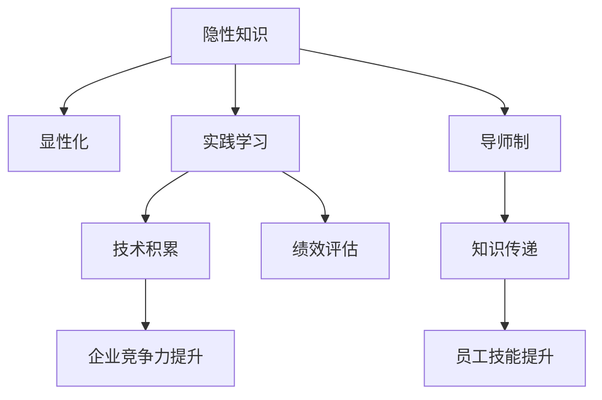

                 

# 知识的隐性传递：导师制与实践学习

> 关键词：知识传递,导师制,实践学习,隐性知识,显性化,绩效评估,技术积累

## 1. 背景介绍

### 1.1 问题由来

在快速变化的数字化时代，知识更新速度前所未有。对于企业而言，保持技术领先和创新能力是应对市场竞争的关键。然而，知识的不良传递机制却限制了这一能力的发挥。传统教科书、文档和文章等显性知识传承方式，尽管传递效率高，但往往缺乏深度和即时性。相比之下，实践学习与导师制则能够通过隐性知识传递，有效提升员工的技能和绩效。

当前，越来越多的企业开始重视知识传递中的隐性部分，并通过导师制和实践学习等形式加以落实。如何在企业内建立有效的知识传递机制，提高员工的技术积累和绩效，成为当前人力资源管理的核心课题。

### 1.2 问题核心关键点

- 隐性知识与显性知识：知识分为显性和隐性两种。显性知识可以通过文字、图像等方式直观传递，而隐性知识则包含了实践技能、经验、判断等难以言传的内容。
- 导师制：通过资深员工指导新手，以实践和经验传授知识的方式，帮助新手快速适应工作环境和角色。
- 实践学习：通过真实项目和操作，使员工在实践中学习和积累，加深对知识的理解。
- 绩效评估：通过科学合理的评估方式，保证知识传递效果和员工提升路径的透明化、可追踪化。
- 技术积累：通过持续学习和积累，提升企业整体技术水平和竞争力。

## 2. 核心概念与联系

### 2.1 核心概念概述

为了更好地理解导师制与实践学习的核心概念，我们将它们与其他相关概念建立联系，并绘制成Mermaid流程图。



该图展示了隐性知识和显性化、实践学习、导师制、技术积累、绩效评估、知识传递和员工技能提升等概念之间的逻辑关系。

### 2.2 核心概念原理和架构

#### 2.2.1 隐性知识与显性化

隐性知识是实践经验和直觉判断的总和，往往难以通过语言文字明确表达。显性化是将隐性知识转化为易于传递和理解的形式，如案例分析、流程图、模板等。

#### 2.2.2 实践学习

实践学习强调在实际工作环境中学习和成长，通过动手实践巩固所学知识，提升解决问题的能力。与传统教育相比，实践学习更加贴近实际需求，提升学习效率和效果。

#### 2.2.3 导师制

导师制通过资深员工指导新手，传授经验和技能。导师制需要建立良好的沟通机制和信任基础，确保知识传递的连续性和有效性。

#### 2.2.4 绩效评估

绩效评估是衡量知识传递和实践学习效果的工具。通过评估员工的表现和成果，发现知识传递中的不足，并指导改进。

#### 2.2.5 技术积累

技术积累是持续学习和实践的结果，通过不断积累和改进，提升企业的整体技术水平。技术积累不仅包括技术工具和代码库，还涉及流程和规范的优化。

## 3. 核心算法原理 & 具体操作步骤

### 3.1 算法原理概述

导师制与实践学习的核心算法原理可以归纳为知识传递模型，通过导师与学员之间的互动，实现知识从隐性到显性的传递和应用。具体来说，知识传递模型包括以下步骤：

1. 导师根据学员需求和任务，选择适合的显性化材料进行讲解和示范。
2. 学员在实践中应用所学知识，进行实际操作。
3. 导师通过观察和反馈，发现学员在操作中的不足，并给予指导和纠正。
4. 学员不断改进，直至掌握所学知识，形成自己的技术积累。
5. 通过绩效评估，衡量知识传递效果，反馈至导师和学员，优化知识传递过程。

### 3.2 算法步骤详解

#### 3.2.1 准备工作

1. **选择导师和学员**：根据任务需求和学员背景，选择适合的导师和学员。导师应具备丰富经验和高度责任心，学员应具备学习能力和积极态度。
2. **明确任务和目标**：定义明确的任务目标和评估标准，确保双方对知识传递和实践学习有共同的理解。
3. **准备学习材料**：导师应准备相应的显性化材料，如案例、文档、流程图等，帮助学员理解复杂任务。

#### 3.2.2 知识传递

1. **知识讲解**：导师通过面对面的讲解或远程会议，传授任务相关的显性化知识。
2. **示范操作**：导师进行示范操作，展示实际应用中的关键步骤和技能。
3. **学员实践**：学员在导师指导下，进行实际操作，逐步掌握任务技能。

#### 3.2.3 反馈与改进

1. **观察与记录**：导师通过观察学员操作，记录其表现和不足。
2. **即时反馈**：导师在学员操作过程中，提供即时反馈和指导，帮助学员纠正错误。
3. **总结与改进**：导师在学员实践结束后，总结其表现，提出改进建议。

#### 3.2.4 绩效评估

1. **设定评估标准**：根据任务目标，设定明确的评估标准，如完成时间、质量指标、创新点等。
2. **过程评估**：在实践过程中，通过定期检查和阶段性评估，衡量学员的学习进度和效果。
3. **结果评估**：通过最终成果的评审和测试，评估学员的实践效果和知识掌握程度。

### 3.3 算法优缺点

#### 3.3.1 优点

1. **深度学习**：导师制和实践学习能够深入挖掘隐性知识，提供更全面、具体和个性化的指导。
2. **提升效率**：通过实际操作和即时反馈，学员能够快速掌握技能，缩短学习周期。
3. **强化记忆**：实践操作加深学员对知识的理解和记忆，提升学习效果。
4. **绩效透明**：通过科学评估，确保知识传递效果的透明化和可追踪化。

#### 3.3.2 缺点

1. **依赖关系**：知识传递依赖导师和学员之间的互动，一旦关系紧张，效果可能受到影响。
2. **资源消耗**：实践学习和导师制需要大量时间和人力资源，可能导致成本高昂。
3. **过程复杂**：知识传递过程复杂，需要细致的规划和管理，否则容易失控。

### 3.4 算法应用领域

导师制与实践学习不仅适用于软件工程和IT领域，还广泛应用于制造、医疗、金融、教育等多个行业。以下是几个典型应用场景：

- **软件开发**：通过导师和代码评审，帮助新手快速掌握编程语言和工具，提升代码质量。
- **制造生产**：通过现场操作和指导，提升新手的操作技能和生产效率。
- **医疗诊断**：通过导师的案例分析和操作演示，帮助实习生掌握临床技能，提升诊断准确性。
- **金融交易**：通过导师的实时指导和模拟交易，帮助新手熟悉市场动态和交易策略。
- **教育培训**：通过导师的课程设计和实践指导，提升学生的学习效果和实践能力。

## 4. 数学模型和公式 & 详细讲解 & 举例说明

### 4.1 数学模型构建

导师制与实践学习的数学模型可以表示为：

$$
P = f(S, E, L)
$$

其中：
- $P$ 表示知识传递效果，可以是技能掌握程度、项目完成质量等。
- $S$ 表示学员背景和任务需求。
- $E$ 表示导师的知识和经验。
- $L$ 表示知识传递过程中的互动和学习材料。

### 4.2 公式推导过程

知识传递效果 $P$ 的推导过程如下：

$$
P = \alpha_S \cdot \alpha_E \cdot \alpha_L
$$

其中：
- $\alpha_S$ 表示学员背景和任务需求的权重系数。
- $\alpha_E$ 表示导师的知识和经验的权重系数。
- $\alpha_L$ 表示知识传递过程中的互动和学习材料的权重系数。

### 4.3 案例分析与讲解

假设某企业要培训新员工进行自动化流程开发。企业选定一位资深开发人员作为导师，根据新员工的背景和任务需求，制定了详细的培训计划。导师在每周三次的培训会上讲解自动化流程的显性化知识，并通过示范操作展示关键步骤。每次培训后，导师会对新员工的操作进行观察和反馈，记录其不足并提出改进建议。最终，通过绩效评估，企业发现新员工在自动化流程开发中的表现达到了预期标准。

## 5. 项目实践：代码实例和详细解释说明

### 5.1 开发环境搭建

#### 5.1.1 环境准备

1. **选择开发平台**：选择适合企业环境的开发平台，如企业级开发工具、云平台等。
2. **安装依赖库**：安装必要的依赖库，如IDE、版本控制系统、CI/CD工具等。
3. **配置环境变量**：设置环境变量，确保开发工具能够正常运行。

#### 5.1.2 环境优化

1. **性能优化**：使用高效的编程语言和框架，减少开发时间。
2. **安全性优化**：确保开发环境的安全性，防止数据泄露和攻击。
3. **可扩展性优化**：设计模块化和可扩展的架构，支持未来技术升级和扩展。

### 5.2 源代码详细实现

#### 5.2.1 代码框架

以下是导师制与实践学习代码框架的示例：

```python
class Mentor:
    def __init__(self, knowledge, experience):
        self.knowledge = knowledge
        self.experience = experience
    
    def explain(self, task, student):
        # 讲解任务相关知识
        pass
    
    def demonstrate(self, task, student):
        # 示范操作
        pass
    
    def feedback(self, task, student):
        # 观察和记录学员操作，提供即时反馈
        pass
    
    def summarize(self, task, student):
        # 总结学员表现，提出改进建议
        pass

class Student:
    def __init__(self, background, task):
        self.background = background
        self.task = task
    
    def practice(self, mentor, task):
        # 实践操作
        pass
    
    def evaluate(self, task):
        # 绩效评估
        pass

# 使用示例
mentor = Mentor(knowledge, experience)
student = Student(background, task)
mentor.explain(task, student)
mentor.demonstrate(task, student)
student.practice(mentor, task)
mentor.feedback(task, student)
mentor.summarize(task, student)
student.evaluate(task)
```

#### 5.2.2 代码实现细节

- **Mentor类**：封装导师的相关知识、经验和操作，提供知识讲解、示范操作、即时反馈和总结改进的功能。
- **Student类**：封装学员的背景、任务和操作，提供实践操作和绩效评估的功能。
- **具体实现**：在Mentor类和Student类中，实现具体的讲解、示范、反馈和总结等功能，确保知识传递效果的透明化和可追踪化。

### 5.3 代码解读与分析

通过代码框架，我们可以看到导师制与实践学习的基本流程：

1. **知识讲解和示范操作**：导师通过Mentor类的explain和demonstrate方法，向学员讲解知识和示范操作。
2. **学员实践**：学员通过Student类的practice方法，进行实际操作。
3. **导师反馈**：导师通过Mentor类的feedback方法，观察学员操作并提供即时反馈。
4. **总结改进**：导师通过Mentor类的summarize方法，总结学员表现并提出改进建议。
5. **绩效评估**：学员通过Student类的evaluate方法，进行绩效评估。

### 5.4 运行结果展示

通过上述代码实现，可以展示导师制与实践学习的实际效果。例如，在自动化流程开发培训中，学员在经过导师的讲解和示范操作后，逐步掌握了关键技能，并在实际操作中不断改进。最终，通过绩效评估，学员达到了预期的培训效果，企业也提升了整体的技术水平。

## 6. 实际应用场景

### 6.1 软件开发

在软件开发中，导师制和实践学习可以有效提升新员工的技能和代码质量。通过资深开发人员的指导和代码评审，新手可以快速掌握编程语言和工具，提升编码能力。

### 6.2 制造生产

在制造生产中，通过现场操作和指导，新手可以快速掌握操作技能和生产流程，提升生产效率和质量。导师制和实践学习可以缩短新手的适应期，提高生产线的稳定性和灵活性。

### 6.3 医疗诊断

在医疗诊断中，通过导师的案例分析和操作演示，实习生可以快速掌握临床技能，提升诊断准确性。导师制和实践学习可以确保诊断过程中技术和流程的标准化。

### 6.4 金融交易

在金融交易中，通过导师的实时指导和模拟交易，新手可以熟悉市场动态和交易策略，提升交易决策能力。导师制和实践学习可以降低交易风险，提高企业的盈利能力。

### 6.5 教育培训

在教育培训中，通过导师的课程设计和实践指导，学生可以提升学习效果和实践能力，掌握基础知识和技能。导师制和实践学习可以增强教学互动性，提高学生的学习动力和效率。

## 7. 工具和资源推荐

### 7.1 学习资源推荐

#### 7.1.1 在线学习平台

- Coursera、Udacity等平台提供大量与导师制和实践学习相关的课程，涵盖软件开发、制造生产、医疗诊断、金融交易、教育培训等多个领域。
- edX、LinkedIn Learning等平台提供实战案例和视频教程，帮助学员深入理解知识传递和实践学习的具体应用。

#### 7.1.2 书籍和论文

- 《导师制与实践学习：一种有效的知识传递方式》：详细介绍了导师制和实践学习的基本原理和实施步骤。
- 《知识传递与学习评估：基于数据的教学改进》：分析了知识传递和实践学习的效果评估方法，提供了科学的评估标准和工具。

### 7.2 开发工具推荐

#### 7.2.1 开发平台

- GitLab、JIRA等平台支持代码管理和项目协作，适合团队开发和导师制管理。
- Confluence、Notion等平台支持文档和知识库管理，方便导师和学员进行知识共享和检索。

#### 7.2.2 开发工具

- VS Code、IntelliJ IDEA等IDE支持高效的开发和调试，提升开发效率和质量。
- Docker、Kubernetes等容器化工具支持环境隔离和资源管理，方便部署和扩展。

### 7.3 相关论文推荐

#### 7.3.1 导师制研究

- "A Study on the Effectiveness of Mentorship in Software Development"：分析了导师制在软件开发中的应用效果和改进建议。
- "Mentorship Training: Building Knowledge Transfer and Professional Development"：介绍了导师制在专业发展中的作用和实施策略。

#### 7.3.2 实践学习研究

- "Practical Learning in Technology Education: A Review of Research"：总结了实践学习在技术教育中的应用效果和研究进展。
- "The Role of Practice in Learning and Teaching"：探讨了实践学习在教学中的重要性，提供了实践学习的具体方法和案例。

## 8. 总结：未来发展趋势与挑战

### 8.1 研究成果总结

导师制与实践学习在知识传递和员工技能提升方面取得了显著成效，得到了广泛应用。然而，仍面临一些挑战，如知识传递的不稳定性、资源消耗的高成本、过程复杂的管理等。未来需要在这些方面进行进一步的研究和改进。

### 8.2 未来发展趋势

1. **技术驱动**：随着AI和大数据技术的进步，知识传递将更加智能化和数据化，提升知识传递的效率和效果。
2. **平台化发展**：企业内部和跨企业之间的知识共享平台将得到普及，形成开放、协作的知识传递生态。
3. **个性化定制**：根据员工背景和需求，提供个性化定制的培训方案和导师匹配，提升知识传递的针对性和效果。
4. **绩效透明化**：通过科学合理的评估方法，确保知识传递效果的透明化和可追踪化，帮助企业优化人力资源管理。
5. **技术积累**：持续的知识传递和学习将促进技术积累和创新，提升企业的整体技术水平和市场竞争力。

### 8.3 面临的挑战

1. **知识传递的不稳定性**：知识传递依赖导师和学员之间的互动，关系紧张或导师知识不足可能导致效果不佳。
2. **资源消耗高**：实践学习和导师制需要大量时间和人力资源，可能导致成本高昂。
3. **过程复杂**：知识传递过程复杂，需要细致的规划和管理，否则容易失控。
4. **绩效评估困难**：知识传递效果的评估复杂，难以量化和透明化。

### 8.4 研究展望

未来的研究应重点关注以下几个方向：

1. **知识传递模型优化**：通过改进知识传递模型，提升知识传递的稳定性和效率。
2. **知识传递技术创新**：利用AI和大数据技术，实现知识传递的自动化和智能化。
3. **知识传递效果评估**：开发科学的评估方法和工具，确保知识传递效果的透明化和可追踪化。
4. **知识传递平台建设**：构建开放、协作的知识传递平台，促进知识共享和创新。
5. **知识传递与技术积累结合**：将知识传递和实践学习与技术积累相结合，形成持续学习和创新机制。

通过这些研究方向的探索，可以不断提升知识传递的效率和效果，促进员工技能提升和绩效改进，推动企业的技术创新和竞争力提升。

## 9. 附录：常见问题与解答

### 9.1 常见问题

**Q1: 为什么导师制和实践学习在知识传递中效果显著？**

**A1:** 导师制和实践学习通过面对面的互动和实际操作，能够深入挖掘隐性知识，提升学员的技能和理解能力。这种基于实践的学习方式，使得知识传递更加具体、生动和实用，能够有效提升学员的学习效果和绩效。

**Q2: 如何选择合适的导师和学员？**

**A2:** 选择合适的导师和学员是知识传递的关键。导师应具备丰富的经验和高度责任心，学员应具备学习能力和积极态度。通过双方的初步沟通和评估，确保知识传递的适宜性和有效性。

**Q3: 如何设计导师制和实践学习的流程？**

**A3:** 设计导师制和实践学习的流程需要细致的规划和管理。首先，明确任务和目标，选择适合的显性化材料和操作示范。其次，在实践过程中，进行即时反馈和总结改进。最后，通过绩效评估，衡量知识传递效果，进行优化和改进。

**Q4: 如何确保知识传递效果的透明化和可追踪化？**

**A4:** 确保知识传递效果的透明化和可追踪化，需要进行科学的绩效评估。设定明确的评估标准，通过定期检查和阶段性评估，衡量学员的表现和成果。评估结果应透明公开，反馈至导师和学员，优化知识传递过程。

**Q5: 如何提升知识传递的效率和效果？**

**A5:** 提升知识传递的效率和效果，需要利用技术手段进行优化。使用知识管理平台、自动化工具和数据分析方法，提升知识传递的智能化和数据化水平。同时，通过持续学习和反馈机制，确保知识传递的持续改进和优化。

### 9.2 问题解答

通过对这些常见问题的解答，可以帮助企业更好地理解和实施导师制与实践学习，提升知识传递的效果和员工绩效。相信在未来的发展中，导师制与实践学习将继续发挥重要作用，推动企业的技术创新和人才发展。

---

作者：禅与计算机程序设计艺术 / Zen and the Art of Computer Programming

