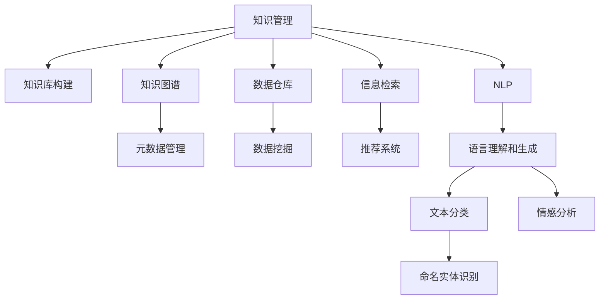

                 

# 知识管理与知识发现：企业智能化的双翼

> 关键词：知识管理, 知识发现, 企业智能化, 人工智能, 机器学习, 数据挖掘, 数据仓库, 信息检索

## 1. 背景介绍

### 1.1 问题由来
在当今快速变化和信息爆炸的时代，企业面临着前所未有的挑战。如何高效地管理、发现和利用知识，成为企业保持竞争力的关键。知识管理（Knowledge Management, KM）和知识发现（Knowledge Discovery, KD）作为企业智能化的两大核心引擎，对于提升企业决策效率、优化运营流程、推动创新等方面具有不可替代的作用。

知识管理主要涉及知识的获取、存储、组织、分享和应用，旨在为企业提供一种结构化的知识体系，便于员工检索和使用。而知识发现则通过数据挖掘和机器学习等技术，从大量数据中提炼出有价值的知识模式和规律，帮助企业洞察趋势、预测未来。

在信息技术日新月异的背景下，知识管理和知识发现技术正在不断地演化和进步，成为推动企业智能化发展的重要力量。本文将全面介绍知识管理与知识发现的理论基础、核心算法、实际应用及未来趋势，帮助读者深入理解这一领域的关键技术，并探讨其在企业智能化中的应用价值。

### 1.2 问题核心关键点
知识管理与知识发现的核心关键点包括以下几点：

- **知识表示与建模**：如何通过算法和工具将知识结构化，便于存储、检索和应用。
- **数据挖掘与机器学习**：如何从数据中提取有价值的知识模式和规律，支持企业决策。
- **自然语言处理（NLP）**：如何通过语言理解和生成技术，实现对文本信息的深度处理和应用。
- **信息检索与推荐系统**：如何构建高效的信息检索系统，提供个性化知识推荐，促进知识共享。
- **知识图谱与语义网络**：如何构建知识图谱，将知识结构化表示，便于机器理解和推理。
- **交互式知识发现**：如何通过交互式界面和工具，帮助用户直观地发现知识，促进知识的有效应用。

### 1.3 问题研究意义
深入研究知识管理与知识发现技术，对于提升企业的决策效率、优化运营流程、推动创新等方面具有重要意义：

- **提高决策效率**：通过从历史数据和经验中提取知识，帮助企业快速做出更为科学、准确的决策。
- **优化运营流程**：通过知识共享和协作，提高企业的运营效率，降低运营成本。
- **推动创新发展**：基于知识发现的新型应用和产品，驱动企业的技术创新和业务创新。
- **提升竞争力**：通过知识管理与知识发现，不断优化知识体系，增强企业在市场中的竞争力。

## 2. 核心概念与联系

### 2.1 核心概念概述

为更好地理解知识管理与知识发现的理论基础和核心算法，本节将介绍几个密切相关的核心概念：

- **知识管理（Knowledge Management, KM）**：通过知识获取、存储、组织、共享和应用，提高企业决策效率和运营效率。主要涵盖知识库构建、知识图谱、元数据管理等技术。

- **知识发现（Knowledge Discovery, KD）**：从大量数据中提取有价值的知识模式和规律，支持企业决策和业务创新。主要涉及数据挖掘、机器学习、信息检索等技术。

- **数据仓库（Data Warehouse）**：企业级数据存储和管理系统，通过数据仓库技术，集中存储和处理企业业务数据，为知识发现提供数据支持。

- **信息检索（Information Retrieval）**：从大量数据中检索出与用户查询相关的信息，提升信息获取效率。主要涉及倒排索引、向量空间模型等技术。

- **推荐系统（Recommendation System）**：基于用户的历史行为数据，推荐个性化的内容或产品，提升用户体验。主要涉及协同过滤、矩阵分解等算法。

- **自然语言处理（Natural Language Processing, NLP）**：通过语言理解和生成技术，处理和应用文本数据。主要涉及分词、词性标注、命名实体识别等技术。

这些核心概念之间的逻辑关系可以通过以下Mermaid流程图来展示：



这个流程图展示了一个典型的企业知识管理系统，从知识库构建到数据仓库、信息检索、推荐系统、NLP等技术，形成了较为完整的知识管理与知识发现框架。

## 3. 核心算法原理 & 具体操作步骤
### 3.1 算法原理概述

知识管理与知识发现的核心算法主要涉及数据挖掘、机器学习、信息检索等领域。其核心思想是通过算法和工具，从数据中提炼出有价值的知识，形成结构化的知识体系，便于企业应用和共享。

知识发现的典型算法包括：

- **关联规则学习**：从事务数据库中发现频繁项集和关联规则，如Apriori算法。
- **分类与回归**：从有标注数据中学习分类模型和回归模型，如决策树、随机森林、支持向量机等。
- **聚类分析**：从未标注数据中发现相似的群体或模式，如K-means、层次聚类等。
- **序列模式挖掘**：从时序数据中发现序列模式和趋势，如AprioriTP、FP-Growth等。
- **异常检测**：从数据中发现异常点和离群值，如孤立森林、DBSCAN等。

知识管理的典型算法包括：

- **元数据管理**：对知识库中的数据进行元数据管理，如RDF、Ontology等。
- **知识抽取**：从非结构化数据中提取结构化知识，如实体抽取、关系抽取等。
- **知识可视化**：将知识以图形方式呈现，便于用户理解和应用，如Gephi、Tableau等。

### 3.2 算法步骤详解

以关联规则学习算法为例，具体介绍知识发现的算法步骤：

**Step 1: 数据预处理**

1. 收集数据，并将其转换为适合挖掘的形式，如事务数据库、关系数据库等。
2. 对数据进行清洗，去除噪声和无关数据，确保数据质量。

**Step 2: 频繁项集挖掘**

1. 扫描数据集，统计每个项集的频率，得到一个频繁项集列表。
2. 根据最小支持度阈值，筛选出频繁项集。

**Step 3: 关联规则生成**

1. 对于每个频繁项集，生成所有的关联规则。
2. 根据置信度阈值，筛选出可信的关联规则。

**Step 4: 规则评估与优化**

1. 对生成的关联规则进行评估，如精度、召回率等。
2. 对低置信度的规则进行优化，如剪枝、合并等。

**Step 5: 规则应用**

1. 将优化后的关联规则应用到实际业务中，如推荐系统、个性化广告等。

以知识抽取算法为例，具体介绍知识管理的算法步骤：

**Step 1: 数据获取**

1. 从企业内部系统、公开数据源等渠道获取知识源数据。
2. 对获取的数据进行格式转换和清洗，确保数据一致性。

**Step 2: 实体抽取**

1. 使用NLP技术，识别出文本中的命名实体，如人名、地名、组织名等。
2. 对实体进行类型标注，如人、组织、地点、时间等。

**Step 3: 关系抽取**

1. 使用NLP技术，识别出实体之间的语义关系，如“在...工作”、“属于...”等。
2. 对关系进行标注，如主语、宾语、属性等。

**Step 4: 知识图谱构建**

1. 将抽取的实体和关系构建成知识图谱，形成一个结构化的知识体系。
2. 对知识图谱进行推理和验证，确保其正确性和完整性。

**Step 5: 知识应用**

1. 将构建的知识图谱应用于实际业务中，如信息检索、推荐系统、决策支持等。
2. 对知识图谱进行定期更新和维护，确保其时效性。

### 3.3 算法优缺点

知识管理与知识发现算法具有以下优点：

- **高效性**：通过算法和工具，可以高效地从大量数据中提取有价值的知识，降低人工成本。
- **准确性**：算法模型经过训练和优化，能够准确地发现知识模式和规律，提供可靠的决策支持。
- **可扩展性**：算法和工具具有良好的可扩展性，可以应用于不同规模和复杂度的企业。

同时，这些算法也存在一定的局限性：

- **数据依赖性**：算法的性能很大程度上依赖于数据的质量和数量，高质量数据的获取成本较高。
- **算法复杂性**：一些高级算法（如深度学习）需要大量计算资源和时间，复杂度较高。
- **结果解释性**：一些算法的输出结果难以解释，用户难以理解和应用。
- **模型鲁棒性**：部分算法对噪声和异常值敏感，鲁棒性有待提高。

尽管存在这些局限性，但就目前而言，知识管理与知识发现算法在企业智能化应用中发挥着重要作用，成为推动企业数据驱动决策的重要手段。未来相关研究需要进一步优化算法性能，降低对数据的依赖，提高算法的可解释性和鲁棒性。

### 3.4 算法应用领域

知识管理与知识发现技术在众多领域中得到了广泛应用，如金融、医疗、零售、制造等，具体应用包括：

- **金融风控**：通过数据分析和模型构建，预测信用风险、欺诈行为，提高金融决策效率。
- **医疗诊断**：利用NLP和知识图谱技术，分析病历数据，提供诊断建议，提升医疗服务质量。
- **零售推荐**：基于用户行为数据和商品特征，构建推荐模型，提升用户购物体验。
- **制造流程优化**：通过数据分析和机器学习，优化生产流程，提高生产效率和产品质量。
- **物流配送**：利用数据挖掘和优化算法，优化配送路线，降低物流成本，提高配送效率。

此外，知识管理与知识发现技术在企业信息化建设、业务流程自动化、智能客服等领域也得到了广泛应用，成为企业智能化转型的重要引擎。

## 4. 数学模型和公式 & 详细讲解  
### 4.1 数学模型构建

知识管理与知识发现的数学模型主要涉及概率统计、图论、优化算法等领域。以下以关联规则学习为例，介绍其数学模型构建。

关联规则学习的基本数学模型为项集支持度矩阵 $S$，其中 $S_{ij} = f(A_i \cap B_j)$ 表示项集 $A_i$ 和 $B_j$ 的交集在数据集中的支持度。设数据集为 $D = \{T_1, T_2, ..., T_n\}$，其中 $T_i$ 为一条事务记录，包含若干项。

**Step 1: 数据预处理**

1. 构建事务数据库，每个事务记录对应一条记录，每个记录包含若干项。
2. 对事务数据库进行统计，统计每个项集的频率，得到支持度矩阵 $S$。

**Step 2: 频繁项集挖掘**

1. 扫描支持度矩阵 $S$，统计每个项集的频率，得到一个频繁项集列表 $L$。
2. 根据最小支持度阈值 $minSup$，筛选出频繁项集。

**Step 3: 关联规则生成**

1. 对于每个频繁项集，生成所有的关联规则。
2. 根据置信度阈值 $minConf$，筛选出可信的关联规则。

**Step 4: 规则评估与优化**

1. 对生成的关联规则进行评估，如精度、召回率等。
2. 对低置信度的规则进行优化，如剪枝、合并等。

**Step 5: 规则应用**

1. 将优化后的关联规则应用到实际业务中，如推荐系统、个性化广告等。

### 4.2 公式推导过程

以下以Apriori算法为例，推导其核心公式的推导过程。

假设事务数据库 $D$ 中有 $n$ 条记录，每条记录包含 $m$ 个项，设最小支持度为 $minSup$，最小置信度为 $minConf$。

**Step 1: 频繁项集挖掘**

1. 对事务数据库进行扫描，统计每个项集的频率，得到一个支持度矩阵 $S$。
2. 根据最小支持度 $minSup$，筛选出频繁项集 $L_1$。

**Step 2: 关联规则生成**

1. 对于每个频繁项集，生成所有的关联规则。例如，对于频繁项集 $A$，生成规则 $A \rightarrow B$，其中 $B$ 为 $A$ 的子集。
2. 根据最小置信度 $minConf$，筛选出可信的关联规则。例如，对于规则 $A \rightarrow B$，如果 $sup(A \cup B) / sup(A) \geq minConf$，则该规则可信。

**Step 3: 规则评估与优化**

1. 对生成的关联规则进行评估，如精度、召回率等。例如，对于规则 $A \rightarrow B$，其精度 $precision = sup(A \cup B) / (sup(A) + sup(B))$。
2. 对低置信度的规则进行优化，如剪枝、合并等。例如，对于规则 $A \rightarrow B$，如果 $sup(A \cup B) / sup(A) < minConf$，则剪枝。

**Step 4: 规则应用**

1. 将优化后的关联规则应用到实际业务中，如推荐系统、个性化广告等。

### 4.3 案例分析与讲解

以某电子商务网站的用户行为数据分析为例，展示知识发现的实际应用。

**Step 1: 数据预处理**

1. 收集网站用户的浏览、购买、评价等行为数据，构建事务数据库。
2. 对事务数据库进行清洗，去除噪声和无关数据。

**Step 2: 频繁项集挖掘**

1. 对清洗后的数据库进行扫描，统计每个项集的频率，得到一个支持度矩阵 $S$。
2. 根据最小支持度 $minSup$，筛选出频繁项集 $L_1$，如浏览某类产品的用户。

**Step 3: 关联规则生成**

1. 对于每个频繁项集，生成所有的关联规则。例如，对于频繁项集 $A = \{产品1, 产品2\}$，生成规则 $A \rightarrow 产品3$。
2. 根据最小置信度 $minConf$，筛选出可信的关联规则。例如，对于规则 $A \rightarrow 产品3$，如果 $sup(A \cup 产品3) / sup(A) \geq minConf$，则该规则可信。

**Step 4: 规则评估与优化**

1. 对生成的关联规则进行评估，如精度、召回率等。例如，对于规则 $A \rightarrow 产品3$，其精度 $precision = sup(A \cup 产品3) / (sup(A) + sup(产品3))$。
2. 对低置信度的规则进行优化，如剪枝、合并等。例如，对于规则 $A \rightarrow 产品3$，如果 $sup(A \cup 产品3) / sup(A) < minConf$，则剪枝。

**Step 5: 规则应用**

1. 将优化后的关联规则应用到实际业务中，如推荐系统、个性化广告等。例如，对于规则 $A \rightarrow 产品3$，向浏览过产品1和产品2的用户推荐产品3。

## 5. 项目实践：代码实例和详细解释说明
### 5.1 开发环境搭建

在进行知识管理与知识发现项目开发前，我们需要准备好开发环境。以下是使用Python进行Pandas和Scikit-learn开发的环境配置流程：

1. 安装Anaconda：从官网下载并安装Anaconda，用于创建独立的Python环境。

2. 创建并激活虚拟环境：
```bash
conda create -n km-env python=3.8 
conda activate km-env
```

3. 安装Pandas：
```bash
conda install pandas
```

4. 安装Scikit-learn：
```bash
conda install scikit-learn
```

5. 安装其他必要的工具包：
```bash
pip install numpy matplotlib jupyter notebook ipython
```

完成上述步骤后，即可在`km-env`环境中开始项目实践。

### 5.2 源代码详细实现

下面我们以Apriori算法为例，给出使用Pandas和Scikit-learn对关联规则进行挖掘的Python代码实现。

```python
import pandas as pd
from apriori import apriori
from mlxtend.frequent_patterns import association_rules

# 读取事务数据库
data = pd.read_csv('transactions.csv', header=None, sep='\t')

# 构建事务数据
items = data.values.tolist()

# 使用Apriori算法挖掘频繁项集
frequent_items = apriori(items, min_support=0.01, use_colnames=True)

# 生成关联规则
rules = association_rules(frequent_items, metric='confidence', min_threshold=0.8)

# 输出关联规则
rules.head()
```

以上代码实现了使用Pandas和Scikit-learn对关联规则进行挖掘的完整流程。

### 5.3 代码解读与分析

让我们再详细解读一下关键代码的实现细节：

**读取事务数据库**：
- 使用Pandas的`read_csv`函数，读取名为`transactions.csv`的事务数据库，并将其转换为DataFrame格式。

**构建事务数据**：
- 将DataFrame中的数据转换为列表格式，以便Apriori算法处理。

**使用Apriori算法挖掘频繁项集**：
- 调用`apriori`函数，传入事务数据、最小支持度等参数，得到频繁项集。

**生成关联规则**：
- 使用`association_rules`函数，传入频繁项集、置信度等参数，得到关联规则。

**输出关联规则**：
- 调用`head`函数，输出关联规则的前几行，以便查看结果。

通过上述代码，我们可以快速地对关联规则进行挖掘和分析，并应用于实际业务中。

## 6. 实际应用场景
### 6.1 智能客服系统

基于知识管理与知识发现技术，智能客服系统可以实现自动化服务，提升客户体验。传统客服往往需要配备大量人力，高峰期响应缓慢，且一致性和专业性难以保证。通过构建知识库和关联规则，智能客服系统可以自动理解用户意图，匹配最合适的答案模板进行回复。

具体而言，可以收集企业内部的历史客服对话记录，将问题和最佳答复构建成监督数据，在此基础上对知识库进行更新和优化。智能客服系统在用户咨询时，首先对问题进行语义分析，然后匹配知识库中的规则和答案模板，生成个性化回复。对于用户提出的新问题，还可以接入检索系统实时搜索相关内容，动态组织生成回答。如此构建的智能客服系统，能大幅提升客户咨询体验和问题解决效率。

### 6.2 金融风控

金融机构需要实时监测市场舆论动向，以便及时应对负面信息传播，规避金融风险。传统的人工监测方式成本高、效率低，难以应对网络时代海量信息爆发的挑战。通过构建知识库和关联规则，金融风控系统可以自动监测不同领域的舆情变化趋势，一旦发现负面信息激增等异常情况，系统便会自动预警，帮助金融机构快速应对潜在风险。

具体而言，可以收集金融领域相关的新闻、报道、评论等文本数据，并对其进行主题标注和情感标注。在此基础上对知识库进行更新和优化，构建基于知识发现的风控模型。该模型能够从文本数据中自动识别出异常舆情，如市场波动、信用风险、欺诈行为等，并及时发出警报，提升风控决策的效率和准确性。

### 6.3 零售推荐系统

当前的推荐系统往往只依赖用户的历史行为数据进行物品推荐，无法深入理解用户的真实兴趣偏好。通过知识管理与知识发现技术，推荐系统可以更好地挖掘用户行为背后的语义信息，从而提供更精准、多样的推荐内容。

具体而言，可以收集用户浏览、点击、评论、分享等行为数据，提取和用户交互的物品标题、描述、标签等文本内容。将文本内容作为知识源，构建知识库，使用关联规则学习算法，分析用户行为模式，推荐个性化商品。通过构建关联规则，推荐系统能够识别出用户对某类商品或活动的偏好，实现更加精准的推荐。

### 6.4 未来应用展望

随着知识管理与知识发现技术的不断发展，未来在更多领域都将得到应用，为传统行业带来变革性影响。

在智慧医疗领域，基于知识发现的新型应用和产品，驱动医疗服务的智能化，如电子病历分析、疾病预测、临床决策支持等，提升医疗服务的质量和效率。

在智能教育领域，知识管理与知识发现技术可以帮助教师更深入地了解学生，个性化教学，因材施教，促进教育公平，提高教学质量。

在智慧城市治理中，构建基于知识发现的城市事件监测、舆情分析、应急指挥系统，提高城市管理的自动化和智能化水平，构建更安全、高效的未来城市。

此外，在企业生产、社会治理、文娱传媒等众多领域，知识管理与知识发现技术也将不断拓展应用，为经济社会发展注入新的动力。

## 7. 工具和资源推荐
### 7.1 学习资源推荐

为了帮助开发者系统掌握知识管理与知识发现的理论基础和实践技巧，这里推荐一些优质的学习资源：

1. 《数据挖掘导论》：书籍介绍数据挖掘的基本概念、常用算法和技术，适合入门学习。

2. 《Python数据科学手册》：书籍详细介绍Pandas、Scikit-learn等数据科学工具的使用方法，适合深入学习。

3. Kaggle竞赛平台：Kaggle是一个著名的数据科学竞赛平台，提供大量真实业务场景下的数据集和挑战，适合实践应用。

4. Coursera《数据科学专项课程》：由多所知名高校联合开设的在线课程，涵盖数据挖掘、机器学习、数据可视化等技术，适合系统学习。

5. 《Deep Learning with Python》：书籍介绍深度学习在数据科学中的应用，适合进一步学习深度学习算法。

通过这些资源的学习实践，相信你一定能够快速掌握知识管理与知识发现的精髓，并用于解决实际的业务问题。

### 7.2 开发工具推荐

高效的开发离不开优秀的工具支持。以下是几款用于知识管理与知识发现开发的常用工具：

1. Pandas：Python中常用的数据分析工具，提供了高效的数据处理和分析功能。

2. Scikit-learn：Python中的机器学习库，包含多种常用算法和工具，适合数据挖掘和建模。

3. Apache Spark：分布式计算框架，支持大规模数据处理和分析，适合大数据场景下的知识发现应用。

4. Apache Hadoop：大数据存储和处理平台，适合构建企业级数据仓库和知识管理系统。

5. Elasticsearch：基于Lucene的开源搜索引擎，适合构建高效的信息检索系统。

6. Apache Solr：与Elasticsearch功能类似，适合构建搜索平台。

合理利用这些工具，可以显著提升知识管理与知识发现任务的开发效率，加快创新迭代的步伐。

### 7.3 相关论文推荐

知识管理与知识发现技术的发展源于学界的持续研究。以下是几篇奠基性的相关论文，推荐阅读：

1. 《数据挖掘导论》（Introduction to Data Mining）：李航，讲述数据挖掘的基本概念和常用算法，是入门级的经典教材。

2. 《信息检索与文本挖掘》（Information Retrieval and Text Mining）：Ferrante等，介绍信息检索和文本挖掘的基本原理和技术。

3. 《关联规则学习》（Association Rule Learning）：Gilbert 和 Yan等，介绍Apriori等关联规则学习算法，是知识发现领域的重要论文。

4. 《基于知识图谱的推荐系统》（Knowledge Graph-Based Recommendation Systems）：Ji和Zheng等，介绍基于知识图谱的推荐系统，是推荐系统领域的经典论文。

5. 《基于深度学习的知识抽取》（Knowledge Extraction with Deep Learning）：Eisner等，介绍深度学习在知识抽取中的应用，是知识管理领域的重要论文。

这些论文代表了大数据管理与知识发现技术的发展脉络，通过学习这些前沿成果，可以帮助研究者把握学科前进方向，激发更多的创新灵感。

## 8. 总结：未来发展趋势与挑战

### 8.1 总结

本文对知识管理与知识发现技术的理论基础和实际应用进行了全面系统的介绍。首先阐述了知识管理与知识发现的理论基础和实际应用场景，明确了其在企业智能化中的重要地位。其次，从原理到实践，详细讲解了知识管理的核心算法和操作步骤，给出了知识发现的任务实现代码实例。同时，本文还广泛探讨了知识管理与知识发现技术在智能客服、金融风控、零售推荐等多个领域的应用前景，展示了其在企业智能化中的应用价值。最后，本文精选了知识管理与知识发现的各类学习资源，力求为读者提供全方位的技术指引。

通过本文的系统梳理，可以看到，知识管理与知识发现技术正在成为企业智能化发展的重要引擎，极大地拓展了数据驱动决策的能力，促进了业务流程优化和创新。未来，伴随知识图谱、深度学习等技术的发展，知识管理与知识发现技术必将迎来更多的突破，为企业的智能化转型提供更强大的技术支撑。

### 8.2 未来发展趋势

展望未来，知识管理与知识发现技术将呈现以下几个发展趋势：

1. **深度学习与知识发现结合**：利用深度学习提升知识抽取和关联规则挖掘的准确性和泛化能力，进一步提升知识发现的效果。

2. **知识图谱的广泛应用**：知识图谱将成为企业知识管理的重要工具，支持更深入的知识推理和应用。

3. **实时化知识发现**：构建实时化知识发现系统，实现对数据流的实时分析和处理，满足企业快速决策的需求。

4. **跨领域知识融合**：将知识管理与知识发现技术与其他领域技术（如自然语言处理、计算机视觉等）相结合，实现跨领域知识的整合和应用。

5. **可解释性与透明度**：增强知识发现算法的可解释性和透明度，便于用户理解和应用。

6. **企业级知识平台**：构建企业级知识管理平台，实现知识的集中存储、共享和应用。

以上趋势凸显了知识管理与知识发现技术的广阔前景，这些方向的探索发展，必将进一步提升企业在智能化转型中的竞争优势，推动企业的数字化和智能化进程。

### 8.3 面临的挑战

尽管知识管理与知识发现技术已经取得了显著进展，但在迈向更加智能化、普适化应用的过程中，仍面临诸多挑战：

1. **数据质量问题**：知识管理与知识发现的效果很大程度上依赖于数据质量，数据不完整、不统一、噪声多等问题是常见难题。

2. **算法复杂性**：部分高级算法（如深度学习）需要大量计算资源和时间，复杂度较高，难以在实时场景中应用。

3. **模型可解释性**：一些算法的输出结果难以解释，用户难以理解和应用，需要进一步增强模型的可解释性。

4. **隐私与安全**：企业级知识管理涉及大量敏感数据，数据隐私和安全问题不容忽视。

5. **跨领域应用难度**：跨领域知识融合和应用具有一定的难度，不同领域的数据结构和语义不一致，难以构建统一的模型。

6. **标准化问题**：企业级知识管理需要制定统一的数据标准和规范，确保知识的一致性和互通性。

正视知识管理与知识发现面临的这些挑战，积极应对并寻求突破，将是大数据管理与知识发现技术迈向成熟的必由之路。相信随着学界和产业界的共同努力，这些挑战终将一一被克服，知识管理与知识发现技术必将迎来更多的突破，为企业的智能化转型提供更强大的技术支撑。

### 8.4 研究展望

面对知识管理与知识发现技术所面临的挑战，未来的研究需要在以下几个方面寻求新的突破：

1. **数据质量提升**：探索高效的数据清洗和预处理方法，提高数据质量和一致性。

2. **算法优化**：开发更加高效、可解释的知识发现算法，增强其在实时场景中的应用能力。

3. **知识融合**：利用知识图谱技术，将跨领域知识进行整合，构建统一的语义空间。

4. **隐私保护**：研究数据隐私保护技术，如差分隐私、联邦学习等，确保知识管理的安全性。

5. **标准化建设**：制定企业级知识管理标准和规范，确保知识的互通和共享。

6. **跨领域应用**：探索跨领域知识融合和应用的方法，推动知识管理与知识发现技术的广泛应用。

这些研究方向的探索，必将引领知识管理与知识发现技术迈向更高的台阶，为企业的智能化转型提供更强大的技术支撑。面向未来，知识管理与知识发现技术还需要与其他人工智能技术进行更深入的融合，如自然语言处理、计算机视觉等，多路径协同发力，共同推动知识管理与知识发现技术的进步。只有勇于创新、敢于突破，才能不断拓展知识管理的边界，让知识驱动决策和创新，成为企业智能化转型的重要引擎。

## 9. 附录：常见问题与解答

**Q1：知识管理与知识发现是否适用于所有企业？**

A: 知识管理与知识发现技术适用于大多数企业，但不同行业、不同规模的企业需要根据自身特点进行定制化应用。例如，大型企业可以构建企业级知识管理系统，而中小型企业可以采用模块化、轻量级的知识管理工具。

**Q2：如何进行知识抽取和关联规则挖掘？**

A: 知识抽取和关联规则挖掘主要涉及自然语言处理和数据挖掘技术。首先，使用自然语言处理技术进行文本预处理，如分词、词性标注、命名实体识别等。然后，使用数据挖掘技术进行频繁项集挖掘和关联规则生成，如Apriori算法、FP-Growth算法等。

**Q3：知识图谱的构建和应用需要注意哪些问题？**

A: 知识图谱的构建和应用需要注意以下几个问题：
1. 数据质量：确保知识源数据的质量和一致性，避免噪声和错误数据。
2. 实体关系定义：明确实体和关系的定义，避免歧义和误解。
3. 图谱扩展：不断更新和扩展知识图谱，保持其时效性和完整性。
4. 查询优化：优化查询算法，提高知识图谱的检索效率。
5. 可视化呈现：利用可视化工具，直观展示知识图谱的结构和关系。

**Q4：知识管理与知识发现的应用场景有哪些？**

A: 知识管理与知识发现技术在多个领域得到了广泛应用，具体应用场景包括：
1. 金融风控：通过数据分析和模型构建，预测信用风险、欺诈行为，提高金融决策效率。
2. 医疗诊断：利用NLP和知识图谱技术，分析病历数据，提供诊断建议，提升医疗服务质量。
3. 零售推荐：基于用户行为数据和商品特征，构建推荐模型，提升用户购物体验。
4. 制造流程优化：通过数据分析和机器学习，优化生产流程，提高生产效率和产品质量。
5. 物流配送：利用数据挖掘和优化算法，优化配送路线，降低物流成本，提高配送效率。

**Q5：如何构建高效的信息检索系统？**

A: 构建高效的信息检索系统需要考虑以下几个关键点：
1. 索引构建：选择合适的倒排索引和向量空间模型，高效构建索引。
2. 查询优化：优化查询算法，如布尔查询、向量相似度查询等，提高检索效率。
3. 检索评估：使用评估指标，如召回率、精度等，评估检索效果。
4. 检索应用：将检索系统集成到业务系统中，实现实时检索。

通过合理设计和管理知识管理与知识发现技术，企业可以更好地挖掘和利用知识资源，提升业务效率和决策能力，推动企业智能化转型。

---

作者：禅与计算机程序设计艺术 / Zen and the Art of Computer Programming

