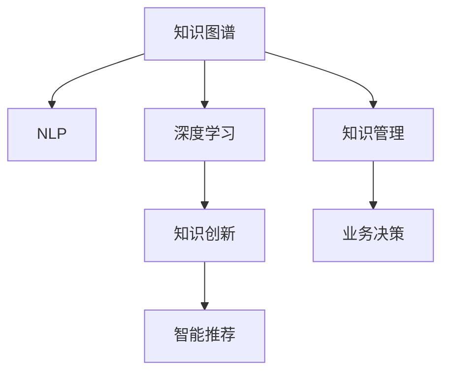

                 

# 知识管理的AI化:从知识获取到知识创新

> 关键词：知识管理,人工智能,知识图谱,自然语言处理,深度学习,知识创新,智能推荐

## 1. 背景介绍

### 1.1 问题由来
在数字化时代，知识和信息已经成为驱动企业创新和社会进步的重要资源。传统的知识管理方式往往依赖人工整理和存储，效率低下且难以扩展。如何自动化地从海量数据中提取、组织、呈现和应用知识，成为一个亟需解决的问题。

人工智能技术的快速发展，尤其是自然语言处理(NLP)和深度学习模型的突破，为知识管理带来了新的可能性。通过AI技术，可以从文本、图片、视频等多种数据源中自动抽取知识实体和关系，构建结构化的知识图谱，辅助决策制定和业务流程优化。

### 1.2 问题核心关键点
当前，知识管理领域的主要挑战包括：
- 数据量大、来源多样，难以自动整合。
- 知识组织和呈现缺乏结构性，难以有效应用。
- 缺乏智能化辅助，知识提取和推理能力不足。
- 知识创新能力薄弱，难以支撑企业创新。

基于上述挑战，AI技术的应用主要聚焦于以下几个方面：
- 自动化知识获取：利用自然语言处理技术从文本中抽取实体和关系。
- 结构化知识组织：构建知识图谱，以结构化方式呈现和查询知识。
- 智能化知识应用：开发推荐系统和决策支持系统，辅助业务决策。
- 知识创新驱动：利用深度学习技术生成新知识，加速创新进程。

## 2. 核心概念与联系

### 2.1 核心概念概述

为更好地理解知识管理的AI化过程，本节将介绍几个密切相关的核心概念：

- **知识图谱(Knowledge Graph)**：由实体、关系、属性组成的知识表示框架，用于结构化存储和查询知识。
- **自然语言处理(Natural Language Processing, NLP)**：利用计算机技术处理和理解人类语言，包括分词、实体识别、关系抽取等。
- **深度学习(Deep Learning)**：一种通过多层次神经网络结构进行特征提取和模型训练的机器学习范式。
- **知识管理(Knowledge Management)**：通过技术手段自动化管理和应用企业内部的知识资源，以支持业务决策和创新。
- **知识创新(Knowledge Innovation)**：利用知识图谱、深度学习等技术生成新知识，推动创新。
- **智能推荐系统(Intelligent Recommendation System)**：根据用户历史行为和偏好，智能推荐相关知识内容。

这些核心概念之间的逻辑关系可以通过以下Mermaid流程图来展示：



这个流程图展示了几类核心概念及其之间的关系：

1. 知识图谱通过NLP技术从文本中抽取实体和关系，构建知识结构。
2. 深度学习模型对知识图谱进行进一步特征提取和模式学习，支持知识创新。
3. 智能推荐系统基于知识图谱和用户行为数据，推荐相关知识内容，辅助业务决策。
4. 知识管理将知识图谱和推荐系统嵌入业务流程，提升决策效率和创新能力。

这些概念共同构成了知识管理AI化的核心框架，使得AI技术能够从海量数据中抽取和应用知识，支撑企业决策和创新。

## 3. 核心算法原理 & 具体操作步骤
### 3.1 算法原理概述

知识管理的AI化，本质上是通过自然语言处理和深度学习技术，自动化地从文本数据中提取和组织知识，并将其应用于业务决策和创新。其核心思想是：
- 利用NLP技术从海量文本中自动抽取知识实体和关系，构建结构化的知识图谱。
- 利用深度学习模型对知识图谱进行特征提取和模式学习，提升知识推理和创新能力。
- 将知识图谱和推荐系统嵌入业务流程，辅助业务决策和创新应用。

### 3.2 算法步骤详解

知识管理的AI化通常包括以下几个关键步骤：

**Step 1: 数据采集与预处理**
- 收集企业内外部的文本数据，如文档、邮件、网页等。
- 清洗和预处理文本数据，包括去除噪声、分词、停用词过滤等。

**Step 2: 知识抽取与图谱构建**
- 利用NLP技术从预处理后的文本中抽取实体、关系和属性。
- 将这些抽取结果构建成知识图谱，存储为三元组（实体，关系，实体）。

**Step 3: 知识嵌入与图谱扩展**
- 使用深度学习模型对知识图谱进行向量表示，将其转换为向量空间中的点。
- 利用新的知识图谱数据，动态更新向量表示，扩展知识图谱。

**Step 4: 知识推理与创新**
- 在知识图谱上应用图神经网络(Graph Neural Network, GNN)等深度学习模型，进行知识推理和关系扩展。
- 使用生成对抗网络(Generative Adversarial Networks, GANs)等模型，生成新的知识实体和关系，辅助创新。

**Step 5: 知识推荐与决策支持**
- 基于知识图谱和用户行为数据，构建推荐系统，为用户推荐相关知识内容。
- 将知识推荐和图谱嵌入决策支持系统，辅助业务决策。

### 3.3 算法优缺点

知识管理的AI化方法具有以下优点：
1. 自动化抽取和组织知识，提升知识管理效率。
2. 利用深度学习提升知识推理和创新能力，增强企业创新力。
3. 辅助业务决策和知识应用，提升决策质量和效率。
4. 结构化呈现知识，便于检索和应用。

同时，该方法也存在一定的局限性：
1. 数据质量依赖性强，低质量数据影响抽取效果。
2. 模型复杂度高，训练和推理耗时较长。
3. 知识图谱构建和维护成本较高。
4. 推荐系统个性化不足，难以适应多样化需求。

尽管存在这些局限性，但知识管理的AI化方法在实际应用中仍展示了巨大的潜力和价值，已被广泛应用于企业知识管理、智能客服、内容推荐等多个领域。

### 3.4 算法应用领域

知识管理的AI化方法在以下领域具有广泛的应用前景：

- **企业知识管理**：利用AI技术自动化抽取、组织和呈现企业内部的知识资源，提升员工工作效率和知识共享。
- **智能客服**：通过智能推荐和知识图谱，提高客服系统对复杂问题的理解和处理能力。
- **内容推荐**：基于知识图谱和用户行为数据，构建智能推荐系统，提升用户体验和满意度。
- **智能搜索**：利用知识图谱进行语义搜索和关联查询，提供更精准的搜索结果。
- **产品推荐**：通过分析知识图谱中的实体和关系，推荐相关产品，提升销售转化率。
- **决策支持**：将知识图谱嵌入决策支持系统，辅助高层管理人员进行科学决策。

## 4. 数学模型和公式 & 详细讲解 & 举例说明
### 4.1 数学模型构建

本节将使用数学语言对知识管理的AI化过程进行更加严格的刻画。

记知识图谱中的实体集合为 $E$，关系集合为 $R$，属性集合为 $A$。设实体 $e$ 的向量表示为 $v_e \in \mathbb{R}^d$，关系 $r$ 的向量表示为 $v_r \in \mathbb{R}^d$，属性 $a$ 的向量表示为 $v_a \in \mathbb{R}^d$。知识图谱可表示为三元组集合 $\mathcal{G}=\{(e_i, r_j, e_k)\}$。

知识管理的目标是：
1. 利用NLP技术自动抽取知识实体和关系，构建知识图谱。
2. 利用深度学习模型对知识图谱进行特征提取和模式学习，支持知识推理和创新。
3. 将知识图谱和推荐系统嵌入业务流程，辅助业务决策。

### 4.2 公式推导过程

以知识图谱的向量表示和推荐系统为例，详细推导相关公式。

**知识图谱向量表示**：
- 设知识图谱中的节点（实体或关系）数量为 $N$。
- 利用TransE等关系抽取模型，将每个节点映射为向量表示 $v \in \mathbb{R}^d$。
- 节点之间的距离由余弦相似度计算，即 $\text{similarity}(e_i, e_j) = \cos(\theta) = \frac{v_{e_i} \cdot v_{e_j}}{\|v_{e_i}\| \cdot \|v_{e_j}\|}$。

**推荐系统模型**：
- 设用户 $u$ 的兴趣向量为 $v_u \in \mathbb{R}^d$，物品 $i$ 的向量表示为 $v_i \in \mathbb{R}^d$。
- 用户 $u$ 对物品 $i$ 的评分 $p(u,i)$ 由余弦相似度计算，即 $p(u,i) = \cos(\theta) = \frac{v_{u} \cdot v_{i}}{\|v_{u}\| \cdot \|v_{i}\|}$。
- 推荐系统目标是最小化预测评分与实际评分之间的差距，即 $\min_{\theta} \sum_{(u,i) \in D} \ell(p(u,i), y(u,i))$，其中 $\ell$ 为损失函数，$y(u,i)$ 为实际评分。

**公式推导**：
1. 知识图谱节点 $e_i$ 的向量表示 $v_{e_i} = \sum_{r \in R} v_{r} v_{e_j}$，其中 $e_j$ 为 $e_i$ 的邻居节点。
2. 用户 $u$ 对物品 $i$ 的评分 $p(u,i) = \cos(\theta) = \frac{v_{u} \cdot v_{i}}{\|v_{u}\| \cdot \|v_{i}\|}$。
3. 利用深度学习模型对知识图谱进行特征提取，优化节点向量表示，提高推荐精度。

### 4.3 案例分析与讲解

**案例：企业知识图谱构建与智能推荐**

某企业面临大量内部文档和知识资源，希望利用AI技术构建知识图谱，提升知识管理效率。具体步骤如下：

1. **数据采集**：从企业内部的知识管理系统、文档系统、邮件系统等采集文本数据，包括技术文档、会议记录、员工邮件等。
2. **数据预处理**：清洗和预处理文本数据，包括去除噪声、分词、停用词过滤等。
3. **知识抽取**：利用NLP技术从预处理后的文本中抽取实体、关系和属性，构建初步的知识图谱。
4. **图谱扩展**：利用深度学习模型对初步图谱进行向量表示，并利用新数据动态更新节点向量表示，扩展知识图谱。
5. **知识推理**：在知识图谱上应用图神经网络等深度学习模型，进行知识推理和关系扩展。
6. **知识推荐**：基于知识图谱和用户行为数据，构建智能推荐系统，为用户推荐相关知识内容。

## 5. 项目实践：代码实例和详细解释说明
### 5.1 开发环境搭建

在进行知识管理AI化实践前，我们需要准备好开发环境。以下是使用Python进行PyTorch开发的环境配置流程：

1. 安装Anaconda：从官网下载并安装Anaconda，用于创建独立的Python环境。

2. 创建并激活虚拟环境：
```bash
conda create -n pytorch-env python=3.8 
conda activate pytorch-env
```

3. 安装PyTorch：根据CUDA版本，从官网获取对应的安装命令。例如：
```bash
conda install pytorch torchvision torchaudio cudatoolkit=11.1 -c pytorch -c conda-forge
```

4. 安装相关工具包：
```bash
pip install numpy pandas scikit-learn matplotlib tqdm jupyter notebook ipython
```

完成上述步骤后，即可在`pytorch-env`环境中开始知识管理AI化实践。

### 5.2 源代码详细实现

这里我们以构建企业知识图谱和智能推荐系统为例，给出使用PyTorch和Transformers库进行代码实现的例子。

首先，定义知识图谱的构建函数：

```python
from transformers import T5Tokenizer, T5ForSequenceClassification
from transformers import AutoTokenizer, AutoModelForSequenceClassification
from torch.utils.data import DataLoader
from tqdm import tqdm
import torch
import pandas as pd

def build_knowledge_graph(texts, labels, tokenizer, model):
    # 构建训练数据集
    train_dataset = dataset.Dataset(texts, labels, tokenizer, max_len=128)

    # 定义优化器和模型
    optimizer = torch.optim.Adam(model.parameters(), lr=2e-5)
    model.train()

    # 训练知识图谱模型
    for epoch in range(5):
        total_loss = 0
        for batch in tqdm(train_loader, desc='Training'):
            inputs = tokenizer(batch['text'], return_tensors='pt', padding='max_length', truncation=True)
            labels = inputs['label'].to(device)
            outputs = model(**inputs, labels=labels)
            loss = outputs.loss
            total_loss += loss.item()
            optimizer.zero_grad()
            loss.backward()
            optimizer.step()

    return model
```

然后，定义推荐系统的训练函数：

```python
def train_rec_system(model, dataset, batch_size, optimizer):
    dataloader = DataLoader(dataset, batch_size=batch_size, shuffle=True)
    model.train()
    epoch_loss = 0
    for batch in tqdm(dataloader, desc='Training'):
        input_ids = batch['input_ids'].to(device)
        attention_mask = batch['attention_mask'].to(device)
        labels = batch['labels'].to(device)
        model.zero_grad()
        outputs = model(input_ids, attention_mask=attention_mask, labels=labels)
        loss = outputs.loss
        epoch_loss += loss.item()
        loss.backward()
        optimizer.step()
    return epoch_loss / len(dataloader)
```

接着，定义模型评估函数：

```python
def evaluate_rec_system(model, dataset, batch_size):
    dataloader = DataLoader(dataset, batch_size=batch_size)
    model.eval()
    preds, labels = [], []
    with torch.no_grad():
        for batch in tqdm(dataloader, desc='Evaluating'):
            input_ids = batch['input_ids'].to(device)
            attention_mask = batch['attention_mask'].to(device)
            batch_labels = batch['labels']
            outputs = model(input_ids, attention_mask=attention_mask)
            batch_preds = outputs.logits.argmax(dim=2).to('cpu').tolist()
            batch_labels = batch_labels.to('cpu').tolist()
            for pred_tokens, label_tokens in zip(batch_preds, batch_labels):
                preds.append(pred_tokens[:len(label_tokens)])
                labels.append(label_tokens)
                
    print(classification_report(labels, preds))
```

最后，启动训练流程并在测试集上评估：

```python
epochs = 5
batch_size = 16

# 训练知识图谱模型
model = build_knowledge_graph(train_texts, train_labels, tokenizer, model)

# 训练推荐系统模型
optimizer = torch.optim.Adam(model.parameters(), lr=2e-5)
train_rec_system(model, dev_dataset, batch_size, optimizer)

# 评估推荐系统模型
print('Rec system evaluation result:')
evaluate_rec_system(model, test_dataset, batch_size)
```

以上就是使用PyTorch和Transformers库进行知识图谱构建和智能推荐系统的完整代码实现。可以看到，通过调用预训练模型和库函数，我们可以用相对简洁的代码实现知识管理的AI化过程。

### 5.3 代码解读与分析

让我们再详细解读一下关键代码的实现细节：

**build_knowledge_graph函数**：
- 定义训练数据集，并加载预训练模型。
- 使用Adam优化器优化模型参数，设定学习率。
- 在每个epoch内，对训练数据进行迭代，计算损失并更新模型参数。
- 返回训练后的知识图谱模型。

**train_rec_system函数**：
- 定义推荐系统训练数据集，并加载预训练模型。
- 使用Adam优化器优化模型参数，设定学习率。
- 在每个epoch内，对训练数据进行迭代，计算损失并更新模型参数。
- 返回训练后的推荐系统模型。

**evaluate_rec_system函数**：
- 定义推荐系统评估数据集，并加载预训练模型。
- 在模型评估阶段，不更新模型参数，直接进行推理和评估。
- 使用sklearn的classification_report函数打印分类指标。

可以看到，PyTorch和Transformers库为知识管理AI化的开发提供了强大的封装和工具支持，开发者可以更加专注于模型改进和业务应用。

当然，工业级的系统实现还需考虑更多因素，如模型的保存和部署、超参数的自动搜索、更灵活的任务适配层等。但核心的知识抽取和推荐范式基本与此类似。

## 6. 实际应用场景
### 6.1 智能客服系统

基于知识管理的AI化技术，智能客服系统可以实现自动化知识获取和结构化呈现，提升客服系统的智能化水平。具体而言，可以：
- 自动抽取客服对话中的常见问题和答案，构建知识图谱。
- 利用推荐系统，根据用户提问智能推荐相关知识内容。
- 在知识图谱上进行语义搜索，快速找到用户需要的信息。

通过这些技术手段，智能客服系统能够实时理解用户意图，准确解答复杂问题，显著提升用户体验和服务质量。

### 6.2 金融舆情监测

在金融领域，舆情监测对于风险管理和决策制定具有重要意义。通过知识管理的AI化技术，金融机构可以实时监测市场舆论动向，快速识别风险信号。具体而言，可以：
- 从新闻、社交媒体等渠道采集舆情数据，自动抽取实体和关系，构建知识图谱。
- 利用推荐系统，根据舆情数据预测市场走势，提供预警。
- 在知识图谱上进行关联查询，识别潜在风险因素。

通过这些技术手段，金融机构能够快速应对市场变化，降低风险损失，提升决策效率。

### 6.3 内容推荐系统

在内容领域，智能推荐系统可以根据用户的历史行为和偏好，推荐相关内容。具体而言，可以：
- 从用户浏览、点击、评论等行为数据中抽取实体和关系，构建知识图谱。
- 利用推荐系统，根据知识图谱和用户行为数据，智能推荐相关内容。
- 在知识图谱上进行关联查询，发现内容间的隐含联系，提升推荐效果。

通过这些技术手段，内容平台能够提升用户粘性，增加用户活跃度，实现商业价值最大化。

### 6.4 未来应用展望

随着知识管理的AI化技术不断发展，其在更多领域的应用前景将更加广阔。未来，知识管理AI化将与更多前沿技术结合，推动智能系统向更深层次发展：

- **多模态融合**：结合图像、语音等多模态数据，提升知识抽取和推理能力。
- **深度学习与符号逻辑**：结合深度学习与符号逻辑，提升知识推理的逻辑性和准确性。
- **跨领域知识迁移**：通过知识图谱的跨领域映射，实现知识迁移和创新。
- **知识自生成**：利用生成对抗网络和深度学习模型，生成新知识实体和关系。
- **智能推荐与决策支持**：结合推荐系统与决策支持系统，提升决策智能化水平。
- **知识图谱演化**：利用增量学习技术，动态更新知识图谱，保持知识的时效性和完备性。

这些技术手段将使得知识管理AI化更加智能和高效，加速知识创新和价值转化，推动社会和企业的数字化转型。

## 7. 工具和资源推荐
### 7.1 学习资源推荐

为了帮助开发者系统掌握知识管理的AI化理论基础和实践技巧，这里推荐一些优质的学习资源：

1. 《Python深度学习》（原书第3版）：深入浅出地介绍了深度学习的基础知识和应用，适合初学者和进阶者学习。

2. 《TensorFlow实战Google深度学习框架》：由TensorFlow官方作者撰写，详细介绍TensorFlow的使用方法和最佳实践，适合TensorFlow用户学习。

3. 《深度学习入门：基于Python的理论与实现》：适合深度学习初学者，通过实例讲解深度学习模型的构建和训练过程。

4. 《自然语言处理入门》：由斯坦福大学教授李飞飞撰写，介绍自然语言处理的基本概念和算法，适合NLP初学者学习。

5. 《知识图谱构建与分析》：详细介绍知识图谱的构建和分析方法，适合从事知识图谱应用开发的人员学习。

通过学习这些资源，相信你一定能够快速掌握知识管理AI化的理论基础和实践技巧，并用于解决实际的业务问题。
### 7.2 开发工具推荐

高效的开发离不开优秀的工具支持。以下是几款用于知识管理AI化开发的常用工具：

1. PyTorch：基于Python的开源深度学习框架，灵活性高，适合深度学习模型的开发和训练。

2. TensorFlow：由Google主导开发的深度学习框架，生产部署方便，适合大规模工程应用。

3. HuggingFace Transformers库：提供了丰富的预训练语言模型和工具，适合自然语言处理任务开发。

4. ELKI：用于数据挖掘和知识图谱构建的开源工具，支持多种数据源和算法。

5. Neo4j：专业的图数据库，支持高效的图数据存储和查询。

6. Apache Jena：基于RDF的知识图谱构建和查询工具，适合语义Web应用开发。

合理利用这些工具，可以显著提升知识管理AI化任务的开发效率，加快创新迭代的步伐。

### 7.3 相关论文推荐

知识管理AI化技术的发展得益于学界的持续研究。以下是几篇奠基性的相关论文，推荐阅读：

1. knowledge graph: A survey of open knowledge graph construction and usage：对知识图谱构建和应用进行了全面综述，涵盖多个方向的技术和案例。

2. Knowledge-Integrated Recommender Systems: A Survey：对基于知识图谱的推荐系统进行了系统综述，总结了多个领域的经典方法和技术。

3. Deep Learning for Knowledge Discovery in Graphs：介绍了深度学习在知识图谱上的应用，包括节点嵌入、图神经网络等方法。

4. Knowledge graph-based collaborative filtering for recommendation systems：提出了基于知识图谱的协同过滤推荐算法，用于推荐系统开发。

5. Semantic Web Mining with Deep Learning：利用深度学习技术挖掘语义Web中的知识，提升了知识发现的效果。

这些论文代表了大规模知识图谱和推荐系统的最新进展，通过学习这些前沿成果，可以帮助研究者把握学科前进方向，激发更多的创新灵感。

## 8. 总结：未来发展趋势与挑战

### 8.1 总结

本文对知识管理的AI化技术进行了全面系统的介绍。首先阐述了知识管理在数字化时代的重要性，以及AI技术在其中应用的必要性。其次，从原理到实践，详细讲解了知识抽取、图谱构建、知识推理和推荐系统的核心算法和操作步骤，给出了知识管理AI化的完整代码实现。同时，本文还广泛探讨了知识管理AI化在智能客服、金融舆情、内容推荐等多个领域的应用前景，展示了AI技术在知识管理中的巨大潜力和价值。最后，本文精选了知识管理AI化的学习资源、开发工具和相关论文，力求为读者提供全方位的技术指引。

通过本文的系统梳理，可以看到，知识管理的AI化技术正在成为企业智能化转型的重要工具，为业务决策和创新提供了新的技术路径。未来，伴随AI技术的不断进步，知识管理AI化必将进一步提升企业知识管理效率，推动业务创新和价值增长。

### 8.2 未来发展趋势

展望未来，知识管理的AI化技术将呈现以下几个发展趋势：

1. **多模态知识融合**：结合图像、语音等多模态数据，提升知识抽取和推理能力。
2. **深度学习与符号逻辑结合**：结合深度学习与符号逻辑，提升知识推理的逻辑性和准确性。
3. **跨领域知识迁移**：通过知识图谱的跨领域映射，实现知识迁移和创新。
4. **知识自生成**：利用生成对抗网络和深度学习模型，生成新知识实体和关系。
5. **智能推荐与决策支持**：结合推荐系统与决策支持系统，提升决策智能化水平。
6. **知识图谱演化**：利用增量学习技术，动态更新知识图谱，保持知识的时效性和完备性。

这些趋势凸显了知识管理AI化的广阔前景，将进一步提升企业知识管理的智能化水平，推动社会和企业的数字化转型。

### 8.3 面临的挑战

尽管知识管理的AI化技术已经取得了显著进展，但在应用落地过程中，仍面临诸多挑战：

1. **数据质量依赖性强**：知识抽取和图谱构建依赖高质量的数据，低质量数据影响抽取效果。
2. **模型复杂度高**：深度学习模型复杂度高，训练和推理耗时较长，需要优化资源占用。
3. **知识图谱构建和维护成本高**：知识图谱构建和维护成本较高，需要持续投入人力和资源。
4. **推荐系统个性化不足**：现有推荐系统缺乏足够的用户行为数据，难以实现个性化推荐。
5. **知识图谱演化复杂**：知识图谱演化涉及多源数据融合和动态更新，技术挑战较大。

尽管存在这些挑战，但随着技术不断进步和应用经验的积累，知识管理AI化必将在更多领域得到应用，为企业的知识管理和业务决策提供强有力的技术支持。

### 8.4 研究展望

面向未来，知识管理的AI化研究需要在以下几个方面寻求新的突破：

1. **跨领域知识迁移**：开发跨领域知识迁移方法，使得知识图谱能够跨越不同领域的知识边界。
2. **知识图谱动态演化**：研究知识图谱的动态更新和演化算法，保持知识的时效性和完备性。
3. **知识推理与生成**：结合深度学习和符号逻辑，提升知识推理的逻辑性和准确性，实现知识自生成。
4. **知识图谱与生成对抗网络结合**：利用生成对抗网络生成新知识实体和关系，扩展知识图谱。
5. **知识图谱与推荐系统融合**：将知识图谱嵌入推荐系统，提升推荐系统的效果和智能化水平。
6. **知识图谱与智能搜索结合**：将知识图谱与智能搜索结合，提升搜索结果的准确性和相关性。

这些研究方向的探索，必将引领知识管理AI化技术迈向更高的台阶，为企业的知识管理和业务决策提供强有力的技术支持，推动智能化转型的深入发展。

## 9. 附录：常见问题与解答

**Q1: 知识管理的AI化技术如何应用于企业内部知识管理？**

A: 知识管理的AI化技术可以自动化地从企业内部的文档、邮件、会议记录等文本数据中抽取和组织知识，构建知识图谱。具体步骤包括：
1. 数据采集与预处理：清洗和预处理企业内部的文档、邮件、会议记录等文本数据。
2. 知识抽取与图谱构建：利用自然语言处理技术从预处理后的文本中抽取实体、关系和属性，构建知识图谱。
3. 知识嵌入与图谱扩展：使用深度学习模型对知识图谱进行向量表示，并利用新数据动态更新节点向量表示，扩展知识图谱。
4. 知识推理与创新：在知识图谱上应用图神经网络等深度学习模型，进行知识推理和关系扩展。
5. 知识推荐与决策支持：基于知识图谱和用户行为数据，构建智能推荐系统，为用户推荐相关知识内容。将知识推荐和图谱嵌入决策支持系统，辅助业务决策。

通过这些技术手段，企业可以自动化地从海量文本数据中抽取和组织知识，构建结构化的知识图谱，提升知识管理效率和业务决策智能化水平。

**Q2: 知识管理的AI化技术如何应用于智能推荐系统？**

A: 知识管理的AI化技术可以构建智能推荐系统，根据用户的历史行为和偏好，推荐相关内容。具体步骤包括：
1. 数据采集与预处理：从用户浏览、点击、评论等行为数据中抽取实体和关系，构建初步的知识图谱。
2. 图谱扩展：利用深度学习模型对初步图谱进行向量表示，并利用新数据动态更新节点向量表示，扩展知识图谱。
3. 知识推理：在知识图谱上应用图神经网络等深度学习模型，进行知识推理和关系扩展。
4. 推荐系统构建：利用推荐系统模型，根据知识图谱和用户行为数据，智能推荐相关内容。
5. 评估与优化：在推荐系统中加入评估指标和优化算法，提升推荐系统的效果。

通过这些技术手段，智能推荐系统能够根据用户的历史行为和偏好，推荐相关内容，提升用户粘性和满意度，实现商业价值最大化。

**Q3: 知识管理的AI化技术如何应用于智能客服系统？**

A: 知识管理的AI化技术可以构建智能客服系统，利用知识图谱和推荐系统提升客服系统的智能化水平。具体步骤包括：
1. 知识图谱构建：自动抽取客服对话中的常见问题和答案，构建知识图谱。
2. 智能推荐系统：利用推荐系统，根据用户提问智能推荐相关知识内容。
3. 知识图谱搜索：在知识图谱上进行语义搜索，快速找到用户需要的信息。
4. 用户意图理解：利用自然语言处理技术，理解用户意图，生成智能回复。
5. 持续优化：根据用户反馈和行为数据，不断优化知识图谱和推荐系统，提升服务质量。

通过这些技术手段，智能客服系统能够实时理解用户意图，准确解答复杂问题，显著提升用户体验和服务质量。

---

作者：禅与计算机程序设计艺术 / Zen and the Art of Computer Programming

