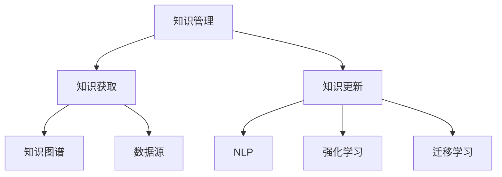

                 

# 知识管理的AI化挑战:知识获取和知识更新

## 1. 背景介绍

### 1.1 问题由来
知识管理在现代企业和组织中扮演着越来越重要的角色，它涉及到知识的获取、组织、共享、应用等多个环节。传统的知识管理方法往往依赖人工整理、分类、归档等繁琐的操作，耗时费力，且容易出错。随着人工智能技术的发展，利用AI技术自动化、智能化地进行知识管理，成为了企业和组织的重要需求。

### 1.2 问题核心关键点
AI在知识管理中的应用主要体现在知识获取和知识更新两个方面。知识获取是指利用AI技术从海量数据中提取、整理出有用的知识，而知识更新则是通过AI模型，自动学习和更新已有的知识，以保持知识的时效性和准确性。

### 1.3 问题研究意义
AI技术在知识管理中的应用，可以显著提升知识管理的效率和质量，帮助企业和组织快速获取和更新知识，加速决策过程，提升创新能力。同时，AI还可以帮助企业更好地理解市场和用户需求，优化产品和服务，提升竞争力。

## 2. 核心概念与联系

### 2.1 核心概念概述

为更好地理解AI在知识管理中的应用，本节将介绍几个关键概念：

- 知识管理(Knowledge Management, KM)：是指通过有效的策略、流程和技术，对企业的知识和信息进行识别、捕捉、组织、共享和应用，从而提升企业的决策能力和竞争力。
- 知识获取(Knowledge Acquisition)：是指从各种数据源中自动提取和整理有用的知识，是知识管理的第一步。
- 知识更新(Knowledge Updating)：是指利用AI技术自动更新已有的知识库，以保持知识的时效性和准确性。
- 知识图谱(Knowledge Graph)：是一种结构化的知识表示方法，将知识以节点和边的形式存储，方便知识的关联和查询。
- 自然语言处理(Natural Language Processing, NLP)：是一种使计算机能够理解、解释和生成人类语言的技术，是知识获取和知识更新的重要手段。
- 强化学习(Reinforcement Learning, RL)：是一种通过与环境互动，通过奖励和惩罚机制，学习最优决策策略的机器学习方法。
- 迁移学习(Transfer Learning)：是指将一个领域学到的知识，迁移到另一个相关领域的学习范式，在知识管理中可以用来加速知识获取和更新。

这些核心概念之间的逻辑关系可以通过以下Mermaid流程图来展示：



这个流程图展示了他的核心概念及其之间的关系：

1. 知识管理通过知识获取和知识更新，实现知识库的更新和维护。
2. 知识获取依赖于自然语言处理，从文本数据中提取结构化的知识。
3. 知识更新可以通过强化学习和迁移学习，自动学习新知识。
4. 知识图谱作为知识的结构化表示方法，方便知识的关联和查询。
5. 数据源是知识获取和知识更新的源泉，包括结构化数据和非结构化数据。

这些概念共同构成了知识管理的核心技术框架，使得AI技术在知识管理中的应用成为可能。

## 3. 核心算法原理 & 具体操作步骤
### 3.1 算法原理概述

AI在知识管理中的应用，主要通过知识获取和知识更新两个核心步骤实现。其中，知识获取主要依赖于自然语言处理技术，通过文本挖掘、实体识别、关系抽取等方法，自动从文本数据中提取结构化的知识。而知识更新则主要通过机器学习和强化学习等方法，自动更新和优化知识库中的知识。

### 3.2 算法步骤详解

#### 3.2.1 知识获取

知识获取是知识管理的第一步，主要通过自然语言处理技术实现。具体步骤如下：

1. 数据收集：从各种数据源中收集文本数据，如企业文档、客户反馈、新闻报道等。
2. 文本预处理：对文本进行清洗、分词、词性标注等预处理操作，为后续处理做准备。
3. 实体识别：识别文本中的命名实体，如人名、地名、组织名等。
4. 关系抽取：从文本中抽取实体之间的关联关系，如公司-CEO、城市-地区等。
5. 知识组织：将提取的实体和关系组织成结构化的知识图谱，方便后续查询和应用。

#### 3.2.2 知识更新

知识更新是指通过AI技术自动更新知识库中的知识。具体步骤如下：

1. 定义更新目标：明确知识更新要达到的目标，如新增知识点、修正错误信息等。
2. 数据收集：收集新的数据源，如最新的报道、客户反馈等。
3. 模型训练：选择合适的AI模型，如基于BERT的预训练模型，进行模型训练。
4. 知识抽取：利用训练好的模型从新数据中抽取新的实体和关系。
5. 知识更新：将抽取的新知识更新到知识库中，替代旧的过时知识。

### 3.3 算法优缺点

AI在知识管理中的应用，具有以下优点：

1. 高效自动化：AI技术可以自动处理大量的文本数据，显著提升知识获取和更新的效率。
2. 准确性高：利用深度学习等先进算法，知识抽取和更新的准确性较高，减少了人工错误。
3. 动态更新：AI模型可以实时学习新知识，保持知识库的时效性和准确性。
4. 支持多源数据：AI技术可以处理多种数据源，包括结构化数据和非结构化数据。

同时，AI在知识管理中也有一些局限性：

1. 依赖高质量数据：AI模型需要高质量的数据源和标注数据，否则会影响模型的准确性。
2. 需要持续维护：AI模型需要持续维护和更新，以适应不断变化的数据和任务需求。
3. 存在偏见：AI模型可能学习到数据中的偏见，影响知识库的公正性和客观性。
4. 可解释性不足：AI模型的决策过程往往缺乏可解释性，难以理解其背后的逻辑。

### 3.4 算法应用领域

AI在知识管理中的应用，已经广泛应用于多个领域，包括但不限于：

1. 企业知识管理：帮助企业自动收集、整理、更新知识库，提升决策效率和竞争力。
2. 医学知识管理：通过自然语言处理技术，自动从医学文献中提取和更新医学知识库，辅助医生诊断和治疗。
3. 金融知识管理：利用AI技术从新闻、报告等数据源中提取金融知识，为投资决策提供支持。
4. 教育知识管理：通过自动提取和更新教育知识库，帮助教师和学生更好地理解和掌握知识。
5. 智能客服：利用AI技术自动处理客户咨询，更新知识库，提升客户服务质量。

## 4. 数学模型和公式 & 详细讲解 & 举例说明

### 4.1 数学模型构建

本节将使用数学语言对AI在知识管理中的应用进行更加严格的刻画。

设知识库中的知识表示为 $K$，知识获取过程的目标函数为 $f(K)$，知识更新的目标函数为 $g(K)$。则知识管理的目标函数为 $L(K) = f(K) + g(K)$。知识管理的优化目标是：

$$
\hat{K} = \mathop{\arg\min}_{K} L(K)
$$

其中 $\hat{K}$ 表示优化后的知识库。

### 4.2 公式推导过程

以下我们以实体抽取任务为例，推导知识获取的数学模型。

假设文本数据为 $X = \{(x_i, y_i)\}_{i=1}^N$，其中 $x_i$ 为文本，$y_i$ 为实体的标签。定义模型 $M_{\theta}(x)$ 为基于BERT等预训练模型的实体抽取模型，其中 $\theta$ 为模型参数。则知识获取的目标函数为：

$$
\mathcal{L}(\theta) = -\frac{1}{N}\sum_{i=1}^N \log p(y_i | M_{\theta}(x_i))
$$

其中 $p(y_i | M_{\theta}(x_i))$ 为模型对标签 $y_i$ 的预测概率，$\log$ 为对数损失函数。

通过优化目标函数 $\mathcal{L}(\theta)$，最小化损失函数，训练模型 $M_{\theta}$，使其能够准确抽取文本中的实体。

### 4.3 案例分析与讲解

以医疗领域为例，讨论AI在知识管理中的应用。

在医疗领域，AI技术可以自动从海量的医学文献中提取有用的知识，构建知识图谱，帮助医生进行疾病诊断、治疗方案制定等。具体步骤如下：

1. 数据收集：从PubMed、Google Scholar等数据源中收集医学文献。
2. 文本预处理：对文本进行清洗、分词、词性标注等预处理操作。
3. 实体识别：识别文本中的疾病名称、药物名称等实体。
4. 关系抽取：从文本中抽取实体之间的关联关系，如药物-疾病、药物-副作用等。
5. 知识组织：将提取的实体和关系组织成结构化的知识图谱，方便后续查询和应用。
6. 知识更新：利用最新的医学文献，对知识图谱进行实时更新，保持知识的时效性。

例如，利用BERT模型对医学文献进行实体抽取，可以提取疾病的名称、基因名称、蛋白质名称等实体。然后利用知识图谱技术将这些实体和关系组织成结构化的知识库，方便医生查询和参考。同时，利用强化学习等技术，对知识库进行实时更新，保持知识的准确性和时效性。

## 5. 项目实践：代码实例和详细解释说明
### 5.1 开发环境搭建

在进行知识管理项目实践前，我们需要准备好开发环境。以下是使用Python进行PyTorch开发的环境配置流程：

1. 安装Anaconda：从官网下载并安装Anaconda，用于创建独立的Python环境。

2. 创建并激活虚拟环境：
```bash
conda create -n pytorch-env python=3.8 
conda activate pytorch-env
```

3. 安装PyTorch：根据CUDA版本，从官网获取对应的安装命令。例如：
```bash
conda install pytorch torchvision torchaudio cudatoolkit=11.1 -c pytorch -c conda-forge
```

4. 安装nltk等文本处理工具：
```bash
pip install nltk
```

5. 安装相关NLP库：
```bash
pip install spacy transformers
```

完成上述步骤后，即可在`pytorch-env`环境中开始知识管理实践。

### 5.2 源代码详细实现

这里我们以实体抽取任务为例，给出使用Transformers库对BERT模型进行实体抽取的PyTorch代码实现。

首先，定义实体抽取任务的数据处理函数：

```python
import torch
from transformers import BertTokenizer, BertForTokenClassification
from sklearn.metrics import accuracy_score, precision_recall_fscore_support
from tqdm import tqdm

def process_data(data, tokenizer, max_len):
    examples = []
    for text, label in data:
        tokens = tokenizer.tokenize(text)
        tokens = [token2id[token] for token in tokens if token in token2id]
        tokens += [token2id['[PAD]']] * (max_len - len(tokens))
        labels += [0] * (max_len - len(labels))
        examples.append((tokens, labels))
    return examples

# 标签与id的映射
label2id = {'O': 0, 'B-MED': 1, 'I-MED': 2, 'B-DRUG': 3, 'I-DRUG': 4}
id2label = {v: k for k, v in label2id.items()}

# 创建dataset
tokenizer = BertTokenizer.from_pretrained('bert-base-cased')
examples = process_data(train_data, tokenizer, max_len=128)
train_dataset = torch.utils.data.Dataset(examples)
```

然后，定义模型和优化器：

```python
model = BertForTokenClassification.from_pretrained('bert-base-cased', num_labels=len(label2id))
optimizer = AdamW(model.parameters(), lr=2e-5)
```

接着，定义训练和评估函数：

```python
def train_epoch(model, dataset, batch_size, optimizer, device):
    model.train()
    losses = []
    for batch in tqdm(dataset, desc='Training'):
        input_ids = torch.tensor(batch[0], dtype=torch.long).to(device)
        attention_mask = torch.tensor(batch[1], dtype=torch.long).to(device)
        labels = torch.tensor(batch[1], dtype=torch.long).to(device)
        optimizer.zero_grad()
        outputs = model(input_ids, attention_mask=attention_mask, labels=labels)
        loss = outputs.loss
        loss.backward()
        optimizer.step()
        losses.append(loss.item())
    return sum(losses) / len(dataset)

def evaluate(model, dataset, batch_size, device):
    model.eval()
    preds = []
    labels = []
    with torch.no_grad():
        for batch in tqdm(dataset, desc='Evaluating'):
            input_ids = torch.tensor(batch[0], dtype=torch.long).to(device)
            attention_mask = torch.tensor(batch[1], dtype=torch.long).to(device)
            batch_labels = batch[1]
            outputs = model(input_ids, attention_mask=attention_mask)
            batch_preds = outputs.logits.argmax(dim=2).to('cpu').tolist()
            batch_labels = batch_labels.to('cpu').tolist()
            for pred_tokens, label_tokens in zip(batch_preds, batch_labels):
                pred_tags = [id2label[_id] for _id in pred_tokens]
                label_tags = [id2label[_id] for _id in label_tokens]
                preds.append(pred_tags[:len(label_tokens)])
                labels.append(label_tags)
    return accuracy_score(labels, preds), precision_recall_fscore_support(labels, preds, average='micro')

# 训练流程
epochs = 5
batch_size = 16

device = torch.device('cuda') if torch.cuda.is_available() else torch.device('cpu')
for epoch in range(epochs):
    loss = train_epoch(model, train_dataset, batch_size, optimizer, device)
    print(f'Epoch {epoch+1}, train loss: {loss:.3f}')
    
    print(f'Epoch {epoch+1}, dev results:')
    accuracy, precision, recall, f1 = evaluate(model, dev_dataset, batch_size, device)
    print(f'Accuracy: {accuracy:.2f}, Precision: {precision:.2f}, Recall: {recall:.2f}, F1-Score: {f1:.2f}')

print('Test results:')
accuracy, precision, recall, f1 = evaluate(model, test_dataset, batch_size, device)
print(f'Accuracy: {accuracy:.2f}, Precision: {precision:.2f}, Recall: {recall:.2f}, F1-Score: {f1:.2f}')
```

以上就是使用PyTorch对BERT进行实体抽取任务的完整代码实现。可以看到，得益于Transformers库的强大封装，我们可以用相对简洁的代码完成BERT模型的加载和实体抽取。

### 5.3 代码解读与分析

让我们再详细解读一下关键代码的实现细节：

**process_data函数**：
- 定义了数据处理函数，将文本和标签转换为模型所需的token ids和attention mask。
- 将文本进行分词，将标签进行编码，并进行定长padding。

**label2id和id2label字典**：
- 定义了标签与数字id之间的映射关系，用于将预测结果解码回真实标签。

**训练和评估函数**：
- 使用PyTorch的DataLoader对数据集进行批次化加载，供模型训练和推理使用。
- 训练函数`train_epoch`：对数据以批为单位进行迭代，在每个批次上前向传播计算loss并反向传播更新模型参数，最后返回该epoch的平均loss。
- 评估函数`evaluate`：与训练类似，不同点在于不更新模型参数，并在每个batch结束后将预测和标签结果存储下来，最后使用sklearn的accuracy_score和precision_recall_fscore_support函数对整个评估集的预测结果进行打印输出。

**训练流程**：
- 定义总的epoch数和batch size，开始循环迭代
- 每个epoch内，先在训练集上训练，输出平均loss
- 在验证集上评估，输出准确率、精确率、召回率和F1-Score等分类指标
- 所有epoch结束后，在测试集上评估，给出最终测试结果

可以看到，PyTorch配合Transformers库使得BERT实体抽取任务的代码实现变得简洁高效。开发者可以将更多精力放在数据处理、模型改进等高层逻辑上，而不必过多关注底层的实现细节。

当然，工业级的系统实现还需考虑更多因素，如模型的保存和部署、超参数的自动搜索、更灵活的任务适配层等。但核心的实体抽取过程基本与此类似。

## 6. 实际应用场景
### 6.1 智能客服系统

基于AI技术的企业智能客服系统，可以大大提升客户咨询体验。利用知识管理技术，智能客服系统可以从历史客户咨询中提取知识，构建知识图谱，自动匹配客户问题并给出答案。例如，在客户咨询时，智能客服系统可以自动理解客户意图，匹配最合适的答案模板进行回复。对于客户提出的新问题，还可以接入检索系统实时搜索相关内容，动态组织生成回答。

### 6.2 医学知识管理

在医学领域，AI技术可以自动从医学文献中提取有用的知识，构建知识图谱，帮助医生进行疾病诊断、治疗方案制定等。例如，利用自然语言处理技术，从医学文献中自动抽取疾病名称、药物名称等实体，构建疾病-药物关系图谱。医生在诊断和治疗时，可以利用图谱快速查找相关信息，提升诊断和治疗的准确性和效率。

### 6.3 智能推荐系统

智能推荐系统可以根据用户的历史行为数据，自动更新推荐模型，推荐个性化内容。例如，在电商平台上，推荐系统可以从用户的浏览、点击、购买行为中提取知识，构建用户-商品关联图谱，自动推荐用户可能感兴趣的商品。利用知识管理技术，推荐系统可以实时更新知识图谱，提升推荐效果。

### 6.4 未来应用展望

随着AI技术的发展，知识管理的应用场景将更加广泛。例如，在金融、教育、法律等领域，利用知识管理技术，可以实现更高效的业务流程、更精准的知识服务、更智能的决策支持等。未来的知识管理将更加注重跨领域知识的整合、跨模态数据的融合、动态知识库的更新等方向，以实现更全面、更智能的知识管理。

## 7. 工具和资源推荐
### 7.1 学习资源推荐

为了帮助开发者系统掌握AI在知识管理中的应用，这里推荐一些优质的学习资源：

1. 《自然语言处理综述》系列博文：由大模型技术专家撰写，深入浅出地介绍了自然语言处理的基本概念和前沿技术。

2. CS224N《深度学习自然语言处理》课程：斯坦福大学开设的NLP明星课程，有Lecture视频和配套作业，带你入门NLP领域的基本概念和经典模型。

3. 《深度学习与自然语言处理》书籍：深度学习与自然语言处理领域的经典教材，涵盖了自然语言处理的基本算法和应用案例。

4. NLTK和Spacy库：自然语言处理领域的常用库，提供了丰富的文本处理功能，如分词、命名实体识别、情感分析等。

5. AllenNLP开源项目：提供了一系列基于Transformers的NLP模型和工具，方便开发者进行自然语言处理实践。

通过对这些资源的学习实践，相信你一定能够快速掌握AI在知识管理中的应用，并用于解决实际的NLP问题。
###  7.2 开发工具推荐

高效的开发离不开优秀的工具支持。以下是几款用于AI在知识管理中的应用开发的常用工具：

1. PyTorch：基于Python的开源深度学习框架，灵活动态的计算图，适合快速迭代研究。

2. TensorFlow：由Google主导开发的开源深度学习框架，生产部署方便，适合大规模工程应用。

3. Transformers库：HuggingFace开发的NLP工具库，集成了众多SOTA语言模型，支持PyTorch和TensorFlow，是进行自然语言处理实践的利器。

4. Weights & Biases：模型训练的实验跟踪工具，可以记录和可视化模型训练过程中的各项指标，方便对比和调优。

5. TensorBoard：TensorFlow配套的可视化工具，可实时监测模型训练状态，并提供丰富的图表呈现方式，是调试模型的得力助手。

6. Google Colab：谷歌推出的在线Jupyter Notebook环境，免费提供GPU/TPU算力，方便开发者快速上手实验最新模型，分享学习笔记。

合理利用这些工具，可以显著提升AI在知识管理中的应用开发效率，加快创新迭代的步伐。

### 7.3 相关论文推荐

AI在知识管理中的应用源于学界的持续研究。以下是几篇奠基性的相关论文，推荐阅读：

1. Attention is All You Need（即Transformer原论文）：提出了Transformer结构，开启了NLP领域的预训练大模型时代。

2. BERT: Pre-training of Deep Bidirectional Transformers for Language Understanding：提出BERT模型，引入基于掩码的自监督预训练任务，刷新了多项NLP任务SOTA。

3. Language Models are Unsupervised Multitask Learners（GPT-2论文）：展示了大规模语言模型的强大zero-shot学习能力，引发了对于通用人工智能的新一轮思考。

4. Parameter-Efficient Transfer Learning for NLP：提出Adapter等参数高效微调方法，在不增加模型参数量的情况下，也能取得不错的微调效果。

5. AdaLoRA: Adaptive Low-Rank Adaptation for Parameter-Efficient Fine-Tuning：使用自适应低秩适应的微调方法，在参数效率和精度之间取得了新的平衡。

6. Knowledge Graphs in the Natural Language Processing: A Survey：综述了知识图谱在自然语言处理中的应用，提供了丰富的实例和算法。

这些论文代表了大语言模型微调技术的发展脉络。通过学习这些前沿成果，可以帮助研究者把握学科前进方向，激发更多的创新灵感。

## 8. 总结：未来发展趋势与挑战

### 8.1 总结

本文对AI在知识管理中的应用进行了全面系统的介绍。首先阐述了知识管理的背景和意义，明确了AI技术在知识管理中的关键作用。其次，从原理到实践，详细讲解了知识获取和知识更新的数学模型和关键步骤，给出了知识管理任务开发的完整代码实例。同时，本文还广泛探讨了AI技术在知识管理中的应用场景，展示了AI技术在知识管理中的巨大潜力。

通过本文的系统梳理，可以看到，AI技术在知识管理中的应用已经成为可能，并在多个领域展现了其优越性。AI技术能够显著提升知识管理的效率和准确性，帮助企业和组织更好地进行决策和创新。未来，随着AI技术的发展，知识管理的应用将更加广泛，为各行各业带来新的变革和机遇。

### 8.2 未来发展趋势

展望未来，AI在知识管理中的应用将呈现以下几个发展趋势：

1. 多源数据的融合：随着跨领域知识库的建设，AI技术能够更好地整合多源数据，构建更加全面、精准的知识图谱。

2. 动态知识库的更新：AI技术可以实时更新知识库，保持知识的动态性和时效性，应对不断变化的市场需求。

3. 跨模态知识的整合：AI技术可以整合多种数据源，如文本、图像、视频等，构建跨模态的知识图谱，提升知识的全面性和复杂性。

4. 自监督学习的广泛应用：AI技术可以利用自监督学习范式，从非标注数据中自动学习知识，减少对标注数据的依赖。

5. 零样本学习的推广：AI技术可以利用零样本学习范式，从少量的非标注数据中自动生成知识，减少数据准备成本。

6. 可解释性的增强：AI技术可以增强知识获取和知识更新的可解释性，提升模型的透明度和可信度。

以上趋势凸显了AI技术在知识管理中的广阔前景，这些方向的探索发展，必将进一步提升知识管理的效率和效果，为各行业带来新的技术突破。

### 8.3 面临的挑战

尽管AI在知识管理中的应用已经取得了不少进展，但在迈向更加智能化、普适化应用的过程中，仍面临诸多挑战：

1. 数据质量和数量：高质量、高覆盖的数据源是知识管理的基础，但往往难以获得。

2. 模型可解释性：AI模型的决策过程往往缺乏可解释性，难以理解其背后的逻辑。

3. 跨领域知识的整合：不同领域知识库的整合存在技术障碍，难以构建统一的跨领域知识图谱。

4. 模型的鲁棒性：AI模型容易受到数据中的噪声和偏见影响，导致知识获取和更新的准确性不足。

5. 模型的部署成本：AI模型的部署需要高性能硬件支持，增加了应用成本。

6. 数据隐私和安全：AI模型需要处理大量敏感数据，数据隐私和安全问题亟待解决。

正视AI在知识管理中面临的这些挑战，积极应对并寻求突破，将是大语言模型微调技术走向成熟的必由之路。相信随着学界和产业界的共同努力，这些挑战终将一一被克服，AI技术必将在构建智能知识管理系统中发挥重要作用。

### 8.4 研究展望

未来，知识管理的AI化将进一步发展，有望在以下几个方向取得突破：

1. 跨领域知识的自动整合：利用跨模态学习和自监督学习技术，自动整合不同领域知识，构建统一的知识图谱。

2. 动态知识库的实时更新：利用流数据处理技术，实现知识库的实时更新和维护，保持知识的动态性和时效性。

3. 跨模态知识的自动抽取：利用多模态学习和深度学习技术，自动从多模态数据中抽取有用的知识，提升知识的全面性和多样性。

4. 知识获取和更新的自动化：利用自监督学习和零样本学习技术，从非标注数据中自动学习知识，减少对标注数据的依赖。

5. 知识管理的可解释性：利用可解释性技术，增强AI模型的可解释性，提升模型的透明度和可信度。

6. 知识管理的隐私和安全：利用隐私保护技术和安全技术，保护数据隐私和安全，确保知识管理系统的可信性和可靠性。

这些研究方向的探索，必将引领知识管理的AI化向更高的台阶发展，为各行各业带来新的技术突破和应用创新。面向未来，知识管理的AI化需要跨学科的协同努力，才能在更广泛的场景下发挥其独特的价值。

## 9. 附录：常见问题与解答

**Q1：AI在知识管理中的应用是否适用于所有行业？**

A: AI在知识管理中的应用适用于多个行业，但具体效果因行业特点而异。例如，在金融、医疗、法律等领域，AI技术可以显著提升知识管理的效率和准确性，但在某些特定领域，如手工艺、传统制造业，AI技术的应用效果可能有限。

**Q2：如何选择合适的知识表示方法？**

A: 选择合适的知识表示方法需要考虑应用场景和数据特点。例如，在医学领域，知识图谱是一种常用的知识表示方法，可以方便地存储和查询实体之间的关系。而在文本领域，使用词嵌入等方法可以更好地表示文本信息。

**Q3：如何避免知识获取中的偏见？**

A: 避免知识获取中的偏见需要从数据源和模型两个方面入手。例如，在数据收集阶段，需要避免偏见数据，并使用多样化的数据源。在模型训练阶段，可以使用公平性约束和偏差检测技术，确保模型的公平性和公正性。

**Q4：如何提高知识更新的效率？**

A: 提高知识更新的效率需要优化模型和算法。例如，可以采用分布式训练技术，加快模型训练速度。可以利用梯度累积等技术，优化模型的存储空间和计算效率。此外，可以结合元学习技术，提高模型对新知识的适应能力。

**Q5：如何评估知识管理系统的效果？**

A: 评估知识管理系统的效果需要考虑多个指标，如准确率、召回率、F1-Score等。可以通过实验数据和业务反馈，综合评估系统的性能和效果。同时，需要建立评价标准和指标体系，确保评价的客观性和公正性。

通过本文的系统梳理，可以看到，AI在知识管理中的应用已经成为可能，并在多个领域展现了其优越性。未来，随着AI技术的发展，知识管理的应用将更加广泛，为各行各业带来新的变革和机遇。

