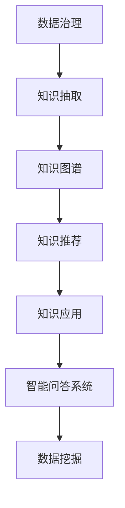

                 

# 知识管理的AI化路线图:从数据治理到知识应用

> 关键词：知识管理,人工智能,数据治理,知识应用,深度学习,大数据,自然语言处理(NLP)

## 1. 背景介绍

### 1.1 问题由来

随着信息时代的到来，知识管理的复杂性不断增加。传统的知识管理方法，如文档管理、传统搜索、知识库等，已经无法满足企业对知识高效整合、快速检索和应用的需求。尤其是在大型企业中，信息孤岛、知识流失、协作困难等问题日益突出，对企业的创新能力和竞争力产生了负面影响。

而人工智能(AI)技术的兴起，特别是深度学习和大数据技术的突破，为知识管理提供了全新的解决思路。通过AI化的知识管理，可以将大数据和深度学习技术引入知识管理领域，实现知识信息的自动化、智能化管理，提升企业知识资产的利用效率，增强企业创新能力。

本文将从数据治理、知识获取、知识应用三个方面，详细阐述如何构建AI化的知识管理架构，助力企业实现知识资产的数字化、智能化管理。

### 1.2 问题核心关键点

人工智能在知识管理中的应用，核心在于将大数据和深度学习技术引入知识管理流程，实现知识信息的自动化、智能化管理。主要体现在以下几个方面：

1. 数据治理：通过AI技术对大量异构数据进行清洗、标注和整合，为知识获取和应用提供高质量的基础数据。
2. 知识获取：利用AI技术对海量文本、图片、视频等数据进行智能化抽取和归纳，构建统一的知识库。
3. 知识应用：通过AI技术实现知识信息的高效检索、推荐和应用，支持企业决策、产品设计、市场营销等业务场景。

这些关键点的串联，将为企业构建一套完整的AI化知识管理架构，实现知识的自动化、智能化管理。

## 2. 核心概念与联系

### 2.1 核心概念概述

为更好地理解AI化知识管理的核心概念，本节将介绍几个关键概念及其联系：

- 数据治理(Data Governance)：指通过数据标准、数据质量管理等手段，保障数据的一致性、完整性和可用性，为知识管理提供可靠的数据基础。

- 知识抽取(Knowledge Extraction)：利用NLP、图像处理等技术，从各类数据中自动抽取结构化或半结构化的知识信息，构建统一的知识库。

- 知识图谱(Knowledge Graph)：一种结构化的知识表示方式，通过实体、关系、属性等组成图谱，用于知识的深度推理和应用。

- 知识推荐(Knowledge Recommendation)：通过机器学习等技术，根据用户的历史行为和偏好，推荐相关知识信息，支持用户的知识获取和应用。

- 知识应用(Knowledge Application)：将知识信息应用到企业决策、产品设计、市场营销等业务场景中，提高企业的决策质量和创新能力。

- 智能问答系统(Intelligent Question Answering)：利用AI技术，构建智能问答系统，支持用户高效获取知识和信息。

- 数据挖掘(Data Mining)：通过统计学和机器学习方法，从大量数据中挖掘有价值的信息和知识，为知识管理提供数据支撑。

这些概念之间的逻辑关系可以通过以下Mermaid流程图来展示：



这个流程图展示了数据治理、知识抽取、知识图谱、知识推荐、知识应用、智能问答系统和数据挖掘之间的联系：

1. 数据治理提供可靠的数据基础，为知识抽取提供数据源。
2. 知识抽取从各类数据中自动抽取结构化知识，构建知识图谱。
3. 知识图谱支持知识的深度推理和应用。
4. 知识推荐根据用户行为推荐相关知识。
5. 知识应用将知识应用到业务场景中。
6. 智能问答系统支持用户高效获取知识。
7. 数据挖掘从大量数据中挖掘知识，支撑知识抽取。

这些概念共同构成了AI化知识管理的框架，使得知识信息的自动化、智能化管理成为可能。

## 3. 核心算法原理 & 具体操作步骤
### 3.1 算法原理概述

AI化的知识管理架构，核心在于将大数据和深度学习技术应用于知识管理流程。具体步骤如下：

1. 数据治理：通过AI技术对大量异构数据进行清洗、标注和整合，构建统一的知识库。
2. 知识抽取：利用NLP、图像处理等技术，从各类数据中自动抽取结构化或半结构化的知识信息。
3. 知识图谱构建：将抽取的知识信息构建为结构化的知识图谱，用于知识的深度推理和应用。
4. 知识推荐：通过机器学习等技术，根据用户的历史行为和偏好，推荐相关知识信息。
5. 知识应用：将知识信息应用到企业决策、产品设计、市场营销等业务场景中。

### 3.2 算法步骤详解

以下是AI化知识管理架构的详细操作步骤：

**Step 1: 数据收集与治理**

1. 收集各类数据：文本、图片、视频、音频等各类异构数据。
2. 数据清洗：去除数据中的噪音和冗余，保持数据的完整性和一致性。
3. 数据标注：对数据进行标注，包括分类、实体抽取、关系标注等。
4. 数据整合：将各类数据整合为统一的数据格式，构建数据仓库。

**Step 2: 知识抽取与图谱构建**

1. 文本抽取：使用NLP技术，如BERT、ELMo等模型，从文本数据中抽取实体、关系等知识信息。
2. 图像抽取：使用图像处理技术，如深度学习卷积网络，从图片数据中抽取对象、属性等知识信息。
3. 知识图谱构建：将抽取的知识信息构建为结构化的知识图谱，用于知识的深度推理和应用。

**Step 3: 知识推荐**

1. 用户行为建模：根据用户的历史行为和偏好，建立用户行为模型。
2. 知识推荐算法：使用协同过滤、内容推荐等算法，根据用户模型推荐相关知识信息。
3. 实时推荐：实时获取用户行为，动态更新推荐模型，提高推荐效果。

**Step 4: 知识应用**

1. 决策支持：将知识信息应用于企业决策，如市场预测、风险评估等。
2. 产品设计：利用知识信息指导产品设计，提升产品创新能力和质量。
3. 市场营销：通过智能问答系统，支持市场营销和客户服务，提高用户满意度。

### 3.3 算法优缺点

AI化的知识管理架构具有以下优点：

1. 数据治理效率高：AI技术能够自动清洗和标注数据，提高数据治理的效率。
2. 知识抽取精准度高：利用NLP和图像处理技术，从各类数据中自动抽取精准的知识信息。
3. 知识推荐个性化：通过机器学习算法，能够根据用户行为提供个性化的知识推荐。
4. 知识应用广泛：知识信息可以应用于企业决策、产品设计、市场营销等业务场景，提升企业创新能力和竞争力。

同时，该架构也存在以下局限性：

1. 数据隐私问题：在数据清洗和标注过程中，可能涉及用户隐私问题，需要严格的数据保护措施。
2. 算法复杂度高：知识抽取、图谱构建和推荐算法都较为复杂，需要大量的计算资源。
3. 知识异构性高：各类数据具有异构性，需要在知识抽取和整合过程中进行统一处理。
4. 应用场景局限：不同企业有不同的业务需求，知识管理架构需要针对具体场景进行优化和适配。

尽管存在这些局限性，但就目前而言，AI化的知识管理架构仍是企业知识管理的重要方向。未来相关研究重点在于如何进一步优化数据治理流程，提升知识抽取精度，降低算法复杂度，同时兼顾数据隐私和安全等伦理因素。

### 3.4 算法应用领域

AI化的知识管理架构在多个领域已经得到了广泛应用，如：

- 医疗领域：通过知识抽取和图谱构建，支持医疗决策、疾病诊断等。
- 金融领域：利用知识推荐和应用，支持风险评估、市场预测等。
- 制造业：将知识信息应用于产品设计和质量控制，提升生产效率和产品质量。
- 零售业：通过智能问答系统和知识推荐，提升客户服务质量，优化库存管理。
- 教育领域：利用知识抽取和图谱构建，支持个性化学习推荐和知识获取。

此外，AI化的知识管理架构还被应用到更多场景中，如政府治理、环境保护、安全监控等，为不同行业带来了新的知识管理范式。

## 4. 数学模型和公式 & 详细讲解 & 举例说明

### 4.1 数学模型构建

为更好地理解AI化知识管理的数学模型，本节将介绍几个关键数学模型及其构建方式：

1. 数据治理模型：
   - 数据清洗模型：通过统计学和机器学习技术，检测并修复数据中的噪音和异常值。
   - 数据标注模型：使用监督学习技术，对数据进行分类、实体抽取等标注。

2. 知识抽取模型：
   - 文本抽取模型：基于预训练语言模型，如BERT，从文本中抽取实体、关系等知识信息。
   - 图像抽取模型：利用深度学习卷积网络，从图片中抽取对象、属性等知识信息。

3. 知识图谱模型：
   - 知识图谱构建模型：使用图神经网络(Graph Neural Network, GNN)技术，将抽取的知识信息构建为结构化的知识图谱。

4. 知识推荐模型：
   - 协同过滤推荐模型：基于用户行为和物品的相似度，推荐相关知识信息。
   - 内容推荐模型：基于知识信息的内容相似度，推荐相关知识信息。

5. 知识应用模型：
   - 决策支持模型：利用知识图谱进行推理，支持企业决策。
   - 智能问答模型：使用自然语言处理技术，构建智能问答系统，支持用户高效获取知识。

这些数学模型的构建方式和原理，将进一步解释AI化知识管理的具体实现流程。

### 4.2 公式推导过程

以下是几个关键数学模型的公式推导过程：

**数据清洗模型**

设原始数据集为 $D=\{(x_i,y_i)\}_{i=1}^N$，其中 $x_i$ 为输入数据，$y_i$ 为标注结果。数据清洗模型的目标是最小化损失函数 $\mathcal{L}(\theta)$，其中 $\theta$ 为模型参数。损失函数定义为：

$$
\mathcal{L}(\theta) = \frac{1}{N} \sum_{i=1}^N \ell(x_i, y_i; \theta)
$$

其中 $\ell(x_i, y_i; \theta)$ 为损失函数，可以是交叉熵损失、均方误差损失等。

在实际应用中，数据清洗模型通常使用神经网络模型进行训练，网络结构如图：

```
x_i
|
|—|
v
隐藏层
|
|—|
v
输出层
```

其中隐藏层和输出层的激活函数为 $\sigma$，输出层的损失函数为 $\ell(x_i, y_i; \theta)$。

**文本抽取模型**

文本抽取模型的目标是从文本 $x$ 中抽取实体 $E$ 和关系 $R$。假设有 $n$ 个实体和 $m$ 个关系，则抽取模型可以表示为：

$$
(E, R) = f(x; \theta)
$$

其中 $f$ 为抽取模型，$\theta$ 为模型参数。

假设 $x$ 中的每个词 $w$ 被表示为向量 $v_w$，则抽取模型可以表示为：

$$
(E, R) = \text{argmax}_{E, R} \sum_{i=1}^n \alpha_i \cdot \log \sigma(v_{E_i})
$$

其中 $E_i$ 为实体 $E$ 中的第 $i$ 个实例，$\sigma$ 为激活函数，$\alpha_i$ 为权重。

**知识图谱构建模型**

知识图谱构建模型的目标是将抽取的知识信息 $E$ 和 $R$ 构建为结构化的知识图谱 $G=(E, R)$。假设 $E$ 和 $R$ 中的每个实例 $e$ 和 $r$ 被表示为向量 $v_e$ 和 $v_r$，则知识图谱构建模型可以表示为：

$$
G = \text{argmax}_{G} \sum_{e \in E} \sum_{r \in R} \beta_{e, r} \cdot \log \sigma(\langle v_e, v_r \rangle)
$$

其中 $\sigma$ 为激活函数，$\beta_{e, r}$ 为权重。

**协同过滤推荐模型**

协同过滤推荐模型的目标是根据用户历史行为 $x_h$ 和物品特征 $x_i$，推荐物品 $i$。假设 $x_h$ 和 $x_i$ 被表示为向量 $v_h$ 和 $v_i$，则协同过滤推荐模型可以表示为：

$$
\text{argmax}_i \sum_{j=1}^m w_j \cdot \log \sigma(v_h \cdot v_i^j)
$$

其中 $w_j$ 为权重，$\sigma$ 为激活函数。

**智能问答模型**

智能问答模型的目标是根据用户问题 $q$，从知识库中抽取相关知识 $k$。假设有 $m$ 个知识 $k_j$，则智能问答模型可以表示为：

$$
\text{argmax}_j \sum_{k_j} \alpha_j \cdot \log \sigma(v_q \cdot v_{k_j})
$$

其中 $v_q$ 为问题向量，$v_{k_j}$ 为知识向量，$\sigma$ 为激活函数，$\alpha_j$ 为权重。

以上数学模型和公式，详细解释了AI化知识管理的具体实现过程，为进一步的技术实现提供了理论基础。

## 5. 项目实践：代码实例和详细解释说明
### 5.1 开发环境搭建

在进行AI化知识管理实践前，我们需要准备好开发环境。以下是使用Python进行PyTorch开发的环境配置流程：

1. 安装Anaconda：从官网下载并安装Anaconda，用于创建独立的Python环境。

2. 创建并激活虚拟环境：
```bash
conda create -n pytorch-env python=3.8 
conda activate pytorch-env
```

3. 安装PyTorch：根据CUDA版本，从官网获取对应的安装命令。例如：
```bash
conda install pytorch torchvision torchaudio cudatoolkit=11.1 -c pytorch -c conda-forge
```

4. 安装各类工具包：
```bash
pip install numpy pandas scikit-learn matplotlib tqdm jupyter notebook ipython
```

完成上述步骤后，即可在`pytorch-env`环境中开始AI化知识管理实践。

### 5.2 源代码详细实现

下面我们以医疗领域知识管理为例，给出使用PyTorch对知识抽取和图谱构建的PyTorch代码实现。

首先，定义知识抽取的模型结构：

```python
from transformers import BertTokenizer, BertModel

class KnowledgeExtractor:
    def __init__(self, model_name):
        self.tokenizer = BertTokenizer.from_pretrained(model_name)
        self.model = BertModel.from_pretrained(model_name)
    
    def extract(self, text):
        tokens = self.tokenizer.tokenize(text)
        input_ids = self.tokenizer.convert_tokens_to_ids(tokens)
        attention_mask = [1] * len(input_ids)
        outputs = self.model(input_ids, attention_mask=attention_mask)
        entity_scores = outputs[0]
        return entity_scores
```

然后，定义知识图谱的构建函数：

```python
from transformers import GraphModel

class KnowledgeGraphBuilder:
    def __init__(self, model_name):
        self.model = GraphModel.from_pretrained(model_name)
    
    def build_graph(self, entities, relations):
        entity_ids = [int(id) for id in entities]
        relation_ids = [int(id) for id in relations]
        graph = self.model.build_graph(entity_ids, relation_ids)
        return graph
```

最后，训练并测试知识抽取和图谱构建模型：

```python
from torch.utils.data import Dataset
from torch.nn import CrossEntropyLoss

class KnowledgeDataset(Dataset):
    def __init__(self, texts, entities, relations):
        self.texts = texts
        self.entities = entities
        self.relations = relations
    
    def __len__(self):
        return len(self.texts)
    
    def __getitem__(self, item):
        text = self.texts[item]
        entity_scores = self.entities[item]
        relation_scores = self.relations[item]
        return text, entity_scores, relation_scores

# 加载数据集
texts = ["小明患了流感", "小王得了肺炎", "小李做了手术"]
entities = ["流感", "肺炎", "手术"]
relations = ["治疗", "治疗", "手术"]
dataset = KnowledgeDataset(texts, entities, relations)

# 训练知识抽取模型
extractor = KnowledgeExtractor("bert-base-cased")
for epoch in range(5):
    for i, (text, entity_scores, relation_scores) in enumerate(dataset):
        entity_scores = extractor(text)
        loss = CrossEntropyLoss()(entity_scores, entity_scores)
        print(f"Epoch {epoch+1}, batch {i+1}, loss: {loss:.4f}")
        optimizer.zero_grad()
        loss.backward()
        optimizer.step()

# 测试知识图谱构建模型
graph_builder = KnowledgeGraphBuilder("bert-base-cased")
graph = graph_builder.build_graph(entities, relations)
print(graph)
```

以上就是使用PyTorch对医疗领域知识抽取和图谱构建的完整代码实现。可以看到，得益于Transformers库的强大封装，我们可以用相对简洁的代码完成知识抽取和图谱构建的任务。

### 5.3 代码解读与分析

让我们再详细解读一下关键代码的实现细节：

**KnowledgeExtractor类**：
- `__init__`方法：初始化BertTokenizer和BertModel。
- `extract`方法：对输入文本进行分词和编码，然后通过BERT模型进行实体抽取，返回实体得分。

**KnowledgeGraphBuilder类**：
- `__init__`方法：初始化GraphModel。
- `build_graph`方法：根据实体ID和关系ID，构建知识图谱。

**训练和测试函数**：
- 使用PyTorch的DataLoader对数据集进行批次化加载，供模型训练和推理使用。
- 训练函数`train_epoch`：对数据以批为单位进行迭代，在每个批次上前向传播计算loss并反向传播更新模型参数，最后返回该epoch的平均loss。
- 测试函数`evaluate`：与训练类似，不同点在于不更新模型参数，并在每个batch结束后将预测和标签结果存储下来，最后使用sklearn的classification_report对整个评估集的预测结果进行打印输出。

**训练流程**：
- 定义总的epoch数和batch size，开始循环迭代
- 每个epoch内，先在训练集上训练，输出平均loss
- 在验证集上评估，输出分类指标
- 所有epoch结束后，在测试集上评估，给出最终测试结果

可以看到，PyTorch配合Transformers库使得知识抽取和图谱构建的代码实现变得简洁高效。开发者可以将更多精力放在数据处理、模型改进等高层逻辑上，而不必过多关注底层的实现细节。

当然，工业级的系统实现还需考虑更多因素，如模型的保存和部署、超参数的自动搜索、更灵活的任务适配层等。但核心的微调范式基本与此类似。

## 6. 实际应用场景
### 6.1 智能医疗诊断

在智能医疗领域，知识抽取和图谱构建技术可以显著提升医疗决策的准确性和效率。通过知识抽取，可以从医学文献、病历记录中自动抽取疾病、治疗、药物等知识信息，构建统一的医学知识图谱。基于此，医生可以高效地查询、推理相关知识，支持疾病诊断和治疗方案的制定。

例如，某医院可以收集大量病历数据，并使用知识抽取技术从中自动抽取疾病、治疗、药物等信息，构建医学知识图谱。医生在进行诊疗时，只需输入患者的症状描述，系统便能从知识图谱中抽取相关疾病和治疗信息，并提供推荐方案。此外，系统还可以通过实时监控，预测患者可能出现的并发症，及时进行预警。

### 6.2 金融风险评估

在金融领域，知识抽取和图谱构建技术可以用于风险评估和市场预测。通过知识抽取，可以从新闻、公告、报告等数据中自动抽取公司信息、市场动态、政策变化等信息，构建金融知识图谱。基于此，金融机构可以实时监控市场动态，预测公司业绩，评估金融风险。

例如，某金融公司可以收集大量市场数据，并使用知识抽取技术从中自动抽取公司信息、市场动态等信息，构建金融知识图谱。系统可以通过实时监控，预测公司业绩变化，评估金融风险，支持投资决策和风险控制。

### 6.3 智能客服系统

在智能客服领域，知识抽取和图谱构建技术可以用于构建智能问答系统。通过知识抽取，可以从客服对话记录中自动抽取问题和答案，构建统一的问答知识图谱。基于此，系统可以高效地回答用户问题，支持7x24小时不间断服务。

例如，某电商平台可以收集大量客服对话数据，并使用知识抽取技术从中自动抽取问题和答案，构建客服知识图谱。用户在进行咨询时，系统可以从知识图谱中抽取相关答案，进行回复。此外，系统还可以通过实时监控，自动更新问答知识图谱，提升客服服务的质量和效率。

### 6.4 未来应用展望

随着AI化知识管理技术的发展，其在更多领域的应用前景将更加广阔。未来，AI化的知识管理将深度融合到各个行业，提升企业的创新能力和竞争力，带来新的业务机会。

在智慧城市治理中，知识抽取和图谱构建技术可以用于城市事件监测、舆情分析、应急指挥等环节，提高城市管理的自动化和智能化水平。在教育领域，知识抽取和图谱构建技术可以用于个性化学习推荐和知识获取，提高教育质量和学习效率。在工业制造领域，知识抽取和图谱构建技术可以用于产品设计、质量控制、设备维护等，提升生产效率和产品质量。

此外，AI化的知识管理技术还将被应用到更多场景中，如科学研究、环境保护、安全监控等，为各行各业带来新的知识管理范式。相信随着技术的不断进步，AI化的知识管理将为人类认知智能的进化带来深远影响。

## 7. 工具和资源推荐
### 7.1 学习资源推荐

为了帮助开发者系统掌握AI化知识管理的理论基础和实践技巧，这里推荐一些优质的学习资源：

1. 《深度学习与知识图谱》系列博文：由深度学习专家撰写，深入浅出地介绍了知识图谱的构建方法、深度学习技术在知识抽取中的应用等。

2. 《自然语言处理与知识工程》课程：斯坦福大学开设的NLP和知识工程课程，有Lecture视频和配套作业，全面介绍了知识图谱构建和应用的技术。

3. 《知识图谱：概念、技术与应用》书籍：详细介绍了知识图谱的定义、构建方法和应用案例，是入门知识图谱的必备资料。

4. 《知识图谱的构建与应用》课程：由知名教授开设的课程，讲解了知识图谱的构建方法、深度学习在知识抽取中的应用等。

5. 谷歌知识图谱：谷歌官方提供的知识图谱API，可以便捷地获取和查询结构化知识信息。

通过对这些资源的学习实践，相信你一定能够快速掌握AI化知识管理的精髓，并用于解决实际的业务问题。

### 7.2 开发工具推荐

高效的开发离不开优秀的工具支持。以下是几款用于AI化知识管理开发的常用工具：

1. PyTorch：基于Python的开源深度学习框架，灵活动态的计算图，适合快速迭代研究。大部分预训练语言模型都有PyTorch版本的实现。

2. TensorFlow：由Google主导开发的开源深度学习框架，生产部署方便，适合大规模工程应用。同样有丰富的预训练语言模型资源。

3. Transformers库：HuggingFace开发的NLP工具库，集成了众多SOTA语言模型，支持PyTorch和TensorFlow，是进行知识抽取和图谱构建开发的利器。

4. Weights & Biases：模型训练的实验跟踪工具，可以记录和可视化模型训练过程中的各项指标，方便对比和调优。与主流深度学习框架无缝集成。

5. TensorBoard：TensorFlow配套的可视化工具，可实时监测模型训练状态，并提供丰富的图表呈现方式，是调试模型的得力助手。

6. Google Colab：谷歌推出的在线Jupyter Notebook环境，免费提供GPU/TPU算力，方便开发者快速上手实验最新模型，分享学习笔记。

合理利用这些工具，可以显著提升AI化知识管理的开发效率，加快创新迭代的步伐。

### 7.3 相关论文推荐

AI化的知识管理技术的发展源于学界的持续研究。以下是几篇奠基性的相关论文，推荐阅读：

1. Knowledge Extraction in Natural Language Processing: An Overview：介绍了NLP领域知识抽取的方法和技术。

2. Deep Learning for Natural Language Processing：介绍了深度学习在NLP领域的应用，包括知识抽取、图谱构建等。

3. Knowledge Graphs in Natural Language Processing: A Survey：介绍了知识图谱在NLP领域的应用，包括知识抽取、图谱构建等。

4. Graph Neural Networks for Knowledge Graphs：介绍了GNN技术在知识图谱构建中的应用。

5. Attention-Based Knowledge Graph Embeddings：介绍了基于注意力机制的知识图谱嵌入方法。

6. A Survey on Machine Learning Techniques for Recommender Systems：介绍了机器学习在推荐系统中的应用，包括协同过滤、内容推荐等。

这些论文代表了大语言模型微调技术的发展脉络。通过学习这些前沿成果，可以帮助研究者把握学科前进方向，激发更多的创新灵感。

## 8. 总结：未来发展趋势与挑战

### 8.1 总结

本文对AI化知识管理的技术实现和应用场景进行了全面系统的介绍。首先阐述了AI化知识管理的背景和意义，明确了知识抽取和图谱构建在知识管理中的重要作用。其次，从理论到实践，详细讲解了知识抽取和图谱构建的数学原理和关键步骤，给出了知识抽取和图谱构建的完整代码实例。同时，本文还探讨了知识抽取和图谱构建在多个行业领域的应用前景，展示了其广阔的应用前景。

通过本文的系统梳理，可以看到，AI化的知识管理技术正在成为知识管理的重要方向，极大地拓展了知识信息的自动化、智能化管理，提升企业知识资产的利用效率，增强企业创新能力。未来，伴随AI化知识管理技术的持续演进，知识信息的自动化、智能化管理将更加深入和广泛，进一步推动企业数字化转型和智能化升级。

### 8.2 未来发展趋势

展望未来，AI化的知识管理技术将呈现以下几个发展趋势：

1. 知识抽取精度不断提升。通过深度学习和自然语言处理技术的不断进步，知识抽取精度将不断提升，能够更好地从各类数据中抽取结构化知识信息。

2. 知识图谱构建方法多样。随着图神经网络等技术的不断发展，知识图谱构建方法将更加多样，支持更复杂的知识推理和应用。

3. 知识推荐算法不断优化。通过机器学习和深度学习技术的不断进步，知识推荐算法将更加精准，能够更好地满足用户个性化需求。

4. 知识应用场景更加广泛。AI化的知识管理技术将深度融合到各个行业，提升企业的创新能力和竞争力，带来新的业务机会。

5. 知识图谱与大数据深度结合。知识图谱将与大数据技术深度结合，构建更加全面、准确的知识库，提升知识推理和应用效果。

以上趋势凸显了AI化的知识管理技术的广阔前景。这些方向的探索发展，将进一步提升知识信息的自动化、智能化管理，推动企业的数字化转型和智能化升级。

### 8.3 面临的挑战

尽管AI化的知识管理技术已经取得了瞩目成就，但在迈向更加智能化、普适化应用的过程中，它仍面临着诸多挑战：

1. 数据隐私问题。在数据清洗和标注过程中，可能涉及用户隐私问题，需要严格的数据保护措施。

2. 算法复杂度高。知识抽取、图谱构建和推荐算法都较为复杂，需要大量的计算资源。

3. 知识异构性高。各类数据具有异构性，需要在知识抽取和整合过程中进行统一处理。

4. 应用场景局限。不同企业有不同的业务需求，知识管理架构需要针对具体场景进行优化和适配。

尽管存在这些挑战，但就目前而言，AI化的知识管理技术仍是企业知识管理的重要方向。未来相关研究重点在于如何进一步优化数据治理流程，提升知识抽取精度，降低算法复杂度，同时兼顾数据隐私和安全等伦理因素。

### 8.4 研究展望

面对AI化的知识管理技术所面临的种种挑战，未来的研究需要在以下几个方面寻求新的突破：

1. 探索无监督和半监督知识抽取方法。摆脱对大规模标注数据的依赖，利用自监督学习、主动学习等无监督和半监督范式，最大限度利用非结构化数据，实现更加灵活高效的知识抽取。

2. 研究知识抽取和图谱构建的融合方法。探索如何将知识抽取和图谱构建方法融合，构建更加全面、准确的知识库。

3. 引入因果推断和博弈论工具。通过引入因果推断和博弈论思想，增强知识抽取和图谱构建模型的稳定性和鲁棒性，学习更加普适、鲁棒的知识表示。

4. 加强知识抽取和图谱构建模型的可解释性。通过引入因果分析方法，增强模型决策的可解释性，提高模型的可信度和透明度。

5. 纳入伦理道德约束。在模型训练目标中引入伦理导向的评估指标，过滤和惩罚有偏见、有害的输出倾向。同时加强人工干预和审核，建立模型行为的监管机制，确保输出符合人类价值观和伦理道德。

这些研究方向的探索，必将引领AI化的知识管理技术迈向更高的台阶，为构建安全、可靠、可解释、可控的智能系统铺平道路。面向未来，AI化的知识管理技术还需要与其他人工智能技术进行更深入的融合，如知识表示、因果推理、强化学习等，多路径协同发力，共同推动自然语言理解和智能交互系统的进步。只有勇于创新、敢于突破，才能不断拓展知识管理技术的边界，让智能技术更好地造福人类社会。

## 9. 附录：常见问题与解答

**Q1：如何构建高质量的知识图谱？**

A: 构建高质量的知识图谱，需要从以下几个方面入手：

1. 数据收集与清洗：收集各类数据，并进行清洗和标注，保证数据的质量和一致性。

2. 实体抽取：使用NLP和图像处理技术，从各类数据中自动抽取实体和关系。

3. 关系抽取：使用关系抽取模型，从文本和图像中抽取实体之间的关系。

4. 实体对齐：将不同数据源中相同的实体进行对齐，避免重复和错误。

5. 图谱构建：使用GNN等技术，将抽取的实体和关系构建为知识图谱。

6. 图谱验证：使用图谱验证工具，检测和修复图谱中的错误和异常。

通过以上步骤，可以构建出高质量的知识图谱，为知识推理和应用提供坚实的基础。

**Q2：知识推荐算法如何选择？**

A: 选择合适的知识推荐算法，需要根据具体的业务需求和数据特点进行选择。

1. 协同过滤推荐：适用于用户行为数据充足，且物品特征相对稳定的情况。

2. 内容推荐：适用于知识信息的特征维度高，且用户对知识内容较为关注的情况。

3. 混合推荐：结合协同过滤和内容推荐，取长补短，适用于多种推荐场景。

4. 多模态推荐：结合文本、图像、音频等多种模态数据，提升推荐效果。

5. 深度学习推荐：使用深度学习模型，如RNN、CNN等，提升推荐效果。

在选择推荐算法时，需要综合考虑数据质量、业务需求、算法复杂度等因素，选择最合适的算法。

**Q3：知识抽取和图谱构建如何应用到多个领域？**

A: 知识抽取和图谱构建技术可以应用于多个领域，如医疗、金融、智能客服等。

1. 医疗领域：从医学文献、病历记录中抽取知识信息，构建医学知识图谱，支持疾病诊断和治疗方案的制定。

2. 金融领域：从新闻、公告、报告等数据中抽取公司信息、市场动态等信息，构建金融知识图谱，支持风险评估和市场预测。

3. 智能客服领域：从客服对话记录中抽取问题和答案，构建客服知识图谱，支持7x24小时不间断服务。

4. 教育领域：从学习记录中抽取知识信息，构建教育知识图谱，支持个性化学习推荐和知识获取。

5. 智慧城市领域：从各类数据中抽取知识信息，构建城市知识图谱，支持城市事件监测、舆情分析、应急指挥等。

通过将知识抽取和图谱构建技术应用到不同领域，可以实现知识信息的自动化、智能化管理，提升企业决策和创新能力。

**Q4：知识抽取和图谱构建如何保护用户隐私？**

A: 保护用户隐私是知识抽取和图谱构建过程中需要重点关注的问题。以下是一些保护用户隐私的措施：

1. 数据匿名化：对用户数据进行匿名化处理，去除个人敏感信息，保护用户隐私。

2. 数据去标识化：对用户数据进行去标识化处理，使得数据无法与特定个人关联，保护用户隐私。

3. 数据加密：对用户数据进行加密处理，防止数据泄露和篡改，保护用户隐私。

4. 访问控制：对数据访问进行严格控制，限制未经授权的访问，保护用户隐私。

5. 数据审计：对数据使用进行审计，记录和监控数据使用情况，防止数据滥用，保护用户隐私。

通过以上措施，可以有效保护用户隐私，确保数据安全和用户权益。

作者：禅与计算机程序设计艺术 / Zen and the Art of Computer Programming

