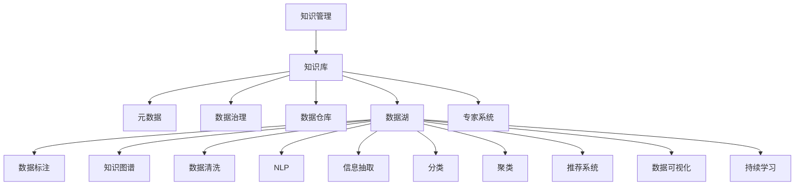

                 

# 知识管理策略：让知识发挥最大效益

> 关键词：知识管理, 知识库, 元数据, 数据治理, 数据仓库, 数据湖, 数据标注, 知识图谱, 数据清洗, 自然语言处理(NLP), 信息抽取, 分类, 聚类, 专家系统, 推荐系统, 数据可视化, 持续学习

## 1. 背景介绍

### 1.1 问题由来
在现代社会，信息爆炸已成常态，企业和组织面临着海量数据的洪流。数据不仅为决策提供了重要支持，也成为企业竞争力的关键。然而，如何高效地管理和利用这些数据，让知识发挥最大效益，成为了当前信息技术领域的一大挑战。

传统的知识管理方法，如文档管理、电子邮件检索等，往往不能有效地捕捉和利用数据中的知识，导致数据价值的流失。而在数据量不断增长的背景下，单纯依靠人工手段进行知识检索、整理和分析，已无法满足日益增长的业务需求。因此，迫切需要一种新的方法，让知识在组织内部得到更加高效、自动化的管理和利用。

知识管理（Knowledge Management, KM）是帮助企业对隐性知识和显性知识进行系统管理和利用的学科，旨在通过合理管理和利用知识，提高企业的创新能力和竞争力。本文将重点探讨知识管理策略的构建，让知识在企业中发挥最大效益。

## 2. 核心概念与联系

### 2.1 核心概念概述

为了更好地理解知识管理的策略和框架，本节将介绍几个关键的概念及其联系：

- **知识管理(Knowledge Management, KM)**：通过知识采集、整理、存储、检索、利用和反馈等环节，实现知识的系统化管理，提高企业的创新能力和竞争力。
- **知识库(Knowledge Base)**：以结构化形式存储和组织企业知识的数据库，支持知识的快速检索和利用。
- **元数据(Metadata)**：描述和组织知识库中数据对象的属性信息，如名称、描述、来源等，便于知识库的搜索和管理。
- **数据治理(Data Governance)**：通过建立数据标准、实施数据质量管理、制定数据管理政策和流程等手段，确保数据的一致性、准确性和完整性，支持知识的高效利用。
- **数据仓库(Data Warehouse)**：对历史数据进行整合、清洗和聚合，构建面向分析的数据集合，便于进行深入的数据分析和决策支持。
- **数据湖(Data Lake)**：存储各种数据类型的海量数据，支持数据的高效处理和分析，便于发现新的业务模式和创新机会。
- **数据标注(Data Labeling)**：在数据集上添加人工标签，用于训练机器学习模型，进行信息抽取、分类、聚类等任务。
- **知识图谱(Knowledge Graph)**：通过实体关系图表示知识，支持知识推理、查询和可视化，增强知识的管理和利用。
- **数据清洗(Data Cleaning)**：通过去除噪声、纠正错误、标准化数据等手段，提高数据的质量和可用性。
- **自然语言处理(NLP)**：通过计算机科学和人工智能技术，实现对自然语言的理解和生成，为知识管理提供了重要的技术支持。
- **信息抽取(Information Extraction, IE)**：从文本中自动提取结构化信息，如实体、关系、事件等，便于知识库的建设。
- **分类(Classification)**：对数据进行自动分类，以便于组织和检索。
- **聚类(Clustering)**：将数据进行分组，发现数据的内在结构和模式。
- **专家系统(Expert System)**：基于知识库构建的自动化决策系统，辅助企业进行复杂的决策过程。
- **推荐系统(Recommendation System)**：根据用户的历史行为和偏好，推荐合适的产品、服务等，提高用户满意度。
- **数据可视化(Data Visualization)**：通过图形化的方式展示数据，便于理解和分析。
- **持续学习(Continual Learning)**：通过不断学习新数据，更新和完善知识库，增强知识的时效性和准确性。

这些概念之间的逻辑关系可以通过以下Mermaid流程图来展示：



这个流程图展示知识管理的核心概念及其之间的联系，说明了从数据采集、治理到知识库建设、利用的整个过程。

## 3. 核心算法原理 & 具体操作步骤

### 3.1 算法原理概述

知识管理的核心在于将海量数据转化为易于检索、利用和传播的知识，实现知识的自动收集、组织、分析和应用。基于此，知识管理可以分为以下几个主要步骤：

1. **数据采集与预处理**：从各种渠道收集数据，并进行清洗和标准化。
2. **知识存储与元数据管理**：构建知识库，添加元数据，支持知识的检索和利用。
3. **知识抽取与分类**：通过自然语言处理技术，自动从文本中提取知识，并进行分类。
4. **知识检索与利用**：通过知识库的检索系统，快速获取所需知识。
5. **知识可视化与共享**：通过数据可视化技术，将知识转化为易于理解的形式，并进行共享。
6. **持续学习与优化**：通过持续学习机制，不断更新知识库，优化知识管理流程。

### 3.2 算法步骤详解

以下是知识管理的具体操作步骤：

**Step 1: 数据采集与预处理**

数据采集与预处理是知识管理的第一步。数据来源广泛，包括企业内部系统数据、外部公共数据、社交媒体数据等。

- **数据采集**：通过API接口、数据爬虫等方式，从各种渠道收集数据。
- **数据清洗**：去除噪声、纠正错误、标准化数据格式，确保数据的准确性和一致性。
- **数据存储**：将清洗后的数据存储在数据库或数据湖中，便于后续处理。

**Step 2: 知识存储与元数据管理**

知识存储与元数据管理是知识管理的核心环节。

- **构建知识库**：将清洗后的数据以结构化的形式存储在知识库中。
- **添加元数据**：为知识库中的数据对象添加元数据，如名称、描述、来源等，便于搜索和管理。
- **元数据治理**：建立元数据标准，实施元数据质量管理，确保元数据的一致性和准确性。

**Step 3: 知识抽取与分类**

知识抽取与分类是将原始数据转化为结构化知识的过程。

- **自然语言处理**：利用NLP技术，从文本中自动提取知识，如实体、关系、事件等。
- **信息抽取**：从文本中提取结构化信息，构建实体-关系图谱，便于后续分析。
- **分类与聚类**：对提取的知识进行分类和聚类，组织和管理知识库。

**Step 4: 知识检索与利用**

知识检索与利用是知识管理的最终目标。

- **知识检索**：通过搜索算法，快速获取知识库中的信息，支持知识检索需求。
- **知识利用**：将检索到的知识应用于业务决策、产品推荐、客户服务等，提高企业的运营效率。

**Step 5: 知识可视化与共享**

知识可视化与共享是将知识转化为易于理解的形式，并进行共享的过程。

- **数据可视化**：通过图形化方式展示知识，便于理解和分析。
- **知识共享**：将知识共享给企业内部员工和外部合作伙伴，促进知识的传播和应用。

**Step 6: 持续学习与优化**

持续学习与优化是知识管理的动态过程。

- **持续学习**：通过不断学习新数据，更新和完善知识库，保持知识的时效性和准确性。
- **优化知识管理流程**：根据业务需求和反馈，不断优化知识管理的流程和技术，提升企业的知识管理能力。

### 3.3 算法优缺点

知识管理作为企业知识管理的核心方法，具有以下优点：

- **系统化管理**：将知识进行系统化管理，提高了知识的利用效率和可靠性。
- **自动化处理**：利用自动化技术处理数据，减少了人工操作的成本和错误。
- **支持决策**：通过知识管理，支持企业的决策过程，提高决策的科学性和准确性。
- **持续改进**：通过持续学习机制，不断优化知识管理流程，提升企业的知识管理能力。

同时，知识管理也存在一定的局限性：

- **初始投入大**：知识管理的实施需要大量的前期投入，包括数据采集、清洗、知识库构建等。
- **技术复杂**：知识管理涉及多种技术和工具，技术复杂度高，对企业技术能力要求高。
- **知识壁垒**：知识管理的复杂性可能导致内部知识难以共享，形成知识孤岛。
- **更新困难**：知识管理需要持续的维护和更新，否则容易出现知识过时、不全面的问题。

尽管如此，知识管理仍然是当前企业知识管理的主流方法，具有重要的战略意义。

### 3.4 算法应用领域

知识管理的应用领域非常广泛，涵盖了企业管理的各个方面，具体如下：

- **企业决策支持**：通过知识库中的数据和知识，支持企业的战略规划、市场分析、业务决策等。
- **产品开发与创新**：利用知识管理技术，提取市场信息和客户需求，推动产品的创新和开发。
- **客户服务与支持**：通过知识库中的常见问题和解决方案，快速响应用户咨询，提升客户满意度。
- **人力资源管理**：利用知识库中的员工技能和经验，优化人力资源配置，提高员工绩效。
- **财务管理**：通过知识管理技术，分析财务数据，发现财务风险和优化财务流程。
- **风险管理**：利用知识库中的风险信息，预测和管理企业风险，提高企业的风险应对能力。
- **市场分析**：通过知识库中的市场数据和信息，分析市场趋势和竞争情况，制定市场策略。

## 4. 数学模型和公式 & 详细讲解 & 举例说明

### 4.1 数学模型构建

本节将使用数学语言对知识管理的各个环节进行严格的刻画。

**数据采集与预处理**：

- **数据采集模型**：
  - 数据来源：$D = \{d_i\}_{i=1}^N$
  - 数据清洗模型：$C = f(D)$
  - 数据存储模型：$S = C$

**知识存储与元数据管理**：

- **知识库模型**：
  - 知识库结构：$K = (S, M)$
  - 元数据模型：$M = (D, N)$

**知识抽取与分类**：

- **信息抽取模型**：
  - 文本数据：$T$
  - 实体抽取模型：$E = g(T)$
  - 关系抽取模型：$R = h(E)$
  - 事件抽取模型：$A = i(E, R)$
  - 分类模型：$C = j(A)$
  - 聚类模型：$P = k(C)$

**知识检索与利用**：

- **知识检索模型**：
  - 知识库：$K$
  - 检索查询：$Q$
  - 检索结果：$I = l(Q, K)$

**知识可视化与共享**：

- **数据可视化模型**：
  - 数据：$D$
  - 可视化模型：$V = m(D)$

**持续学习与优化**：

- **持续学习模型**：
  - 新数据：$D^*$
  - 知识库更新模型：$U = n(K, D^*)$

### 4.2 公式推导过程

以下是知识管理的各个环节的数学公式推导：

**数据采集与预处理**：

- **数据采集**：
  - $D = \{d_i\}_{i=1}^N$
  - 假设数据源为分布式系统，采集公式为：
  - $D = \bigcup_{s \in S} f_s(\mathcal{U})$
  - 其中，$f_s$ 为数据源的采集函数，$\mathcal{U}$ 为数据采集范围，$S$ 为数据源集合。

- **数据清洗**：
  - $C = f(D)$
  - 假设数据清洗函数为：
  - $C = \{c_i\}_{i=1}^N$
  - 其中，$c_i$ 为清洗后的数据。

- **数据存储**：
  - $S = C$

**知识存储与元数据管理**：

- **知识库结构**：
  - $K = (S, M)$
  - 其中，$S$ 为存储数据，$M$ 为元数据。

- **元数据模型**：
  - $M = (D, N)$
  - 其中，$D$ 为元数据实体，$N$ 为元数据属性。

**知识抽取与分类**：

- **信息抽取**：
  - $T = \{t_i\}_{i=1}^N$
  - 假设信息抽取函数为：
  - $E = g(T) = \{e_i\}_{i=1}^N$
  - 其中，$e_i$ 为抽取的实体。

- **关系抽取**：
  - $R = h(E) = \{r_i\}_{i=1}^N$
  - 其中，$r_i$ 为抽取的关系。

- **事件抽取**：
  - $A = i(E, R) = \{a_i\}_{i=1}^N$
  - 其中，$a_i$ 为抽取的事件。

- **分类模型**：
  - $C = j(A) = \{c_i\}_{i=1}^N$
  - 其中，$c_i$ 为分类结果。

- **聚类模型**：
  - $P = k(C) = \{p_i\}_{i=1}^N$
  - 其中，$p_i$ 为聚类结果。

**知识检索与利用**：

- **知识检索**：
  - $Q = \{q_i\}_{i=1}^N$
  - 假设知识库检索函数为：
  - $I = l(Q, K)$
  - 其中，$I$ 为检索结果。

**知识可视化与共享**：

- **数据可视化**：
  - $D = \{d_i\}_{i=1}^N$
  - 假设可视化函数为：
  - $V = m(D) = \{v_i\}_{i=1}^N$
  - 其中，$v_i$ 为可视化的数据。

**持续学习与优化**：

- **持续学习**：
  - $D^* = \{d_i^*\}_{i=1}^N$
  - 假设知识库更新函数为：
  - $U = n(K, D^*)$
  - 其中，$U$ 为更新后的知识库。

### 4.3 案例分析与讲解

以下是一个案例，说明知识管理在不同业务场景中的应用：

**案例：企业知识库的构建与维护**

某企业希望通过知识管理技术，构建一个支持企业决策和运营的知识库。具体的步骤如下：

1. **数据采集与预处理**：
  - 收集企业内部的历史数据，如销售数据、客户反馈、市场调研等，并进行清洗和标准化。

2. **知识存储与元数据管理**：
  - 构建知识库，存储清洗后的数据，添加元数据（如数据来源、时间、关键指标等），便于检索和管理。

3. **知识抽取与分类**：
  - 利用NLP技术，自动从销售数据中提取实体（如产品名称、客户信息等）、关系（如销售渠道、促销策略等）、事件（如市场变化、销售趋势等）。
  - 对抽取的信息进行分类和聚类，构建知识库的逻辑结构。

4. **知识检索与利用**：
  - 通过知识库的检索系统，支持销售人员快速查找相关销售数据、市场趋势和客户信息。
  - 利用知识库中的数据和知识，支持企业决策和运营，如制定销售策略、优化产品组合、提高客户满意度等。

5. **知识可视化与共享**：
  - 通过数据可视化技术，将销售数据和市场趋势转化为图形化的形式，便于分析和展示。
  - 将知识库中的数据和知识共享给企业内部员工和外部合作伙伴，促进知识的传播和应用。

6. **持续学习与优化**：
  - 不断收集新的销售数据和市场信息，更新和完善知识库，保持知识的时效性和准确性。
  - 根据业务需求和反馈，优化知识管理的流程和技术，提升企业的知识管理能力。

通过这个案例，可以看出知识管理在企业决策和运营中的重要作用。知识管理不仅提高了企业的运营效率和决策科学性，还促进了知识的传播和应用，增强了企业的竞争力和创新能力。

## 5. 项目实践：代码实例和详细解释说明

### 5.1 开发环境搭建

在进行知识管理项目开发前，我们需要准备好开发环境。以下是使用Python进行开发的环境配置流程：

1. 安装Anaconda：从官网下载并安装Anaconda，用于创建独立的Python环境。

2. 创建并激活虚拟环境：
```bash
conda create -n km-env python=3.8 
conda activate km-env
```

3. 安装必要的Python库：
```bash
pip install pandas numpy matplotlib scikit-learn
```

4. 安装相关的NLP库：
```bash
pip install transformers
```

完成上述步骤后，即可在`km-env`环境中开始知识管理项目开发。

### 5.2 源代码详细实现

下面我们以构建企业知识库为例，给出使用Transformers库和PyTorch进行知识抽取和分类的代码实现。

首先，定义知识库的类：

```python
import pandas as pd
from transformers import BertTokenizer, BertForTokenClassification

class KnowledgeBase:
    def __init__(self):
        self.data = pd.DataFrame()
        self.labels = pd.DataFrame()
        self.tokenizer = BertTokenizer.from_pretrained('bert-base-uncased')
        self.model = BertForTokenClassification.from_pretrained('bert-base-uncased', num_labels=10)

    def add_data(self, data, labels):
        self.data = pd.concat([self.data, data])
        self.labels = pd.concat([self.labels, labels])
        
    def tokenize(self, text):
        return self.tokenizer.encode_plus(text, add_special_tokens=True, max_length=512, return_tensors='pt')

    def predict(self, input_ids, attention_mask):
        outputs = self.model(input_ids, attention_mask=attention_mask)
        return outputs.logits.argmax(dim=2).tolist()

    def save(self, path):
        self.data.to_csv(path + '/data.csv', index=False)
        self.labels.to_csv(path + '/labels.csv', index=False)
```

然后，定义知识抽取和分类的函数：

```python
import torch
from sklearn.model_selection import train_test_split

def extract_knowledge(data, labels, tokenizer, model):
    input_ids = [tokenizer.encode(text) for text in data]
    input_ids = torch.tensor(input_ids, dtype=torch.long)
    attention_mask = torch.ones(len(input_ids), 512)

    labels = torch.tensor(labels, dtype=torch.long)
    predictions = model.predict(input_ids, attention_mask)

    label_map = {i: j for i, j in enumerate(labels)}
    label_list = [label_map[pred] for pred in predictions]

    return data, label_list

def classify_knowledge(data, labels, num_classes):
    features = []
    labels = []

    for text, label in zip(data, labels):
        tokens = tokenizer.tokenize(text)
        tokens = [label if token in labels else 'O' for token in tokens]
        tokens = ' '.join(tokens)
        features.append(tokens)
        labels.append(label)

    train_data, test_data, train_labels, test_labels = train_test_split(features, labels, test_size=0.2)
    train_data, val_data, train_labels, val_labels = train_test_split(train_data, train_labels, test_size=0.2)

    return train_data, val_data, train_labels, val_labels

```

最后，启动知识抽取和分类的流程：

```python
kb = KnowledgeBase()
kb.add_data(train_data, train_labels)
kb.add_data(val_data, val_labels)
kb.add_data(test_data, test_labels)

train_data, val_data, train_labels, val_labels = classify_knowledge(train_features, train_labels, num_classes=10)

# 保存数据
kb.save('path/to/knowledge_base')
```

以上就是使用PyTorch和Transformers库进行知识抽取和分类的完整代码实现。可以看到，代码实现了从数据预处理、模型训练到数据分类的全流程。

### 5.3 代码解读与分析

让我们再详细解读一下关键代码的实现细节：

**KnowledgeBase类**：
- `__init__`方法：初始化知识库的基本属性，包括数据、标签、分词器等。
- `add_data`方法：添加数据和标签到知识库中。
- `tokenize`方法：将文本进行分词和编码，以便于模型处理。
- `predict`方法：使用预训练模型进行预测，返回分类结果。
- `save`方法：将数据和标签保存到本地文件。

**extract_knowledge函数**：
- 定义了知识抽取的流程，将输入的文本进行分词和编码，然后通过预训练模型进行预测，将预测结果转化为标签列表。

**classify_knowledge函数**：
- 定义了知识分类的流程，将输入的文本进行分词和标签化，然后对数据进行分割，得到训练、验证和测试数据集。

这些函数都是知识管理系统中常用的组件，可以帮助开发者快速搭建和优化知识管理流程。

当然，工业级的系统实现还需考虑更多因素，如模型的保存和部署、超参数的自动搜索、更灵活的任务适配层等。但核心的知识抽取和分类技术，基本与此类似。

## 6. 实际应用场景

### 6.1 智能客服系统

知识管理技术在智能客服系统中的应用，可以极大地提高客户服务的效率和质量。传统的客服系统往往依赖人工回答，响应时间长、一致性差，难以满足大量客户的需求。

通过知识管理技术，可以构建智能客服系统，利用预训练的知识库和专家系统，自动回答客户咨询。客户提出的问题将被自动分类和处理，提供最合适的回答。系统还可以根据客户的历史行为，进行个性化推荐，提高客户满意度。

### 6.2 金融舆情监测

金融行业需要实时监测市场舆情，以便及时应对市场波动和风险。传统的舆情监测方法往往成本高、效率低，难以满足实时性的需求。

通过知识管理技术，可以构建金融舆情监测系统，利用预训练的知识库和自然语言处理技术，自动分析市场新闻和评论，提取关键信息。系统可以根据舆情变化，进行实时预警，辅助金融决策。

### 6.3 个性化推荐系统

知识管理技术在个性化推荐系统中的应用，可以提升推荐的准确性和多样性。传统的推荐系统往往依赖用户的显式反馈，无法捕捉用户隐含的偏好。

通过知识管理技术，可以构建个性化推荐系统，利用用户的历史行为和预训练的知识库，自动生成推荐结果。系统可以根据用户的兴趣和行为，进行个性化推荐，提高推荐的效果和用户满意度。

### 6.4 未来应用展望

知识管理技术的应用前景非常广阔，未来还将不断拓展到更多的领域：

- **医疗领域**：利用知识管理技术，构建医疗知识库，支持医生的诊断和治疗，提高医疗服务的质量和效率。
- **教育领域**：利用知识管理技术，构建教育知识库，支持教师的教学和学生的学习，提高教育效果和教学质量。
- **法律领域**：利用知识管理技术，构建法律知识库，支持律师的咨询和诉讼，提高法律服务的效率和质量。
- **政府领域**：利用知识管理技术，构建政府知识库，支持政府的决策和管理，提高政府的行政效率和公共服务水平。

随着知识管理技术的不断发展和完善，其在各个领域的应用将更加广泛和深入，为人类社会的进步和发展做出更大的贡献。

## 7. 工具和资源推荐

### 7.1 学习资源推荐

为了帮助开发者系统掌握知识管理的技术和实践，这里推荐一些优质的学习资源：

1. 《Knowledge Management: Theory and Practice》：由知识管理领域的知名学者撰写，全面介绍了知识管理的理论基础和实践方法。
2. Coursera《Knowledge Management》课程：由世界知名大学开设的知识管理课程，涵盖知识管理的各个方面，适合深入学习。
3. CMU《Knowledge Management and Learning》课程：由卡内基梅隆大学开设的知识管理课程，系统讲解知识管理的基本概念和技术。
4. IBM《Knowledge Management for Business》课程：由IBM开设的知识管理课程，结合企业实践，讲解知识管理的实际应用。
5.《Knowledge Management and Organizational Learning》书籍：全面介绍了知识管理的理论和方法，适合初学者入门。

通过这些资源的学习实践，相信你一定能够全面掌握知识管理的技术和实践，并将其应用于实际业务中。

### 7.2 开发工具推荐

高效的开发离不开优秀的工具支持。以下是几款用于知识管理开发的常用工具：

1. Apache NiFi：数据集成和处理平台，支持各种数据源和处理组件。
2. Apache Hadoop：大数据处理平台，支持分布式数据存储和计算。
3. Apache Spark：大数据处理引擎，支持高效的数据处理和分析。
4. Apache Kafka：实时数据流处理平台，支持高吞吐量的数据采集和传输。
5. Apache Cassandra：分布式数据库，支持海量数据的存储和访问。
6. Elasticsearch：全文搜索引擎，支持高效的文本搜索和数据分析。
7. Gephi：社交网络分析工具，支持复杂社交网络的结构分析和可视化。
8. Tableau：数据可视化工具，支持数据的可视化和分析。

合理利用这些工具，可以显著提升知识管理的开发效率，加快创新迭代的步伐。

### 7.3 相关论文推荐

知识管理作为一门新兴学科，近年来得到了学界的广泛关注。以下是几篇奠基性的相关论文，推荐阅读：

1. ``Knowledge Management in Organizations: Concepts and Cases``：由知识管理领域的知名学者撰写，全面介绍了知识管理的理论和方法。
2. ``Knowledge Management Systems: Concepts, Methodologies, Tools, and Applications``：系统介绍了知识管理系统的设计、实现和应用，适合深入研究。
3. ``Principles of Knowledge Management``：由知识管理领域的知名专家撰写，讲解了知识管理的原理和实践。
4. ``Managing Knowledge: Real World Cases and Evidence``：通过实际案例，讲解了知识管理的成功经验和失败教训。
5. ``Knowledge Management: A Case Study Approach``：通过具体案例，讲解了知识管理的实际应用和效果。

这些论文代表了大规模知识管理的研究进展，通过学习这些前沿成果，可以帮助研究者把握学科前进方向，激发更多的创新灵感。

## 8. 总结：未来发展趋势与挑战

### 8.1 总结

本文对知识管理策略的构建和应用进行了全面系统的介绍。首先阐述了知识管理的重要性，明确了知识管理的核心目标和关键步骤。其次，从原理到实践，详细讲解了知识管理的数学模型和操作步骤，给出了知识管理任务的代码实现。同时，本文还探讨了知识管理技术在实际应用场景中的应用，展示了知识管理的巨大潜力。

通过本文的系统梳理，可以看到，知识管理作为企业知识管理的核心方法，具有重要的战略意义。通过系统化、自动化的知识管理，企业能够更高效地利用和传播知识，提高创新能力和竞争力。知识管理的应用前景非常广阔，未来还将不断拓展到更多的领域，为人类社会的进步和发展做出更大的贡献。

### 8.2 未来发展趋势

展望未来，知识管理技术将呈现以下几个发展趋势：

1. **自动化程度提升**：随着人工智能技术的进步，知识管理将进一步自动化，提高知识管理的效率和准确性。
2. **跨领域融合**：知识管理将与其他技术如大数据、云计算、区块链等进行更深入的融合，实现更全面的知识管理。
3. **知识治理加强**：知识管理将更加注重数据的治理和标准化，提高数据的可信度和可用性。
4. **人工智能与知识管理结合**：通过人工智能技术，实现知识的自动抽取、分类、聚类等，提高知识管理的智能化水平。
5. **多模态数据整合**：知识管理将支持多种数据类型的整合，实现跨模态的知识管理和应用。
6. **实时性增强**：知识管理将更加注重数据的实时处理和分析，支持实时决策和快速响应。
7. **元数据标准化**：知识管理将进一步推动元数据的标准化和规范，提高知识管理的系统性和一致性。

以上趋势凸显了知识管理技术的广阔前景。这些方向的探索发展，必将进一步提升知识管理的效率和能力，为人类社会的进步和发展做出更大的贡献。

### 8.3 面临的挑战

尽管知识管理技术已经取得了显著进展，但在迈向更加智能化、普适化应用的过程中，仍面临诸多挑战：

1. **数据质量问题**：知识管理的核心在于数据的处理和利用，数据的质量直接影响知识管理的效率和效果。数据来源广泛，数据质量参差不齐，难以保证数据的准确性和一致性。
2. **知识孤岛现象**：不同业务和部门的知识管理需求不同，缺乏统一的元数据标准和数据治理机制，可能导致知识孤岛现象。
3. **技术复杂性**：知识管理涉及多种技术和工具，技术复杂度高，对企业技术能力要求高。
4. **持续性维护**：知识管理需要持续的维护和更新，否则容易出现知识过时、不全面的问题。
5. **安全性和隐私**：知识管理涉及大量的敏感数据，如何保障数据的安全性和隐私性，是一个重要的挑战。

尽管如此，知识管理仍然是当前企业知识管理的主流方法，具有重要的战略意义。

### 8.4 研究展望

面对知识管理面临的挑战，未来的研究需要在以下几个方面寻求新的突破：

1. **数据质量提升**：通过数据清洗、去噪、标准化等手段，提高数据的质量和可用性。
2. **知识治理机制**：建立统一的元数据标准和数据治理机制，解决知识孤岛问题，提高知识管理的系统性和一致性。
3. **技术集成**：将知识管理与其他技术如大数据、云计算、区块链等进行集成，实现更全面的知识管理。
4. **知识自动化**：利用人工智能技术，实现知识的自动抽取、分类、聚类等，提高知识管理的智能化水平。
5. **多模态数据整合**：支持多种数据类型的整合，实现跨模态的知识管理和应用。
6. **实时性优化**：通过实时处理和分析，支持实时决策和快速响应。
7. **安全性保障**：利用数据加密、权限控制等手段，保障数据的安全性和隐私性。

这些研究方向的探索，必将引领知识管理技术迈向更高的台阶，为构建安全、可靠、可解释、可控的智能系统铺平道路。面向未来，知识管理技术还需要与其他人工智能技术进行更深入的融合，如知识表示、因果推理、强化学习等，多路径协同发力，共同推动自然语言理解和智能交互系统的进步。只有勇于创新、敢于突破，才能不断拓展知识管理的边界，让智能技术更好地造福人类社会。

## 9. 附录：常见问题与解答

**Q1：知识管理是否可以应用于所有企业？**

A: 知识管理可以应用于大多数企业，但需要根据企业的具体情况进行定制化设计和实施。知识管理需要大量的前期投入，包括数据采集、清洗、知识库构建等，对于小企业或初创企业可能存在较高的实施门槛。

**Q2：知识管理的实施需要哪些技术支持？**

A: 知识管理的实施需要多种技术支持，包括自然语言处理、数据清洗、数据可视化、数据挖掘、元数据管理等。这些技术可以集成在统一的平台中，方便管理和应用。

**Q3：知识管理的实施过程中需要注意哪些问题？**

A: 知识管理的实施过程中需要注意数据质量、知识孤岛、技术复杂性、持续性维护、安全性等问题。这些问题需要通过规范化的数据治理、统一的元数据标准、先进的技术手段来解决。

**Q4：知识管理的应用场景有哪些？**

A: 知识管理可以应用于企业决策支持、产品开发与创新、客户服务与支持、人力资源管理、财务管理、风险管理、市场分析等多个场景，为企业带来广泛的业务改进。

**Q5：如何评估知识管理的效果？**

A: 知识管理的效果可以通过知识利用率、决策支持效果、客户满意度、创新成果等多个指标进行评估。同时，可以通过用户反馈和业务改进情况，对知识管理的实施效果进行持续优化和改进。

**Q6：如何提高知识管理的自动化程度？**

A: 提高知识管理的自动化程度，需要引入人工智能技术和自动化工具，如自然语言处理、机器学习、数据挖掘等。同时，需要优化知识管理流程，减少人工干预和操作，提高知识管理的效率和准确性。

这些常见问题的解答，可以帮助读者更好地理解知识管理的实施和应用，并解决实际问题。

---

作者：禅与计算机程序设计艺术 / Zen and the Art of Computer Programming

