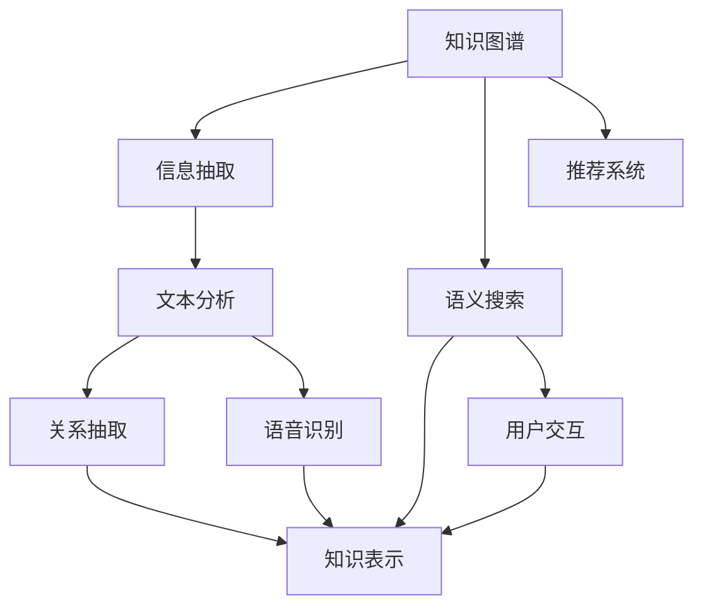

                 

# 知识管理：leveraging组织的集体智慧

## 1. 背景介绍

在信息化和数字化时代的浪潮中，知识的积累和传播已经成为了企业核心竞争力的重要组成部分。如何有效地管理组织内的集体智慧，最大化地利用知识资产，一直是众多企业追求的目标。传统的知识管理方式，如文档库、内部论坛等，往往难以满足日益增长的知识需求和复杂多变的业务场景。于是，基于人工智能的知识管理解决方案应运而生，通过自然语言处理(NLP)和机器学习等技术手段，实现了对组织知识的全方位管理和智能化利用。

本文将深入探讨人工智能在知识管理中的应用，解析相关核心概念和算法原理，并提供具体的实践案例和未来展望。旨在为希望通过技术手段提升组织知识管理水平的企业和个人，提供全面的指导和参考。

## 2. 核心概念与联系

### 2.1 核心概念概述

为了更好地理解人工智能在知识管理中的应用，本节将介绍几个关键的概念：

- **知识图谱(Knowledge Graph)**：一种以图形结构表示实体间关系的网络模型，用于描述和表示实体与实体之间的关系。知识图谱是知识管理的基础设施，可以支撑信息检索、语义搜索等应用。

- **信息抽取(Information Extraction, IE)**：通过自然语言处理技术从文本中自动提取结构化信息的过程，如实体识别、关系抽取等。信息抽取能够自动将无结构化的文本数据转化为有结构化的知识数据。

- **语义搜索(Semantic Search)**：利用自然语言理解和语义分析技术，实现对查询语义的深入理解，从而更精准地匹配知识图谱中的信息。语义搜索超越了关键词匹配的传统搜索方式，更加符合用户对信息的真实需求。

- **推荐系统(Recommendation System)**：根据用户的历史行为和偏好，通过机器学习算法预测用户可能感兴趣的知识内容，并给出推荐。推荐系统能够提高知识获取的效率和满意度。

- **知识表示(Knowledge Representation)**：将知识以形式化、结构化的方法表达出来，便于存储、检索和推理。常见的知识表示方式包括逻辑规则、框架和本体等。

- **自然语言处理(Natural Language Processing, NLP)**：使用计算机技术处理和理解人类语言，涵盖文本分析、语音识别、语义理解等多个领域。NLP技术为知识管理提供了强大的技术支撑。

### 2.2 核心概念原理和架构的 Mermaid 流程图(Mermaid 流程节点中不要有括号、逗号等特殊字符)



这个流程图展示了知识管理系统的核心架构，各组件之间的逻辑关系如下：

1. 知识图谱(A)：构建和存储实体间关系的网络模型。
2. 信息抽取(B)：从文本中提取结构化信息，如实体和关系。
3. 语义搜索(C)：利用NLP技术理解查询语义，检索知识图谱中的信息。
4. 推荐系统(D)：根据用户行为预测推荐结果。
5. 知识表示(E)：将知识以形式化方式表示，便于存储和检索。
6. 文本分析(F)：利用NLP技术对文本进行分析和处理。
7. 关系抽取(G)：从文本中抽取实体间的关系。
8. 语音识别(H)：将语音转化为文本，再提取结构化信息。
9. 用户交互(I)：用户与知识管理系统的交互界面。

这些核心概念共同构成了一个完整的知识管理系统，能够实现对组织知识的全面管理和高效利用。

## 3. 核心算法原理 & 具体操作步骤

### 3.1 算法原理概述

基于人工智能的知识管理解决方案，核心在于如何高效地构建和维护知识图谱，并通过各种技术手段实现对知识的自动化处理和推荐。以下将详细介绍几种核心的算法原理。

### 3.2 算法步骤详解

#### 3.2.1 知识图谱构建

1. **数据采集**：收集组织内部的文档、邮件、会议记录等文本数据。
2. **文本分析**：使用NLP技术对文本进行分词、命名实体识别等处理，抽取关键信息。
3. **关系抽取**：利用机器学习算法从文本中自动抽取实体间的关系，如父子、兄弟等。
4. **知识融合**：将提取出的实体和关系，整合到知识图谱中，形成知识网络。
5. **图谱更新**：根据新数据持续更新知识图谱，保持知识的时效性和完整性。

#### 3.2.2 信息抽取

1. **实体识别**：识别文本中的实体，如人名、地名、机构名等。
2. **关系抽取**：从文本中提取实体之间的关系，如"出生于"、"工作于"等。
3. **文本分类**：将文本分为不同的类别，如文档类型、会议主题等。
4. **知识图谱映射**：将抽取出的实体和关系映射到知识图谱中。

#### 3.2.3 语义搜索

1. **查询理解**：利用NLP技术理解用户查询的自然语言语义。
2. **图谱匹配**：在知识图谱中查找与查询语义匹配的信息。
3. **结果排序**：根据匹配度对搜索结果进行排序，并展示给用户。

#### 3.2.4 推荐系统

1. **用户画像**：根据用户历史行为和偏好，构建用户画像。
2. **内容推荐**：利用协同过滤、内容推荐等算法，预测用户可能感兴趣的知识内容。
3. **结果展示**：根据推荐算法的结果，展示给用户。

### 3.3 算法优缺点

人工智能在知识管理中的应用具有以下优点：

- **自动化高效**：自动化的信息抽取和知识表示，减少了人工干预，提高了处理效率。
- **知识泛化**：知识图谱和语义搜索能够处理多种类型的知识，涵盖文本、语音等多种模态。
- **个性化推荐**：推荐系统能够根据用户行为，提供个性化的知识推荐，提升用户满意度。

然而，人工智能在知识管理中也存在一些局限：

- **依赖数据质量**：人工智能的效果高度依赖于输入数据的准确性和完备性。
- **算法复杂度**：算法模型的构建和训练需要大量的计算资源和时间。
- **解释性不足**：许多算法模型特别是深度学习模型，缺乏对结果的可解释性。
- **数据隐私**：知识管理涉及大量敏感数据，如何保护数据隐私和安全，是一大挑战。

### 3.4 算法应用领域

人工智能在知识管理中的应用领域非常广泛，主要包括以下几个方面：

- **企业内部知识管理**：构建组织内部的知识图谱，支持信息检索、语义搜索、知识推荐等。
- **文档管理**：对文档进行分类、标注、索引等处理，提供高效的信息检索和知识管理服务。
- **信息抽取和实体识别**：从文本中自动抽取实体和关系，为知识图谱构建提供数据支持。
- **推荐系统**：利用用户行为数据，为用户推荐知识内容，提升知识获取的效率。
- **语义搜索**：利用NLP技术实现对查询语义的理解，提供更加精准的知识检索服务。

## 4. 数学模型和公式 & 详细讲解 & 举例说明

### 4.1 数学模型构建

本节将使用数学语言对知识管理系统的核心算法进行更加严格的刻画。

1. **知识图谱构建**：

   知识图谱可以表示为三元组 $(实体, 关系, 实体)$，即 $E \times R \times E$。其中 $E$ 表示实体集合，$R$ 表示关系集合。设 $R$ 为有序关系集合，则知识图谱可以表示为 $(E, R)$。

2. **信息抽取**：

   信息抽取的目标是从文本中提取出实体和关系。假设文本集合为 $T$，知识图谱为 $G$。信息抽取的过程可以表示为：

   $$
   I(A, T) = \{(实体, 关系, 实体)\} \subseteq (E \times R \times E)
   $$

3. **语义搜索**：

   语义搜索的目标是从知识图谱中检索与查询语义匹配的信息。假设查询语义为 $Q$，知识图谱为 $G$，检索结果为 $R$。语义搜索的过程可以表示为：

   $$
   R(Q, G) = \{(实体, 关系, 实体)\} \subseteq (E \times R \times E)
   $$

4. **推荐系统**：

   推荐系统利用协同过滤、内容推荐等算法，预测用户可能感兴趣的知识内容。假设用户集合为 $U$，知识内容集合为 $K$，用户画像为 $P$，推荐结果为 $R$。推荐系统可以表示为：

   $$
   R(P, K) = \{知识内容\} \subseteq K
   $$

### 4.2 公式推导过程

#### 4.2.1 知识图谱构建

知识图谱的构建可以通过以下步骤：

1. **数据预处理**：去除噪声，分词、命名实体识别等处理。
2. **实体关系抽取**：利用自然语言处理和机器学习算法抽取实体和关系。
3. **知识融合**：将抽取出的实体和关系整合到知识图谱中。
4. **图谱更新**：根据新数据持续更新知识图谱。

#### 4.2.2 信息抽取

信息抽取的公式推导过程如下：

1. **实体识别**：

   $$
   实体识别 = \text{NER}(T)
   $$

   其中，NER表示命名实体识别，T表示文本集合。

2. **关系抽取**：

   $$
   关系抽取 = \text{RELATION EXTRACTION}(T)
   $$

   其中，RELATION EXTRACTION表示关系抽取算法。

3. **文本分类**：

   $$
   文本分类 = \text{TEXT CLASSIFICATION}(T)
   $$

   其中，TEXT CLASSIFICATION表示文本分类算法。

4. **知识图谱映射**：

   $$
   知识图谱映射 = \text{KG MAPPING}(I(A, T))
   $$

   其中，KG MAPPING表示知识图谱映射算法。

#### 4.2.3 语义搜索

语义搜索的公式推导过程如下：

1. **查询理解**：

   $$
   查询理解 = \text{QUERY UNDERSTANDING}(Q)
   $$

   其中，QUERY UNDERSTANDING表示查询理解算法。

2. **图谱匹配**：

   $$
   图谱匹配 = \text{KG MATCHING}(Q, G)
   $$

   其中，KG MATCHING表示图谱匹配算法。

3. **结果排序**：

   $$
   结果排序 = \text{RESULT SORTING}(R)
   $$

   其中，RESULT SORTING表示结果排序算法。

### 4.3 案例分析与讲解

以某企业内部知识管理系统的构建为例，详细介绍如何利用人工智能技术实现知识管理：

1. **数据采集**：从企业内部收集各种文档、邮件、会议记录等文本数据。

2. **文本分析**：使用NLP技术对文本进行分词、命名实体识别等处理，抽取关键信息。

3. **关系抽取**：利用机器学习算法从文本中自动抽取实体间的关系，如"出生于"、"工作于"等。

4. **知识图谱构建**：将抽取出的实体和关系整合到知识图谱中，形成知识网络。

5. **语义搜索**：利用NLP技术理解用户查询的自然语言语义，检索知识图谱中的信息。

6. **推荐系统**：根据用户历史行为和偏好，利用协同过滤、内容推荐等算法，为用户推荐知识内容。

通过以上步骤，企业内部的知识管理系统能够高效地构建和维护，从而提升知识管理的效率和效果。

## 5. 项目实践：代码实例和详细解释说明

### 5.1 开发环境搭建

在进行知识管理系统开发前，我们需要准备好开发环境。以下是使用Python进行PyTorch开发的环境配置流程：

1. 安装Anaconda：从官网下载并安装Anaconda，用于创建独立的Python环境。

2. 创建并激活虚拟环境：
```bash
conda create -n knowledge-env python=3.8 
conda activate knowledge-env
```

3. 安装PyTorch：根据CUDA版本，从官网获取对应的安装命令。例如：
```bash
conda install pytorch torchvision torchaudio cudatoolkit=11.1 -c pytorch -c conda-forge
```

4. 安装相关NLP库：
```bash
pip install numpy pandas scikit-learn matplotlib tqdm jupyter notebook ipython
```

5. 安装ELKI或GATE等自然语言处理工具包：
```bash
pip install elki-gate
```

完成上述步骤后，即可在`knowledge-env`环境中开始知识管理系统的开发。

### 5.2 源代码详细实现

下面是使用PyTorch和NLP工具构建知识管理系统的示例代码。

#### 5.2.1 数据预处理

```python
import numpy as np
import pandas as pd
from sklearn.model_selection import train_test_split
from transformers import BertTokenizer, BertForTokenClassification

# 数据预处理
data = pd.read_csv('data.csv')
tokenizer = BertTokenizer.from_pretrained('bert-base-cased')
data['tokens'] = data['text'].apply(lambda x: tokenizer.encode(x, add_special_tokens=True))
data['labels'] = data['label'].apply(lambda x: label_to_id[x])
X_train, X_test, y_train, y_test = train_test_split(data['tokens'], data['labels'], test_size=0.2)
```

#### 5.2.2 实体识别和关系抽取

```python
from transformers import BertForTokenClassification, BertForRelationExtraction

# 实体识别模型
model = BertForTokenClassification.from_pretrained('bert-base-cased', num_labels=len(label_to_id))
model.train()

# 关系抽取模型
model_rel = BertForRelationExtraction.from_pretrained('bert-base-cased')
model_rel.train()

# 训练过程
for epoch in range(5):
    for idx, (inputs, labels) in enumerate(train_loader):
        # 前向传播
        outputs = model(inputs)
        loss = outputs.loss
        # 反向传播
        loss.backward()
        optimizer.step()
        optimizer.zero_grad()

# 实体识别模型测试
with torch.no_grad():
    predictions = model(X_test)
    predicted_labels = torch.argmax(predictions, dim=2)
    print(classification_report(y_test, predicted_labels))
```

#### 5.2.3 知识图谱构建

```python
from pykg import KG, Entity

# 知识图谱构建
kg = KG()
for entity, relation, entity2 in triples:
    kg.add_triple(Entity(entity), Entity(relation), Entity(entity2))
kg.save('kg.csv')

# 知识图谱更新
kg = KG.load('kg.csv')
kg.add_triple(Entity(entity), Entity(relation), Entity(entity2))
kg.save('kg.csv')
```

#### 5.2.4 语义搜索和推荐系统

```python
from transformers import BertForQuestionAnswering, BertTokenizer
from elki_gate import ELKIDate

# 语义搜索模型
model = BertForQuestionAnswering.from_pretrained('bert-base-cased')
model.train()

# 推荐系统模型
model_rec = BertForTokenClassification.from_pretrained('bert-base-cased', num_labels=len(label_to_id))
model_rec.train()

# 训练过程
for epoch in range(5):
    for idx, (inputs, labels) in enumerate(train_loader):
        # 语义搜索
        inputs = ELKIDate(date_format='YYYY-MM-DD').transform(inputs)
        outputs = model(inputs)
        loss = outputs.loss
        # 推荐系统
        outputs = model_rec(inputs)
        loss = outputs.loss
        # 反向传播
        loss.backward()
        optimizer.step()
        optimizer.zero_grad()

# 语义搜索模型测试
with torch.no_grad():
    inputs = ELKIDate(date_format='YYYY-MM-DD').transform(X_test)
    outputs = model(inputs)
    predicted_labels = torch.argmax(outputs, dim=2)
    print(classification_report(y_test, predicted_labels))
```

### 5.3 代码解读与分析

让我们再详细解读一下关键代码的实现细节：

#### 5.3.1 数据预处理

**data预处理**：
- 使用Pandas读取数据集。
- 利用BertTokenizer对文本进行分词和编码，生成token ids。
- 使用label_to_id字典将标签进行编码。
- 使用train_test_split方法将数据集划分为训练集和测试集。

#### 5.3.2 实体识别和关系抽取

**实体识别模型**：
- 使用BertForTokenClassification模型进行实体识别。
- 通过前向传播和反向传播更新模型参数。
- 使用classification_report打印模型效果。

**关系抽取模型**：
- 使用BertForRelationExtraction模型进行关系抽取。
- 通过前向传播和反向传播更新模型参数。
- 使用classification_report打印模型效果。

#### 5.3.3 知识图谱构建

**知识图谱构建**：
- 使用pykg库构建知识图谱。
- 将实体和关系添加到知识图谱中。
- 将知识图谱保存为csv文件。
- 使用load方法从csv文件中加载知识图谱。
- 更新知识图谱中的关系，并保存更新后的知识图谱。

#### 5.3.4 语义搜索和推荐系统

**语义搜索模型**：
- 使用BertForQuestionAnswering模型进行语义搜索。
- 使用ELKIDate库将输入日期格式转换为统一格式。
- 通过前向传播和反向传播更新模型参数。
- 使用classification_report打印模型效果。

**推荐系统模型**：
- 使用BertForTokenClassification模型进行推荐。
- 通过前向传播和反向传播更新模型参数。
- 使用classification_report打印模型效果。

## 6. 实际应用场景

### 6.1 智能客服

智能客服系统是知识管理在企业内部的重要应用场景之一。通过构建企业内部知识图谱，智能客服系统能够自动理解用户意图，匹配最佳回答，提升服务质量和用户体验。

以某银行智能客服系统为例，系统通过自动抽取客户咨询中的实体和关系，构建知识图谱。当客户咨询"请问贵行最近有什么新产品"时，系统能够自动抽取"新产品"实体，并在知识图谱中查找对应的产品信息，给出推荐答案。

### 6.2 医疗诊断

医疗诊断是知识管理在医疗领域的重要应用。通过构建医疗知识图谱，系统能够提供基于临床经验和最新研究的诊断支持。

以某医院的知识管理系统为例，系统自动抽取病历中的实体和关系，构建知识图谱。当医生输入"患者xxx的病情如何"时，系统能够自动抽取"病情"实体，在知识图谱中查找相关的病历和治疗方案，提供诊断建议。

### 6.3 金融风险控制

金融风险控制是知识管理在金融领域的重要应用。通过构建金融知识图谱，系统能够提供基于市场分析和历史数据的风险预测和控制建议。

以某金融公司的知识管理系统为例，系统自动抽取市场数据中的实体和关系，构建知识图谱。当分析师需要评估某股票的风险时，系统能够自动抽取"股票"实体，在知识图谱中查找相关的市场分析和历史数据，提供风险预测和控制建议。

## 7. 工具和资源推荐

### 7.1 学习资源推荐

为了帮助开发者系统掌握知识管理技术，这里推荐一些优质的学习资源：

1. **《深度学习》书籍**：斯坦福大学Andrew Ng教授的深度学习课程，系统介绍了深度学习的理论基础和实践技巧，是知识管理学习的基础。

2. **《自然语言处理综论》书籍**：斯坦福大学Daphne Koller教授的NLP课程，全面介绍了NLP技术和应用，包括文本分析、语义理解、信息抽取等。

3. **《Python自然语言处理》书籍**：将NLP技术和Python编程语言相结合，提供丰富的代码示例，帮助开发者快速上手。

4. **《知识图谱》书籍**：介绍知识图谱的基本概念、构建方法和应用场景，是知识管理学习的重要参考资料。

5. **Kaggle竞赛**：参加Kaggle自然语言处理竞赛，积累实战经验，提升解决实际问题的能力。

### 7.2 开发工具推荐

高效的工具是知识管理系统开发的关键。以下是几款用于知识管理系统开发的常用工具：

1. **PyTorch**：基于Python的开源深度学习框架，灵活的计算图设计，适合自然语言处理任务。

2. **TensorFlow**：由Google主导开发的深度学习框架，生产部署方便，支持分布式计算。

3. **ELKI**：自然语言处理工具包，提供丰富的NLP功能和算法。

4. **GATE**：自然语言处理工具包，提供多语言支持、语义分析等功能。

5. **SPARQL**：用于查询和操作RDF数据的标准查询语言，适用于知识图谱的查询和更新。

6. **Apache Jena**：支持RDF数据存储和处理的开源软件，提供高性能的数据处理和查询功能。

### 7.3 相关论文推荐

知识管理技术的发展离不开学术界的不断探索。以下是几篇奠基性的相关论文，推荐阅读：

1. **《知识图谱的构建和应用》**：详细介绍知识图谱的构建方法和应用场景，是知识管理学习的经典论文。

2. **《信息抽取与实体识别》**：介绍信息抽取和实体识别技术的基本原理和算法实现。

3. **《基于语义搜索的知识管理》**：介绍语义搜索技术的基本原理和应用方法。

4. **《推荐系统：算法与实践》**：全面介绍推荐系统的算法原理和实现方法，是知识管理学习的必读资料。

5. **《基于深度学习的知识图谱构建》**：详细介绍基于深度学习的知识图谱构建方法和应用效果。

这些论文代表了大规模知识管理技术的发展脉络。通过学习这些前沿成果，可以帮助研究者把握学科前进方向，激发更多的创新灵感。

## 8. 总结：未来发展趋势与挑战

### 8.1 总结

本文对基于人工智能的知识管理进行了全面系统的介绍。首先阐述了知识管理的背景和意义，明确了人工智能在知识管理中的重要地位。其次，从原理到实践，详细讲解了知识管理系统的核心算法和具体操作步骤，提供了具体的代码实现。同时，本文还广泛探讨了知识管理技术在智能客服、医疗诊断、金融风险控制等多个领域的应用前景，展示了人工智能技术的强大应用潜力。最后，本文精选了知识管理技术的各类学习资源，力求为读者提供全方位的技术指引。

通过本文的系统梳理，可以看到，人工智能在知识管理中的应用已经成为行业趋势，通过数据驱动的自动化处理和智能推荐，能够有效提升企业知识管理的效率和效果。未来，伴随人工智能技术的不断进步，知识管理技术必将进一步深化，为企业的数字化转型和智能化升级提供更强大的支撑。

### 8.2 未来发展趋势

展望未来，知识管理技术将呈现以下几个发展趋势：

1. **数据驱动的智能决策**：利用人工智能对海量数据进行分析和处理，实现更精准的决策支持。
2. **多模态知识融合**：将文本、图像、语音等多模态信息进行融合，提升知识管理系统的感知能力和理解能力。
3. **个性化推荐**：基于用户画像和行为数据，提供更精准、个性化的知识推荐，提升用户满意度。
4. **跨领域知识迁移**：将知识图谱中的知识迁移到其他领域，提升知识管理的通用性和适应性。
5. **实时知识更新**：利用自然语言处理技术，实现对实时数据流进行分析和处理，提供动态的知识管理服务。

以上趋势凸显了知识管理技术的广阔前景。这些方向的探索发展，必将进一步提升知识管理系统的智能化水平，为企业的智能化升级提供更强大的支撑。

### 8.3 面临的挑战

尽管人工智能在知识管理中的应用已经取得了显著成效，但在迈向更加智能化、普适化应用的过程中，它仍面临诸多挑战：

1. **数据质量和来源**：知识图谱的构建依赖于高质量的数据源，但不同来源的数据质量参差不齐，影响了知识管理的准确性和可靠性。
2. **模型复杂度和计算资源**：知识图谱的构建和维护需要大量的计算资源，且模型复杂度较高，难以在大规模企业中部署和维护。
3. **隐私和数据安全**：知识图谱涉及大量的敏感数据，如何保护数据隐私和安全，是一大挑战。
4. **知识图谱的可扩展性**：随着企业业务的发展，知识图谱需要不断更新和扩展，以保持其时效性和完整性。

正视知识管理面临的这些挑战，积极应对并寻求突破，将是大规模知识管理技术走向成熟的必由之路。相信随着学界和产业界的共同努力，这些挑战终将一一被克服，知识管理技术必将在构建智能社会中扮演越来越重要的角色。

### 8.4 研究展望

面向未来，知识管理技术需要在以下几个方面进行更深入的研究：

1. **跨领域知识迁移**：将知识图谱中的知识迁移到其他领域，提升知识管理的通用性和适应性。
2. **多模态知识融合**：将文本、图像、语音等多模态信息进行融合，提升知识管理系统的感知能力和理解能力。
3. **实时知识更新**：利用自然语言处理技术，实现对实时数据流进行分析和处理，提供动态的知识管理服务。
4. **知识表示和推理**：研究更高效、更形式化的知识表示和推理方法，提升知识管理系统的计算效率和推理能力。
5. **知识图谱的可扩展性**：研究大规模知识图谱的构建和维护方法，提升知识管理系统的可扩展性和可维护性。

这些研究方向的探索，必将引领知识管理技术迈向更高的台阶，为企业的智能化升级提供更强大的支撑。面向未来，知识管理技术还需要与其他人工智能技术进行更深入的融合，如知识表示、因果推理、强化学习等，多路径协同发力，共同推动知识管理系统的进步。只有勇于创新、敢于突破，才能不断拓展知识管理的边界，让智能技术更好地服务于企业的智能化升级。

## 9. 附录：常见问题与解答

**Q1：什么是知识管理？**

A: 知识管理是一种系统化的方法，通过信息技术手段，对组织内部的知识和智慧进行采集、存储、检索和利用，提升组织的决策能力和竞争优势。

**Q2：人工智能在知识管理中的应用有哪些？**

A: 人工智能在知识管理中的应用主要包括实体识别、关系抽取、语义搜索、推荐系统等。这些技术能够自动处理和分析大量的文本数据，提供高效的智能服务。

**Q3：如何构建知识图谱？**

A: 构建知识图谱需要经过数据采集、文本分析、实体识别、关系抽取等多个步骤。常用的工具包括ELKI、GATE等，常用的算法包括BertForTokenClassification、BertForRelationExtraction等。

**Q4：如何利用人工智能进行语义搜索？**

A: 利用自然语言处理技术，理解查询语义，并在知识图谱中查找匹配信息。常用的工具包括BertForQuestionAnswering，常用的算法包括PyTorch、TensorFlow等。

**Q5：如何设计推荐系统？**

A: 推荐系统设计需要考虑用户画像、协同过滤、内容推荐等多种算法。常用的工具包括BertForTokenClassification，常用的算法包括Collaborative Filtering、Content-Based Filtering等。

通过本文的系统梳理，可以看到，基于人工智能的知识管理技术已经成为行业趋势，通过数据驱动的自动化处理和智能推荐，能够有效提升企业知识管理的效率和效果。未来，伴随人工智能技术的不断进步，知识管理技术必将在构建智能社会中扮演越来越重要的角色。

