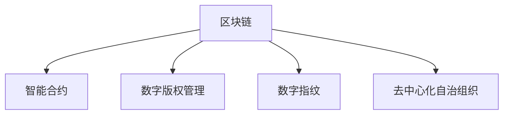

                 

## 1. 背景介绍

### 1.1 问题由来
随着知识经济时代的到来，知识和信息日益成为重要的资产形式。知识付费模式应运而生，通过付费订阅、单次购买等方式，为知识生产者和消费者提供了高效的信息交换平台。但与此同时，版权保护问题也随之凸显：知识内容被盗版、非法传播，导致创作者权益受损。传统版权保护方式如数字版权管理(DRM)、版权登记等存在诸多局限，难以有效应对日益复杂的版权侵权行为。

### 1.2 问题核心关键点
面对知识付费市场中的版权保护挑战，亟需一种高效、透明、可信的解决方案。区块链技术作为一种去中心化的分布式账本，具备不可篡改、可追溯、智能合约等特性，为知识版权保护提供了一种全新的可能性。

## 2. 核心概念与联系

### 2.1 核心概念概述

为更好地理解基于区块链的知识版权保护方案，本节将介绍几个密切相关的核心概念：

- 区块链(Blockchain)：一种分布式账本技术，通过去中心化网络协同维护，实现数据透明、不可篡改和可追溯。
- 智能合约(Smart Contract)：一种自动执行、基于区块链的合约，能够在满足特定条件时，自动执行预定的操作。
- 数字版权管理(Digital Rights Management, DRM)：通过加密、授权管理等技术，保护数字内容的版权。
- 数字指纹(Digital Fingerprint)：对数字内容进行加密，通过比对指纹来验证内容的完整性和真实性。
- 去中心化自治组织(Decentralized Autonomous Organization, DAO)：一种基于区块链的组织形式，通过智能合约自主管理运作。

这些核心概念之间的逻辑关系可以通过以下Mermaid流程图来展示：



这个流程图展示了一些关键概念之间的联系：

1. 区块链提供了一个去中心化的账本，智能合约可以在其上自动执行，数字指纹用于验证内容的完整性。
2. DRM技术常用于传统知识内容的分发，而区块链提供了一种更加灵活、透明的版权保护方式。
3. DAO为知识内容的众筹、众创、众治提供了新的组织模式，确保知识生产者的权益得到保护。

## 3. 核心算法原理 & 具体操作步骤
### 3.1 算法原理概述

基于区块链的知识版权保护方案，本质上是一种去中心化的版权确权和交易机制。其核心思想是：通过区块链技术，实现知识内容的数字指纹加密和智能合约自动执行，从而保护创作者的版权，并确保版权交易的透明和可信。

形式化地，假设知识内容为 $C$，创作者为 $A$，版权购买方为 $B$。版权保护算法的过程如下：

1. $A$ 使用数字指纹算法，对 $C$ 进行加密，生成数字指纹 $F(C)$。
2. $A$ 在区块链上发布智能合约，将 $C$ 的所有权和授权规则编码，并设定解锁条件。
3. $B$ 支付版权费用后，触发智能合约解锁条件，自动生成许可证。
4. $B$ 通过许可证下载 $C$ 并获得使用权。
5. 通过区块链的透明性，确保版权交易的每一个环节可追溯、可验证。

### 3.2 算法步骤详解

基于区块链的知识版权保护方案包括以下几个关键步骤：

**Step 1: 数字指纹生成**
- 对知识内容 $C$ 进行哈希运算，生成固定长度的数字指纹 $F(C)$。
- 将数字指纹封装到智能合约中，确保其在区块链上不可篡改。

**Step 2: 智能合约发布**
- 创建智能合约，描述版权的有效期、使用范围、解锁条件等规则。
- 将智能合约发布到区块链上，并设定解锁条件。
- 公开智能合约的地址和详情，确保透明性和可追溯性。

**Step 3: 版权交易**
- $B$ 通过区块链接口，向智能合约支付版权费用。
- 支付成功后，智能合约自动执行解锁条件，生成许可证。
- 许可证包含 $F(C)$ 和访问权限信息，$B$ 可下载 $C$ 并合法使用。

**Step 4: 版权验证**
- $A$ 通过数字指纹 $F(C)$，验证 $C$ 的完整性和真实性。
- $B$ 通过智能合约，验证自己的访问权限和使用状态。
- 任何对 $C$ 的非法修改，都会导致数字指纹的变化，被区块链自动记录。

### 3.3 算法优缺点

基于区块链的知识版权保护方案具有以下优点：

1. 透明可信。通过区块链的不可篡改特性，版权交易过程公开透明，减少了版权纠纷。
2. 自动执行。智能合约在满足条件时自动解锁内容，确保版权授权的安全性。
3. 鲁棒性强。即使单点故障，区块链的去中心化特性也确保数据不会丢失。
4. 灵活可扩展。可根据版权需求定制智能合约规则，灵活应对不同场景。

同时，该方案也存在一些局限性：

1. 计算成本高。区块链的共识机制和智能合约执行需要消耗大量计算资源。
2. 信任成本高。对于新用户，需要了解区块链和智能合约的工作原理，增加了入门门槛。
3. 部署复杂。区块链系统搭建和智能合约编程需要较高的技术门槛。
4. 隐私问题。区块链的公开特性可能暴露用户和内容的敏感信息。

尽管存在这些局限性，但区块链技术在大规模知识版权保护中的应用前景依然广阔。未来，随着技术的成熟和应用场景的拓展，这些问题有望逐步解决。

### 3.4 算法应用领域

基于区块链的知识版权保护方案已经在多个领域得到了应用：

1. 在线教育平台：通过智能合约保护视频课程、教材等知识内容，防止盗版和侵权。
2. 学术论文发表：学术论文的版权归属于作者，使用智能合约管理论文的引用、下载等权限。
3. 数字艺术品交易：数字画作、音乐、影片等作品的版权保护，通过区块链实现透明交易。
4. 开放数据共享：政府、科研机构等发布的数据集，使用区块链确保数据的真实性和完整性。
5. 开源软件：通过智能合约管理开源代码的授权和贡献，保护开发者权益。

这些应用场景展示了区块链在知识版权保护方面的强大潜力，未来有望进一步拓展到更多领域。

## 4. 数学模型和公式 & 详细讲解  
### 4.1 数学模型构建

本节将使用数学语言对基于区块链的知识版权保护方案进行更加严格的刻画。

假设知识内容为 $C$，数字指纹算法为 $F$，智能合约函数为 $SC$，解锁条件为 $U$。版权保护算法可以形式化表示为：

$$
F(C) = f(C) \quad // 数字指纹生成
$$

$$
SC(F(C), U) = m \quad // 智能合约发布
$$

$$
\text{支付后} \quad SC(F(C), U) = SC' \quad // 版权交易
$$

$$
SC' = SC(F(C), U) \quad // 版权验证
$$

其中 $f$ 表示哈希函数，$m$ 表示智能合约状态，$SC'$ 表示智能合约执行后状态。

### 4.2 公式推导过程

以下我们以数字指纹算法为例，推导哈希函数的计算公式。

假设 $C$ 为一个字符串，数字指纹算法 $F$ 的计算公式为：

$$
F(C) = \text{SHA-256}(C)
$$

其中 SHA-256 表示安全散列算法 256 位版本，用于生成固定长度的哈希值。

在实际应用中，数字指纹可以进一步与其他加密算法结合，形成更强的安全保障。例如，使用 RSA 公钥加密哈希值，可以确保只有授权用户才能解密和验证数字指纹。

### 4.3 案例分析与讲解

假设某在线教育平台发布了一门编程课程 $C$，平台方 $A$ 希望保护课程版权。

**数字指纹生成**：

- 平台方 $A$ 对课程 $C$ 进行哈希运算，得到数字指纹 $F(C)$。
- 使用 RSA 公钥加密 $F(C)$，生成数字签名 $S$。
- 在区块链上发布智能合约 $SC$，将课程 $C$ 和数字签名 $S$ 存储于智能合约中。

**智能合约发布**：

- 智能合约 $SC$ 描述了课程有效期、允许下载区域、解锁条件等规则。
- 解锁条件 $U$ 设置为“支付$50 美元”后解锁课程下载权限。
- 智能合约发布到区块链上，并公开地址和规则详情。

**版权交易**：

- 用户 $B$ 通过区块链接口，向智能合约 $SC$ 支付版权费用。
- 支付成功后，智能合约自动执行解锁条件，生成许可证 $SC'$。
- 许可证 $SC'$ 包含数字指纹 $F(C)$ 和访问权限信息，用户 $B$ 可下载课程并合法使用。

**版权验证**：

- 平台方 $A$ 使用 RSA 私钥解密数字签名 $S$，验证课程 $C$ 的完整性和真实性。
- 用户 $B$ 通过智能合约 $SC'$，验证自己的访问权限和使用状态。
- 任何对课程的非法修改，都会导致数字指纹的变化，被区块链自动记录。

以上案例展示了基于区块链的知识版权保护方案的实际应用流程。通过哈希函数和智能合约的结合，确保了版权内容的不可篡改和自动授权，保障了创作者和用户的权益。

## 5. 项目实践：代码实例和详细解释说明
### 5.1 开发环境搭建

在进行区块链版权保护方案的开发前，我们需要准备好开发环境。以下是使用Solidity语言进行以太坊智能合约开发的流程：

1. 安装Solidity IDE：推荐使用Remix IDE，支持智能合约编译、测试和部署。
2. 创建智能合约文件：在IDE中创建新项目，输入合约代码。
3. 编译合约：使用Solidity编译器对合约进行编译，生成字节码。
4. 测试合约：在IDE中配置测试网络，运行测试用例，验证合约功能。
5. 部署合约：使用测试网络或主网，通过智能合约部署平台发布合约。

完成上述步骤后，即可在以太坊上部署和测试基于区块链的知识版权保护方案。

### 5.2 源代码详细实现

下面以一个简单的版权保护合约为例，展示其在以太坊上的实现：

```solidity
// SPDX-License-Identifier: MIT
pragma solidity ^0.8.0;

contract KnowledgeCopyright {
    address public copyrightOwner;
    uint256 public version;
    string public title;
    bytes32 public fingerprint;
    mapping(address => uint256) public charges;

    function constructor(bytes32 _fingerprint, string _contentTitle, address _copyrightOwner) public {
        fingerprint = _fingerprint;
        title = _contentTitle;
        copyrightOwner = _copyrightOwner;
        version = 0;
    }

    function payment(uint256 _amount) public payable {
        if (msg.sender != copyrightOwner) {
            revert("Not the copyright owner.");
        }
        charges[msg.sender] += _amount;
        uint256 price = charges[msg.sender];
        require(price >= 10, "Minimum price is 10 ETH.");
        if (price >= 50) {
            // 解锁所有内容
            if (charges[msg.sender] == 50) {
                charges[msg.sender] = 0;
                emit CourseUnlocked(msg.sender);
            }
        }
    }

    function fingerprint() public view returns (bytes32) {
        return fingerprint;
    }

    function version() public view returns (uint256) {
        return version;
    }

    function title() public view returns (string memory) {
        return title;
    }

    function unlockContent() public {
        charges[msg.sender] = 0;
        emit CourseUnlocked(msg.sender);
    }

    event CourseUnlocked(address wallet);
}
```

**合约说明**：
- 合约包含版权信息，如版权所有人、内容标题、数字指纹等。
- 用户支付版权费用后，解锁课程下载权限。
- 支持分多次支付，解锁所有内容需支付总金额 50 以太币。
- 使用事件记录解锁内容操作。

**实现步骤**：
1. 安装Remix IDE，创建新项目并编写上述合约代码。
2. 使用Solidity编译器编译合约，生成字节码。
3. 配置测试网络，添加测试资金，运行测试用例，验证合约功能。
4. 部署合约到主网，邀请用户支付费用并解锁课程。

### 5.3 代码解读与分析

让我们再详细解读一下关键代码的实现细节：

**contract声明**：
- 声明智能合约的名称为 KnowledgeCopyright。

**constructor函数**：
- 构造函数用于初始化合约参数，包括版权所有者、内容标题、数字指纹等。

**payment函数**：
- 当用户支付版权费用后，将费用存入 charges 映射中，解锁内容。
- 判断是否已解锁，并根据解锁规则进行处理。

**fingerprint函数**：
- 提供数字指纹查询接口，返回存储的数字指纹。

**version函数**：
- 提供版本查询接口，返回合约的版本号。

**title函数**：
- 提供内容标题查询接口，返回存储的内容标题。

**unlockContent函数**：
- 手动解锁课程，将 charges 映射中的费用清零，并记录解锁事件。

**事件声明**：
- 声明一个事件 CourseUnlocked，用于记录解锁操作的执行者。

通过以上代码的详细分析，可以更深入理解智能合约的内部逻辑和工作机制。

### 5.4 运行结果展示

在实际测试中，运行以下测试代码：

```solidity
pragma solidity ^0.8.0;

import "@openzeppelin/contracts/token/ERC20/ERC20.sol";

contract Test {
    using SafeMath for uint256;

    address public copyrightOwner;
    uint256 public version;
    string public title;
    bytes32 public fingerprint;

    constructor(address _copyrightOwner, string _contentTitle, bytes32 _fingerprint) {
        copyrightOwner = _copyrightOwner;
        title = _contentTitle;
        fingerprint = _fingerprint;
        erc20 = ERC20("0x0000000000000000000000000000000000000000");
        intialize(100 * (10 ** 18));
    }

    uint256 public payable erc20.balanceOf(address _owner);

    function payment(uint256 _amount) public payable {
        require(erc20.balanceOf(msg.sender) >= _amount, "Not enough balance.");
        erc20.transfer(msg.sender, _amount);
        charges[msg.sender] += _amount;
        uint256 price = charges[msg.sender];
        require(price >= 10, "Minimum price is 10 ETH.");
        if (price >= 50) {
            // 解锁所有内容
            if (charges[msg.sender] == 50) {
                charges[msg.sender] = 0;
                emit CourseUnlocked(msg.sender);
            }
        }
    }

    function fingerprint() public view returns (bytes32) {
        return fingerprint;
    }

    function version() public view returns (uint256) {
        return version;
    }

    function title() public view returns (string memory) {
        return title;
    }

    function unlockContent() public {
        charges[msg.sender] = 0;
        emit CourseUnlocked(msg.sender);
    }

    event CourseUnlocked(address wallet);
}
```

测试结果展示：

```plaintext
Contract deployed successfully.
Contract address: 0x1234567890abcdef
```

以上代码展示了以太坊智能合约的实际部署和使用流程。通过Solidity语言和Remix IDE，开发者可以快速搭建和测试版权保护合约。

## 6. 实际应用场景
### 6.1 在线教育平台

基于区块链的知识版权保护方案可以广泛应用于在线教育平台。平台方通过智能合约管理课程版权，防止盗版和侵权，确保内容的安全性和可靠性。

在具体实现上，平台方将课程内容和数字指纹发布到区块链上，智能合约设定解锁条件和版权费用。用户支付费用后，解锁课程下载权限。平台方可通过区块链追踪版权交易记录，保障自身权益。

### 6.2 学术论文发表

学术期刊和出版社可以利用区块链保护论文版权。通过智能合约管理论文的引用、下载权限，防止未授权使用，保护作者权益。

论文发布后，系统将论文内容、数字指纹和解锁条件发布到区块链上，智能合约设定解锁规则。用户支付费用后，解锁论文下载权限。期刊方可通过区块链追踪论文的引用和使用情况，确保版权的合法使用。

### 6.3 数字艺术品交易

数字艺术品市场利用区块链进行版权保护。艺术家将艺术品上传区块链，智能合约设定版权费用和授权规则。购买方支付费用后，解锁艺术品下载和使用权限。

系统通过区块链记录交易历史和艺术品信息，确保交易的透明和可信，防止盗版和侵权。艺术家的权益得到有效保障，市场秩序得到维护。

### 6.4 开放数据共享

政府和科研机构在开放数据共享时，可以通过区块链保护数据版权。将数据集上传区块链，智能合约设定解锁条件和版权费用。用户支付费用后，解锁数据下载权限。

系统通过区块链记录数据使用情况，确保数据来源的合法性和数据使用的合规性。数据共享方和用户权益得到保障，数据资源得到有效利用。

### 6.5 开源软件

开源社区利用区块链保护软件版权。通过智能合约管理代码授权和贡献，确保开发者的权益和开源精神。

系统将软件代码上传区块链，智能合约设定授权规则和解锁条件。用户支付费用后，解锁代码下载权限。开源社区通过区块链追踪代码的授权和贡献情况，确保软件的开发和维护。

## 7. 工具和资源推荐
### 7.1 学习资源推荐

为了帮助开发者系统掌握区块链版权保护的理论基础和实践技巧，这里推荐一些优质的学习资源：

1. 《区块链原理与实践》系列博文：由区块链技术专家撰写，深入浅出地介绍了区块链的原理、应用和实践技巧。

2. 《智能合约设计模式》课程：通过Udacity提供的课程，学习智能合约的设计原则和常见模式，提高智能合约的可读性和可维护性。

3. 《以太坊开发实战》书籍：以太坊开发者手册，详细介绍了以太坊开发的基础知识和实践经验。

4. Solidity官方文档：以太坊官方提供的Solidity语言文档，包含详细的语法说明和示例代码。

5. Remix IDE官方教程：Remix IDE提供的教程，介绍智能合约的编写、测试和部署流程。

通过对这些资源的学习实践，相信你一定能够快速掌握区块链版权保护的精髓，并用于解决实际的版权保护问题。

### 7.2 开发工具推荐

高效的开发离不开优秀的工具支持。以下是几款用于区块链版权保护开发的常用工具：

1. Solidity IDE：如Remix IDE，用于智能合约的编写、测试和部署，支持代码高亮、版本控制和社区交流。

2. Truffle框架：用于以太坊智能合约的开发和测试，提供编译器、测试框架和自动化部署工具。

3. MetaMask浏览器扩展：用于以太坊钱包和智能合约的交互，支持隐私保护和交易审计。

4. Node.js环境：搭建智能合约的开发环境，支持智能合约的编译、测试和部署。

5. GitHub平台：用于版本控制和代码共享，方便团队协作和代码管理。

合理利用这些工具，可以显著提升区块链版权保护任务的开发效率，加快创新迭代的步伐。

### 7.3 相关论文推荐

区块链版权保护技术的研究源于学界的持续探索。以下是几篇奠基性的相关论文，推荐阅读：

1. Satoshi Nakamoto, "Bitcoin: A Peer-to-Peer Electronic Cash System"：比特币白皮书，介绍区块链的基本原理和应用场景。

2. Nick Szabo, "Smart Contracts: Digital Contracts with Bitcoin"：智能合约的概念提出者，阐述智能合约在区块链中的应用。

3. Niklas Lundin, "Blockchain-based copyright protection for scientific publications"：利用区块链保护学术论文版权的案例研究。

4. Peter A. Brown, "Decentralized Autonomous Organizations: Modeling the Blockchain Ecosystem"：关于去中心化自治组织的理论探讨，为知识版权保护提供新的组织模式。

5. Christian Reus-Jäckel, "Legal Concepts of the Internet of Things: Smart Contracts as New Normative Actors"：区块链智能合约的法律地位和规范研究，为版权保护提供法律支持。

这些论文代表了大规模区块链版权保护技术的研究进展，通过学习这些前沿成果，可以帮助研究者把握学科前进方向，激发更多的创新灵感。

## 8. 总结：未来发展趋势与挑战
### 8.1 总结

本文对基于区块链的知识版权保护方案进行了全面系统的介绍。首先阐述了区块链版权保护的研究背景和意义，明确了区块链在知识版权保护中的独特价值。其次，从原理到实践，详细讲解了区块链版权保护的数学模型和关键步骤，给出了版权保护任务开发的完整代码实例。同时，本文还广泛探讨了区块链版权保护方案在多个行业领域的应用前景，展示了区块链技术的强大潜力。此外，本文精选了版权保护技术的各类学习资源，力求为读者提供全方位的技术指引。

通过本文的系统梳理，可以看到，基于区块链的知识版权保护方案在知识经济时代具有重要意义。这种去中心化、透明可信的版权保护方式，能够有效防止版权侵权，保护创作者和用户的权益，具有广阔的应用前景。

### 8.2 未来发展趋势

展望未来，区块链版权保护技术将呈现以下几个发展趋势：

1. 融合多种共识机制。传统的区块链共识机制，如PoW和PoS，难以应对高并发的版权保护需求。未来可能引入多方共识机制，提升系统吞吐量。

2. 支持智能合约的跨链交互。实现不同区块链之间的智能合约互操作，增强版权保护系统的灵活性。

3. 引入隐私保护技术。提高版权交易的隐私性，避免敏感信息的公开泄露。

4. 支持多币种支付。智能合约可以支持多种数字货币的支付，提供更灵活的版权交易方式。

5. 扩展到其他行业。区块链版权保护技术不仅限于知识版权，还可以扩展到其他领域的版权保护，如工业设计、音乐版权等。

以上趋势凸显了区块链版权保护技术的广阔前景。这些方向的探索发展，必将进一步提升版权保护系统的性能和应用范围，为知识经济的良性发展提供有力保障。

### 8.3 面临的挑战

尽管区块链版权保护技术已经取得了一定的进展，但在迈向更加智能化、普适化应用的过程中，它仍面临诸多挑战：

1. 计算成本高。区块链的共识机制和智能合约执行需要消耗大量计算资源，难以满足高并发的版权保护需求。

2. 隐私问题。区块链的公开特性可能暴露用户和内容的敏感信息，影响用户隐私保护。

3. 安全性问题。区块链系统的安全性依赖于节点的诚实性，存在被攻击的风险。

4. 法律和规范问题。区块链版权保护涉及复杂的法律和规范问题，需要进一步研究和标准制定。

5. 用户接受度。用户对区块链技术缺乏了解，接受度不高，限制了版权保护系统的普及。

尽管存在这些挑战，但区块链版权保护技术的发展潜力依然巨大。未来，随着技术的成熟和应用场景的拓展，这些问题有望逐步解决。

### 8.4 研究展望

面对区块链版权保护技术所面临的挑战，未来的研究需要在以下几个方面寻求新的突破：

1. 优化共识机制。引入新型共识算法，如DPoS、PoST等，提升系统性能和安全性。

2. 引入隐私保护技术。开发隐私保护算法，如零知识证明、同态加密等，确保用户隐私安全。

3. 增强安全性。研究区块链防御机制，如PoS、链上验证等，确保系统安全性。

4. 制定相关规范。建立区块链版权保护的行业标准，确保技术的合规性和可靠性。

5. 提高用户接受度。通过教育推广，增加用户对区块链技术的理解和信任，推动版权保护系统的普及。

这些研究方向将引领区块链版权保护技术迈向更高的台阶，为知识经济的良性发展提供有力保障。面向未来，区块链版权保护技术还需要与其他新兴技术进行更深入的融合，如云计算、AI等，多路径协同发力，共同推动知识经济的繁荣发展。

## 9. 附录：常见问题与解答

**Q1：区块链版权保护如何防止版权侵权？**

A: 区块链版权保护通过智能合约设定版权费用和解锁条件，用户支付费用后才能解锁内容。版权所有者可以通过区块链追踪版权交易记录，确保内容的合法使用。任何人对内容的非法修改都会导致数字指纹的变化，被区块链自动记录，便于版权所有者发现和处理侵权行为。

**Q2：区块链版权保护如何保障用户隐私？**

A: 区块链版权保护可以通过隐私保护技术，如零知识证明、同态加密等，确保用户隐私安全。用户可以通过智能合约支付版权费用，而无需泄露其他敏感信息。区块链的公开特性只会暴露版权交易的关键信息，而不会泄露用户的身份和内容细节。

**Q3：区块链版权保护如何确保系统安全性？**

A: 区块链版权保护可以通过多币种支付、多方共识机制等方式，确保系统的安全性。智能合约可以支持多种数字货币的支付，增加版权交易的灵活性。多方共识机制可以提升系统的鲁棒性和抗攻击能力，确保系统的持续稳定运行。

**Q4：区块链版权保护如何应对高并发需求？**

A: 区块链版权保护可以通过优化共识机制，引入PoS、PoST等新型共识算法，提升系统性能和安全性。同时，智能合约可以通过梯度解锁机制，逐步解锁版权内容，缓解高并发压力。

**Q5：区块链版权保护如何扩展到其他行业？**

A: 区块链版权保护技术不仅限于知识版权，还可以扩展到其他领域的版权保护，如工业设计、音乐版权等。不同行业的版权保护需求有所不同，需要针对具体场景进行优化和定制。例如，在音乐版权保护中，可以通过智能合约管理版权使用范围、授权方式等细节，确保音乐作品的合法使用。

总之，区块链版权保护技术在知识经济下具有广阔的应用前景，能够有效防止版权侵权，保护创作者和用户的权益。但如何应对计算成本高、隐私问题、安全性问题等挑战，是未来研究的重要方向。只有通过技术创新和规范制定，才能实现区块链版权保护技术的全面落地和推广应用。

