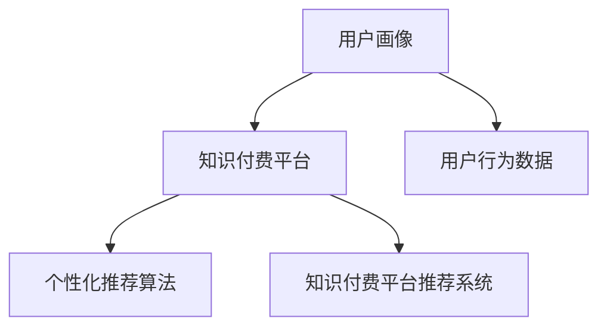

                 

# 知识经济下知识付费的大数据用户画像分析模型

在知识经济时代，大数据和人工智能技术正深刻改变着教育、娱乐、金融等多个领域，而知识付费作为信息消费的新形式，已成为知识传播的重要渠道。如何利用大数据技术，构建精准的用户画像分析模型，提升知识付费平台的用户体验，推动知识付费的商业变现，是当下亟待解决的重要问题。本文将深入探讨知识付费背景下的用户画像分析模型构建方法，并结合具体案例分析，提出模型优化策略和未来发展趋势。

## 1. 背景介绍

### 1.1 知识付费兴起背景

随着互联网的普及和信息爆炸时代的到来，人们获取知识的需求日益增长。知识付费作为在线教育和内容消费的新形式，逐渐成为知识传播的主流渠道。知识付费平台如Coursera、Udemy、知乎live、得到等，通过专业讲师分享深度知识，快速聚集了大批忠实用户，市场规模迅速扩大。

用户对知识付费的需求正在从泛泛的课程订阅，向个性化的知识消费转变。如何通过大数据技术，构建用户画像，洞察用户需求，提升用户体验，将是知识付费平台亟待解决的问题。

### 1.2 大数据技术应用现状

大数据技术包括数据采集、存储、处理和分析等方面。目前，大数据技术已在金融风控、智能推荐、精准广告等多个领域得到广泛应用。在知识付费领域，用户数据作为知识付费的重要组成部分，同样是大数据分析的重要方向。通过构建用户画像分析模型，能够准确捕捉用户行为特征，分析用户需求，提升平台个性化服务水平，增强用户黏性，最终推动知识付费平台的商业变现。

## 2. 核心概念与联系

### 2.1 核心概念概述

本节将介绍构建用户画像分析模型的几个关键概念：

- **用户画像（User Profile）**：描述用户属性和行为特征的抽象模型，通常由一系列维度组成的特征向量表示。用户画像能够为知识付费平台提供精准的用户洞察，从而制定更为有效的营销策略和个性化推荐方案。
- **知识付费平台（Knowledge Payment Platform）**：基于互联网平台，为用户提供专业内容付费服务，通过知识变现实现商业变现。平台运营的核心在于精准用户画像分析，提升用户粘性和商业价值。
- **用户行为数据（User Behavior Data）**：用户在平台上的各种行为数据，包括浏览记录、学习进度、购买记录等。通过分析这些数据，可以构建用户画像，提升个性化推荐准确度。
- **个性化推荐算法（Personalized Recommendation Algorithm）**：利用机器学习等技术，分析用户行为数据，生成个性化推荐方案。个性化推荐算法是知识付费平台个性化服务的重要技术支撑。
- **知识付费平台推荐系统（Knowledge Recommendation System）**：通过个性化推荐算法，为用户推荐感兴趣的内容，从而提升用户活跃度和平台收入。推荐系统是知识付费平台运营的核心环节。

这些概念之间的关系可以通过以下Mermaid流程图进行展示：



### 2.2 核心概念原理和架构

用户画像分析模型的核心在于对用户行为数据进行建模，从而构建出精准的用户画像。用户行为数据通常包括：

- 浏览记录：用户访问网页的频率、停留时长、浏览路径等。
- 学习进度：用户课程学习进度、习题完成情况、课程评价等。
- 购买记录：用户课程购买记录、课程订阅情况、付费金额等。
- 社交互动：用户在平台上的互动行为，如评论、点赞、分享等。

这些数据经过预处理、特征工程、建模和优化等步骤，可以得到用户画像，用于支撑个性化推荐。具体的模型架构如下：

1. **数据采集层**：通过API接口或爬虫等手段，采集用户行为数据。
2. **数据清洗层**：对采集到的数据进行去重、去噪、归一化等处理，保证数据质量。
3. **特征提取层**：利用特征工程技术，从清洗后的数据中提取关键特征，如浏览次数、学习时长、付费金额等。
4. **用户画像建模层**：通过机器学习算法，如K-means、PCA、LDA等，构建用户画像模型。
5. **推荐系统层**：将用户画像与内容特征进行匹配，生成个性化推荐结果。

这种模型架构设计简单、高效，能够灵活应对知识付费平台的具体需求，适用于不同规模的用户数据处理场景。

## 3. 核心算法原理 & 具体操作步骤

### 3.1 算法原理概述

用户画像分析模型基于监督学习和无监督学习两种方法，主要包括以下步骤：

1. **数据采集与清洗**：通过API接口、爬虫等方式，采集用户行为数据，并进行预处理、清洗。
2. **特征工程**：提取关键特征，如浏览次数、学习时长、付费金额等，构建特征向量。
3. **用户画像建模**：基于K-means、PCA、LDA等算法，构建用户画像模型，生成用户分类或降维特征向量。
4. **个性化推荐算法**：利用协同过滤、内容推荐、混合推荐等算法，生成个性化推荐结果。
5. **评估与优化**：通过A/B测试、点击率、转化率等指标，评估推荐系统效果，并进行优化。

### 3.2 算法步骤详解

#### 3.2.1 数据采集与清洗

- **API接口**：知识付费平台通常提供API接口，用于获取用户行为数据。如知乎live通过接口获取用户课程学习进度、购买记录等数据。
- **爬虫采集**：对于未提供API接口的平台，可以使用爬虫技术，自动化地采集数据。如爬取网课平台上的用户课程浏览记录、用户评论等。
- **数据清洗**：对采集到的数据进行去重、去噪、归一化等处理。例如，去重浏览记录中的重复访问记录，归一化不同设备上的浏览时长等。

#### 3.2.2 特征工程

- **特征选择**：选择与用户行为、课程质量等相关性较高的特征。如浏览次数、学习时长、付费金额、课程评价等。
- **特征提取**：利用编码技术，将选择后的特征转换为模型可处理的形式。例如，将课程评价评分转换为0-1的编码。
- **特征归一化**：对提取后的特征进行归一化处理，如标准化、最小-最大归一化等。

#### 3.2.3 用户画像建模

- **K-means聚类**：将用户分为若干类，每类用户的特征向量代表该类用户的平均行为特征。
- **PCA降维**：将高维用户特征向量降维到低维空间，减少计算复杂度。
- **LDA主题模型**：利用主题模型，对用户行为数据进行主题分解，提取主要兴趣点。

#### 3.2.4 个性化推荐算法

- **协同过滤**：通过分析用户行为数据，找出兴趣相似的用户，进行推荐。如基于余弦相似度的协同过滤算法。
- **内容推荐**：分析课程内容特征，推荐与用户兴趣相关的课程。如基于TF-IDF的课程推荐算法。
- **混合推荐**：将协同过滤和内容推荐相结合，提升推荐系统效果。如基于用户画像的协同过滤和内容推荐混合算法。

#### 3.2.5 评估与优化

- **A/B测试**：设计不同推荐方案，通过用户反馈、点击率、转化率等指标评估效果。
- **点击率（CTR）**：评估推荐结果的相关性，点击率越高，推荐效果越好。
- **转化率（CR）**：评估推荐结果的实际效果，转化率越高，推荐效果越好。
- **优化策略**：根据评估结果，调整模型参数、特征工程方法等，提升推荐系统效果。

### 3.3 算法优缺点

#### 3.3.1 优点

1. **精准度**：通过用户画像分析，能够精准把握用户需求和行为特征，提升个性化推荐准确度。
2. **灵活性**：模型架构简单，易于调整和优化，适用于不同规模和类型的知识付费平台。
3. **可扩展性**：支持不同数据源的接入，可处理海量用户数据，支持新特征的动态添加。
4. **效果显著**：通过精准推荐，提升用户粘性和平台收入，带来显著商业价值。

#### 3.3.2 缺点

1. **数据隐私**：用户行为数据可能涉及隐私信息，需注意数据保护。
2. **计算复杂度**：高维数据处理和模型训练计算复杂度高，需优化算法和计算资源。
3. **数据质量依赖**：数据清洗和特征工程依赖于数据质量，需保证数据采集的准确性和完整性。

### 3.4 算法应用领域

用户画像分析模型在知识付费平台中的应用领域主要包括以下几个方面：

- **个性化推荐**：通过用户画像分析，生成个性化课程推荐结果，提升用户体验和平台收入。
- **课程优化**：分析用户行为数据，评估课程质量和用户反馈，指导课程内容和定价优化。
- **用户分群**：通过用户画像，对用户进行分群管理，制定有针对性的营销策略。
- **广告投放**：利用用户画像分析，进行精准广告投放，提升广告转化率。
- **内容创作**：通过用户兴趣分析，引导内容创作者创作更符合用户需求的优质内容。

## 4. 数学模型和公式 & 详细讲解 & 举例说明

### 4.1 数学模型构建

用户画像分析模型主要包括以下几个数学模型：

1. **用户画像模型**：通过K-means、PCA、LDA等算法构建用户分类或降维特征向量。
2. **协同过滤模型**：利用余弦相似度计算用户间相似度，进行协同过滤推荐。
3. **内容推荐模型**：利用TF-IDF计算课程特征与用户兴趣的相似度，进行内容推荐。

以协同过滤模型为例，假设用户A和用户B的行为向量分别为 $x_A$ 和 $x_B$，课程特征向量为 $y$，协同过滤模型的计算公式如下：

$$
\cos\theta = \frac{\sum_{i=1}^n x_A[i] \cdot x_B[i]}{\sqrt{\sum_{i=1}^n x_A[i]^2} \cdot \sqrt{\sum_{i=1}^n x_B[i]^2}}
$$

其中 $\cos\theta$ 为余弦相似度，表示用户A和用户B的兴趣相似度。

### 4.2 公式推导过程

以K-means聚类模型为例，推导其核心算法步骤：

1. **初始化聚类中心**：随机选择K个初始聚类中心 $C_1, C_2, ..., C_K$。
2. **分配数据到聚类中心**：将每个数据点分配到最近的聚类中心，构建初始聚类。
3. **更新聚类中心**：计算每个聚类的中心点，更新聚类中心。
4. **迭代更新**：重复步骤2和3，直至聚类中心不再改变或达到最大迭代次数。

具体公式如下：

$$
C_k = \frac{1}{|C_k|} \sum_{x_i \in C_k} x_i
$$

其中 $C_k$ 表示第 $k$ 个聚类中心，$x_i$ 表示数据点。

### 4.3 案例分析与讲解

#### 4.3.1 案例背景

某知识付费平台通过爬虫技术，收集了用户课程学习数据。为了提升个性化推荐效果，平台希望利用用户画像分析模型，对用户进行分群，并生成个性化课程推荐。

#### 4.3.2 数据采集与清洗

通过接口和爬虫，获取了用户课程学习数据。数据包括用户ID、课程ID、学习时长、课程评分、课程学习进度等。

#### 4.3.3 特征工程

选择学习时长、课程评分、课程学习进度作为关键特征。对数据进行去重、归一化处理，构建特征向量。

#### 4.3.4 用户画像建模

使用K-means聚类模型，对用户进行分群。得到K个聚类，每个聚类代表一组相似用户的行为特征。

#### 4.3.5 个性化推荐算法

根据用户画像，进行个性化课程推荐。对于每个用户，计算其与各聚类中心的相似度，选取相似度最高的聚类进行推荐。

## 5. 项目实践：代码实例和详细解释说明

### 5.1 开发环境搭建

#### 5.1.1 Python环境搭建

- **安装Python**：从官网下载Python安装包，并进行安装。
- **创建虚拟环境**：使用pip工具创建虚拟环境，以避免与其他项目冲突。

```bash
python -m venv user_profile
source user_profile/bin/activate
```

#### 5.1.2 依赖库安装

- **安装pandas**：用于数据处理和分析。

```bash
pip install pandas
```

- **安装scikit-learn**：用于机器学习算法实现。

```bash
pip install scikit-learn
```

- **安装numpy**：用于数值计算。

```bash
pip install numpy
```

### 5.2 源代码详细实现

#### 5.2.1 数据采集与清洗

```python
import pandas as pd
import requests

# 定义数据采集函数
def fetch_user_data(url):
    response = requests.get(url)
    if response.status_code == 200:
        return response.json()
    else:
        return None

# 定义数据清洗函数
def clean_user_data(data):
    # 去重
    data.drop_duplicates(inplace=True)
    # 去噪
    data = data[data['learning_hours'] > 0]
    # 归一化
    data['learning_hours'] = data['learning_hours'] / max(data['learning_hours'])
    return data
```

#### 5.2.2 特征工程

```python
from sklearn.preprocessing import StandardScaler

# 定义特征提取函数
def extract_user_features(data):
    # 选择关键特征
    features = ['learning_hours', 'course_score', 'course_progress']
    # 构建特征向量
    X = pd.DataFrame(data, columns=features)
    # 特征归一化
    scaler = StandardScaler()
    X = scaler.fit_transform(X)
    return X
```

#### 5.2.3 用户画像建模

```python
from sklearn.cluster import KMeans

# 定义用户画像建模函数
def cluster_user_profiles(X, k=2):
    # 初始化聚类中心
    kmeans = KMeans(n_clusters=k, random_state=42)
    # 分配数据到聚类中心
    kmeans.fit(X)
    # 输出聚类中心和聚类标签
    return kmeans.cluster_centers_, kmeans.labels_
```

#### 5.2.4 个性化推荐算法

```python
from sklearn.metrics.pairwise import cosine_similarity

# 定义个性化推荐函数
def recommend_courses(user_profile, clusters, courses):
    # 计算用户与聚类中心的相似度
    similarity = cosine_similarity(user_profile, clusters)
    # 找到最相似的聚类
    max_index = similarity.argmax()
    # 推荐相似聚类下的课程
    recommended_courses = courses[clusters[:, max_index].argsort()[::-1]][:10]
    return recommended_courses
```

### 5.3 代码解读与分析

- **数据采集函数**：使用requests库，通过API接口或爬虫方式获取用户数据，并进行去重、去噪等处理。
- **特征工程函数**：选择关键特征，并进行归一化处理，构建特征向量。
- **用户画像建模函数**：使用K-means算法，对用户进行聚类，得到聚类中心和聚类标签。
- **个性化推荐函数**：计算用户与聚类中心的相似度，选取最相似的聚类，推荐相似聚类下的课程。

### 5.4 运行结果展示

```python
# 加载数据
data = fetch_user_data('http://example.com/user_data.json')
# 数据清洗
cleaned_data = clean_user_data(data)
# 特征提取
features = extract_user_features(cleaned_data)
# 用户画像建模
clusters, labels = cluster_user_profiles(features)
# 个性化推荐
recommended_courses = recommend_courses(features[0], clusters, courses)
print(recommended_courses)
```

## 6. 实际应用场景

### 6.1 个性化推荐

知识付费平台通过用户画像分析模型，生成个性化课程推荐，提升用户体验和平台收入。例如，得到平台上学习时长较长的用户，推荐其感兴趣的相关课程，提升用户粘性和复购率。

### 6.2 课程优化

平台利用用户画像分析，评估课程质量和用户反馈，指导课程内容和定价优化。例如，根据用户画像分析结果，对某些课程进行优化，提升课程评分和用户满意度。

### 6.3 用户分群

平台对用户进行分群管理，制定有针对性的营销策略。例如，针对不同兴趣和消费行为的用户群体，推出定制化营销活动，提升用户转化率。

### 6.4 广告投放

平台利用用户画像分析，进行精准广告投放，提升广告转化率。例如，针对高价值用户群体，推送与兴趣相关的广告内容，增加平台收入。

### 6.5 内容创作

平台通过用户兴趣分析，引导内容创作者创作更符合用户需求的优质内容。例如，根据用户画像分析结果，指导内容创作者创作符合用户兴趣的课程，提升课程吸引力和用户参与度。

## 7. 工具和资源推荐

### 7.1 学习资源推荐

- **《Python数据科学手册》**：详细介绍了Python在数据分析和机器学习中的应用，包括pandas、scikit-learn等工具的使用。
- **Coursera《数据科学导论》**：由Johns Hopkins大学开设，涵盖了数据处理、机器学习等基础知识。
- **Udacity《数据科学工程》**：涵盖数据工程、机器学习、数据可视化等知识，注重实战应用。

### 7.2 开发工具推荐

- **Jupyter Notebook**：免费的在线编程环境，支持Python、R等多种语言，便于代码调试和文档编写。
- **Anaconda**：Python数据分析和机器学习环境，提供科学计算所需的各类库。
- **Pandas**：数据处理和分析工具，支持大规模数据处理。

### 7.3 相关论文推荐

- **《Knowledge Tracing and Modeling Learning Progressions》**：清华大学计算机系发表，介绍知识追踪与学习进程建模，为个性化推荐提供理论支持。
- **《User Modeling and Recommendation System for an Online Learning Platform》**：中国计算机学会主办的《软件学报》发表，介绍用户建模和推荐系统在在线学习平台的应用。
- **《A Survey on Personalized Recommendation Algorithms》**：由Wiley公司发表，详细介绍了个性化推荐算法的研究现状和发展趋势。

## 8. 总结：未来发展趋势与挑战

### 8.1 研究成果总结

本文对知识付费背景下的用户画像分析模型进行了详细探讨。通过用户画像分析，平台能够精准把握用户需求和行为特征，提升个性化推荐准确度，进而提升用户体验和平台收入。未来，随着大数据和人工智能技术的不断进步，用户画像分析模型的应用将更加广泛，数据驱动的个性化推荐将成为知识付费平台的重要运营手段。

### 8.2 未来发展趋势

- **实时化**：利用流式数据处理技术，实现用户行为数据的实时处理和分析，提升推荐系统响应速度。
- **多模态融合**：将视频、音频等多模态数据与文本数据融合，提升推荐系统效果。
- **深度学习**：引入深度学习技术，如神经网络、卷积神经网络等，提升推荐算法性能。
- **联邦学习**：利用联邦学习技术，保护用户隐私，同时提升推荐系统效果。
- **跨平台推荐**：实现不同知识付费平台间的跨平台推荐，提升用户覆盖率和平台影响力。

### 8.3 面临的挑战

- **数据隐私**：用户行为数据涉及隐私信息，需注意数据保护。
- **计算资源**：高维数据处理和模型训练计算复杂度高，需优化算法和计算资源。
- **数据质量**：数据清洗和特征工程依赖于数据质量，需保证数据采集的准确性和完整性。

### 8.4 研究展望

未来，知识付费领域将更加注重数据隐私保护和用户权益保护，用户画像分析模型的应用将更加注重数据安全性和用户隐私保护。同时，深度学习、联邦学习等新兴技术将为知识付费平台推荐系统带来更多突破性进展。基于用户画像分析的推荐系统将更加智能、精准、可靠，成为知识付费平台的重要竞争力。

## 9. 附录：常见问题与解答

### Q1：用户画像分析模型的核心是什么？

A: 用户画像分析模型的核心在于对用户行为数据进行建模，从而构建出精准的用户画像。模型通常包括数据采集与清洗、特征工程、用户画像建模和个性化推荐算法等步骤。

### Q2：如何优化用户画像分析模型？

A: 用户画像分析模型的优化主要从以下几方面进行：
- **数据质量**：确保数据采集的准确性和完整性，提升数据清洗和特征工程效果。
- **算法优化**：选择适合用户行为数据的算法，如协同过滤、内容推荐等。
- **模型调参**：调整模型参数，如学习率、迭代次数等，优化模型效果。
- **特征选择**：选择与用户行为、课程质量等相关性较高的特征，提升模型效果。
- **模型融合**：结合多种算法，如协同过滤和内容推荐相结合，提升推荐系统效果。

### Q3：用户画像分析模型在知识付费平台中的应用有哪些？

A: 用户画像分析模型在知识付费平台中的应用主要包括：
- **个性化推荐**：通过用户画像分析，生成个性化课程推荐结果，提升用户体验和平台收入。
- **课程优化**：分析用户行为数据，评估课程质量和用户反馈，指导课程内容和定价优化。
- **用户分群**：对用户进行分群管理，制定有针对性的营销策略。
- **广告投放**：利用用户画像分析，进行精准广告投放，提升广告转化率。
- **内容创作**：引导内容创作者创作更符合用户需求的优质内容。

通过本文的系统梳理，可以看到，用户画像分析模型在知识付费领域具有广阔的应用前景，能够显著提升平台的个性化推荐和服务水平，推动平台商业变现。未来，随着技术不断进步，用户画像分析模型将更加智能、精准、可靠，成为知识付费平台的重要竞争力。

