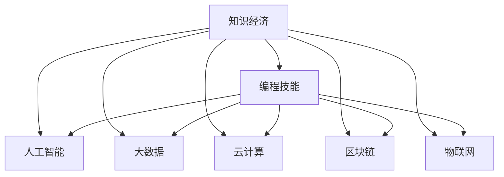

                 

# 知识经济下程序员的职业发展机遇

> 关键词：知识经济,程序员,职业发展,编程技能,人工智能,大数据,云计算,区块链,物联网,未来趋势

## 1. 背景介绍

### 1.1 知识经济的兴起

随着信息技术的飞速发展，全球正进入一个以知识为驱动力的新时代，即“知识经济”。在知识经济中，知识成为了经济增长的主要驱动力，而知识本身则越来越依赖于信息技术，特别是计算机技术。这一趋势对于程序员的职业发展来说，既带来了挑战，也带来了巨大的机遇。

### 1.2 编程技能的重要性

在知识经济时代，编程技能作为理解和操作计算机的基础，显得愈发重要。编程不仅涉及软件开发、网站开发、应用开发等传统领域，还延伸到了数据科学、机器学习、人工智能、区块链、物联网等新兴领域。掌握编程技能，不仅能够帮助程序员在传统IT领域中立足，还能开拓更多的职业发展机会，如数据分析师、算法工程师、区块链开发者、物联网系统架构师等。

## 2. 核心概念与联系

### 2.1 核心概念概述

在探讨程序员在知识经济下的职业发展机遇时，我们需要先理解以下几个核心概念：

- **知识经济**：以知识为基础的经济活动，信息技术作为知识的重要载体，使得知识传播和应用更为高效。
- **编程技能**：能够编写、测试、维护和优化计算机程序的能力，包括编程语言、算法、数据结构、设计模式等知识。
- **人工智能**：通过算法和数据训练的智能系统，可以模拟人类智能进行推理、决策、生成内容等。
- **大数据**：大规模的数据集，通常涉及数据收集、处理、存储和分析等多个环节，通过大数据技术可以从中挖掘出有价值的信息。
- **云计算**：通过互联网提供计算资源和服务，使得开发者能够基于云端资源开发、部署和维护应用程序。
- **区块链**：一种分布式账本技术，能够实现去中心化的数据存储和交易，适用于金融、供应链、物联网等领域。
- **物联网**：通过传感器、通信技术和计算技术，将物理对象连接到互联网上，实现智能化管理和控制。

这些概念之间的联系可以通过以下Mermaid流程图来展示：



这个流程图展示了知识经济下的主要技术领域，以及程序员在其中可以发挥作用的不同方向。编程技能作为基础，能够帮助程序员在这些领域中深耕细作，获得更广泛的发展机会。

## 3. 核心算法原理 & 具体操作步骤

### 3.1 算法原理概述

在知识经济下，程序员在职业发展中会遇到各种算法和技术的挑战。这些挑战包括但不限于：

- 学习新的编程语言和技术栈，如Python、JavaScript、Java、C++等。
- 掌握数据处理和分析技术，如SQL、NoSQL、Hadoop、Spark等。
- 理解机器学习、深度学习、强化学习等算法，并能够应用到实际项目中。
- 熟悉区块链技术，包括智能合约、共识算法、分布式账本等概念。
- 了解物联网技术，包括传感器、通信协议、边缘计算等知识。

这些挑战要求程序员不仅要有扎实的编程基础，还要具备跨学科的广度和深度。

### 3.2 算法步骤详解

面对知识经济下的职业挑战，程序员需要采取以下步骤来应对：

1. **持续学习**：通过在线课程、书籍、博客、研讨会等方式，不断更新自己的知识体系，保持技术的前沿性。
2. **实践锻炼**：通过参与开源项目、个人项目、企业项目等，将理论知识应用到实际问题中，提升解决实际问题的能力。
3. **跨学科融合**：不仅仅局限于IT领域，还要跨学科学习和应用，如与数据科学、医学、金融等领域的融合。
4. **软技能提升**：除了编程技能，还应提升问题解决能力、团队协作能力、项目管理能力等软技能，更好地适应团队和项目管理的需求。

### 3.3 算法优缺点

在知识经济下，程序员的职业发展具有以下优点：

- **广泛的职业路径**：编程技能在不同领域都有广泛的应用，程序员可以根据兴趣和市场需求选择不同的职业路径。
- **高薪资待遇**：掌握多种技术和语言，特别是人工智能、大数据、区块链等高需求技能，能够获得较高的薪资待遇。
- **持续的职业成长**：技术不断进步，程序员可以不断学习和提升，实现职业生涯的持续成长。

然而，也存在一些缺点：

- **高技能门槛**：知识经济下对编程技能的要求越来越高，需要程序员具备多方面的知识，增加了学习的难度和压力。
- **技术更新快**：技术更新速度加快，程序员需要不断学习和适应新技术，增加了职业发展的不确定性。
- **市场竞争激烈**：技术人才供给充足，竞争激烈，需要程序员不断提升自己的竞争力。

### 3.4 算法应用领域

在知识经济下，程序员可以在以下领域中寻找职业发展机会：

- **人工智能与机器学习**：开发智能算法、构建机器学习模型、优化模型性能等。
- **大数据与数据科学**：进行数据清洗、分析、可视化、建模等，从数据中提取有价值的信息。
- **云计算与云服务**：设计、开发和管理云应用程序，利用云资源提供服务。
- **区块链与分布式应用**：开发智能合约、设计区块链网络、解决去中心化问题等。
- **物联网与边缘计算**：开发物联网应用程序、设计传感器网络、优化边缘计算环境等。

这些领域不仅具有广阔的市场需求，也代表了技术发展的未来方向。

## 4. 数学模型和公式 & 详细讲解 & 举例说明

### 4.1 数学模型构建

知识经济下，程序员在处理各种算法问题时，常常需要使用数学模型来构建问题框架。例如，在机器学习中，常用的数学模型包括线性回归、决策树、支持向量机、神经网络等。

### 4.2 公式推导过程

以线性回归模型为例，其基本公式为：

$$ y = \theta_0 + \theta_1 x_1 + \theta_2 x_2 + \ldots + \theta_n x_n + \epsilon $$

其中，$y$为输出变量，$\theta_i$为模型参数，$x_i$为输入变量，$\epsilon$为误差项。

通过最小二乘法，可以求解出最优的参数值：

$$ \theta = (X^T X)^{-1} X^T y $$

其中，$X$为输入变量的矩阵，$y$为输出变量的向量。

### 4.3 案例分析与讲解

以图像识别为例，使用卷积神经网络（CNN）进行图像分类。CNN通过多层卷积和池化操作，提取图像的特征，并通过全连接层进行分类。在这个过程中，CNN的网络结构、激活函数、损失函数等都是数学模型的重要组成部分。

## 5. 项目实践：代码实例和详细解释说明

### 5.1 开发环境搭建

在进行项目实践时，需要先搭建好开发环境。以下是一个Python开发环境的搭建流程：

1. 安装Python：从官网下载并安装Python，选择最新版本。
2. 安装Anaconda：从官网下载并安装Anaconda，用于创建独立的Python环境。
3. 创建并激活虚拟环境：
```bash
conda create -n py38 python=3.8 
conda activate py38
```
4. 安装必要的库：
```bash
pip install numpy scipy pandas matplotlib scikit-learn
```

### 5.2 源代码详细实现

下面是一个简单的Python代码示例，用于线性回归模型的实现：

```python
import numpy as np
from sklearn.linear_model import LinearRegression

# 创建线性回归模型
model = LinearRegression()

# 输入数据
X = np.array([[1, 2], [3, 4], [5, 6]])
y = np.array([3, 7, 11])

# 训练模型
model.fit(X, y)

# 预测新数据
new_X = np.array([[7, 8]])
predicted_y = model.predict(new_X)

print("预测结果为：", predicted_y)
```

### 5.3 代码解读与分析

在这个示例中，首先创建了一个线性回归模型，并设置了输入数据X和输出数据y。然后，使用`fit`方法对模型进行训练，得到模型参数。最后，使用训练好的模型对新数据进行预测。

## 6. 实际应用场景

### 6.1 智能客服系统

在知识经济下，智能客服系统成为了企业提升客户服务质量的重要手段。程序员可以通过开发智能客服系统，利用自然语言处理、机器学习等技术，实现自动解答客户问题，提升客户满意度。

### 6.2 金融科技

金融科技是知识经济下的另一个重要领域。程序员可以参与开发智能投顾、风险评估、交易系统等应用，提升金融服务的智能化水平。

### 6.3 医疗健康

程序员可以利用大数据和机器学习技术，开发智能诊断、个性化治疗、健康管理等应用，为医疗健康领域带来新的突破。

### 6.4 未来应用展望

未来，随着技术的不断进步，程序员在知识经济下的职业发展将更加多样化。以下是对未来发展趋势的展望：

1. **自动化与智能化**：更多的程序自动化和智能化工具将出现，如AI编程助手、智能代码生成器等，提升编程效率。
2. **边缘计算**：随着物联网的发展，边缘计算将成为一个重要的研究方向，程序员需要掌握相关的技术。
3. **量子计算**：量子计算技术的成熟将带来新的算法和应用，程序员需要学习量子编程技术。
4. **可持续性**：程序员在开发项目时，需要考虑环境和社会的影响，开发可持续发展的技术。
5. **多模态交互**：未来的智能交互将不再局限于文本和语音，还包括视觉、触觉等多模态交互，程序员需要掌握相关技术。

## 7. 工具和资源推荐

### 7.1 学习资源推荐

为了帮助程序员系统掌握知识经济下的技能，以下是一些优质的学习资源：

1. Coursera：提供全球顶尖大学和机构的在线课程，涵盖计算机科学、数据科学、人工智能等多个领域。
2. edX：提供由MIT、哈佛等名校教授主讲的课程，内容丰富、质量高。
3. Udacity：提供专业技能课程，如机器学习工程师、数据科学家等。
4. GitHub：全球最大的开源社区，程序员可以学习优秀的代码和项目，提升自身技能。
5. Stack Overflow：程序员交流技术问题、分享经验、解决问题的重要平台。

### 7.2 开发工具推荐

以下是一些常用的开发工具，可以帮助程序员提升工作效率：

1. Visual Studio Code：轻量级且功能强大的代码编辑器，支持多语言、扩展丰富。
2. PyCharm：专业的Python开发工具，提供代码自动补全、调试等功能。
3. Git：版本控制系统，帮助程序员管理代码变更、协作开发。
4. Docker：容器化技术，方便打包和部署应用。
5. Kubernetes：容器编排工具，支持大规模集群管理和调度。

### 7.3 相关论文推荐

以下是几篇具有代表性的相关论文，推荐程序员阅读：

1. Deep Learning（Ian Goodfellow等著）：全面介绍了深度学习理论和实践，是深度学习领域的经典教材。
2. Reinforcement Learning：An Introduction（Richard S. Sutton、Andrew G. Barto著）：介绍了强化学习的理论基础和应用，是强化学习领域的经典教材。
3. Foundations of Computer Science（S. Goldwasser等著）：介绍了计算机科学的理论基础，帮助程序员理解算法的本质和原理。

## 8. 总结：未来发展趋势与挑战

### 8.1 研究成果总结

知识经济下，程序员面临的职业发展机遇前所未有。掌握编程技能，不仅可以在传统IT领域中立足，还能在人工智能、大数据、云计算、区块链、物联网等新兴领域中拓展职业路径。同时，也需要不断学习和适应新技术，提升软技能，以应对未来职业生涯中的挑战。

### 8.2 未来发展趋势

未来，知识经济下的程序员将面临以下趋势：

1. **跨领域融合**：知识经济下，各个领域的技术互相渗透，程序员需要具备跨领域的知识。
2. **人工智能和自动化**：人工智能和自动化技术将改变编程范式，程序员需要掌握相关技术。
3. **可持续发展和伦理**：程序员在开发项目时，需要考虑环境和社会的影响，开发可持续发展的技术。
4. **多模态交互**：未来的智能交互将不再局限于文本和语音，程序员需要掌握多模态交互技术。

### 8.3 面临的挑战

程序员在知识经济下仍面临一些挑战：

1. **技术更新快**：知识经济下，技术更新速度快，程序员需要不断学习和适应新技术。
2. **高技能门槛**：知识经济下对编程技能的要求越来越高，增加了学习的难度和压力。
3. **市场竞争激烈**：技术人才供给充足，竞争激烈，需要程序员不断提升自己的竞争力。

### 8.4 研究展望

未来的研究将重点关注以下几个方向：

1. **跨学科融合**：如何使程序员在跨学科融合中发挥作用，提升综合能力。
2. **自动化与智能化**：如何使编程工具更加自动化和智能化，提升开发效率。
3. **可持续发展和伦理**：如何使编程技术更加环保和符合伦理标准。

## 9. 附录：常见问题与解答

**Q1：程序员如何提升自己的编程技能？**

A: 程序员可以通过以下几个途径提升自己的编程技能：
- 持续学习：参加在线课程、阅读技术书籍、参加技术社区。
- 实践锻炼：参与开源项目、个人项目、企业项目，提升解决实际问题的能力。
- 跨学科融合：学习其他领域的知识，如数据科学、机器学习、区块链等，提升综合能力。

**Q2：知识经济下程序员面临哪些挑战？**

A: 知识经济下程序员面临以下挑战：
- 技术更新快：需要不断学习和适应新技术。
- 高技能门槛：知识经济对编程技能的要求越来越高。
- 市场竞争激烈：技术人才供给充足，竞争激烈。

**Q3：未来程序员需要掌握哪些新兴技术？**

A: 未来程序员需要掌握以下新兴技术：
- 人工智能和机器学习：开发智能算法、构建机器学习模型。
- 大数据和数据科学：进行数据清洗、分析、可视化、建模等。
- 云计算与云服务：设计、开发和管理云应用程序。
- 区块链与分布式应用：开发智能合约、设计区块链网络。
- 物联网与边缘计算：开发物联网应用程序、设计传感器网络。

**Q4：知识经济下程序员有哪些职业发展机会？**

A: 知识经济下程序员有以下职业发展机会：
- 人工智能与机器学习：开发智能算法、构建机器学习模型。
- 大数据与数据科学：进行数据清洗、分析、可视化、建模等。
- 云计算与云服务：设计、开发和管理云应用程序。
- 区块链与分布式应用：开发智能合约、设计区块链网络。
- 物联网与边缘计算：开发物联网应用程序、设计传感器网络。

通过本文的系统梳理，可以看到，知识经济下程序员面临的机遇与挑战并存。掌握编程技能，不断学习和适应新技术，提升软技能，将在未来职业发展中发挥重要作用。程序员需要紧跟时代潮流，不断创新和突破，才能在知识经济的大潮中占据一席之地。

