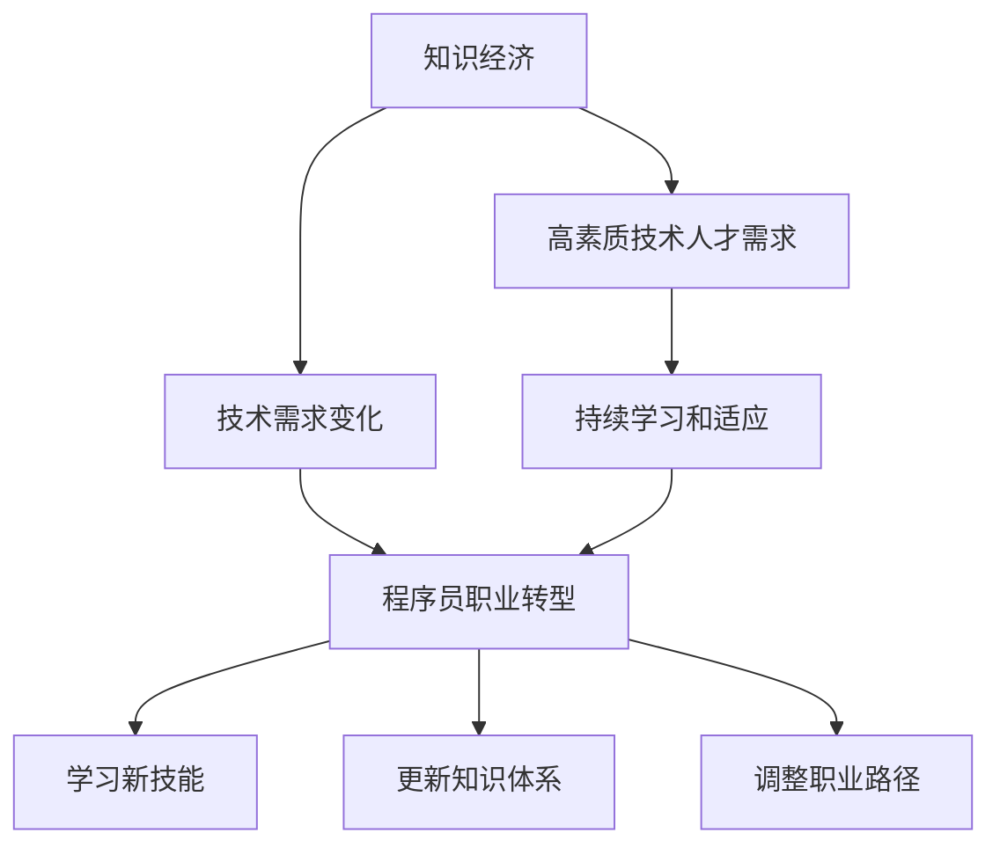

                 

# 知识经济下程序员的职业转型之道

## 1. 背景介绍

在知识经济时代，技术革新日新月异，职业需求不断演变。程序员作为技术创新的主力军，其职业路径也面临前所未有的变革。为了适应这一变化，程序员必须不断地学习和转型。本文将探讨知识经济下程序员的职业转型之道，通过核心概念阐述、算法原理讲解、项目实践指导、应用场景探索、工具资源推荐和总结展望，为程序员提供全面的职业转型策略。

## 2. 核心概念与联系

### 2.1 核心概念概述

- **知识经济**：以知识和信息为核心的经济模式，依赖于高素质的技术人才。
- **程序员**：掌握编程技能，能编写、测试和维护软件系统的专业人员。
- **职业转型**：根据行业需求变化，调整或改变职业方向，提升职业竞争力。

这些概念之间存在密切联系，共同构成程序员职业转型的基础框架。

### 2.2 核心概念原理和架构的 Mermaid 流程图



## 3. 核心算法原理 & 具体操作步骤

### 3.1 算法原理概述

在知识经济背景下，程序员的职业转型主要涉及技能更新和职业路径调整。其核心算法原理包括以下几个方面：

- **技能矩阵评估**：评估当前技能水平，识别技能缺口。
- **市场趋势分析**：分析技术市场趋势，识别高需求技能。
- **职业路径规划**：根据技能矩阵和市场趋势，规划职业转型路径。
- **学习路径设计**：制定详细的学习计划，获取新技能。
- **职业路径调整**：根据学习成果和市场反馈，调整职业路径。

### 3.2 算法步骤详解

1. **技能矩阵评估**
   - 列出当前掌握的所有技能，包括编程语言、框架、工具等。
   - 分析每个技能的熟练程度，从入门到精通划分等级。
   - 记录技能的使用频率和项目经验，评估实际应用能力。
   - 通过技能矩阵工具（如Trello、Jira等）进行可视化，便于分析和管理。

2. **市场趋势分析**
   - 收集行业报告、招聘信息、技术论坛等资料，分析技术需求。
   - 关注行业大咖和公司的动态，了解前沿技术和趋势。
   - 使用市场分析工具（如LinkedIn、Glassdoor等），查询招聘信息，识别高需求技能。

3. **职业路径规划**
   - 根据技能矩阵和市场趋势，确定需要学习的新技能。
   - 设定短期和长期目标，制定详细的职业转型计划。
   - 优先学习高需求且易上手的新技能，逐步实现职业转型。

4. **学习路径设计**
   - 选择合适的学习资源，包括在线课程、书籍、视频教程等。
   - 制定学习计划，分配每日和每周的学习任务，保证进度。
   - 参与技术社区和论坛，与同行交流学习心得，解决疑难问题。

5. **职业路径调整**
   - 根据学习成果和市场反馈，评估新技能的实际应用效果。
   - 调整职业路径，优先学习更具竞争力的技能。
   - 持续更新技能矩阵，记录新的学习成果和项目经验。

### 3.3 算法优缺点

**优点**：
- **适应性强**：根据市场变化快速调整职业方向。
- **目标明确**：通过技能矩阵和市场趋势分析，明确学习目标。
- **持续进步**：不断学习新技能，提升职业竞争力。

**缺点**：
- **学习压力大**：需要投入大量时间和精力进行技能提升。
- **市场变化快**：市场趋势难以预测，职业路径可能频繁调整。
- **职业迷茫**：初期阶段可能感到方向不明确，缺乏动力。

### 3.4 算法应用领域

该算法原理适用于各种技术岗位，包括软件开发、数据科学、人工智能、云计算等。

## 4. 数学模型和公式 & 详细讲解 & 举例说明

### 4.1 数学模型构建

设当前技能矩阵为 $M$，市场需求技能矩阵为 $D$，职业转型目标为 $T$。目标函数为：

$$
\min_{M} \|M - D\|^2
$$

其中 $\|M - D\|^2$ 表示技能差距，即当前技能与市场需求之间的距离。

### 4.2 公式推导过程

设技能矩阵 $M = (m_{i,j})$，市场需求技能矩阵 $D = (d_{i,j})$，其中 $m_{i,j}$ 表示当前掌握的第 $i$ 项技能的第 $j$ 级熟练度，$d_{i,j}$ 表示市场对第 $i$ 项技能的第 $j$ 级需求。

目标函数可分解为：

$$
\min_{M} \sum_{i,j} (m_{i,j} - d_{i,j})^2
$$

该公式表示最小化技能矩阵 $M$ 与市场需求技能矩阵 $D$ 的差异，即调整技能差距。

### 4.3 案例分析与讲解

以某程序员从Java开发转型为AI工程师为例：

- **技能矩阵评估**：列出当前掌握的编程语言（Java、Python等）、框架（Spring、Django等）、工具（Git、JIRA等）。
- **市场趋势分析**：收集AI领域的招聘信息，识别高需求技能（深度学习、自然语言处理、计算机视觉等）。
- **职业路径规划**：确定从Java开发转型到AI工程师，学习深度学习和自然语言处理相关技能。
- **学习路径设计**：通过在线课程（如Coursera、Udacity）学习深度学习，通过书籍（如《深度学习》、《Python自然语言处理》）深化理解。
- **职业路径调整**：根据学习成果和市场需求，确定下一步学习计算机视觉技术，提升在AI领域的竞争力。

## 5. 项目实践：代码实例和详细解释说明

### 5.1 开发环境搭建

1. **安装开发环境**
   - 安装Python 3.x，推荐使用Anaconda或Miniconda进行环境管理。
   - 安装常用的开发工具，如IDE（如PyCharm、Visual Studio Code等）、版本控制工具（如Git）等。

2. **安装依赖库**
   - 使用pip或conda安装必要的库，如numpy、pandas、matplotlib等。

3. **配置开发环境**
   - 根据个人习惯配置开发环境，如设置IDE插件、环境变量等。

### 5.2 源代码详细实现

以下是一个简单的技能矩阵评估工具示例：

```python
import pandas as pd

# 创建技能矩阵
matrix = {
    '编程语言': ['Java', 'Python', 'C#'],
    '框架': ['Spring', 'Django', 'Flask'],
    '工具': ['Git', 'JIRA', 'Confluence']
}
df = pd.DataFrame(matrix)

# 显示技能矩阵
print(df)
```

### 5.3 代码解读与分析

**代码解读**：
- 使用Pandas库创建技能矩阵，通过字典映射列名和行名。
- 将字典转换为DataFrame，并输出到控制台。

**代码分析**：
- 该示例展示了如何利用Pandas库进行简单的技能矩阵创建和输出，为进一步的技能差距分析奠定基础。

### 5.4 运行结果展示

运行上述代码，将输出一个简单的技能矩阵：

```
       编程语言  框架  工具
0         Java   Spring      Git
1         Python  Django  JIRA
2         C#     Flask  Confluence
```

## 6. 实际应用场景

### 6.1 技术团队转型

在大型技术团队中，可以通过技能矩阵评估和市场趋势分析，帮助团队成员进行职业转型，提升整体技术水平。例如，将数据科学团队中掌握机器学习技能的成员，转型为深度学习专家，进一步提升AI能力。

### 6.2 个人职业规划

对于个人程序员而言，通过职业转型规划，可以更系统地学习新技能，提升职业竞争力。例如，通过学习前端开发和云计算技能，转型为全栈工程师。

### 6.3 企业人才管理

企业可以通过技能矩阵和职业转型策略，优化人才结构，提升团队整体技术水平。例如，定期对员工进行技能评估，根据市场趋势调整培训计划，培养高需求技能人才。

## 7. 工具和资源推荐

### 7.1 学习资源推荐

1. **Coursera**：提供大量高质量在线课程，涵盖计算机科学、数据科学、人工智能等领域。
2. **Udacity**：提供项目导向的学习路径，帮助学员掌握实用技能。
3. **edX**：与世界顶尖大学合作，提供免费课程和认证课程。
4. **Stack Overflow**：技术问答社区，获取编程问题和解决方案。
5. **Kaggle**：数据科学和机器学习竞赛平台，提升实战能力。

### 7.2 开发工具推荐

1. **PyCharm**：功能丰富的IDE，支持Python、Java等多种语言。
2. **Visual Studio Code**：轻量级、易扩展的代码编辑器。
3. **Git**：版本控制系统，方便代码协作和版本管理。
4. **JIRA**：项目管理工具，支持敏捷开发和任务跟踪。
5. **Confluence**：文档协作平台，支持团队知识共享和文档管理。

### 7.3 相关论文推荐

1. **《程序员的职业转型：基于技能矩阵的模型》**：探讨技能矩阵在职业转型中的应用，提出基于最小二乘法的技能差距计算方法。
2. **《知识经济下技术人才的职业发展路径》**：分析技术人才在知识经济下的职业发展趋势，提出多层次的学习和转型策略。
3. **《企业人才管理的技能矩阵评估与优化》**：研究企业在人才管理中的技能矩阵应用，提出基于市场趋势的技能调整策略。

## 8. 总结：未来发展趋势与挑战

### 8.1 研究成果总结

本文系统介绍了知识经济下程序员的职业转型之道，通过技能矩阵评估、市场趋势分析、职业路径规划、学习路径设计、职业路径调整等核心概念，阐述了职业转型的算法原理。通过具体的项目实践和实际应用场景，提供了详细的代码实现和解释说明。

### 8.2 未来发展趋势

- **AI和机器学习**：随着AI和机器学习技术的发展，AI工程师将成为热门职业。
- **数据科学**：大数据和数据科学的需求持续增长，数据科学家将成为关键人才。
- **全栈开发**：全栈开发能力将成为未来的标配，掌握多种编程语言和框架变得尤为重要。
- **云计算和DevOps**：云计算和DevOps技术的发展，使得企业对相关技能的需求增加。

### 8.3 面临的挑战

- **持续学习**：技术更新快速，程序员需要不断学习新技能，保持竞争力。
- **市场变化**：技术需求变化不确定，职业路径调整需灵活应对。
- **职业迷茫**：初期阶段可能感到方向不明确，缺乏动力。
- **资源限制**：时间和精力的投入，可能影响个人生活和工作平衡。

### 8.4 研究展望

未来的研究应在以下几个方面取得突破：

1. **自动化学习路径设计**：开发自动化的学习路径推荐系统，根据个人技能和市场趋势，生成个性化的学习计划。
2. **职业转型模拟器**：开发模拟平台，帮助程序员在虚拟环境中进行职业转型实验，评估效果。
3. **技能差距自动分析**：开发自动化的技能差距分析工具，实时监测和评估技能提升情况。

## 9. 附录：常见问题与解答

**Q1：如何评估自己的技能水平？**

A：通过技能矩阵工具，列出当前掌握的所有技能，并评估每个技能的熟练程度。建议定期进行自我评估，记录学习进度和项目经验。

**Q2：如何应对技能差距？**

A：根据技能矩阵和市场需求技能矩阵，分析技能差距。优先学习高需求且易上手的新技能，逐步实现职业转型。可以使用在线课程、书籍、视频教程等多种学习资源。

**Q3：如何选择学习资源？**

A：根据学习目标和市场需求，选择高质量的学习资源。推荐使用Coursera、Udacity、edX等平台，以及Stack Overflow、Kaggle等社区。

**Q4：如何进行职业路径调整？**

A：根据学习成果和市场反馈，评估新技能的实际应用效果。调整职业路径，优先学习更具竞争力的技能。持续更新技能矩阵，记录新的学习成果和项目经验。

---

作者：禅与计算机程序设计艺术 / Zen and the Art of Computer Programming

