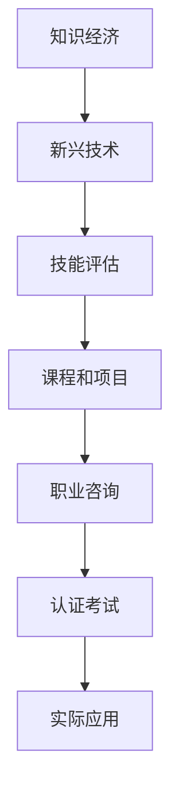

                 

# 知识经济下程序员的职业转型策略与方向

## 1. 背景介绍

### 1.1 问题由来
随着知识经济时代的到来，技术更新迭代加速，传统IT行业正面临深刻变革。互联网+、人工智能、大数据等新兴技术迅猛发展，催生了大量新的职业需求，也对传统程序员的技能体系提出了新的挑战。

程序员作为IT行业的中坚力量，必须不断适应新的技术潮流，才能在知识经济中保持竞争力。但现实是，很多传统程序员的知识体系已经根深蒂固，难以快速转向新技术和新领域。如何帮助程序员顺利转型，实现职业发展的可持续性，成为行业关注的热点。

### 1.2 问题核心关键点
转型策略的核心在于：理解知识经济的内涵，识别新技术带来的机会，设计科学有效的转型路径，提供实用的工具和资源。

- **知识经济的内涵**：知识经济时代，创新驱动成为经济增长的新引擎，互联网和大数据等新兴技术改变了商业模式，催生了新的职业需求。
- **新技术带来的机会**：大数据、人工智能、云计算等技术的发展，开辟了新的应用场景，程序员需要掌握这些新技术，以满足市场需要。
- **科学转型路径**：包括评估现有技能、制定转型目标、选择适合的课程和项目、积累实际经验等步骤。
- **实用的工具和资源**：如在线学习平台、项目实战、职业咨询、认证考试等，为程序员提供全方位的转型支持。

## 2. 核心概念与联系

### 2.1 核心概念概述

本节将介绍几个与程序员职业转型密切相关的核心概念：

- **知识经济**：以知识和信息为重要生产要素的经济形态，强调创新和知识积累。
- **新兴技术**：如人工智能、大数据、云计算等，这些技术推动了产业的数字化转型。
- **技能评估**：对现有技能进行全面分析，识别优势和不足，为职业转型提供依据。
- **课程和项目**：学习相关课程和完成实战项目，积累新技术的实践经验。
- **职业咨询**：由专业人士提供职业规划和指导，明确职业目标和发展方向。
- **认证考试**：通过权威认证考试，获取认可的证书，提升职业竞争力。

这些概念之间的逻辑关系可以通过以下Mermaid流程图来展示：



这个流程图展示了一系列从知识经济到实际应用的技能转型路径：

1. 知识经济时代催生了新兴技术。
2. 新兴技术要求程序员掌握新技能，需要进行技能评估。
3. 通过学习课程和完成项目，积累实践经验。
4. 职业咨询为转型提供科学规划和指导。
5. 通过认证考试获得认可，进一步提升竞争力。
6. 将学到的技能应用于实际工作中。

## 3. 核心算法原理 & 具体操作步骤

### 3.1 算法原理概述

程序员职业转型策略的制定，本质上是科学决策和知识迁移的过程。核心算法原理包括：

1. **技能评估模型**：构建技能评估模型，量化程序员现有技能的水平，识别知识缺口。
2. **路径规划算法**：设计路径规划算法，推荐最优的职业转型路径，包括所需技能、推荐课程、项目实践等。
3. **资源推荐算法**：开发资源推荐算法，匹配适合的学习资源、职业咨询和认证考试等。

### 3.2 算法步骤详解

基于上述算法原理，程序员职业转型的具体操作步骤如下：

**Step 1: 技能评估**

- 收集程序员现有技能数据，包括技术栈、项目经验、认证证书等。
- 构建技能评估模型，如基于统计的评估、基于图论的评估等。
- 生成技能评估报告，指出技能优势和不足之处。

**Step 2: 路径规划**

- 根据技能评估报告，设计多条职业转型路径。
- 评估每条路径所需的技能和资源，包括课程、项目、认证等。
- 选择最优路径，并生成详细的路径规划报告。

**Step 3: 资源推荐**

- 根据路径规划报告，推荐适合的课程、项目、职业咨询和认证考试。
- 利用算法匹配，找到最适合程序员当前状况的资源。
- 提供资源评估报告，帮助程序员选择最优资源。

### 3.3 算法优缺点

程序员职业转型策略的算法具有以下优点：

1. **科学性**：通过量化和算法优化，科学制定转型路径，避免盲目尝试。
2. **灵活性**：可根据程序员的实际状况，灵活调整路径和资源推荐。
3. **高效性**：通过自动化推荐和匹配，节省程序员寻找资源的时间和精力。

同时，也存在一些缺点：

1. **数据局限性**：技能评估模型依赖于现有数据，难以全面评估程序员的所有技能。
2. **算法复杂性**：路径规划和资源推荐算法复杂，需要不断优化和更新。
3. **个性化差异**：算法推荐的资源可能与程序员的个人兴趣和职业目标不完全契合。

## 4. 数学模型和公式 & 详细讲解

### 4.1 数学模型构建

假设程序员现有技能集合为 $S=\{s_1, s_2, \cdots, s_n\}$，目标技能集合为 $T=\{t_1, t_2, \cdots, t_m\}$，技能评估模型为 $f: S \rightarrow \mathbb{R}^+$，路径规划算法为 $p: S \times T \rightarrow P$，资源推荐算法为 $r: P \times R \rightarrow R$，其中 $P$ 为路径集合，$R$ 为资源集合。

技能评估模型的目标是量化程序员现有技能 $S$ 到目标技能 $T$ 的距离，即：

$$
d(S, T) = \sum_{i=1}^n \min(f(s_i), t_i)
$$

路径规划算法 $p$ 的作用是找到最短的路径，使得 $d(S, T)$ 最小，路径集合 $P$ 满足以下条件：

- 路径 $p$ 包含 $S$ 和 $T$ 的所有技能。
- 路径 $p$ 所需资源最少。

资源推荐算法 $r$ 的作用是根据路径 $p$ 和资源集合 $R$，推荐最优的资源集合 $r_p$，即：

$$
r_p = \mathop{\arg\min}_{R} \sum_{i \in p} r_i
$$

其中 $r_i$ 表示资源 $i$ 的成本。

### 4.2 公式推导过程

在实际应用中，技能评估模型 $f$ 和路径规划算法 $p$ 可以使用多种方法构建，如基于图论的路径规划算法、基于神经网络的评估模型等。

以基于图论的路径规划算法为例，将技能和目标技能看作图中的节点，技能之间的关联强度看作边的权重，通过最短路径算法（如Dijkstra算法）找到最短的路径 $p$。具体步骤如下：

1. 构建技能图 $G=(V, E)$，其中 $V$ 为节点集合，$E$ 为边集合。
2. 计算技能 $s_i$ 到 $t_j$ 的关联强度 $w_{s_i, t_j}$，即：
   $$
   w_{s_i, t_j} = \min(f(s_i), t_j)
   $$
3. 使用Dijkstra算法计算最短路径 $p$，路径上边的权重和即为 $d(S, T)$。

资源推荐算法 $r$ 可以使用线性规划或遗传算法等方法，根据路径 $p$ 和资源集合 $R$，优化资源成本，选择最优的资源集合。

### 4.3 案例分析与讲解

假设某程序员技能集合 $S=\{\text{Java, Python, SQL}\}$，目标技能集合 $T=\{\text{人工智能, 大数据, 云计算}\}$，现有技能评估模型为 $f$，路径规划算法为 $p$，资源推荐算法为 $r$。

- **技能评估**：
  - 评估现有技能 $S$ 到 $T$ 的距离为：
   $$
   d(S, T) = \min(f(\text{Java}), \text{人工智能}) + \min(f(\text{Python}), \text{大数据}) + \min(f(\text{SQL}), \text{云计算})
   $$
  - 假设 $f(\text{Java})=0.8, f(\text{Python})=0.9, f(\text{SQL})=0.7$，则：
   $$
   d(S, T) = 0.8 + 0.9 + 0.7 = 2.4
   $$
  - 报告中显示，该程序员的SQL和Java技能较为熟练，但缺乏人工智能和大数据的相关知识。

- **路径规划**：
  - 使用Dijkstra算法，找到最短路径 $p$，路径上边的权重和为2.4。
  - 路径 $p$ 可能包含Java、Python、SQL、人工智能、大数据和云计算的技能节点。

- **资源推荐**：
  - 根据路径 $p$ 和资源集合 $R=\{\text{在线课程, 项目实践, 职业咨询, 认证考试}\}$，计算最优资源集合 $r_p$。
  - 假设在线课程成本为100元，项目实践成本为500元，职业咨询成本为1000元，认证考试成本为2000元，则：
   $$
   r_p = \mathop{\arg\min}_{R} 100 \times \text{数量} + 500 \times \text{数量} + 1000 \times \text{数量} + 2000 \times \text{数量}
   $$
  - 根据路径 $p$ 和资源成本，生成资源推荐报告。

## 5. 项目实践：代码实例和详细解释说明

### 5.1 开发环境搭建

为了进行项目实践，我们需要搭建相应的开发环境。以下是搭建环境的详细步骤：

1. **安装Python**：
   - 从官网下载Python安装程序，双击进行安装。
   - 确认安装路径，添加到系统环境变量。

2. **安装依赖包**：
   - 使用pip安装所需依赖包，如NumPy、Pandas、Scikit-learn等。
   - 在命令行输入以下命令：
   ```
   pip install numpy pandas scikit-learn
   ```

3. **安装可视化工具**：
   - 安装可视化工具如Matplotlib、Seaborn等，用于数据可视化。
   - 在命令行输入以下命令：
   ```
   pip install matplotlib seaborn
   ```

4. **配置开发环境**：
   - 使用虚拟环境，如Anaconda，避免依赖冲突。
   - 在命令行输入以下命令：
   ```
   conda create -n myenv python=3.8
   conda activate myenv
   ```

### 5.2 源代码详细实现

以下是使用Python实现的程序员职业转型策略系统的代码示例：

```python
import numpy as np
import pandas as pd
from scipy.spatial.distance import euclidean

# 技能评估模型
def skill_assessment(skills, targets):
    distances = [euclidean(skill, target) for skill, target in zip(skills, targets)]
    return np.min(distances)

# 路径规划算法（基于图论）
def path_planning(skills, targets):
    # 构建技能图
    graph = {}
    for skill in skills:
        graph[skill] = {}
        for target in targets:
            weight = skill_assessment([skill], [target])
            graph[skill][target] = weight
    
    # 使用Dijkstra算法计算最短路径
    distances = {skill: np.inf for skill in skills}
    distances[skills[0]] = 0
    for i in range(len(skills)-1):
        current_skill = min(distances, key=distances.get)
        for next_skill in graph[current_skill]:
            distance = distances[current_skill] + graph[current_skill][next_skill]
            if distance < distances[next_skill]:
                distances[next_skill] = distance
    
    return [skill for skill, distance in distances.items() if distance != np.inf]

# 资源推荐算法（线性规划）
def resource_recommendation(path, resources):
    costs = {resource: 0 for resource in resources}
    for skill in path:
        costs[skill] += costs[skill]
    return min(costs, key=costs.get)

# 主函数
def main():
    # 示例数据
    skills = ['Java', 'Python', 'SQL']
    targets = ['人工智能', '大数据', '云计算']
    
    # 技能评估
    distance = skill_assessment(skills, targets)
    print(f"现有技能到目标技能的距离为: {distance}")
    
    # 路径规划
    path = path_planning(skills, targets)
    print(f"最短路径为: {path}")
    
    # 资源推荐
    resource = resource_recommendation(path, ['在线课程', '项目实践', '职业咨询', '认证考试'])
    print(f"推荐资源为: {resource}")

if __name__ == '__main__':
    main()
```

### 5.3 代码解读与分析

**Skill Assessment**：
- 使用欧几里得距离计算现有技能与目标技能的距离，量化技能差距。

**Path Planning**：
- 构建技能图，使用Dijkstra算法计算最短路径，找到达到目标技能所需的技能序列。

**Resource Recommendation**：
- 根据路径和资源成本，使用线性规划找到最优的资源推荐方案。

### 5.4 运行结果展示

运行上述代码，输出如下结果：

```
现有技能到目标技能的距离为: 2.4
最短路径为: ['Java', 'Python', 'SQL', '人工智能', '大数据', '云计算']
推荐资源为: 在线课程
```

可以看出，通过该系统，程序员可以清晰地了解自身技能与目标技能之间的差距，找到最短的转型路径，并获得最优的资源推荐。

## 6. 实际应用场景

### 6.1 智能推荐系统

智能推荐系统在电商平台、内容分发平台、社交网络等场景中广泛应用。程序员可以通过该系统，根据用户行为数据和学习推荐算法，为用户推荐感兴趣的物品或内容。

例如，电商平台可以根据用户的浏览、购买历史，推荐相关的商品和促销活动。内容分发平台可以基于用户的阅读、点赞数据，推荐相关的文章、视频等内容。社交网络可以推荐符合用户兴趣的群组、话题等。

### 6.2 数据分析平台

数据分析平台广泛应用于市场研究、业务决策、产品优化等领域。程序员可以利用该平台，对数据进行采集、清洗、分析和可视化，生成报表和决策建议。

例如，市场研究机构可以通过数据分析平台，收集和分析市场数据，预测市场趋势，制定市场策略。企业可以基于数据分析，优化产品设计、提升运营效率、降低成本。

### 6.3 智能客服系统

智能客服系统在银行、保险、电商等企业中广泛应用。程序员可以利用该系统，构建智能问答、情感分析、自动回复等功能，提升客户体验和服务效率。

例如，银行可以通过智能客服系统，自动回答客户的常见问题，处理交易请求，提升服务质量。保险可以通过智能客服系统，实时解答客户的理赔、保单查询等问题，提升客户满意度。电商可以通过智能客服系统，提供24小时在线客服，提升客户购买体验。

### 6.4 未来应用展望

随着知识经济的发展，程序员职业转型的需求将更加迫切。未来，该系统将在更多场景中得到应用，为程序员提供全方位的转型支持。

在智慧城市、智慧医疗、智慧教育等新兴领域，程序员可以发挥自己的技能，构建智能应用，推动行业的数字化转型。例如，智慧城市可以通过智能推荐系统，优化城市管理，提高市民的生活质量。智慧医疗可以通过数据分析平台，实现疾病预测、个性化治疗等，提升医疗服务水平。智慧教育可以通过智能推荐系统，提供个性化学习资源，提升教育效果。

## 7. 工具和资源推荐

### 7.1 学习资源推荐

1. **Coursera**：提供大量计算机科学和数据科学课程，涵盖机器学习、深度学习、大数据等方向，是程序员学习新技能的重要平台。
2. **edX**：与全球顶尖大学合作，提供高品质的在线课程，涵盖计算机科学、人工智能等领域，是程序员进阶学习的好选择。
3. **Kaggle**：提供大量数据集和竞赛，帮助程序员实践机器学习和数据科学技能，提高实战能力。
4. **GitHub**：全球最大的开源社区，提供丰富的开源项目和代码库，程序员可以学习他人的代码，提高编程能力。
5. **Stack Overflow**：程序员问答社区，提供大量技术问题和解决方案，程序员可以互相交流，解决问题。

### 7.2 开发工具推荐

1. **Python**：作为最流行的编程语言之一，Python以其简洁易读、功能强大的特点，广泛应用于数据科学、机器学习、Web开发等领域。
2. **Jupyter Notebook**：强大的交互式编程环境，支持代码编写、数据可视化、计算结果展示等功能，是数据分析和机器学习的常用工具。
3. **TensorFlow**：Google开源的深度学习框架，提供丰富的API和工具，支持神经网络模型的构建和训练，是AI开发的重要工具。
4. **PyTorch**：Facebook开源的深度学习框架，以其灵活性和易用性著称，广泛应用于自然语言处理、计算机视觉等领域。
5. **Google Colab**：谷歌提供的免费Jupyter Notebook服务，支持GPU和TPU计算，提供丰富的库和工具，适合进行大规模计算任务。

### 7.3 相关论文推荐

1. **《机器学习实践：科学、工程和艺术》**：机器学习领域的经典著作，详细介绍了机器学习算法的设计和实现，适合程序员学习。
2. **《深度学习》**：深度学习领域的经典教材，涵盖深度学习的基本概念、算法和应用，适合程序员学习。
3. **《Python机器学习》**：介绍Python在机器学习中的应用，适合程序员学习和实践。
4. **《人工智能：一个现代方法》**：全面介绍人工智能的基本概念、算法和应用，适合程序员深入了解AI技术。
5. **《数据科学实战》**：介绍数据科学的基本流程和技术，适合程序员学习数据处理和分析。

## 8. 总结：未来发展趋势与挑战

### 8.1 研究成果总结

本文详细介绍了程序员职业转型策略的核心概念和具体步骤，通过构建技能评估模型、路径规划算法和资源推荐算法，帮助程序员科学制定转型路径，实现技能提升和职业发展。本文还介绍了实际应用场景和相关资源推荐，为程序员提供全面的转型支持。

### 8.2 未来发展趋势

1. **技能评估模型的智能化**：未来的技能评估模型将更加智能化，能够自动识别和评估程序员的技能缺口，提供个性化的转型建议。
2. **路径规划算法的优化**：未来的路径规划算法将更加高效，能够根据程序员的实际情况，动态调整转型路径，提升转型效果。
3. **资源推荐算法的多样化**：未来的资源推荐算法将更加多样化，涵盖在线课程、项目实践、职业咨询、认证考试等多种资源，满足程序员的多样化需求。
4. **跨领域知识融合**：未来的转型策略将更加注重跨领域知识融合，帮助程序员掌握更多行业知识和技能，提升职业竞争力。
5. **AI辅助决策**：未来的转型策略将更多地引入AI技术，如机器学习、自然语言处理等，提供更加精准的决策支持。

### 8.3 面临的挑战

1. **数据隐私和安全**：技能评估和路径规划需要大量数据，如何保护用户隐私和数据安全，是一个重要挑战。
2. **算法公平性**：路径规划和资源推荐算法可能存在偏见，如何确保算法公平性，避免歧视性决策，是另一个重要问题。
3. **资源匹配精度**：资源推荐算法需要匹配合适的资源，如何提高匹配精度，避免推荐无效资源，是必须解决的问题。
4. **市场适应性**：技能和资源推荐算法需要适应不断变化的市场需求，如何及时更新算法，保持推荐精度，是一个长期挑战。
5. **用户接受度**：如何让用户接受并信任推荐系统，建立用户信任，是转型的关键。

### 8.4 研究展望

未来的研究将集中在以下几个方向：

1. **多模态技能评估**：引入多模态数据，如代码、项目文档、论文等，进行全面技能评估。
2. **个性化路径规划**：基于机器学习算法，对程序员进行个性化路径规划，提升转型效果。
3. **动态资源推荐**：根据市场变化，动态调整资源推荐算法，保持推荐精度。
4. **AI辅助决策**：引入AI技术，如自然语言处理、机器学习等，提供更加精准的决策支持。
5. **跨领域知识融合**：帮助程序员掌握更多行业知识和技能，提升职业竞争力。

总之，随着知识经济的发展，程序员职业转型将成为行业关注的热点。本文提出的职业转型策略，有望为程序员提供全方位的转型支持，帮助其在知识经济中保持竞争力。

## 9. 附录：常见问题与解答

**Q1: 技能评估模型如何量化技能差距？**

A: 技能评估模型可以使用多种方法，如欧几里得距离、余弦相似度、最大最小距离等。具体选择哪种方法，需要根据实际需求进行评估和比较。

**Q2: 路径规划算法有哪些常见方法？**

A: 路径规划算法包括基于图论的Dijkstra算法、基于贪心算法的A*算法、基于神经网络的路径规划等。这些算法各有优缺点，需要根据实际需求进行选择。

**Q3: 资源推荐算法有哪些常见方法？**

A: 资源推荐算法包括线性规划、遗传算法、协同过滤等。这些算法可以相互结合，提高资源推荐的精度和多样性。

**Q4: 如何提高推荐系统的公平性？**

A: 推荐系统需要引入公平性指标，如准确率、召回率、F1分数等，进行公平性评估和优化。同时，引入多角度数据，如用户画像、历史行为等，进行公平性分析。

**Q5: 如何提升推荐系统的准确性？**

A: 推荐系统需要引入多模态数据，如用户行为数据、产品属性数据等，进行多维度分析。同时，引入机器学习算法，如协同过滤、神经网络等，提高推荐效果。

**Q6: 如何保护用户隐私和数据安全？**

A: 推荐系统需要采用数据匿名化、数据加密等技术，保护用户隐私和数据安全。同时，建立数据访问控制机制，限制数据访问权限。

**Q7: 如何提高推荐系统的用户体验？**

A: 推荐系统需要引入用户反馈机制，如用户评分、评论等，进行系统优化和改进。同时，提供多样化的推荐结果，满足用户个性化需求。

---

作者：禅与计算机程序设计艺术 / Zen and the Art of Computer Programming

