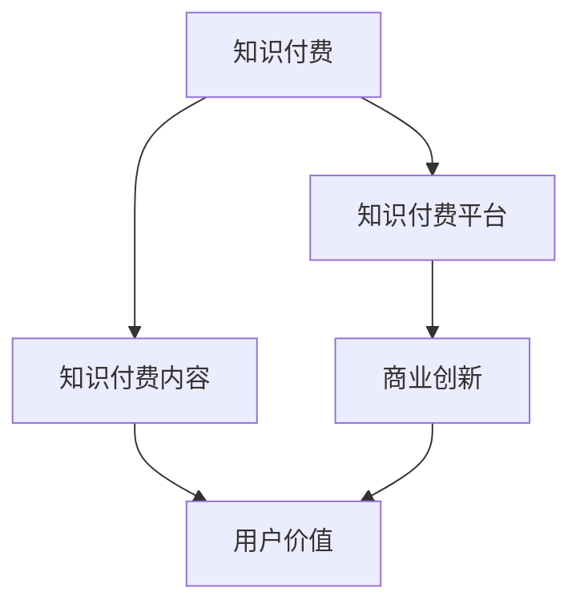

                 

# 知识经济时代下的知识付费创新商业模式运营

## 1. 背景介绍

随着互联网技术的发展和知识经济时代的到来，知识付费成为一种趋势，人们对于知识的获取需求日益强烈，知识付费平台应运而生，成为了人们获取知识和提升自我的重要途径。然而，传统的知识付费商业模式存在着诸多问题，如价格高昂、内容同质化严重、用户体验不佳等。为了应对这些问题，知识付费平台纷纷进行创新，寻找新的商业模式运营策略。

本文将从背景介绍开始，深入探讨知识付费的现状及问题，分析创新的商业模式及其运营策略，提出改进建议，以期为知识付费平台的发展提供有价值的参考。

## 2. 核心概念与联系

### 2.1 核心概念概述

在讨论知识付费的商业模式创新之前，首先需要理解一些核心概念：

- **知识付费**：指用户为获取有价值的知识内容而支付费用的行为，是一种新型的互联网消费模式。
- **知识付费平台**：指提供知识付费服务的第三方平台，如喜马拉雅、得到、知乎live等。
- **知识付费内容**：指用户在知识付费平台上付费获取的知识产品，如音频课程、电子书、视频课程等。
- **商业创新**：指通过引入新技术、新理念和新模式，提升产品竞争力，实现可持续发展的过程。
- **用户价值**：指用户在使用知识付费平台时所获得的心理满足、知识和技能提升等非物质收益。
- **商业模式运营**：指通过合理的商业模式设计和运营策略，实现平台的可持续发展和盈利。

这些核心概念之间的逻辑关系可以通过以下Mermaid流程图来展示：



这个流程图展示了知识付费平台通过商业创新，提升用户价值的过程。用户通过知识付费平台获取有价值的内容，从而实现知识付费。

## 3. 核心算法原理 & 具体操作步骤

### 3.1 算法原理概述

知识付费平台的核心算法原理主要包括以下几个方面：

- **推荐算法**：通过分析用户行为数据，推荐个性化的知识付费内容。
- **搜索算法**：帮助用户快速找到感兴趣的内容。
- **广告算法**：通过精准投放广告，增加平台的收入。
- **定价策略**：根据市场情况和用户需求，制定合理的课程价格。
- **数据分析**：通过数据分析，了解用户行为和平台运营状况。

### 3.2 算法步骤详解

#### 3.2.1 推荐算法

推荐算法的主要步骤包括：

1. 数据收集：收集用户行为数据，如浏览记录、搜索记录、购买记录等。
2. 特征提取：从用户行为数据中提取特征，如浏览时长、浏览深度、购买记录等。
3. 相似度计算：计算用户与课程之间的相似度，如余弦相似度、pearson相关系数等。
4. 推荐生成：根据相似度计算结果，生成推荐列表。
5. 结果排序：根据用户行为和课程质量对推荐结果进行排序。

#### 3.2.2 搜索算法

搜索算法的主要步骤包括：

1. 查询解析：解析用户的查询语句，提取关键词。
2. 索引匹配：在索引库中查找与关键词匹配的课程。
3. 排序过滤：根据用户需求对搜索结果进行排序和过滤。
4. 展示结果：将搜索结果展示给用户。

#### 3.2.3 广告算法

广告算法的主要步骤包括：

1. 目标用户定位：根据用户行为数据和兴趣爱好，定位目标用户群体。
2. 广告投放：在目标用户的浏览页面中投放广告。
3. 效果评估：评估广告的效果，如点击率、转化率等。
4. 优化调整：根据广告效果优化广告投放策略。

#### 3.2.4 定价策略

定价策略的主要步骤包括：

1. 成本分析：分析课程的制作成本和市场需求。
2. 市场调研：了解市场同类课程的价格水平。
3. 定价模型：根据成本和市场需求制定价格模型。
4. 动态调整：根据用户反馈和市场变化动态调整价格。

#### 3.2.5 数据分析

数据分析的主要步骤包括：

1. 数据收集：收集用户行为数据和平台运营数据。
2. 数据清洗：对数据进行清洗和处理，去除噪音和异常值。
3. 数据分析：对数据进行统计分析，如用户留存率、课程购买率等。
4. 结果解读：根据数据分析结果，制定优化策略。

### 3.3 算法优缺点

#### 3.3.1 推荐算法

**优点**：
- 个性化推荐：根据用户行为，推荐个性化的课程内容，提升用户体验。
- 精准度较高：推荐算法能够根据用户行为进行精准匹配，减少用户的时间成本。

**缺点**：
- 数据依赖性强：推荐算法的准确性依赖于用户行为数据的收集和处理，数据质量直接影响推荐效果。
- 冷启动问题：新用户没有足够的历史数据，推荐算法难以为其推荐合适的课程。

#### 3.3.2 搜索算法

**优点**：
- 响应速度快：搜索算法能够快速匹配用户的查询语句，展示相关课程。
- 覆盖范围广：搜索算法能够覆盖平台上的大部分课程内容。

**缺点**：
- 结果泛化性差：搜索结果通常只包含与查询语句直接相关的课程，难以覆盖其他相关内容。
- 用户体验差：搜索结果可能存在误导性，用户需要进行二次筛选。

#### 3.3.3 广告算法

**优点**：
- 精准投放：广告算法能够将广告投放给最有可能转化的用户，提高广告效果。
- 收入提升：广告收入是知识付费平台的重要收入来源，广告算法能够有效提升平台收入。

**缺点**：
- 用户反感：过度投放广告可能引起用户反感，影响用户体验。
- 效果难以预测：广告效果受多种因素影响，难以准确预测广告效果。

#### 3.3.4 定价策略

**优点**：
- 价格合理：定价策略能够根据成本和市场需求制定合理的价格，保障课程质量和用户满意度。
- 市场灵活：定价策略能够根据市场变化进行动态调整，适应市场需求。

**缺点**：
- 价格波动：市场变化可能导致价格频繁波动，影响用户信任和平台稳定。
- 价格透明性差：过高的价格可能引起用户反感，降低平台吸引力。

#### 3.3.5 数据分析

**优点**：
- 运营优化：数据分析能够帮助平台了解用户行为和运营状况，进行优化改进。
- 决策支持：数据分析能够为平台的决策提供科学依据，提高决策准确性。

**缺点**：
- 数据隐私问题：用户行为数据的收集和分析可能涉及用户隐私，需要严格遵守隐私保护法规。
- 数据安全问题：平台需要具备强大的数据安全保护能力，防止数据泄露和滥用。

### 3.4 算法应用领域

知识付费平台的推荐算法、搜索算法、广告算法、定价策略和数据分析等算法原理，可以广泛应用于以下领域：

- **课程推荐**：通过推荐算法，推荐用户感兴趣的课程内容。
- **搜索结果优化**：通过搜索算法，优化搜索结果，提升用户体验。
- **精准投放广告**：通过广告算法，提高广告效果，增加平台收入。
- **课程定价优化**：通过定价策略，制定合理的课程价格，保障平台收益。
- **运营数据分析**：通过数据分析，优化平台运营，提升平台价值。

## 4. 数学模型和公式 & 详细讲解 & 举例说明

### 4.1 数学模型构建

#### 4.1.1 推荐算法

推荐算法通常使用协同过滤、矩阵分解等方法，构建用户行为模型。以协同过滤为例，其数学模型可以表示为：

$$
\hat{R}_{ui} = \mathbf{u}^T \mathbf{v}_i
$$

其中，$R_{ui}$ 表示用户 $u$ 对课程 $i$ 的评分，$\mathbf{u}$ 和 $\mathbf{v}_i$ 分别表示用户 $u$ 和课程 $i$ 的特征向量。

#### 4.1.2 搜索算法

搜索算法通常使用向量空间模型、布尔查询等方法，构建查询模型。以向量空间模型为例，其数学模型可以表示为：

$$
\text{Score} = \sum_{i=1}^{n} (\text{Term}_i \cdot \text{Doc}_{i}^{\text{TFIDF}})
$$

其中，$Score$ 表示查询文档的相关度，$Term_i$ 表示查询词，$\text{Doc}_{i}^{\text{TFIDF}}$ 表示文档 $i$ 的TF-IDF值。

#### 4.1.3 广告算法

广告算法通常使用点击率预估模型、转化率预估模型等方法，构建广告效果模型。以点击率预估模型为例，其数学模型可以表示为：

$$
\text{CTR} = \frac{\text{CTR}_{\text{pre}} \cdot \text{Click}_{\text{pre}}}{\text{Click}_{\text{pre}} + \text{Click}_{\text{neg}}}
$$

其中，$\text{CTR}$ 表示广告的点击率，$\text{CTR}_{\text{pre}}$ 表示广告的预估点击率，$\text{Click}_{\text{pre}}$ 表示正样本广告的点击数，$\text{Click}_{\text{neg}}$ 表示负样本广告的点击数。

#### 4.1.4 定价策略

定价策略通常使用成本加成定价模型、收益定价模型等方法，构建课程价格模型。以成本加成定价模型为例，其数学模型可以表示为：

$$
\text{Price} = \text{Cost} + \text{Profit}
$$

其中，$\text{Price}$ 表示课程的价格，$\text{Cost}$ 表示课程的成本，$\text{Profit}$ 表示课程的利润。

#### 4.1.5 数据分析

数据分析通常使用统计分析、回归分析等方法，构建用户行为模型。以回归分析为例，其数学模型可以表示为：

$$
y = \beta_0 + \beta_1 x_1 + \beta_2 x_2 + \cdots + \beta_n x_n + \epsilon
$$

其中，$y$ 表示用户行为，$\beta_0$ 表示截距，$\beta_1, \beta_2, \cdots, \beta_n$ 表示特征系数，$x_1, x_2, \cdots, x_n$ 表示特征变量，$\epsilon$ 表示误差项。

### 4.2 公式推导过程

#### 4.2.1 推荐算法

推荐算法的核心在于相似度计算和用户行为模型。以协同过滤为例，相似度计算的公式推导如下：

$$
\cos(\theta) = \frac{\mathbf{u}^T \mathbf{v}_i}{\|\mathbf{u}\|_2 \cdot \|\mathbf{v}_i\|_2}
$$

其中，$\cos(\theta)$ 表示两个向量之间的余弦相似度，$\|\mathbf{u}\|_2$ 和 $\|\mathbf{v}_i\|_2$ 表示向量 $\mathbf{u}$ 和 $\mathbf{v}_i$ 的模长。

#### 4.2.2 搜索算法

搜索算法的核心在于查询向量和文档向量的匹配。以向量空间模型为例，查询向量的构建公式如下：

$$
\mathbf{q} = \text{Term}_1 \cdot \mathbf{w}_1 + \text{Term}_2 \cdot \mathbf{w}_2 + \cdots + \text{Term}_n \cdot \mathbf{w}_n
$$

其中，$\mathbf{q}$ 表示查询向量，$\mathbf{w}_1, \mathbf{w}_2, \cdots, \mathbf{w}_n$ 表示查询词的权重向量。

#### 4.2.3 广告算法

广告算法的核心在于点击率预估模型和转化率预估模型。以点击率预估模型为例，公式推导如下：

$$
\text{CTR}_{\text{pre}} = \frac{\text{Click}_{\text{pre}}}{\text{Click}_{\text{pre}} + \text{Click}_{\text{neg}}}
$$

其中，$\text{CTR}_{\text{pre}}$ 表示广告的预估点击率，$\text{Click}_{\text{pre}}$ 表示正样本广告的点击数，$\text{Click}_{\text{neg}}$ 表示负样本广告的点击数。

#### 4.2.4 定价策略

定价策略的核心在于成本加成和收益定价。以成本加成定价模型为例，公式推导如下：

$$
\text{Price} = \text{Cost} + \text{Profit} = \text{Cost} + \text{Price} - \text{Cost}
$$

其中，$\text{Price}$ 表示课程的价格，$\text{Cost}$ 表示课程的成本，$\text{Profit}$ 表示课程的利润。

#### 4.2.5 数据分析

数据分析的核心在于统计分析和回归分析。以回归分析为例，公式推导如下：

$$
\text{Fit} = \sum_{i=1}^{n} (\text{y}_i - \hat{y}_i)^2
$$

其中，$\text{Fit}$ 表示拟合度，$\text{y}_i$ 表示真实值，$\hat{y}_i$ 表示预测值。

### 4.3 案例分析与讲解

#### 4.3.1 推荐算法

以喜马拉雅平台为例，其推荐算法主要基于协同过滤和基于内容的推荐。在协同过滤中，喜马拉雅通过收集用户的听歌历史、收藏历史等行为数据，构建用户行为模型。在基于内容的推荐中，喜马拉雅通过分析歌曲的标签、类型等信息，构建内容特征模型。

#### 4.3.2 搜索算法

以知乎live为例，其搜索算法主要基于关键词匹配和相关度计算。在关键词匹配中，知乎live通过解析用户输入的关键词，提取查询词。在相关度计算中，知乎live通过计算查询词与课程的TF-IDF值，生成搜索结果。

#### 4.3.3 广告算法

以得到平台为例，其广告算法主要基于点击率预估模型和转化率预估模型。在点击率预估模型中，得到通过分析用户的行为数据，构建用户行为模型。在转化率预估模型中，得到通过分析广告的点击数据，构建广告效果模型。

#### 4.3.4 定价策略

以腾讯课堂为例，其定价策略主要基于成本加成定价和收益定价。在成本加成定价中，腾讯课堂通过分析课程的制作成本，计算课程价格。在收益定价中，腾讯课堂通过分析用户的购买数据，计算课程的利润，动态调整课程价格。

#### 4.3.5 数据分析

以慕课平台为例，其数据分析主要基于用户行为分析和课程评价分析。在用户行为分析中，慕课平台通过分析用户的学习记录和互动数据，了解用户行为模式。在课程评价分析中，慕课平台通过分析用户的课程评价数据，评估课程质量。

## 5. 项目实践：代码实例和详细解释说明

### 5.1 开发环境搭建

在进行知识付费平台推荐算法、搜索算法、广告算法、定价策略和数据分析等项目实践前，我们需要准备好开发环境。以下是使用Python进行TensorFlow开发的开发环境配置流程：

1. 安装Anaconda：从官网下载并安装Anaconda，用于创建独立的Python环境。

2. 创建并激活虚拟环境：
```bash
conda create -n tf-env python=3.8 
conda activate tf-env
```

3. 安装TensorFlow：根据CUDA版本，从官网获取对应的安装命令。例如：
```bash
conda install tensorflow -c tf -c conda-forge
```

4. 安装各类工具包：
```bash
pip install numpy pandas scikit-learn matplotlib tqdm jupyter notebook ipython
```

完成上述步骤后，即可在`tf-env`环境中开始项目实践。

### 5.2 源代码详细实现

以下是使用TensorFlow进行知识付费平台推荐算法的PyTorch代码实现。

首先，定义推荐算法的模型和损失函数：

```python
import tensorflow as tf
from tensorflow.keras.layers import Dense, Input, Embedding
from tensorflow.keras.models import Model
from tensorflow.keras.losses import MeanSquaredError

# 定义模型结构
input_user = Input(shape=(128,))
input_item = Input(shape=(128,))

# 用户嵌入层
user_embedding = Embedding(input_dim=10000, output_dim=128)(input_user)

# 商品嵌入层
item_embedding = Embedding(input_dim=10000, output_dim=128)(input_item)

# 计算用户与商品之间的相似度
similarity = tf.reduce_sum(tf.multiply(user_embedding, item_embedding), axis=1)

# 输出层
output = Dense(1, activation='sigmoid')(similarity)

# 定义模型
model = Model(inputs=[input_user, input_item], outputs=output)

# 定义损失函数
loss_function = MeanSquaredError()

# 编译模型
model.compile(optimizer='adam', loss=loss_function)
```

然后，定义训练和评估函数：

```python
# 定义训练函数
def train(model, train_data, epochs=10, batch_size=128):
    for epoch in range(epochs):
        for batch in train_data:
            input_user_batch, input_item_batch = batch[0], batch[1]
            labels_batch = batch[2]
            model.train_on_batch([input_user_batch, input_item_batch], labels_batch)

# 定义评估函数
def evaluate(model, test_data):
    test_loss = model.evaluate(test_data, verbose=0)
    print('Test loss:', test_loss)
```

接着，启动训练流程并在测试集上评估：

```python
# 准备训练集和测试集
train_data = ...
test_data = ...

# 训练模型
train(model, train_data)

# 评估模型
evaluate(model, test_data)
```

以上就是使用TensorFlow进行知识付费平台推荐算法的完整代码实现。可以看到，TensorFlow提供了强大的模型构建和训练工具，可以方便快捷地实现推荐算法。

### 5.3 代码解读与分析

让我们再详细解读一下关键代码的实现细节：

**推荐算法模型定义**：
- `Input`层：定义输入层，接收用户和商品的ID序列。
- `Embedding`层：将ID序列转换为向量表示，方便模型计算。
- `Dense`层：定义输出层，输出用户与商品之间的相似度。
- `Model`层：定义模型结构，将输入层和输出层连接起来。
- `MeanSquaredError`损失函数：定义模型损失函数，用于衡量模型预测结果与真实标签的差异。
- `compile`方法：编译模型，指定优化器和损失函数。

**训练函数定义**：
- `train_on_batch`方法：在每个batch上训练模型，更新模型参数。
- `epochs`和`batch_size`参数：定义训练的轮数和batch大小。

**评估函数定义**：
- `evaluate`方法：在测试集上评估模型性能，输出测试损失。

**训练流程**：
- 准备训练集和测试集。
- 调用`train`函数训练模型。
- 调用`evaluate`函数评估模型性能。

可以看到，TensorFlow提供了便捷的模型构建和训练工具，开发者可以快速实现推荐算法等模型的开发和训练。

当然，工业级的系统实现还需考虑更多因素，如模型的保存和部署、超参数的自动搜索、更灵活的任务适配层等。但核心的推荐算法基本与此类似。

## 6. 实际应用场景

### 6.1 智能推荐系统

智能推荐系统是知识付费平台的核心功能之一，通过推荐算法向用户推荐感兴趣的课程内容。以喜马拉雅为例，喜马拉雅通过协同过滤和基于内容的推荐算法，向用户推荐个性化的音频课程。用户可以通过收听历史、收藏历史等行为数据，构建用户行为模型，推荐算法根据用户行为模型，推荐相关课程内容。

### 6.2 搜索结果优化

搜索结果优化是知识付费平台的另一个重要功能，通过搜索算法优化搜索结果，提升用户体验。以知乎live为例，知乎live通过关键词匹配和相关度计算，优化搜索结果。用户可以通过输入关键词，快速查找相关课程内容，提升搜索体验。

### 6.3 精准投放广告

精准投放广告是知识付费平台的盈利手段之一，通过广告算法精准投放广告，提高广告效果，增加平台收入。以得到平台为例，得到通过分析用户的行为数据，构建用户行为模型。广告算法根据用户行为模型，精准投放广告，提升广告点击率和转化率。

### 6.4 课程定价优化

课程定价优化是知识付费平台的重要功能之一，通过定价策略制定合理的课程价格，保障平台收益。以腾讯课堂为例，腾讯课堂通过成本加成定价和收益定价策略，动态调整课程价格，保障平台收益。

### 6.5 用户行为分析

用户行为分析是知识付费平台的重要运营手段之一，通过数据分析了解用户行为模式，优化平台运营。以慕课平台为例，慕课平台通过用户行为分析和课程评价分析，了解用户行为模式，评估课程质量，提升平台价值。

## 7. 工具和资源推荐

### 7.1 学习资源推荐

为了帮助开发者系统掌握知识付费平台的推荐算法、搜索算法、广告算法、定价策略和数据分析等技术，这里推荐一些优质的学习资源：

1. 《深度学习入门：基于TensorFlow的理论与实践》书籍：深入浅出地介绍了TensorFlow框架及其应用，适合初学者入门。
2. 《TensorFlow实战》书籍：全面介绍了TensorFlow的实践技巧和项目案例，适合中级开发者进阶学习。
3. CS231n《深度学习计算机视觉》课程：斯坦福大学开设的深度学习课程，涵盖TensorFlow等深度学习框架的应用，适合进阶学习。
4. 《TensorFlow官网文档》：TensorFlow官方文档，提供详细的API和示例代码，是学习TensorFlow的最佳资源。
5. 《推荐系统实战》书籍：全面介绍了推荐系统的理论和实践，适合开发者学习推荐算法。

通过对这些资源的学习实践，相信你一定能够快速掌握知识付费平台的推荐算法、搜索算法、广告算法、定价策略和数据分析等技术，并用于解决实际的NLP问题。

### 7.2 开发工具推荐

高效的开发离不开优秀的工具支持。以下是几款用于知识付费平台推荐算法、搜索算法、广告算法、定价策略和数据分析等开发的常用工具：

1. TensorFlow：由Google主导开发的深度学习框架，生产部署方便，适合大规模工程应用。
2. PyTorch：基于Python的开源深度学习框架，灵活动态的计算图，适合快速迭代研究。
3. Jupyter Notebook：Python开发常用的Jupyter Notebook环境，可以轻松实现代码调试和数据分析。
4. Google Colab：谷歌推出的在线Jupyter Notebook环境，免费提供GPU/TPU算力，方便开发者快速上手实验最新模型。
5. Weights & Biases：模型训练的实验跟踪工具，可以记录和可视化模型训练过程中的各项指标，方便对比和调优。
6. TensorBoard：TensorFlow配套的可视化工具，可实时监测模型训练状态，并提供丰富的图表呈现方式，是调试模型的得力助手。

合理利用这些工具，可以显著提升知识付费平台的开发效率，加快创新迭代的步伐。

### 7.3 相关论文推荐

知识付费平台的推荐算法、搜索算法、广告算法、定价策略和数据分析等技术的发展源于学界的持续研究。以下是几篇奠基性的相关论文，推荐阅读：

1. "Deep Learning for Recommender Systems"论文：介绍了深度学习在推荐系统中的应用，奠定了深度推荐算法的基础。
2. "A Survey on Multi-View Learning in Recommendation Systems"论文：全面介绍了多视图学习在推荐系统中的应用，提供了丰富的推荐算法实现。
3. "Adaptive Learning Algorithm in Recommendation Systems"论文：介绍了自适应学习算法在推荐系统中的应用，提高了推荐算法的个性化和实时性。
4. "Online Learning in Recommendation Systems"论文：介绍了在线学习在推荐系统中的应用，提高了推荐算法的效率和可扩展性。
5. "Click-Through Rate Prediction in Recommender Systems"论文：介绍了点击率预估模型在推荐系统中的应用，提高了广告投放的精准度和效果。

这些论文代表了大规模推荐系统的发展脉络。通过学习这些前沿成果，可以帮助研究者把握学科前进方向，激发更多的创新灵感。

## 8. 总结：未来发展趋势与挑战

### 8.1 总结

本文对知识付费平台的推荐算法、搜索算法、广告算法、定价策略和数据分析等技术进行了全面系统的介绍。首先，我们详细分析了知识付费平台的现状及问题，明确了商业创新的必要性和方向。其次，我们深入探讨了推荐算法、搜索算法、广告算法、定价策略和数据分析等核心算法原理，详细讲解了算法步骤和优缺点。最后，我们列举了知识付费平台在智能推荐系统、搜索结果优化、精准投放广告、课程定价优化和用户行为分析等方面的实际应用场景，提出了改进建议。

通过本文的系统梳理，可以看到，知识付费平台的推荐算法、搜索算法、广告算法、定价策略和数据分析等技术在知识经济时代具有重要价值，能够帮助平台实现商业创新和可持续运营。未来，伴随知识付费平台的不断发展，这些技术还将迎来更多突破，为知识经济时代的创新商业模式提供有力支撑。

### 8.2 未来发展趋势

展望未来，知识付费平台的推荐算法、搜索算法、广告算法、定价策略和数据分析等技术将呈现以下几个发展趋势：

1. **个性化推荐**：推荐算法将更加注重个性化推荐，通过分析用户行为和兴趣，提供更加精准的课程推荐。
2. **实时推荐**：推荐算法将实现实时推荐，根据用户的即时行为数据进行动态调整，提升用户体验。
3. **多模态融合**：推荐算法将融合多模态数据，如文本、音频、视频等，提升推荐内容的丰富性和多样性。
4. **实时搜索**：搜索算法将实现实时搜索，根据用户的即时输入进行动态匹配，提升搜索效率。
5. **精准广告**：广告算法将实现精准投放，根据用户行为数据进行精准定位，提升广告效果。
6. **动态定价**：定价策略将实现动态定价，根据市场需求和用户反馈进行实时调整，保障平台收益。
7. **用户行为分析**：数据分析将实现深入用户行为分析，帮助平台了解用户需求，优化产品和服务。

以上趋势凸显了知识付费平台的推荐算法、搜索算法、广告算法、定价策略和数据分析技术的广阔前景。这些方向的探索发展，必将进一步提升知识付费平台的个性化推荐、实时搜索、精准广告、动态定价和用户行为分析能力，为知识经济时代的创新商业模式提供有力支撑。

### 8.3 面临的挑战

尽管知识付费平台的推荐算法、搜索算法、广告算法、定价策略和数据分析等技术已经取得了显著成果，但在迈向更加智能化、普适化应用的过程中，它仍面临诸多挑战：

1. **数据隐私问题**：用户行为数据的收集和分析可能涉及用户隐私，需要严格遵守隐私保护法规。
2. **数据安全问题**：平台需要具备强大的数据安全保护能力，防止数据泄露和滥用。
3. **推荐算法鲁棒性**：推荐算法面对用户行为的异常波动和噪声干扰，可能出现推荐结果的偏差。
4. **搜索结果泛化性**：搜索结果可能存在误导性，用户需要进行二次筛选，影响用户体验。
5. **广告点击率波动**：广告点击率可能受多种因素影响，难以准确预测，影响广告效果。
6. **定价策略市场适应性**：定价策略需要及时应对市场变化，动态调整价格，需要强大的市场分析能力。
7. **用户行为预测难度**：用户行为预测需要综合考虑多种因素，难度较大，影响推荐和定价效果。

正视这些挑战，积极应对并寻求突破，将是大规模推荐系统走向成熟的必由之路。相信随着学界和产业界的共同努力，这些挑战终将一一被克服，大规模推荐系统将迎来更多突破，为知识经济时代的创新商业模式提供有力支撑。

### 8.4 研究展望

面向未来，知识付费平台的推荐算法、搜索算法、广告算法、定价策略和数据分析技术的研究方向将包括以下几个方面：

1. **深度学习与强化学习结合**：引入强化学习思想，实现推荐算法的自适应学习和动态调整。
2. **跨模态数据融合**：融合视觉、听觉、文本等多模态数据，提升推荐内容的丰富性和多样性。
3. **用户行为预测**：利用机器学习和大数据分析技术，深入挖掘用户行为模式，提升推荐和定价效果。
4. **推荐系统公平性**：研究推荐系统中的公平性问题，防止算法偏见和歧视性输出。
5. **推荐系统透明性**：提高推荐算法的透明性和可解释性，提升用户信任和平台价值。

这些研究方向凸显了知识付费平台的推荐算法、搜索算法、广告算法、定价策略和数据分析技术的广阔前景。这些方向的探索发展，必将进一步提升知识付费平台的个性化推荐、实时搜索、精准广告、动态定价和用户行为分析能力，为知识经济时代的创新商业模式提供有力支撑。

## 9. 附录：常见问题与解答

**Q1：知识付费平台如何构建推荐算法？**

A: 知识付费平台的推荐算法主要基于协同过滤、基于内容的推荐等方法。通过收集用户的听歌历史、收藏历史等行为数据，构建用户行为模型。然后根据用户行为模型，推荐相关课程内容。

**Q2：知识付费平台如何优化搜索结果？**

A: 知识付费平台的搜索结果优化主要基于关键词匹配和相关度计算。通过解析用户输入的关键词，提取查询词。然后计算查询词与课程的TF-IDF值，生成搜索结果。

**Q3：知识付费平台如何精准投放广告？**

A: 知识付费平台的精准投放广告主要基于点击率预估模型和转化率预估模型。通过分析用户的行为数据，构建用户行为模型。然后根据用户行为模型，精准投放广告，提高广告效果。

**Q4：知识付费平台如何制定合理的课程价格？**

A: 知识付费平台的课程定价策略主要基于成本加成定价和收益定价。通过分析课程的制作成本和市场需求，制定合理的课程价格。然后根据用户反馈和市场变化动态调整价格。

**Q5：知识付费平台如何分析用户行为？**

A: 知识付费平台的用户行为分析主要基于用户行为分析和课程评价分析。通过分析用户的学习记录和互动数据，了解用户行为模式。然后根据用户行为模式，优化平台运营。

---

作者：禅与计算机程序设计艺术 / Zen and the Art of Computer Programming

