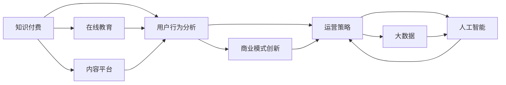

                 

# 知识经济时代下的知识付费创新商业模式运营

> 关键词：知识付费, 商业模式, 运营策略, 在线教育, 内容平台, 用户行为分析

## 1. 背景介绍

### 1.1 问题由来

在知识经济时代，知识的价值日益凸显，而传统的信息获取方式已无法满足人们日益增长的学习需求。在此背景下，知识付费作为一种新型的知识传播和消费方式应运而生，逐渐成为知识经济时代的重要商业模式。然而，知识付费的实际效果、商业模式创新及运营策略等问题，仍存在诸多挑战。

### 1.2 问题核心关键点

- 知识付费模式：以知识为载体，通过在线教育、内容平台等方式，为用户提供高质量、高价值的知识产品或服务。
- 商业模式创新：知识付费不仅是信息交易，更是知识的生产、传播与消费过程，需要构建全新的商业模式来支撑。
- 用户行为分析：理解用户的学习行为与偏好，优化内容推荐和个性化服务，提升用户粘性和满意度。
- 运营策略：如何在激烈的竞争中脱颖而出，吸引并留住优质用户，实现持续增长和盈利。
- 技术手段：利用大数据、人工智能等技术，提高知识内容的匹配度与个性化推荐水平，提升运营效率和用户体验。

这些关键点构成了知识付费商业模式运营的核心，通过深度解析这些关键点，可以更好地指导知识付费企业的实践。

## 2. 核心概念与联系

### 2.1 核心概念概述

为了深入理解知识付费商业模式运营，我们首先梳理几个核心概念及其相互关系：

1. **知识付费(Knowledge Pricing)**：用户为获取高价值知识内容而支付费用的模式，强调知识和信息的附加值。
2. **在线教育(Online Education)**：通过互联网进行的学习与教育活动，打破了时间、空间的限制。
3. **内容平台(Content Platform)**：提供知识内容展示、传播与互动的平台，如付费订阅、直播、短视频等。
4. **用户行为分析(User Behavior Analysis)**：通过数据分析，了解用户的学习行为和需求，优化服务。
5. **商业模式创新(Business Model Innovation)**：基于市场需求和技术变革，开发新的商业模式以适应知识经济的特征。
6. **运营策略(Operational Strategy)**：通过有效的运营手段，提升企业的市场份额和盈利能力。
7. **大数据(Big Data)**：涉及处理、分析大规模数据集的技术和方法。
8. **人工智能(Artificial Intelligence)**：通过机器学习和深度学习等技术，实现自动化、智能化的运营和决策。

这些概念之间存在紧密联系，形成一个完整的知识付费商业模式运营系统。

### 2.2 核心概念原理和架构的 Mermaid 流程图



此图表展示了一个典型的知识付费商业模式运营系统，其中各模块相互关联，共同支持知识付费业务的开展。

## 3. 核心算法原理 & 具体操作步骤

### 3.1 算法原理概述

知识付费的商业模式运营涉及多个算法和模型，主要围绕以下几个方面：

- **用户画像构建**：通过数据分析和机器学习技术，描绘用户的学习行为、兴趣和需求，构建个性化用户画像。
- **内容推荐系统**：利用协同过滤、深度学习等技术，推荐符合用户兴趣和需求的内容。
- **价格策略制定**：基于用户画像和内容价值，制定动态价格策略，提升用户体验和转化率。
- **用户留存分析**：通过用户行为数据，分析流失原因，优化产品和服务，提升用户粘性。
- **运营效率提升**：利用大数据和人工智能技术，实现用户行为预测、资源优化和运营管理。

这些算法和模型共同作用，形成了一个高效的运营体系，支撑知识付费业务的持续增长。

### 3.2 算法步骤详解

以下详细介绍知识付费商业模式运营的关键算法步骤：

**Step 1: 用户画像构建**
1. **数据收集**：通过在线学习行为、互动数据、支付行为等途径，收集用户基础数据。
2. **特征提取**：从行为数据中提取用户兴趣、学习频次、消费能力等特征。
3. **画像构建**：利用机器学习算法（如聚类、分类等），构建用户画像。

**Step 2: 内容推荐系统**
1. **内容标签化**：对知识内容进行标签化处理，形成内容库。
2. **协同过滤**：利用用户历史行为数据，推荐相似用户喜欢的内容。
3. **深度学习**：通过嵌入学习和序列模型（如RNN、LSTM等），预测用户对内容的偏好。
4. **推荐算法**：综合多源数据，使用加权平均、协同过滤等算法，生成个性化推荐列表。

**Step 3: 价格策略制定**
1. **内容价值评估**：基于内容质量和用户画像，评估内容价值。
2. **动态定价**：根据用户行为数据和市场反馈，调整定价策略。
3. **促销活动**：设计合理的促销活动，吸引用户试用和付费。

**Step 4: 用户留存分析**
1. **流失分析**：通过用户行为数据，分析流失原因。
2. **产品优化**：根据分析结果，优化产品和服务，提升用户粘性。
3. **留存策略**：设计有效的留存策略，如积分奖励、增值服务等。

**Step 5: 运营效率提升**
1. **预测分析**：利用大数据分析，预测用户行为和市场趋势。
2. **资源优化**：通过自动化和智能算法，优化资源配置，降低运营成本。
3. **实时监控**：实现对运营数据的实时监控和预警，及时响应市场变化。

### 3.3 算法优缺点

知识付费商业模式运营中的算法模型具有以下优点：

- **个性化推荐**：通过数据分析和算法优化，提高内容匹配度，提升用户满意度。
- **动态定价**：根据市场和用户需求，灵活调整价格，提升收入和用户体验。
- **运营效率**：利用大数据和AI技术，提高运营效率，降低成本。
- **用户洞察**：深入理解用户行为，优化产品和服务，提升用户粘性。

同时，这些算法模型也存在一些缺点：

- **数据依赖**：算法效果高度依赖高质量数据，数据获取和处理成本较高。
- **模型复杂**：多个算法模型和数据源的整合，增加了系统复杂度和维护难度。
- **市场变化**：市场和用户需求的快速变化，对算法模型的灵活性和实时性提出更高要求。

## 4. 数学模型和公式 & 详细讲解 & 举例说明

### 4.1 数学模型构建

知识付费商业模式运营涉及多个数学模型，其中最重要的包括：

- **用户画像模型**：基于用户行为数据，使用聚类算法（如K-means）和分类算法（如决策树），构建用户画像。
- **内容推荐模型**：使用协同过滤算法（如ALS）和深度学习模型（如RNN、LSTM），生成个性化推荐结果。
- **价格策略模型**：基于内容价值和用户画像，使用线性回归和逻辑回归等算法，制定动态定价策略。
- **用户留存模型**：通过流失分析算法（如因子分析）和预测模型（如时间序列模型），优化用户留存策略。

### 4.2 公式推导过程

以内容推荐模型的协同过滤算法为例，推导其核心公式。

协同过滤算法的基本思想是通过用户-用户和物品-物品的相似性，预测用户对未评分物品的评分。假设用户集合为$U=\{u_1,u_2,...,u_m\}$，物品集合为$I=\{i_1,i_2,...,i_n\}$，用户$u_j$对物品$i_k$的评分记为$R_{i_k}$，协同过滤模型的目标是通过相似性矩阵$S$，预测用户$u_j$对物品$i_k$的评分：

$$
\hat{R}_{u_ji_k} = \sum_{u_i \in U} \alpha_{u_ji_k} \hat{R}_{u_ii_k}
$$

其中$\alpha_{u_ji_k}$表示用户$u_j$和物品$i_k$之间的相似性权重，通常使用余弦相似度或皮尔逊相关系数计算。

### 4.3 案例分析与讲解

以在线教育平台Coursera为例，分析其如何通过知识付费商业模式运营实现增长。

Coursera利用大数据和人工智能技术，构建用户画像和内容推荐系统，通过个性化推荐和动态定价策略，提升用户购买率和满意度。平台通过分析用户行为数据，预测用户流失原因，优化产品和服务，提升用户留存率。此外，Coursera还利用机器学习模型，优化课程推荐和资源配置，降低运营成本。

## 5. 项目实践：代码实例和详细解释说明

### 5.1 开发环境搭建

在知识付费商业模式运营项目中，常见的开发环境搭建包括：

- **编程语言**：Python是最常用的语言，支持各种数据处理和机器学习库。
- **数据平台**：使用Apache Hadoop、Apache Spark等分布式数据处理平台。
- **数据库**：使用MySQL、PostgreSQL等关系型数据库，以及NoSQL数据库如HBase、MongoDB等。
- **机器学习框架**：TensorFlow、Scikit-learn等深度学习框架，以及PyTorch等通用框架。

搭建环境的步骤如下：

1. **环境安装**：安装Python、数据库和分布式计算平台等软件。
2. **依赖库安装**：安装机器学习、数据分析等依赖库。
3. **项目初始化**：使用Django、Flask等框架搭建Web应用。
4. **数据存储**：使用关系型或非关系型数据库存储用户行为和内容数据。

### 5.2 源代码详细实现

以下是一个简单的用户画像构建和内容推荐系统的代码实现示例：

```python
# 用户画像构建
from sklearn.cluster import KMeans
import pandas as pd

# 加载用户行为数据
data = pd.read_csv('user_behavior_data.csv')

# 特征选择
selected_features = ['login_time', 'study_duration', 'purchase_frequency']

# 归一化处理
data[selected_features] = (data[selected_features] - data[selected_features].mean()) / data[selected_features].std()

# K-means聚类
kmeans = KMeans(n_clusters=5, random_state=0)
user_clusters = kmeans.fit_predict(data[selected_features])

# 输出用户画像
print(user_clusters)
```

```python
# 内容推荐系统
from surprise import Reader, Dataset, KNNWithMeans
from surprise.model_selection import train_test_split

# 数据加载
reader = Reader(rating_scale=(0, 5))
data = Dataset.load_from_df(data[["user_id", "item_id", "rating"]], reader)

# 划分训练集和测试集
trainset, testset = train_test_split(data, test_size=0.2)

# 协同过滤算法
algo = KNNWithMeans(k=50)
algo.fit(trainset)

# 推荐测试集
predictions = algo.test(testset)
print(predictions)
```

### 5.3 代码解读与分析

**用户画像构建代码解读**：

1. **数据加载**：通过Pandas库读取用户行为数据。
2. **特征选择**：选取与用户画像相关的特征（如登录时间、学习时长、购买频率等）。
3. **数据处理**：对特征进行归一化处理，使其符合K-means算法的输入要求。
4. **聚类算法**：使用K-means算法，对用户进行聚类，形成用户画像。

**内容推荐系统代码解读**：

1. **数据加载**：使用Surprise库加载协同过滤推荐系统所需的数据集。
2. **模型训练**：使用KNNWithMeans算法进行协同过滤模型的训练。
3. **推荐测试**：使用训练好的模型对测试集进行推荐，输出预测结果。

## 6. 实际应用场景

### 6.1 智能教育

智能教育是知识付费商业模式的重要应用场景之一，通过在线课程和个性化学习平台，提供优质教育资源，满足用户的学习需求。平台通过内容推荐和动态定价，提升用户粘性和满意度。

### 6.2 企业培训

企业通过知识付费平台，为员工提供定制化的培训课程，提升员工技能，支持企业战略发展。平台通过数据分析，定制个性化培训计划，提高培训效果。

### 6.3 职业发展

知识付费平台为职场人士提供职业发展相关的知识资源，如技能提升、行业动态等，帮助用户实现职业目标。平台通过个性化推荐，提供用户所需内容，提升学习效率。

### 6.4 未来应用展望

未来，知识付费商业模式运营将进一步融合大数据和人工智能技术，实现以下发展趋势：

- **实时预测与优化**：利用实时数据分析，预测市场和用户需求，动态调整内容推荐和定价策略。
- **多模态数据融合**：将文本、视频、音频等多模态数据结合，提供更丰富、全面的知识服务。
- **知识图谱构建**：构建知识图谱，实现知识内容的深度整合和关联，提升内容匹配度。
- **个性化学习路径**：基于用户画像和行为数据，设计个性化的学习路径，提升用户的学习效果。
- **智能客服与支持**：利用智能客服和自动化支持，提升用户服务体验，降低运营成本。

## 7. 工具和资源推荐

### 7.1 学习资源推荐

1. **《知识付费商业模式》书籍**：介绍知识付费的本质、商业策略和运营方法。
2. **Coursera平台学习**：学习Coursera的成功经验和商业模式运营策略。
3. **《深度学习》课程**：斯坦福大学课程，涵盖深度学习的基础和应用。
4. **Kaggle竞赛**：通过参加机器学习和数据科学竞赛，提升实际应用能力。
5. **在线学习平台**：如Udemy、edX等，获取知识付费运营的最新案例和实践。

### 7.2 开发工具推荐

1. **编程语言**：Python、R、Scala等。
2. **数据平台**：Hadoop、Spark、Flink等。
3. **数据库**：MySQL、PostgreSQL、HBase等。
4. **机器学习框架**：TensorFlow、PyTorch、Scikit-learn等。
5. **可视化工具**：Tableau、Power BI等。

### 7.3 相关论文推荐

1. **《知识付费与在线教育》论文**：探讨知识付费模式在在线教育中的应用。
2. **《内容推荐系统研究》论文**：介绍协同过滤、深度学习等推荐算法。
3. **《用户行为分析》论文**：通过数据挖掘和机器学习技术，分析用户行为和需求。
4. **《动态定价策略》论文**：研究动态定价算法和模型。
5. **《知识付费平台运营》论文**：分析知识付费平台运营策略和实践。

## 8. 总结：未来发展趋势与挑战

### 8.1 研究成果总结

知识付费商业模式运营的研究主要集中在以下几个方面：

- **用户画像构建**：通过数据分析和机器学习算法，描绘用户画像，提升个性化服务。
- **内容推荐系统**：利用协同过滤和深度学习算法，提供优质推荐内容。
- **价格策略制定**：动态调整价格策略，提升用户体验和转化率。
- **用户留存分析**：通过用户行为数据分析，优化产品和服务，提升用户粘性。
- **运营效率提升**：利用大数据和AI技术，提高运营效率和资源配置。

### 8.2 未来发展趋势

未来，知识付费商业模式运营将呈现以下趋势：

- **深度整合多模态数据**：将文本、视频、音频等多种数据形式结合，提供更全面的知识服务。
- **实时动态优化**：通过实时数据分析，动态调整推荐和定价策略。
- **知识图谱构建**：构建知识图谱，提升内容匹配度和关联性。
- **个性化学习路径设计**：基于用户画像和行为数据，设计个性化的学习路径。
- **智能客服与支持**：利用智能客服和自动化支持，提升用户体验和服务效率。

### 8.3 面临的挑战

知识付费商业模式运营面临以下挑战：

- **数据获取与质量**：高质量数据获取难度大，数据清洗和处理成本高。
- **模型复杂与维护**：多算法模型和数据源的整合，增加了系统复杂度和维护难度。
- **市场变化快速**：市场和用户需求快速变化，要求算法模型具有更高的灵活性和实时性。
- **用户行为多样性**：用户行为模式多样，需要更灵活的算法和策略应对。

### 8.4 研究展望

未来的研究方向包括：

- **多模态数据分析**：结合多模态数据，提升知识内容的多样性和丰富度。
- **实时数据分析**：构建实时数据分析平台，支持动态调整推荐和定价策略。
- **用户行为预测**：利用预测模型，提前识别用户流失原因，优化产品和服务。
- **自动化与智能化**：利用自动化和智能化技术，提升运营效率和用户体验。
- **隐私与安全**：重视用户隐私保护，确保数据安全，构建可信赖的知识付费平台。

通过不断创新和优化，知识付费商业模式将更好地适应知识经济时代的需求，为更多人提供优质的知识服务。

## 9. 附录：常见问题与解答

### Q1：知识付费模式对用户的学习效果有何影响？

**A1**: 知识付费模式通过提供高质量、高价值的内容，引导用户深入学习和思考，有助于提升学习效果。同时，付费机制也能够激励用户持续学习，形成良好的学习习惯。然而，过度依赖付费内容，也可能导致部分用户难以坚持学习，最终未能达到预期的学习目标。

### Q2：如何设计有效的知识付费商业模式？

**A2**: 设计有效的知识付费商业模式需考虑以下几个方面：

- **内容质量**：提供高质量、高价值的内容，满足用户的学习需求。
- **用户画像**：通过数据分析和机器学习，描绘用户画像，提供个性化服务。
- **推荐系统**：利用协同过滤和深度学习算法，提供个性化推荐内容。
- **价格策略**：根据用户行为和市场需求，动态调整价格策略。
- **用户留存**：通过数据分析和用户反馈，优化产品和服务，提升用户粘性。

### Q3：知识付费平台如何应对激烈的市场竞争？

**A3**: 知识付费平台应对激烈市场竞争的策略包括：

- **差异化定位**：明确平台的核心优势和差异化定位，形成独特品牌。
- **多样化内容**：提供多样化的内容形式和主题，满足不同用户的需求。
- **技术创新**：利用大数据和AI技术，提升运营效率和服务质量。
- **用户互动**：增加用户互动和社区交流，提升用户粘性和满意度。
- **合作共赢**：与企业、教育机构等合作，拓宽知识内容和资源渠道。

### Q4：知识付费平台如何实现精准推荐？

**A4**: 知识付费平台实现精准推荐的策略包括：

- **用户画像**：通过数据分析和机器学习，描绘用户画像，提供个性化服务。
- **内容特征**：提取内容的关键特征，如关键词、标签等，建立内容库。
- **协同过滤**：利用用户历史行为数据，推荐相似用户喜欢的内容。
- **深度学习**：通过嵌入学习和序列模型，预测用户对内容的偏好。
- **实时调整**：根据用户反馈和行为数据，动态调整推荐算法和策略。

### Q5：知识付费平台的盈利模式有哪些？

**A5**: 知识付费平台的盈利模式包括：

- **订阅模式**：用户定期支付费用，享受平台的知识内容和服务。
- **单次购买**：用户一次性购买特定的知识内容或课程。
- **增值服务**：提供高级会员、专家咨询等增值服务，提升用户体验和平台收入。
- **广告收入**：平台通过展示广告和推荐广告，获得广告收入。
- **数据分析**：提供数据分析和咨询服务，帮助企业优化运营策略。

通过以上系统的理解和实践，知识付费平台的运营者可以更好地把握商业模式运营的核心要素，制定有效的策略，实现持续增长和盈利。

---

作者：禅与计算机程序设计艺术 / Zen and the Art of Computer Programming

