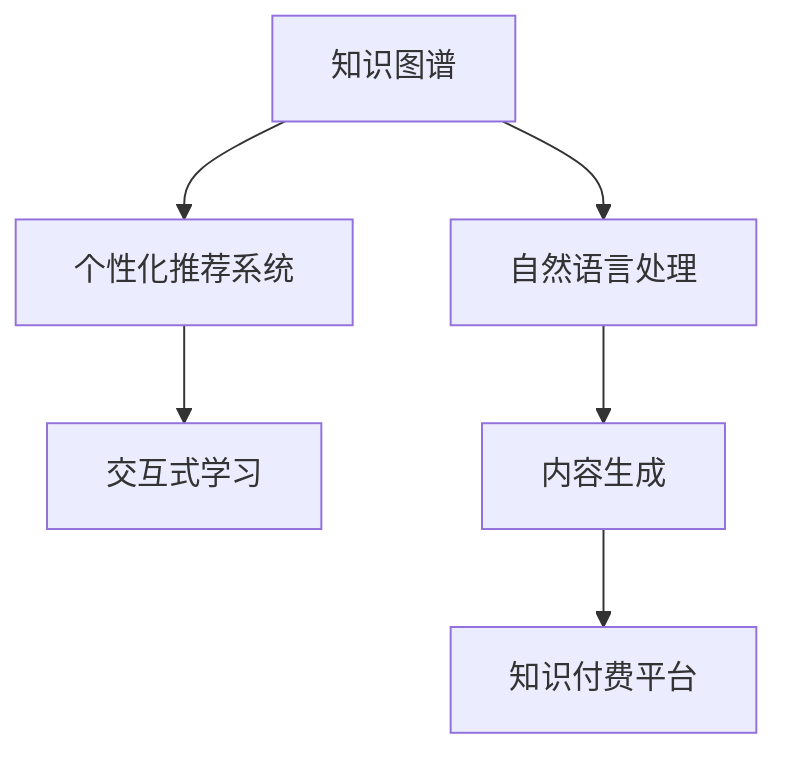

                 

## 1. 背景介绍

### 1.1 问题由来

随着信息爆炸和知识增值的迅速发展，知识付费成为一种新的经济形态。知识付费是指以有偿方式获取知识、技能或信息的行为，包括阅读付费电子书、购买在线课程、订阅知识社区等形式。然而，现有的知识付费平台存在内容质量参差不齐、平台数据壁垒高、推荐算法单一等问题，用户粘性低，难以形成稳定的知识经济闭环。

面对知识经济的蓬勃发展，如何在高质量和便捷性之间找到平衡，成为平台和用户关注的焦点。文章旨在探讨基于人工智能的知识付费创新应用场景，通过技术手段提升知识付费平台的用户体验和商业价值。

### 1.2 问题核心关键点

知识付费创新的关键点包括：
1. **个性化推荐**：利用人工智能技术为用户推荐更符合其兴趣和需求的内容。
2. **内容定制**：通过用户行为分析，实现内容动态生成与定制。
3. **交互式学习**：结合实时反馈和互动，提升学习效果。
4. **知识图谱构建**：构建学科知识图谱，实现知识网络化关联。
5. **智能搜索**：利用自然语言处理技术提升知识搜索效率。

## 2. 核心概念与联系

### 2.1 核心概念概述

为更好地理解人工智能在知识付费中的应用，本节将介绍几个密切相关的核心概念：

- **知识图谱(Knowledge Graph)**：基于图结构的知识表示方法，通过实体、关系、属性等概念构建领域知识网络，实现知识的有序化组织和关联检索。
- **个性化推荐系统**：利用用户行为数据和偏好模型，为用户推荐最相关的内容，提升用户体验和满意度。
- **自然语言处理(Natural Language Processing, NLP)**：涉及文本挖掘、语音识别、语义分析等技术，用于理解和生成自然语言，支持智能搜索和交互式学习。
- **交互式学习(Interactive Learning)**：通过互动、反馈机制，提升学习效果，增加用户粘性。
- **内容生成(Content Generation)**：利用深度学习等技术自动生成文本、图像、音频等内容，支持内容定制和动态生成。
- **知识付费平台(Knowledge Payment Platform)**：以知识为核心的平台，提供付费内容和服务，满足用户个性化知识需求。

这些核心概念之间的逻辑关系可以通过以下Mermaid流程图来展示：



这个流程图展示了这个概念框架中的关键组件及其关联：

1. 知识图谱为个性化推荐系统和自然语言处理提供知识背景和结构化信息。
2. 个性化推荐系统利用知识图谱和自然语言处理结果，为用户推荐个性化的内容。
3. 交互式学习结合个性化推荐，提供更高效、更个性化的学习体验。
4. 内容生成通过深度学习技术，实现内容的自动化生产和动态生成。
5. 知识付费平台是集成这些技术和功能，为用户提供一个知识交易的闭环生态。

## 3. 核心算法原理 & 具体操作步骤
### 3.1 算法原理概述

基于人工智能的知识付费创新应用场景，主要涉及以下几个关键技术：

- **个性化推荐算法**：基于协同过滤、矩阵分解、深度学习等技术，对用户行为进行建模，预测其感兴趣的内容。
- **内容生成算法**：利用RNN、GAN、Transformer等深度学习模型，自动生成高质量文本、图像、音频等内容。
- **知识图谱构建算法**：通过节点嵌入、图神经网络等技术，从海量文本数据中抽取实体、关系和属性，构建知识图谱。
- **交互式学习算法**：结合自然语言理解和生成技术，实时提供用户反馈和互动，提升学习效果。

### 3.2 算法步骤详解

以个性化推荐算法为例，介绍其主要步骤：

**Step 1: 数据预处理**
- 收集用户行为数据，包括浏览记录、购买记录、评分记录等。
- 对数据进行清洗、归一化处理，去除异常值和噪声数据。

**Step 2: 用户画像构建**
- 利用协同过滤算法或矩阵分解算法，构建用户兴趣模型。
- 对用户兴趣进行聚类分析，形成不同的用户群体。

**Step 3: 内容画像构建**
- 通过文本挖掘、图像识别等技术，提取内容的特征。
- 利用神经网络模型对内容进行编码，形成向量表示。

**Step 4: 推荐模型训练**
- 选择适合的推荐算法，如基于深度学习的神经网络模型。
- 利用用户行为数据和内容画像进行模型训练，调整模型参数。

**Step 5: 推荐结果生成**
- 将用户画像和内容画像输入推荐模型，得到推荐结果。
- 根据推荐算法选择合适的推荐策略，如基于召回率-精度的折中、基于多样性的推荐等。

**Step 6: 用户反馈收集与模型优化**
- 收集用户反馈，进行A/B测试，评估推荐效果。
- 根据用户反馈，对推荐模型进行优化，如调整权重、引入用户打分等。

### 3.3 算法优缺点

基于人工智能的知识付费创新应用场景，具有以下优点：
1. 提升用户体验：个性化推荐和交互式学习，大大提升了用户的学习效率和满意度。
2. 增加用户粘性：利用内容生成和动态推荐，保持用户的高频使用。
3. 降低运营成本：自动化内容生成和推荐算法，减少了人力成本和运营负担。
4. 促进知识共享：知识图谱构建，实现了知识的关联检索和知识共享。

同时，这些技术也存在一些局限性：
1. 数据隐私问题：大量用户数据的收集和存储，可能带来隐私泄露的风险。
2. 内容真实性：自动化生成内容可能存在事实错误、逻辑错误等问题。
3. 算法鲁棒性：推荐算法和内容生成算法对异常数据和噪声数据较为敏感，需要持续优化。
4. 平台资源需求：智能推荐和实时交互需要大量计算资源，平台需要具备相应的计算能力和存储能力。

### 3.4 算法应用领域

基于人工智能的知识付费创新应用场景，已经在多个领域得到了应用，例如：

- **在线教育**：利用个性化推荐和交互式学习技术，提升在线课程的用户体验和满意度。
- **职业培训**：通过知识图谱和内容生成，提供定制化的职业培训方案。
- **智能健康**：结合个性化推荐和实时互动，提供精准的健康知识服务。
- **法律咨询**：利用知识图谱和自然语言处理，提供智能化的法律咨询服务。

除了上述这些经典应用外，知识付费创新技术还将在更多领域得到应用，为各行各业的知识经济转型提供新的解决方案。

## 4. 数学模型和公式 & 详细讲解  
### 4.1 数学模型构建

本节将使用数学语言对基于人工智能的知识付费创新应用场景的推荐算法进行更加严格的刻画。

记用户行为数据为 $D=\{(x_i,y_i)\}_{i=1}^N$，其中 $x_i$ 表示用户行为，$y_i$ 表示用户兴趣标签。

定义用户兴趣模型为 $u(x)$，内容特征向量为 $c(x)$，推荐模型为 $r(u,c)$。推荐模型的目标是最大化用户满意度，即：

$$
\max_{u,c} u \cdot r(u,c)
$$

其中 $u \cdot r(u,c)$ 表示用户兴趣与推荐内容的相关度。

在实践中，我们通常使用协同过滤、矩阵分解、深度学习等算法，对用户兴趣和内容特征进行建模，得到用户画像 $u$ 和内容画像 $c$，然后利用推荐模型 $r(u,c)$ 预测推荐结果。

### 4.2 公式推导过程

以下我们以协同过滤算法为例，推导推荐公式及其梯度计算。

假设用户行为数据 $D=\{(x_i,y_i)\}_{i=1}^N$，其中 $x_i$ 表示用户 $i$ 对内容 $j$ 的评分。设用户兴趣模型为 $u(x)$，内容特征模型为 $c(x)$，推荐模型为 $r(u,c)$。协同过滤算法的基本思想是：通过相似性度量，找到与用户 $u$ 兴趣相似的用户 $u'$ 和内容 $c'$，从而预测用户 $u$ 对内容 $c$ 的评分。

设用户 $u$ 对内容 $c$ 的预测评分为 $\hat{y}_{u,c}$，则协同过滤算法的预测公式为：

$$
\hat{y}_{u,c} = \frac{1}{K} \sum_{k=1}^K \sum_{i=1}^N \alpha_{ik} \cdot y_{i,c}
$$

其中 $K$ 为用户数量，$\alpha_{ik}$ 为相似性权重。

为了方便计算，我们通常使用矩阵分解算法对 $K\times M$ 的用户评分矩阵 $Y$ 进行分解，得到低秩矩阵 $U$ 和 $V$。其中 $U$ 表示用户兴趣向量，$V$ 表示内容特征向量，推荐模型可以表示为：

$$
r(u,c) = u^TV^T
$$

协同过滤算法的损失函数为均方误差损失函数，记为：

$$
\mathcal{L}(Y,Y_{\hat{y}}) = \frac{1}{2} ||Y-Y_{\hat{y}}||^2_F
$$

其中 $Y_{\hat{y}}$ 表示预测评分矩阵，$||\cdot||_F$ 表示矩阵的Frobenius范数。

为了最小化损失函数，需要优化用户兴趣模型 $u$ 和内容特征模型 $c$。根据矩阵分解的性质，可以得到用户兴趣模型和内容特征模型的梯度公式：

$$
\frac{\partial \mathcal{L}}{\partial u} = -U^T(UUV^TV^T-Y)V^T
$$

$$
\frac{\partial \mathcal{L}}{\partial c} = -U^TUV^TV^T-V^TV^TV
$$

利用上述梯度公式，通过迭代优化算法，不断调整用户兴趣模型和内容特征模型，直至收敛。

### 4.3 案例分析与讲解

以下我们以一个在线教育平台的个性化推荐系统为例，讲解其具体实现。

假设在线教育平台收集了用户的观看记录和评分数据，利用协同过滤算法对用户兴趣进行建模。设用户 $u$ 对内容 $c$ 的预测评分为 $\hat{y}_{u,c}$，可以通过协同过滤公式进行计算：

$$
\hat{y}_{u,c} = \frac{1}{K} \sum_{k=1}^K \sum_{i=1}^N \alpha_{ik} \cdot y_{i,c}
$$

其中 $K$ 为用户数量，$\alpha_{ik}$ 为相似性权重。在实际应用中，可以使用基于矩阵分解的算法，如SVD分解，对用户评分矩阵进行分解，得到用户兴趣模型 $u$ 和内容特征模型 $c$，然后通过公式计算预测评分。

## 5. 项目实践：代码实例和详细解释说明
### 5.1 开发环境搭建

在进行知识付费应用开发前，我们需要准备好开发环境。以下是使用Python进行TensorFlow开发的环境配置流程：

1. 安装Anaconda：从官网下载并安装Anaconda，用于创建独立的Python环境。

2. 创建并激活虚拟环境：
```bash
conda create -n tf-env python=3.8 
conda activate tf-env
```

3. 安装TensorFlow：根据CUDA版本，从官网获取对应的安装命令。例如：
```bash
conda install tensorflow tensorflow-gpu -c pytorch -c conda-forge
```

4. 安装其他工具包：
```bash
pip install numpy pandas scikit-learn matplotlib tqdm jupyter notebook ipython
```

完成上述步骤后，即可在`tf-env`环境中开始开发。

### 5.2 源代码详细实现

这里我们以一个基于TensorFlow的在线教育平台为例，给出个性化推荐系统的PyTorch代码实现。

首先，定义推荐模型：

```python
import tensorflow as tf
from tensorflow.keras.layers import Input, Embedding, Dot, Dense

user_input = Input(shape=(1,), name='user')
content_input = Input(shape=(1,), name='content')
user_embedding = Embedding(input_dim=1000, output_dim=100, name='user_embedding')(user_input)
content_embedding = Embedding(input_dim=1000, output_dim=100, name='content_embedding')(content_input)
dot_product = Dot(axes=(1, 1), normalize=True)([user_embedding, content_embedding])
score = Dense(1, activation='sigmoid')(dot_product)
model = tf.keras.Model(inputs=[user_input, content_input], outputs=score)
model.compile(optimizer='adam', loss='binary_crossentropy', metrics=['accuracy'])
```

然后，定义训练函数：

```python
def train(model, train_data, epochs=10, batch_size=32):
    model.fit(train_data, epochs=epochs, batch_size=batch_size, validation_split=0.2)
```

最后，启动训练流程：

```python
train_data = ...
train(model, train_data)
```

以上就是使用TensorFlow实现在线教育平台个性化推荐系统的完整代码实现。可以看到，TensorFlow提供了丰富的深度学习组件和工具，使得构建个性化推荐系统变得相对简单。

### 5.3 代码解读与分析

让我们再详细解读一下关键代码的实现细节：

**train函数**：
- 定义训练数据集，包括用户评分矩阵和内容特征向量。
- 利用tf.keras.Model定义推荐模型，包括用户嵌入层、内容嵌入层、点积层和输出层。
- 使用Adam优化器和二分类交叉熵损失函数，进行模型训练。
- 设置训练轮数和批次大小，进行模型拟合。

**训练过程**：
- 数据集 `train_data` 应包含用户评分矩阵和内容特征向量，用于训练推荐模型。
- 训练函数 `train` 调用 `model.fit` 进行模型训练，指定训练轮数和批次大小，并在验证集上评估模型性能。
- 在实际应用中，还需要根据具体任务调整训练参数，如优化器、损失函数、评估指标等。

## 6. 实际应用场景
### 6.1 在线教育平台

在线教育平台可以利用个性化推荐系统，提升用户的学习效率和满意度。平台收集用户的观看记录、评分数据和行为数据，利用协同过滤或深度学习算法，为用户推荐其感兴趣的视频课程和学习资料。

具体实现上，可以在视频播放页面或课程详情页添加推荐功能，推荐用户可能感兴趣的课程或视频，提高平台的用户粘性和流量转化率。同时，平台还可以利用交互式学习技术，如实时互动、作业反馈等，提升学习效果。

### 6.2 职业培训系统

职业培训系统可以利用知识图谱和内容生成技术，提供定制化的职业培训方案。系统收集职业培训相关数据，构建学科知识图谱，利用自然语言处理技术，自动生成培训课程和知识模块，实现职业知识的智能推荐和动态生成。

具体实现上，可以通过在线考试和评估，动态调整培训内容，提供个性化的学习路径和难度控制，实现因材施教。同时，利用知识图谱构建职业知识网络，提供知识关联检索和知识共享功能，提升培训效果和知识传播。

### 6.3 智能健康平台

智能健康平台可以利用个性化推荐和实时互动技术，提供精准的健康知识服务。平台收集用户的健康数据、行为数据和反馈数据，利用协同过滤算法或深度学习算法，为用户推荐个性化的健康知识内容和健康管理方案。

具体实现上，可以在平台首页或健康管理中心，推荐用户可能感兴趣的健康知识，提供健康检测、饮食建议、运动指导等功能。同时，利用实时互动技术，收集用户的反馈和行为数据，进行健康数据分析，提供个性化的健康建议和干预方案。

### 6.4 法律咨询平台

法律咨询平台可以利用知识图谱和自然语言处理技术，提供智能化的法律咨询服务。平台收集法律咨询相关数据，构建法律知识图谱，利用自然语言处理技术，自动生成法律知识库和法律咨询方案，实现法律问题的智能推荐和动态生成。

具体实现上，可以通过问答系统、法律咨询页面等渠道，推荐用户可能感兴趣的法律知识，提供法律咨询服务。同时，利用知识图谱构建法律知识网络，提供法律知识关联检索和法律建议生成功能，提升法律咨询的效率和效果。

## 7. 工具和资源推荐
### 7.1 学习资源推荐

为了帮助开发者系统掌握人工智能在知识付费中的应用，这里推荐一些优质的学习资源：

1. 《TensorFlow实战》系列博文：由TensorFlow官方团队撰写，详细介绍了TensorFlow的基本概念和高级应用，包括推荐系统、自然语言处理等技术。

2. Coursera《深度学习》课程：斯坦福大学开设的深度学习课程，涵盖了深度学习的基本原理和应用实例，适合初学者和进阶者。

3. 《深度学习与推荐系统》书籍：详细介绍了推荐系统的基本原理和算法，包括协同过滤、深度学习等技术，并结合实际应用案例进行了讲解。

4. Kaggle在线竞赛平台：提供了丰富的数据集和推荐系统竞赛，适合进行实践和实验，提升算法优化和模型训练能力。

5. HuggingFace官方文档：提供了大量的预训练语言模型和推荐系统样例代码，方便开发者上手实践。

通过对这些资源的学习实践，相信你一定能够快速掌握人工智能在知识付费中的应用，并用于解决实际的业务问题。

### 7.2 开发工具推荐

高效的开发离不开优秀的工具支持。以下是几款用于知识付费应用开发的常用工具：

1. TensorFlow：由Google主导开发的深度学习框架，生产部署方便，适合大规模工程应用。提供了丰富的组件和工具，支持推荐系统和自然语言处理等技术。

2. PyTorch：基于Python的开源深度学习框架，灵活动态的计算图，适合快速迭代研究。提供了丰富的深度学习组件和工具，支持个性化推荐和内容生成等技术。

3. Apache Spark：大数据处理框架，支持分布式计算和数据处理，适合大规模数据分析和推荐系统开发。

4. ElasticSearch：分布式搜索和分析引擎，支持海量数据的高效检索和分析，适合构建智能搜索系统。

5. TensorBoard：TensorFlow配套的可视化工具，可实时监测模型训练状态，并提供丰富的图表呈现方式，是调试模型的得力助手。

6. Weights & Biases：模型训练的实验跟踪工具，可以记录和可视化模型训练过程中的各项指标，方便对比和调优。

合理利用这些工具，可以显著提升知识付费应用的开发效率，加快创新迭代的步伐。

### 7.3 相关论文推荐

知识付费创新的研究源于学界的持续研究。以下是几篇奠基性的相关论文，推荐阅读：

1. Recommender Systems in Online Education: A Survey and Taxonomy（推荐系统在在线教育中的应用综述）：介绍了在线教育推荐系统的应用场景和算法，包括协同过滤、深度学习等技术。

2. Knowledge Graphs for Recommendation Systems（知识图谱在推荐系统中的应用）：介绍了知识图谱在推荐系统中的应用，包括知识图谱构建、推荐算法等技术。

3. Natural Language Processing in Recommendation Systems（自然语言处理在推荐系统中的应用）：介绍了自然语言处理在推荐系统中的应用，包括文本挖掘、情感分析等技术。

4. Interactive Learning in Recommendation Systems（交互式学习在推荐系统中的应用）：介绍了交互式学习在推荐系统中的应用，包括实时互动、用户反馈等技术。

5. Content Generation in Recommendation Systems（内容生成在推荐系统中的应用）：介绍了内容生成在推荐系统中的应用，包括生成对抗网络、序列生成等技术。

这些论文代表了大语言模型微调技术的发展脉络。通过学习这些前沿成果，可以帮助研究者把握学科前进方向，激发更多的创新灵感。

## 8. 总结：未来发展趋势与挑战
### 8.1 总结

本文对基于人工智能的知识付费创新应用场景进行了全面系统的介绍。首先阐述了知识付费在信息爆炸时代的崛起背景，明确了个性化推荐和内容生成技术在提升用户体验和商业价值方面的独特价值。其次，从原理到实践，详细讲解了推荐算法和内容生成算法的数学原理和关键步骤，给出了推荐任务开发的完整代码实例。同时，本文还广泛探讨了个性化推荐和内容生成技术在多个行业领域的应用前景，展示了其在知识付费应用中的广阔前景。此外，本文精选了推荐技术和内容生成技术的各类学习资源，力求为读者提供全方位的技术指引。

通过本文的系统梳理，可以看到，基于人工智能的知识付费创新应用场景正在成为知识付费领域的重要范式，极大地拓展了推荐系统和内容生成技术的边界，催生了更多的落地场景。受益于深度学习等技术的发展，这些应用场景在提高用户满意度和提升平台商业价值方面发挥了巨大作用。未来，伴随推荐系统和内容生成技术的不断演进，知识付费平台必将在提供更加个性化、高效和便捷的服务上取得新的突破。

### 8.2 未来发展趋势

展望未来，知识付费创新应用场景将呈现以下几个发展趋势：

1. 推荐算法更加智能：利用深度学习和大规模数据训练，推荐算法将更加精准，能够更好地理解用户行为和需求。
2. 内容生成更加多样化：结合自然语言处理和多模态数据，内容生成将更加多样化，能够生成文本、图像、视频等多形式内容。
3. 用户互动更加频繁：利用实时反馈和互动机制，推荐系统将更加智能，能够动态调整推荐策略，提升用户满意度。
4. 跨平台集成更加紧密：知识付费应用将更加跨平台集成，能够无缝衔接各类设备和应用场景，提供一致的用户体验。
5. 个性化推荐更加精准：通过多模态数据融合和知识图谱构建，推荐系统将更加精准，能够更好地满足用户个性化需求。

以上趋势凸显了知识付费创新应用场景的广阔前景。这些方向的探索发展，必将进一步提升知识付费平台的用户体验和商业价值，为知识经济的发展注入新的动力。

### 8.3 面临的挑战

尽管知识付费创新应用场景已经取得了瞩目成就，但在迈向更加智能化、普适化应用的过程中，它仍面临着诸多挑战：

1. 数据隐私问题：大量用户数据的收集和存储，可能带来隐私泄露的风险。如何保护用户隐私，增强数据安全，将是重要课题。
2. 算法鲁棒性：推荐算法和内容生成算法对异常数据和噪声数据较为敏感，需要持续优化。如何提高算法的鲁棒性，减少错误率，将是重要的研究方向。
3. 平台资源需求：智能推荐和实时互动需要大量计算资源，平台需要具备相应的计算能力和存储能力。如何优化资源使用，降低成本，将是重要的优化方向。
4. 用户反馈机制：用户反馈机制的建立和优化，能够提升推荐系统的效果。如何建立有效的反馈机制，增强用户互动，将是重要的研究课题。

### 8.4 研究展望

面对知识付费创新应用场景所面临的种种挑战，未来的研究需要在以下几个方面寻求新的突破：

1. 探索无监督和半监督推荐方法。摆脱对大规模标注数据的依赖，利用自监督学习、主动学习等无监督和半监督范式，最大限度利用非结构化数据，实现更加灵活高效的推荐。
2. 研究参数高效和计算高效的推荐范式。开发更加参数高效的推荐方法，在固定大部分预训练参数的同时，只更新极少量的任务相关参数。同时优化推荐模型的计算图，减少前向传播和反向传播的资源消耗，实现更加轻量级、实时性的部署。
3. 引入更多先验知识。将符号化的先验知识，如知识图谱、逻辑规则等，与神经网络模型进行巧妙融合，引导推荐过程学习更准确、合理的推荐模型。同时加强不同模态数据的整合，实现视觉、语音等多模态信息与文本信息的协同建模。
4. 结合因果分析和博弈论工具。将因果分析方法引入推荐模型，识别出模型决策的关键特征，增强推荐结果的因果性和逻辑性。借助博弈论工具刻画人机交互过程，主动探索并规避模型的脆弱点，提高系统稳定性。
5. 纳入伦理道德约束。在推荐目标中引入伦理导向的评估指标，过滤和惩罚有偏见、有害的推荐结果。同时加强人工干预和审核，建立推荐系统的监管机制，确保推荐内容符合用户价值观和伦理道德。

这些研究方向的探索，必将引领知识付费创新应用场景的技术进步，为构建安全、可靠、可解释、可控的知识付费系统铺平道路。面向未来，知识付费创新应用场景还需要与其他人工智能技术进行更深入的融合，如知识表示、因果推理、强化学习等，多路径协同发力，共同推动知识付费平台的进步。只有勇于创新、敢于突破，才能不断拓展知识付费技术的边界，让知识经济更好地服务于社会。

## 9. 附录：常见问题与解答

**Q1：知识付费平台应该如何选择推荐算法？**

A: 知识付费平台的推荐算法选择需要考虑多个因素，包括平台的用户规模、数据量和计算资源等。以下是一些常用的推荐算法：

1. 协同过滤算法：基于用户行为数据，为用户推荐其感兴趣的内容。适用于用户量较大、数据量丰富的平台。
2. 矩阵分解算法：基于用户评分矩阵进行分解，得到低秩矩阵，利用矩阵乘法计算推荐结果。适用于数据量较大、计算资源丰富的平台。
3. 深度学习算法：利用神经网络模型进行用户兴趣和内容特征的建模，得到高维特征向量，利用全连接层或注意力机制计算推荐结果。适用于数据量较大、计算资源丰富的平台。

在选择推荐算法时，需要结合具体平台的情况，考虑算法的复杂度和性能，并进行A/B测试，评估推荐效果。

**Q2：知识付费平台如何处理用户隐私问题？**

A: 处理用户隐私问题是知识付费平台的重要任务，以下是一些常用的隐私保护措施：

1. 数据匿名化：对用户行为数据进行匿名化处理，去除敏感信息，保护用户隐私。
2. 数据加密：对用户数据进行加密处理，防止数据泄露。
3. 数据访问控制：对用户数据进行严格的访问控制，防止未经授权的访问。
4. 数据最小化原则：只收集必要的用户数据，减少数据泄露的风险。

在实际应用中，还需要制定详细的数据隐私政策，向用户明示数据使用范围和方式，增强用户信任。

**Q3：知识付费平台如何优化推荐系统？**

A: 优化推荐系统需要从多个方面进行改进，以下是一些常用的优化措施：

1. 数据清洗：对用户行为数据进行清洗，去除异常值和噪声数据，提高数据质量。
2. 特征工程：对用户和内容进行特征工程，提取关键特征，提升推荐效果。
3. 模型优化：优化推荐模型，调整模型参数和超参数，提高模型性能。
4. 算法优化：优化推荐算法，引入新的算法模型，提升推荐效果。
5. 用户反馈机制：建立有效的用户反馈机制，根据用户反馈进行模型调整，提高推荐效果。

在实际应用中，还需要进行A/B测试，评估优化措施的效果，进行持续迭代优化。

**Q4：知识付费平台如何提升用户互动？**

A: 提升用户互动需要从多个方面进行改进，以下是一些常用的措施：

1. 实时互动：利用实时互动技术，增强用户与系统的互动，提升用户体验。
2. 推荐系统优化：优化推荐系统，提高推荐效果，让用户感受到个性化推荐。
3. 反馈机制：建立有效的用户反馈机制，根据用户反馈进行模型调整，提升用户体验。
4. 激励机制：设计合理的激励机制，鼓励用户参与互动，提升用户粘性。

在实际应用中，还需要进行持续的调研和测试，了解用户需求和行为，进行持续优化。

**Q5：知识付费平台如何处理多模态数据？**

A: 处理多模态数据需要从多个方面进行改进，以下是一些常用的措施：

1. 数据融合：对多模态数据进行融合，提取多模态特征，提升数据质量。
2. 跨模态学习：利用跨模态学习技术，学习不同模态之间的关联关系，提升数据理解能力。
3. 模型优化：优化多模态数据处理模型，提高数据处理效果。
4. 数据可视化：利用数据可视化技术，展示多模态数据，提升数据理解能力。

在实际应用中，还需要进行持续的调研和测试，了解用户需求和行为，进行持续优化。

---

作者：禅与计算机程序设计艺术 / Zen and the Art of Computer Programming

