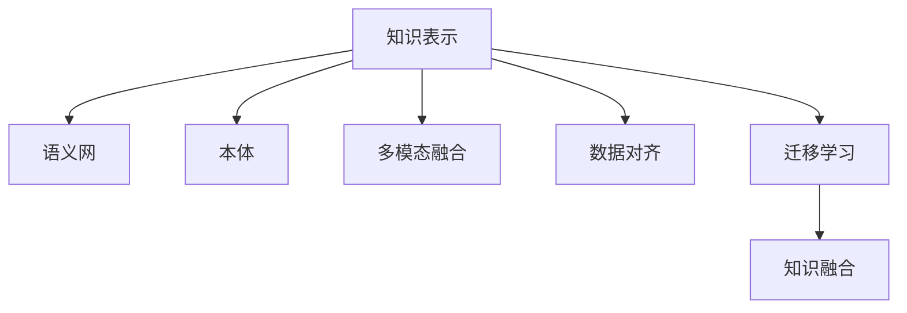

                 

## 1. 背景介绍

### 1.1 问题由来

当前，人工智能技术正在迅速发展，广泛应用于各个领域。然而，随着AI技术的不断深入，单领域、单任务的局限性也逐渐显现。许多问题需要跨领域知识来解决，例如：
- 自然语言处理(NLP)领域的问题需要结合计算机视觉、语音识别等多模态数据。
- 医疗领域的问题需要融合临床数据、基因数据等多种类型的数据。
- 金融领域的问题需要综合利用新闻、社交媒体等多种来源的信息。
- 交通领域的问题需要整合车辆传感器、天气预报等数据。
- 农业领域的问题需要融合卫星遥感、气象数据等多种信息。

这些跨领域的智慧碰撞，要求人工智能系统具备更强的知识融合能力。传统的单一领域模型已难以应对，必须构建能够跨领域学习的知识融合模型。知识融合技术成为人工智能研究的热点，为解决复杂多模态问题提供了新的可能性。

### 1.2 问题核心关键点

知识融合是人工智能研究中的重要分支，其核心目标是整合多源异构数据，建立统一的语义空间，使得计算机能够理解并处理跨领域的信息。具体包括：
- 数据源多样性：多种数据源（文本、图像、声音、时间序列等）提供的信息具有不同的表示形式和语义背景。
- 数据质量差异：不同数据源的数据质量和一致性不同，例如文本数据存在噪声，图像数据存在标注误差。
- 语义空间统一：将异构数据映射到统一的知识表示空间，使得不同领域的数据可以互相理解、沟通。
- 知识融合规则：不同领域间的知识如何综合，如何利用已有知识进行新知识的生成。

目前，知识融合技术已广泛应用在医疗、金融、交通、农业等多个领域，通过整合多源数据，提升系统在特定任务上的表现。本文旨在探讨知识融合的基本原理、关键技术以及应用场景，以期对跨领域的知识融合技术进行全面介绍。

## 2. 核心概念与联系

### 2.1 核心概念概述

为更好地理解知识融合的原理和架构，本节将介绍几个关键概念：

- 知识表示(Knowledge Representation)：指将知识用一种机器可理解的形式表示出来，便于计算机处理和推理。常见的知识表示方式有语义网络、本体、逻辑形式等。
- 语义网(Semantic Web)：一种基于Web的语义网络，目标是使机器可以理解Web上的信息，从而实现更智能的信息检索和交互。
- 本体(Ontology)：一种形式化表达知识的方式，通常以类和属性为基础构建，用于知识共享和推理。
- 多模态融合(Multimodal Fusion)：指将来自不同模态（例如文本、图像、声音）的数据融合在一起，构建统一的知识表示。
- 数据对齐(Data Alignment)：指将不同数据源的数据对齐到同一个标准参考框架下，以便进行知识融合。
- 迁移学习(Transfer Learning)：指将一个领域学到的知识迁移到另一个领域，提高在新领域上的学习效率。

这些核心概念之间的逻辑关系可以通过以下Mermaid流程图来展示：



这个流程图展示了大语言模型的工作原理和优化方向：

1. 知识表示是基础，需要将知识以机器可理解的形式存储起来。
2. 语义网和本体是典型的知识表示形式，用于构建统一的语义空间。
3. 多模态融合和数据对齐是知识融合的关键环节，需要将不同形式的数据统一到一个标准框架下。
4. 迁移学习是将知识从已知领域迁移到未知领域的重要手段。
5. 知识融合是最终目标，构建跨领域的知识系统，使得计算机能够处理跨领域的问题。

## 3. 核心算法原理 & 具体操作步骤
### 3.1 算法原理概述

知识融合的基本原理可以简单描述为：
1. **数据对齐**：将不同数据源的数据对齐到一个共同的参考框架。
2. **多源数据融合**：将对齐后的数据进行融合，形成统一的知识表示。
3. **推理与推理规则**：基于融合后的知识表示进行推理，得出综合结论。

知识融合的关键步骤包括：
- 数据预处理：清洗和转换数据，去除噪声和冗余信息。
- 数据对齐：对齐不同数据源的数据，使其在语义上相互一致。
- 知识表示：将数据转换成机器可理解的形式，建立统一的知识库。
- 知识融合：将多个知识源的信息融合在一起，形成综合的知识表示。
- 推理与推理规则：基于融合后的知识进行推理，得出综合结论。

### 3.2 算法步骤详解

以医疗知识融合为例，展示知识融合的详细步骤：

1. **数据收集**：
   - 从医院信息系统(HIS)、电子病历(EMR)、基因测序仪等不同数据源收集患者数据。
   - 数据包括患者的医疗记录、病历、基因测序结果等。

2. **数据清洗与预处理**：
   - 清洗数据中的噪声和缺失值，去除冗余信息。
   - 将不同数据源的数据转换成统一的格式，如JSON、CSV等。

3. **数据对齐**：
   - 对齐不同数据源的时间戳，使其统一到同一个时间框架下。
   - 对齐不同数据源的患者ID，确保数据唯一性。
   - 对齐不同数据源的诊断结果，使其在语义上相互一致。

4. **知识表示**：
   - 使用本体或语义网构建知识库，将患者数据、疾病、诊断结果等抽象成类和属性。
   - 将知识库中的数据转换成统一的知识表示形式，如RDF三元组。

5. **知识融合**：
   - 使用数据融合算法（如最大似然估计、贝叶斯网络等）将不同数据源的信息融合在一起。
   - 基于融合后的知识表示进行推理，得出综合结论。

6. **推理与推理规则**：
   - 使用推理机对融合后的知识进行推理，得出综合结论。
   - 推理规则可以是简单的if-then规则，也可以是复杂的演绎逻辑。

### 3.3 算法优缺点

知识融合技术的优点包括：
- 跨领域数据整合：融合多源数据，丰富信息量，提升系统表现。
- 统一语义空间：构建统一的语义空间，使得不同领域的数据可以互相理解。
- 知识共享与复用：知识融合后，不同领域可以共享和使用知识，提高知识利用率。

知识融合技术的缺点包括：
- 数据源多样性：不同数据源的数据形式和质量差异大，对齐和融合难度高。
- 推理复杂度：跨领域知识融合后，推理复杂度增加，需要更多的计算资源。
- 数据隐私与安全：跨领域数据融合可能涉及敏感信息，需要特别注意数据隐私与安全问题。

### 3.4 算法应用领域

知识融合技术在多个领域得到广泛应用，例如：

- 医疗领域：融合电子病历、基因测序、影像数据等，提升诊疗效率和精度。
- 金融领域：融合新闻、社交媒体、交易数据等，实现智能投资与风险管理。
- 交通领域：融合车辆传感器、天气预报、卫星遥感等，优化交通管理和事故预警。
- 农业领域：融合卫星遥感、气象数据、土壤数据等，提升农作物管理和产量预测。
- 智能制造：融合传感器数据、生产计划、供应链数据等，实现智能生产与调度。
- 智慧城市：融合城市基础设施数据、环境数据、居民行为数据等，优化城市管理与运营。

## 4. 数学模型和公式 & 详细讲解 & 举例说明

### 4.1 数学模型构建

知识融合的数学模型可以简化为一个多源数据融合模型。设不同数据源的数据为 $x_1, x_2, ..., x_n$，融合后的数据表示为 $y$，则知识融合的数学模型可以表示为：

$$
y = f(x_1, x_2, ..., x_n)
$$

其中 $f$ 为融合函数，用于将不同数据源的数据融合在一起。

### 4.2 公式推导过程

以文本与图像融合为例，展示知识融合的公式推导过程。

假设文本数据表示为 $x_t$，图像数据表示为 $x_i$，融合后的数据表示为 $y$。使用最大似然估计方法进行融合，可以表示为：

$$
y = \frac{p(x_t|y) \times p(x_i|y)}{p(x_t) \times p(x_i)}
$$

其中 $p(x_t|y)$ 表示在知识库 $y$ 中，文本 $x_t$ 的概率，$p(x_i|y)$ 表示在知识库 $y$ 中，图像 $x_i$ 的概率。

使用贝叶斯网络进行融合，可以表示为：

$$
y = \frac{p(x_t|y) \times p(x_i|y)}{p(y)}
$$

其中 $p(y)$ 表示知识库 $y$ 的概率。

### 4.3 案例分析与讲解

以医疗知识融合为例，展示知识融合的实际应用。

假设医生接诊患者，需要融合患者的电子病历、基因测序结果、影像数据等，给出综合诊断。
- 电子病历数据表示为 $x_t$，包括患者的病史、实验室检查结果等。
- 基因测序数据表示为 $x_i$，包括患者的基因型、突变信息等。
- 影像数据表示为 $x_c$，包括患者的X光片、CT、MRI等。

使用最大似然估计方法进行融合，可以表示为：

$$
y = \frac{p(x_t|y) \times p(x_i|y) \times p(x_c|y)}{p(x_t) \times p(x_i) \times p(x_c)}
$$

其中 $p(x_t|y)$ 表示在知识库 $y$ 中，电子病历 $x_t$ 的概率，$p(x_i|y)$ 表示在知识库 $y$ 中，基因测序 $x_i$ 的概率，$p(x_c|y)$ 表示在知识库 $y$ 中，影像数据 $x_c$ 的概率。

通过融合后的知识库 $y$，可以得出患者的综合诊断结果。例如，在知识库中融合了患者的基因突变信息、影像检查结果、电子病历等，可以综合分析患者的病情，提出更准确的诊疗方案。

## 5. 项目实践：代码实例和详细解释说明

### 5.1 开发环境搭建

在进行知识融合实践前，我们需要准备好开发环境。以下是使用Python进行TensorFlow开发的环境配置流程：

1. 安装Anaconda：从官网下载并安装Anaconda，用于创建独立的Python环境。

2. 创建并激活虚拟环境：
```bash
conda create -n tf-env python=3.8 
conda activate tf-env
```

3. 安装TensorFlow：根据CUDA版本，从官网获取对应的安装命令。例如：
```bash
pip install tensorflow==2.7
```

4. 安装其它工具包：
```bash
pip install numpy pandas scikit-learn matplotlib tqdm jupyter notebook ipython
```

完成上述步骤后，即可在`tf-env`环境中开始知识融合实践。

### 5.2 源代码详细实现

下面我们以医疗知识融合为例，给出使用TensorFlow进行知识融合的PyTorch代码实现。

首先，定义知识融合的基本模型：

```python
import tensorflow as tf
import tensorflow.keras as keras

class FusionModel(tf.keras.Model):
    def __init__(self, text_input_shape, image_input_shape, output_shape):
        super().__init__()
        self.text_encoder = keras.layers.Embedding(text_input_shape[1], 128)
        self.text_dense = keras.layers.Dense(64, activation='relu')
        self.image_encoder = keras.layers.Conv2D(32, (3, 3), activation='relu')
        self.image_flatten = keras.layers.Flatten()
        self.image_dense = keras.layers.Dense(64, activation='relu')
        self.fusion_layer = keras.layers.Add()
        self.output_layer = keras.layers.Dense(output_shape, activation='softmax')

    def call(self, inputs):
        text_input, image_input = inputs
        text_output = self.text_encoder(text_input)
        text_output = self.text_dense(text_output)
        image_output = self.image_encoder(image_input)
        image_output = self.image_flatten(image_output)
        image_output = self.image_dense(image_output)
        fused_output = self.fusion_layer([text_output, image_output])
        output = self.output_layer(fused_output)
        return output
```

然后，定义数据集和训练函数：

```python
import numpy as np
import pandas as pd

# 加载数据集
text_data = np.random.rand(1000, 100)
image_data = np.random.rand(1000, 64, 64, 3)
label_data = np.random.randint(0, 10, size=(1000, 10))

# 定义数据集
dataset = tf.data.Dataset.from_tensor_slices(((text_data, image_data), label_data))
dataset = dataset.shuffle(buffer_size=1000).batch(32)

# 定义模型
model = FusionModel(text_input_shape=(100,), image_input_shape=(64, 64, 3), output_shape=10)

# 定义损失函数和优化器
loss_fn = tf.keras.losses.SparseCategoricalCrossentropy()
optimizer = tf.keras.optimizers.Adam()

# 定义训练函数
@tf.function
def train_step(inputs):
    with tf.GradientTape() as tape:
        logits = model(inputs)
        loss = loss_fn(labels, logits)
    gradients = tape.gradient(loss, model.trainable_variables)
    optimizer.apply_gradients(zip(gradients, model.trainable_variables))

# 定义训练循环
for epoch in range(10):
    for step, inputs in enumerate(dataset):
        train_step(inputs)
    print(f"Epoch {epoch+1} Loss: {loss_fn(tf.argmax(model(text_data, image_data), axis=-1), label_data).numpy():.3f}")
```

最后，定义测试函数并在测试集上评估：

```python
# 定义测试函数
def test_step(inputs):
    logits = model(inputs)
    return logits

# 加载测试集
test_text_data = np.random.rand(200, 100)
test_image_data = np.random.rand(200, 64, 64, 3)
test_label_data = np.random.randint(0, 10, size=(200, 10))

# 定义测试数据集
test_dataset = tf.data.Dataset.from_tensor_slices(((test_text_data, test_image_data), test_label_data))
test_dataset = test_dataset.shuffle(buffer_size=200).batch(32)

# 在测试集上评估模型
test_loss = tf.keras.metrics.SparseCategoricalAccuracy()
for inputs in test_dataset:
    logits = test_step(inputs)
    test_loss.update_state(labels=tf.argmax(logits, axis=-1), y_true=test_label_data)
print(f"Test Accuracy: {test_loss.result().numpy():.3f}")
```

以上就是使用TensorFlow对医疗知识融合进行实现的完整代码实例。

### 5.3 代码解读与分析

让我们再详细解读一下关键代码的实现细节：

**FusionModel类**：
- `__init__`方法：定义模型的结构和初始化参数。
- `call`方法：定义模型的前向传播过程。
- `text_encoder`和`text_dense`层：处理文本数据。
- `image_encoder`、`image_flatten`和`image_dense`层：处理图像数据。
- `fusion_layer`层：将文本和图像数据融合。
- `output_layer`层：输出融合后的结果。

**数据集定义**：
- 使用`tf.data.Dataset.from_tensor_slices`定义数据集，并将数据转换成批处理的形式。
- 使用`shuffle`方法打乱数据顺序，避免模型过拟合。

**训练函数`train_step`**：
- 使用`tf.GradientTape`计算梯度，并使用`optimizer.apply_gradients`更新模型参数。
- 在每个epoch后输出训练损失，评估模型表现。

**测试函数`test_step`**：
- 定义模型的前向传播过程，并计算测试损失。
- 在每个epoch后输出测试损失，评估模型性能。

## 6. 实际应用场景

### 6.1 智能医疗系统

在智能医疗领域，知识融合技术可以将患者的电子病历、基因测序结果、影像数据等多种数据源整合在一起，提升诊断的准确性和效率。例如：
- 患者在就诊时，智能系统可以自动收集电子病历、基因测序结果等数据，构建患者的全面健康档案。
- 系统可以自动识别患者是否患有某种疾病，并给出相应的治疗建议。
- 系统可以实时监控患者的健康状况，及时发现异常情况并报警。

### 6.2 智能金融分析

在智能金融分析领域，知识融合技术可以将新闻、社交媒体、交易数据等多种数据源整合在一起，实现智能投资与风险管理。例如：
- 系统可以实时分析新闻、社交媒体等数据，预测市场趋势。
- 系统可以对历史交易数据进行融合，预测未来股价波动。
- 系统可以综合分析多种数据，进行风险评估和投资决策。

### 6.3 智能交通管理

在智能交通管理领域，知识融合技术可以将车辆传感器数据、天气预报、卫星遥感等多种数据源整合在一起，优化交通管理和事故预警。例如：
- 系统可以实时监控交通流量，预测拥堵情况。
- 系统可以根据天气预报信息，调整交通信号灯的配时。
- 系统可以综合分析多源数据，预测交通事故发生的可能性，及时发出预警。

### 6.4 智能农业管理

在智能农业管理领域，知识融合技术可以将卫星遥感数据、气象数据、土壤数据等多种数据源整合在一起，提升农作物管理和产量预测。例如：
- 系统可以根据卫星遥感数据，监测农作物的生长状况。
- 系统可以根据气象数据，预测未来的天气情况。
- 系统可以根据土壤数据，调整施肥方案和灌溉策略。

### 6.5 智能制造

在智能制造领域，知识融合技术可以将传感器数据、生产计划、供应链数据等多种数据源整合在一起，实现智能生产与调度。例如：
- 系统可以实时监控生产设备的运行状态，预测故障发生的可能性。
- 系统可以根据生产计划和供应链数据，优化生产流程。
- 系统可以根据多源数据，调整生产策略，提升生产效率。

## 7. 工具和资源推荐

### 7.1 学习资源推荐

为了帮助开发者系统掌握知识融合的理论基础和实践技巧，这里推荐一些优质的学习资源：

1. 《Knowledge Representation and Reasoning》书籍：深入介绍知识表示与推理的基本概念和方法。
2. 《The Knowledge Fusion Handbook》书籍：涵盖知识融合的各类算法和技术。
3. 《The Pragmatics of Multilingual Machine Translation》书籍：介绍多语言翻译中的知识融合技术。
4. 《Ontologies and Semantic Web Services》书籍：介绍本体和语义网的基本概念和方法。
5. 《Multimodal Machine Learning and Statistical Learning》书籍：介绍多模态融合的基本方法和技术。

通过对这些资源的学习实践，相信你一定能够快速掌握知识融合的精髓，并用于解决实际的NLP问题。

### 7.2 开发工具推荐

高效的开发离不开优秀的工具支持。以下是几款用于知识融合开发的常用工具：

1. TensorFlow：由Google主导开发的开源深度学习框架，支持多模态数据融合和知识表示。
2. PyTorch：由Facebook主导开发的开源深度学习框架，支持动态图和静态图，适合知识融合的实现。
3. Gurobi：优化算法库，可用于知识融合中的优化问题求解。
4. Scikit-learn：机器学习库，可用于数据预处理和特征工程。
5. Hive：大数据处理工具，可用于知识库的构建和管理。

合理利用这些工具，可以显著提升知识融合任务的开发效率，加快创新迭代的步伐。

### 7.3 相关论文推荐

知识融合技术的发展源于学界的持续研究。以下是几篇奠基性的相关论文，推荐阅读：

1. A Survey of Knowledge Fusion for Virtual Human Systems：总结了知识融合在虚拟人类系统中的应用。
2. Semantic Data Fusion for Knowledge Management：介绍了语义数据融合在知识管理中的应用。
3. Multimodal Semantic Data Fusion and Knowledge Mining：介绍多模态数据融合的基本方法和技术。
4. A Survey of Multimodal Data Fusion Techniques for Web Search：总结了多模态数据融合在Web搜索中的应用。
5. Knowledge Fusion Framework and Its Application：介绍了知识融合框架的基本概念和方法。

这些论文代表了大语言模型微调技术的发展脉络。通过学习这些前沿成果，可以帮助研究者把握学科前进方向，激发更多的创新灵感。

## 8. 总结：未来发展趋势与挑战

### 8.1 总结

本文对知识融合的基本原理、关键技术以及应用场景进行了全面系统的介绍。首先阐述了知识融合在跨领域智慧碰撞中的重要性和应用前景，明确了知识融合在提升系统表现、促进知识共享等方面的独特价值。其次，从原理到实践，详细讲解了知识融合的数学模型和关键步骤，给出了知识融合任务开发的完整代码实例。同时，本文还广泛探讨了知识融合技术在智能医疗、智能金融、智能交通等多个领域的应用前景，展示了知识融合技术的巨大潜力。

通过本文的系统梳理，可以看到，知识融合技术正在成为跨领域智慧碰撞的重要范式，极大地拓展了AI系统的应用边界，催生了更多的落地场景。未来，伴随知识融合技术的发展和成熟，AI系统将能够更好地整合多源数据，提升在特定任务上的表现，为社会各行各业带来变革性影响。

### 8.2 未来发展趋势

展望未来，知识融合技术将呈现以下几个发展趋势：

1. 数据融合自动化：通过自动化的数据融合算法，减少人工干预，提高数据融合的效率和精度。
2. 跨领域知识图谱：构建跨领域的知识图谱，促进不同领域之间的知识共享和交流。
3. 多模态融合优化：进一步优化多模态融合算法，提升融合后的数据质量。
4. 知识图谱嵌入：将知识图谱嵌入到神经网络模型中，提升模型对知识图谱的利用率。
5. 推理与解释：提升知识融合后的推理能力和可解释性，增强系统输出的可信度。
6. 实时融合与推理：实现实时数据融合和推理，提高系统响应速度和决策效率。

以上趋势凸显了知识融合技术的广阔前景。这些方向的探索发展，必将进一步提升AI系统的知识融合能力，为跨领域的智慧碰撞提供新的可能性。

### 8.3 面临的挑战

尽管知识融合技术已经取得了瞩目成就，但在迈向更加智能化、普适化应用的过程中，它仍面临着诸多挑战：

1. 数据源多样性：不同数据源的数据形式和质量差异大，对齐和融合难度高。
2. 数据隐私与安全：跨领域数据融合可能涉及敏感信息，需要特别注意数据隐私与安全问题。
3. 推理复杂度：跨领域知识融合后，推理复杂度增加，需要更多的计算资源。
4. 推理与解释：知识融合后的推理能力不足，系统输出的可解释性不够。
5. 实时融合与推理：实时数据融合与推理的需求增加，需要优化算法以适应实时性要求。

正视知识融合面临的这些挑战，积极应对并寻求突破，将使知识融合技术走向成熟，进一步拓展AI系统的应用边界。

### 8.4 研究展望

面对知识融合面临的挑战，未来的研究需要在以下几个方面寻求新的突破：

1. 数据融合自动化：通过自动化数据融合算法，减少人工干预，提高数据融合的效率和精度。
2. 跨领域知识图谱：构建跨领域的知识图谱，促进不同领域之间的知识共享和交流。
3. 多模态融合优化：进一步优化多模态融合算法，提升融合后的数据质量。
4. 知识图谱嵌入：将知识图谱嵌入到神经网络模型中，提升模型对知识图谱的利用率。
5. 推理与解释：提升知识融合后的推理能力和可解释性，增强系统输出的可信度。
6. 实时融合与推理：实现实时数据融合和推理，提高系统响应速度和决策效率。

这些研究方向的探索，必将引领知识融合技术迈向更高的台阶，为构建跨领域的智慧碰撞提供新的可能性。面向未来，知识融合技术还需要与其他人工智能技术进行更深入的融合，如知识表示、因果推理、强化学习等，多路径协同发力，共同推动人工智能技术的发展。只有勇于创新、敢于突破，才能不断拓展知识融合的边界，让智慧碰撞带来更丰富的应用场景和更高的价值。

## 9. 附录：常见问题与解答

**Q1：知识融合和数据融合有何不同？**

A: 知识融合和数据融合是两个不同的概念，但它们之间有一定的联系。
- 数据融合是将多源数据合并成一个综合数据集的过程，关注的是数据的质量和一致性。
- 知识融合是在数据融合的基础上，进一步整合多源数据中的知识，构建统一的语义空间，使得不同领域的数据可以互相理解。

**Q2：知识融合的难点在哪里？**

A: 知识融合的难点主要在于以下几个方面：
- 数据源多样性：不同数据源的数据形式和质量差异大，对齐和融合难度高。
- 推理复杂度：跨领域知识融合后，推理复杂度增加，需要更多的计算资源。
- 数据隐私与安全：跨领域数据融合可能涉及敏感信息，需要特别注意数据隐私与安全问题。

**Q3：知识融合的算法有哪些？**

A: 知识融合的算法有很多，主要包括：
- 最大似然估计：利用概率模型进行数据融合。
- 贝叶斯网络：通过贝叶斯网络进行数据融合和推理。
- 多模态融合：将不同模态的数据融合在一起，构建统一的知识表示。
- 推理机：基于规则和知识库进行推理，得出综合结论。

**Q4：知识融合的应用场景有哪些？**

A: 知识融合在多个领域得到广泛应用，例如：
- 医疗领域：融合电子病历、基因测序结果、影像数据等，提升诊断的准确性和效率。
- 金融领域：融合新闻、社交媒体、交易数据等，实现智能投资与风险管理。
- 交通领域：融合车辆传感器数据、天气预报、卫星遥感等多种数据源，优化交通管理和事故预警。
- 农业领域：融合卫星遥感数据、气象数据、土壤数据等多种数据源，提升农作物管理和产量预测。
- 智能制造：融合传感器数据、生产计划、供应链数据等多种数据源，实现智能生产与调度。
- 智慧城市：融合城市基础设施数据、环境数据、居民行为数据等，优化城市管理与运营。

---

作者：禅与计算机程序设计艺术 / Zen and the Art of Computer Programming

