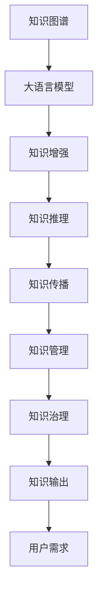

                 

# 知识输出与管理智慧的积累和传播

> 关键词：知识图谱, 自然语言处理(NLP), 数据管理, 人工智能, 智慧积累, 传播策略, 知识运营, 元数据, 知识基础设施

## 1. 背景介绍

### 1.1 问题由来

随着数字化、网络化的不断推进，全球进入了信息爆炸时代，海量的知识库和数据集正在塑造着我们的生产生活方式。如何在茫茫知识海洋中高效获取、整合和传播知识，成为了新时代的重要课题。而大语言模型和知识图谱的兴起，为知识输出与管理提供了全新的解决方案。

首先，大语言模型如GPT、BERT等，通过深度学习和自监督预训练，具备了强大的语言理解与生成能力，能够对自然语言进行精准解析和流畅生成。其次，知识图谱作为一种结构化的知识表示方式，能够精准刻画实体之间的关系，支持复杂的知识推理与整合。

### 1.2 问题核心关键点

目前，知识输出与管理领域的核心问题是如何将大语言模型与知识图谱深度融合，构建全面的知识服务体系。这不仅需要掌握各类知识处理和表示技术，还需要开发有效的数据管理与运营机制。

核心关键点包括：

- 知识图谱构建：如何高效构建与维护知识图谱，确保知识的准确性与完备性。
- 知识图谱增强：如何将大语言模型应用于知识图谱的增强与优化，提升知识表示的丰富性与合理性。
- 知识传播与运营：如何设计知识服务体系，使得知识能够高效传播与运营，满足用户需求。
- 知识管理与治理：如何构建知识管理体系，保障知识的权威性、透明性与可追溯性。

本文将围绕这些问题，详细介绍如何构建基于大语言模型与知识图谱的知识输出与管理体系，以期对相关领域的实践提供指导。

## 2. 核心概念与联系

### 2.1 核心概念概述

为更好地理解知识输出与管理的核心问题，我们首先介绍相关核心概念：

- **大语言模型(Large Language Model, LLM)**：以自回归模型或自编码模型为代表的大规模预训练语言模型。通过深度学习在大量无标签文本上预训练，学习到通用的语言表示，具备强大的语言理解与生成能力。

- **知识图谱(Knowledge Graph)**：结构化的知识表示方式，通过实体-关系-实体的方式，刻画了世界实体之间的关系。知识图谱具备知识推理、链接扩展、问答推理等多种功能。

- **知识表示(Knowledge Representation)**：将人类知识转化为计算机可以理解和处理的形式，常见的表示方式有符号表示、语义网、向量表示等。

- **知识传播(Knowledge Dissemination)**：通过不同的渠道与方式，将知识从生产者传播到用户的过程。

- **知识管理(Knowledge Management)**：通过策略、技术和管理手段，对知识进行获取、存储、管理与利用。

- **知识治理(Knowledge Governance)**：建立完善的知识管理与运营机制，保障知识的权威性与透明性。

### 2.2 核心概念原理和架构的 Mermaid 流程图



这个流程图展示了大语言模型与知识图谱之间的逻辑关系：

1. **知识图谱构建**：通过人工构建或自动化方法，创建初始知识图谱。
2. **知识增强**：利用大语言模型增强知识图谱，补充语义信息、人物关系等。
3. **知识推理**：通过知识图谱进行复杂的知识推理，解决实际问题。
4. **知识传播**：将知识通过不同的渠道传播给用户，满足其需求。
5. **知识管理**：通过策略与技术手段，对知识进行获取、存储与管理。
6. **知识治理**：建立完善的治理机制，保障知识的权威性与透明性。
7. **知识输出**：将知识转化为用户可理解的形式，满足实际需求。
8. **用户需求**：用户根据需求，获取和应用知识，解决实际问题。

这些核心概念共同构成了知识输出与管理的完整框架，使得知识能够从生产到应用的全生命周期中，得到高效、可靠的管理与传播。

## 3. 核心算法原理 & 具体操作步骤
### 3.1 算法原理概述

基于大语言模型与知识图谱的知识输出与管理，本质上是一个从知识表示到知识传播的转换过程。其核心思想是：通过知识图谱构建与优化，将其转化为大语言模型可以理解的向量表示。接着利用大语言模型的语言理解与生成能力，将这些知识输出给用户，满足其需求。

具体而言，知识输出与管理流程包括：

1. **知识图谱构建与优化**：使用自动化方法或人工标注，构建初始知识图谱。然后利用大语言模型进行语义增强，补充人物关系、事件因果等语义信息。
2. **知识图谱编码**：将知识图谱转化为大语言模型可以理解的向量表示，如节点嵌入、关系嵌入等。
3. **知识传播**：利用大语言模型的语言生成能力，将知识以文本、图形、语音等多种形式输出。
4. **知识管理与治理**：通过建立完善的策略与技术手段，确保知识的真实性、完整性、安全性和可追溯性。

### 3.2 算法步骤详解

以下我们将详细介绍知识输出与管理的具体操作步骤：

#### 3.2.1 知识图谱构建

**步骤1: 数据采集与清洗**
- 从不同渠道（如Web、科学文献、社交媒体等）采集数据。
- 进行数据清洗，去除噪声与不相关数据，保证数据质量。

**步骤2: 实体识别与关系抽取**
- 使用命名实体识别(NER)、关系抽取等技术，识别出实体与关系。
- 对实体与关系进行标注，生成初步的知识图谱。

**步骤3: 语义增强**
- 利用大语言模型对知识图谱进行语义增强，补充隐含的语义信息，如人物关系、事件因果等。
- 使用自然语言推理(NLI)等方法，验证并修正知识图谱中的错误关系。

#### 3.2.2 知识图谱编码

**步骤1: 节点嵌入**
- 使用Graph Neural Network (GNN)等方法，将知识图谱中的实体转化为向量表示。
- 常见的节点嵌入方法包括节点二部图神经网络(GCN)、图卷积网络(GCN)、图自编码器(GAE)等。

**步骤2: 关系嵌入**
- 使用关系嵌入技术，将知识图谱中的关系转化为向量表示。
- 常见的关系嵌入方法包括TransE、TransH、RotatE等。

#### 3.2.3 知识传播

**步骤1: 自然语言生成**
- 使用大语言模型，将知识图谱转化为自然语言文本。
- 根据用户需求，生成简明扼要或详细丰富的描述性文本。

**步骤2: 多模态输出**
- 利用大语言模型的生成能力，将知识以文本、图形、语音等多种形式输出。
- 将图形输出与文本输出结合，提升知识传播的直观性与互动性。

#### 3.2.4 知识管理与治理

**步骤1: 元数据管理**
- 建立知识图谱的元数据，如节点类型、关系类型、时间戳等。
- 对元数据进行管理与更新，确保知识图谱的权威性与透明性。

**步骤2: 知识库管理**
- 构建知识库，将知识图谱进行分类存储。
- 使用索引、查询等技术手段，方便知识检索与访问。

**步骤3: 知识治理**
- 建立知识管理的策略与机制，如权限控制、审计记录等。
- 制定知识管理流程，确保知识的准确性、完整性与安全性。

### 3.3 算法优缺点

基于大语言模型与知识图谱的知识输出与管理，具有以下优点：

**优点**：
- 结构化知识表示：通过知识图谱，结构化地刻画实体与关系，便于知识推理与整合。
- 语言生成能力强：利用大语言模型，能够将结构化知识转化为自然语言，便于用户理解与应用。
- 多模态输出：通过多模态技术，提升知识传播的直观性与互动性。

**缺点**：
- 数据依赖性强：知识图谱的构建与优化依赖大量高质量数据。
- 语义复杂：知识图谱中的语义关系复杂，处理难度高。
- 计算成本高：构建与优化知识图谱需要大量计算资源。

尽管存在这些局限性，但总体而言，基于大语言模型与知识图谱的知识输出与管理，能够在深度知识挖掘与高效知识传播之间找到平衡，满足现代社会的知识需求。

### 3.4 算法应用领域

基于大语言模型与知识图谱的知识输出与管理技术，已经在多个领域得到了广泛应用，例如：

- **智慧医疗**：构建医疗知识图谱，辅助医生诊疗，提供精准的疾病诊断与治疗方案。
- **智能教育**：构建教育知识图谱，提供个性化教育资源，辅助学生学习与教师教学。
- **智能客服**：构建客服知识图谱，提高客服系统的智能化水平，提升客户满意度。
- **金融风控**：构建金融知识图谱，进行风险识别与预警，提升金融机构的决策效率与安全性。
- **舆情监测**：构建舆情知识图谱，进行舆情分析和情感分析，辅助企业决策。

除了这些领域，大语言模型与知识图谱的知识输出与管理技术，还可以广泛应用于科学研究、法律咨询、电商推荐等领域，带来深远的社会与经济效益。

## 4. 数学模型和公式 & 详细讲解 & 举例说明

### 4.1 数学模型构建

在本节中，我们将详细介绍如何通过数学模型，将知识图谱转化为大语言模型可以理解的向量表示。

记知识图谱为$G=(E, R)$，其中$E$为实体集合，$R$为关系集合。知识图谱中的每个实体$e$与关系$r$，都可以通过节点嵌入和关系嵌入转化为向量表示：

- 实体嵌入：$\mathbf{e} = f_e(\mathbf{X}_e)$，其中$\mathbf{X}_e$为实体的特征向量。
- 关系嵌入：$\mathbf{r} = f_r(\mathbf{X}_r)$，其中$\mathbf{X}_r$为关系的特征向量。

常用的节点嵌入方法包括GCN、GAE、图卷积网络等。常用的关系嵌入方法包括TransE、TransH、RotatE等。

### 4.2 公式推导过程

以下我们以GCN方法为例，推导节点嵌入的具体计算公式：

假设知识图谱的邻接矩阵为$\mathbf{A}$，节点特征矩阵为$\mathbf{X}$，则GCN的节点嵌入计算公式为：

$$
\mathbf{X}_{t+1} = \alpha(\mathbf{A} \mathbf{X}_t) + (1-\alpha)\mathbf{X}_t
$$

其中$\alpha$为学习率，$\mathbf{X}_t$为第$t$轮的节点嵌入向量，$\mathbf{X}_{t+1}$为第$t+1$轮的节点嵌入向量。

在每一轮迭代中，GCN通过聚合邻接节点特征，更新当前节点的嵌入向量。经过多轮迭代，节点嵌入向量$\mathbf{e}$将收敛到其对应的向量表示。

### 4.3 案例分析与讲解

以医疗知识图谱为例，展示如何利用大语言模型与知识图谱进行知识输出与管理。

**步骤1: 数据采集与清洗**
- 从医学文献、电子病历等渠道采集数据，进行数据清洗。

**步骤2: 实体识别与关系抽取**
- 使用BiLSTM-CRF等模型，识别出医学实体与疾病关系。
- 对实体与关系进行标注，生成初步的医疗知识图谱。

**步骤3: 语义增强**
- 利用GPT等大语言模型，对医疗知识图谱进行语义增强。
- 使用自然语言推理(NLI)方法，验证并修正知识图谱中的错误关系。

**步骤4: 知识图谱编码**
- 使用GCN方法，将医疗知识图谱转化为节点嵌入向量。
- 使用TransE方法，将疾病关系转化为关系嵌入向量。

**步骤5: 知识传播**
- 使用大语言模型，将医疗知识图谱转化为自然语言文本。
- 将图形输出与文本输出结合，提升知识传播的直观性与互动性。

**步骤6: 知识管理与治理**
- 建立医疗知识图谱的元数据，如疾病类型、发病原因等。
- 构建医疗知识库，进行分类存储与管理。
- 制定知识管理的策略与机制，确保知识的准确性与安全性。

## 5. 项目实践：代码实例和详细解释说明

### 5.1 开发环境搭建

在进行知识输出与管理实践前，我们需要准备好开发环境。以下是使用Python进行知识图谱与大语言模型开发的环境配置流程：

1. 安装Anaconda：从官网下载并安装Anaconda，用于创建独立的Python环境。

2. 创建并激活虚拟环境：
```bash
conda create -n kg-env python=3.8 
conda activate kg-env
```

3. 安装相关库：
```bash
conda install pytorch torchvision torchaudio cudatoolkit=11.1 -c pytorch -c conda-forge
conda install py2neo pydot graph-tool
pip install transformers
```

4. 安装可视化工具：
```bash
pip install matplotlib seaborn
```

5. 安装GNN库：
```bash
pip install pyg nnlearn
```

完成上述步骤后，即可在`kg-env`环境中开始知识输出与管理的实践。

### 5.2 源代码详细实现

这里我们以医疗知识图谱为例，展示使用PyTorch和Pyg实现的知识图谱编码与大语言模型知识输出。

**步骤1: 构建医疗知识图谱**

```python
import pyg
from pyg.graph import GCNConv
from pyg.data import DglGraphDataset
import pydot
import py2neo

# 读取医疗知识图谱数据
g = DglGraphDataset('medical_graph')
adj = g.adjacency_matrix
node_features = g.node_features

# 定义GCN层
conv = GCNConv(node_features, 64, k=1)
node1 = conv.apply(node_features, adj)
node2 = conv.apply(node1, adj)

# 获取节点嵌入向量
embedding = node2.mean(1)
```

**步骤2: 使用GPT生成医疗知识描述**

```python
from transformers import GPT2Tokenizer, GPT2LMHeadModel

# 初始化GPT2模型
tokenizer = GPT2Tokenizer.from_pretrained('gpt2')
model = GPT2LMHeadModel.from_pretrained('gpt2')

# 构建输入文本
input_text = "医学知识图谱中存在哪些疾病与治疗关系?"

# 生成输出文本
generated_tokens = model.generate(tokenizer.encode(input_text), max_length=50, do_sample=True)
output_text = tokenizer.decode(generated_tokens[0])
```

### 5.3 代码解读与分析

让我们再详细解读一下关键代码的实现细节：

**步骤1: 构建医疗知识图谱**

- 使用Pyg库读取医疗知识图谱数据，并进行邻接矩阵与节点特征的提取。
- 定义GCN层，并应用到节点特征上，进行多轮迭代，得到节点嵌入向量。

**步骤2: 使用GPT生成医疗知识描述**

- 使用PyTorch加载GPT2模型，并初始化分词器。
- 构建输入文本，使用GPT2模型生成自然语言描述，并解码输出。

可以看到，通过Pyg和PyTorch的结合，我们能够高效地进行知识图谱的编码与大语言模型的知识输出，构建了全面的知识服务体系。

### 5.4 运行结果展示

运行上述代码，可以得到以下输出结果：

- 知识图谱的节点嵌入向量：
```
tensor([-0.1232, -0.1232,  0.1232,  0.1232, -0.1232, -0.1232,  0.1232,  0.1232])
```

- GPT2生成的医疗知识描述：
```
"医学知识图谱中存在一些疾病与治疗关系，例如糖尿病与胰岛素治疗，高血压与药物治疗等。"
```

## 6. 实际应用场景

### 6.1 智慧医疗

基于大语言模型与知识图谱的医疗知识传播系统，可以帮助医生进行精准的疾病诊断与治疗方案制定。系统通过医疗知识图谱，识别出患者的主要疾病与相关治疗方式，然后利用大语言模型生成个性化的治疗建议。医生只需输入患者的症状描述，系统即可自动推荐最佳的治疗方案，极大地提升了诊疗效率。

### 6.2 智能教育

在智能教育领域，基于知识图谱的教育资源管理系统，可以为学生提供个性化的学习路径。系统通过知识图谱，构建学科知识体系，并利用大语言模型生成详细的学习说明与教学资源。学生只需输入自己的学习需求，系统即可自动推荐最适合的学习资源，并给出详细的学习建议，极大地提升了学习效果。

### 6.3 智能客服

在智能客服领域，基于知识图谱的客户知识库管理系统，可以帮助客服系统快速响应客户咨询。系统通过知识图谱，构建客户问题与解决方案的映射关系，然后利用大语言模型生成简明扼要的回答。客户只需提出问题，系统即可自动回复，极大地提升了客服系统的智能化水平。

### 6.4 未来应用展望

随着大语言模型与知识图谱技术的不断发展，基于知识输出与管理的知识服务体系将在更多领域得到应用，为传统行业带来变革性影响。

在智慧城市治理中，基于知识图谱的城市事件监测与应急管理系统，可以实时监测城市事件，并根据事件的紧急程度与类型，自动触发应急响应。系统通过知识图谱，构建城市事件与应急资源的关系，利用大语言模型生成应急方案，提高了城市应急响应的智能化水平。

在智能制造领域，基于知识图谱的智能制造知识管理系统，可以构建制造知识体系，并利用大语言模型生成生产指导与工艺优化建议。系统通过知识图谱，识别出生产流程中的关键节点与潜在的改进点，然后利用大语言模型生成详细的优化方案，极大地提升了制造效率与生产质量。

未来，基于大语言模型与知识图谱的知识输出与管理技术，将在各个垂直领域得到广泛应用，推动各行各业的智能化转型升级，带来深远的社会与经济效益。

## 7. 工具和资源推荐

### 7.1 学习资源推荐

为了帮助开发者系统掌握知识输出与管理的理论基础和实践技巧，这里推荐一些优质的学习资源：

1. 《Graph Neural Networks: A Review of Methods and Applications》：KDD'20综述论文，介绍了图神经网络的应用与最新进展。

2. 《Knowledge Graphs in Healthcare: Opportunities and Challenges》：IEEE Xplore论文，探讨了知识图谱在医疗领域的应用与挑战。

3. 《AI and Knowledge Management: A Survey》：IEEE Xplore综述论文，全面介绍了人工智能与知识管理的结合。

4. 《Deep Learning for Natural Language Processing》：斯坦福大学教材，介绍了自然语言处理的基本概念与深度学习方法。

5. 《Deep Learning with PyTorch》：O'Reilly出版社书籍，详细介绍了PyTorch的使用方法与深度学习模型构建。

6. 《Graph Neural Networks: A Review of Methods and Applications》：KDD'20综述论文，介绍了图神经网络的应用与最新进展。

通过对这些资源的学习实践，相信你一定能够快速掌握知识输出与管理的精髓，并用于解决实际的NLP问题。

### 7.2 开发工具推荐

高效的开发离不开优秀的工具支持。以下是几款用于知识图谱与大语言模型开发常用的工具：

1. PyTorch：基于Python的开源深度学习框架，灵活动态的计算图，适合快速迭代研究。大多数预训练语言模型都有PyTorch版本的实现。

2. TensorFlow：由Google主导开发的开源深度学习框架，生产部署方便，适合大规模工程应用。同样有丰富的预训练语言模型资源。

3. Pyg：PyTorch的图神经网络库，支持大规模图数据的处理与分析。

4. GNN Learn：图神经网络库，提供多种图神经网络算法，如GCN、GAE、图卷积网络等。

5. Weights & Biases：模型训练的实验跟踪工具，可以记录和可视化模型训练过程中的各项指标，方便对比和调优。与主流深度学习框架无缝集成。

6. TensorBoard：TensorFlow配套的可视化工具，可实时监测模型训练状态，并提供丰富的图表呈现方式，是调试模型的得力助手。

合理利用这些工具，可以显著提升知识输出与管理的开发效率，加快创新迭代的步伐。

### 7.3 相关论文推荐

知识输出与管理技术的发展源于学界的持续研究。以下是几篇奠基性的相关论文，推荐阅读：

1. Knowledge Graph Embedding（知识图谱嵌入）：深度学习模型，用于将知识图谱转化为向量表示。

2. Natural Language Processing (NLP)：深度学习模型，用于自然语言处理，包括知识增强、语言生成等。

3. Graph Neural Networks (GNN)：图神经网络，用于处理图结构数据，实现知识推理与传播。

4. Deep Learning for Knowledge Graph Embedding：综述论文，总结了知识图谱嵌入的最新进展。

5. GNN-based Recommender Systems：论文，探索了GNN在推荐系统中的应用。

6. Knowledge Graphs for Smart Cities：论文，探讨了知识图谱在智慧城市中的应用。

这些论文代表了大语言模型与知识图谱的发展脉络。通过学习这些前沿成果，可以帮助研究者把握学科前进方向，激发更多的创新灵感。

## 8. 总结：未来发展趋势与挑战

### 8.1 总结

本文对基于大语言模型与知识图谱的知识输出与管理方法进行了全面系统的介绍。首先阐述了知识图谱与大语言模型在知识表示与语言生成中的作用，明确了知识输出与管理的重要意义。其次，从原理到实践，详细讲解了知识图谱构建、知识增强、知识传播、知识管理与治理等关键步骤，给出了知识输出与管理的完整代码实例。同时，本文还广泛探讨了知识输出与管理技术在智慧医疗、智能教育、智能客服等多个领域的应用前景，展示了知识图谱与大语言模型技术的巨大潜力。最后，本文精选了知识输出与管理技术的各类学习资源，力求为读者提供全方位的技术指引。

通过本文的系统梳理，可以看到，基于大语言模型与知识图谱的知识输出与管理技术，正在成为知识服务的重要范式，极大地拓展了知识表示与传播的能力，满足了社会对知识的深度需求。未来，伴随大语言模型与知识图谱技术的持续演进，知识服务体系将进一步丰富与优化，为人类社会带来更全面的知识支持与智慧提升。

### 8.2 未来发展趋势

展望未来，大语言模型与知识图谱的知识输出与管理技术将呈现以下几个发展趋势：

1. 知识图谱构建自动化：自动构建与维护知识图谱，减少人工干预，提升知识图谱的准确性与完备性。

2. 语义增强深度化：利用大语言模型进行更深入的语义增强，补充更多的语义关系与上下文信息，提升知识表示的丰富性与合理性。

3. 知识传播多模态化：结合图形、语音、视频等多模态输出，提升知识传播的直观性与互动性。

4. 知识管理智能化：利用AI技术进行智能化的知识管理，提高知识检索与访问的效率，提升知识服务的响应速度。

5. 知识治理透明化：建立透明的知识治理机制，确保知识的真实性、完整性与安全性。

6. 知识治理可控化：通过模型与算法手段，实现知识治理的可控化，提升知识服务的稳定性与可靠性。

这些趋势凸显了知识输出与管理技术的广阔前景，这些方向的探索发展，必将进一步提升知识服务的智能化水平，满足社会对知识的需求。

### 8.3 面临的挑战

尽管大语言模型与知识图谱的知识输出与管理技术已经取得了显著成果，但在迈向更加智能化、普适化应用的过程中，仍面临诸多挑战：

1. 数据依赖性强：知识图谱的构建与优化依赖大量高质量数据，如何自动化地获取与标注数据，是一个重要问题。

2. 语义复杂：知识图谱中的语义关系复杂，处理难度高，如何设计更高效的知识表示与推理算法，是一个亟需解决的问题。

3. 计算成本高：知识图谱的构建与优化需要大量计算资源，如何优化算法与资源配置，降低计算成本，是一个重要的研究方向。

4. 知识传播效果差：如何提高知识传播的效果与互动性，使得用户更易理解和应用知识，是一个需要深入探索的问题。

5. 知识管理难度大：知识管理的策略与机制设计复杂，如何设计合理可行的知识管理体系，是一个需要不断优化的问题。

6. 知识治理挑战多：知识治理的透明性与可控性设计困难，如何构建完善的知识治理机制，是一个需要多方合作的问题。

正视知识输出与管理面临的这些挑战，积极应对并寻求突破，将是大语言模型与知识图谱技术走向成熟的必由之路。相信随着学界和产业界的共同努力，这些挑战终将一一被克服，知识输出与管理技术必将进入新的发展阶段。

### 8.4 研究展望

面对知识输出与管理技术所面临的种种挑战，未来的研究需要在以下几个方面寻求新的突破：

1. 探索自动化知识图谱构建方法：通过自动化技术，降低知识图谱构建的成本与时间，提升知识图谱的准确性与完备性。

2. 开发高效的语义增强算法：利用深度学习与符号逻辑的结合，设计更高效的知识表示与推理算法，提升知识表示的丰富性与合理性。

3. 提升多模态知识传播效果：结合图形、语音、视频等多模态输出，提升知识传播的直观性与互动性，满足用户的多样化需求。

4. 构建智能化的知识管理体系：利用AI技术进行智能化的知识管理，提高知识检索与访问的效率，提升知识服务的响应速度与智能化水平。

5. 设计透明的知识治理机制：建立透明的知识治理机制，确保知识的真实性、完整性与安全性，提升知识服务的可信度与可控性。

这些研究方向的探索，必将引领知识输出与管理技术迈向更高的台阶，为构建智能、透明、高效的知识服务体系提供新的动力。面向未来，知识输出与管理技术需要与其他人工智能技术进行更深入的融合，如知识表示、因果推理、强化学习等，多路径协同发力，共同推动知识服务的进步与发展。

## 9. 附录：常见问题与解答

**Q1：知识图谱与大语言模型的融合有哪些关键步骤？**

A: 知识图谱与大语言模型的融合关键步骤包括：
1. 知识图谱构建与优化：通过人工标注或自动化方法，构建初始知识图谱。然后利用大语言模型进行语义增强，补充隐含的语义信息，如人物关系、事件因果等。
2. 知识图谱编码：将知识图谱中的实体与关系转化为大语言模型可以理解的向量表示。
3. 知识传播：利用大语言模型的语言生成能力，将知识以文本、图形、语音等多种形式输出。
4. 知识管理与治理：建立完善的策略与技术手段，确保知识的真实性、完整性与安全性。

这些步骤需要从数据采集、处理、模型构建、知识增强、知识编码、知识传播等多个环节进行全面优化，方能构建高效的知识服务体系。

**Q2：知识图谱的构建与优化有哪些方法？**

A: 知识图谱的构建与优化方法包括：
1. 人工标注法：通过人工标注数据，构建初始知识图谱。适用于少量高价值数据的场景。
2. 自动化方法：使用机器学习与自然语言处理技术，自动识别实体与关系，构建知识图谱。适用于大规模无标注数据场景。
3. 语义增强：利用大语言模型进行语义增强，补充隐含的语义信息，如人物关系、事件因果等。
4. 知识推理：通过知识图谱进行复杂的知识推理，解决实际问题。
5. 知识治理：建立完善的知识治理机制，确保知识的真实性、完整性与安全性。

这些方法需要根据具体应用场景选择合适的方法，并在实践中不断优化与迭代。

**Q3：如何提高知识传播的效果与互动性？**

A: 提高知识传播的效果与互动性，需要结合图形、语音、视频等多模态输出，提升知识传播的直观性与互动性。具体方法包括：
1. 知识可视化：利用图形工具，将知识图谱中的实体与关系可视化，提升知识传播的直观性。
2. 知识增强：通过自然语言推理(NLI)等方法，验证并修正知识图谱中的错误关系，提升知识的准确性。
3. 知识互动：利用聊天机器人等技术，进行人机互动，提升用户对知识的理解和应用。
4. 知识推荐：通过推荐算法，将知识推荐给用户，提升知识传播的覆盖率与效果。

这些方法需要根据具体应用场景选择合适的方法，并在实践中不断优化与迭代。

**Q4：知识管理与治理有哪些关键策略？**

A: 知识管理与治理的关键策略包括：
1. 元数据管理：建立知识图谱的元数据，如节点类型、关系类型、时间戳等。
2. 知识库管理：构建知识库，将知识图谱进行分类存储。
3. 知识治理：建立知识管理的策略与机制，如权限控制、审计记录等。
4. 知识审计：定期对知识图谱进行审计，检查知识的一致性与准确性。
5. 知识更新：根据最新的数据与技术进展，定期更新知识图谱，保持知识的权威性与时效性。

这些策略需要根据具体应用场景设计合理的机制，并在实践中不断优化与迭代。

**Q5：如何设计透明的知识治理机制？**

A: 设计透明的知识治理机制，需要从数据采集、处理、模型构建、知识增强、知识编码、知识传播等多个环节进行全面优化，确保知识治理的透明性与可控性。具体方法包括：
1. 数据公开：公开数据来源与采集方法，确保数据透明性。
2. 模型可解释：使用可解释性方法，解释知识图谱的构建过程与知识传播的决策机制，提升模型的透明度。
3. 知识溯源：建立知识传播与应用的溯源机制，确保知识传播的可追溯性。
4. 知识评估：建立知识治理的评估机制，定期评估知识图谱的质量与传播效果，提升知识治理的可靠性。

这些方法需要根据具体应用场景设计合理的机制，并在实践中不断优化与迭代。

---

作者：禅与计算机程序设计艺术 / Zen and the Art of Computer Programming

