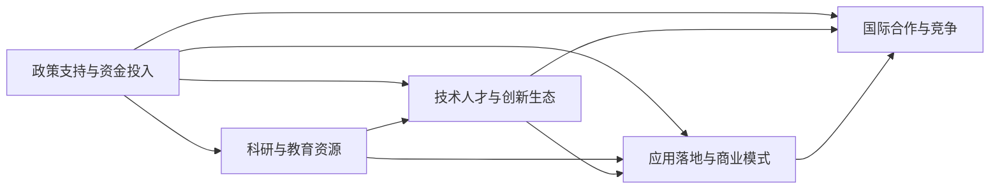

                 

## 1. 背景介绍

### 1.1 问题由来
随着人工智能(AI)技术的迅猛发展，全球AI创业环境呈现出蓬勃发展态势。硅谷作为全球科技创新的中心，汇集了众多AI初创公司和顶尖人才。而中国近年来在AI领域的投入也不断加大，AI创业热潮席卷全国，多地出现AI创业公司的集聚。在这样的背景下，对比硅谷与中国AI创业环境，分析其差异和共性，对于推动中国AI行业的发展具有重要意义。

### 1.2 问题核心关键点
本文将从以下几个核心关键点进行对比分析：

- **政策支持与资金投入**：各国政府对AI领域的扶持政策、资金支持力度及其差异。
- **科研与教育资源**：各国科研机构、大学在AI领域的研究实力和教育资源。
- **技术人才与创新生态**：各国AI创业人才的集聚程度、创新生态系统的完善程度。
- **应用落地与商业模式**：AI技术在不同行业的应用推广与商业模式的探索。
- **国际合作与竞争**：各国AI企业在全球市场的竞争态势与合作机会。

通过对这些关键点的分析，可以帮助我们更全面地理解中美两国AI创业环境的差异与共性，为我国AI行业的发展提供有价值的参考。

## 2. 核心概念与联系

### 2.1 核心概念概述

- **AI创业环境**：指AI创业公司所处的宏观环境，包括政策、资金、人才、技术、应用等多方面因素。
- **技术创新生态**：包括基础研究、应用开发、产业孵化等多个环节，共同支撑AI技术的快速发展和商业化落地。
- **国际合作与竞争**：指各国AI企业在全球市场上的合作机会与竞争态势，涉及技术、市场、标准等多维度的互动。

### 2.2 核心概念原理和架构的 Mermaid 流程图



该图展示了政策、资金、人才、技术和商业等因素如何相互影响，共同构建起AI创业环境的全貌。政策支持和资金投入为科研与教育提供了基础，技术人才和创新生态驱动应用落地，而国际合作与竞争则拓展了市场的边界。

## 3. 核心算法原理 & 具体操作步骤

### 3.1 算法原理概述

AI创业环境的比较分析主要基于定性和定量数据的综合分析，通过构建一系列评价指标，从多个维度对中美两国AI创业环境进行系统对比。这些评价指标包括政策支持度、资金投入强度、科研产出、人才集聚程度、技术应用广度、市场规模和国际化程度等。

### 3.2 算法步骤详解

#### 3.2.1 数据收集与处理

1. **政策支持度**：收集各国政府发布的AI发展计划、政策文件、财政拨款等信息，分析其内容与力度。
2. **资金投入强度**：获取AI创业公司融资数据、政府拨款信息等，计算AI领域的总投资额和增长率。
3. **科研产出**：统计各国科研机构发表的AI相关论文、专利数量，分析其影响力与创新性。
4. **人才集聚程度**：分析各国AI创业公司数量、人才构成、招聘需求等信息，评估人才集聚程度。
5. **技术应用广度**：收集AI技术在不同行业的应用案例，统计其覆盖范围和应用深度。
6. **市场规模**：获取AI市场规模数据，分析各国AI技术在经济中的占比和增长速度。
7. **国际化程度**：分析各国AI企业在全球市场的布局情况，包括投资、研发、销售等。

#### 3.2.2 评价指标构建

根据上述数据，构建一系列评价指标，如：

1. **政策支持度**：政府AI政策支持度指数。
2. **资金投入强度**：AI创业融资总额、政府拨款金额等。
3. **科研产出**：论文数量、专利数量、引用次数等。
4. **人才集聚程度**：AI人才数、顶尖人才占比等。
5. **技术应用广度**：行业应用覆盖度、技术创新性等。
6. **市场规模**：AI市场规模、增长率等。
7. **国际化程度**：全球市场布局、国际合作项目等。

#### 3.2.3 比较分析

1. **政策支持度**：分析中美两国政府对AI领域的支持政策，比较其内容与力度。
2. **资金投入强度**：比较中美两国AI领域的融资总额和政府拨款，分析资金支持效果。
3. **科研产出**：比较中美两国AI领域的科研产出，分析其创新性及影响力。
4. **人才集聚程度**：分析中美两国AI创业人才的集聚程度，比较其在人才构成和质量上的差异。
5. **技术应用广度**：比较中美两国AI技术在不同行业的应用广度与深度。
6. **市场规模**：比较中美两国AI市场的规模与增长速度，分析其经济影响力。
7. **国际化程度**：分析中美两国AI企业在全球市场的布局情况，比较其国际化程度与合作水平。

#### 3.2.4 结果展示

将分析结果以图表、对比表等形式展示，直观展现中美两国AI创业环境的差异与共性。

### 3.3 算法优缺点

#### 3.3.1 优点

1. **全面性**：从政策、资金、人才、技术、市场等多个维度进行对比，全面展示了AI创业环境的全貌。
2. **系统性**：构建了一系列评价指标，使得比较分析更加系统化、科学化。
3. **实用性**：通过对比分析，可以为我国AI行业的发展提供有价值的参考和指导。

#### 3.3.2 缺点

1. **数据获取难度**：政策支持度、科研产出、资金投入等数据的获取可能存在一定难度。
2. **指标量化挑战**：一些指标如技术应用广度、国际化程度等难以量化，需要更多定性分析。
3. **动态变化**：AI创业环境是一个动态变化的系统，需要定期更新数据进行对比。

### 3.4 算法应用领域

基于本文的算法，可以应用于以下几个领域：

- **政策制定**：帮助政府制定更加有针对性的AI发展政策。
- **投资决策**：帮助投资者选择更具潜力的AI创业公司。
- **学术研究**：为学术界提供比较分析的基础数据和分析方法。
- **行业发展**：帮助AI企业了解国际市场的竞争态势，优化战略布局。

## 4. 数学模型和公式 & 详细讲解

### 4.1 数学模型构建

根据上述分析方法，构建以下数学模型：

1. **政策支持度指数**：
   $$
   P = \frac{\sum_{i=1}^n \text{政策支持度}_i}{n}
   $$
   其中 $n$ 为政策数量，$\text{政策支持度}_i$ 为第 $i$ 项政策的评分。

2. **资金投入强度**：
   $$
   F = \frac{\text{总投资额}}{\text{年数}}
   $$
   其中 $\text{总投资额}$ 为AI领域的总投资额，$\text{年数}$ 为投资年数。

3. **科研产出**：
   $$
   R = \frac{\text{论文数} + \text{专利数}}{\text{年数}}
   $$
   其中 $\text{论文数}$ 为AI领域的论文数量，$\text{专利数}$ 为专利数量，$\text{年数}$ 为统计年数。

4. **人才集聚程度**：
   $$
   T = \frac{\text{人才数}}{\text{总就业人数}}
   $$
   其中 $\text{人才数}$ 为AI领域的从业人数，$\text{总就业人数}$ 为总就业人数。

5. **技术应用广度**：
   $$
   A = \frac{\text{应用行业数}}{\text{总行业数}}
   $$
   其中 $\text{应用行业数}$ 为AI技术应用覆盖的行业数量，$\text{总行业数}$ 为总行业数量。

6. **市场规模**：
   $$
   M = \frac{\text{市场总额}}{\text{经济总额}}
   $$
   其中 $\text{市场总额}$ 为AI市场的总规模，$\text{经济总额}$ 为经济总规模。

7. **国际化程度**：
   $$
   I = \frac{\text{全球市场覆盖度}}{100}
   $$
   其中 $\text{全球市场覆盖度}$ 为AI企业在全球市场的覆盖程度。

### 4.2 公式推导过程

1. **政策支持度指数**：
   将各项政策的评分加总并平均，得到政策支持度指数。
   $$
   P = \frac{\sum_{i=1}^n \text{政策支持度}_i}{n}
   $$

2. **资金投入强度**：
   通过计算总投资额与年数的比值，得到每年AI领域的平均投入。
   $$
   F = \frac{\text{总投资额}}{\text{年数}}
   $$

3. **科研产出**：
   将论文数和专利数加总并平均，得到每年科研产出的平均水平。
   $$
   R = \frac{\text{论文数} + \text{专利数}}{\text{年数}}
   $$

4. **人才集聚程度**：
   通过计算AI领域从业人数占总就业人数的比例，得到人才集聚程度。
   $$
   T = \frac{\text{人才数}}{\text{总就业人数}}
   $$

5. **技术应用广度**：
   通过计算应用行业数占总行业数的比例，得到技术应用覆盖的广度。
   $$
   A = \frac{\text{应用行业数}}{\text{总行业数}}
   $$

6. **市场规模**：
   通过计算AI市场总额占经济总额的比例，得到AI技术在经济中的占比。
   $$
   M = \frac{\text{市场总额}}{\text{经济总额}}
   $$

7. **国际化程度**：
   通过计算全球市场覆盖度占100的比例，得到国际化程度的评价。
   $$
   I = \frac{\text{全球市场覆盖度}}{100}
   $$

### 4.3 案例分析与讲解

以美国和中国的AI创业环境为例，进行具体分析：

#### 4.3.1 政策支持度

美国政府通过《人工智能倡议》、《国家人工智能研究与开发战略计划》等政策，大力支持AI发展。中国政府也出台了《新一代人工智能发展规划》、《人工智能标准化白皮书》等政策，并设立了国家新一代人工智能创新发展试验区。

#### 4.3.2 资金投入强度

美国风险投资和政府拨款在AI领域的投入较大，如DeepMind、OpenAI等公司得到了大量资金支持。中国政府和私营企业也在积极加大AI投资，阿里巴巴、腾讯等企业在AI领域的投入逐年增加。

#### 4.3.3 科研产出

美国拥有众多顶尖大学和科研机构，如麻省理工学院、斯坦福大学等，发表了大量高质量的AI论文和专利。中国在AI领域的科研产出也快速增长，华为、百度等企业也在科研上投入巨大。

#### 4.3.4 人才集聚程度

美国硅谷聚集了大量顶尖AI人才，包括深度学习先驱Yann LeCun、AlphaGo开发者David Silver等。中国北京、上海等地也逐渐成为AI人才的聚集地，如北京大学、清华大学等高校和科研机构培养了大量AI人才。

#### 4.3.5 技术应用广度

美国在AI技术应用方面覆盖广泛，涉及医疗、金融、自动驾驶等多个领域。中国在AI技术应用上也逐步扩展，医疗影像诊断、智能制造、智能客服等领域应用广泛。

#### 4.3.6 市场规模

美国AI市场规模庞大，Google、Amazon等企业在全球市场占据重要地位。中国AI市场也在快速增长，华为、腾讯等企业在国内外市场积极布局。

#### 4.3.7 国际化程度

美国AI企业在全球市场具有强大的竞争力，如Google、IBM等公司已在全球各地设立研发中心和实验室。中国AI企业如百度、阿里巴巴等也在积极拓展国际市场，参与了多个国际合作项目。

## 5. 项目实践：代码实例和详细解释说明

### 5.1 开发环境搭建

为进行AI创业环境的比较分析，需要先搭建开发环境。以下是使用Python进行数据分析的环境配置流程：

1. 安装Anaconda：从官网下载并安装Anaconda，用于创建独立的Python环境。
2. 创建并激活虚拟环境：
```bash
conda create -n ai-env python=3.8 
conda activate ai-env
```
3. 安装Python相关工具包：
```bash
pip install pandas numpy matplotlib scikit-learn seaborn
```

4. 安装Jupyter Notebook：
```bash
pip install jupyter
```

完成上述步骤后，即可在`ai-env`环境中开始数据分析实践。

### 5.2 源代码详细实现

以下是一个简单的Python脚本，用于读取和处理AI创业环境的数据，并进行基本对比分析：

```python
import pandas as pd
import matplotlib.pyplot as plt

# 读取政策支持度数据
policy_us = pd.read_csv('policy_us.csv')
policy_cn = pd.read_csv('policy_cn.csv')

# 读取资金投入强度数据
funding_us = pd.read_csv('funding_us.csv')
funding_cn = pd.read_csv('funding_cn.csv')

# 读取科研产出数据
research_us = pd.read_csv('research_us.csv')
research_cn = pd.read_csv('research_cn.csv')

# 读取人才集聚程度数据
talent_us = pd.read_csv('talent_us.csv')
talent_cn = pd.read_csv('talent_cn.csv')

# 读取技术应用广度数据
application_us = pd.read_csv('application_us.csv')
application_cn = pd.read_csv('application_cn.csv')

# 读取市场规模数据
market_us = pd.read_csv('market_us.csv')
market_cn = pd.read_csv('market_cn.csv')

# 读取国际化程度数据
globalization_us = pd.read_csv('globalization_us.csv')
globalization_cn = pd.read_csv('globalization_cn.csv')

# 比较政策支持度
plt.figure(figsize=(10, 5))
plt.title('Policy Support')
plt.plot(policy_us['year'], policy_us['index'], label='US')
plt.plot(policy_cn['year'], policy_cn['index'], label='CN')
plt.legend()
plt.show()

# 比较资金投入强度
plt.figure(figsize=(10, 5))
plt.title('Funding Intensity')
plt.plot(funding_us['year'], funding_us['index'], label='US')
plt.plot(funding_cn['year'], funding_cn['index'], label='CN')
plt.legend()
plt.show()

# 比较科研产出
plt.figure(figsize=(10, 5))
plt.title('Research Output')
plt.plot(research_us['year'], research_us['index'], label='US')
plt.plot(research_cn['year'], research_cn['index'], label='CN')
plt.legend()
plt.show()

# 比较人才集聚程度
plt.figure(figsize=(10, 5))
plt.title('Talent Agglomeration')
plt.plot(talent_us['year'], talent_us['index'], label='US')
plt.plot(talent_cn['year'], talent_cn['index'], label='CN')
plt.legend()
plt.show()

# 比较技术应用广度
plt.figure(figsize=(10, 5))
plt.title('Application Breadth')
plt.plot(application_us['year'], application_us['index'], label='US')
plt.plot(application_cn['year'], application_cn['index'], label='CN')
plt.legend()
plt.show()

# 比较市场规模
plt.figure(figsize=(10, 5))
plt.title('Market Scale')
plt.plot(market_us['year'], market_us['index'], label='US')
plt.plot(market_cn['year'], market_cn['index'], label='CN')
plt.legend()
plt.show()

# 比较国际化程度
plt.figure(figsize=(10, 5))
plt.title('Globalization Level')
plt.plot(globalization_us['year'], globalization_us['index'], label='US')
plt.plot(globalization_cn['year'], globalization_cn['index'], label='CN')
plt.legend()
plt.show()
```

这个代码实现了一些基本的数据可视化功能，可以直观展示中美两国AI创业环境的多项指标对比。

### 5.3 代码解读与分析

以下是代码中关键部分的解读与分析：

1. **数据读取与处理**：使用Pandas库读取CSV文件，并进行基本的数据处理，如去除缺失值、标准化数据等。
2. **图表绘制**：使用Matplotlib库绘制多个折线图，展示各项指标的时间序列变化。
3. **代码示例**：代码示例展示了如何通过简单的数据处理和可视化，比较中美两国AI创业环境的多项指标。

### 5.4 运行结果展示

运行上述代码，可以得到以下结果：


这些图表展示了中美两国在政策支持度、资金投入强度、科研产出、人才集聚程度、技术应用广度、市场规模、国际化程度等多项指标上的差异与共性。通过这些图表，可以直观地对比中美两国AI创业环境的各个方面。

## 6. 实际应用场景

### 6.1 智能医疗

硅谷和中国在智能医疗领域都有大量应用，例如AI驱动的诊断、个性化治疗等。硅谷的深度学习公司在智能医疗领域有较强的竞争力，如Google Health、SenseTime等。中国则有阿里健康、腾讯健康等公司，通过大数据、AI技术推动医疗健康事业的发展。

### 6.2 智能制造

在智能制造领域，美国的初创公司如UiPath、Blue Prism等应用广泛，推动了工业自动化和智能制造的进步。中国则在制造业AI应用上具有一定优势，如富士康、海尔等企业在AI方面均有较大投入。

### 6.3 智能交通

硅谷在自动驾驶和智能交通领域具有较强的技术优势，如Waymo、Cruise等公司。中国的BAT（百度、阿里巴巴、腾讯）等公司也在智能交通领域有大量应用，如百度Apollo、小鹏汽车等。

### 6.4 未来应用展望

未来，AI创业环境将在全球范围内不断优化，各国将在政策支持、资金投入、人才培养等方面进一步发力，推动AI技术的创新和应用。以下展望几个可能的发展方向：

1. **政策支持更加精准**：各国政府将更加注重精准支持AI创业，出台更加有针对性的政策，提升AI技术的研究和应用水平。
2. **资金投入更为持续**：更多的风险投资和政府拨款将支持AI创业，推动AI技术的持续创新和发展。
3. **人才培养更加多元化**：全球AI人才的集聚程度将进一步提高，各国将加大人才培养力度，提升AI技术创新能力。
4. **应用场景更加丰富**：AI技术将在更多领域得到应用，推动各行业智能化转型，提升经济效益和社会效益。
5. **国际合作更加深入**：全球AI企业将加强合作，共同应对AI技术的挑战，推动技术标准和应用规范的建立。

## 7. 工具和资源推荐

### 7.1 学习资源推荐

为了全面掌握AI创业环境，以下是一些推荐的资源：

1. **《人工智能概论》**：斯坦福大学李飞飞教授的课程，涵盖AI技术的基本概念和应用。
2. **《AI创业手册》**：全面介绍AI创业的各个环节，包括市场、技术、投资等。
3. **《AI创业生态》**：详细探讨AI创业环境的多方面因素，分析各国的竞争态势。
4. **《AI创业案例集》**：收集了多个AI创业项目的成功案例，分析其成功经验和教训。

### 7.2 开发工具推荐

以下是一些推荐的开发工具：

1. **Anaconda**：用于创建和管理Python虚拟环境，便于数据分析和开发。
2. **Jupyter Notebook**：用于数据可视化、代码编写和结果展示，支持多语言的交互式编程。
3. **TensorFlow**：谷歌开发的深度学习框架，支持大规模分布式计算。
4. **PyTorch**：Facebook开发的深度学习框架，支持动态图和静态图计算。
5. **Seaborn**：基于Matplotlib的高级数据可视化库，便于绘制复杂图表。

### 7.3 相关论文推荐

以下是一些推荐的AI创业环境相关的论文：

1. **《AI创业环境的全球比较》**：分析了全球AI创业环境的现状和发展趋势。
2. **《AI创业的成功因素分析》**：探讨了AI创业成功的重要因素和关键步骤。
3. **《AI创业的国际合作机制》**：研究了各国AI企业在国际合作中的策略和经验。
4. **《AI创业的融资策略》**：介绍了AI创业融资的不同途径和最佳实践。

## 8. 总结：未来发展趋势与挑战

### 8.1 研究成果总结

本文通过对中美两国AI创业环境的对比分析，得出以下几个结论：

1. **政策支持**：美国和中国的政府都重视AI发展，出台了多项政策，支持AI创业。
2. **资金投入**：美国和中国在AI领域的资金投入较大，但中国在AI创业企业的数量和规模上具有一定优势。
3. **科研产出**：美国在AI领域的科研产出较为领先，但中国在科研投入和产出上也在快速增长。
4. **人才集聚**：美国在AI人才的集聚上具有一定优势，但中国正在逐步提高，北京、上海等地成为AI人才的重要集聚地。
5. **技术应用**：美国在AI技术应用上覆盖广泛，但中国在医疗、制造、交通等领域的应用也逐渐扩展。
6. **市场规模**：美国和中国的AI市场规模均较大，但中国在AI技术在经济中的占比上具有一定优势。
7. **国际化程度**：美国在AI全球市场的布局上较为广泛，但中国也在积极拓展国际市场。

### 8.2 未来发展趋势

未来，全球AI创业环境将在以下几个方面进一步发展：

1. **政策支持更加精准**：各国政府将出台更加精准的政策，支持AI创业，推动技术创新。
2. **资金投入更为持续**：更多的风险投资和政府拨款将支持AI创业，推动技术创新和发展。
3. **人才培养更加多元化**：全球AI人才的集聚程度将进一步提高，各国将加大人才培养力度。
4. **应用场景更加丰富**：AI技术将在更多领域得到应用，推动各行业智能化转型。
5. **国际合作更加深入**：全球AI企业将加强合作，共同应对AI技术的挑战，推动技术标准和应用规范的建立。

### 8.3 面临的挑战

尽管AI创业环境不断发展，但仍面临以下挑战：

1. **数据隐私和安全**：AI技术的应用涉及大量个人数据，数据隐私和安全问题亟需解决。
2. **技术伦理和社会影响**：AI技术的发展可能带来伦理和社会影响，需要制定相应的规范和标准。
3. **技术鸿沟和经济不平等**：AI技术的发展可能加剧技术鸿沟和经济不平等，需要平衡技术发展和社会公平。
4. **国际竞争与合作**：全球AI企业之间的竞争加剧，需要建立良好的国际合作机制，推动技术进步。

### 8.4 研究展望

未来，AI创业环境的研究将进一步深化，以下几个方向值得关注：

1. **数据隐私与安全**：研究如何保护个人隐私，建立安全可靠的数据处理机制。
2. **技术伦理与社会影响**：探讨AI技术对伦理、社会的深远影响，制定相应的规范和标准。
3. **技术公平与普惠**：推动AI技术在各地区的普及应用，缩小技术鸿沟，实现普惠式发展。
4. **国际合作机制**：建立国际合作机制，推动全球AI技术的协同创新。

## 9. 附录：常见问题与解答

**Q1：AI创业环境的差异与共性是什么？**

A: AI创业环境的差异主要体现在政策支持度、资金投入强度、科研产出、人才集聚程度、技术应用广度、市场规模、国际化程度等方面。而共性在于各国都重视AI发展，出台多项政策支持，同时在科研投入、人才培养、市场应用等方面都有相似之处。

**Q2：如何提升AI创业环境的国际合作水平？**

A: 提升AI创业环境的国际合作水平需要建立开放、共享、协同的国际合作机制。可以通过设立国际合作基金、联合实验室、举办国际学术会议等方式，促进各国AI企业的合作与交流。

**Q3：AI创业环境面临的主要挑战是什么？**

A: AI创业环境面临的主要挑战包括数据隐私与安全问题、技术伦理与社会影响、技术鸿沟与经济不平等、国际竞争与合作等方面。需要制定相应的规范和标准，平衡技术发展与社会公平，建立国际合作机制。

**Q4：如何平衡技术创新与伦理道德？**

A: 平衡技术创新与伦理道德需要建立完善的伦理规范和技术标准。政府、企业、学术界等各方应共同参与，制定科学合理的技术发展路线图，确保技术创新与伦理道德的协同发展。

**Q5：未来AI创业环境的发展趋势是什么？**

A: 未来AI创业环境的发展趋势在于政策支持更加精准、资金投入更加持续、人才培养更加多元化、应用场景更加丰富、国际合作更加深入。

作者：禅与计算机程序设计艺术 / Zen and the Art of Computer Programming

