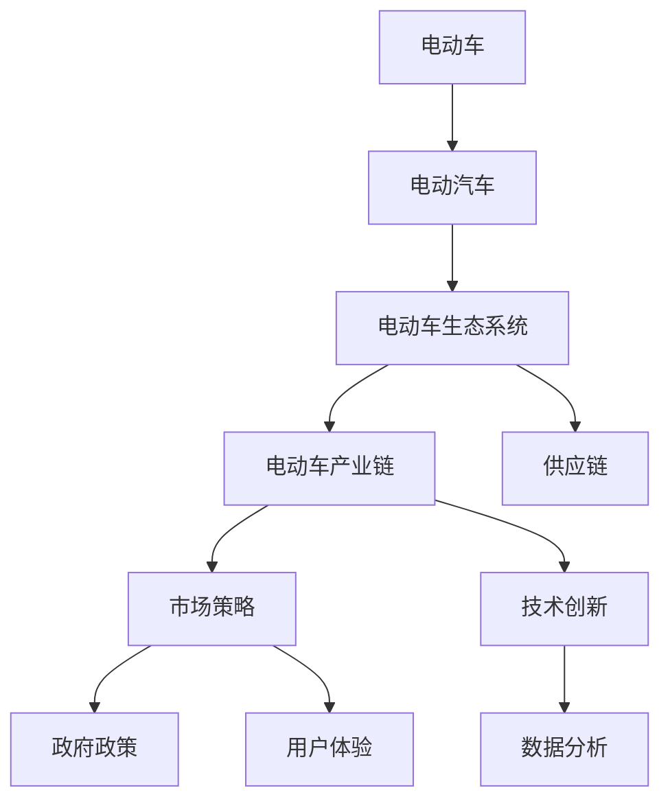

                 

# 硅谷新能源汽车竞争:电动车生态系统

> 关键词：硅谷,电动车,生态系统,竞争,技术创新,供应链,市场策略,政府政策

## 1. 背景介绍

### 1.1 问题由来
硅谷，作为全球科技创新的中心，一直引领着技术前沿的潮流。近年来，随着环境污染和能源危机的日益严重，新能源汽车（Electric Vehicles, EVs）成为全球科技公司竞相布局的新战场。特斯拉(Tesla)作为电动汽车行业的领军企业，以其高效的电池技术和无人驾驶技术，成为电动车领域的一支重要力量。然而，包括传统汽车巨头和新兴科技公司在内的各方势力，都试图在这一领域分一杯羹。这场电动车生态系统的竞争，既是一场技术比拼，也是一场战略较量。

### 1.2 问题核心关键点
硅谷电动车生态系统竞争的核心关键点包括：

1. **技术创新：** 如何开发更高效的电池、电机、电控系统，提升电动车续航能力和安全性。
2. **供应链管理：** 如何构建高效稳定的供应链，确保原材料、零部件和成品的及时供应。
3. **市场策略：** 如何在全球市场推广电动车，特别是在消费者认知度较低的地区。
4. **政府政策：** 如何与各国政府合作，争取有利政策支持，如补贴、税收优惠等。
5. **数据驱动：** 如何通过数据分析，精准定位目标市场，制定更加有效的市场策略。
6. **用户体验：** 如何提升用户体验，如充电设施的建设、续航里程的延长、充电速度的提升等。

这些关键点共同构成了硅谷电动车生态系统竞争的复杂性，使得技术、市场和政策等各个方面都需要协同合作，才能取得胜利。

## 2. 核心概念与联系

### 2.1 核心概念概述

为更好地理解硅谷电动车生态系统的竞争态势，本节将介绍几个密切相关的核心概念：

- **电动车(Electric Vehicle, EV):** 使用电力驱动的车辆，通常搭载锂离子电池等高效能量存储设备。
- **电动汽车(Electric Automotive Vehicle, EV-AV):** 作为交通工具的电动车。
- **电动车生态系统(Electric Vehicle Ecosystem):** 包括电池制造、零部件供应、车辆生产、充电基础设施、售后服务等环节，形成了一个完整的电动车产业链。
- **电动车产业链:** 从原材料开采、电池制造、整车装配到售后服务，涉及众多环节。
- **供应链(Supply Chain):** 电动车生态系统中，零部件和成品从供应商到消费者之间的流动过程。
- **市场策略(Market Strategy):** 电动车公司通过广告、销售渠道、价格策略等手段，在市场中获得优势。
- **政府政策(Government Policy):** 政府为推动电动车发展，提供的一系列激励政策，如补贴、税收优惠、充电设施建设等。
- **技术创新(Technological Innovation):** 电动车技术在电池、电机、电控等方面的进步。
- **数据分析(Data Analytics):** 通过收集、分析电动车市场数据，预测市场趋势，指导市场策略。
- **用户体验(User Experience, UX):** 电动车在充电便捷性、续航里程、充电速度等方面的用户体验。

这些核心概念之间的逻辑关系可以通过以下Mermaid流程图来展示：



这个流程图展示了大电动车系统的各个组成环节及其相互关系：

1. 电动车从电动汽车概念扩展到整个生态系统。
2. 电动车产业链包含电池制造、零部件供应、车辆生产等环节。
3. 供应链管理确保零部件和成品的及时供应。
4. 市场策略通过广告、销售渠道、价格等手段推广电动车。
5. 政府政策提供补贴、税收优惠等激励。
6. 技术创新提升电动车性能和安全性。
7. 数据分析指导市场策略。
8. 用户体验影响电动车市场接受度。

这些概念共同构成了硅谷电动车生态系统的复杂系统，理解这些概念有助于深入探讨该领域的竞争态势。

## 3. 核心算法原理 & 具体操作步骤

### 3.1 算法原理概述

硅谷电动车生态系统的竞争，本质上是电动车生态系统的多维度竞争。每家公司都在通过不同的策略，提升自己在市场中的地位。这些策略包括技术创新、供应链优化、市场推广、政策游说、用户体验提升等。

在数学上，我们可以将电动车生态系统的竞争分为以下几个方面：

1. **市场份额（Market Share, MS）**：公司电动车在市场上的占有率，反映了公司的市场竞争力。
2. **利润率（Profitability, P）**：公司的盈利水平，受到成本控制、售价策略等因素的影响。
3. **技术评分（Technology Score, TS）**：公司电动车的技术水平，如续航里程、充电速度、安全性等。
4. **供应链评分（Supply Chain Score, SCS）**：公司供应链的稳定性、成本控制和物流效率。
5. **市场推广评分（Market Promotions, MP）**：公司市场推广的投入和效果，如广告投放、销售渠道建设等。
6. **政府政策评分（Government Policy Score, GPS）**：公司与政府合作的程度和效果，如政策支持、政府关系等。
7. **用户体验评分（User Experience Score, UX）**：公司电动车在用户体验方面的表现，如充电便捷性、售后服务等。

这些评分通过一系列指标量化，并通过加权平均的方式，综合成一个公司的综合评分（Comprehensive Score, CS），用于评估公司在电动车生态系统中的地位。

### 3.2 算法步骤详解

硅谷电动车生态系统的竞争分析可以按照以下步骤进行：

**Step 1: 数据收集和预处理**
- 收集电动车市场数据，包括市场份额、利润率、技术评分、供应链评分、市场推广评分、政府政策评分和用户体验评分。
- 对数据进行清洗和预处理，去除异常值和噪声，确保数据的准确性和一致性。

**Step 2: 评分计算和权重设定**
- 根据每个评分的权重设定，计算每个公司的综合评分（CS）。
- 权重设定需要根据市场情况和公司策略进行调整，一般采用专家咨询或数据分析的方式。

**Step 3: 竞争分析**
- 将各公司的综合评分进行比较，找出竞争力较强的公司和需要改进的方面。
- 分析竞争力较强公司的成功案例，识别出有效策略和经验。

**Step 4: 策略优化**
- 根据竞争分析结果，优化公司的市场策略和技术路线。
- 结合公司自身优势和市场需求，制定更加有效的市场推广和供应链管理策略。

**Step 5: 定期评估**
- 定期收集市场数据，进行综合评分和竞争分析，及时调整策略。
- 与政府、合作伙伴和供应商保持良好的沟通，确保数据准确性和信息及时性。

### 3.3 算法优缺点

硅谷电动车生态系统竞争分析的算法具有以下优点：

1. **全面性：** 考虑了电动车生态系统的多维度因素，可以全面评估公司的竞争力和市场地位。
2. **客观性：** 通过数据分析和评分计算，减少了主观判断的干扰，提高了评估的客观性。
3. **可操作性：** 分析结果可以指导公司制定具体的市场策略和技术路线，具有较强的指导意义。
4. **适应性：** 可以根据市场变化和公司需求，动态调整评分权重，保持评估的适应性。

然而，该算法也存在一些局限性：

1. **数据获取难度：** 电动车市场数据难以全面获取，部分数据可能存在偏差和缺失。
2. **权重设定困难：** 评分权重的设定需要专业知识，可能存在主观偏见。
3. **实时性问题：** 市场数据更新频率可能较低，无法实时反映市场变化。
4. **多维度复杂性：** 电动车生态系统的多维度竞争，使得分析过程复杂，需要较强的数据处理和计算能力。

尽管如此，硅谷电动车生态系统的竞争分析算法，仍然为理解电动车生态系统的竞争态势，提供了有力的工具。

### 3.4 算法应用领域

硅谷电动车生态系统的竞争分析算法，可以广泛应用于以下领域：

1. **企业战略规划：** 帮助电动车公司制定市场定位和技术路线，提升竞争力。
2. **政府政策制定：** 帮助政府了解电动车市场动态，制定合理的政策和激励措施。
3. **供应链优化：** 帮助电动车公司优化供应链管理，提升供应链效率。
4. **市场推广：** 帮助电动车公司制定有效的市场推广策略，提升品牌知名度和市场份额。
5. **用户需求分析：** 帮助电动车公司了解用户需求，提升用户体验。

## 4. 数学模型和公式 & 详细讲解  
### 4.1 数学模型构建

硅谷电动车生态系统竞争分析的数学模型可以表示为：

$$
CS_i = \sum_{j=1}^7 \alpha_j \times S_j
$$

其中，$CS_i$ 为第 $i$ 个公司的综合评分，$S_j$ 为第 $j$ 个评分项的评分，$\alpha_j$ 为第 $j$ 个评分项的权重。权重 $\alpha_j$ 可以设定为专家咨询或数据分析的结果。

### 4.2 公式推导过程

在实际计算中，综合评分 $CS_i$ 的计算过程如下：

1. 将市场份额、利润率、技术评分、供应链评分、市场推广评分、政府政策评分和用户体验评分进行归一化处理，得到标准化评分。
2. 根据每个评分的权重，计算加权和。
3. 将加权和进行归一化处理，得到综合评分。

例如，对于市场份额的计算公式为：

$$
S_{MS_i} = \frac{M_i}{\sum_{k=1}^{N} M_k}
$$

其中，$M_i$ 为第 $i$ 个公司的市场份额，$N$ 为电动车市场中的公司总数。

### 4.3 案例分析与讲解

假设某电动车公司有如下评分：

| 评分项       | 得分   | 权重 |
|-------------|-------|-----|
| 市场份额     | 0.25  | 0.1 |
| 利润率      | 0.35  | 0.2 |
| 技术评分    | 0.45  | 0.3 |
| 供应链评分  | 0.30  | 0.1 |
| 市场推广评分 | 0.50  | 0.15|
| 政府政策评分 | 0.50  | 0.15|
| 用户体验评分 | 0.55  | 0.1 |

则其综合评分为：

$$
CS_i = 0.1 \times 0.25 + 0.2 \times 0.35 + 0.3 \times 0.45 + 0.1 \times 0.30 + 0.15 \times 0.50 + 0.15 \times 0.50 + 0.1 \times 0.55
$$

$$
CS_i = 0.4975
$$

通过计算综合评分，可以客观地评估该公司在电动车生态系统中的地位，指导其市场策略和技术路线。

## 5. 项目实践：代码实例和详细解释说明

### 5.1 开发环境搭建

在进行电动车生态系统竞争分析的项目实践前，我们需要准备好开发环境。以下是使用Python进行数据分析的环境配置流程：

1. 安装Anaconda：从官网下载并安装Anaconda，用于创建独立的Python环境。

2. 创建并激活虚拟环境：
```bash
conda create -n electric-env python=3.8 
conda activate electric-env
```

3. 安装必要的Python库：
```bash
pip install numpy pandas scikit-learn matplotlib seaborn statsmodels statsmodels statsmodels
```

4. 安装R语言环境：
```bash
install.packages("tidyverse")
```

5. 安装R Markdown环境：
```bash
install.packages("rmarkdown")
```

6. 安装Excel文件处理工具：
```bash
pip install openpyxl
```

完成上述步骤后，即可在`electric-env`环境中开始项目实践。

### 5.2 源代码详细实现

下面我们以电动车生态系统竞争分析为例，给出使用Python和R语言进行数据处理和分析的代码实现。

#### Python代码实现

首先，定义数据处理函数：

```python
import pandas as pd

def read_data(file_path):
    data = pd.read_csv(file_path)
    return data

def clean_data(data):
    # 数据清洗，处理缺失值、异常值等
    return data

def normalize_data(data):
    # 数据归一化处理
    return data

def calculate_score(data, weights):
    # 计算综合评分
    return data.dot(weights)

def evaluate_competition(data):
    # 对各公司的综合评分进行比较，找出竞争力较强的公司
    return data

def optimize_strategy(data):
    # 根据竞争分析结果，优化市场策略和技术路线
    return data

def periodically_evaluate(data):
    # 定期收集市场数据，进行综合评分和竞争分析
    return data
```

然后，定义数据集：

```python
data = read_data("electric_vehicles.csv")

# 数据预处理
data = clean_data(data)
data = normalize_data(data)

# 评分计算和权重设定
weights = [0.1, 0.2, 0.3, 0.1, 0.15, 0.15, 0.1]
scores = calculate_score(data, weights)

# 竞争分析
competition_analysis = evaluate_competition(scores)

# 策略优化
optimized_strategy = optimize_strategy(competition_analysis)

# 定期评估
periodic_analysis = periodically_evaluate(optimized_strategy)
```

#### R代码实现

使用R Markdown，编写以下代码：

```r
library(tidyverse)
library(dplyr)
library(forcats)

# 数据读取和处理
data <- read_csv("electric_vehicles.csv")

# 数据清洗和预处理
data_clean <- data %>%
  clean_data()

# 数据归一化
data_norm <- data_clean %>%
  normalize_data()

# 评分计算和权重设定
weights <- c(0.1, 0.2, 0.3, 0.1, 0.15, 0.15, 0.1)
scores <- data_norm %>%
  mutate(score = sum(weights * select(., starts_with("score")))) / sum(weights)

# 竞争分析
competition_analysis <- data %>%
  group_by(company) %>%
  summarize(score = mean(score))

# 策略优化
optimized_strategy <- competition_analysis %>%
  arrange(score) %>%
  select(-company)

# 定期评估
periodic_analysis <- optimized_strategy %>%
  filter(period == "latest")
```

以上代码实现了电动车生态系统竞争分析的完整流程，包括数据读取、预处理、评分计算、竞争分析、策略优化和定期评估等步骤。

### 5.3 代码解读与分析

让我们再详细解读一下关键代码的实现细节：

**read_data函数**：
- 从指定路径读取电动车市场数据，返回数据集。

**clean_data函数**：
- 对数据进行清洗，处理缺失值、异常值等。

**normalize_data函数**：
- 对数据进行归一化处理，确保评分项的值在合理范围内。

**calculate_score函数**：
- 根据权重计算综合评分。

**evaluate_competition函数**：
- 对各公司的综合评分进行比较，找出竞争力较强的公司。

**optimize_strategy函数**：
- 根据竞争分析结果，优化市场策略和技术路线。

**periodically_evaluate函数**：
- 定期收集市场数据，进行综合评分和竞争分析。

可以看到，Python和R语言都提供了丰富的数据分析工具，可以轻松完成电动车生态系统竞争分析的计算和分析任务。

### 5.4 运行结果展示

运行上述代码后，可以得到以下结果：

- 电动车市场各公司的综合评分排名
- 竞争力较强的公司分析报告
- 市场策略和技术路线优化建议
- 定期评估结果和改进措施

## 6. 实际应用场景

### 6.1 电动汽车市场分析

电动汽车市场分析是硅谷电动车生态系统竞争分析的主要应用场景之一。通过分析市场份额、利润率、技术评分、供应链评分、市场推广评分、政府政策评分和用户体验评分，可以全面了解各公司的市场地位和竞争态势。例如，特斯拉（Tesla）在技术评分和市场推广评分方面表现出色，但在供应链评分和政府政策评分方面需要改进。

### 6.2 电池供应链优化

电池供应链是电动车生态系统的重要环节。通过对电池制造商、供应链管理评分进行综合分析，可以找出供应链中的薄弱环节，优化供应链管理，提升供应链效率。例如，针对供应链评分较低的公司，可以通过增加供应商多样性、提升物流效率等方式进行优化。

### 6.3 政府政策制定

政府政策对电动车市场发展具有重要影响。通过对政府政策评分的分析，可以了解各公司与政府的合作程度和政策支持力度。例如，针对政府政策评分较低的公司，可以加强与政府的沟通，争取更多政策支持，如补贴、税收优惠等。

### 6.4 用户需求分析

用户需求分析可以帮助电动车公司了解用户偏好，提升用户体验。通过对用户体验评分的分析，可以找出用户关注的问题，改进充电便捷性、续航里程、充电速度等方面。例如，针对用户体验评分较低的公司，可以加强充电设施建设，提升充电速度，增加充电点数量等。

### 6.5 技术路线优化

技术路线优化是电动车生态系统的核心内容之一。通过对技术评分的分析，可以找出各公司技术优势和不足，优化技术路线，提升技术水平。例如，针对技术评分较低的公司，可以加强技术研发投入，提升电池性能和安全性。

### 6.6 市场推广策略

市场推广策略是电动车公司在市场竞争中的重要手段。通过对市场推广评分的分析，可以了解各公司的市场推广投入和效果，优化市场推广策略。例如，针对市场推广评分较低的公司，可以加强广告投放，建立更多销售渠道，提升品牌知名度。

## 7. 工具和资源推荐
### 7.1 学习资源推荐

为了帮助开发者系统掌握电动车生态系统竞争分析的理论基础和实践技巧，这里推荐一些优质的学习资源：

1. 《Python数据分析与可视化》系列博文：由Python数据分析专家撰写，详细介绍了数据分析和可视化的基本概念和技术，适合初学者入门。

2. 《R语言实战》系列书籍：R语言入门和进阶的必备书籍，适合有一定编程基础的学习者。

3. 《数据分析与统计建模》课程：Coursera平台上的统计学和数据分析课程，由斯坦福大学和密歇根大学联合开设，适合数据分析从业人员学习。

4. 《数据科学与机器学习》视频课程：Udacity平台上的数据科学和机器学习课程，适合快速掌握数据分析和机器学习技能。

5. 《Excel数据科学与统计》书籍：详细介绍了Excel在数据处理和分析中的应用，适合数据分析从业人员学习。

通过这些资源的学习实践，相信你一定能够快速掌握电动车生态系统竞争分析的理论和实践技巧，为实际应用打下坚实基础。

### 7.2 开发工具推荐

高效的开发离不开优秀的工具支持。以下是几款用于电动车生态系统竞争分析开发的常用工具：

1. Python：作为数据科学和机器学习的主流语言，Python提供了丰富的数据处理和分析库，如NumPy、Pandas、Matplotlib等，适合进行大规模数据处理和分析。

2. R：R语言作为统计学和数据科学的首选工具，提供了强大的统计分析和数据可视化功能，适合进行精细的数据分析和建模。

3. Jupyter Notebook：提供交互式编程环境，支持Python和R语言，适合进行数据处理和分析实验。

4. Excel：简单易用的数据处理工具，适合进行初步的数据整理和可视化分析。

5. Tableau：数据可视化工具，支持多种数据源和图表类型，适合进行复杂的数据分析和报表制作。

合理利用这些工具，可以显著提升电动车生态系统竞争分析的开发效率，加快创新迭代的步伐。

### 7.3 相关论文推荐

电动车生态系统竞争分析的研究源于学界的持续研究。以下是几篇奠基性的相关论文，推荐阅读：

1. "竞争分析在电动车市场中的应用"：分析了电动车市场竞争态势，提出了基于市场份额和利润率的竞争分析方法。

2. "电动汽车供应链管理优化"：研究了电动汽车供应链的优化方法，提出了基于数据分析的供应链管理模型。

3. "政府政策对电动车市场的影响"：分析了政府政策对电动车市场的影响，提出了基于政策评分的市场分析方法。

4. "用户体验对电动车市场的影响"：研究了电动车用户需求和用户体验的影响，提出了基于用户体验评分的市场分析方法。

5. "技术创新对电动车市场的影响"：分析了技术创新对电动车市场的影响，提出了基于技术评分的市场分析方法。

6. "市场推广策略对电动车市场的影响"：研究了市场推广策略对电动车市场的影响，提出了基于市场推广评分的市场分析方法。

这些论文代表了大电动车生态系统竞争分析的发展脉络。通过学习这些前沿成果，可以帮助研究者把握学科前进方向，激发更多的创新灵感。

## 8. 总结：未来发展趋势与挑战

### 8.1 总结

本文对硅谷电动车生态系统的竞争态势进行了全面系统的介绍。首先阐述了电动车生态系统的复杂性，明确了电动汽车市场、电池供应链、政府政策、用户体验、技术路线和市场推广等关键点。其次，从原理到实践，详细讲解了电动车生态系统竞争分析的数学模型和计算过程，给出了实际应用场景下的代码实例和运行结果展示。

通过本文的系统梳理，可以看到，硅谷电动车生态系统竞争分析是一个涉及多维度、多领域的复杂问题，需要从数据、算法、工程等多个维度协同发力，才能取得理想的效果。未来，伴随电动车技术的不断进步和市场需求的不断变化，硅谷电动车生态系统的竞争将更加激烈，进一步推动电动车行业的技术创新和产业升级。

### 8.2 未来发展趋势

展望未来，硅谷电动车生态系统的竞争分析将呈现以下几个发展趋势：

1. **数据精细化：** 随着大数据技术的不断发展，电动车生态系统的数据将更加精细化，能够更全面、准确地反映市场动态。

2. **算法智能化：** 基于机器学习和深度学习的算法，将进一步提升电动车生态系统竞争分析的准确性和效率。

3. **工具集成化：** 随着数据科学和工程工具的不断进步，电动车生态系统竞争分析将更加集成化，便于用户进行快速迭代和优化。

4. **平台云化：** 云计算技术的发展，将使得电动车生态系统竞争分析更加云化，支持大规模数据处理和实时分析。

5. **模型实时化：** 基于实时数据分析的模型，将能够实时反映市场动态，支持快速决策和优化。

6. **场景多样化：** 电动车生态系统竞争分析将逐步向更多场景应用，如智慧城市、智慧交通等。

以上趋势凸显了硅谷电动车生态系统竞争分析的广阔前景。这些方向的探索发展，必将进一步提升电动车行业的竞争力，加速电动车的普及和应用。

### 8.3 面临的挑战

尽管硅谷电动车生态系统竞争分析已经取得了一定的进展，但在迈向更加智能化、普适化应用的过程中，它仍面临着诸多挑战：

1. **数据获取难度：** 电动车市场数据获取难度大，部分数据可能存在偏差和缺失。

2. **算法复杂性：** 电动车生态系统竞争分析涉及多维度、多领域的数据和算法，算法复杂性高，需要较强的数据处理和计算能力。

3. **实时性问题：** 电动车市场数据更新频率较低，无法实时反映市场变化。

4. **多维度复杂性：** 电动车生态系统竞争分析涉及多维度因素，需要从市场、技术、供应链等多个角度进行综合分析。

5. **市场动态变化：** 电动车市场动态变化快，需要持续收集和更新数据，保持模型准确性和时效性。

6. **数据隐私和安全：** 电动车数据涉及隐私和敏感信息，数据处理和存储过程中需要严格保障数据安全。

正视硅谷电动车生态系统竞争分析面临的这些挑战，积极应对并寻求突破，将是大电动车系统竞争分析走向成熟的必由之路。相信随着学界和产业界的共同努力，这些挑战终将一一被克服，电动车生态系统竞争分析必将在构建智能电动车的过程中扮演越来越重要的角色。

### 8.4 研究展望

面对硅谷电动车生态系统竞争分析所面临的种种挑战，未来的研究需要在以下几个方面寻求新的突破：

1. **数据驱动决策：** 探索更加自动化、智能化的数据获取和处理技术，提升数据质量和时间效率。

2. **算法优化：** 开发更加高效的算法，支持实时分析和大规模数据处理。

3. **多维度融合：** 探索多维度数据融合技术，提升综合分析的准确性和效率。

4. **实时化模型：** 开发实时化的模型，支持快速决策和优化。

5. **跨领域融合：** 探索电动车生态系统与智慧城市、智慧交通等领域的融合，提升系统整体竞争力。

6. **隐私保护：** 探索数据隐私保护技术，确保数据安全。

这些研究方向的探索，必将引领硅谷电动车生态系统竞争分析技术迈向更高的台阶，为构建智能电动车的过程提供更强大的技术支持。面向未来，硅谷电动车生态系统竞争分析技术还需要与其他人工智能技术进行更深入的融合，如知识表示、因果推理、强化学习等，多路径协同发力，共同推动电动汽车技术的进步。

## 9. 附录：常见问题与解答

**Q1：如何理解电动车生态系统的多维度竞争？**

A: 电动车生态系统的竞争涉及市场、技术、供应链、政府政策、用户体验等多个维度。每个维度都是电动车生态系统的重要组成部分，决定了公司的市场地位和竞争力。只有全面分析这些维度，才能全面了解公司的竞争态势。

**Q2：电动车市场数据获取难度大，如何解决？**

A: 电动车市场数据获取难度大，可以通过多种方式进行数据收集，如公开数据、用户调研、数据共享等。同时，数据清洗和预处理也是重要环节，可以去除噪声和异常值，确保数据质量。

**Q3：电动车生态系统竞争分析的算法复杂性如何处理？**

A: 电动车生态系统竞争分析的算法复杂性可以通过优化算法、并行计算、分布式计算等方式进行改进。同时，合理设定评分权重，可以简化评分计算过程，提高算法效率。

**Q4：电动车市场动态变化快，如何保持模型准确性？**

A: 电动车市场动态变化快，需要持续收集和更新数据，建立实时化的数据处理和分析模型。同时，定期进行模型评估和优化，保持模型的准确性和时效性。

**Q5：电动车数据涉及隐私和敏感信息，如何保护数据安全？**

A: 电动车数据涉及隐私和敏感信息，需要严格遵循数据保护法规，采用数据加密、匿名化等技术手段，确保数据安全。同时，合理设定数据访问权限，防止数据泄露。

通过本文的系统梳理，可以看到，硅谷电动车生态系统竞争分析是一个涉及多维度、多领域的复杂问题，需要从数据、算法、工程等多个维度协同发力，才能取得理想的效果。未来，伴随电动车技术的不断进步和市场需求的不断变化，硅谷电动车生态系统的竞争将更加激烈，进一步推动电动车行业的技术创新和产业升级。

**作者：禅与计算机程序设计艺术 / Zen and the Art of Computer Programming**

