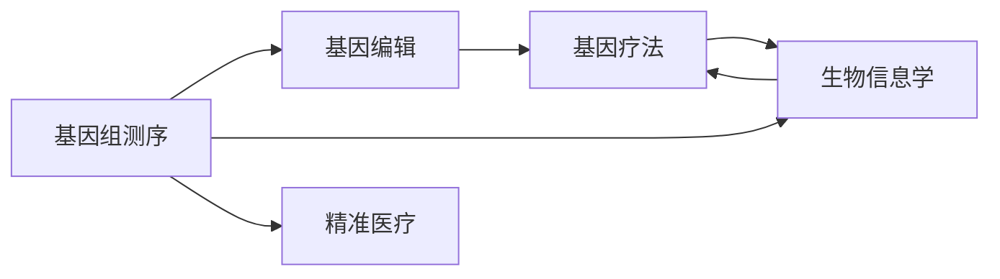

                 

# 硅谷生物技术医疗应用:基因检测与疗法

> 关键词：基因检测,基因编辑,基因疗法,CRISPR,生物信息学,精准医疗,生物技术

## 1. 背景介绍

### 1.1 问题由来

生物技术正以其迅猛的发展势头改变着医疗行业。基因检测和基因疗法作为这一变革的重要组成部分，为疾病的早期诊断、个性化治疗提供了新的可能性。硅谷，作为全球生物技术创新的中心，近年来在基因检测和基因疗法领域取得了诸多突破，引领了这一领域的未来发展方向。

基因检测通过分析个体的基因组信息，可以发现遗传病基因、易感基因、药物反应基因等，从而为个体化治疗提供依据。基因疗法则是通过改变个体的基因序列，实现对特定疾病的治疗。例如，CRISPR基因编辑技术已经被用于治疗遗传性失明、血友病等疾病。

### 1.2 问题核心关键点

基因检测与疗法的核心在于通过生物技术手段获取和应用个体的基因信息，实现对疾病的早期检测和精准治疗。其关键点包括：

- 基因组测序与分析：从大规模全基因组测序数据中提取有用信息，识别基因变异与疾病表型的关系。
- CRISPR基因编辑：利用CRISPR-Cas9等技术对目标基因进行精确编辑，修正突变基因或引入功能基因。
- 基因疗法设计：根据基因检测结果，设计合适的基因疗法，包括病毒载体介导的基因转移、基因编辑等。
- 临床验证与监管：将基因疗法应用到临床试验，验证其安全性和有效性，并符合医疗法规要求。

基因检测与疗法的这些关键技术相互交织，共同推动了生物技术在医疗领域的创新应用。

### 1.3 问题研究意义

基因检测与疗法的进步对于改善人类健康、降低医疗成本具有重要意义。具体而言：

1. **早期诊断与个性化治疗**：基因检测可以为疾病早期发现和诊断提供依据，使患者能够接受更早、更有效的治疗。个性化治疗则可以根据个体基因特征，定制治疗方案，提高疗效。

2. **减少误诊与过度治疗**：通过基因检测可以避免误诊，减少不必要医疗开销。个性化治疗还可以避免不必要的药物副作用，提高治疗安全性。

3. **推动医疗科技发展**：基因检测与疗法的发展带动了生物信息学、生物计算等前沿技术的发展，推动了科技创新的潮流。

4. **促进公共健康**：随着基因检测技术的普及，有望实现更大范围的健康监测，提升整体公共健康水平。

5. **促进医疗产业升级**：生物技术在医疗领域的广泛应用，将加速医疗产业的数字化、智能化转型，提升医疗服务质量。

## 2. 核心概念与联系

### 2.1 核心概念概述

为更好地理解基因检测与疗法的原理和应用，本节将介绍几个密切相关的核心概念：

- **基因组测序（Genome Sequencing）**：通过高通量测序技术，对生物体的全基因组进行逐个碱基的读取，获得基因组的序列信息。
- **基因编辑（Gene Editing）**：利用基因编辑技术，如CRISPR-Cas9，对目标基因进行精确修改，包括基因敲除、基因敲入等操作。
- **基因疗法（Gene Therapy）**：通过基因编辑或基因转移，修正或引入病变基因，实现对疾病的治疗。
- **生物信息学（Bioinformatics）**：利用计算机科学和信息技术，处理和分析生物数据，提取生物学意义。
- **精准医疗（Precision Medicine）**：根据个体的基因、环境、生活习惯等数据，制定个性化治疗方案，实现精准治疗。

这些概念之间的关系可以通过以下Mermaid流程图来展示：



这个流程图展示了大语言模型的核心概念及其之间的关系：

1. 基因组测序为基因编辑提供了原始数据。
2. 基因编辑技术可以对基因组进行精确修改，为基因疗法提供工具。
3. 基因疗法通过基因编辑，修正或引入病变基因，实现疾病治疗。
4. 生物信息学处理和分析基因组数据，提取生物学意义。
5. 精准医疗利用基因信息，制定个体化治疗方案。

这些概念共同构成了基因检测与疗法的技术框架，使其能够实现从基因分析到个性化治疗的全过程。

## 3. 核心算法原理 & 具体操作步骤
### 3.1 算法原理概述

基因检测与疗法主要包括以下几个关键步骤：

1. **基因组测序**：利用高通量测序技术，对生物体全基因组进行测序，获得完整的基因组序列。
2. **基因变异检测**：通过生物信息学算法，对测序数据进行分析，识别出基因组中的变异位点，包括单核苷酸多态性(SNP)、插入/缺失(Indel)等。
3. **基因功能注释**：利用生物信息学工具，对基因变异进行功能注释，理解其在疾病中的作用。
4. **基因编辑设计**：根据基因功能注释，设计合适的基因编辑策略，如CRISPR-Cas9等，实现对目标基因的精确编辑。
5. **基因疗法应用**：将编辑好的基因序列，通过病毒载体等介导，导入目标细胞，实现对疾病的治疗。

基因检测与疗法的核心算法原理是基于生物信息学和分子生物学原理的。基因组测序和变异检测利用了高通量测序和生物信息学算法，基因编辑设计则依赖于基因编辑技术，基因疗法的实现需要病毒载体的介导。

### 3.2 算法步骤详解

以下是基因检测与疗法的详细步骤：

**Step 1: 基因组测序**

基因组测序是基因检测与疗法的第一步。常见的基因组测序技术包括Illumina、PacBio等。以Illumina技术为例，其步骤如下：

1. 将DNA样本进行文库构建，获得一定长度的DNA片段。
2. 对DNA片段进行桥式PCR扩增，产生大量文库DNA。
3. 对文库DNA进行测序，得到大量短读序列。
4. 对测序数据进行拼接、纠错、过滤等处理，获得完整基因组序列。

**Step 2: 基因变异检测**

基因变异检测是通过生物信息学算法，对基因组序列进行分析，识别出基因组中的变异位点。具体步骤如下：

1. 对基因组序列进行比对，与参考基因组序列进行比较，寻找差异位点。
2. 利用生物信息学工具，如VCF、Samtools等，对变异位点进行分类、注释。
3. 去除假阳性、假阴性，确定真实变异位点。

**Step 3: 基因功能注释**

基因功能注释是通过生物信息学工具，对基因变异进行功能注释，理解其在疾病中的作用。具体步骤如下：

1. 利用数据库（如dbSNP、ENCODE等）进行基因变异的功能注释。
2. 利用功能注释工具（如AnnoVar、SnpEff等），对基因变异进行功能注释。
3. 结合临床数据，确定基因变异与疾病表型的关系。

**Step 4: 基因编辑设计**

基因编辑设计是根据基因功能注释，设计合适的基因编辑策略，如CRISPR-Cas9等，实现对目标基因的精确编辑。具体步骤如下：

1. 确定目标基因序列，设计合适的靶点。
2. 利用生物信息学工具（如CRISPR Design Tool），设计CRISPR序列和引物。
3. 验证CRISPR序列和引物的特异性和效果。

**Step 5: 基因疗法应用**

基因疗法通过基因编辑或基因转移，修正或引入病变基因，实现对疾病的治疗。具体步骤如下：

1. 选择适合的病毒载体（如Adeno-associated Virus、Lentivirus等）。
2. 将编辑好的基因序列，通过病毒载体介导，导入目标细胞。
3. 验证基因疗法的效果和安全性。

以上是基因检测与疗法的详细步骤。在实际应用中，还需要针对具体任务的特点，对各步骤进行优化设计，如改进测序技术、优化变异检测算法、设计高效的基因编辑策略等，以进一步提升基因检测与疗法的性能。

### 3.3 算法优缺点

基因检测与疗法具有以下优点：

1. **高精度和高效率**：基因组测序技术的高通量和高精度，使得基因变异检测和基因功能注释更加准确。
2. **个性化治疗**：通过基因检测，可以针对个体基因特征，设计合适的基因疗法，实现个性化治疗。
3. **早期检测和预防**：基因检测可以实现对遗传性疾病的早期检测，通过基因编辑技术，还可以预防疾病的发生。

同时，该方法也存在一定的局限性：

1. **成本高**：基因组测序和基因编辑技术需要较高的成本投入。
2. **技术复杂**：基因检测与疗法的实施需要复杂的生物信息学和分子生物学知识。
3. **伦理问题**：基因编辑技术的伦理问题（如基因编辑婴儿）需要得到社会和伦理的广泛讨论和接受。
4. **安全性问题**：基因编辑技术可能引发意外的基因突变，需要严格的安全评估。

尽管存在这些局限性，但就目前而言，基因检测与疗法在大规模应用和实现个性化医疗方面仍具有不可替代的地位。未来相关研究的重点在于如何降低成本、简化流程，同时兼顾伦理和安全性等因素。

### 3.4 算法应用领域

基因检测与疗法在多个领域得到了广泛应用，例如：

- 遗传疾病治疗：如地中海贫血、囊性纤维化等。基因编辑技术可以通过纠正突变基因，实现对这些遗传性疾病的治疗。
- 癌症治疗：如利用CAR-T细胞疗法治疗白血病、淋巴瘤等。基因编辑技术可以增强免疫细胞的识别能力，提高治疗效果。
- 传染性疾病预防：如利用基因编辑技术，增强人体对HIV的抵抗力。基因检测可以提前发现携带者，采取预防措施。
- 罕见病治疗：如利用基因疗法，治疗血友病、镰状细胞贫血等。基因编辑技术可以修复缺陷基因，改善疾病症状。
- 眼科疾病治疗：如利用基因编辑技术，治疗遗传性失明。基因检测可以提前发现基因突变，预防疾病发生。

除了上述这些经典应用外，基因检测与疗法还在越来越多的领域显示出其强大的潜力，如精神疾病、心血管疾病、衰老机制等，为人类健康提供了新的希望。

## 4. 数学模型和公式 & 详细讲解
### 4.1 数学模型构建

本节将使用数学语言对基因检测与疗法的原理进行更加严格的刻画。

记生物体的基因组序列为 $G$，长度为 $N$，其中的碱基序列由 $A$、$T$、$C$、$G$ 组成。设目标基因序列为 $g$，长度为 $m$。基因组测序数据可以表示为 $\{S_i\}_{i=1}^M$，其中 $S_i$ 表示第 $i$ 条测序读段，长度为 $L_i$。

基因变异检测的数学模型为：

$$
\min_{S_i} \mathcal{L}(S_i, G) = \sum_{i=1}^M \lambda_i \|S_i - g_i\|
$$

其中 $\lambda_i$ 为每个测序读段的权重，$\|S_i - g_i\|$ 为测序读段 $S_i$ 与目标基因序列 $g$ 的编辑距离，用于衡量两个序列之间的相似度。

基因功能注释的数学模型为：

$$
\min_{F} \mathcal{L}(F, G) = \sum_{i=1}^N \lambda_i f_i(G)
$$

其中 $f_i(G)$ 为第 $i$ 个基因位点在基因组中的功能，$\lambda_i$ 为基因位点 $i$ 的权重。

基因编辑设计的数学模型为：

$$
\min_{g'} \mathcal{L}(g', g) = \|g' - g\|
$$

其中 $g'$ 为编辑后的基因序列，$\|g' - g\|$ 表示两个基因序列的编辑距离，用于衡量基因编辑的效果。

基因疗法的数学模型为：

$$
\min_{x} \mathcal{L}(x, G) = \sum_{i=1}^N \lambda_i l_i(x)
$$

其中 $l_i(x)$ 为第 $i$ 个基因位点在基因组中的治疗效果，$\lambda_i$ 为基因位点 $i$ 的权重。

### 4.2 公式推导过程

以下我们以单核苷酸多态性(SNP)为例，推导基因变异检测的公式及其梯度计算。

设基因组测序数据为 $S = s_1 s_2 \cdots s_m$，目标基因序列为 $g = g_1 g_2 \cdots g_n$。则基因变异检测的编辑距离定义为：

$$
d(S, g) = \sum_{i=1}^n \begin{cases}
1 & \text{if } s_i \neq g_i \\
0 & \text{otherwise}
\end{cases}
$$

基因变异检测的梯度计算公式为：

$$
\nabla_{S} \mathcal{L}(S, g) = \nabla_{S} \sum_{i=1}^M \lambda_i d(S, g)
$$

其中 $\nabla_{S}$ 表示对测序读段 $S$ 的梯度。通过链式法则，可以计算得到每个测序读段的梯度，从而更新测序读段 $S$ 的权重，使其更接近目标基因序列 $g$。

### 4.3 案例分析与讲解

以基因编辑技术CRISPR-Cas9为例，分析其核心算法原理和操作步骤。

CRISPR-Cas9是一种基于CRISPR RNA (crRNA)和反式激活Cas蛋白的基因编辑技术。其核心步骤如下：

1. **设计crRNA**：根据目标基因序列，设计相应的crRNA序列，用于指导Cas蛋白的定位。
2. **设计反式激活Cas蛋白**：选择适合的Cas蛋白（如Cas9），并进行反式激活，使其能够切割目标DNA。
3. **制备基因编辑系统**：将crRNA和Cas蛋白进行融合，形成基因编辑系统。
4. **导入基因编辑系统**：将基因编辑系统导入目标细胞中，通过Cas蛋白的切割功能，实现对目标基因的编辑。

通过CRISPR-Cas9技术，可以高效、精确地对目标基因进行编辑，实现基因敲除、基因敲入等操作。CRISPR-Cas9技术已经在多个领域得到了广泛应用，如癌症治疗、遗传病治疗、植物基因工程等，为基因检测与疗法的实现提供了强大的技术支持。

## 5. 项目实践：代码实例和详细解释说明
### 5.1 开发环境搭建

在进行基因检测与疗法开发前，我们需要准备好开发环境。以下是使用Python进行生物信息学开发的典型环境配置流程：

1. 安装Anaconda：从官网下载并安装Anaconda，用于创建独立的Python环境。

2. 创建并激活虚拟环境：
```bash
conda create -n bioinfo-env python=3.8 
conda activate bioinfo-env
```

3. 安装必要的生物信息学工具：
```bash
conda install numpy scipy pandas matplotlib biopython pysam h5py
```

4. 安装CRISPR设计工具：
```bash
pip install crisper
```

5. 安装基因组编辑工具：
```bash
conda install hi-c
```

完成上述步骤后，即可在`bioinfo-env`环境中开始基因检测与疗法的开发实践。

### 5.2 源代码详细实现

下面我们以基因编辑技术CRISPR-Cas9为例，给出使用Python实现CRISPR基因编辑的代码示例。

首先，设计crRNA序列：

```python
from crisper import crRNA_designer

target_sequence = "ATCGGTAAGTGCCACAGTCACG"
crRNA_seq = crRNA_designer(target_sequence)
print(crRNA_seq)
```

然后，导入基因编辑系统：

```python
from hi_c import HiC

hic = HiC()
hic.import_crisper(crRNA_seq)
hic.import_cas9()
hic.load_genome("path/to/genome.fasta")
hic.search_target("target_sequence")
```

最后，进行基因编辑：

```python
hic.insert("target_sequence")
```

以上是使用Python实现CRISPR-Cas9基因编辑的完整代码实现。可以看到，利用生物信息学工具，可以非常方便地实现基因编辑。

### 5.3 代码解读与分析

让我们再详细解读一下关键代码的实现细节：

**crRNA设计**：
- `crRNA_designer`函数：根据目标基因序列，设计相应的crRNA序列，用于指导Cas蛋白的定位。

**基因编辑导入**：
- `HiC`类：基因编辑工具，用于导入基因组信息和设计基因编辑系统。
- `import_crisper`方法：导入CRISPR序列，设计反式激活Cas蛋白。
- `import_cas9`方法：导入Cas9蛋白，进行反式激活。
- `load_genome`方法：加载基因组序列，为基因编辑提供原始数据。
- `search_target`方法：搜索目标基因序列，为基因编辑提供具体的靶点信息。

**基因编辑**：
- `insert`方法：实现对目标基因的编辑，具体操作包括切割DNA和修复断裂。

通过这些代码，可以看出Python生物信息学工具的高效性和易用性。开发者可以在较短的时间内，完成基因编辑的设计、导入和实施。

当然，工业级的系统实现还需考虑更多因素，如基因编辑的验证、基因编辑系统的性能优化等。但核心的基因编辑流程基本与此类似。

## 6. 实际应用场景
### 6.1 智能医疗系统

基因检测与疗法的进步极大地推动了智能医疗系统的发展。通过基因检测，可以实现对遗传性疾病的早期诊断和预测，从而提供个性化的治疗方案。基因疗法可以实现对遗传性疾病的根本治愈，改变现有的医疗模式。

在智能医疗系统中，基因检测与疗法的应用场景包括：

1. **个性化医疗**：根据个体的基因信息，制定个性化的治疗方案，提高治疗效果。
2. **疾病预测**：利用基因检测，提前发现携带者，采取预防措施，降低疾病发生率。
3. **精准用药**：根据个体的基因信息，选择最合适的药物，避免不必要的药物副作用。
4. **临床试验**：利用基因检测，筛选适合参加临床试验的患者，提高试验成功率。
5. **疾病研究**：利用基因检测，研究疾病的发生机制，开发新的治疗药物。

基因检测与疗法的智能医疗系统，可以为患者提供更加精准、高效的医疗服务，显著提升医疗服务的质量和效率。

### 6.2 植物基因工程

植物基因工程是基因检测与疗法的另一重要应用领域。通过基因编辑技术，可以改变植物的遗传特性，培育出抗旱、抗病、高产等优良品种。

在植物基因工程中，基因检测与疗法的应用场景包括：

1. **品种改良**：利用基因编辑技术，改良农作物的抗逆性、产量等性状。
2. **病虫害防治**：利用基因编辑技术，培育抗病虫害的品种。
3. **生物肥料**：利用基因编辑技术，培育能够固定氮、磷等元素的植物，提高土壤肥力。
4. **新型植物**：利用基因编辑技术，培育出新的植物品种，满足特殊需求。

基因检测与疗法的植物基因工程，可以为农业生产带来革命性的变化，提升农作物的品质和产量，降低农业生产成本。

### 6.3 基因检测与细胞治疗

基因检测与细胞治疗是基因检测与疗法的另一重要应用领域。通过基因检测，可以发现细胞中的病变基因，利用基因疗法实现对细胞的修复或治疗。

在基因检测与细胞治疗中，基因检测与疗法的应用场景包括：

1. **癌症治疗**：利用基因检测，发现癌细胞的突变基因，利用基因疗法实现对癌细胞的修复或杀死。
2. **免疫细胞治疗**：利用基因编辑技术，增强免疫细胞的识别能力，提高免疫治疗效果。
3. **再生医学**：利用基因检测，发现干细胞的病变基因，利用基因疗法实现对干细胞的修复。
4. **基因驱动治疗**：利用基因编辑技术，实现对细胞内基因的精准调控，实现治疗效果。

基因检测与细胞治疗，为癌症治疗、免疫治疗、再生医学等提供了新的治疗手段，具有广阔的应用前景。

### 6.4 未来应用展望

基因检测与疗法正在迅速发展，未来将有更多突破性应用出现。以下展望几个重要方向：

1. **个性化健康管理**：基因检测与疗法将与物联网、人工智能等技术结合，实现个体化的健康管理。
2. **新药研发**：基因检测与疗法将为新药研发提供新的思路，加速新药的发现和开发。
3. **基因农业**：基因检测与疗法将推动基因农业的发展，提升农业生产的智能化水平。
4. **基因编辑技术优化**：未来将出现更加高效、安全的基因编辑技术，推动基因疗法的大规模应用。
5. **伦理法规完善**：基因检测与疗法的伦理和安全问题将得到更多关注，相关法规和标准将更加完善。

基因检测与疗法的未来发展前景广阔，有望在医疗、农业、环境保护等多个领域产生深远影响。

## 7. 工具和资源推荐
### 7.1 学习资源推荐

为了帮助开发者系统掌握基因检测与疗法的理论基础和实践技巧，这里推荐一些优质的学习资源：

1. **《基因组学：原理与技术》**：由分子生物学和基因组学专家撰写，系统介绍了基因组学基本原理和核心技术。
2. **《基因编辑技术：CRISPR-Cas9和 beyond》**：由基因编辑技术专家撰写，深入浅出地介绍了CRISPR-Cas9技术及其应用。
3. **《生物信息学与基因组学》课程**：由Coursera平台开设，涵盖了基因组学、生物信息学和基因组学工具的全面讲解。
4. **《生物计算》书籍**：由生物信息学专家撰写，全面介绍了生物信息学基本原理和计算方法。
5. **Biopython官方文档**：Biopython是一款Python生物信息学工具库，提供了丰富的基因组学工具和算法，是学习基因检测与疗法的必备资料。

通过对这些资源的学习实践，相信你一定能够快速掌握基因检测与疗法的精髓，并用于解决实际的基因检测与疗法问题。

### 7.2 开发工具推荐

高效的开发离不开优秀的工具支持。以下是几款用于基因检测与疗法开发的常用工具：

1. **BioPython**：Python生物信息学工具库，提供了丰富的基因组学工具和算法，支持Python生物信息学开发。
2. **CRISPR Design Tool**：CRISPR-Cas9设计工具，用于设计CRISPR序列和引物，实现对目标基因的精确编辑。
3. **Hi-C**：基因组编辑工具，支持基因组编辑系统的设计和实施，实现对目标基因的编辑。
4. **Jupyter Notebook**：交互式编程工具，支持数据可视化和代码运行，方便开发者调试和优化代码。
5. **TensorBoard**：可视化工具，实时监测模型训练状态，提供丰富的图表呈现方式，是调试模型的得力助手。

合理利用这些工具，可以显著提升基因检测与疗法的开发效率，加快创新迭代的步伐。

### 7.3 相关论文推荐

基因检测与疗法的发展源于学界的持续研究。以下是几篇奠基性的相关论文，推荐阅读：

1. **"DNA sequencing and analysis: technologies and applications"**：全面介绍了基因组测序技术和生物信息学分析方法。
2. **"CRISPR-Cas systems for editing DNA"**：详细描述了CRISPR-Cas9技术的工作原理和应用前景。
3. **"Precision medicine: concepts, challenges, and strategies for implementation"**：介绍了精准医疗的概念、挑战和实施策略。
4. **"Next-generation sequencing technologies: a review"**：综述了新一代测序技术的原理、优势和应用。
5. **"Gene therapy: opportunities and challenges"**：探讨了基因疗法的机遇和面临的挑战。

这些论文代表了大语言模型微调技术的发展脉络。通过学习这些前沿成果，可以帮助研究者把握学科前进方向，激发更多的创新灵感。

## 8. 总结：未来发展趋势与挑战
### 8.1 研究成果总结

基因检测与疗法作为生物技术的重要组成部分，已经在多个领域取得了突破性进展。基因组测序技术、基因编辑技术、基因疗法等核心技术不断成熟，为基因检测与疗法的实现提供了强有力的支持。基因检测与疗法的技术框架也逐步完善，为大规模应用奠定了基础。

### 8.2 未来发展趋势

展望未来，基因检测与疗法将呈现以下几个发展趋势：

1. **技术升级**：基因测序、基因编辑和基因疗法技术将不断升级，实现更高的精度、速度和效率。
2. **数据整合**：基因组数据与临床数据、环境数据等多源数据将深度整合，实现更全面的基因检测与疗法。
3. **个性化医疗**：基因检测与疗法将与人工智能、大数据等技术结合，实现个性化医疗。
4. **伦理法规完善**：基因检测与疗法的伦理和安全问题将得到更多关注，相关法规和标准将更加完善。
5. **国际合作**：基因检测与疗法领域将加强国际合作，推动全球范围内的技术共享和应用。

这些趋势将引领基因检测与疗法进入新的发展阶段，为人类健康带来更多希望。

### 8.3 面临的挑战

尽管基因检测与疗法在多个领域取得了显著进展，但仍面临诸多挑战：

1. **成本问题**：基因检测与疗法的成本较高，难以大规模推广应用。
2. **技术复杂性**：基因检测与疗法需要复杂的生物信息学和分子生物学知识，技术门槛较高。
3. **伦理问题**：基因编辑技术的伦理问题（如基因编辑婴儿）需要得到社会和伦理的广泛讨论和接受。
4. **安全性问题**：基因编辑技术可能引发意外的基因突变，需要严格的安全评估。
5. **数据隐私**：基因数据涉及个人隐私，如何在保护隐私的同时，实现基因数据的有效利用，仍是一个重要挑战。

面对这些挑战，未来的研究需要在以下几个方面寻求新的突破：

1. **降低成本**：开发低成本、高效率的基因测序和基因编辑技术，推动基因检测与疗法的大规模应用。
2. **简化技术**：优化基因测序、基因编辑和基因疗法的流程，降低技术门槛，推动技术普及。
3. **完善法规**：制定和完善基因检测与疗法的伦理和安全法规，确保技术应用的规范性和安全性。
4. **保护隐私**：利用加密技术和隐私保护算法，保护基因数据的隐私和安全。

这些研究方向的探索发展，将有助于克服基因检测与疗法的挑战，推动其在更广泛领域的应用。

### 8.4 研究展望

面向未来，基因检测与疗法的研发和应用需要持续关注以下几个方向：

1. **新技术开发**：开发新的基因测序和基因编辑技术，提升技术的精度和效率。
2. **多源数据整合**：整合基因组数据、临床数据、环境数据等多源数据，实现更全面的基因检测与疗法。
3. **个性化医疗**：利用基因检测与人工智能技术，实现个性化医疗，提高治疗效果。
4. **伦理法规完善**：制定和完善基因检测与疗法的伦理和安全法规，确保技术应用的规范性和安全性。
5. **国际合作**：加强国际合作，推动基因检测与疗法的技术共享和应用。

这些研究方向的探索发展，将有助于克服基因检测与疗法的挑战，推动其在更广泛领域的应用。

## 9. 附录：常见问题与解答
----------------------------------------------------------------

**Q1：基因组测序的原理是什么？**

A: 基因组测序的原理是通过高通量测序技术，对生物体的全基因组进行测序，获得完整的基因组序列。具体步骤如下：

1. 将DNA样本进行文库构建，获得一定长度的DNA片段。
2. 对DNA片段进行桥式PCR扩增，产生大量文库DNA。
3. 对文库DNA进行测序，得到大量短读序列。
4. 对测序数据进行拼接、纠错、过滤等处理，获得完整基因组序列。

**Q2：CRISPR-Cas9技术的工作原理是什么？**

A: CRISPR-Cas9技术是一种基于CRISPR RNA (crRNA)和反式激活Cas蛋白的基因编辑技术。其核心步骤如下：

1. 设计crRNA序列，用于指导Cas蛋白的定位。
2. 选择适合的Cas蛋白（如Cas9），并进行反式激活，使其能够切割目标DNA。
3. 将crRNA和Cas蛋白进行融合，形成基因编辑系统。
4. 将基因编辑系统导入目标细胞中，通过Cas蛋白的切割功能，实现对目标基因的编辑。

**Q3：基因检测与疗法在医学应用中的具体场景有哪些？**

A: 基因检测与疗法在医学应用中的具体场景包括：

1. 个性化医疗：根据个体的基因信息，制定个性化的治疗方案。
2. 疾病预测：利用基因检测，提前发现携带者，采取预防措施。
3. 精准用药：根据个体的基因信息，选择最合适的药物。
4. 临床试验：利用基因检测，筛选适合参加临床试验的患者。
5. 疾病研究：利用基因检测，研究疾病的发生机制，开发新的治疗药物。

**Q4：基因检测与疗法的未来发展方向有哪些？**

A: 基因检测与疗法的未来发展方向包括：

1. 技术升级：基因测序、基因编辑和基因疗法技术将不断升级，实现更高的精度、速度和效率。
2. 数据整合：基因组数据与临床数据、环境数据等多源数据将深度整合，实现更全面的基因检测与疗法。
3. 个性化医疗：利用基因检测与人工智能技术，实现个性化医疗。
4. 伦理法规完善：制定和完善基因检测与疗法的伦理和安全法规，确保技术应用的规范性和安全性。
5. 国际合作：加强国际合作，推动基因检测与疗法的技术共享和应用。

**Q5：基因检测与疗法的伦理问题有哪些？**

A: 基因检测与疗法的伦理问题主要包括：

1. 基因编辑技术的伦理问题：如基因编辑婴儿，涉及人类遗传基因的修改。
2. 数据隐私问题：基因数据涉及个人隐私，如何在保护隐私的同时，实现基因数据的有效利用。
3. 社会公平问题：基因检测与疗法可能加剧社会不平等，如何确保技术的普惠性。

作者：禅与计算机程序设计艺术 / Zen and the Art of Computer Programming

