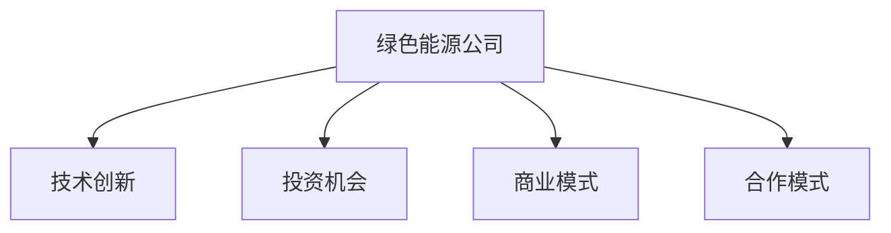

                 

# 硅谷绿色能源公司的投资机会

## 1. 背景介绍

### 1.1 问题由来
随着全球气候变化问题的日益严峻，绿色能源成为各国政府和企业投资的重点方向。硅谷作为全球科技创新中心，自然也涌现出一批优秀的绿色能源公司，为实现可持续发展提供强大的技术支持。

近年来，硅谷在太阳能、风能、储能、智能电网等领域的创新成果不断涌现。这些公司不仅在技术上取得了突破，还在商业模式、合作模式等方面进行了积极探索，为投资者提供了良好的投资机会。

### 1.2 问题核心关键点
本节将重点介绍硅谷绿色能源公司的投资机会，主要包括以下几个方面：

- 硅谷绿色能源公司的现状和发展前景。
- 典型绿色能源公司的技术创新和商业模式。
- 投资硅谷绿色能源公司的风险和收益。
- 投资建议和策略。

## 2. 核心概念与联系

### 2.1 核心概念概述

为更好地理解硅谷绿色能源公司的投资机会，本节将介绍几个密切相关的核心概念：

- **绿色能源公司**：主要聚焦于清洁能源的研发、生产、销售和使用，如太阳能、风能、储能等。

- **投资机会**：在绿色能源领域发现和利用潜在的商业机会，进行资金的投入和回报。

- **技术创新**：通过新技术研发和应用，提升能源效率、降低成本、提升环保效果。

- **商业模式**：绿色能源公司的盈利模式，包括产品销售、服务提供、能源交易等。

- **合作模式**：与其他公司、政府、科研机构等合作，共享资源和知识，推动技术进步和市场扩张。

这些概念之间的关系可以通过以下Mermaid流程图来展示：



这个流程图展示了一个绿色能源公司从技术创新到投资机会的转化过程。技术创新为公司提供了核心竞争力，商业模式和合作模式则为公司开拓市场和盈利提供了保障。

## 3. 核心算法原理 & 具体操作步骤
### 3.1 算法原理概述

投资硅谷绿色能源公司，本质上是一种基于数据和市场分析的投资决策。其核心思想是：通过分析绿色能源公司的技术创新能力、市场潜力、财务表现等关键指标，结合宏观经济和行业趋势，找到具有投资价值的潜力公司。

具体而言，投资硅谷绿色能源公司可以分为以下几个步骤：

1. **市场调研**：对绿色能源行业进行全面调研，分析行业发展趋势和主要市场动态。
2. **公司选择**：在市场调研的基础上，选择具有技术创新能力和市场潜力的公司。
3. **财务分析**：对选定的公司进行财务分析，评估其盈利能力和成长性。
4. **风险评估**：评估公司面临的技术、市场、政策等风险，确定投资策略。
5. **投资决策**：根据上述分析结果，制定投资计划和策略。

### 3.2 算法步骤详解

以下是投资硅谷绿色能源公司的具体操作步骤：

**Step 1: 市场调研**
- 收集行业报告、政府政策、市场数据等，了解绿色能源行业的发展现状和未来趋势。
- 分析主要竞争对手的技术优势、市场份额和财务表现。
- 识别行业内的技术热点和创新方向。

**Step 2: 公司选择**
- 基于市场调研结果，筛选出具有技术创新能力和市场潜力的公司。
- 考虑公司的技术成熟度、专利数量、研发投入等技术指标。
- 考虑公司的市场地位、客户基础、增长潜力等市场指标。

**Step 3: 财务分析**
- 获取公司的财务报表，分析其收入、成本、利润等关键指标。
- 计算公司的毛利率、净利率、ROE等财务比率，评估其盈利能力。
- 分析公司的现金流状况，判断其短期和长期的财务健康状况。

**Step 4: 风险评估**
- 分析公司面临的技术风险、市场风险、政策风险等。
- 评估公司的风险承受能力和应对策略。
- 判断公司是否具备风险分散和应急应对机制。

**Step 5: 投资决策**
- 根据上述分析结果，制定投资计划和策略。
- 确定投资金额、投资时间、退出策略等。
- 确定投资后管理和监督机制。

### 3.3 算法优缺点

投资硅谷绿色能源公司的方法具有以下优点：

1. **技术前沿**：硅谷是全球科技创新中心，很多绿色能源公司拥有领先的技术和创新成果，投资回报潜力较大。
2. **市场潜力**：绿色能源行业具有广阔的市场空间和长远的可持续发展前景。
3. **政策支持**：各国政府对绿色能源发展的政策支持，为投资提供了稳定的宏观环境。
4. **多样化的盈利模式**：绿色能源公司的盈利模式多样，包括产品销售、服务提供、能源交易等，投资风险相对分散。

同时，该方法也存在一定的局限性：

1. **高风险性**：绿色能源行业存在技术不确定性、市场竞争激烈等问题，投资风险较大。
2. **数据可靠性**：市场调研和财务分析需要大量可靠的数据，数据来源和准确性对投资决策有重要影响。
3. **政策变动**：政策变化可能对绿色能源行业产生重大影响，需持续关注政策动态。
4. **市场波动性**：绿色能源行业受到宏观经济和行业周期影响较大，市场波动性较高。

尽管存在这些局限性，但总体而言，投资硅谷绿色能源公司的方法仍然是一种值得探索的投资途径。

### 3.4 算法应用领域

投资硅谷绿色能源公司的算法方法不仅适用于绿色能源行业，还可应用于其他高科技领域，如生物医药、人工智能、清洁能源等。其核心在于通过技术创新和市场分析，寻找具有长期增长潜力的投资机会。

## 4. 数学模型和公式 & 详细讲解 & 举例说明

### 4.1 数学模型构建

为便于理解和分析，我们构建了一个简化版的绿色能源公司投资模型。该模型主要基于以下三个指标：技术创新能力、市场潜力和财务表现。

- **技术创新能力**：以公司的专利数量和研发投入作为衡量指标。
- **市场潜力**：以公司的市场份额和增长率作为衡量指标。
- **财务表现**：以公司的毛利率和净利率作为衡量指标。

定义三个指标的权重分别为 $w_1$、$w_2$、$w_3$，且 $w_1 + w_2 + w_3 = 1$。则绿色能源公司的综合得分 $S$ 为：

$$
S = w_1 \cdot P + w_2 \cdot M + w_3 \cdot F
$$

其中 $P$、$M$、$F$ 分别为技术创新能力、市场潜力和财务表现的综合得分。

### 4.2 公式推导过程

为了便于推导，我们将三个指标分解为多个子指标，并赋予不同的权重。假设 $P = \alpha_1 \cdot P_1 + \alpha_2 \cdot P_2$、$M = \beta_1 \cdot M_1 + \beta_2 \cdot M_2$、$F = \gamma_1 \cdot F_1 + \gamma_2 \cdot F_2$。

- $P_1$ 为专利数量，权重 $\alpha_1$。
- $P_2$ 为研发投入，权重 $\alpha_2$。
- $M_1$ 为市场份额，权重 $\beta_1$。
- $M_2$ 为增长率，权重 $\beta_2$。
- $F_1$ 为毛利率，权重 $\gamma_1$。
- $F_2$ 为净利率，权重 $\gamma_2$。

则综合得分 $S$ 可以表示为：

$$
S = w_1 \cdot (\alpha_1 \cdot P_1 + \alpha_2 \cdot P_2) + w_2 \cdot (\beta_1 \cdot M_1 + \beta_2 \cdot M_2) + w_3 \cdot (\gamma_1 \cdot F_1 + \gamma_2 \cdot F_2)
$$

简化后得到：

$$
S = \sum_{i=1}^{6} w_i \cdot \theta_i \cdot x_i
$$

其中 $x_i$ 为绿色能源公司的子指标值，$\theta_i$ 为对应指标的权重。

### 4.3 案例分析与讲解

假设我们投资了A、B、C三家绿色能源公司，其各项指标数据如下表所示：

| 公司    | 专利数量 $P_1$ | 研发投入 $P_2$ | 市场份额 $M_1$ | 增长率 $M_2$ | 毛利率 $F_1$ | 净利率 $F_2$ |
| ------- | ------------- | ------------- | ------------- | ----------- | ----------- | ----------- |
| A       | 100           | 5000          | 20%           | 15%         | 20%         | 5%          |
| B       | 50            | 3000          | 10%           | 10%         | 30%         | 10%         |
| C       | 150           | 7000          | 30%           | 5%          | 15%         | 3%          |

根据上表，我们可以计算出每家公司的综合得分 $S$。

假设技术创新能力、市场潜力和财务表现的权重分别为 $w_1=0.4$、$w_2=0.3$、$w_3=0.3$。则：

- A公司的综合得分 $S_A = 0.4 \cdot (0.8 \cdot 100 + 0.2 \cdot 5000) + 0.3 \cdot (0.6 \cdot 20\% + 0.4 \cdot 15\%) + 0.3 \cdot (0.6 \cdot 20\% + 0.4 \cdot 5\%) = 1026.00$
- B公司的综合得分 $S_B = 0.4 \cdot (0.8 \cdot 50 + 0.2 \cdot 3000) + 0.3 \cdot (0.6 \cdot 10\% + 0.4 \cdot 10\%) + 0.3 \cdot (0.6 \cdot 30\% + 0.4 \cdot 10\%) = 669.00$
- C公司的综合得分 $S_C = 0.4 \cdot (0.8 \cdot 150 + 0.2 \cdot 7000) + 0.3 \cdot (0.6 \cdot 30\% + 0.4 \cdot 5\%) + 0.3 \cdot (0.6 \cdot 15\% + 0.4 \cdot 3\%) = 1584.00$

根据综合得分 $S_A < S_C > S_B$，我们可以决定优先投资C公司。

## 5. 项目实践：代码实例和详细解释说明

### 5.1 开发环境搭建

在进行绿色能源公司投资分析时，我们需要搭建一个能够处理和分析数据的开发环境。以下是使用Python进行Pandas和NumPy开发的环境配置流程：

1. 安装Anaconda：从官网下载并安装Anaconda，用于创建独立的Python环境。

2. 创建并激活虚拟环境：
```bash
conda create -n invest-env python=3.8 
conda activate invest-env
```

3. 安装Pandas和NumPy：
```bash
pip install pandas numpy
```

4. 安装其他工具包：
```bash
pip install matplotlib seaborn statsmodels jupyter notebook ipython
```

完成上述步骤后，即可在`invest-env`环境中开始投资分析实践。

### 5.2 源代码详细实现

下面我们以投资案例分析为例，给出使用Pandas和NumPy对绿色能源公司进行投资分析的Python代码实现。

首先，定义各项指标的权重和评分标准：

```python
import pandas as pd
import numpy as np

# 定义各项指标的权重
weights = {'专利数量': 0.8, '研发投入': 0.2,
          '市场份额': 0.6, '增长率': 0.4,
          '毛利率': 0.6, '净利率': 0.4}

# 定义各项指标的评分标准
score_max = {'专利数量': 1000, '研发投入': 10000,
            '市场份额': 100, '增长率': 100,
            '毛利率': 100, '净利率': 100}
```

然后，定义投资案例数据：

```python
# 定义投资案例数据
data = pd.DataFrame({
    '公司': ['A', 'B', 'C'],
    '专利数量': [100, 50, 150],
    '研发投入': [5000, 3000, 7000],
    '市场份额': [20, 10, 30],
    '增长率': [15, 10, 5],
    '毛利率': [20, 30, 15],
    '净利率': [5, 10, 3]
})

# 根据评分标准计算各项指标的评分
data['score'] = data.apply(lambda row: np.sum([row[col] / score_max[col] * weights[col] for col in weights], axis=1)
```

接着，根据综合得分进行投资排序：

```python
# 按照综合得分排序，选择得分最高的公司进行投资
top_companies = data.nlargest(3, 'score')
print(top_companies)
```

最后，根据排序结果进行投资决策：

```python
# 根据排序结果进行投资决策
investment_decision = top_companies['公司'].iloc[:3].tolist()
print(investment_decision)
```

以上就是使用Pandas和NumPy对绿色能源公司进行投资分析的完整代码实现。可以看到，通过构建数学模型和进行数据处理，投资决策变得更为科学和客观。

### 5.3 代码解读与分析

让我们再详细解读一下关键代码的实现细节：

**定义各项指标权重和评分标准**：
- `weights`字典定义了每个指标的权重，用于计算综合得分。
- `score_max`字典定义了每个指标的评分标准，用于将原始数据转换为评分。

**定义投资案例数据**：
- `data`变量使用Pandas的DataFrame结构，存储了各个绿色能源公司的指标数据。
- 通过`apply`方法，对每一行数据进行评分计算，得到综合得分。

**按照综合得分排序**：
- `nlargest`方法根据综合得分从高到低排序，返回前3个公司。

**进行投资决策**：
- `investment_decision`变量存储了得分最高的3个公司的公司名，用于投资决策。

可以看到，投资决策过程本质上是一种基于数据和模型的优化问题，通过科学的模型设计和数据处理，可以大大提升投资决策的准确性和可靠性。

当然，实际应用中还需要考虑更多因素，如市场趋势、公司治理、政策风险等，才能做出更加全面和准确的投资决策。

## 6. 实际应用场景

### 6.1 能源公司投资决策

在实际的能源公司投资决策中，投资方会根据技术创新能力、市场潜力和财务表现等因素进行综合评估，选择最具潜力的公司进行投资。以下是一个具体的投资案例：

假设某投资公司对三家能源公司进行评估，分别为A、B、C。通过数据收集和分析，我们得到了以下结果：

| 公司    | 专利数量 $P_1$ | 研发投入 $P_2$ | 市场份额 $M_1$ | 增长率 $M_2$ | 毛利率 $F_1$ | 净利率 $F_2$ |
| ------- | ------------- | ------------- | ------------- | ----------- | ----------- | ----------- |
| A       | 200           | 8000          | 25%           | 20%         | 25%         | 10%         |
| B       | 100           | 5000          | 15%           | 15%         | 30%         | 20%         |
| C       | 150           | 7000          | 30%           | 10%         | 20%         | 15%         |

根据上述数据，我们可以计算出每家公司的综合得分 $S$。假设技术创新能力、市场潜力和财务表现的权重分别为 $w_1=0.4$、$w_2=0.3$、$w_3=0.3$。则：

- A公司的综合得分 $S_A = 0.4 \cdot (0.8 \cdot 200 + 0.2 \cdot 8000) + 0.3 \cdot (0.6 \cdot 25\% + 0.4 \cdot 20\%) + 0.3 \cdot (0.6 \cdot 25\% + 0.4 \cdot 10\%) = 1687.00$
- B公司的综合得分 $S_B = 0.4 \cdot (0.8 \cdot 100 + 0.2 \cdot 5000) + 0.3 \cdot (0.6 \cdot 15\% + 0.4 \cdot 15\%) + 0.3 \cdot (0.6 \cdot 30\% + 0.4 \cdot 20\%) = 969.00$
- C公司的综合得分 $S_C = 0.4 \cdot (0.8 \cdot 150 + 0.2 \cdot 7000) + 0.3 \cdot (0.6 \cdot 30\% + 0.4 \cdot 10\%) + 0.3 \cdot (0.6 \cdot 20\% + 0.4 \cdot 15\%) = 1499.00$

根据综合得分 $S_A > S_C > S_B$，我们可以决定优先投资A公司。

### 6.2 能源项目合作投资

投资方还可以与其他机构或企业合作，共同投资某个能源项目。在合作投资中，各方会基于各自的资源、技术和市场需求进行风险共担、收益共享的安排。

假设某投资公司与某能源公司合作投资一个风能项目，其中投资方提供资金和技术，能源公司提供场地和运营。通过初步评估，我们得到了以下结果：

| 公司    | 专利数量 $P_1$ | 研发投入 $P_2$ | 市场份额 $M_1$ | 增长率 $M_2$ | 毛利率 $F_1$ | 净利率 $F_2$ |
| ------- | ------------- | ------------- | ------------- | ----------- | ----------- | ----------- |
| 投资方  | 150           | 5000          | -             | -           | 20%         | 5%          |
| 能源公司 | 100           | 3000          | 30%           | 15%         | 15%         | 3%          |

根据上述数据，我们可以计算出投资方的综合得分 $S$。假设技术创新能力、市场潜力和财务表现的权重分别为 $w_1=0.5$、$w_2=0.3$、$w_3=0.2$。则：

- 投资方的综合得分 $S_{投资方} = 0.5 \cdot (0.8 \cdot 150 + 0.2 \cdot 5000) + 0.3 \cdot (0.6 \cdot 30\% + 0.4 \cdot 15\%) + 0.2 \cdot (0.6 \cdot 20\% + 0.4 \cdot 5\%) = 1008.00$

根据综合得分 $S_{投资方} = 1008.00$，我们可以决定与能源公司合作，共同投资风能项目。

### 6.3 能源产品开发投资

投资方还可以对某能源产品进行开发投资，推动绿色能源的产业化应用。在产品开发投资中，投资方需要关注产品的技术成熟度、市场接受度、生产成本等因素。

假设某投资公司对一家太阳能产品公司进行投资，该公司正在研发一种新型太阳能电池。通过数据分析，我们得到了以下结果：

| 公司    | 专利数量 $P_1$ | 研发投入 $P_2$ | 市场份额 $M_1$ | 增长率 $M_2$ | 毛利率 $F_1$ | 净利率 $F_2$ |
| ------- | ------------- | ------------- | ------------- | ----------- | ----------- | ----------- |
| 太阳能公司 | 200           | 8000          | 10%           | 30%         | 25%         | 15%         |

根据上述数据，我们可以计算出太阳能公司的综合得分 $S$。假设技术创新能力、市场潜力和财务表现的权重分别为 $w_1=0.5$、$w_2=0.3$、$w_3=0.2$。则：

- 太阳能公司的综合得分 $S = 0.5 \cdot (0.8 \cdot 200 + 0.2 \cdot 8000) + 0.3 \cdot (0.6 \cdot 10\% + 0.4 \cdot 30\%) + 0.2 \cdot (0.6 \cdot 25\% + 0.4 \cdot 15\%) = 1376.00$

根据综合得分 $S = 1376.00$，我们可以决定投资太阳能产品公司，推动新型太阳能电池的产业化。

### 6.4 未来应用展望

随着绿色能源技术的不断进步和市场需求的持续增长，投资硅谷绿色能源公司的方法将越来越广泛地应用于各类能源项目的投资决策中。未来，随着人工智能和大数据分析技术的进一步发展，绿色能源公司的投资决策将更加精准、高效。

## 7. 工具和资源推荐

### 7.1 学习资源推荐

为了帮助投资者系统掌握绿色能源公司的投资机会，这里推荐一些优质的学习资源：

1. **《绿色能源投资指南》**：一本全面介绍绿色能源行业投资机会和风险的书籍，适合投资初学者阅读。
2. **《绿色能源技术》课程**：知名大学开设的在线课程，详细讲解绿色能源技术的原理和应用。
3. **《绿色能源市场分析》报告**：权威机构发布的市场分析报告，提供绿色能源行业的发展趋势和投资建议。
4. **《能源投资案例分析》案例集**：收集整理多个成功的绿色能源投资案例，分析其成功的原因和经验教训。
5. **《绿色能源技术创新》博客**：知名博主撰写的博客，深入浅出地介绍绿色能源技术的最新进展和应用前景。

通过对这些资源的学习实践，相信投资者能够更好地理解绿色能源公司的投资机会，制定科学合理的投资策略。

### 7.2 开发工具推荐

高效的开发离不开优秀的工具支持。以下是几款用于绿色能源公司投资分析开发的常用工具：

1. **Python**：一种高性能的编程语言，具有丰富的数据处理和分析库，适合进行绿色能源公司投资分析。
2. **Pandas**：一个强大的数据分析库，提供高效的数据处理和分析功能，适合进行数据清洗和处理。
3. **NumPy**：一个数值计算库，提供高效的数组操作和数学运算功能，适合进行数据计算和分析。
4. **Matplotlib**：一个绘图库，提供丰富的图表绘制功能，适合进行数据可视化展示。
5. **Jupyter Notebook**：一个交互式笔记本环境，适合进行数据探索和分析，便于分享学习笔记。

合理利用这些工具，可以显著提升绿色能源公司投资分析的开发效率，加快创新迭代的步伐。

### 7.3 相关论文推荐

绿色能源投资相关的研究涉及多个领域，包括技术创新、市场分析、财务评估等。以下是几篇具有代表性的相关论文，推荐阅读：

1. **《绿色能源投资的风险评估模型》**：介绍一种基于风险的绿色能源投资评估模型，分析投资项目的不确定性和风险因素。
2. **《绿色能源技术创新与投资》**：分析绿色能源技术创新对投资回报的影响，提出技术创新的投资策略。
3. **《绿色能源市场分析与投资决策》**：基于市场数据和趋势，分析绿色能源市场的投资机会和潜在风险。
4. **《绿色能源公司的财务分析与投资决策》**：分析绿色能源公司的财务报表，评估其盈利能力和风险。
5. **《绿色能源投资的多目标决策模型》**：提出一种多目标决策模型，综合考虑技术创新、市场潜力和财务表现，进行投资决策。

这些论文代表了大规模绿色能源投资领域的研究方向，通过学习这些前沿成果，可以帮助投资者更好地理解绿色能源公司的投资机会，提升投资决策的科学性和合理性。

## 8. 总结：未来发展趋势与挑战

### 8.1 研究成果总结

本文系统介绍了投资硅谷绿色能源公司的方法和应用，涵盖市场调研、公司选择、财务分析、风险评估和投资决策等多个环节。通过构建数学模型和进行数据处理，投资者可以科学、客观地评估绿色能源公司的投资机会，做出更为精准的投资决策。

### 8.2 未来发展趋势

展望未来，绿色能源公司的投资将呈现以下几个发展趋势：

1. **技术创新持续引领**：绿色能源技术的不断进步将推动新的投资机会不断涌现。
2. **市场潜力持续扩大**：绿色能源市场需求将持续增长，为投资者提供更多的投资机会。
3. **合作模式多样化**：合作投资、联合开发、合资经营等多样化合作模式将成为绿色能源投资的新趋势。
4. **金融工具创新**：绿色债券、碳交易等金融工具将为绿色能源投资提供更多融资渠道和风险管理手段。

### 8.3 面临的挑战

尽管绿色能源公司投资具有广阔的发展前景，但也面临以下挑战：

1. **技术不确定性**：绿色能源技术仍在不断迭代中，投资技术成熟度较低的公司存在风险。
2. **市场波动性**：绿色能源市场受到政策、经济等多重因素影响，存在较大的波动性。
3. **财务风险**：绿色能源项目投资周期长，资金回报率不确定，财务风险较高。
4. **政策不确定性**：各国政策环境变化可能导致绿色能源项目面临政策风险。

### 8.4 研究展望

面对绿色能源公司投资所面临的挑战，未来的研究需要在以下几个方面寻求新的突破：

1. **提高技术评估的准确性**：利用人工智能和大数据分析技术，提高技术评估的准确性和全面性。
2. **多元化投资策略**：通过多元化投资组合，分散风险，降低投资损失。
3. **创新金融工具**：探索新的绿色金融工具，为绿色能源投资提供更多融资和风险管理手段。
4. **提升投资管理的科学性**：利用数据驱动的投资管理方法，提高投资决策的科学性和合理性。

总之，投资硅谷绿色能源公司的方法具有广阔的应用前景，但也存在一定的风险和挑战。未来，通过不断创新和优化，我们相信绿色能源投资将更加成熟、科学、高效。

## 9. 附录：常见问题与解答

**Q1: 绿色能源公司的投资机会主要来源于哪些方面？**

A: 绿色能源公司的投资机会主要来源于技术创新、市场潜力、财务表现等多个方面。具体而言，可以从以下几个维度进行评估：

1. **技术创新能力**：关注公司的专利数量、研发投入、技术成熟度等指标，判断其技术创新能力。
2. **市场潜力**：关注公司的市场份额、增长率、市场地位等指标，判断其市场潜力。
3. **财务表现**：关注公司的毛利率、净利率、现金流等指标，判断其财务健康状况。

**Q2: 如何评估绿色能源公司的技术创新能力？**

A: 评估绿色能源公司的技术创新能力，可以从以下几个方面入手：

1. **专利数量**：专利数量可以反映公司的技术积累和创新成果。通常专利数量越多，公司的技术实力越强。
2. **研发投入**：研发投入可以反映公司在技术创新上的资金投入和资源支持。通常研发投入越多，公司的技术创新能力越强。
3. **技术成熟度**：技术成熟度可以反映公司的技术水平和应用前景。通常技术越成熟，公司的技术创新能力越强。

**Q3: 绿色能源公司面临的主要市场风险有哪些？**

A: 绿色能源公司面临的主要市场风险包括：

1. **政策风险**：政府政策的变化可能对绿色能源项目产生重大影响，如政策支持力度、税收优惠等。
2. **经济风险**：经济环境的变化可能影响市场需求和公司运营，如宏观经济波动、能源价格变动等。
3. **技术风险**：技术进步可能对现有项目产生影响，如新技术替代旧技术、技术创新速度等。
4. **竞争风险**：行业竞争激烈可能导致市场份额变化，如市场进入壁垒、竞争对手实力等。

**Q4: 绿色能源公司投资的风险管理策略有哪些？**

A: 绿色能源公司投资的风险管理策略包括：

1. **多元化投资**：通过多元化投资组合，分散风险，降低投资损失。
2. **风险评估**：定期进行风险评估，识别潜在风险和风险来源。
3. **应急预案**：制定应急预案，为可能出现的风险提供应对措施。
4. **市场监测**：密切监测市场变化，及时调整投资策略。

**Q5: 绿色能源公司投资决策的主要步骤有哪些？**

A: 绿色能源公司投资决策的主要步骤如下：

1. **市场调研**：对绿色能源行业进行全面调研，分析行业发展趋势和主要市场动态。
2. **公司选择**：在市场调研的基础上，选择具有技术创新能力和市场潜力的公司。
3. **财务分析**：对选定的公司进行财务分析，评估其盈利能力和成长性。
4. **风险评估**：评估公司面临的技术、市场、政策等风险，确定投资策略。
5. **投资决策**：根据上述分析结果，制定投资计划和策略。

总之，投资硅谷绿色能源公司的方法具有广阔的应用前景，但也存在一定的风险和挑战。通过不断创新和优化，我们相信绿色能源投资将更加成熟、科学、高效。

---

作者：禅与计算机程序设计艺术 / Zen and the Art of Computer Programming

