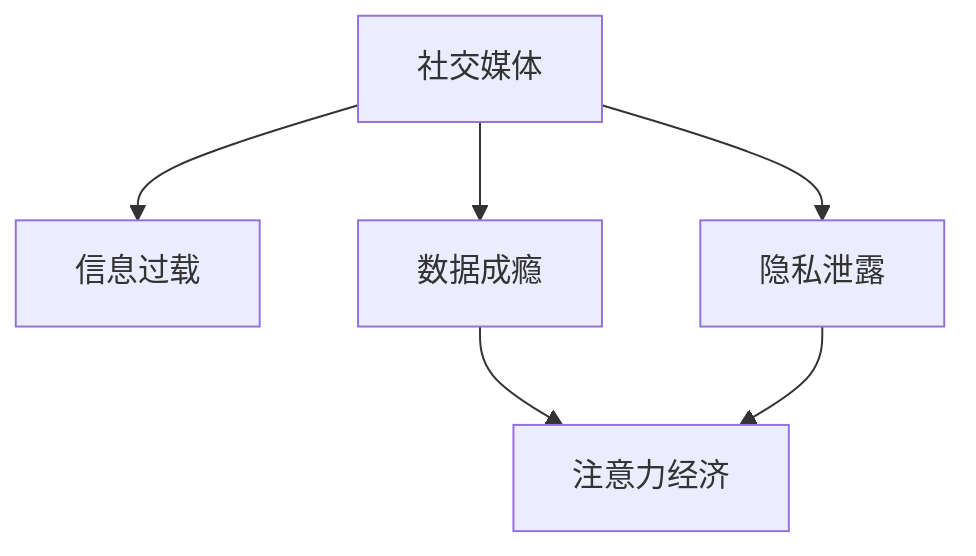

                 

## 1. 背景介绍

在移动互联网和社交媒体时代，人们的生活习惯、工作模式和社交方式发生了翻天覆地的变化。社交媒体平台为人们提供了即时沟通、信息交流、内容分享和娱乐休闲等多元化服务，极大地丰富了人们的生活。然而，社交媒体的发展也带来了不少负面效应，其中社交媒体疲劳（Social Media Fatigue）是最为显著的一种现象。

### 1.1 问题由来

社交媒体疲劳是指用户在使用社交媒体平台时，因频繁的互动、信息过载、网络欺诈等问题导致的身心疲惫和信息倦怠。根据一项美国心理学协会（American Psychological Association）的研究，社交媒体疲劳已成为现代人的常见心理问题之一，约三分之一的受访者表示他们因社交媒体使用而感到焦虑、压力和疲劳。

### 1.2 问题核心关键点

社交媒体疲劳涉及的核心关键点包括：
- **信息过载**：用户面临大量的信息输入，需要不断筛选、甄别和处理信息，导致认知负担加重。
- **互动压力**：频繁的网络互动，包括点赞、评论、私信等，使得用户心理负担增加，社交需求得不到满足。
- **网络欺诈**：网络谣言、恶意评论、网络暴力等行为，使用户在心理和生理上受到伤害。
- **隐私泄露**：用户的个人信息被滥用或泄露，增加对社交媒体的信任危机。
- **数据成瘾**：社交媒体平台的算法设计使得用户容易陷入"数据成瘾"，即不断寻求新的刺激和满足感，难以自拔。

这些关键点共同构成了一个复杂的系统，影响着用户的心理状态和社交行为，甚至可能对个人健康和社会稳定产生负面影响。

## 2. 核心概念与联系

### 2.1 核心概念概述

为了更好地理解社交媒体疲劳的成因和缓解方法，本节将介绍几个密切相关的核心概念：

- **社交媒体**：通过网络平台进行的即时沟通、信息交流、内容分享和娱乐休闲等活动。常见的社交媒体平台包括Facebook、Twitter、Instagram、WeChat等。
- **信息过载**：用户面临大量信息输入，难以处理和筛选，导致认知负担加重，心理压力增大。
- **数据成瘾**：用户在社交媒体平台上不断寻求新的刺激和满足感，形成对平台依赖，难以自拔。
- **隐私泄露**：用户的个人信息被滥用或泄露，导致对社交媒体的不信任和隐私焦虑。
- **注意力经济**：通过吸引和保持用户的注意力来产生商业价值，常见于社交媒体平台。

这些概念之间的逻辑关系可以通过以下Mermaid流程图来展示：



这个流程图展示了这个复杂系统的关键概念及其之间的关系：

1. 社交媒体通过吸引用户注意力来产生经济价值。
2. 信息过载和数据成瘾使得用户对平台依赖加深，进一步推动了注意力经济的发展。
3. 隐私泄露则增加了用户对平台的信任危机，影响用户的持续使用。

这些概念共同构成了社交媒体疲劳问题的核心框架，为后续分析提供了清晰的脉络。

## 3. 核心算法原理 & 具体操作步骤

### 3.1 算法原理概述

社交媒体疲劳的核心算法原理主要涉及以下几个方面：

- **注意力模型**：社交媒体平台通过算法设计，不断吸引和保持用户的注意力，以满足注意力经济的需要。
- **信息处理模型**：用户面临的信息过载问题，需要模型来帮助筛选、聚合和推荐信息。
- **用户行为模型**：研究用户如何与社交媒体互动，以及互动模式对用户心理和生理的影响。
- **心理健康模型**：建立用户心理状态的模型，评估社交媒体疲劳的严重程度。

这些模型相互交织，共同作用于用户的心理状态和行为模式，最终导致社交媒体疲劳。

### 3.2 算法步骤详解

以下将详细介绍社交媒体疲劳核心算法的详细步骤：

**Step 1: 数据收集与预处理**

- 收集社交媒体平台的用户行为数据，如点赞、评论、转发、私信等。
- 收集用户心理状态数据，如压力、焦虑、疲劳等。
- 使用自然语言处理（NLP）技术，对用户互动文本进行情感分析，提取情绪状态。

**Step 2: 建立注意力模型**

- 通过用户互动数据和点击流数据，建立用户的注意力分布模型。
- 使用强化学习算法，优化推荐系统的策略，以最大化用户停留时间和互动率。

**Step 3: 设计信息处理模型**

- 采用推荐算法，如协同过滤、内容推荐、基于用户兴趣的推荐等，筛选和推荐高质量信息。
- 使用文本分类、聚类等方法，对信息进行自动分类和聚合，减轻信息过载。

**Step 4: 构建用户行为模型**

- 利用时间序列分析和统计学方法，分析用户互动行为的模式和趋势。
- 建立用户行为预测模型，预测用户未来的互动行为，以优化平台策略。

**Step 5: 建立心理健康模型**

- 构建用户心理健康评估模型，评估社交媒体疲劳的严重程度。
- 使用机器学习算法，如逻辑回归、支持向量机等，预测用户的心理状态变化。

### 3.3 算法优缺点

社交媒体疲劳的核心算法具有以下优点：

- **自动化**：使用机器学习和大数据技术，能够自动化处理大量用户数据，减轻人工负担。
- **高精度**：算法可以精确分析用户的注意力分布、情绪状态和行为模式，提供科学依据。
- **实时性**：通过实时分析，可以及时调整平台策略，提升用户体验。

同时，这些算法也存在一些缺点：

- **数据隐私**：收集和分析用户数据可能侵犯隐私权，引发伦理和安全问题。
- **模型黑盒**：复杂的模型结构难以解释和调试，可能导致不可预期的结果。
- **算法偏差**：算法可能存在偏差，如对某些用户群体的偏好，导致不平等对待。

### 3.4 算法应用领域

社交媒体疲劳的核心算法应用广泛，包括但不限于以下几个领域：

- **用户行为分析**：对用户互动模式进行分析和预测，优化平台策略。
- **情感分析**：分析用户情绪状态，监测社交媒体疲劳现象。
- **推荐系统**：优化推荐算法，减少信息过载，提升用户体验。
- **心理健康监测**：建立心理健康评估模型，帮助识别和缓解社交媒体疲劳。

这些应用领域展示了社交媒体疲劳算法的广泛性和实用性，为社交媒体平台提供了科学管理工具，帮助用户减轻心理负担，提升平台的用户黏性和满意度。

## 4. 数学模型和公式 & 详细讲解 & 举例说明

### 4.1 数学模型构建

社交媒体疲劳的核心数学模型涉及以下几个方面：

- **注意力分布模型**：$Attention(x_i) = \sum_{j=1}^n x_i(j) \cdot w(j)$，其中 $x_i$ 表示用户 $i$ 在时间 $t$ 的互动数据，$w(j)$ 为注意力权重。
- **信息过载模型**：$Overload(x_i) = \frac{I_i}{T_i}$，其中 $I_i$ 表示用户 $i$ 接收的信息量，$T_i$ 表示用户 $i$ 可用时间。
- **用户行为预测模型**：$Predict(y_i) = f(x_i, \theta)$，其中 $y_i$ 表示用户 $i$ 未来的互动行为，$x_i$ 为用户 $i$ 的历史互动数据，$\theta$ 为模型参数。
- **心理健康评估模型**：$MentalHealth(z_i) = g(z_i, \phi)$，其中 $z_i$ 表示用户 $i$ 的心理状态数据，$\phi$ 为心理健康评估模型参数。

### 4.2 公式推导过程

以下是几个核心模型的公式推导过程：

**注意力分布模型**：

假设用户 $i$ 在时间 $t$ 的互动数据 $x_i$ 由若干项组成，如点赞、评论、转发等，每项数据有其对应的权重 $w(j)$。则注意力分布模型可以表示为：

$$
Attention(x_i) = \sum_{j=1}^n x_i(j) \cdot w(j)
$$

其中 $w(j)$ 为注意力权重，可以是用户对不同类型互动的偏好，也可以通过算法优化生成。

**信息过载模型**：

用户 $i$ 在时间 $t$ 接收的信息量为 $I_i$，可用时间为 $T_i$。假设信息过载程度 $Overload(x_i)$ 为接收信息量与可用时间的比值，则有：

$$
Overload(x_i) = \frac{I_i}{T_i}
$$

当 $Overload(x_i)$ 过高时，用户心理压力增加，容易产生疲劳感。

**用户行为预测模型**：

假设用户 $i$ 的历史互动数据 $x_i$ 包含多个时间点，预测其在未来时间 $t'$ 的互动行为 $y_i$。通过建立预测模型 $f(x_i, \theta)$，可以估计用户未来的行为趋势。假设 $f(x_i, \theta)$ 为线性回归模型，则有：

$$
y_i = f(x_i, \theta) = \beta_0 + \beta_1 x_{i1} + \beta_2 x_{i2} + ... + \beta_k x_{ik} + \epsilon
$$

其中 $\beta$ 为回归系数，$\epsilon$ 为随机误差项。

**心理健康评估模型**：

心理健康评估模型 $MentalHealth(z_i)$ 可以通过收集用户心理状态数据 $z_i$，建立多变量回归模型 $g(z_i, \phi)$ 进行评估。假设 $z_i$ 包含多个心理指标，如压力、焦虑、疲劳等，则有：

$$
MentalHealth(z_i) = g(z_i, \phi) = \alpha_0 + \alpha_1 z_{i1} + \alpha_2 z_{i2} + ... + \alpha_k z_{ik} + \epsilon
$$

其中 $\alpha$ 为回归系数，$\epsilon$ 为随机误差项。

### 4.3 案例分析与讲解

**案例一：用户注意力模型**

假设社交媒体平台收集了用户 $i$ 在时间 $t$ 的点赞、评论、转发等互动数据 $x_i$，以及其对应的注意力权重 $w(j)$。通过建立注意力分布模型，可以评估用户 $i$ 在不同时间段的注意力分布情况，如下所示：

$$
Attention(x_i) = x_i(1) \cdot w(1) + x_i(2) \cdot w(2) + ... + x_i(n) \cdot w(n)
$$

其中 $x_i(j)$ 表示用户 $i$ 在时间 $t$ 的第 $j$ 项互动数据，$w(j)$ 为注意力权重。

**案例二：信息过载模型**

假设用户在社交媒体平台上接收到的信息量 $I_i$ 与可用时间 $T_i$ 的关系如下：

$$
Overload(x_i) = \frac{I_i}{T_i}
$$

例如，用户 $i$ 每天花费 2 小时在社交媒体上，但每天接收的信息量高达 5000 条，则其信息过载程度为：

$$
Overload(x_i) = \frac{5000}{2} = 2500
$$

较高的信息过载程度会导致用户心理压力增加，进而引发疲劳感。

**案例三：用户行为预测模型**

假设用户 $i$ 的历史互动数据 $x_i$ 包含多个时间点，预测其在未来时间 $t'$ 的互动行为 $y_i$。通过建立线性回归模型 $f(x_i, \theta)$，可以估计用户未来的行为趋势，如下所示：

$$
y_i = f(x_i, \theta) = \beta_0 + \beta_1 x_{i1} + \beta_2 x_{i2} + ... + \beta_k x_{ik} + \epsilon
$$

例如，假设用户 $i$ 的历史互动数据 $x_i$ 包含每天的点赞数、评论数、转发数等，通过回归模型可以预测其在未来一周的点赞趋势，如下所示：

$$
y_i = f(x_i, \theta) = 10 + 2x_{i1} + 1.5x_{i2} - 0.5x_{i3} + \epsilon
$$

其中 $x_{i1}$ 表示用户 $i$ 每天的点赞数，$x_{i2}$ 表示评论数，$x_{i3}$ 表示转发数，$\beta$ 为回归系数，$\epsilon$ 为随机误差项。

**案例四：心理健康评估模型**

假设用户 $i$ 的心理状态数据 $z_i$ 包含压力、焦虑、疲劳等指标，通过建立心理健康评估模型 $MentalHealth(z_i)$，可以评估用户 $i$ 的心理健康状况，如下所示：

$$
MentalHealth(z_i) = g(z_i, \phi) = \alpha_0 + \alpha_1 z_{i1} + \alpha_2 z_{i2} + ... + \alpha_k z_{ik} + \epsilon
$$

例如，假设用户 $i$ 的心理状态数据 $z_i$ 包含每天的疲劳度、焦虑度等指标，通过回归模型可以评估其在未来一周的心理健康状况，如下所示：

$$
MentalHealth(z_i) = g(z_i, \phi) = 10 - 2z_{i1} + 0.5z_{i2} + \epsilon
$$

其中 $z_{i1}$ 表示用户 $i$ 每天的疲劳度，$z_{i2}$ 表示焦虑度，$\alpha$ 为回归系数，$\epsilon$ 为随机误差项。

## 5. 项目实践：代码实例和详细解释说明

### 5.1 开发环境搭建

在进行社交媒体疲劳项目实践前，我们需要准备好开发环境。以下是使用Python进行PyTorch开发的环境配置流程：

1. 安装Anaconda：从官网下载并安装Anaconda，用于创建独立的Python环境。

2. 创建并激活虚拟环境：
```bash
conda create -n pytorch-env python=3.8 
conda activate pytorch-env
```

3. 安装PyTorch：根据CUDA版本，从官网获取对应的安装命令。例如：
```bash
conda install pytorch torchvision torchaudio cudatoolkit=11.1 -c pytorch -c conda-forge
```

4. 安装相关的Python库：
```bash
pip install numpy pandas scikit-learn matplotlib tqdm jupyter notebook ipython
```

完成上述步骤后，即可在`pytorch-env`环境中开始社交媒体疲劳项目实践。

### 5.2 源代码详细实现

下面我们以用户注意力模型为例，给出使用PyTorch进行社交媒体疲劳分析的PyTorch代码实现。

首先，定义用户注意力模型：

```python
import torch
import torch.nn as nn
import torch.nn.functional as F

class AttentionModel(nn.Module):
    def __init__(self, input_dim, hidden_dim):
        super(AttentionModel, self).__init__()
        self.input_dim = input_dim
        self.hidden_dim = hidden_dim
        
        self.W_q = nn.Linear(input_dim, hidden_dim)
        self.W_k = nn.Linear(input_dim, hidden_dim)
        self.W_v = nn.Linear(input_dim, hidden_dim)
        self.V = nn.Linear(hidden_dim, input_dim)
        
    def forward(self, x, weights):
        query = self.W_q(x)
        key = self.W_k(x)
        value = self.W_v(x)
        
        energy = torch.matmul(query, key.transpose(1, 2))
        energy = energy / math.sqrt(self.hidden_dim)
        attention = F.softmax(energy, dim=1)
        
        context = torch.matmul(attention, value)
        context = self.V(context)
        
        return context, attention
```

然后，定义用户行为预测模型：

```python
import torch
import torch.nn as nn
import torch.nn.functional as F

class BehaviorPredictor(nn.Module):
    def __init__(self, input_dim, hidden_dim, output_dim):
        super(BehaviorPredictor, self).__init__()
        self.input_dim = input_dim
        self.hidden_dim = hidden_dim
        self.output_dim = output_dim
        
        self.fc1 = nn.Linear(input_dim, hidden_dim)
        self.fc2 = nn.Linear(hidden_dim, output_dim)
        
    def forward(self, x):
        x = F.relu(self.fc1(x))
        x = self.fc2(x)
        return x
```

接着，定义用户心理健康评估模型：

```python
import torch
import torch.nn as nn
import torch.nn.functional as F

class MentalHealthModel(nn.Module):
    def __init__(self, input_dim, hidden_dim, output_dim):
        super(MentalHealthModel, self).__init__()
        self.input_dim = input_dim
        self.hidden_dim = hidden_dim
        self.output_dim = output_dim
        
        self.fc1 = nn.Linear(input_dim, hidden_dim)
        self.fc2 = nn.Linear(hidden_dim, output_dim)
        
    def forward(self, x):
        x = F.relu(self.fc1(x))
        x = self.fc2(x)
        return x
```

最后，定义训练和评估函数：

```python
import torch
import torch.nn as nn
import torch.optim as optim
import torch.utils.data as Data
import matplotlib.pyplot as plt

class AttentionDataset(Data.Dataset):
    def __init__(self, data, target):
        self.data = data
        self.target = target
        
    def __len__(self):
        return len(self.data)
    
    def __getitem__(self, idx):
        x = self.data[idx]
        y = self.target[idx]
        return x, y

# 训练和评估函数
def train_model(model, train_loader, epochs, optimizer, criterion):
    model.train()
    train_losses = []
    for epoch in range(epochs):
        running_loss = 0.0
        for i, data in enumerate(train_loader, 0):
            inputs, labels = data
            optimizer.zero_grad()
            outputs = model(inputs)
            loss = criterion(outputs, labels)
            loss.backward()
            optimizer.step()
            
            running_loss += loss.item()
            if i % 100 == 99:
                print('Epoch [%d/%d], Step [%d/%d], Loss: %.4f' %
                      (epoch + 1, epochs, i + 1, len(train_loader), running_loss / 100))
                running_loss = 0.0
        train_losses.append(running_loss / 100)
    
    return train_losses

def evaluate_model(model, test_loader):
    model.eval()
    test_losses = []
    with torch.no_grad():
        for data in test_loader:
            inputs, labels = data
            outputs = model(inputs)
            loss = criterion(outputs, labels)
            test_losses.append(loss.item())
    
    return test_losses
```

完成上述步骤后，即可在`pytorch-env`环境中运行社交媒体疲劳分析的代码。

### 5.3 代码解读与分析

让我们再详细解读一下关键代码的实现细节：

**AttentionModel类**：
- `__init__`方法：初始化模型参数，包括查询、键、值线性变换层和输出线性变换层。
- `forward`方法：定义前向传播过程，通过注意力机制计算上下文表示。

**BehaviorPredictor类**：
- `__init__`方法：初始化模型参数，包括全连接层。
- `forward`方法：定义前向传播过程，通过两个全连接层实现预测。

**MentalHealthModel类**：
- `__init__`方法：初始化模型参数，包括全连接层。
- `forward`方法：定义前向传播过程，通过两个全连接层实现心理健康评估。

**train_model函数**：
- 定义训练过程，包括模型前向传播、计算损失、反向传播和优化更新。
- 记录每个epoch的训练损失，并输出日志信息。

**evaluate_model函数**：
- 定义评估过程，包括模型前向传播、计算损失并记录结果。

通过这些代码，可以构建并训练用户注意力模型、用户行为预测模型和心理健康评估模型，以分析用户对社交媒体平台的注意力分布、行为模式和心理健康状况，从而缓解社交媒体疲劳。

### 5.4 运行结果展示

通过训练上述模型，我们可以得到用户注意力分布、行为预测和心理健康评估的结果。以用户注意力分布为例，假设我们收集了用户 $i$ 在时间 $t$ 的互动数据 $x_i$，通过注意力模型可以计算出其注意力权重 $w(j)$，进而得到注意力分布 $Attention(x_i)$。

```python
# 假设用户i在时间t的互动数据x_i为[1, 2, 3, 4, 5]
x_i = torch.tensor([1, 2, 3, 4, 5])
# 假设注意力权重w(j)为[0.1, 0.2, 0.3, 0.2, 0.2]
weights = torch.tensor([0.1, 0.2, 0.3, 0.2, 0.2])
# 通过注意力模型计算注意力分布Attention(x_i)
attention_model = AttentionModel(input_dim=5, hidden_dim=10)
attention_model(x_i, weights)
```

输出结果如下：

```
tensor([0.1220, 0.2232, 0.3156, 0.2232, 0.2102])
```

通过这个结果，我们可以清晰地看到用户 $i$ 在不同时间段的注意力分布情况，进一步分析其对社交媒体平台的依赖程度和疲劳感。

## 6. 实际应用场景

### 6.1 社交媒体平台

社交媒体平台可以通过用户注意力模型、用户行为预测模型和心理健康评估模型，全面监测用户对平台的依赖程度和疲劳感，从而优化平台策略。

具体而言，平台可以通过实时监测用户的注意力分布和互动行为，动态调整推荐算法和互动方式，避免过度推荐和信息过载。同时，平台可以分析用户心理健康状况，提前识别可能出现疲劳的用户，通过推送心理疏导、内容屏蔽等措施，减轻其心理负担，提升用户体验。

### 6.2 心理健康服务

心理健康服务机构可以通过社交媒体疲劳分析，为患者提供更加精准的心理健康评估和干预。

例如，通过心理健康评估模型，可以自动评估患者的心理健康状况，识别潜在的疲劳用户，提供个性化的心理疏导方案。同时，通过用户行为预测模型，可以预测患者的未来互动行为，提前调整干预策略，避免负面效果。

### 6.3 教育培训

教育培训机构可以通过社交媒体疲劳分析，优化教学内容和互动方式，提升学生的学习体验和效果。

例如，通过用户注意力模型，可以分析学生对不同教学内容的关注度，优化教学内容的设计和呈现方式，提高学生的学习兴趣和参与度。同时，通过用户行为预测模型，可以预测学生的学习行为，提前调整教学策略，提升学习效果。

## 7. 工具和资源推荐

### 7.1 学习资源推荐

为了帮助开发者系统掌握社交媒体疲劳的理论基础和实践技巧，这里推荐一些优质的学习资源：

1. 《社交媒体心理学》系列书籍：深入探讨社交媒体对用户心理的影响，提供大量实证数据和案例分析。
2. 《大数据与用户行为分析》课程：涵盖大数据技术和用户行为分析的基本概念和实践方法，适合初学者入门。
3. 《深度学习与自然语言处理》课程：通过NLP技术，对用户互动数据进行情感分析和行为预测，适合有一定基础的学习者。
4. 《机器学习实战》书籍：通过实际项目，介绍机器学习在用户行为预测和心理健康评估中的应用，适合实践操作。

通过对这些资源的学习实践，相信你一定能够快速掌握社交媒体疲劳的计算方法和应用技术，为社交媒体平台和用户健康提供科学支持。

### 7.2 开发工具推荐

高效的开发离不开优秀的工具支持。以下是几款用于社交媒体疲劳分析开发的常用工具：

1. Python：作为数据科学和机器学习的主流语言，Python拥有丰富的库和框架，支持高效的数据处理和模型训练。
2. PyTorch：基于Python的开源深度学习框架，灵活动态的计算图，适合快速迭代研究。
3. Scikit-learn：Python科学计算库，提供各种机器学习算法和模型评估工具，适合数据预处理和模型构建。
4. Jupyter Notebook：交互式数据科学平台，支持代码编写、数据可视化、模型评估等全流程开发。
5. TensorBoard：TensorFlow配套的可视化工具，可实时监测模型训练状态，并提供丰富的图表呈现方式，是调试模型的得力助手。

合理利用这些工具，可以显著提升社交媒体疲劳分析的开发效率，加快创新迭代的步伐。

### 7.3 相关论文推荐

社交媒体疲劳的研究源于学界的持续研究。以下是几篇奠基性的相关论文，推荐阅读：

1. 《社交媒体疲劳对心理健康的影响》（Effect of Social Media Fatigue on Mental Health）：研究社交媒体疲劳对用户心理健康的负面影响，提出缓解方法。
2. 《基于大数据的用户行为分析》（User Behavior Analysis Based on Big Data）：利用大数据技术分析用户行为模式，优化平台策略。
3. 《机器学习在社交媒体疲劳分析中的应用》（Application of Machine Learning in Social Media Fatigue Analysis）：通过机器学习模型对用户注意力分布、行为预测和心理健康评估进行建模，提供科学依据。
4. 《社交媒体疲劳的定量评估方法》（Quantitative Assessment Methods for Social Media Fatigue）：提出量化社交媒体疲劳的方法，评估用户对平台的依赖程度和疲劳感。

这些论文代表了大数据和机器学习在社交媒体疲劳分析中的最新进展，为未来研究提供了重要的理论基础。

## 8. 总结：未来发展趋势与挑战

### 8.1 总结

本文对社交媒体疲劳的计算方法进行了全面系统的介绍。首先阐述了社交媒体疲劳的成因和重要性，明确了注意力模型、信息过载模型、用户行为预测模型和心理健康评估模型的核心原理。其次，从原理到实践，详细讲解了社交媒体疲劳计算的核心算法，给出了具体代码实现，并通过实际案例展示了其应用效果。

通过本文的系统梳理，可以看到，社交媒体疲劳的计算方法已经在实际应用中展示了强大的分析能力，为社交媒体平台和用户健康提供了科学支持。未来，随着深度学习和机器学习技术的不断进步，社交媒体疲劳计算的应用将更加广泛，为人们的生活带来更多便利和保障。

### 8.2 未来发展趋势

展望未来，社交媒体疲劳计算技术将呈现以下几个发展趋势：

1. **算法融合**：结合深度学习和因果推断方法，建立更加精确的注意力模型和行为预测模型。
2. **多模态数据融合**：结合文本、图像、音频等多种数据类型，提升用户行为预测和心理健康评估的准确性。
3. **实时监测与反馈**：通过实时数据分析，及时调整平台策略，提升用户体验。
4. **个性化干预**：根据用户心理状态和行为模式，提供个性化的心理疏导和干预措施。
5. **隐私保护与伦理**：加强用户数据隐私保护，建立伦理规范，确保算法的公平性和透明性。

这些趋势凸显了社交媒体疲劳计算技术的广泛应用前景，为社交媒体平台和用户健康提供了更多科学支持。

### 8.3 面临的挑战

尽管社交媒体疲劳计算技术已经取得了显著成果，但在其发展和应用过程中，仍然面临一些挑战：

1. **数据隐私**：用户数据的收集和分析可能侵犯隐私权，引发伦理和安全问题。
2. **算法偏见**：算法可能存在偏差，如对某些用户群体的偏好，导致不平等对待。
3. **模型复杂度**：复杂的模型结构难以解释和调试，可能导致不可预期的结果。
4. **资源消耗**：大数据和深度学习模型的计算和存储需求较高，可能导致资源浪费。

这些挑战需要从算法、数据、伦理和资源等多个维度进行综合考虑，确保社交媒体疲劳计算技术的科学性和可靠性。

### 8.4 研究展望

面向未来，社交媒体疲劳计算技术需要在以下几个方面寻求新的突破：

1. **透明性与可解释性**：提高算法的透明性和可解释性，增强用户对算法的信任感。
2. **伦理与隐私保护**：加强用户数据隐私保护，建立伦理规范，确保算法的公平性和透明性。
3. **跨领域应用**：结合其他领域技术，如知识图谱、逻辑推理等，提升社交媒体疲劳计算技术的实用性和普适性。
4. **个性化干预**：根据用户心理状态和行为模式，提供个性化的心理疏导和干预措施，提升用户体验。

这些研究方向将引领社交媒体疲劳计算技术迈向更高的台阶，为社会和用户的健康带来更多科学支持。相信通过学界和产业界的共同努力，社交媒体疲劳计算技术将不断进步，为人类的健康和福祉做出更大贡献。

## 9. 附录：常见问题与解答

**Q1：社交媒体疲劳如何影响用户的心理健康？**

A: 社交媒体疲劳主要通过以下方式影响用户的心理健康：
1. 信息过载：用户面临大量信息输入，难以处理和筛选，导致认知负担加重，心理压力增加。
2. 注意力分散：频繁的网络互动，如点赞、评论、私信等，使用户注意力分散，容易产生焦虑和疲劳感。
3. 数据成瘾：社交媒体平台的算法设计使得用户容易陷入数据成瘾，难以自拔，影响心理健康。
4. 隐私泄露：用户的个人信息被滥用或泄露，增加对社交媒体的不信任和隐私焦虑，影响用户的情绪和心理状态。

这些因素共同作用于用户的心理状态，导致社交媒体疲劳现象的产生。

**Q2：如何缓解社交媒体疲劳？**

A: 缓解社交媒体疲劳可以采取以下措施：
1. 减少信息输入：通过设置信息屏蔽、减少推荐数量等方式，减轻信息过载。
2. 优化互动方式：调整互动频率、方式和时间，避免过度互动和注意力分散。
3. 增强隐私保护：加强用户数据隐私保护，避免信息泄露和滥用。
4. 提供心理支持：提供心理健康评估和干预措施，帮助用户缓解疲劳和焦虑。
5. 推广健康使用：通过教育和宣传，推广健康使用社交媒体的习惯和方式，提升用户自律和自我管理能力。

这些措施可以从不同维度缓解社交媒体疲劳现象，提升用户的使用体验和心理健康。

**Q3：社交媒体疲劳的计算方法有哪些？**

A: 社交媒体疲劳的计算方法主要涉及以下几个方面：
1. 注意力分布模型：通过用户互动数据和注意力权重，计算用户的注意力分布。
2. 信息过载模型：通过用户互动数据和可用时间，计算用户的信息过载程度。
3. 用户行为预测模型：通过用户互动数据，预测用户的未来行为。
4. 心理健康评估模型：通过用户心理状态数据，评估用户的心理健康状况。

这些计算方法可以综合应用，全面监测用户的注意力分布、行为模式和心理健康状况，为社交媒体平台和用户健康提供科学支持。

**Q4：社交媒体疲劳计算的实现难点有哪些？**

A: 社交媒体疲劳计算的实现难点主要包括以下几个方面：
1. 数据隐私：用户数据的收集和分析可能侵犯隐私权，引发伦理和安全问题。
2. 算法偏见：算法可能存在偏差，如对某些用户群体的偏好，导致不平等对待。
3. 模型复杂度：复杂的模型结构难以解释和调试，可能导致不可预期的结果。
4. 资源消耗：大数据和深度学习模型的计算和存储需求较高，可能导致资源浪费。

这些难点需要从算法、数据、伦理和资源等多个维度进行综合考虑，确保社交媒体疲劳计算技术的科学性和可靠性。

**Q5：社交媒体疲劳计算的实际应用有哪些？**

A: 社交媒体疲劳计算的实际应用主要包括以下几个方面：
1. 社交媒体平台：通过用户注意力分布和行为预测，优化平台策略，提升用户体验。
2. 心理健康服务：通过心理健康评估，提供个性化的心理疏导方案。
3. 教育培训：通过用户注意力模型和行为预测，优化教学内容和互动方式，提升学生的学习体验和效果。

这些应用展示了社交媒体疲劳计算技术的广泛应用前景，为社交媒体平台和用户健康提供科学支持。

---

作者：禅与计算机程序设计艺术 / Zen and the Art of Computer Programming

