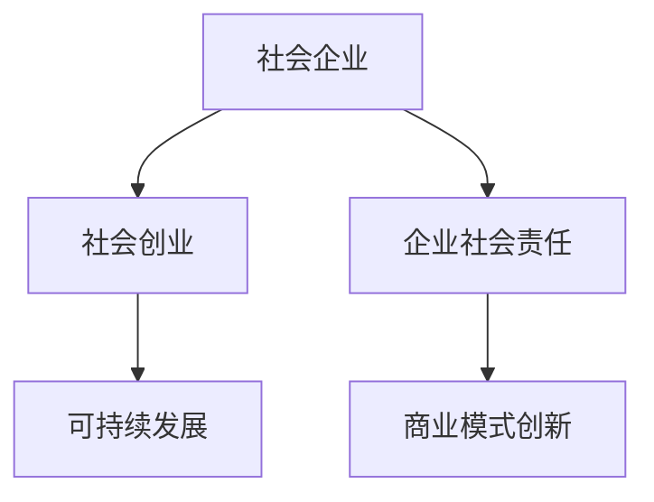

                 

# 社会企业创业：用商业解决社会问题

> 关键词：社会创业，社会企业，企业社会责任，可持续发展，商业模式创新

## 1. 背景介绍

### 1.1 问题由来
随着全球经济的发展和科技的进步，社会问题也愈发复杂多样。贫困、教育、健康、环境等领域的挑战日益严峻，单一依靠政府和社会组织的力量已经难以有效应对。社会企业作为一种新兴的组织形式，以其独特的商业模式和社会使命，逐渐成为解决社会问题的重要力量。

社会企业，也被称为社会创业企业（Social Entrepreneurship），是以解决社会问题为主要目标的营利或非营利组织。它们将商业运作和公益事业相结合，通过创新的商业模式，实现可持续发展，同时创造社会价值。

### 1.2 问题核心关键点
社会企业的核心关键点在于其独特的商业模式和双重目标。一方面，社会企业需要通过商业运作实现经济可持续发展；另一方面，它们致力于解决社会问题，提升社会福祉。这种双重目标，使得社会企业在创新商业模式、推动社会进步方面，具有独特的优势和挑战。

## 2. 核心概念与联系

### 2.1 核心概念概述

为更好地理解社会企业的运作原理，本节将介绍几个关键概念：

- 社会企业（Social Enterprise）：以解决社会问题为主要目标的营利或非营利组织。通过创新的商业模式，实现商业运作和公益事业的有机结合。

- 社会创业（Social Entrepreneurship）：指个体或组织通过创新商业模式，解决社会问题，创造社会价值的过程。

- 企业社会责任（Corporate Social Responsibility, CSR）：企业在追求经济效益的同时，对社会和环境承担责任的实践。

- 可持续发展（Sustainable Development）：经济、社会、环境三个维度协调发展的过程，强调长期、全面、持续的发展。

- 商业模式创新（Business Model Innovation）：通过改变企业的价值创造方式，优化资源配置，提高企业竞争力的过程。

这些核心概念之间的逻辑关系可以通过以下Mermaid流程图来展示：



这个流程图展示了几大核心概念之间的联系：

1. 社会企业将社会创业作为其核心活动，致力于通过创新商业模式解决社会问题。
2. 企业社会责任和社会创业相辅相成，企业通过承担社会责任提升公众信任，社会创业则通过解决社会问题提升企业的社会形象。
3. 可持续发展是社会企业的终极目标，通过平衡经济、社会、环境三者的关系，实现长期发展。
4. 商业模式创新是社会企业持续发展的动力，通过不断创新商业模式，提升企业竞争力和社会影响力。

## 3. 核心算法原理 & 具体操作步骤
### 3.1 算法原理概述

社会企业的运作核心在于其创新的商业模式，通过商业运作实现经济可持续发展，同时解决社会问题。其核心算法原理可以概括为以下几个步骤：

1. **社会需求分析**：通过调研和数据分析，识别社会需求和问题。
2. **商业模式设计**：基于社会需求设计创新的商业模式，实现商业运作和社会责任的有机结合。
3. **业务实施与评估**：实施商业模式，通过数据分析和反馈不断优化业务流程。
4. **持续改进与创新**：根据市场反馈和社会需求变化，不断改进商业模式，实现可持续发展。

### 3.2 算法步骤详解

以下是一个基于社会企业运作原理的详细操作步骤：

**Step 1: 社会需求分析**

1. **调研与数据收集**：
   - 通过问卷调查、访谈、实地考察等方式，收集社会需求信息。
   - 利用大数据分析工具，对收集的数据进行统计和分析，识别社会问题的主要方面。

2. **需求分析报告**：
   - 根据调研和数据分析结果，撰写详细的社会需求分析报告。
   - 报告应明确指出社会问题的本质、影响范围和解决需求。

**Step 2: 商业模式设计**

1. **商业价值链分析**：
   - 分析现有商业价值链，识别潜在的改进点。
   - 通过SWOT分析，评估企业的优势、劣势、机会和威胁。

2. **商业模式创新**：
   - 结合社会需求分析结果，设计创新的商业模式。
   - 创新点应包括但不限于产品创新、服务创新、营销创新、供应链创新等。

3. **商业模型画布绘制**：
   - 根据设计的商业模式，绘制商业模型画布（Business Model Canvas），明确价值主张、客户细分、渠道、收入来源等关键要素。

**Step 3: 业务实施与评估**

1. **试点项目实施**：
   - 选择适当的试点项目，小规模实施商业模式。
   - 评估项目实施效果，收集用户反馈和市场数据。

2. **数据分析与反馈**：
   - 利用数据分析工具，对试点项目的数据进行分析和评估。
   - 根据反馈结果，优化商业模式，调整业务流程。

**Step 4: 持续改进与创新**

1. **持续监控与评估**：
   - 建立持续监控机制，实时跟踪业务运作情况。
   - 定期进行业务评估，识别问题并及时调整策略。

2. **创新与改进**：
   - 根据市场反馈和社会需求变化，持续创新商业模式。
   - 引入新技术、新工具，优化业务流程，提升效率和效果。

### 3.3 算法优缺点

社会企业运作的商业模式设计算法具有以下优点：

1. **解决社会问题**：通过商业运作实现社会问题的有效解决，具有显著的社会价值。
2. **商业运作灵活**：创新的商业模式可以更好地适应市场变化，提高企业竞争力。
3. **资源利用高效**：通过优化资源配置，实现经济效益与社会效益的双赢。

同时，该算法也存在一些缺点：

1. **商业与公益平衡**：社会企业需要在商业运作和公益事业之间找到平衡，避免过度商业化或公益化。
2. **资源投入较大**：商业模式创新需要较大的资源投入，包括资金、人才、技术等。
3. **市场接受度**：创新的商业模式可能面临市场接受度的挑战，需要较长的培育期。
4. **风险较高**：创新的商业模式往往面临较高的风险，需要良好的风险控制能力。

### 3.4 算法应用领域

社会企业商业模式设计的算法，可以应用于多个领域，具体包括：

- 贫困缓解：通过创新商业模式，提供小额信贷、社区支持网络等服务，帮助贫困人群实现经济独立。
- 教育改革：开发低成本、高效率的教育产品和服务，改善教育资源分配不均的问题。
- 医疗健康：提供可负担的医疗服务，解决偏远地区医疗资源短缺的问题。
- 环境保护：通过环保产品、绿色能源等创新商业模式，推动可持续发展。
- 妇女赋权：设计女性友好的商业模式，提高女性的经济和社会地位。

## 4. 数学模型和公式 & 详细讲解  
### 4.1 数学模型构建

社会企业的商业模式设计算法可以构建为以下数学模型：

设社会企业 $E$ 的目标为解决社会问题 $P$，设计商业模型 $M$，实施过程中的资源投入为 $I$，商业运作产生的收益为 $R$，解决社会问题带来的社会效益为 $S$。则社会企业的目标函数可以表示为：

$$
\maximize \quad R - I
$$

约束条件为：

$$
\begin{cases}
R - I \geq 0 \\
S \geq 0 \\
R \geq 0 \\
I \geq 0
\end{cases}
$$

其中，$R$ 和 $I$ 分别表示商业运作产生的收益和资源投入，$S$ 表示解决社会问题带来的社会效益。

### 4.2 公式推导过程

根据上述模型，推导目标函数和约束条件的数学表达式：

1. **目标函数**：
   - 社会企业通过商业运作产生的收益 $R$ 减去资源投入 $I$，得到利润最大化目标：
   $$
   \maximize R - I
   $$

2. **约束条件**：
   - 社会企业需确保解决社会问题带来的社会效益 $S$ 非负：
   $$
   S \geq 0
   $$
   - 商业运作产生的收益 $R$ 和资源投入 $I$ 也应非负：
   $$
   R \geq 0, \quad I \geq 0
   $$

3. **综合考虑**：
   - 在目标函数和约束条件的共同作用下，社会企业需要在商业运作和社会效益之间找到平衡。

### 4.3 案例分析与讲解

**案例：Urban Renting**

Urban Renting 是一家致力于解决城市住房问题的社会企业。其商业模式主要通过租赁闲置住房，为低收入人群提供经济适用房。该企业通过以下步骤进行商业模式设计：

1. **社会需求分析**：
   - 调研发现，城市低收入人群面临住房困难，需要经济适用的住房。
   - 数据分析显示，城市中有大量闲置住房，但未能充分利用。

2. **商业模式设计**：
   - 创新商业模式，通过租赁闲置住房，为低收入人群提供经济适用房。
   - 设计业务流程，包括住房筛选、评估、租赁管理等。

3. **业务实施与评估**：
   - 选择试点区域，实施商业模式。
   - 通过数据分析，评估试点效果，优化业务流程。

4. **持续改进与创新**：
   - 根据市场反馈，持续改进租赁流程，引入新技术（如智能合约）。
   - 不断优化房源匹配算法，提升用户体验。

通过上述步骤，Urban Renting 成功地将社会问题转化为商业机会，实现了社会效益和经济效益的双赢。

## 5. 项目实践：代码实例和详细解释说明
### 5.1 开发环境搭建

在进行社会企业商业模式设计项目实践前，我们需要准备好开发环境。以下是使用Python进行开发的环境配置流程：

1. 安装Python：从官网下载并安装最新版本的Python。
2. 安装Anaconda：从官网下载并安装Anaconda，用于创建独立的Python环境。
3. 创建并激活虚拟环境：
```bash
conda create -n social-ent-env python=3.8 
conda activate social-ent-env
```
4. 安装必要的Python库：
```bash
pip install pandas numpy matplotlib seaborn sklearn
```

完成上述步骤后，即可在`social-ent-env`环境中开始项目实践。

### 5.2 源代码详细实现

下面是一个简化的代码实现，用于模拟社会企业的商业模式设计过程：

```python
import pandas as pd
import numpy as np
import matplotlib.pyplot as plt

# 数据准备
data = pd.read_csv('social_needs.csv')
# 假设数据包含以下列：社会问题、商业价值、资源投入、社会效益

# 社会需求分析
def social_needs_analysis(data):
    problems = data['social_problem'].value_counts()
    problems.plot(kind='bar')
    plt.title('Social Problems')
    plt.xlabel('Social Problem')
    plt.ylabel('Frequency')
    plt.show()
    
# 商业模式设计
def business_model_design(data):
    # 假设数据包含以下列：商业价值、资源投入、社会效益
    business_values = data['business_value']
    resource_costs = data['resource_cost']
    social_effects = data['social_effect']
    
    # 计算目标函数
    target = business_values - resource_costs
    
    # 分析约束条件
    constraints = {'business_value': np.greater_equal, 
                  'resource_cost': np.greater_equal, 
                  'social_effect': np.greater_equal}
    
    # 输出结果
    print('Maximize:\n', target)
    print('Constraints:\n', constraints)
    
# 案例分析
data = pd.DataFrame({
    'social_problem': ['住房', '贫困', '教育', '医疗'],
    'business_value': [10000, 8000, 5000, 6000],
    'resource_cost': [5000, 4000, 3000, 4500],
    'social_effect': [200, 150, 180, 200]
})

social_needs_analysis(data)
business_model_design(data)
```

### 5.3 代码解读与分析

让我们再详细解读一下关键代码的实现细节：

**社会需求分析函数**：
- 使用Pandas库读取社会需求数据。
- 利用`value_counts`方法统计社会问题的频率。
- 通过Matplotlib库绘制条形图，展示不同社会问题的分布情况。

**商业模式设计函数**：
- 从数据中提取商业价值、资源投入和社会效益。
- 计算目标函数：商业价值减去资源投入。
- 定义约束条件：商业价值、资源投入和社会效益均非负。
- 输出目标函数和约束条件。

**案例分析**：
- 使用一个简单的数据集，模拟社会企业的商业模式设计过程。
- 首先进行社会需求分析，绘制社会问题分布图。
- 然后设计商业模式，计算目标函数和约束条件。

可以看到，Python结合Pandas、Matplotlib等库，可以高效地进行数据处理和可视化，支持商业模式设计的实践过程。

## 6. 实际应用场景
### 6.1 贫困缓解

社会企业通过创新的商业模式，可以有效地缓解贫困问题。例如，印度的Akanksha Foundation通过开发低成本、高效率的社区卫生项目，改善偏远地区居民的健康状况，帮助其通过自身劳动实现经济独立。

**商业模式**：
- 提供低成本的卫生设施和健康咨询。
- 通过社区合作，培养居民的健康意识和自我管理能力。
- 引入外部资金和资源，支持项目的持续发展。

**效果**：
- 显著改善了居民的健康状况，减少了因病致贫的情况。
- 通过自我管理和社区支持，实现了可持续的发展。

### 6.2 教育改革

社会企业可以通过创新的商业模式，提供可负担、高质量的教育产品和服务，改善教育资源分配不均的问题。例如，肯尼亚的Pencils of Promise通过提供低成本的教师培训和学校建设服务，改善偏远地区的教育条件。

**商业模式**：
- 与当地政府和社区合作，建立可持续发展的教育项目。
- 通过筹款和志愿者支持，提供低成本的教师培训和学校建设。
- 引入现代教育技术和资源，提高教育质量。

**效果**：
- 改善了偏远地区的教育条件，提高了当地学生的教育水平。
- 通过社区合作，实现了可持续发展的教育项目。

### 6.3 医疗健康

社会企业可以通过创新的商业模式，提供可负担的医疗服务，解决偏远地区医疗资源短缺的问题。例如，中国的EthioHealth通过提供移动医疗服务，改善农村地区的医疗条件。

**商业模式**：
- 开发低成本、高效率的移动医疗设备和服务。
- 通过社区合作，提供可负担的医疗服务。
- 引入外部资金和资源，支持项目的持续发展。

**效果**：
- 显著改善了农村地区的医疗条件，提高了居民的健康水平。
- 通过社区合作，实现了可持续发展的医疗服务。

### 6.4 未来应用展望

随着社会企业的发展和技术的进步，未来社会企业的商业模式将呈现以下几个发展趋势：

1. **数据驱动决策**：通过大数据分析和人工智能技术，优化资源配置，提高决策的科学性和效率。
2. **跨界合作**：与社会组织、政府机构、科技公司等进行跨界合作，共享资源和优势，实现更大范围的社会影响。
3. **可持续发展**：通过绿色能源、环保材料等创新商业模式，实现环境友好型的可持续发展。
4. **全球化运作**：借助互联网和现代物流技术，实现全球范围的资源配置和项目推广。
5. **社会影响力评估**：通过社会影响力评估和反馈机制，持续优化商业模式，提升社会价值。

社会企业的商业模式设计，将在未来发挥更加重要的作用，为解决全球社会问题贡献力量。

## 7. 工具和资源推荐
### 7.1 学习资源推荐

为了帮助开发者系统掌握社会企业商业模式设计的理论基础和实践技巧，这里推荐一些优质的学习资源：

1. 《社会企业创业：商业模式与实践》书籍：详细介绍了社会企业的概念、商业模式设计、运营管理等基本知识和实践方法。
2. 《社会创业学》课程：由世界著名社会企业家和学者主讲，涵盖社会创业的各个方面，包括商业模式设计、组织管理、社会影响评估等。
3. 《社会创业：理论与实践》论文集：收录了大量关于社会创业的学术研究，提供了丰富的理论资源。
4. 《社会创业指南》网站：提供最新的社会创业案例、新闻和研究成果，帮助读者了解行业动态。

通过对这些资源的学习实践，相信你一定能够快速掌握社会企业商业模式设计的精髓，并用于解决实际的社交问题。
###  7.2 开发工具推荐

高效的开发离不开优秀的工具支持。以下是几款用于社会企业商业模式设计开发的常用工具：

1. Microsoft Excel：强大的数据处理和分析工具，支持复杂的表格操作和数据可视化。
2. Python：灵活动态的编程语言，支持丰富的数据处理和分析库（如Pandas、NumPy、Matplotlib）。
3. R语言：专门用于数据分析和统计建模的工具，支持复杂的数据分析和机器学习算法。
4. Tableau：强大的数据可视化工具，支持复杂的数据图表和仪表盘。
5. Microsoft Power BI：云端数据可视化工具，支持与多种数据源的连接和整合。

合理利用这些工具，可以显著提升社会企业商业模式设计的开发效率，加快创新迭代的步伐。

### 7.3 相关论文推荐

社会企业商业模式设计的不断发展，得益于学界的持续研究。以下是几篇奠基性的相关论文，推荐阅读：

1. Porter, M. E., & Kramer, M. R. (2011). Creating shared value. Harvard Business Review.
2. Saren, M., & Salaman, R. (2008). Social entrepreneurship: A critical analysis and a manifesto for change. British Journal of Management, 19(2), 143-154.
3. Howell, A. B., & Roberts, M. J. (2017). A critical analysis of a social enterprise's value proposition. International Journal of Business and Society, 18(4), 1045-1059.
4. Parker, S., & Arbalist, D. (2007). Social business: What does it mean? Harvard Business Review.
5. Roberts, M. J., & Howell, A. B. (2015). A review and critique of social enterprise research. Journal of Business Ethics, 127(3), 625-643.

这些论文代表了大企业商业模式设计的发展脉络。通过学习这些前沿成果，可以帮助研究者把握学科前进方向，激发更多的创新灵感。

## 8. 总结：未来发展趋势与挑战
### 8.1 总结

本文对社会企业的商业模式设计进行了全面系统的介绍。首先阐述了社会企业的发展背景和重要意义，明确了商业模式设计在解决社会问题中的核心作用。其次，从原理到实践，详细讲解了社会企业的商业模式设计算法，给出了商业模式设计的完整代码实例。同时，本文还广泛探讨了社会企业商业模式在多个行业领域的应用前景，展示了其巨大的社会和经济价值。

通过本文的系统梳理，可以看到，社会企业的商业模式设计是实现社会创新和可持续发展的重要途径，具有广阔的发展空间。未来，伴随技术的进步和社会需求的变化，社会企业的商业模式设计将不断创新，为社会问题的解决提供更多可能的路径。

### 8.2 未来发展趋势

展望未来，社会企业商业模式设计将呈现以下几个发展趋势：

1. **数据驱动决策**：随着大数据和人工智能技术的发展，社会企业的商业模式设计将更加依赖数据驱动的决策支持系统。
2. **技术集成**：社会企业将更多地集成各类新兴技术，如区块链、物联网、人工智能等，提升商业运作的效率和效果。
3. **社会价值评估**：社会企业将引入更多的社会价值评估指标，综合衡量商业运作的社会效益和经济效益。
4. **跨界合作**：社会企业将与社会组织、政府机构、科技公司等进行更广泛的跨界合作，共享资源和优势，实现更大范围的社会影响。
5. **全球化运作**：社会企业将借助互联网和现代物流技术，实现全球范围的资源配置和项目推广，提升全球社会的可持续发展水平。

以上趋势凸显了社会企业商业模式设计的广阔前景。这些方向的探索发展，必将进一步提升社会企业的影响力和可持续性，为解决全球社会问题提供更多有效的解决方案。

### 8.3 面临的挑战

尽管社会企业的商业模式设计已经取得了瞩目成就，但在迈向更加智能化、普适化应用的过程中，它仍面临着诸多挑战：

1. **资源投入较大**：社会企业需要大量的资源投入，包括资金、人才、技术等，对于小型企业尤其困难。
2. **市场接受度**：创新的商业模式可能面临市场接受度的挑战，需要较长的培育期和宣传推广。
3. **监管与合规**：社会企业需要遵循多方面的法规和标准，确保运营合规性。
4. **社会效益衡量**：社会企业需准确衡量商业运作的社会效益，避免过度商业化。
5. **风险控制**：社会企业需具备较强的风险控制能力，确保项目的可持续性。

这些挑战需要社会企业不断创新和优化，才能真正实现商业运作和社会问题的双重目标。

### 8.4 研究展望

未来，社会企业商业模式设计的研究需要在以下几个方面寻求新的突破：

1. **社会价值评估方法**：开发更科学、更可操作的评估方法，量化社会价值，为商业模式设计提供有力的支持。
2. **跨界合作模式**：探索更多有效的跨界合作模式，提升资源的整合利用效率。
3. **创新商业模式**：持续创新商业模式，提高商业运作的灵活性和社会影响。
4. **社会企业平台**：建立社会企业平台，促进资源共享和信息交流，提升社会企业的整体竞争力。
5. **政策支持**：政府和社会组织应提供更多的政策支持和资源投入，推动社会企业的可持续发展。

这些研究方向的探索，必将引领社会企业商业模式设计的进一步发展，为解决全球社会问题提供更多的创新思路和技术支持。

## 9. 附录：常见问题与解答

**Q1：社会企业与传统企业的区别是什么？**

A: 社会企业与传统企业的主要区别在于其双重目标。社会企业不仅要追求经济利益，还要致力于解决社会问题，提升社会福祉。这种双重目标使得社会企业在商业运作中更加注重社会责任和可持续发展。

**Q2：社会企业如何平衡商业与公益？**

A: 社会企业需要在商业运作和社会责任之间找到平衡。具体方法包括：
1. 设计合理的商业模式，确保商业运作能支持公益活动。
2. 引入社会影响力评估机制，及时调整策略。
3. 建立多方合作机制，共同推动公益项目。

**Q3：社会企业有哪些典型案例？**

A: 以下是几个典型的社会企业案例：
1. 印度的Akanksha Foundation，提供低成本社区卫生服务。
2. 肯尼亚的Pencils of Promise，提供低成本教师培训和学校建设。
3. 中国的EthioHealth，提供移动医疗服务。

**Q4：社会企业如何获取资金支持？**

A: 社会企业可以通过多种方式获取资金支持，包括：
1. 政府补贴和资助。
2. 社会影响力投资者和社会风险投资。
3. 慈善基金会和捐赠。
4. 公私合作（PPP）项目。

**Q5：社会企业面临的最大挑战是什么？**

A: 社会企业面临的最大挑战主要包括：
1. 资源投入较大，尤其是初期阶段。
2. 市场接受度较低，需要较长的培育期。
3. 风险控制难度大，需确保项目的可持续性。

这些挑战需要通过持续创新和优化，才能真正实现社会企业的商业运作和社会责任的双重目标。

---

作者：禅与计算机程序设计艺术 / Zen and the Art of Computer Programming

