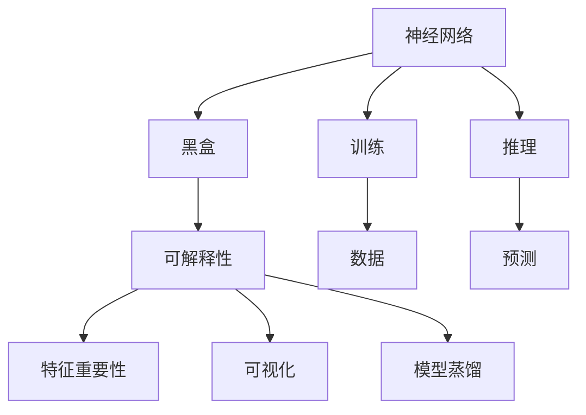

                 

# 神经网络可解释性：揭开AI黑盒的面纱

> 关键词：可解释性,人工智能,神经网络,决策透明度,复杂模型

## 1. 背景介绍

### 1.1 问题由来
在人工智能领域，尤其是深度学习技术中，神经网络被广泛应用于图像识别、语音识别、自然语言处理、推荐系统等各种复杂任务，并取得了显著成效。然而，神经网络通常被视为"黑盒"，其内部机制和决策过程难以直观理解，这不仅限制了其应用范围，也引发了诸多伦理和安全问题。

随着深度学习技术的发展，其在医疗、金融、司法等高风险领域的应用越来越广泛。如何提升神经网络的决策透明度，保障其输出结果的可解释性和可审计性，成为当前学术界和产业界共同关注的热点问题。

### 1.2 问题核心关键点
神经网络的可解释性问题，主要集中在以下几个方面：
1. 黑盒模型：神经网络由大量参数组成，难以直观理解其内部逻辑。
2. 复杂决策：神经网络通过多层次的非线性变换，做出复杂的决策。
3. 特征屏蔽：输入数据中对决策有重要影响的特征，可能被模型屏蔽或误解。
4. 难以调试：神经网络的结构复杂，难以对特定问题进行针对性的调优。

为了应对这些挑战，研究者提出了多种可解释性方法，如特征重要性评估、模型可视化、模型简化、模型蒸馏等，力求通过不同手段提升神经网络的透明度，从而增强其可信度。

### 1.3 问题研究意义
神经网络的可解释性研究，对于提升模型的可信度、可控性和可解释性具有重要意义：

1. 增强决策透明度：通过可解释性技术，能够直观地理解模型决策依据，提升模型的可信度，避免误判和滥用。
2. 促进公平公正：可解释性分析有助于揭示模型偏见和漏洞，从而减少对特定群体的歧视，实现公平公正的决策。
3. 支持监管合规：在金融、医疗等监管严格领域，可解释性是合规性要求的重要组成部分，必须确保模型输出的可解释性。
4. 提供调试依据：可解释性分析可以作为模型调优的依据，帮助开发者理解模型缺陷，进行针对性地改进。
5. 降低模型风险：通过可解释性分析，可以检测模型的脆弱性和鲁棒性，减少意外失效的风险。

## 2. 核心概念与联系

### 2.1 核心概念概述

为了更好地理解神经网络的可解释性问题，本节将介绍几个密切相关的核心概念：

- 神经网络(Neural Network, NN)：一种通过大量参数组成的复杂函数，能够逼近任意函数映射。
- 黑盒(Black Box)：由于神经网络结构复杂，难以直观理解其内部逻辑，故被形象地称为"黑盒"。
- 可解释性(Explainability)：指对模型的决策过程和输出结果进行解释和分析，以增强其透明度和可信度。
- 特征重要性(Feature Importance)：指输入数据中对模型决策有重要影响的特征。
- 可视化(Visualization)：通过图形化手段展示模型内部状态和决策过程，增强其可理解性。
- 模型蒸馏(Model Distillation)：将复杂模型转化为简单模型，通过知识传递提升模型性能和可解释性。

这些核心概念之间的逻辑关系可以通过以下Mermaid流程图来展示：



这个流程图展示了几类关键概念及其之间的关系：

1. 神经网络通过训练和推理得到模型输出。
2. 由于结构复杂，神经网络通常被视为"黑盒"，难以直观理解其内部机制。
3. 可解释性技术通过特征重要性、可视化、模型蒸馏等手段，揭示模型决策依据，增强其透明度。
4. 特征重要性分析通过统计和可视化方法，揭示对决策有重要影响的输入特征。
5. 可视化技术通过图形化手段展示模型决策过程和特征作用，增强可理解性。
6. 模型蒸馏通过知识传递，将复杂模型转化为简单模型，提升可解释性。

这些概念共同构成了神经网络可解释性的研究框架，为提升模型透明度提供了多种方法。

## 3. 核心算法原理 & 具体操作步骤
### 3.1 算法原理概述

神经网络的可解释性研究，主要聚焦于以下几个方面：

- 特征重要性分析：识别输入特征对模型输出的贡献度，帮助理解模型决策依据。
- 可视化技术：通过图形化展示模型内部状态和决策过程，增强可理解性。
- 模型简化与蒸馏：通过知识传递，将复杂模型转化为简单模型，提升可解释性。

这些方法的共同目标，是增强神经网络的透明度，使其决策过程更加透明和可信。

### 3.2 算法步骤详解

#### 3.2.1 特征重要性分析

特征重要性分析是理解神经网络决策的关键手段之一，常用的方法包括：

- 全局敏感度分析：评估输入数据变化对模型输出的影响。
- SHAP值(Shapley Value)：通过全局敏感度分析，计算各个特征对模型输出的贡献度。
- 局部敏感度分析：评估特定样本特征变化对模型输出的影响。
- Grad-CAM和Grad-CAM++：通过计算梯度，展示特征在决策中的权重。

**操作步骤**：
1. 计算模型对每个输入特征的梯度，使用反向传播算法得到。
2. 计算每个特征的SHAP值或LIME值，表示其在模型输出中的重要性。
3. 可视化特征权重，通过热图、散点图等形式展示。

#### 3.2.2 可视化技术

可视化技术通过图形化手段展示模型内部状态和决策过程，增强可理解性。常用的方法包括：

- 特征重要性热图：展示每个输入特征对模型输出的贡献度。
- 注意力机制图：展示模型在处理每个样本时的注意力分布。
- 梯度图和梯度热图：展示模型在处理每个样本时梯度的变化情况。
- 激活图：展示模型在处理每个样本时各层的激活情况。

**操作步骤**：
1. 使用激活图、注意力图等可视化技术，展示模型在处理样本时的内部状态。
2. 通过热图、散点图等形式展示特征重要性。
3. 使用梯度图、梯度热图等形式展示模型对特征的敏感度。

#### 3.2.3 模型简化与蒸馏

模型简化与蒸馏是通过知识传递，将复杂模型转化为简单模型，提升可解释性。常用的方法包括：

- 知识蒸馏：通过将复杂模型的知识传递给简单模型，提升其性能。
- 剪枝与量化：通过剪枝和量化技术，减少模型复杂度，提高推理效率。

**操作步骤**：
1. 选择复杂模型进行知识蒸馏，得到简单模型。
2. 使用剪枝和量化技术，减少模型复杂度。
3. 评估简化后的模型性能，验证其有效性。

### 3.3 算法优缺点

特征重要性分析、可视化技术和模型简化方法的优缺点如下：

#### 3.3.1 特征重要性分析
**优点**：
1. 提供特征贡献度：通过特征重要性分析，可以直观地理解各个特征对模型输出的贡献度，帮助理解模型决策依据。
2. 可视化展示：通过热图、散点图等形式，可以直观展示特征重要性。

**缺点**：
1. 计算复杂度高：特征重要性分析通常需要计算模型对每个特征的梯度，计算复杂度较高。
2. 不适用于复杂模型：对于结构复杂、参数量大的模型，特征重要性分析的效果有限。

#### 3.3.2 可视化技术
**优点**：
1. 直观展示决策过程：通过可视化技术，可以直观展示模型内部状态和决策过程，增强可理解性。
2. 支持多角度分析：可视化技术支持多角度分析，包括特征重要性、注意力分布等。

**缺点**：
1. 依赖数据：可视化技术的有效性很大程度上依赖于数据的多样性和复杂性。
2. 解释能力有限：可视化技术仅展示模型内部状态，难以深入理解模型内部机制。

#### 3.3.3 模型简化与蒸馏
**优点**：
1. 降低模型复杂度：通过剪枝和量化技术，可以降低模型复杂度，提高推理效率。
2. 保留关键特征：知识蒸馏技术可以在简化模型的同时，保留关键特征，确保模型性能。

**缺点**：
1. 潜在信息损失：模型简化和蒸馏过程中，可能丢失部分关键信息，影响模型性能。
2. 复杂技术要求：模型简化和蒸馏需要复杂的优化技术，增加了实现难度。

### 3.4 算法应用领域

神经网络的可解释性方法，已在多个领域得到广泛应用，包括但不限于以下几个：

- 医疗诊断：通过可解释性分析，帮助医生理解模型诊断依据，提升诊断可信度。
- 金融风险评估：通过可解释性分析，揭示模型偏见和漏洞，提升风险评估的公平性和透明性。
- 法律智能：通过可解释性分析，帮助法官理解模型判决依据，增强判决的公正性。
- 自动驾驶：通过可解释性分析，理解模型决策依据，提升自动驾驶系统的可信度。
- 自然语言处理：通过可解释性分析，理解模型文本生成逻辑，增强文本生成的透明度。

这些领域的应用展示了神经网络可解释性的广阔前景，提升了神经网络的实际应用价值。

## 4. 数学模型和公式 & 详细讲解 & 举例说明
### 4.1 数学模型构建

为了更好地理解神经网络可解释性分析的方法，本节将使用数学语言对特征重要性分析、可视化技术和模型简化进行详细阐述。

假设神经网络模型为 $f(x; \theta)$，其中 $x$ 为输入数据，$\theta$ 为模型参数。

### 4.2 公式推导过程

#### 4.2.1 特征重要性分析

假设模型 $f(x; \theta)$ 对输入数据 $x$ 的输出为 $y$。特征重要性分析的目标是计算每个特征 $x_i$ 对模型输出的贡献度。

**全局敏感度分析**：

$$
S_i = \mathbb{E}_{\epsilon \sim \mathcal{N}(0, \sigma^2)} [|f(x; \theta) - f(x'_i; \theta)|]
$$

其中 $x'_i$ 为输入 $x$ 的第 $i$ 个特征，$\sigma^2$ 为噪声方差。

**SHAP值**：

$$
\phi_i = \frac{1}{n} \sum_{k=1}^n (y_k - y_k') + \frac{1}{n} \sum_{k=1}^n (y_k - y_k')^2 \frac{1}{n \sigma^2}
$$

其中 $y_k$ 为模型对第 $k$ 个样本的预测，$y_k'$ 为将第 $i$ 个特征替换为随机噪声后的预测。

**局部敏感度分析**：

$$
S_i(x) = \frac{1}{\sigma^2} (f(x; \theta) - f(x'_i; \theta))
$$

其中 $x'_i$ 为输入 $x$ 的第 $i$ 个特征，$\sigma^2$ 为噪声方差。

#### 4.2.2 可视化技术

**注意力机制图**：

假设模型 $f(x; \theta)$ 的注意力机制为 $A(x; \theta)$，表示模型对输入数据的注意力分布。注意力图可以展示模型在处理每个样本时的注意力分布情况。

**梯度图和梯度热图**：

假设模型 $f(x; \theta)$ 的输出为 $y$，则梯度图为：

$$
G(x) = \nabla_{x} f(x; \theta)
$$

梯度热图为：

$$
G(x) \odot \nabla_{x} f(x; \theta)
$$

其中 $\odot$ 为元素乘法运算符。

**激活图**：

假设模型 $f(x; \theta)$ 的隐藏层表示为 $h(x; \theta)$，则激活图为：

$$
H(x) = \nabla_{x} f(x; \theta) \odot \nabla_{h} f(x; \theta)
$$

其中 $\odot$ 为元素乘法运算符。

#### 4.2.3 模型简化与蒸馏

**知识蒸馏**：

假设复杂模型 $f_c(x; \theta_c)$ 和简单模型 $f_s(x; \theta_s)$ 都具有相同的输入 $x$ 和输出 $y$，则知识蒸馏的目标是：

$$
\min_{\theta_s} D(f_c(x; \theta_c), f_s(x; \theta_s)) + KL(D(f_c(x; \theta_c), f_s(x; \theta_s)))
$$

其中 $D$ 为模型预测与真实标签之间的距离，$KL$ 为模型预测与真实标签之间的KL散度。

**剪枝与量化**：

假设模型 $f(x; \theta)$ 的权重矩阵为 $W$，则剪枝的目标是去除不重要的权重，简化模型结构。量化是将模型权重从浮点数表示改为定点数表示，以提高计算效率。

## 5. 项目实践：代码实例和详细解释说明
### 5.1 开发环境搭建

在进行神经网络可解释性分析的实践前，我们需要准备好开发环境。以下是使用Python进行TensorFlow开发的环境配置流程：

1. 安装Anaconda：从官网下载并安装Anaconda，用于创建独立的Python环境。

2. 创建并激活虚拟环境：
```bash
conda create -n tensorflow-env python=3.8 
conda activate tensorflow-env
```

3. 安装TensorFlow：根据CUDA版本，从官网获取对应的安装命令。例如：
```bash
conda install tensorflow==2.8 -c conda-forge
```

4. 安装各类工具包：
```bash
pip install numpy pandas scikit-learn matplotlib tqdm jupyter notebook ipython
```

完成上述步骤后，即可在`tensorflow-env`环境中开始实践。

### 5.2 源代码详细实现

下面以特征重要性分析为例，给出使用TensorFlow进行可解释性分析的Python代码实现。

首先，定义特征重要性分析的函数：

```python
import tensorflow as tf
import numpy as np

def feature_importance_analysis(model, X, y):
    # 计算模型对每个特征的梯度
    with tf.GradientTape() as tape:
        tape.watch(X)
        y_pred = model(X, y)
    grads = tape.gradient(y_pred, X)

    # 计算每个特征的SHAP值
    shap_values = np.zeros((X.shape[0], X.shape[1]))
    for i in range(X.shape[1]):
        X_i = np.delete(X, i, axis=1)
        y_pred_i = model(X_i, y)
        shap_values[:, i] = y_pred - y_pred_i

    return grads, shap_values
```

然后，定义模型的训练和评估函数：

```python
from sklearn.datasets import make_classification
from sklearn.model_selection import train_test_split
from sklearn.linear_model import LogisticRegression

def train_model(X, y, batch_size, epochs):
    X_train, X_val, y_train, y_val = train_test_split(X, y, test_size=0.2)
    model = LogisticRegression(solver='lbfgs')
    model.fit(X_train, y_train)
    
    return model

def evaluate_model(model, X_val, y_val):
    y_pred = model.predict(X_val)
    accuracy = np.mean(y_pred == y_val)
    print("Accuracy:", accuracy)

# 数据生成
X, y = make_classification(n_samples=1000, n_features=10, random_state=42)
X_train, X_val, y_train, y_val = train_test_split(X, y, test_size=0.2)

# 模型训练
model = train_model(X_train, y_train, batch_size=32, epochs=10)

# 特征重要性分析
grads, shap_values = feature_importance_analysis(model, X_train, y_train)
```

最后，在验证集上评估模型：

```python
evaluate_model(model, X_val, y_val)
```

以上就是使用TensorFlow进行特征重要性分析的完整代码实现。可以看到，借助TensorFlow的自动微分功能，可以高效地计算模型对每个特征的梯度，进而得到SHAP值。

### 5.3 代码解读与分析

让我们再详细解读一下关键代码的实现细节：

**train_model函数**：
- 使用Scikit-learn的make_classification函数生成合成数据。
- 使用LogisticRegression模型进行训练，并返回训练好的模型。

**evaluate_model函数**：
- 使用模型在验证集上进行预测，并计算预测准确率。

**feature_importance_analysis函数**：
- 使用TensorFlow的GradientTape记录梯度。
- 计算模型对每个特征的梯度，并计算SHAP值。
- 返回梯度和SHAP值。

**train_model函数**：
- 使用train_test_split函数将数据集划分为训练集和验证集。
- 使用LogisticRegression模型进行训练，并返回训练好的模型。

**evaluate_model函数**：
- 使用模型在验证集上进行预测，并计算预测准确率。

在实际应用中，还需要根据具体任务选择合适的可解释性分析方法，并结合可视化技术和模型简化方法，进行多角度分析。通过不断迭代和优化，可以提升神经网络的透明度和可信度，增强其在实际应用中的价值。

## 6. 实际应用场景
### 6.1 医疗诊断

在医疗领域，基于神经网络的可解释性分析，可以用于提升诊断的透明性和可信度。医疗数据通常具有高度复杂性和多样性，神经网络模型可以学习到患者特征与疾病之间的关系，但模型的决策过程难以直观理解。

通过特征重要性分析，可以揭示输入数据中对诊断有重要影响的特征，帮助医生理解模型决策依据。例如，通过可视化技术展示注意力机制图，可以直观展示模型在处理每个样本时的注意力分布，增强医生的理解。

### 6.2 金融风险评估

在金融领域，基于神经网络的可解释性分析，可以用于提升风险评估的透明性和公平性。金融数据通常具有高度复杂性和高维度，神经网络模型可以学习到用户特征与风险之间的关系，但模型的决策过程难以直观理解。

通过特征重要性分析，可以揭示输入数据中对风险评估有重要影响的特征，帮助评估者理解模型决策依据。例如，通过可视化技术展示梯度图和梯度热图，可以直观展示模型对特征的敏感度，增强评估的公平性和透明性。

### 6.3 法律智能

在法律领域，基于神经网络的可解释性分析，可以用于提升判决的透明性和公正性。法律数据通常具有高度复杂性和高维度，神经网络模型可以学习到案件特征与判决之间的关系，但模型的决策过程难以直观理解。

通过特征重要性分析，可以揭示输入数据中对判决有重要影响的特征，帮助法官理解模型决策依据。例如，通过可视化技术展示激活图，可以直观展示模型在处理每个样本时的激活情况，增强判决的公正性。

### 6.4 自动驾驶

在自动驾驶领域，基于神经网络的可解释性分析，可以用于提升驾驶的透明性和安全性。自动驾驶数据通常具有高度复杂性和高维度，神经网络模型可以学习到车辆状态与驾驶策略之间的关系，但模型的决策过程难以直观理解。

通过特征重要性分析，可以揭示输入数据中对驾驶策略有重要影响的特征，帮助驾驶系统理解模型决策依据。例如，通过可视化技术展示注意力机制图，可以直观展示模型在处理每个样本时的注意力分布，增强驾驶的安全性。

### 6.5 自然语言处理

在自然语言处理领域，基于神经网络的可解释性分析，可以用于提升文本生成的透明性和可信度。文本数据通常具有高度复杂性和高维度，神经网络模型可以学习到语义和语法之间的关系，但模型的决策过程难以直观理解。

通过特征重要性分析，可以揭示输入数据中对文本生成有重要影响的特征，帮助生成系统理解模型决策依据。例如，通过可视化技术展示注意力机制图，可以直观展示模型在处理每个样本时的注意力分布，增强文本生成的可信度。

## 7. 工具和资源推荐
### 7.1 学习资源推荐

为了帮助开发者系统掌握神经网络可解释性分析的理论基础和实践技巧，这里推荐一些优质的学习资源：

1. 《可解释的人工智能》书籍：由Finnual Ojala等人合著，系统介绍了可解释性技术的基本概念和应用方法。

2. CS229《机器学习》课程：斯坦福大学开设的经典课程，涵盖机器学习理论基础和实际应用案例。

3. NIPS 2015论文《A Unified Approach to Interpreting Model Predictions》：该论文提出了使用LIME方法进行特征重要性分析的技术，具有重要学术意义。

4. Kaggle比赛《Interpretable AI》：通过实际案例，展示了可解释性分析在实际应用中的使用方法。

5. TensorFlow官方文档：提供了大量可解释性分析的样例代码和文档，适合初学者入门学习。

通过对这些资源的学习实践，相信你一定能够快速掌握神经网络可解释性的精髓，并用于解决实际的AI问题。
### 7.2 开发工具推荐

高效的开发离不开优秀的工具支持。以下是几款用于神经网络可解释性分析开发的常用工具：

1. TensorFlow：基于Python的开源深度学习框架，提供了丰富的自动微分功能和可视化工具，支持复杂的神经网络模型。

2. PyTorch：基于Python的开源深度学习框架，灵活动态的计算图，适合快速迭代研究。

3. SHAP：可解释性分析工具，支持多种模型的特征重要性分析，提供可视化展示。

4. LIME：可解释性分析工具，支持多种模型的局部敏感度分析，提供可视化展示。

5. TAPAS：特征重要性分析工具，支持多种模型的全局敏感度分析，提供可视化展示。

6. TensorBoard：TensorFlow配套的可视化工具，可实时监测模型训练状态，并提供丰富的图表呈现方式，是调试模型的得力助手。

7. Weights & Biases：模型训练的实验跟踪工具，可以记录和可视化模型训练过程中的各项指标，方便对比和调优。

合理利用这些工具，可以显著提升神经网络可解释性分析的开发效率，加快创新迭代的步伐。

### 7.3 相关论文推荐

神经网络的可解释性研究源于学界的持续研究。以下是几篇奠基性的相关论文，推荐阅读：

1. LIME：A Unified Approach to Interpreting Model Predictions：提出了局部解释模型(LIME)，用于解释复杂模型的预测。

2. SHAP: A Unified Approach to Interpreting Model Predictions：提出SHAP值，用于解释复杂模型的预测。

3. Axiomatic Attribution for Deep Networks：提出影响力图(Attention)，用于解释深度神经网络的预测。

4. Deep Neural Network Architecture Search with Reinforcement Learning：提出强化学习的方法，用于搜索具有更好可解释性的神经网络架构。

5. A Beginner's Guide to SHAP：SHAP官方文档，详细介绍了SHAP值的计算方法和应用场景。

这些论文代表了大语言模型可解释性分析的发展脉络。通过学习这些前沿成果，可以帮助研究者把握学科前进方向，激发更多的创新灵感。

## 8. 总结：未来发展趋势与挑战
### 8.1 总结

本文对神经网络的可解释性问题进行了全面系统的介绍。首先阐述了神经网络的可解释性问题的研究背景和意义，明确了可解释性在提升模型可信度、公平性、透明性和监管合规方面的重要性。其次，从原理到实践，详细讲解了特征重要性分析、可视化技术和模型简化的方法，给出了神经网络可解释性分析的完整代码实例。同时，本文还广泛探讨了可解释性分析在医疗诊断、金融风险评估、法律智能、自动驾驶和自然语言处理等领域的实际应用场景，展示了可解释性分析的广阔前景。此外，本文精选了可解释性分析的各类学习资源，力求为读者提供全方位的技术指引。

通过本文的系统梳理，可以看到，神经网络的可解释性分析已经从理论走向实践，为提升模型的透明性和可信度提供了多种手段。未来，随着研究的不断深入和技术的持续进步，基于神经网络的可解释性分析将更加全面、高效、易用，为人工智能技术的广泛应用提供强有力的支持。

### 8.2 未来发展趋势

展望未来，神经网络的可解释性分析将呈现以下几个发展趋势：

1. 方法多样化和集成化：结合多种可解释性分析方法，综合利用全局敏感度、局部敏感度、SHAP值、LIME值等手段，提升可解释性分析的全面性和准确性。

2. 自动化和智能化：通过自动化工具和智能算法，自动选择最佳的解释方式，降低人工调参的复杂度，提高可解释性分析的效率。

3. 实时化和交互化：在实时环境中，结合可视化技术和交互式界面，增强可解释性分析的实时性和互动性，提升用户体验。

4. 多模态融合：结合文本、图像、语音等多种模态的数据，进行多模态可解释性分析，提升可解释性分析的多样性和全面性。

5. 安全性与伦理性：在可解释性分析中引入安全性和伦理性的约束，确保解释结果的公正性、可信性和伦理性。

以上趋势凸显了神经网络可解释性分析的广阔前景，为提升模型的透明性和可信度提供了更多可能性。

### 8.3 面临的挑战

尽管神经网络的可解释性分析已经取得了显著进展，但在迈向更加智能化、自动化和普及化的过程中，它仍面临着诸多挑战：

1. 计算复杂度高：复杂的可解释性分析方法，如特征重要性分析，通常需要较高的计算资源，对算力有较高的要求。

2. 解释能力有限：现有的可解释性分析方法，通常难以深入理解模型的内部机制，难以解释复杂决策过程。

3. 方法通用性不足：现有的可解释性分析方法，大多针对特定类型的数据和任务，通用性和普适性有限。

4. 可解释性分析的自动化和智能化程度不高，依赖人工调参和手动选择解释方法，效率较低。

5. 数据隐私和安全问题：可解释性分析需要访问大量的敏感数据，如何保护数据隐私和安全，是一个重要的研究方向。

6. 缺乏统一的标准和规范：可解释性分析方法众多，缺乏统一的标准和规范，导致不同方法的对比和应用存在困难。

正视可解释性分析面临的这些挑战，积极应对并寻求突破，将有助于推动神经网络技术在更多领域的应用。

### 8.4 研究展望

面对神经网络可解释性分析所面临的种种挑战，未来的研究需要在以下几个方面寻求新的突破：

1. 探索新的可解释性分析方法：开发更加高效、准确、易用的可解释性分析方法，提升可解释性分析的全面性和普适性。

2. 引入更多先验知识：将符号化的先验知识，如知识图谱、逻辑规则等，与神经网络模型进行巧妙融合，提升可解释性分析的准确性和可理解性。

3. 增强自动化和智能化程度：开发可解释性分析的自动化工具和智能算法，减少人工调参的复杂度，提高可解释性分析的效率和可靠性。

4. 提升可解释性分析的实时性和交互性：结合可视化技术和交互式界面，增强可解释性分析的实时性和互动性，提升用户体验。

5. 引入安全性和伦理性的约束：在可解释性分析中引入安全性和伦理性的约束，确保解释结果的公正性、可信性和伦理性。

这些研究方向的探索，必将引领神经网络可解释性分析技术迈向更高的台阶，为构建安全、可靠、可解释、可控的智能系统铺平道路。面向未来，神经网络可解释性分析技术还需要与其他人工智能技术进行更深入的融合，如知识表示、因果推理、强化学习等，多路径协同发力，共同推动人工智能技术的进步。只有勇于创新、敢于突破，才能不断拓展神经网络应用的边界，让智能技术更好地造福人类社会。

## 9. 附录：常见问题与解答

**Q1：神经网络为什么需要可解释性分析？**

A: 神经网络被视为"黑盒"，其内部机制和决策过程难以直观理解，这不仅限制了其应用范围，也引发了诸多伦理和安全问题。通过可解释性分析，可以提升模型的透明性和可信度，增强其在实际应用中的价值。

**Q2：神经网络的可解释性分析有哪些常用方法？**

A: 常用的神经网络可解释性分析方法包括特征重要性分析、可视化技术和模型简化。其中，特征重要性分析可以揭示输入数据中对模型输出的贡献度，可视化技术可以直观展示模型内部状态和决策过程，模型简化可以通过剪枝和量化技术，减少模型复杂度，提升推理效率。

**Q3：如何进行神经网络的特征重要性分析？**

A: 神经网络的特征重要性分析通常涉及全局敏感度分析、局部敏感度分析和SHAP值计算。具体步骤如下：1) 计算模型对每个特征的梯度；2) 计算每个特征的SHAP值；3) 可视化特征重要性，通过热图、散点图等形式展示。

**Q4：如何使用可视化技术提升神经网络的透明性？**

A: 可视化技术可以通过特征重要性热图、注意力机制图、梯度图和梯度热图等形式，直观展示模型内部状态和决策过程，增强可理解性。具体步骤如下：1) 使用可视化工具，展示模型在处理每个样本时的内部状态；2) 通过热图、散点图等形式，展示特征重要性；3) 使用梯度图、梯度热图等形式，展示模型对特征的敏感度。

**Q5：如何进行神经网络的模型简化？**

A: 神经网络的模型简化通常涉及剪枝和量化技术。具体步骤如下：1) 使用剪枝技术，去除不重要的权重；2) 使用量化技术，将模型权重从浮点数表示改为定点数表示，以提高计算效率。

**Q6：神经网络可解释性分析在实际应用中需要注意哪些问题？**

A: 神经网络可解释性分析在实际应用中需要注意以下问题：1) 计算复杂度高，需要高性能的计算资源；2) 解释能力有限，难以深入理解复杂决策过程；3) 方法通用性不足，需要针对具体任务进行优化；4) 可解释性分析的自动化和智能化程度不高，依赖人工调参和手动选择解释方法；5) 数据隐私和安全问题，如何保护敏感数据；6) 缺乏统一的标准和规范，不同方法的对比和应用存在困难。

通过深入理解这些问题，并积极应对，可以进一步提升神经网络的透明性和可信度，推动其广泛应用于各个领域。

