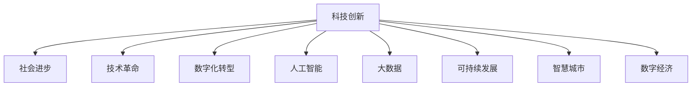

                 

# 科技创新：社会进步的阶梯

> 关键词：科技创新,社会进步,技术革命,数字化转型,人工智能,大数据,可持续发展,智慧城市,数字经济

## 1. 背景介绍

### 1.1 问题由来
自工业革命以来，科技创新一直是推动社会进步的重要动力。从蒸汽机的发明到电力的广泛应用，再到信息技术的飞速发展，科技创新不断塑造着人类社会的面貌。进入21世纪，随着信息技术的迅猛发展，科技创新迎来了新的历史节点。人工智能(AI)、大数据(Big Data)、物联网(IoT)、区块链等前沿技术在各行各业的应用，正深刻影响着人类的生产生活方式。

然而，科技创新的双刃剑效应也日益凸显。科技在带来便利的同时，也可能带来隐私泄露、网络安全、伦理道德等负面问题。如何在保障科技创新的同时，有效应对这些挑战，是当前社会亟需解决的问题。

### 1.2 问题核心关键点
科技创新如何与社会进步相结合，既是大数据时代的重要课题，也是智能时代的关键议题。本文聚焦于科技创新与社会发展之间的关系，探讨科技创新如何引领社会进步，以及科技创新面临的挑战和未来趋势。

## 2. 核心概念与联系

### 2.1 核心概念概述

为更好地理解科技创新与社会进步之间的关系，本节将介绍几个密切相关的核心概念：

- 科技创新(Science and Technology Innovation)：指通过科学研究和技术发明，创造出新产品、新工艺、新服务的过程。科技创新是社会进步的引擎，推动经济增长，提升生活质量。
- 社会进步(Social Progress)：指社会各方面条件的改善和提高，包括经济、教育、卫生、环境等方面。社会进步是科技创新的目标和动力。
- 技术革命(Industrial Revolution)：指以新技术为核心的产业结构调整和生产方式变革。技术革命是推动社会进步的重要里程碑。
- 数字化转型(Digital Transformation)：指通过数字化手段，优化和创新企业运营管理流程，提升业务效率和竞争力的过程。数字化转型是科技创新的重要应用领域。
- 人工智能(Artificial Intelligence)：指通过算法和模型，使机器具备人类智能，实现自主学习、推理、决策的能力。人工智能是当前科技创新的核心方向。
- 大数据(Big Data)：指大规模、多样化的数据集，通过数据挖掘、分析、处理等技术，挖掘数据背后的价值。大数据是支持人工智能和决策支持的重要资源。
- 可持续发展(Sustainable Development)：指满足当前社会需求，同时不损害未来世代满足自身需求的能力。可持续发展是科技创新追求的重要目标。
- 智慧城市(Smart City)：指通过信息技术，实现城市管理智能化、生活便捷化、环境友好化的城市。智慧城市是科技创新在城市管理中的应用。
- 数字经济(Digital Economy)：指基于数字技术，通过互联网和信息通信技术，推动经济活动和商业模式创新的经济形态。数字经济是当前全球经济的重要组成部分。

这些核心概念之间的逻辑关系可以通过以下Mermaid流程图来展示：



这个流程图展示了这个核心概念框架：科技创新通过技术革命、数字化转型、人工智能、大数据等具体实现形式，推动社会进步，同时实现可持续发展、智慧城市和数字经济等目标。

## 3. 核心算法原理 & 具体操作步骤
### 3.1 算法原理概述

科技创新推动社会进步的逻辑框架，可以从以下几个方面进行理解：

1. **技术创新**：通过科学研究和技术发明，创造出新技术和新产品，提升生产效率和产品质量。
2. **应用扩散**：新技术和新产品在各个行业的应用和推广，促进产业结构调整和生产方式变革，形成技术革命。
3. **社会变革**：技术革命带来经济增长、就业变化、生活方式变革，推动社会进步。
4. **可持续发展**：科技创新在追求经济效益的同时，注重环境保护、资源节约，实现可持续发展。

科技创新与社会进步之间的关系，是一个双向互动的过程。科技创新通过技术发明和应用扩散，推动社会进步；社会进步的需求和挑战，又推动科技创新不断迭代和进步。

### 3.2 算法步骤详解

科技创新推动社会进步的算法步骤，包括以下几个关键步骤：

**Step 1: 确定科技创新目标**
- 根据社会进步的需求，确定科技创新需要解决的核心问题和挑战。例如，环境保护、公共健康、教育公平等。

**Step 2: 进行科学研究和技术研发**
- 在确定目标后，组织科研团队进行技术攻关，开发新技术和新产品。例如，开发高效能的电池、低排放的汽车、精准的医学影像设备等。

**Step 3: 测试和验证**
- 对开发的新技术和新产品进行测试和验证，确保其有效性和可靠性。例如，通过实验室测试、试点项目、市场反馈等手段，评估技术的效果。

**Step 4: 推广和应用**
- 将经过测试和验证的新技术和新产品，推广应用到各个行业和领域。例如，推广新能源汽车、智慧医疗、在线教育等。

**Step 5: 持续改进和创新**
- 根据实际应用中的反馈和数据，持续改进和优化技术，推动更迭和创新。例如，通过大数据分析，不断提升算法性能，开发新功能等。

### 3.3 算法优缺点

科技创新推动社会进步的算法具有以下优点：

1. **高效性**：科技创新通过技术革命和数字化转型，可以快速提升生产效率和产品质量，带来经济增长和社会进步。
2. **广泛性**：科技创新可以应用于各个行业和领域，推动经济、教育、医疗、交通等多方面的进步。
3. **可持续性**：科技创新注重可持续发展，通过技术改进和资源节约，实现经济增长与环境保护的平衡。

同时，该算法也存在以下缺点：

1. **风险性**：科技创新具有不确定性，技术失败或应用不当可能带来经济损失和社会风险。
2. **资源依赖**：科技创新需要大量的资金、人才和资源投入，资源不足可能阻碍技术进步。
3. **伦理挑战**：科技创新带来的技术进步，可能引发隐私保护、伦理道德等社会问题，需要政策规范和技术保障。

尽管存在这些局限性，但就目前而言，科技创新仍然是推动社会进步的重要力量。未来相关研究的重点在于如何更好地平衡创新与风险，确保科技创新的正面效果。

### 3.4 算法应用领域

科技创新在各个领域的应用，正在不断拓展和深化。以下是一些典型领域的应用案例：

- **环保领域**：通过大数据和人工智能，优化能源使用、减少碳排放，实现绿色环保。
- **医疗领域**：利用机器学习和医疗影像技术，提升诊断准确率，推动精准医疗和个性化治疗。
- **教育领域**：借助在线教育平台和智能辅导系统，实现因材施教，提高教育质量。
- **金融领域**：应用区块链和智能合约技术，提高金融交易的透明度和安全性。
- **交通领域**：通过无人驾驶和智能交通管理，提升交通效率和安全性。
- **零售领域**：利用大数据和个性化推荐系统，优化商品推荐，提升用户体验。

这些应用案例展示了科技创新在推动社会进步中的广泛作用。随着技术的发展，未来科技创新将在更多领域带来革命性变化。

## 4. 数学模型和公式 & 详细讲解 & 举例说明
### 4.1 数学模型构建

科技创新推动社会进步的数学模型，可以从以下几个维度进行构建：

1. **经济效益模型**：通过生产函数和投入产出模型，衡量技术进步对经济增长的贡献。例如，柯布-道格拉斯生产函数：$Y = K^{\alpha}L^{\beta}A^{1-\alpha-\beta}$，其中$Y$为产出，$K$为资本，$L$为劳动，$A$为技术进步。
2. **社会效益模型**：通过生活质量指数和幸福感指标，评估技术进步对社会进步的影响。例如，幸福曲线模型，通过收集和分析社会指标数据，评估技术进步对生活质量的影响。
3. **环境保护模型**：通过环境库兹涅茨曲线和绿色GDP模型，衡量技术进步对环境保护和资源节约的贡献。例如，环境库兹涅茨曲线：$E = \beta + \gamma I + \delta T$，其中$E$为环境质量，$I$为工业化水平，$T$为技术进步。

### 4.2 公式推导过程

以下是几个典型的数学模型和公式的推导过程：

**柯布-道格拉斯生产函数**
$$
Y = K^{\alpha}L^{\beta}A^{1-\alpha-\beta}
$$
- $Y$表示产出，$K$表示资本，$L$表示劳动，$A$表示技术进步。
- 通过求解$\frac{\partial Y}{\partial A} > 0$，可以得出技术进步对经济增长具有正向作用。

**幸福曲线模型**
$$
H = \gamma \log(Q) + \delta \log(W) + \epsilon
$$
- $H$表示幸福感，$Q$表示生活质量，$W$表示工资水平，$\epsilon$表示误差项。
- 通过求解$\frac{\partial H}{\partial Q} > 0$，可以得出生活质量提升对幸福感具有正向作用。

**环境库兹涅茨曲线**
$$
E = \beta + \gamma I + \delta T
$$
- $E$表示环境质量，$I$表示工业化水平，$T$表示技术进步。
- 通过求解$\frac{\partial E}{\partial T} < 0$，可以得出技术进步对环境保护具有正向作用。

### 4.3 案例分析与讲解

以智慧医疗为例，分析科技创新在医疗领域的应用。

智慧医疗通过信息技术和大数据分析，实现医疗服务的智能化和个性化。其核心在于通过以下步骤：

1. **数据收集与处理**：收集患者医疗记录、基因数据、健康行为数据等，通过大数据分析技术，进行数据清洗和预处理。
2. **模型训练与优化**：利用机器学习算法，训练和优化疾病诊断、药物推荐等模型，提高诊断准确率和推荐效果。
3. **医疗决策支持**：将训练好的模型应用于临床决策，提供个性化的治疗方案和药物搭配，提升治疗效果。
4. **医疗质量监控**：通过实时监控系统，对医疗服务质量进行评估和优化，确保医疗服务的公平性和安全性。

智慧医疗通过科技创新，实现了医疗服务的数字化和智能化，提升了医疗效率和质量，推动了社会进步。

## 5. 项目实践：代码实例和详细解释说明
### 5.1 开发环境搭建

在进行科技创新推动社会进步的实践前，我们需要准备好开发环境。以下是使用Python进行PyTorch开发的环境配置流程：

1. 安装Anaconda：从官网下载并安装Anaconda，用于创建独立的Python环境。

2. 创建并激活虚拟环境：
```bash
conda create -n pytorch-env python=3.8 
conda activate pytorch-env
```

3. 安装PyTorch：根据CUDA版本，从官网获取对应的安装命令。例如：
```bash
conda install pytorch torchvision torchaudio cudatoolkit=11.1 -c pytorch -c conda-forge
```

4. 安装Transformers库：
```bash
pip install transformers
```

5. 安装各类工具包：
```bash
pip install numpy pandas scikit-learn matplotlib tqdm jupyter notebook ipython
```

完成上述步骤后，即可在`pytorch-env`环境中开始实践。

### 5.2 源代码详细实现

这里我们以智慧医疗为例，给出使用Transformers库进行疾病诊断模型的PyTorch代码实现。

首先，定义数据处理函数：

```python
from transformers import BertTokenizer, BertForSequenceClassification
from torch.utils.data import Dataset
import torch

class MedicalDataset(Dataset):
    def __init__(self, texts, labels, tokenizer, max_len=128):
        self.texts = texts
        self.labels = labels
        self.tokenizer = tokenizer
        self.max_len = max_len
        
    def __len__(self):
        return len(self.texts)
    
    def __getitem__(self, item):
        text = self.texts[item]
        label = self.labels[item]
        
        encoding = self.tokenizer(text, return_tensors='pt', max_length=self.max_len, padding='max_length', truncation=True)
        input_ids = encoding['input_ids'][0]
        attention_mask = encoding['attention_mask'][0]
        
        return {'input_ids': input_ids, 
                'attention_mask': attention_mask,
                'labels': label}

# 定义标签与id的映射
tag2id = {'Negative': 0, 'Positive': 1}
id2tag = {v: k for k, v in tag2id.items()}

# 创建dataset
tokenizer = BertTokenizer.from_pretrained('bert-base-cased')

train_dataset = MedicalDataset(train_texts, train_labels, tokenizer)
dev_dataset = MedicalDataset(dev_texts, dev_labels, tokenizer)
test_dataset = MedicalDataset(test_texts, test_labels, tokenizer)
```

然后，定义模型和优化器：

```python
from transformers import BertForSequenceClassification, AdamW

model = BertForSequenceClassification.from_pretrained('bert-base-cased', num_labels=len(tag2id))

optimizer = AdamW(model.parameters(), lr=2e-5)
```

接着，定义训练和评估函数：

```python
from torch.utils.data import DataLoader
from tqdm import tqdm
from sklearn.metrics import accuracy_score

device = torch.device('cuda') if torch.cuda.is_available() else torch.device('cpu')
model.to(device)

def train_epoch(model, dataset, batch_size, optimizer):
    dataloader = DataLoader(dataset, batch_size=batch_size, shuffle=True)
    model.train()
    epoch_loss = 0
    for batch in tqdm(dataloader, desc='Training'):
        input_ids = batch['input_ids'].to(device)
        attention_mask = batch['attention_mask'].to(device)
        labels = batch['labels'].to(device)
        model.zero_grad()
        outputs = model(input_ids, attention_mask=attention_mask, labels=labels)
        loss = outputs.loss
        epoch_loss += loss.item()
        loss.backward()
        optimizer.step()
    return epoch_loss / len(dataloader)

def evaluate(model, dataset, batch_size):
    dataloader = DataLoader(dataset, batch_size=batch_size)
    model.eval()
    preds, labels = [], []
    with torch.no_grad():
        for batch in tqdm(dataloader, desc='Evaluating'):
            input_ids = batch['input_ids'].to(device)
            attention_mask = batch['attention_mask'].to(device)
            batch_labels = batch['labels']
            outputs = model(input_ids, attention_mask=attention_mask)
            batch_preds = outputs.logits.argmax(dim=2).to('cpu').tolist()
            batch_labels = batch_labels.to('cpu').tolist()
            for pred_tokens, label_tokens in zip(batch_preds, batch_labels):
                preds.append(pred_tokens)
                labels.append(label_tokens)
                
    print(accuracy_score(labels, preds))
```

最后，启动训练流程并在测试集上评估：

```python
epochs = 5
batch_size = 16

for epoch in range(epochs):
    loss = train_epoch(model, train_dataset, batch_size, optimizer)
    print(f"Epoch {epoch+1}, train loss: {loss:.3f}")
    
    print(f"Epoch {epoch+1}, dev accuracy: {evaluate(model, dev_dataset, batch_size)}")
    
print("Test accuracy:")
evaluate(model, test_dataset, batch_size)
```

以上就是使用PyTorch对BERT进行疾病诊断任务微调的完整代码实现。可以看到，得益于Transformers库的强大封装，我们可以用相对简洁的代码完成BERT模型的加载和微调。

### 5.3 代码解读与分析

让我们再详细解读一下关键代码的实现细节：

**MedicalDataset类**：
- `__init__`方法：初始化文本、标签、分词器等关键组件。
- `__len__`方法：返回数据集的样本数量。
- `__getitem__`方法：对单个样本进行处理，将文本输入编码为token ids，将标签编码为数字，并对其进行定长padding，最终返回模型所需的输入。

**tag2id和id2tag字典**：
- 定义了标签与数字id之间的映射关系，用于将token-wise的预测结果解码回真实的标签。

**训练和评估函数**：
- 使用PyTorch的DataLoader对数据集进行批次化加载，供模型训练和推理使用。
- 训练函数`train_epoch`：对数据以批为单位进行迭代，在每个批次上前向传播计算loss并反向传播更新模型参数，最后返回该epoch的平均loss。
- 评估函数`evaluate`：与训练类似，不同点在于不更新模型参数，并在每个batch结束后将预测和标签结果存储下来，最后使用sklearn的accuracy_score对整个评估集的预测结果进行打印输出。

**训练流程**：
- 定义总的epoch数和batch size，开始循环迭代
- 每个epoch内，先在训练集上训练，输出平均loss
- 在验证集上评估，输出准确率
- 重复上述步骤直至收敛，最后输出测试集上的准确率

可以看到，PyTorch配合Transformers库使得BERT微调的代码实现变得简洁高效。开发者可以将更多精力放在数据处理、模型改进等高层逻辑上，而不必过多关注底层的实现细节。

当然，工业级的系统实现还需考虑更多因素，如模型的保存和部署、超参数的自动搜索、更灵活的任务适配层等。但核心的微调范式基本与此类似。

## 6. 实际应用场景
### 6.1 智能医疗系统

基于大语言模型微调的疾病诊断技术，可以广泛应用于智能医疗系统的构建。传统医疗系统往往需要耗费大量人力和时间进行诊断，且诊断结果可能存在误差。而使用微调后的疾病诊断模型，可以快速准确地进行诊断，提高医疗效率和诊断质量。

在技术实现上，可以收集医院的历史病历记录，将疾病描述和诊断结果构建成监督数据，在此基础上对预训练模型进行微调。微调后的模型能够自动理解症状描述，生成诊断结果，辅助医生进行诊断决策。对于新出现的疾病，还可以接入检索系统实时搜索相关内容，动态生成诊断方案。如此构建的智能医疗系统，能大幅提升医疗服务的智能化水平，降低诊断成本，提升患者满意度。

### 6.2 智能交通系统

基于大语言模型微调的智能交通技术，可以广泛应用于交通管理、道路安全等领域。传统交通管理往往依赖于人工监测和统计，效率低下，且难以及时响应突发情况。而使用微调后的智能交通模型，可以实时分析交通流量、路况信息等数据，预测交通状况，优化交通控制策略，提升道路通行效率和安全。

在技术实现上，可以收集交通数据、历史事故数据等，将交通状况描述和处理结果构建成监督数据，在此基础上对预训练模型进行微调。微调后的模型能够自动理解交通状况，生成交通控制指令，提升交通管理水平。对于交通事故，还可以接入智能监控系统，实时分析事故原因和影响，快速响应处理。如此构建的智能交通系统，能大幅提升交通管理智能化水平，提高道路安全性和通行效率。

### 6.3 智能制造系统

基于大语言模型微调的智能制造技术，可以广泛应用于生产计划、质量控制、设备维护等领域。传统制造系统往往依赖于人工操作和经验判断，生产效率低，品质控制困难。而使用微调后的智能制造模型，可以实时分析生产数据、设备状态等数据，预测生产情况，优化生产计划，提升生产效率和产品质量。

在技术实现上，可以收集生产数据、设备运行数据等，将生产状况描述和处理结果构建成监督数据，在此基础上对预训练模型进行微调。微调后的模型能够自动理解生产状况，生成生产控制指令，提升生产管理水平。对于设备故障，还可以接入物联网系统，实时监控设备状态，及时预警和维护。如此构建的智能制造系统，能大幅提升生产管理智能化水平，提高生产效率和产品质量。

### 6.4 未来应用展望

随着大语言模型微调技术的不断发展，其在各行各业的应用前景将更加广阔。

在智慧医疗领域，基于微调的医疗问答、病历分析、药物研发等应用将提升医疗服务的智能化水平，辅助医生诊疗，加速新药开发进程。

在智能交通领域，微调技术将应用于交通流量预测、事故预警、交通信号优化等环节，提高交通管理智能化水平，构建更安全、高效的未来交通系统。

在智能制造领域，微调技术将应用于生产计划优化、质量控制、设备维护等环节，提升生产效率和质量，推动制造业的智能化转型。

此外，在智慧教育、智能零售、智慧城市等多个领域，基于微调范式的人工智能应用也将不断涌现，为各行各业带来革命性变革。随着预训练语言模型和微调方法的持续演进，相信人工智能技术将在更多领域大放异彩，深刻影响人类的生产生活方式。

## 7. 工具和资源推荐
### 7.1 学习资源推荐

为了帮助开发者系统掌握大语言模型微调的理论基础和实践技巧，这里推荐一些优质的学习资源：

1. 《深度学习》系列书籍：由多位机器学习专家合著，全面介绍了深度学习的基本概念、算法和应用。
2. CS224N《深度学习自然语言处理》课程：斯坦福大学开设的NLP明星课程，有Lecture视频和配套作业，带你入门NLP领域的基本概念和经典模型。
3. 《自然语言处理综述》论文：综述了自然语言处理领域的最新研究进展和应用前景，适合深度阅读和理解。
4. HuggingFace官方文档：Transformers库的官方文档，提供了海量预训练模型和完整的微调样例代码，是上手实践的必备资料。
5. Kaggle竞赛平台：数据科学和机器学习的在线竞赛平台，提供了大量数据集和任务，适合练习和验证模型性能。

通过对这些资源的学习实践，相信你一定能够快速掌握大语言模型微调的精髓，并用于解决实际的NLP问题。
###  7.2 开发工具推荐

高效的开发离不开优秀的工具支持。以下是几款用于大语言模型微调开发的常用工具：

1. PyTorch：基于Python的开源深度学习框架，灵活动态的计算图，适合快速迭代研究。大部分预训练语言模型都有PyTorch版本的实现。
2. TensorFlow：由Google主导开发的开源深度学习框架，生产部署方便，适合大规模工程应用。同样有丰富的预训练语言模型资源。
3. Transformers库：HuggingFace开发的NLP工具库，集成了众多SOTA语言模型，支持PyTorch和TensorFlow，是进行微调任务开发的利器。
4. Weights & Biases：模型训练的实验跟踪工具，可以记录和可视化模型训练过程中的各项指标，方便对比和调优。与主流深度学习框架无缝集成。
5. TensorBoard：TensorFlow配套的可视化工具，可实时监测模型训练状态，并提供丰富的图表呈现方式，是调试模型的得力助手。
6. Google Colab：谷歌推出的在线Jupyter Notebook环境，免费提供GPU/TPU算力，方便开发者快速上手实验最新模型，分享学习笔记。

合理利用这些工具，可以显著提升大语言模型微调任务的开发效率，加快创新迭代的步伐。

### 7.3 相关论文推荐

大语言模型和微调技术的发展源于学界的持续研究。以下是几篇奠基性的相关论文，推荐阅读：

1. Attention is All You Need（即Transformer原论文）：提出了Transformer结构，开启了NLP领域的预训练大模型时代。
2. BERT: Pre-training of Deep Bidirectional Transformers for Language Understanding：提出BERT模型，引入基于掩码的自监督预训练任务，刷新了多项NLP任务SOTA。
3. Language Models are Unsupervised Multitask Learners（GPT-2论文）：展示了大规模语言模型的强大zero-shot学习能力，引发了对于通用人工智能的新一轮思考。
4. Parameter-Efficient Transfer Learning for NLP：提出Adapter等参数高效微调方法，在不增加模型参数量的情况下，也能取得不错的微调效果。
5. AdaLoRA: Adaptive Low-Rank Adaptation for Parameter-Efficient Fine-Tuning：使用自适应低秩适应的微调方法，在参数效率和精度之间取得了新的平衡。
6. Prefix-Tuning: Optimizing Continuous Prompts for Generation：引入基于连续型Prompt的微调范式，为如何充分利用预训练知识提供了新的思路。

这些论文代表了大语言模型微调技术的发展脉络。通过学习这些前沿成果，可以帮助研究者把握学科前进方向，激发更多的创新灵感。

## 8. 总结：未来发展趋势与挑战
### 8.1 总结

本文对科技创新推动社会进步的逻辑框架进行了全面系统的介绍。首先阐述了科技创新在社会进步中的重要作用，明确了技术进步与社会进步之间的双向互动关系。其次，从原理到实践，详细讲解了科技创新推动社会进步的算法步骤，给出了微调任务开发的完整代码实例。同时，本文还广泛探讨了科技创新在各个领域的应用前景，展示了其广阔的应用范围和深远的影响。

通过本文的系统梳理，可以看到，科技创新通过技术革命和数字化转型，推动了社会进步的各个方面。科技创新不仅带来了经济增长，还提升了生活质量，促进了可持续发展。科技创新正成为推动社会进步的重要力量，其前景和潜力不可限量。

### 8.2 未来发展趋势

展望未来，科技创新推动社会进步的趋势将呈现以下几个方向：

1. **智能化提升**：随着AI技术的不断进步，智能化水平将进一步提升，机器学习、自然语言处理、计算机视觉等技术将广泛应用于各个行业，推动产业升级。
2. **数字化转型**：企业数字化转型的步伐将加快，通过云计算、大数据、物联网等技术，实现业务的数字化、智能化、高效化。
3. **可持续发展**：科技创新的环境友好性和资源节约性将得到更广泛的重视，推动绿色经济、低碳经济的发展。
4. **智慧城市**：智慧城市建设将更加完善，通过智能交通、智慧医疗、智慧教育等应用，提升城市管理和居民生活质量。
5. **数字经济**：数字经济将持续壮大，通过电子商务、数字金融、在线教育等模式，推动经济增长和就业创造。

科技创新正引领社会进入智能时代，未来的发展将更加广泛而深刻，带来更多新的可能性。

### 8.3 面临的挑战

尽管科技创新推动社会进步取得了显著成果，但仍面临诸多挑战：

1. **技术伦理**：AI伦理问题日益凸显，隐私保护、数据安全、算法偏见等问题亟待解决。
2. **技术公平**：技术发展带来的不平等问题，如数字鸿沟、技术垄断等，需要政策规范和市场监管。
3. **技术风险**：AI技术可能带来的安全风险，如网络攻击、系统崩溃等，需要技术保障和风险管理。
4. **技术成本**：技术研发和应用成本较高，中小企业和落后地区可能难以承受。
5. **技术人才**：技术人才短缺问题仍然存在，高水平技术人才的培养和引进需加强。
6. **技术法规**：技术创新需要配套法规和政策支持，保障技术安全和合规性。

这些挑战需要全社会共同努力，通过政策引导、市场调节、技术创新等多方面手段，才能确保科技创新在推动社会进步中发挥最大效能。

### 8.4 研究展望

面对科技创新推动社会进步的挑战，未来的研究需要在以下几个方面寻求新的突破：

1. **技术伦理与法规**：制定技术伦理规范和法规，确保技术应用的公平性和安全性。
2. **技术公平与普惠**：推动技术普及和应用，缩小数字鸿沟，提升技术应用的普惠性。
3. **技术风险与安全**：加强技术风险管理，保障系统安全和稳定运行。
4. **技术成本与效益**：降低技术研发和应用成本，推动技术普及和应用。
5. **技术人才培养**：加强技术人才培养和引进，提升技术应用能力。
6. **技术融合与创新**：推动技术与其他学科的融合，推动技术创新和突破。

通过在技术伦理、公平、安全、成本、人才、法规等多方面的协同创新，科技创新将更好地服务于社会进步，推动人类社会进入智能时代。面向未来，科技创新需要不断突破，为人类社会的可持续发展贡献更多智慧和力量。

## 9. 附录：常见问题与解答
**Q1：科技创新如何与社会进步相结合？**

A: 科技创新与社会进步之间的结合，可以通过以下几个方面来实现：

1. **技术应用**：通过将科技创新成果应用于各个领域，提升生产效率、生活质量和社会公平性。例如，智能制造、智慧医疗、智能交通等。
2. **政策引导**：通过政府政策引导和资金支持，推动科技创新落地应用。例如，科技创新政策、科技基金、研发补贴等。
3. **市场机制**：通过市场机制促进科技创新与商业化结合，实现技术成果的产业化应用。例如，知识产权保护、创新企业融资、创业孵化器等。
4. **公众参与**：通过公众科普教育和技术普及，提升全社会的科技创新意识和技术应用水平。例如，科普讲座、技术培训、公共平台等。

通过这些途径，科技创新能够更好地服务于社会进步，推动经济、教育、环保等各个领域的发展。

**Q2：科技创新面临的主要挑战有哪些？**

A: 科技创新在推动社会进步的过程中，面临的主要挑战包括：

1. **技术伦理**：AI伦理问题日益凸显，隐私保护、数据安全、算法偏见等问题亟待解决。需要制定技术伦理规范和法规，保障技术应用的公平性和安全性。
2. **技术公平**：技术发展带来的不平等问题，如数字鸿沟、技术垄断等，需要政策规范和市场监管。需要推动技术普及和应用，缩小数字鸿沟，提升技术应用的普惠性。
3. **技术风险**：AI技术可能带来的安全风险，如网络攻击、系统崩溃等，需要技术保障和风险管理。需要加强技术风险管理，保障系统安全和稳定运行。
4. **技术成本**：技术研发和应用成本较高，中小企业和落后地区可能难以承受。需要降低技术研发和应用成本，推动技术普及和应用。
5. **技术人才**：技术人才短缺问题仍然存在，高水平技术人才的培养和引进需加强。需要加强技术人才培养和引进，提升技术应用能力。
6. **技术法规**：技术创新需要配套法规和政策支持，保障技术安全和合规性。需要制定技术法规和政策，规范技术应用。

这些挑战需要全社会共同努力，通过政策引导、市场调节、技术创新等多方面手段，才能确保科技创新在推动社会进步中发挥最大效能。

**Q3：科技创新对未来社会有哪些深远影响？**

A: 科技创新对未来社会的深远影响主要包括：

1. **智能化水平提升**：随着AI技术的不断进步，智能化水平将进一步提升，机器学习、自然语言处理、计算机视觉等技术将广泛应用于各个行业，推动产业升级。
2. **数字化转型加速**：企业数字化转型的步伐将加快，通过云计算、大数据、物联网等技术，实现业务的数字化、智能化、高效化。
3. **可持续发展促进**：科技创新的环境友好性和资源节约性将得到更广泛的重视，推动绿色经济、低碳经济的发展。
4. **智慧城市建设完善**：智慧城市建设将更加完善，通过智能交通、智慧医疗、智慧教育等应用，提升城市管理和居民生活质量。
5. **数字经济发展壮大**：数字经济将持续壮大，通过电子商务、数字金融、在线教育等模式，推动经济增长和就业创造。

科技创新正引领社会进入智能时代，未来的发展将更加广泛而深刻，带来更多新的可能性。

**Q4：科技创新在推动社会进步中需要克服哪些困难？**

A: 科技创新在推动社会进步中需要克服以下困难：

1. **技术伦理**：AI伦理问题日益凸显，隐私保护、数据安全、算法偏见等问题亟待解决。需要制定技术伦理规范和法规，确保技术应用的公平性和安全性。
2. **技术公平**：技术发展带来的不平等问题，如数字鸿沟、技术垄断等，需要政策规范和市场监管。需要推动技术普及和应用，缩小数字鸿沟，提升技术应用的普惠性。
3. **技术风险**：AI技术可能带来的安全风险，如网络攻击、系统崩溃等，需要技术保障和风险管理。需要加强技术风险管理，保障系统安全和稳定运行。
4. **技术成本**：技术研发和应用成本较高，中小企业和落后地区可能难以承受。需要降低技术研发和应用成本，推动技术普及和应用。
5. **技术人才**：技术人才短缺问题仍然存在，高水平技术人才的培养和引进需加强。需要加强技术人才培养和引进，提升技术应用能力。
6. **技术法规**：技术创新需要配套法规和政策支持，保障技术安全和合规性。需要制定技术法规和政策，规范技术应用。

这些挑战需要全社会共同努力，通过政策引导、市场调节、技术创新等多方面手段，才能确保科技创新在推动社会进步中发挥最大效能。

**Q5：科技创新如何实现可持续发展？**

A: 科技创新在实现可持续发展方面的关键在于：

1. **环境友好技术**：开发和使用环境友好型技术，如清洁能源、节能材料、绿色制造等。通过技术创新，减少资源消耗和环境污染，推动绿色经济的发展。
2. **资源节约技术**：开发和使用资源节约型技术，如循环利用、废物回收、高效能设备等。通过技术创新，优化资源利用效率，实现可持续发展。
3. **生态保护技术**：开发和使用生态保护型技术，如生态修复、生物多样性保护、生态监测等。通过技术创新，保护生态环境，实现人与自然的和谐共生。
4. **政策支持**：制定和实施促进可持续发展的政策，如环境保护法、资源利用政策、生态保护政策等。通过政策引导，推动可持续技术的应用和推广。
5. **公众参与**：推动公众科普教育和技术普及，提升全社会的可持续发展意识和行动。通过公众参与，形成全社会的可持续发展的共识和行动。

通过技术创新和政策支持，科技创新可以实现可持续发展，为人类社会的未来提供更多可能性。

---

作者：禅与计算机程序设计艺术 / Zen and the Art of Computer Programming

