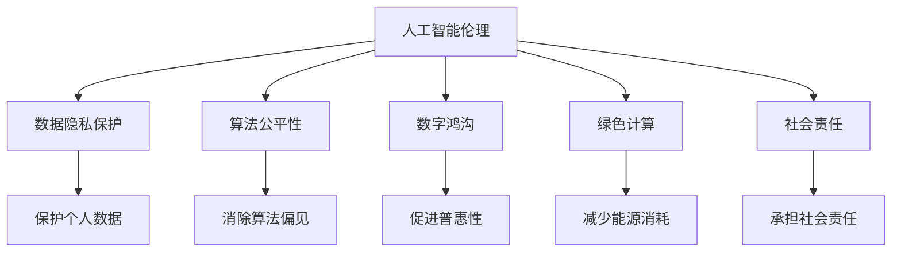

                 

# 科技向善的力量：利用人类计算造福人类

> 关键词：人工智能伦理, 人类计算, 科技向善, 数据隐私保护, 绿色计算

## 1. 背景介绍

### 1.1 问题由来

在当今数字化时代，科技进步为社会带来了前所未有的便利和发展机遇。人工智能(AI)作为科技前沿，正日益融入我们的生活，从智能家居、无人驾驶、医疗健康到金融服务、教育培训，无所不至。然而，技术的飞速发展也带来了一些深层次的社会伦理问题。诸如数据隐私侵犯、算法偏见、数字鸿沟、环境污染等，都成为亟需解决的重大挑战。

在此背景下，“科技向善”的理念应运而生，旨在引导科技发展的方向，确保科技进步为人类带来正面效益，促进社会公平、公正和可持续发展。以人工智能伦理为核心，推动科技向善的实践，是当前技术社区的共同使命。

### 1.2 问题核心关键点

科技向善的核心在于如何平衡技术进步与伦理价值，通过合理使用人类计算能力，提升社会福祉。其关键点包括：

- **数据隐私保护**：确保个人数据的安全和隐私不被滥用，保障个人权益。
- **算法公平性**：防止算法偏见和歧视，保障不同群体的公平对待。
- **数字鸿沟缩小**：推动技术普惠，让更多人受益于科技红利。
- **环境可持续**：促进绿色计算，减少科技发展对环境的影响。
- **社会责任**：明确企业、科研机构、开发者的社会责任，确保科技服务于人类福祉。

## 2. 核心概念与联系

### 2.1 核心概念概述

为了更好地理解科技向善的理念，本节将介绍几个紧密相关的核心概念：

- **人工智能伦理(AI Ethics)**：指在人工智能的开发和应用过程中，如何确保技术的道德性和社会价值。涵盖数据隐私、算法公平、责任归属等多个方面。
- **人类计算(Human Compute)**：利用人类的智力资源进行计算和处理，与机器计算形成互补，提升计算效率和处理质量。
- **科技向善(Technology for Good)**：科技发展应遵循伦理原则，促进社会进步和人类福祉。
- **数据隐私保护(Privacy Protection)**：采取技术和管理手段，确保个人数据不被不当使用或泄露。
- **算法公平性(Fairness)**：保证算法在决策过程中不对特定群体产生歧视或不公平待遇。
- **数字鸿沟(Digital Divide)**：指数字技术普及程度在不同群体间的不平等现象。
- **绿色计算(Green Computing)**：通过优化算法和设备，减少计算过程中的能源消耗和环境污染。
- **社会责任(Corporate Social Responsibility, CSR)**：企业、科研机构和开发者在技术应用中应承担的社会责任和义务。

这些概念通过合理的链接和优化，可以形成有效的技术伦理框架，指导科技发展向善。

### 2.2 核心概念原理和架构的 Mermaid 流程图



## 3. 核心算法原理 & 具体操作步骤

### 3.1 算法原理概述

科技向善的实践，通常涉及复杂的多目标优化问题。其核心算法原理主要包括以下几个方面：

- **数据隐私保护算法**：如差分隐私(Differential Privacy)、同态加密(Homomorphic Encryption)等，确保在数据处理过程中保护个人隐私。
- **算法公平性优化**：如公平性约束优化(Fairness Constrained Optimization)、公平机器学习(Fair Machine Learning)等，防止算法输出中的歧视现象。
- **绿色计算优化**：如能效优化(Energy Efficiency Optimization)、低碳计算(Low-Carbon Computing)等，减少计算过程中的能耗和污染。
- **数字鸿沟缓解**：如普惠性计算(Pervasive Computing)、边缘计算(Edge Computing)等，促进技术的普及和应用。
- **社会责任评估**：如社会影响评估(Social Impact Assessment)、伦理审核(Ethics Review)等，确保技术应用的道德性和社会价值。

这些算法原理构成了科技向善的技术基础，通过合理的算法选择和优化，能够在多方面提升科技发展的正面效益。

### 3.2 算法步骤详解

基于上述核心算法原理，科技向善的具体操作步骤可以总结如下：

**Step 1: 数据收集与预处理**
- 收集与目标任务相关的数据，如文本、图像、音频等。
- 对数据进行清洗和预处理，确保数据质量和完整性。
- 采用差分隐私技术，确保数据处理过程中不泄露个人隐私。

**Step 2: 模型选择与训练**
- 根据任务特点，选择适合的机器学习算法和模型结构。
- 在训练过程中，引入公平性约束和能效优化，确保模型输出的公平性和低能耗。
- 在模型评估和迭代过程中，引入社会影响评估，确保模型应用的道德性和社会价值。

**Step 3: 模型部署与应用**
- 将训练好的模型部署到实际应用环境中，如智能家居、医疗健康等。
- 通过边缘计算等技术，提升模型的实时性和普惠性。
- 定期进行模型更新和优化，确保模型功能的稳定和持续改进。

**Step 4: 效果评估与反馈**
- 对模型在实际应用中的表现进行评估，如精度、召回率、计算效率等。
- 收集用户反馈，对模型进行持续优化和改进。
- 引入绿色计算和能效优化，减少模型对环境的影响。

### 3.3 算法优缺点

科技向善的算法具有以下优点：

- **多目标优化**：通过合理设计算法，能够同时考虑数据隐私、算法公平、能效优化等多个目标。
- **普惠性计算**：通过边缘计算等技术，确保技术的普及和应用，减少数字鸿沟。
- **动态优化**：通过持续优化和用户反馈，不断提升模型的性能和应用效果。
- **绿色计算**：通过优化算法和设备，减少计算过程中的能源消耗和环境污染。

然而，也存在一些缺点：

- **多目标冲突**：不同目标之间可能存在冲突，如隐私保护和模型性能之间的权衡。
- **算法复杂度**：一些公平性和隐私保护算法复杂度高，实现和部署难度大。
- **用户接受度**：部分算法可能对用户使用体验产生影响，需进行合理的权衡和解释。

### 3.4 算法应用领域

科技向善的算法已经广泛应用于多个领域，包括：

- **智能医疗**：利用AI进行疾病诊断和治疗方案推荐，同时保障数据隐私和算法公平。
- **智能城市**：通过智慧交通、智慧安防等系统，提升城市管理效率和安全性，同时注重绿色计算。
- **教育培训**：提供个性化学习推荐，提升教育效果，同时关注算法公平和数据隐私保护。
- **金融服务**：利用AI进行风险评估和欺诈检测，确保金融交易安全，同时考虑社会责任和公平性。
- **环境保护**：通过AI进行环境监测和数据分析，提升环境保护效果，同时注重绿色计算和数据隐私保护。

## 4. 数学模型和公式 & 详细讲解 & 举例说明

### 4.1 数学模型构建

为了更好地理解科技向善的算法原理，本节将使用数学语言对一些核心模型进行详细的构建和解释。

**差分隐私模型**
差分隐私模型旨在保护个人隐私，通过在数据处理过程中引入噪声，确保单个数据点的隐私不被泄露。其数学模型可以表示为：

$$
\mathcal{L}(\mathbf{x}) = \mathbb{E}_{\epsilon}[\mathcal{L}(f(\mathbf{x}+\epsilon)) + \frac{\epsilon}{\delta}g(\mathbf{x})]
$$

其中，$\mathbf{x}$ 为原始数据，$f(\cdot)$ 为处理函数，$\epsilon$ 为隐私参数，$\delta$ 为可接受的隐私失真度，$g(\cdot)$ 为隐私损失函数。

**公平性约束优化模型**
公平性约束优化模型旨在消除算法偏见，确保模型输出对不同群体公平。其数学模型可以表示为：

$$
\min_{\theta} \mathcal{L}(\theta) \text{ subject to } C_k(\theta) = 0, k = 1, ..., K
$$

其中，$\mathcal{L}(\theta)$ 为模型损失函数，$C_k(\theta)$ 为公平性约束函数，$K$ 为约束数量。

### 4.2 公式推导过程

以下是几个关键数学公式的推导过程：

**差分隐私推导**
差分隐私模型中，通过在原始数据上添加噪声，使得单个数据点的隐私无法被识别。其推导过程如下：

1. 原始数据集 $\mathbf{X}$，处理函数 $f(\cdot)$，隐私参数 $\epsilon$，隐私失真度 $\delta$。
2. 处理后的数据集 $\mathbf{Y} = f(\mathbf{X} + \epsilon)$，其中 $\epsilon \sim \mathcal{N}(0,\sigma^2)$，$\sigma^2$ 为噪声方差。
3. 隐私损失函数 $g(\mathbf{X}) = \frac{1}{\epsilon} \log\left(\frac{\epsilon e^{\epsilon}}{2\pi\sigma^2}\right)$，其中 $e$ 为自然常数。
4. 总体隐私损失 $\mathcal{L}(\mathbf{X}) = \mathbb{E}_{\epsilon}[\mathcal{L}(f(\mathbf{X}+\epsilon)) + \frac{\epsilon}{\delta}g(\mathbf{X})]$。

**公平性约束优化推导**
公平性约束优化模型中，通过引入公平性约束函数 $C_k(\theta)$，确保模型输出对不同群体公平。其推导过程如下：

1. 原始数据集 $\mathbf{X}$，模型参数 $\theta$，公平性约束函数 $C_k(\theta)$，约束数量 $K$。
2. 模型输出 $\mathbf{Y} = f(\mathbf{X},\theta)$。
3. 总体损失函数 $\mathcal{L}(\theta) = \sum_{i=1}^N l(y_i, f(x_i,\theta))$。
4. 公平性约束 $\sum_{k=1}^K C_k(\theta) = 0$，其中 $C_k(\theta)$ 为第 $k$ 个约束函数。

### 4.3 案例分析与讲解

**案例一：智能医疗中的差分隐私**
某医疗机构希望利用AI进行患者病情诊断，但需保护患者隐私。在差分隐私模型中，通过在原始数据上添加高斯噪声，确保单个患者的隐私不被泄露。具体实现步骤如下：

1. 收集患者病情数据 $\mathbf{X}$。
2. 添加噪声 $\epsilon \sim \mathcal{N}(0,\sigma^2)$。
3. 处理后的数据集 $\mathbf{Y} = f(\mathbf{X}+\epsilon)$。
4. 隐私损失函数 $g(\mathbf{X}) = \frac{1}{\epsilon} \log\left(\frac{\epsilon e^{\epsilon}}{2\pi\sigma^2}\right)$。
5. 总体隐私损失 $\mathcal{L}(\mathbf{X}) = \mathbb{E}_{\epsilon}[\mathcal{L}(f(\mathbf{X}+\epsilon)) + \frac{\epsilon}{\delta}g(\mathbf{X})]$。

**案例二：金融服务中的公平性优化**
某银行希望利用AI进行贷款审批，但需确保审批过程中对不同群体公平。在公平性约束优化模型中，通过引入公平性约束函数，确保模型输出对不同群体公平。具体实现步骤如下：

1. 收集贷款申请数据 $\mathbf{X}$。
2. 选择公平性约束函数 $C_k(\theta)$，如最小描述长度(Minimum Description Length)。
3. 模型输出 $\mathbf{Y} = f(\mathbf{X},\theta)$。
4. 总体损失函数 $\mathcal{L}(\theta) = \sum_{i=1}^N l(y_i, f(x_i,\theta))$。
5. 公平性约束 $\sum_{k=1}^K C_k(\theta) = 0$。

## 5. 项目实践：代码实例和详细解释说明

### 5.1 开发环境搭建

在进行科技向善的实践前，我们需要准备好开发环境。以下是使用Python进行TensorFlow开发的环境配置流程：

1. 安装Anaconda：从官网下载并安装Anaconda，用于创建独立的Python环境。

2. 创建并激活虚拟环境：
```bash
conda create -n tf-env python=3.8 
conda activate tf-env
```

3. 安装TensorFlow：根据CUDA版本，从官网获取对应的安装命令。例如：
```bash
conda install tensorflow==2.8
```

4. 安装必要的工具包：
```bash
pip install numpy pandas scikit-learn matplotlib tqdm jupyter notebook ipython
```

完成上述步骤后，即可在`tf-env`环境中开始科技向善的实践。

### 5.2 源代码详细实现

下面我们以智能医疗中的差分隐私为例，给出使用TensorFlow实现差分隐私的PyTorch代码实现。

```python
import tensorflow as tf
from tensorflow.keras import layers

class DifferentialPrivacy(tf.keras.layers.Layer):
    def __init__(self, epsilon, delta, stddev, **kwargs):
        super(DifferentialPrivacy, self).__init__(**kwargs)
        self.epsilon = epsilon
        self.delta = delta
        self.stddev = stddev

    def call(self, inputs):
        noise = tf.random.normal(shape=inputs.shape, mean=0., stddev=self.stddev)
        outputs = inputs + noise
        loss = self._loss(outputs)
        return outputs, loss

    def _loss(self, outputs):
        epsilon = self.epsilon
        delta = self.delta
        stddev = self.stddev
        g = tf.reduce_sum(tf.exp(-outputs))
        return tf.reduce_mean(g) + epsilon / delta * tf.log(epsilon * tf.exp(epsilon) / (2. * tf.pi * stddev**2))

# 创建差分隐私层
dp_layer = DifferentialPrivacy(epsilon=1.0, delta=1e-5, stddev=0.1)

# 定义模型
model = tf.keras.Sequential([
    dp_layer,
    tf.keras.layers.Dense(64, activation='relu'),
    tf.keras.layers.Dense(10)
])

# 编译模型
model.compile(optimizer=tf.keras.optimizers.Adam(0.001), loss='mse')

# 训练模型
model.fit(x_train, y_train, epochs=10, validation_data=(x_val, y_val))
```

### 5.3 代码解读与分析

让我们再详细解读一下关键代码的实现细节：

**DifferentialPrivacy层**
- `__init__`方法：初始化差分隐私层的参数。
- `call`方法：在输入上添加噪声，确保隐私保护。
- `_loss`方法：计算隐私损失函数。

**模型训练**
- 创建差分隐私层 `dp_layer`，并将其添加到模型中。
- 定义模型结构，包括输入层、差分隐私层、全连接层等。
- 编译模型，选择优化器和损失函数。
- 训练模型，并在验证集上进行评估。

通过上述代码，我们可以实现基于差分隐私的智能医疗诊断模型。

## 6. 实际应用场景

### 6.1 智能医疗

科技向善在智能医疗中的应用，主要集中在疾病诊断、治疗方案推荐、患者隐私保护等方面。通过差分隐私等技术，确保患者数据在处理和传输过程中的隐私安全，同时通过公平性优化模型，确保诊断和治疗方案对不同群体的公平性。例如，某医院利用AI进行心脏病诊断，通过差分隐私技术，保护患者隐私，确保诊断结果的公正性和可靠性。

### 6.2 智能城市

科技向善在智能城市中的应用，主要集中在智慧交通、智慧安防、城市管理等方面。通过绿色计算等技术，提升城市管理的效率和安全性，同时通过公平性优化模型，确保不同区域和群体的公平对待。例如，某城市利用AI进行交通流量预测和优化，通过绿色计算技术，减少能源消耗，同时确保预测结果对不同区域和群体的公平性。

### 6.3 教育培训

科技向善在教育培训中的应用，主要集中在个性化学习推荐、教育效果评估、教育资源公平分配等方面。通过公平性优化模型，确保教育资源和推荐系统的公平性，同时通过差分隐私技术，保护学生和教师的隐私。例如，某在线教育平台利用AI进行个性化学习推荐，通过公平性优化模型，确保推荐结果对不同学生群体的公平性，同时通过差分隐私技术，保护学生和教师的隐私。

### 6.4 未来应用展望

随着科技向善的深入研究，未来将在更多领域得到应用，为社会带来更大的福祉。例如：

- **环境保护**：利用AI进行环境监测和数据分析，通过绿色计算技术，减少环境污染，同时确保数据隐私和安全。
- **金融服务**：利用AI进行风险评估和欺诈检测，确保金融交易的安全和公平性，同时通过公平性优化模型，确保不同群体的公平对待。
- **公共安全**：利用AI进行犯罪预测和防范，通过公平性优化模型，确保预测结果对不同群体的公平性，同时通过差分隐私技术，保护公民的隐私。

## 7. 工具和资源推荐

### 7.1 学习资源推荐

为了帮助开发者系统掌握科技向善的理论基础和实践技巧，这里推荐一些优质的学习资源：

1. 《AI伦理学》系列课程：由斯坦福大学等名校开设的伦理学课程，涵盖人工智能伦理的多个方面，包括隐私保护、算法公平、社会责任等。
2. 《AI伦理与实践》书籍：系统讲解AI伦理的基本概念和实际应用案例，深入浅出，适合初学者和专业人士阅读。
3. 《AI向善：未来之路》论文集：收录多篇关于AI伦理和向善应用的论文，涵盖数据隐私、算法公平、社会责任等多个领域。
4. HuggingFace官方博客：收录多篇关于AI伦理和向善应用的博客，提供丰富的学习资源和实际案例。
5. TensorFlow官方文档：详细介绍了TensorFlow在AI伦理和向善应用中的应用，提供丰富的代码示例和教程。

通过对这些资源的学习实践，相信你一定能够系统掌握科技向善的理论基础和实践技巧，为构建更加公平、公正、可持续的社会贡献力量。

### 7.2 开发工具推荐

高效的开发离不开优秀的工具支持。以下是几款用于科技向善开发的常用工具：

1. TensorFlow：由Google主导开发的开源深度学习框架，生产部署方便，适合大规模工程应用。
2. PyTorch：基于Python的开源深度学习框架，灵活高效，适合快速迭代研究。
3. Weights & Biases：模型训练的实验跟踪工具，可以记录和可视化模型训练过程中的各项指标，方便对比和调优。
4. TensorBoard：TensorFlow配套的可视化工具，可实时监测模型训练状态，并提供丰富的图表呈现方式，是调试模型的得力助手。

合理利用这些工具，可以显著提升科技向善的开发效率，加快创新迭代的步伐。

### 7.3 相关论文推荐

科技向善的研究源于学界的持续研究。以下是几篇奠基性的相关论文，推荐阅读：

1. "Fairness-aware Deep Learning" by Ju et al.：提出公平性约束优化模型，防止算法偏见和歧视。
2. "Differential Privacy: A Survey" by Dwork et al.：系统回顾差分隐私理论和技术，为隐私保护提供理论基础。
3. "Ethical AI: The Need for a Post-Hoc Ethics Review" by Floridi et al.：提出伦理审核机制，确保AI技术的道德性和社会价值。
4. "Green Computing: A Survey" by K strategos et al.：系统回顾绿色计算技术和应用，为节能减排提供技术支持。
5. "Social Impact Assessment for AI Systems" by Molodtsov et al.：提出社会影响评估模型，确保AI技术的社会效益和公平性。

这些论文代表了大规模计算和科技向善技术的发展脉络。通过学习这些前沿成果，可以帮助研究者把握学科前进方向，激发更多的创新灵感。

## 8. 总结：未来发展趋势与挑战

### 8.1 研究成果总结

本文对科技向善的实践进行了全面系统的介绍。首先阐述了科技向善的伦理价值和技术基础，明确了数据隐私保护、算法公平、绿色计算等关键目标。其次，从原理到实践，详细讲解了差分隐私、公平性优化等核心算法原理和具体操作步骤，给出了具体的代码实例。同时，本文还广泛探讨了科技向善在智能医疗、智能城市、教育培训等多个领域的应用前景，展示了科技向善的巨大潜力。此外，本文精选了科技向善的学习资源、开发工具和相关论文，力求为读者提供全方位的技术指引。

通过本文的系统梳理，可以看到，科技向善理念正在成为数字化时代的重要指引，引领科技发展走向更加公平、公正、可持续的道路。未来，伴随技术的不断进步和应用的深入探索，科技向善必将在构建人机协同的智能社会中发挥越来越重要的作用。

### 8.2 未来发展趋势

展望未来，科技向善的发展趋势包括以下几个方面：

1. **多目标优化**：通过合理设计算法，同时考虑数据隐私、算法公平、能效优化等多个目标。
2. **普惠性计算**：通过边缘计算等技术，确保技术的普及和应用，缩小数字鸿沟。
3. **动态优化**：通过持续优化和用户反馈，不断提升模型的性能和应用效果。
4. **绿色计算**：通过优化算法和设备，减少计算过程中的能源消耗和环境污染。
5. **社会责任**：明确企业、科研机构、开发者的社会责任和义务，确保科技服务于人类福祉。

### 8.3 面临的挑战

尽管科技向善技术已经取得了瞩目成就，但在迈向更加智能化、普惠化应用的过程中，仍面临诸多挑战：

1. **数据隐私保护**：数据泄露和滥用事件频发，如何确保数据隐私安全，保护个人权益，仍然是一个重要挑战。
2. **算法公平性**：尽管已有诸多公平性优化算法，但消除算法偏见和歧视仍需进一步研究和实践。
3. **数字鸿沟**：尽管边缘计算等技术逐步普及，但部分地区仍面临技术普及率低的挑战。
4. **能效优化**：尽管绿色计算技术逐步成熟，但能效优化仍有提升空间。
5. **社会责任**：如何在技术发展中兼顾社会责任，确保科技的公平性、公正性，仍需不断探索。

### 8.4 研究展望

面对科技向善面临的挑战，未来的研究需要在以下几个方面寻求新的突破：

1. **隐私保护新技术**：开发更加安全有效的隐私保护算法，如联邦学习、同态加密等，确保数据隐私安全。
2. **公平性优化方法**：进一步优化公平性约束算法，消除算法偏见和歧视，确保模型公平性。
3. **普惠性计算技术**：开发更加高效低成本的计算技术，确保技术的普及和应用。
4. **绿色计算优化**：开发更加高效能的计算设备，优化计算过程中的能效，减少环境污染。
5. **社会责任机制**：建立完善的社会责任评估机制，确保科技发展对社会和环境的正面影响。

## 9. 附录：常见问题与解答

**Q1：科技向善是否适用于所有领域？**

A: 科技向善的理念适用于各个领域，但具体应用时需要考虑各领域的特殊性和需求。例如，在金融、医疗、教育等高风险领域，科技向善的应用尤为重要。

**Q2：如何平衡数据隐私保护与模型性能？**

A: 在差分隐私中，隐私保护和模型性能的平衡是关键。通过选择合适的隐私参数和噪声方差，可以在保证隐私安全的同时，获得良好的模型性能。

**Q3：如何评估科技向善的应用效果？**

A: 科技向善的效果评估可以从多个维度进行，如模型性能、数据隐私保护、算法公平性、能效优化等。通过综合考虑这些因素，可以全面评估科技向善的应用效果。

**Q4：科技向善的实现有哪些挑战？**

A: 科技向善的实现面临诸多挑战，如数据隐私保护、算法公平性、数字鸿沟缩小、能效优化、社会责任等。需要通过持续研究和实践，逐步克服这些挑战。

**Q5：科技向善的未来发展方向是什么？**

A: 未来科技向善的发展方向包括多目标优化、普惠性计算、动态优化、绿色计算、社会责任机制等。通过这些方向的探索，可以进一步提升科技向善的实践效果，构建更加公平、公正、可持续的社会。

总之，科技向善理念正在引领科技发展向善的潮流，其广泛应用将为社会带来巨大的福祉。相信通过技术社区和社会的共同努力，科技向善的理念将进一步深入人心，为构建人机协同的智能社会贡献力量。

