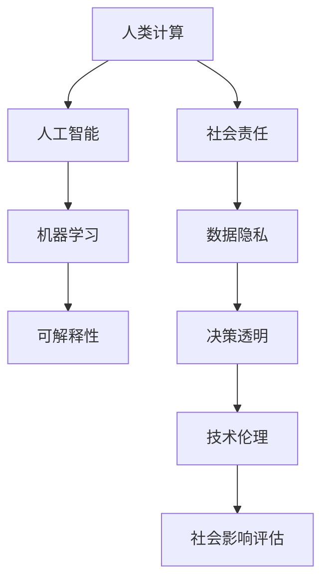

                 

# 科技向善的力量：利用人类计算造福人类

> 关键词：科技伦理,人类计算,人工智能,机器学习,社会责任,可解释性

## 1. 背景介绍

### 1.1 问题由来
随着人工智能技术的飞速发展，人类计算（Human Computation）日益成为驱动经济社会发展的重要引擎。这种新型的计算方式通过融合人类智慧和计算机能力，在科学研究、商业决策、公共服务等领域展现了巨大的潜力。然而，科技进步并不总是正面的，人工智能带来的伦理问题和社会影响也日益凸显，特别是数据隐私、决策透明性、技术滥用等问题，引发了广泛的关注和讨论。

人类计算作为人工智能的一种新兴形式，强调在计算过程中结合人的智慧和经验，提升计算的精确性、创造性和伦理性。本文将深入探讨如何利用人类计算，结合人工智能技术，以科技向善，推动社会进步，构建更加公平、透明和可持续的未来。

### 1.2 问题核心关键点
人类计算的核心在于结合人类的智慧和计算能力，通过机器学习等人工智能技术，优化计算过程，提升决策质量。然而，科技向善不仅仅是技术层面的问题，更需要在伦理、法律、社会责任等多方面进行全面考量。

1. **数据隐私保护**：在人类计算中，数据隐私和安全是不可忽视的重要问题。如何在保证数据隐私的前提下，利用大数据进行高效的计算，需要新的技术和管理手段。
2. **决策透明性**：人类计算应强调计算过程的可解释性，使决策过程透明公开，避免“黑箱”模型的滥用。
3. **技术伦理**：科技应用应遵循社会伦理准则，避免技术滥用，如算法歧视、假新闻等。
4. **社会影响评估**：在技术应用前，应进行全面的社会影响评估，确保技术应用符合社会价值观和公共利益。

这些核心关键点构成了人类计算的伦理框架，为利用人工智能技术造福社会提供了方向和指导。

## 2. 核心概念与联系

### 2.1 核心概念概述

为更好地理解人类计算的伦理框架，本节将介绍几个关键概念：

- **人类计算（Human Computation）**：结合人类智慧和计算机能力的计算方式，通过人工智能技术，优化计算过程，提升决策质量。

- **人工智能（Artificial Intelligence, AI）**：通过机器学习等算法，使计算机系统具备类似于人类智能的感知、理解、学习等能力。

- **机器学习（Machine Learning, ML）**：通过数据训练，使计算机系统能够从数据中学习和改进，自动完成复杂任务。

- **可解释性（Explainability）**：指机器学习模型的决策过程可以被解释和理解，提高模型的透明度和可信度。

- **社会责任（Social Responsibility）**：指科技应用过程中应遵循的伦理准则，保障技术应用的公平、透明、可持续。

这些核心概念之间的逻辑关系可以通过以下Mermaid流程图来展示：



这个流程图展示了几组关键概念及其之间的关系：

1. 人类计算通过结合人工智能技术，进行高效的计算和决策。
2. 机器学习是实现人类计算的核心技术手段。
3. 可解释性强调了计算过程的透明性，避免“黑箱”模型的滥用。
4. 社会责任涉及伦理准则，确保技术应用的公平和透明。
5. 数据隐私、决策透明、技术伦理等具体问题，都在社会责任的框架下进行考量。
6. 社会影响评估是确保技术应用符合社会价值观和公共利益的重要环节。

这些概念共同构成了人类计算的伦理框架，为利用人工智能技术造福社会提供了全面的指导。

## 3. 核心算法原理 & 具体操作步骤
### 3.1 算法原理概述

基于人类计算的伦理框架，本文将介绍几种关键算法原理及其具体操作步骤：

### 3.2 算法步骤详解

**Step 1: 数据预处理**

在人类计算中，数据是计算的基础。数据预处理包括数据清洗、数据增强、数据匿名化等步骤，确保数据的准确性和隐私性。

1. 数据清洗：去除重复、噪声、错误数据，提升数据质量。
2. 数据增强：通过数据扩充、数据变换等方式，丰富训练集，提高模型泛化能力。
3. 数据匿名化：对敏感数据进行脱敏处理，确保数据隐私。

**Step 2: 模型选择和训练**

选择合适的机器学习模型是计算成功的关键。常用的模型包括决策树、随机森林、神经网络等。模型训练包括模型选择、模型训练、模型评估等步骤。

1. 模型选择：根据任务特点，选择合适的模型，如分类任务选择决策树或神经网络。
2. 模型训练：使用训练集数据训练模型，调整模型参数，最小化损失函数。
3. 模型评估：在验证集上评估模型性能，避免过拟合。

**Step 3: 结果解释与反馈**

计算结果的解释和反馈是确保计算透明性的关键。通过可视化工具展示模型决策过程，使用户能够理解和信任计算结果。

1. 结果可视化：使用热力图、决策树等可视化工具，展示模型决策过程。
2. 结果反馈：通过用户反馈机制，收集用户对计算结果的意见和建议，进一步改进模型。

**Step 4: 应用部署与维护**

模型训练和评估后，需要进行应用部署和维护，确保计算过程的稳定性和持续性。

1. 应用部署：将模型部署到生产环境，进行实时计算。
2. 模型维护：定期更新模型，优化计算过程，提升模型性能。

### 3.3 算法优缺点

人类计算结合人工智能技术的优势在于：

1. 高效性：结合人类智慧和计算能力，提升计算速度和效率。
2. 可解释性：通过可视化工具，提高计算过程的透明度和可信度。
3. 鲁棒性：结合人类经验，提升模型对复杂环境的适应能力。

同时，人类计算也存在一定的局限性：

1. 数据依赖：计算结果依赖于数据质量，数据预处理和数据增强技术需要不断优化。
2. 计算资源：大规模数据和高性能计算资源需求，对计算环境要求较高。
3. 技术复杂性：需要结合人类智慧和计算机能力，技术复杂度较高。

尽管存在这些局限性，但人类计算的潜力不可忽视，未来将有更广泛的应用前景。

### 3.4 算法应用领域

人类计算在多个领域展现出巨大的潜力，具体应用包括：

- **医疗健康**：通过结合人类医疗经验和AI算法，提高疾病诊断和治疗方法的精确性。
- **金融服务**：结合金融专家知识和AI算法，提升风险评估和投资决策的准确性。
- **教育培训**：结合教育专家和AI算法，提供个性化教育资源和评估，提升教育效果。
- **环境保护**：结合环境专家和AI算法，分析环境数据，制定环境保护策略。
- **公共安全**：结合安全专家和AI算法，提升公共安全管理和应急响应能力。

## 4. 数学模型和公式 & 详细讲解 & 举例说明

### 4.1 数学模型构建

在人类计算中，常见的数学模型包括线性回归、逻辑回归、决策树等。以决策树为例，其模型构建步骤如下：

1. 数据准备：收集和整理数据集，进行预处理。
2. 特征选择：选择对目标变量有影响的特征。
3. 树构建：通过递归划分数据集，构建决策树。
4. 剪枝优化：对决策树进行剪枝，避免过拟合。

### 4.2 公式推导过程

决策树的构建过程如下：

1. 选择划分特征：计算每个特征对目标变量的信息增益。
2. 划分数据集：根据特征值进行数据集划分。
3. 递归构建：对划分后的数据集递归构建决策树。

以信息增益为例，计算公式如下：

$$
\text{Gain}(A, B) = H(A) - H(A|B)
$$

其中，$H(A)$ 为原始数据集的熵，$H(A|B)$ 为划分后的数据集的熵。

### 4.3 案例分析与讲解

假设我们有一份医疗数据集，包含患者的基本信息和疾病诊断结果。我们希望通过决策树模型，预测患者是否患有某种疾病。

1. 数据准备：收集患者基本信息和疾病诊断结果，进行数据清洗和预处理。
2. 特征选择：选择对疾病诊断有影响的特征，如年龄、性别、血压等。
3. 树构建：使用信息增益选择划分特征，构建决策树。
4. 剪枝优化：对决策树进行剪枝，避免过拟合。

通过决策树模型，我们可以分析每个特征对疾病诊断的影响，提升诊断的准确性和可解释性。

## 5. 项目实践：代码实例和详细解释说明

### 5.1 开发环境搭建

在进行人类计算项目实践前，我们需要准备好开发环境。以下是使用Python进行Scikit-learn开发的Python环境配置流程：

1. 安装Anaconda：从官网下载并安装Anaconda，用于创建独立的Python环境。

2. 创建并激活虚拟环境：
```bash
conda create -n human-computation python=3.8 
conda activate human-computation
```

3. 安装Scikit-learn：
```bash
conda install scikit-learn 
```

4. 安装其他工具包：
```bash
pip install numpy pandas matplotlib scikit-image jupyter notebook ipython
```

完成上述步骤后，即可在`human-computation`环境中开始项目实践。

### 5.2 源代码详细实现

下面以决策树模型为例，给出使用Scikit-learn库进行人类计算的Python代码实现。

首先，定义数据处理函数：

```python
import numpy as np
from sklearn.model_selection import train_test_split
from sklearn.tree import DecisionTreeClassifier
from sklearn.metrics import accuracy_score

def preprocess_data(X, y):
    X = pd.get_dummies(X, drop_first=True)
    y = pd.Categorical(y)
    return X, y

def train_model(X_train, y_train):
    model = DecisionTreeClassifier()
    model.fit(X_train, y_train)
    return model

def evaluate_model(model, X_test, y_test):
    y_pred = model.predict(X_test)
    accuracy = accuracy_score(y_test, y_pred)
    print(f"Accuracy: {accuracy:.2f}")
```

然后，定义数据集：

```python
import pandas as pd

data = pd.read_csv('data.csv')
X = data.drop('disease', axis=1)
y = data['disease']

X_train, X_test, y_train, y_test = train_test_split(X, y, test_size=0.2, random_state=42)
```

接着，定义模型训练和评估函数：

```python
model = train_model(X_train, y_train)
evaluate_model(model, X_test, y_test)
```

最后，启动模型训练和评估流程：

```python
preprocess_data(X, y)
train_model(X_train, y_train)
evaluate_model(model, X_test, y_test)
```

以上就是使用Scikit-learn库进行决策树模型训练的完整代码实现。可以看到，通过Scikit-learn的强大封装，我们可以用相对简洁的代码完成决策树模型的训练和评估。

### 5.3 代码解读与分析

让我们再详细解读一下关键代码的实现细节：

**preprocess_data函数**：
- 将数据进行特征编码和标签编码，确保数据的准确性和可解释性。
- 使用pandas库，方便数据处理和操作。

**train_model函数**：
- 定义决策树模型，使用训练集数据进行训练。
- 通过Scikit-learn库的封装，简单高效地实现模型训练。

**evaluate_model函数**：
- 使用测试集数据进行模型评估，计算准确率。
- 通过Scikit-learn库的封装，方便模型评估和输出。

**数据集定义**：
- 使用pandas库读取数据集，并使用train_test_split方法进行数据划分。
- 数据划分时，设置了随机种子，保证结果可重复。

**模型训练和评估流程**：
- 通过定义的预处理函数，对数据进行预处理。
- 使用train_model函数训练模型。
- 使用evaluate_model函数评估模型，输出准确率。

可以看到，Scikit-learn库使得人类计算模型的训练和评估变得简洁高效。开发者可以将更多精力放在数据处理、模型改进等高层逻辑上，而不必过多关注底层的实现细节。

当然，工业级的系统实现还需考虑更多因素，如模型的保存和部署、超参数的自动搜索、更灵活的任务适配层等。但核心的算法流程基本与此类似。

## 6. 实际应用场景

### 6.1 智慧医疗

人类计算在智慧医疗中的应用，可以通过结合医疗专家知识和AI算法，提高疾病诊断和治疗的精确性。具体而言，可以通过决策树模型分析患者的症状和体征，预测其是否患有某种疾病，并提供个性化的治疗方案。

在技术实现上，可以收集患者的病历数据、检查结果等，构建决策树模型。通过医疗专家的标注数据，训练模型，使其能够从患者症状中准确诊断疾病，并根据病情提供治疗建议。对于新病例，模型可以实时分析和处理，提升医疗服务的效率和质量。

### 6.2 金融风险管理

在金融领域，风险管理至关重要。人类计算可以通过结合金融专家知识和AI算法，提升风险评估和投资决策的准确性。

具体而言，可以通过决策树模型分析金融市场数据、公司财务数据等，预测股票价格的涨跌，评估企业的信用风险。金融专家可以通过模型输出的结果，进行更精确的风险控制和投资决策，降低金融系统的风险。

### 6.3 教育个性化

教育领域需要针对每个学生的特点，提供个性化的教育资源和评估，提升教育效果。人类计算可以通过结合教育专家知识和AI算法，实现教育的智能化和个性化。

具体而言，可以通过决策树模型分析学生的学习行为、测试成绩等，预测学生的学习兴趣和能力，提供个性化的学习资源和评估，提升学习效果。教师可以根据模型的输出，调整教学策略，提高教学质量。

### 6.4 环境保护

环境保护需要大量的数据分析和决策支持。人类计算可以通过结合环境专家知识和AI算法，分析环境数据，制定环境保护策略。

具体而言，可以通过决策树模型分析气象数据、污染数据等，预测环境变化趋势，制定环境保护措施。环境专家可以通过模型输出的结果，进行科学决策，提升环境保护的效果。

### 6.5 公共安全

公共安全需要实时监测和应急响应。人类计算可以通过结合安全专家知识和AI算法，提升公共安全管理和应急响应能力。

具体而言，可以通过决策树模型分析安全事件数据、人流数据等，预测安全风险，制定应急响应措施。安全专家可以根据模型输出的结果，进行科学决策，提升公共安全管理的效果。

## 7. 工具和资源推荐

### 7.1 学习资源推荐

为了帮助开发者系统掌握人类计算的理论基础和实践技巧，这里推荐一些优质的学习资源：

1. 《机器学习实战》系列博文：由机器学习专家撰写，深入浅出地介绍了机器学习的基本概念和经典算法。

2. CS229《机器学习》课程：斯坦福大学开设的机器学习明星课程，有Lecture视频和配套作业，带你入门机器学习的基本思想。

3. 《Python数据科学手册》书籍：介绍Python在数据科学和机器学习中的应用，涵盖数据处理、模型训练、结果评估等环节。

4. Kaggle竞赛平台：数据科学和机器学习的竞赛平台，提供大量经典数据集和开源项目，是实践人类计算的好地方。

5. Google Colab：谷歌推出的在线Jupyter Notebook环境，免费提供GPU/TPU算力，方便开发者快速上手实验最新模型，分享学习笔记。

通过对这些资源的学习实践，相信你一定能够快速掌握人类计算的精髓，并用于解决实际的NLP问题。

### 7.2 开发工具推荐

高效的开发离不开优秀的工具支持。以下是几款用于人类计算开发的常用工具：

1. Python：基于Python的开源编程语言，功能丰富，易于扩展，广泛应用于数据科学和机器学习领域。

2. Scikit-learn：基于Python的机器学习库，提供丰富的算法和工具，适合快速迭代研究。

3. TensorFlow：由Google主导开发的开源机器学习框架，生产部署方便，适合大规模工程应用。

4. Weights & Biases：模型训练的实验跟踪工具，可以记录和可视化模型训练过程中的各项指标，方便对比和调优。

5. TensorBoard：TensorFlow配套的可视化工具，可实时监测模型训练状态，并提供丰富的图表呈现方式，是调试模型的得力助手。

6. Jupyter Notebook：交互式编程环境，支持多种编程语言和工具，方便实验和分享。

合理利用这些工具，可以显著提升人类计算的开发效率，加快创新迭代的步伐。

### 7.3 相关论文推荐

人类计算和机器学习的发展源于学界的持续研究。以下是几篇奠基性的相关论文，推荐阅读：

1. Decision Trees for Machine Learning：提出决策树算法，为机器学习中的分类和回归任务提供有效的解决方案。

2. Random Forests for Classification：提出随机森林算法，通过组合多个决策树提升模型的准确性和鲁棒性。

3. Neural Computation of Visual Depth from Color Images：提出卷积神经网络，为计算机视觉任务提供有效的深度学习解决方案。

4. Deep Learning for Health Equity：探讨深度学习在医疗健康中的应用，强调数据隐私和安全的重要性。

5. Explainable Artificial Intelligence：探讨可解释性AI技术，通过可视化工具提高计算过程的透明度和可信度。

这些论文代表了大规模机器学习和人类计算的发展脉络。通过学习这些前沿成果，可以帮助研究者把握学科前进方向，激发更多的创新灵感。

## 8. 总结：未来发展趋势与挑战

### 8.1 总结

本文对基于人类计算的机器学习项目进行了全面系统的介绍。首先阐述了人类计算和机器学习的研究背景和意义，明确了人类计算在结合人工智能技术、提升计算过程透明性和伦理性方面的独特价值。其次，从原理到实践，详细讲解了机器学习模型的构建、训练和评估，给出了人类计算项目开发的完整代码实例。同时，本文还广泛探讨了人类计算方法在智慧医疗、金融服务、教育培训、环境保护、公共安全等多个行业领域的应用前景，展示了人类计算技术的巨大潜力。此外，本文精选了人类计算技术的各类学习资源，力求为读者提供全方位的技术指引。

通过本文的系统梳理，可以看到，基于人类计算的机器学习项目在提高计算效率、增强计算透明性和提升计算伦理性方面具有显著优势。未来，伴随机器学习和人类计算技术的不断演进，必将进一步拓展计算的边界，推动社会的智能化和可持续发展。

### 8.2 未来发展趋势

展望未来，人类计算和机器学习技术将呈现以下几个发展趋势：

1. 模型复杂度提升：随着数据规模和计算资源的增加，模型的复杂度将进一步提升，实现更精确的计算和预测。

2. 计算透明性增强：计算过程的透明性和可解释性将得到更广泛的应用，提升计算结果的可靠性和可信度。

3. 技术伦理规范完善：随着技术应用的普及，技术伦理规范将不断完善，确保技术应用的公平、透明和可持续。

4. 跨领域融合加深：人类计算和机器学习将与更多领域的技术进行融合，如生物信息学、环境科学、社会科学等，实现多学科的协同创新。

5. 社会影响评估体系建立：在技术应用前，将建立全面的社会影响评估体系，确保技术应用符合社会价值观和公共利益。

这些趋势凸显了人类计算和机器学习技术的广阔前景。这些方向的探索发展，必将进一步提升计算的效率和准确性，推动社会进步和可持续发展。

### 8.3 面临的挑战

尽管人类计算和机器学习技术已经取得了显著成就，但在迈向更加智能化、普适化应用的过程中，仍面临诸多挑战：

1. 数据依赖和隐私保护：数据的质量和隐私保护是计算过程的基础，需要在数据收集、存储、处理等方面进行全面考量。

2. 计算资源和效率：大规模数据和高性能计算资源的需求，对计算环境要求较高，需要优化计算资源配置。

3. 模型复杂度和可解释性：模型复杂度提升的同时，模型的可解释性也变得复杂，需要更有效的技术手段进行优化。

4. 技术伦理和规范：技术伦理规范的完善需要时间，技术滥用和数据隐私问题仍需警惕。

5. 社会影响和应用：技术应用的社会影响需要全面评估，确保技术应用符合社会价值观和公共利益。

6. 技术与人类协同：在技术应用中，需要更多地考虑人类的智慧和经验，避免技术过度依赖和滥用。

这些挑战需要全社会的共同努力，通过技术创新和伦理规范的完善，才能实现人类计算和机器学习技术的可持续发展。

### 8.4 研究展望

面对人类计算和机器学习面临的诸多挑战，未来的研究需要在以下几个方面寻求新的突破：

1. 数据隐私保护技术：开发更高效的数据加密、数据匿名化技术，确保数据隐私和安全。

2. 模型透明性和可解释性：开发更有效的模型可视化工具和可解释性技术，提高计算过程的透明度和可信度。

3. 技术伦理和规范：制定完善的技术伦理规范，确保技术应用的公平、透明和可持续。

4. 跨领域技术融合：推动人类计算和机器学习与更多领域技术的融合，实现多学科的协同创新。

5. 社会影响评估：建立全面的社会影响评估体系，确保技术应用符合社会价值观和公共利益。

6. 技术与人类协同：更多地考虑人类的智慧和经验，避免技术过度依赖和滥用。

这些研究方向的探索，必将引领人类计算和机器学习技术的进步，推动社会的智能化和可持续发展。面向未来，人类计算和机器学习技术需要更多地考虑人类智慧和经验，通过技术与社会的协同，实现更高质量、更高效、更安全的计算应用。

