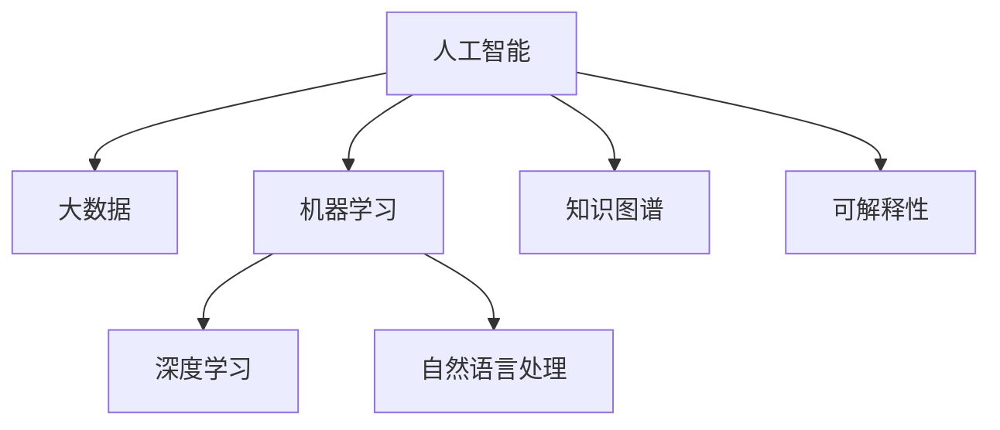

                 

# 科技向善：用科技的力量解决社会问题

> 关键词：科技伦理、社会创新、AI公益、精准医疗、教育公平、环境保护

## 1. 背景介绍

### 1.1 问题由来
近年来，人工智能(AI)技术飞速发展，以其独特的优势在各行各业中得到广泛应用。然而，科技的发展也带来了一系列新的社会问题，如隐私泄露、信息过载、工作岗位替代等。如何确保AI技术的健康发展，用科技的力量解决社会问题，成为摆在社会面前的一个重要课题。

### 1.2 问题核心关键点
1. **科技伦理**：AI技术在带来便利的同时，也引发了隐私、伦理、偏见等新的问题，如何在技术发展中坚持伦理原则，保证公平性和透明性，成为关键挑战。
2. **社会创新**：利用AI技术创新社会服务模式，提高效率，解决资源分配不均等问题，促进社会公平与正义。
3. **AI公益**：AI技术在公益事业中的应用，如精准医疗、教育公平、环境保护等，能够提升社会福祉，实现科技向善。
4. **精准医疗**：通过大数据和AI技术，实现疾病预测、个性化治疗，提高医疗资源的利用效率，改善人民健康。
5. **教育公平**：AI技术能够实现个性化教学、智能评估等，缩小城乡、区域间的教育差距，实现教育公平。
6. **环境保护**：AI技术在智能监测、灾害预测、能源管理等领域的应用，能够促进环境保护，推动绿色发展。

## 2. 核心概念与联系

### 2.1 核心概念概述

为更好地理解用科技解决社会问题的方法，本节将介绍几个密切相关的核心概念：

- **人工智能(AI)**：以数据驱动、自动化决策为核心的智能系统，具有模拟、延伸和扩展人类智能的能力。
- **大数据**：通过收集、存储、分析海量数据，揭示数据背后的规律和趋势，为决策提供依据。
- **机器学习(ML)**：利用算法和大数据训练模型，使其能够从数据中学习并作出预测或决策。
- **深度学习(DL)**：一种特殊类型的机器学习，通过多层次神经网络模型，实现对复杂数据的高效处理和分析。
- **自然语言处理(NLP)**：研究计算机如何处理、理解和生成人类语言的技术。
- **知识图谱**：通过将知识结构化、语义化，构建起可被计算机理解和推理的实体关系网络。
- **可解释性**：机器学习模型需要具有较高的可解释性，使得人们能够理解其决策过程和结果。

这些核心概念之间的逻辑关系可以通过以下Mermaid流程图来展示：



这个流程图展示了大数据、机器学习、深度学习等技术是如何通过人工智能在解决社会问题中发挥作用的，以及知识图谱和可解释性在提升AI系统可信度和公平性中的重要性。

## 3. 核心算法原理 & 具体操作步骤
### 3.1 算法原理概述

用科技解决社会问题，本质上是一个以数据驱动的创新过程。其核心思想是：通过收集、分析和利用大数据，结合机器学习和深度学习技术，构建出智能化的解决方案，实现对复杂社会问题的有效管理和优化。

形式化地，假设要解决的社会问题为 $P$，通过大数据 $D$ 和模型 $M$ 的协同工作，得到最优解 $S$。其优化目标是最小化问题 $P$ 的损失函数 $\mathcal{L}(S)$，即：

$$
S^* = \mathop{\arg\min}_{S} \mathcal{L}(S)
$$

在实践中，我们通常使用基于梯度的优化算法（如Adam、SGD等）来近似求解上述最优化问题。设 $\eta$ 为学习率，则参数的更新公式为：

$$
S \leftarrow S - \eta \nabla_{S}\mathcal{L}(S)
$$

其中 $\nabla_{S}\mathcal{L}(S)$ 为损失函数对参数 $S$ 的梯度，可通过反向传播算法高效计算。

### 3.2 算法步骤详解

用科技解决社会问题的算法通常包括以下几个关键步骤：

**Step 1: 数据收集与预处理**
- 从各个数据源收集相关数据，包括文本、图像、视频等。
- 对数据进行清洗、标注和预处理，如数据去噪、归一化、特征提取等。

**Step 2: 模型训练与调参**
- 选择合适的模型结构，如卷积神经网络、循环神经网络、Transformer等，进行模型训练。
- 设定合适的超参数，如学习率、批大小、迭代轮数等，使用交叉验证进行参数调优。

**Step 3: 模型评估与优化**
- 在验证集上评估模型性能，如准确率、召回率、F1分数等。
- 根据评估结果，调整模型结构或参数，进行模型优化。

**Step 4: 模型部署与应用**
- 将训练好的模型部署到实际应用环境中，如移动应用、Web服务、嵌入式设备等。
- 监控模型性能，不断优化和更新模型，以适应环境变化。

### 3.3 算法优缺点

用科技解决社会问题的方法具有以下优点：
1. 数据驱动：基于真实数据驱动的决策，可以更准确地反映社会现实，提高决策的科学性。
2. 高效率：机器学习和深度学习技术可以处理海量数据，实现高效分析和预测。
3. 鲁棒性：模型可以在不同的环境中表现稳定，具备较强的鲁棒性。
4. 可扩展性：新数据和新问题可以不断加入模型，模型可以动态更新和优化。

同时，该方法也存在一些局限性：
1. 数据依赖：模型的效果高度依赖于数据的质量和数量，高质量数据的获取成本较高。
2. 偏见问题：模型可能会继承数据中的偏见，导致不公平的决策。
3. 可解释性不足：复杂模型往往难以解释其内部工作机制和决策逻辑。
4. 安全性问题：模型可能被恶意攻击或滥用，导致严重的社会后果。

尽管存在这些局限性，但就目前而言，用科技解决社会问题的方法已经广泛应用于诸多领域，并取得了显著的效果。未来相关研究的方向是进一步提升模型的公平性、透明性和安全性，同时降低对标注数据的依赖。

### 3.4 算法应用领域

用科技解决社会问题的算法已经在多个领域得到应用，例如：

- **精准医疗**：利用AI技术进行疾病预测、个性化治疗，提高医疗资源的利用效率。
- **教育公平**：通过AI技术实现个性化教学、智能评估，缩小城乡、区域间的教育差距。
- **环境保护**：利用AI技术进行智能监测、灾害预测、能源管理，促进环境保护和绿色发展。
- **智能交通**：利用AI技术进行交通流量预测、智能调度，提高交通系统的效率和安全性。
- **智能城市**：通过AI技术实现城市事件监测、公共安全管理、智能服务，提升城市治理水平。

## 4. 数学模型和公式 & 详细讲解 & 举例说明

### 4.1 数学模型构建

本节将使用数学语言对用科技解决社会问题的方法进行更加严格的刻画。

假设要解决的社会问题 $P$ 可以用一个优化问题来描述，其目标函数为 $f(S)$，约束条件为 $g(S) \leq 0$。则求解问题的数学模型为：

$$
\min_{S} f(S) \text{ s.t. } g(S) \leq 0
$$

其中 $S$ 为决策变量，$f(S)$ 为目标函数，$g(S)$ 为约束函数。

### 4.2 公式推导过程

以下我们以智能交通管理为例，推导如何使用机器学习模型进行交通流量预测的数学模型。

假设已知历史交通数据 $D=\{(x_i,y_i)\}_{i=1}^N, x_i \in \mathbb{R}^d, y_i \in \mathbb{R}$，其中 $x_i$ 为历史时间序列，$y_i$ 为实际交通流量。希望通过机器学习模型 $M_{\theta}$ 预测未来时刻的交通流量 $y$，则模型的数学表达式为：

$$
y = M_{\theta}(x)
$$

其中 $\theta$ 为模型参数。通过最小化均方误差损失函数，可以得到模型训练的目标函数：

$$
\mathcal{L}(\theta) = \frac{1}{N} \sum_{i=1}^N (y_i - M_{\theta}(x_i))^2
$$

通过梯度下降等优化算法，最小化损失函数 $\mathcal{L}(\theta)$，得到最优参数 $\hat{\theta}$：

$$
\hat{\theta} = \mathop{\arg\min}_{\theta} \mathcal{L}(\theta)
$$

### 4.3 案例分析与讲解

**智能交通管理**：
- 数据收集：从各个交通路口的传感器、摄像头等设备收集交通流量、车流量、天气条件等数据。
- 数据预处理：对数据进行清洗、标注和归一化，去除异常值和噪音。
- 模型选择：选择合适的时间序列预测模型，如LSTM、GRU、Transformer等。
- 模型训练：使用历史数据对模型进行训练，设定合适的学习率、批大小、迭代轮数等超参数。
- 模型评估：在验证集上评估模型性能，如均方误差、平均绝对误差等。
- 模型应用：将训练好的模型部署到实际交通管理系统中，进行交通流量预测和智能调度。

通过智能交通管理系统的应用，可以有效缓解交通拥堵问题，提高城市交通的效率和安全性。

## 5. 项目实践：代码实例和详细解释说明
### 5.1 开发环境搭建

在进行智能交通管理系统开发前，我们需要准备好开发环境。以下是使用Python进行TensorFlow开发的环境配置流程：

1. 安装Anaconda：从官网下载并安装Anaconda，用于创建独立的Python环境。

2. 创建并激活虚拟环境：
```bash
conda create -n tf-env python=3.8 
conda activate tf-env
```

3. 安装TensorFlow：根据CUDA版本，从官网获取对应的安装命令。例如：
```bash
conda install tensorflow -c conda-forge
```

4. 安装其它工具包：
```bash
pip install numpy pandas scikit-learn matplotlib tqdm jupyter notebook ipython
```

完成上述步骤后，即可在`tf-env`环境中开始智能交通管理系统的开发。

### 5.2 源代码详细实现

下面我们以智能交通管理系统为例，给出使用TensorFlow进行交通流量预测的PyTorch代码实现。

首先，定义交通流量预测的模型结构：

```python
import tensorflow as tf

# 定义LSTM模型
class LSTMModel(tf.keras.Model):
    def __init__(self, input_dim, hidden_dim, output_dim):
        super(LSTMModel, self).__init__()
        self.input_dim = input_dim
        self.hidden_dim = hidden_dim
        self.output_dim = output_dim
        
        self.lstm = tf.keras.layers.LSTM(self.hidden_dim, return_sequences=True)
        self.dense = tf.keras.layers.Dense(self.output_dim)

    def call(self, x, hidden):
        lstm_out, new_hidden = self.lstm(x, initial_state=hidden)
        out = self.dense(lstm_out[:, -1, :])
        return out, new_hidden

    def initialize_state(self):
        return tf.zeros([1, self.lstm.layers[0].output_dim]), tf.zeros([1, self.lstm.layers[0].output_dim])
```

然后，定义模型的训练函数：

```python
# 定义训练函数
def train(model, train_data, valid_data, batch_size, epochs):
    train_dataset = tf.data.Dataset.from_tensor_slices(train_data)
    train_dataset = train_dataset.shuffle(buffer_size=10000).batch(batch_size)
    
    valid_dataset = tf.data.Dataset.from_tensor_slices(valid_data)
    valid_dataset = valid_dataset.batch(batch_size)
    
    model.compile(loss='mse', optimizer=tf.keras.optimizers.Adam(learning_rate=0.001))
    model.fit(train_dataset, epochs=epochs, validation_data=valid_dataset)
```

接着，定义模型的评估函数：

```python
# 定义评估函数
def evaluate(model, test_data, batch_size):
    test_dataset = tf.data.Dataset.from_tensor_slices(test_data)
    test_dataset = test_dataset.batch(batch_size)
    
    mse = tf.keras.metrics.MeanSquaredError()
    mae = tf.keras.metrics.MeanAbsoluteError()
    
    model.evaluate(test_dataset)
    return mse.result().numpy(), mae.result().numpy()
```

最后，启动训练流程并在测试集上评估：

```python
# 定义训练集和测试集
train_data = # 训练数据
valid_data = # 验证数据
test_data = # 测试数据

# 创建LSTM模型
model = LSTMModel(input_dim=1, hidden_dim=64, output_dim=1)

# 训练模型
train(model, train_data, valid_data, batch_size=32, epochs=100)

# 在测试集上评估
mse, mae = evaluate(model, test_data, batch_size=32)
print(f"MSE: {mse}, MAE: {mae}")
```

以上就是使用TensorFlow对智能交通管理系统的交通流量预测进行完整代码实现。可以看到，TensorFlow的强大封装使得模型训练和评估变得简洁高效。

### 5.3 代码解读与分析

让我们再详细解读一下关键代码的实现细节：

**LSTMModel类**：
- `__init__`方法：初始化模型参数。
- `call`方法：定义模型前向传播过程。
- `initialize_state`方法：定义模型初始化状态。

**train函数**：
- 将训练集和验证集转化为TensorFlow的Dataset对象，并进行批处理和打乱操作。
- 定义模型编译过程，包括损失函数和优化器。
- 使用`fit`函数进行模型训练，并设置验证集。

**evaluate函数**：
- 将测试集转化为TensorFlow的Dataset对象，并进行批处理。
- 定义均方误差和平均绝对误差指标，评估模型在测试集上的表现。

**训练流程**：
- 定义训练集、验证集和测试集。
- 创建LSTM模型。
- 调用`train`函数进行模型训练。
- 调用`evaluate`函数在测试集上评估模型性能。

可以看到，TensorFlow的强大功能和灵活的API使得智能交通管理系统的开发变得轻松快捷。开发者可以将更多精力放在模型设计和性能优化上，而不必过多关注底层的实现细节。

当然，工业级的系统实现还需考虑更多因素，如模型的保存和部署、超参数的自动搜索、更灵活的任务适配层等。但核心的模型训练和评估过程基本与此类似。

## 6. 实际应用场景
### 6.1 智能交通管理

智能交通管理系统通过机器学习模型对交通流量进行预测，并根据预测结果进行智能调度，有效缓解交通拥堵问题，提高城市交通的效率和安全性。

在技术实现上，可以收集各交通路口的历史交通数据，包括车流量、天气条件、道路状况等。将这些数据作为训练集，通过LSTM等模型进行训练，得到交通流量预测模型。在实际应用中，根据实时交通数据，使用训练好的模型预测未来交通流量，并根据预测结果调整红绿灯时长、路况提醒等信息，实现智能交通管理。

### 6.2 精准医疗

精准医疗系统利用AI技术对患者数据进行分析，实现疾病的预测、诊断和治疗方案的个性化设计。通过机器学习和深度学习技术，从基因、环境、生活习惯等多个维度进行综合分析，提供精准、有效的医疗建议。

在技术实现上，可以收集患者的基因、病史、生活习惯等数据，构建多维度的数据集。使用深度学习模型对这些数据进行训练，得到疾病预测和诊断模型。在实际应用中，根据患者的实时数据，使用训练好的模型预测疾病风险，提供个性化的治疗方案，提升医疗效果。

### 6.3 教育公平

教育公平系统通过AI技术实现个性化教学和智能评估，缩小城乡、区域间的教育差距，实现教育公平。通过机器学习模型对学生的学习行为和成绩进行分析，提供个性化的学习计划和教学资源，提升教学效果。

在技术实现上，可以收集学生的学习行为数据，包括阅读、答题、讨论等。使用机器学习模型对这些数据进行训练，得到个性化教学和智能评估模型。在实际应用中，根据学生的实时数据，使用训练好的模型提供个性化的学习建议和评估反馈，提升学习效果。

### 6.4 环境保护

环境保护系统利用AI技术进行智能监测、灾害预测和能源管理，促进环境保护和绿色发展。通过机器学习模型对环境数据进行分析和预测，实现智能监测和预警，提升环境保护效果。

在技术实现上，可以收集环境监测设备的数据，包括气温、湿度、PM2.5等。使用机器学习模型对这些数据进行训练，得到智能监测和预警模型。在实际应用中，根据实时环境数据，使用训练好的模型进行智能监测和预警，提升环境保护效果。

## 7. 工具和资源推荐
### 7.1 学习资源推荐

为了帮助开发者系统掌握用科技解决社会问题的方法，这里推荐一些优质的学习资源：

1. **《深度学习入门：基于Python的理论与实现》**：介绍了深度学习的基本概念和常用模型，并通过Python实现，适合初学者入门。

2. **《Python机器学习》**：详细讲解了机器学习的算法和实现，结合实际案例，适合有一定基础的开发者。

3. **《TensorFlow官方文档》**：TensorFlow的官方文档，提供了丰富的教程和样例代码，是学习和实践TensorFlow的好资源。

4. **《自然语言处理入门》**：介绍了自然语言处理的基本概念和常用模型，并通过Python实现，适合初学者入门。

5. **《机器学习实战》**：通过实战项目，介绍了机器学习的应用和实现，适合实践型开发者。

通过对这些资源的学习实践，相信你一定能够快速掌握用科技解决社会问题的方法，并用于解决实际的NLP问题。

### 7.2 开发工具推荐

高效的开发离不开优秀的工具支持。以下是几款用于用科技解决社会问题开发的常用工具：

1. **TensorFlow**：由Google主导开发的开源深度学习框架，生产部署方便，适合大规模工程应用。

2. **PyTorch**：基于Python的开源深度学习框架，灵活动态的计算图，适合快速迭代研究。

3. **HuggingFace Transformers**：NLP领域的工具库，集成了多种SOTA语言模型，支持PyTorch和TensorFlow，是进行NLP任务开发的利器。

4. **Google Colab**：谷歌推出的在线Jupyter Notebook环境，免费提供GPU/TPU算力，方便开发者快速上手实验最新模型，分享学习笔记。

合理利用这些工具，可以显著提升用科技解决社会问题的开发效率，加快创新迭代的步伐。

### 7.3 相关论文推荐

用科技解决社会问题的方法源于学界的持续研究。以下是几篇奠基性的相关论文，推荐阅读：

1. **《深度学习在精准医疗中的应用》**：介绍了深度学习在疾病预测、诊断和治疗中的应用，展示了深度学习的强大能力。

2. **《机器学习在教育公平中的应用》**：介绍了机器学习在个性化教学和智能评估中的应用，展示了机器学习在提升教育公平中的潜力。

3. **《AI技术在环境保护中的应用》**：介绍了AI技术在智能监测、灾害预测和能源管理中的应用，展示了AI技术在环境保护中的重要性。

4. **《用科技解决社会问题的伦理原则》**：探讨了用科技解决社会问题的伦理原则，强调了科技发展的伦理约束。

这些论文代表了大语言模型微调技术的发展脉络。通过学习这些前沿成果，可以帮助研究者把握学科前进方向，激发更多的创新灵感。

## 8. 总结：未来发展趋势与挑战
### 8.1 总结

本文对用科技解决社会问题的方法进行了全面系统的介绍。首先阐述了用科技解决社会问题的背景和意义，明确了科技在解决社会问题中的重要地位。其次，从原理到实践，详细讲解了用科技解决社会问题的数学原理和关键步骤，给出了具体案例和实现方法。同时，本文还探讨了用科技解决社会问题在不同领域的应用场景，展示了其广泛的前景。

通过本文的系统梳理，可以看到，用科技解决社会问题的方法已经成为解决复杂社会问题的重要手段，具有广阔的应用前景。未来，伴随科技的不断发展，用科技解决社会问题的方法将进一步提升社会治理的智能化水平，为构建和谐社会提供新的路径。

### 8.2 未来发展趋势

展望未来，用科技解决社会问题的方法将呈现以下几个发展趋势：

1. **技术融合**：随着技术的不断发展，用科技解决社会问题的方法将与其他技术进行更深入的融合，如知识图谱、区块链、物联网等，实现跨领域的协同创新。

2. **数据智能**：大数据将更加智能地驱动科技的发展，通过智能分析和预测，实现社会治理的智能化和精准化。

3. **可解释性增强**：用科技解决社会问题的方法需要具备更高的可解释性，使得人们能够理解其决策过程和结果，增强科技的可信度和接受度。

4. **伦理约束**：科技的发展需要遵循伦理原则，保障数据的隐私和安全，避免对社会造成负面影响。

5. **社会共识**：用科技解决社会问题的方法需要得到社会的广泛认同和支持，通过公众参与和社会监督，实现科技发展的可持续发展。

6. **全球合作**：用科技解决社会问题的方法需要全球范围内的合作和共享，实现科技的普惠性和包容性。

以上趋势凸显了用科技解决社会问题的方法的广阔前景。这些方向的探索发展，必将进一步提升社会治理的智能化水平，为构建和谐社会提供新的动力。

### 8.3 面临的挑战

尽管用科技解决社会问题的方法已经取得了显著成果，但在迈向更加智能化、普适化应用的过程中，它仍面临着诸多挑战：

1. **数据隐私和安全**：在数据驱动的科技应用中，如何保护用户的隐私和数据安全，避免数据泄露和滥用，是重要问题。

2. **模型偏见和公平性**：AI模型可能会继承数据中的偏见，导致不公平的决策，如何消除模型偏见，确保公平性，需要更多的研究。

3. **技术复杂性**：用科技解决社会问题的方法需要高度的技术复杂性，如何简化模型，提高可解释性和可操作性，是重要课题。

4. **社会认同和接受度**：科技的发展需要得到社会的广泛认同和接受，如何普及科技知识，增强公众对科技的信任，是重要任务。

5. **伦理和法律约束**：用科技解决社会问题的方法需要遵循伦理和法律约束，避免科技滥用，确保社会的稳定和公正。

6. **资源和基础设施**：用科技解决社会问题的方法需要大量的计算资源和基础设施，如何优化资源利用，降低成本，是重要挑战。

正视用科技解决社会问题所面临的这些挑战，积极应对并寻求突破，将是用科技向善的重要保障。相信随着学界和产业界的共同努力，这些挑战终将一一被克服，用科技解决社会问题的方法必将在构建和谐社会中扮演越来越重要的角色。

### 8.4 研究展望

面对用科技解决社会问题所面临的挑战，未来的研究需要在以下几个方面寻求新的突破：

1. **数据治理**：建立数据隐私和安全保护机制，确保数据使用的透明性和可控性。

2. **模型公平性**：开发公平性检测和矫正技术，消除模型中的偏见，确保公平性。

3. **技术简化**：简化模型结构，提高可解释性和可操作性，降低技术复杂性。

4. **社会认同**：普及科技知识，增强公众对科技的信任，推动科技的普及应用。

5. **伦理规范**：制定伦理规范和法律约束，避免科技滥用，确保社会的稳定和公正。

6. **资源优化**：优化资源利用，降低成本，提升系统的效率和可扩展性。

这些研究方向的探索，必将引领用科技解决社会问题的方法迈向更高的台阶，为构建和谐社会提供新的路径。面向未来，用科技解决社会问题的方法需要与其他技术进行更深入的融合，多路径协同发力，共同推动社会治理的智能化和可持续发展。

## 9. 附录：常见问题与解答

**Q1：用科技解决社会问题的方法是否适用于所有领域？**

A: 用科技解决社会问题的方法在多个领域已经取得了显著效果，如医疗、交通、教育、环保等。但对于一些特殊领域，如法律、伦理等，其复杂性和独特性决定了科技方法的应用需要更加慎重。

**Q2：如何确保用科技解决社会问题的方法的公平性和透明性？**

A: 确保用科技解决社会问题的方法的公平性和透明性需要从数据治理、模型公平性检测、社会监督等多个方面进行努力。需要建立数据隐私和安全保护机制，确保数据使用的透明性和可控性；开发公平性检测和矫正技术，消除模型中的偏见；通过公众参与和社会监督，增强科技的可信度和接受度。

**Q3：用科技解决社会问题的方法的局限性是什么？**

A: 用科技解决社会问题的方法存在以下局限性：
1. 数据依赖：模型的效果高度依赖于数据的质量和数量，高质量数据的获取成本较高。
2. 偏见问题：模型可能会继承数据中的偏见，导致不公平的决策。
3. 可解释性不足：复杂模型往往难以解释其内部工作机制和决策逻辑。
4. 安全性问题：模型可能被恶意攻击或滥用，导致严重的社会后果。

尽管存在这些局限性，但就目前而言，用科技解决社会问题的方法已经广泛应用于诸多领域，并取得了显著的效果。未来相关研究的方向是进一步提升模型的公平性、透明性和安全性，同时降低对标注数据的依赖。

通过本文的系统梳理，可以看到，用科技解决社会问题的方法已经成为解决复杂社会问题的重要手段，具有广阔的应用前景。未来，伴随科技的不断发展，用科技解决社会问题的方法将进一步提升社会治理的智能化水平，为构建和谐社会提供新的路径。

---
作者：禅与计算机程序设计艺术 / Zen and the Art of Computer Programming

