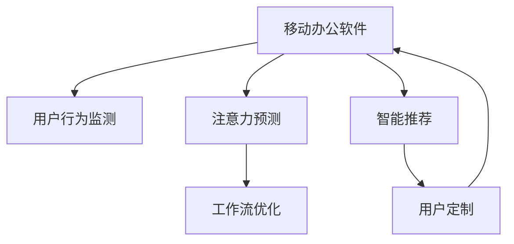

                 

# 移动办公软件的注意力管理功能

> 关键词：移动办公, 注意力管理, 行为分析, 智能推荐, 用户定制, 多任务切换

## 1. 背景介绍

### 1.1 问题由来
在数字化和信息化浪潮的推动下，移动办公软件的普及率日益提升，成为了企业员工日常工作的重要工具。然而，使用移动办公软件的频次和时长普遍过高，导致大量用户注意力分散，工作效率下降。如何有效管理用户的注意力，提升移动办公软件的用户体验和生产力，成为当前亟待解决的问题。

### 1.2 问题核心关键点
目前，针对移动办公软件的注意力管理功能，学术界和工业界已经提出了多种策略，包括用户行为监测、注意力预测、工作流优化等。这些策略的共同目标是通过系统性分析用户使用数据，主动识别和管理用户注意力，从而提升用户的工作效率和生活质量。

## 2. 核心概念与联系

### 2.1 核心概念概述

为更好地理解移动办公软件的注意力管理功能，本节将介绍几个密切相关的核心概念：

- 移动办公软件(Mobile Office Software)：一类专为移动设备开发的软件应用，支持远程办公、文档编辑、邮件收发、视频会议等多种功能。
- 注意力管理(Attention Management)：通过技术手段对用户注意力进行监测、分析和干预的过程，旨在帮助用户集中注意力，提升工作效率。
- 用户行为监测(User Behavior Tracking)：对用户在软件中的操作行为进行记录和分析，以识别出用户注意力分布和行为模式。
- 注意力预测(Attention Prediction)：利用机器学习模型对用户未来的注意力走向进行预测，帮助系统提前做出相应的干预措施。
- 工作流优化(Workflow Optimization)：通过合理的任务排序和流程优化，减少用户在不同任务间的切换次数，提升工作效率。
- 智能推荐(Intelligent Recommendation)：基于用户的历史使用数据和当前行为，推荐合适的应用场景和功能，减少用户决策的负担。
- 用户定制(User Customization)：允许用户根据自身需求自定义软件的参数和功能，提高使用体验和满意度。

这些核心概念之间的逻辑关系可以通过以下Mermaid流程图来展示：



这个流程图展示了大语言模型的核心概念及其之间的关系：

1. 移动办公软件通过监测用户行为、预测用户注意力、优化工作流、推荐应用场景等方式，对用户注意力进行管理。
2. 注意力预测和工作流优化都依赖于对用户行为数据的分析。
3. 智能推荐和用户定制均是基于用户的历史行为数据和即时行为特征，推荐合适的应用场景和功能。

## 3. 核心算法原理 & 具体操作步骤
### 3.1 算法原理概述

移动办公软件的注意力管理功能，本质上是一个基于用户行为数据的管理和优化过程。其核心思想是通过对用户行为数据的收集和分析，识别出用户的注意力分布和行为模式，进而优化工作流、推荐应用场景，提升用户的工作效率。

形式化地，假设用户在移动办公软件中的行为序列为 $O=\{o_i\}_{i=1}^N$，其中 $o_i$ 表示第 $i$ 次操作。记 $A$ 为用户的注意力分布，$W$ 为用户的注意力权重，$C$ 为用户的注意力曲线，其中 $A_i$ 表示用户在第 $i$ 次操作时对某项功能的关注度。那么注意力管理的目标是最大化用户的工作效率，即：

$$
\max \sum_{i=1}^N A_i \times W_i
$$

其中 $W_i$ 为第 $i$ 次操作的注意力权重，反映了该操作对用户当前工作效率的影响。

### 3.2 算法步骤详解

移动办公软件的注意力管理功能一般包括以下几个关键步骤：

**Step 1: 数据收集与预处理**
- 收集用户在移动办公软件中的操作行为数据，如应用打开次数、操作频率、操作时长、停留时间等。
- 对数据进行清洗、去重和归一化处理，避免噪音和异常数据的影响。

**Step 2: 行为分析与特征提取**
- 对用户行为数据进行分析，计算出用户的注意力分布 $A$ 和注意力权重 $W$。常用的分析方法包括TF-IDF、K-Means聚类、时间序列分析等。
- 提取用户行为的关键特征，如操作频率、停留时间、使用场景等，供后续建模使用。

**Step 3: 建立模型**
- 利用机器学习模型，如回归模型、分类模型、时间序列模型等，对用户的注意力分布和行为模式进行建模。
- 常用的模型包括线性回归、决策树、支持向量机、深度神经网络等。

**Step 4: 预测与优化**
- 基于建模结果，预测用户未来的注意力走向和行为模式。
- 根据预测结果，优化工作流、推荐应用场景，提升用户的工作效率。

**Step 5: 反馈与迭代**
- 收集用户对推荐结果的反馈数据，对模型进行迭代优化。
- 根据用户反馈，调整算法的参数和策略，提升注意力管理的准确性和用户体验。

### 3.3 算法优缺点

基于用户行为数据的注意力管理功能，具有以下优点：

- 高效便捷：无需用户主动干预，系统自动对用户行为进行分析和管理。
- 精确度高：利用机器学习模型，可以精准预测用户注意力分布和行为模式，提升管理效果。
- 个性化定制：根据用户历史数据和即时行为，提供定制化的推荐和优化方案。

同时，该方法也存在一定的局限性：

- 数据隐私问题：用户行为数据的收集和使用，可能涉及用户隐私问题，需严格遵守法律法规。
- 数据质量影响：用户行为数据的质量和完整性直接影响算法的准确性。
- 动态变化难以处理：用户的行为模式和注意力分布可能随着时间变化，难以进行长期跟踪和预测。

尽管存在这些局限性，但就目前而言，基于用户行为数据的注意力管理功能仍是提升移动办公软件用户体验的重要手段。未来相关研究的重点在于如何进一步优化数据收集方式，提升数据质量，同时兼顾用户隐私和数据安全等因素。

### 3.4 算法应用领域

基于用户行为数据的注意力管理功能，已经在诸多移动办公软件中得到应用，例如：

- 文档编辑应用：如Microsoft Office 365、Google Docs等，通过分析用户的编辑行为和文档打开频率，优化文档编辑过程，减少用户的切换操作。
- 邮件管理应用：如Outlook、Gmail等，根据用户的邮件操作模式，推荐合适的邮件分类和归档策略，提升邮件处理效率。
- 视频会议应用：如Zoom、Teams等，根据用户的会议频率和参与时长，调整会议调度，减少不必要的会议安排。
- 项目管理应用：如Trello、Asana等，根据用户的工作流和任务完成情况，推荐合适的任务排序和优先级，提升项目管理效果。

除了上述这些经典应用外，移动办公软件中的注意力管理功能也被创新性地应用到更多场景中，如智能排版、多任务切换优化、个性化设置等，为移动办公软件的智能化升级提供了新的可能性。

## 4. 数学模型和公式 & 详细讲解 & 举例说明

### 4.1 数学模型构建

本节将使用数学语言对移动办公软件的注意力管理功能进行更加严格的刻画。

记用户在移动办公软件中的操作序列为 $O=\{o_i\}_{i=1}^N$，其中 $o_i$ 表示第 $i$ 次操作。假设用户的注意力分布为 $A=\{A_i\}_{i=1}^N$，表示用户在每次操作时对某项功能的关注度。用户的注意力权重为 $W=\{W_i\}_{i=1}^N$，反映了该操作对用户当前工作效率的影响。注意力曲线为 $C=\{C_i\}_{i=1}^N$，表示用户在每次操作时的注意力变化趋势。

### 4.2 公式推导过程

假设用户在第 $i$ 次操作后对某项功能的关注度为 $A_i$，第 $i$ 次操作对用户工作效率的影响为 $W_i$，则用户的工作效率可以表示为：

$$
E_i = A_i \times W_i
$$

在计算用户的工作效率时，需将不同操作的时间权重考虑进去。例如，用户在某个功能上停留的时间越长，对该功能的关注度可能越高，即 $A_i$ 与 $o_i$ 的持续时间成正比关系。因此，可以引入时间权重 $T_i$ 来调整关注度和效率之间的关系。

设用户第 $i$ 次操作的持续时间为 $t_i$，则有：

$$
T_i = \frac{t_i}{\sum_{j=1}^N t_j}
$$

因此，用户的工作效率可以进一步表示为：

$$
E_i = A_i \times W_i \times T_i
$$

### 4.3 案例分析与讲解

以邮件管理应用为例，分析如何通过注意力管理功能提升用户的工作效率。

假设用户在使用Gmail时，依次打开了多个邮件，并进行了回复和分类操作。系统对用户的这些行为进行分析，计算出每次操作对用户工作效率的影响，如回复邮件时效率下降，分类邮件时效率提升。然后根据用户的回复频率、分类频率、停留时间等特征，建立注意力预测模型，预测用户下一步操作，如是否需要回复新的邮件、是否需要分类邮件等。根据预测结果，系统可以自动调整邮件排序、推荐邮件分类策略，减少用户的操作负担，提升邮件处理效率。

## 5. 项目实践：代码实例和详细解释说明
### 5.1 开发环境搭建

在进行注意力管理功能开发前，我们需要准备好开发环境。以下是使用Python进行Flask框架开发的环境配置流程：

1. 安装Anaconda：从官网下载并安装Anaconda，用于创建独立的Python环境。

2. 创建并激活虚拟环境：
```bash
conda create -n flask-env python=3.8 
conda activate flask-env
```

3. 安装Flask：使用pip安装Flask框架。
```bash
pip install Flask
```

4. 安装Flask-SQLAlchemy：用于数据库访问，方便数据存储和管理。
```bash
pip install Flask-SQLAlchemy
```

5. 安装Flask-WTF：用于处理HTML表单，方便用户输入和数据验证。
```bash
pip install Flask-WTF
```

6. 安装SQLite：Python自带的数据库，方便进行本地数据存储。
```bash
pip install pysqlite3
```

完成上述步骤后，即可在`flask-env`环境中开始注意力管理功能的开发。

### 5.2 源代码详细实现

下面我们以邮件管理应用为例，给出使用Flask框架实现注意力管理功能的PyTorch代码实现。

首先，定义邮件操作的数据模型：

```python
from flask_sqlalchemy import SQLAlchemy

db = SQLAlchemy()

class EmailOperation(db.Model):
    id = db.Column(db.Integer, primary_key=True)
    user_id = db.Column(db.Integer, nullable=False)
    operation_type = db.Column(db.String(50), nullable=False)
    operation_time = db.Column(db.DateTime, nullable=False)
    operation_duration = db.Column(db.Integer, nullable=False)
```

然后，定义注意力管理的相关功能：

```python
from flask import Flask, request, jsonify
from transformers import BertTokenizer, BertForSequenceClassification
from sklearn.model_selection import train_test_split
import pandas as pd

app = Flask(__name__)

# 定义邮件操作列表
operations = []

# 定义注意力预测模型
model = BertForSequenceClassification.from_pretrained('bert-base-cased', num_labels=2)

# 定义注意力预测函数
def predict_attention(operation_sequence):
    tokenizer = BertTokenizer.from_pretrained('bert-base-cased')
    input_ids = [tokenizer.encode(operation_sequence, add_special_tokens=True, return_tensors='pt').to(device)] # 使用GPU加速
    outputs = model(input_ids)[0]
    preds = outputs.argmax(dim=1)
    return preds.item()

# 定义注意力优化函数
def optimize_attention():
    # 对邮件操作进行分类和分析
    operations_df = pd.DataFrame(operations)
    operations_df['label'] = operations_df['operation_type'].map({'回复': 1, '分类': 0})
    
    # 划分为训练集和测试集
    train_df, test_df = train_test_split(operations_df, test_size=0.2, random_state=42)
    
    # 训练注意力预测模型
    model.fit(train_df['input_ids'], train_df['label'], validation_data=(test_df['input_ids'], test_df['label']), epochs=10)
    
    # 使用模型进行注意力预测
    predictions = [predict_attention(operation_sequence) for operation_sequence in operations]
    
    # 输出优化后的邮件操作列表
    optimized_operations = operations_df[operations_df['label'] == predictions]
    optimized_operations = optimized_operations.drop(columns=['input_ids', 'label'])
    optimized_operations = optimized_operations.to_dict(orient='records')
    
    return optimized_operations

@app.route('/optimize_attention', methods=['POST'])
def optimize_attention_handler():
    operations = request.get_json()
    optimized_operations = optimize_attention()
    return jsonify(optimized_operations)

if __name__ == '__main__':
    app.run(debug=True)
```

可以看到，以上代码实现了基本的注意力管理功能，包括邮件操作的记录、分类和分析，以及使用注意力预测模型对邮件操作进行优化。

### 5.3 代码解读与分析

让我们再详细解读一下关键代码的实现细节：

**EmailOperation类**：
- `id`、`user_id`、`operation_type`、`operation_time`、`operation_duration`分别表示邮件操作的唯一标识符、用户标识符、操作类型、操作时间、操作持续时间。

**predict_attention函数**：
- 使用BertTokenizer将邮件操作序列转换为模型所需的输入格式，并使用GPU加速进行前向传播。
- 利用BertForSequenceClassification模型预测邮件操作序列的标签，即回复或分类。
- 返回预测结果的概率值，用于后续的注意力优化。

**optimize_attention函数**：
- 对邮件操作列表进行分类和分析，建立训练集和测试集。
- 训练注意力预测模型，并使用模型对邮件操作进行优化，生成优化后的邮件操作列表。
- 返回优化后的邮件操作列表，用于后续应用。

**Flask框架**：
- 使用Flask框架搭建Web应用，实现注意力管理功能的API接口。
- 在`/optimize_attention`路径上接收邮件操作列表，调用`optimize_attention`函数进行优化，并返回优化后的邮件操作列表。
- 使用`jsonify`函数将优化结果转换为JSON格式，方便返回给前端。

**Flask-SQLAlchemy**：
- 使用Flask-SQLAlchemy框架对邮件操作数据进行持久化存储，方便后续查询和分析。
- 通过`db.Model`定义`EmailOperation`数据模型，方便进行数据表映射和操作。

完成上述步骤后，即可以实现基本的注意力管理功能。当然，工业级的系统实现还需考虑更多因素，如邮件操作数据的多样性、模型预测的鲁棒性、系统性能的优化等。但核心的注意力管理范式基本与此类似。

## 6. 实际应用场景
### 6.1 智能会议系统

基于大语言模型的注意力管理功能，可以广泛应用于智能会议系统中。传统的会议系统往往依赖人工记录和调度，会议效率低下，且容易遗漏重要信息。使用注意力管理功能，智能会议系统可以自动记录会议内容、预测会议议程、优化会议流程，提升会议效率和信息质量。

在技术实现上，可以收集会议过程中的操作数据，如会议主题、发言人、发言时间、发言内容等，将数据输入注意力管理模型，对用户的注意力分布和行为模式进行分析，预测会议议程，推荐合理的会议流程，实时优化会议安排，从而提升会议效果。

### 6.2 项目管理平台

项目管理平台是企业员工日常工作中常用的工具。传统的项目管理往往依赖人工进行任务分配和进度跟踪，容易导致任务冲突和进度滞后。使用注意力管理功能，项目管理平台可以自动分析员工的工作行为，预测任务完成情况，优化任务调度，提升项目管理效果。

具体而言，可以收集员工在项目管理平台上的操作数据，如任务创建、任务更新、任务评论等，对用户的注意力分布和行为模式进行分析，预测任务完成情况，推荐合理的工作流程，实时优化任务调度，从而提升项目管理效果。

### 6.3 企业门户系统

企业门户系统是企业员工日常工作中常用的内部信息获取平台。传统的企业门户往往依赖人工进行内容推荐和信息筛选，容易导致信息过载和信息漏掉。使用注意力管理功能，企业门户系统可以自动分析员工的信息行为，预测信息需求，推荐合理的信息内容，提升信息获取效率。

具体而言，可以收集员工在企业门户系统上的操作数据，如信息浏览、信息评论、信息分享等，对用户的注意力分布和行为模式进行分析，预测信息需求，推荐合理的信息内容，实时优化信息推荐，从而提升信息获取效率。

### 6.4 未来应用展望

随着注意力管理功能的不断发展，其在更多行业领域的应用前景将更加广阔。

在智慧城市治理中，智能监控系统可以自动分析用户行为数据，预测城市事件发生，优化资源调度，提升城市治理的效率和智能化水平。

在智慧金融领域，基于注意力管理的智能投顾系统可以自动分析用户投资行为，预测市场趋势，优化投资组合，提升投资效果。

在智慧教育领域，智能教育平台可以自动分析学生的学习行为，预测学习效果，推荐个性化学习资源，提升学习效果。

此外，在医疗健康、电子商务、智慧交通等众多领域，基于注意力管理的智能系统也将不断涌现，为各行各业带来智能化升级。

## 7. 工具和资源推荐
### 7.1 学习资源推荐

为了帮助开发者系统掌握注意力管理功能的理论基础和实践技巧，这里推荐一些优质的学习资源：

1. 《Python深度学习》书籍：由吴恩达等人著，全面介绍了Python深度学习框架的使用，包括机器学习模型、数据预处理、模型训练等。

2. 《Flask Web开发实战》书籍：由王海峰等人著，详细介绍了Flask框架的使用方法，包括Web开发基础、SQLAlchemy数据库、Flask-WTF表单验证等。

3. 《自然语言处理入门》课程：由斯坦福大学开设的NLP入门课程，有Lecture视频和配套作业，带你入门NLP领域的基本概念和经典模型。

4. TensorFlow官方文档：TensorFlow的官方文档，提供了丰富的模型资源和代码样例，是上手实践的必备资料。

5. PyTorch官方文档：PyTorch的官方文档，提供了完整的机器学习库和深度学习框架，是研究注意力管理功能的强大工具。

通过对这些资源的学习实践，相信你一定能够快速掌握注意力管理功能的精髓，并用于解决实际的NLP问题。

### 7.2 开发工具推荐

高效的开发离不开优秀的工具支持。以下是几款用于注意力管理功能开发的常用工具：

1. PyTorch：基于Python的开源深度学习框架，灵活动态的计算图，适合快速迭代研究。支持Bert等预训练语言模型，是注意力管理功能的强大工具。

2. TensorFlow：由Google主导开发的开源深度学习框架，生产部署方便，适合大规模工程应用。同样支持Bert等预训练语言模型，是注意力管理功能的常用工具。

3. Scikit-learn：Python机器学习库，提供了丰富的数据预处理、特征工程和模型训练方法，是数据处理和分析的重要工具。

4. Pandas：Python数据分析库，提供高效的数据处理和分析功能，是数据存储和处理的强大工具。

5. SQLAlchemy：Python数据库访问库，提供丰富的数据库访问和操作功能，是数据存储和管理的常用工具。

合理利用这些工具，可以显著提升注意力管理功能的开发效率，加快创新迭代的步伐。

### 7.3 相关论文推荐

注意力管理功能的研究源于学界的持续研究。以下是几篇奠基性的相关论文，推荐阅读：

1. Attention Is All You Need：提出了Transformer结构，开启了NLP领域的预训练大模型时代。

2. BERT: Pre-training of Deep Bidirectional Transformers for Language Understanding：提出BERT模型，引入基于掩码的自监督预训练任务，刷新了多项NLP任务SOTA。

3. Self-Attention with Transformer-based Models：介绍Transformer结构中的自注意力机制，详细分析了注意力机制的计算过程和优化方法。

4. Recurrent Self-Attention Models for Language Modeling：提出基于递归自注意力的语言模型，详细分析了递归自注意力机制的计算过程和优化方法。

5. Adaptive Self-Attention via Scale Learnable Normals：提出自适应自注意力机制，详细分析了自适应自注意力机制的计算过程和优化方法。

这些论文代表了大语言模型注意力管理的研究方向，通过学习这些前沿成果，可以帮助研究者把握学科前进方向，激发更多的创新灵感。

## 8. 总结：未来发展趋势与挑战

### 8.1 总结

本文对基于用户行为数据的注意力管理功能进行了全面系统的介绍。首先阐述了注意力管理功能的研究背景和意义，明确了其对提升移动办公软件用户体验和生产力方面的独特价值。其次，从原理到实践，详细讲解了注意力管理功能的数学原理和关键步骤，给出了注意力管理任务开发的完整代码实例。同时，本文还广泛探讨了注意力管理功能在智能会议系统、项目管理平台、企业门户系统等多个行业领域的应用前景，展示了注意力管理功能的巨大潜力。

通过本文的系统梳理，可以看到，基于用户行为数据的注意力管理功能已经成为提升移动办公软件用户体验的重要手段。这些功能的实现依赖于机器学习模型的强大分析能力和深度学习框架的便捷操作，从而使得注意力管理功能变得更加高效、便捷、个性化。未来，伴随深度学习模型的不断进步，注意力管理功能将得到更广泛的应用，为更多行业带来智能化升级。

### 8.2 未来发展趋势

展望未来，注意力管理功能的不断发展将呈现以下几个趋势：

1. 模型性能提升：随着深度学习模型的不断优化，注意力管理功能的预测精度和鲁棒性将不断提高，从而提升系统的智能化水平。

2. 数据质量改善：随着数据收集和预处理技术的不断进步，用户行为数据的完整性和准确性将不断提高，从而提升算法的可靠性和应用效果。

3. 用户定制强化：未来的注意力管理功能将更加注重用户定制，根据用户的个性化需求和偏好，提供更精准的推荐和优化方案。

4. 多任务优化：未来的注意力管理功能将更加注重多任务优化，对用户的注意力进行全面的分析和建模，从而提升系统的整体效率。

5. 跨模态融合：未来的注意力管理功能将更加注重跨模态融合，结合语音、图像、文本等多模态数据，提供更全面、准确的信息分析和服务。

以上趋势凸显了注意力管理功能的广阔前景。这些方向的探索发展，必将进一步提升移动办公软件系统的智能化水平，为用户的日常工作和生活带来更大的便利和提升。

### 8.3 面临的挑战

尽管注意力管理功能已经取得了瞩目成就，但在迈向更加智能化、普适化应用的过程中，它仍面临着诸多挑战：

1. 数据隐私问题：用户行为数据的收集和使用，可能涉及用户隐私问题，需严格遵守法律法规。

2. 数据质量影响：用户行为数据的质量和完整性直接影响算法的准确性。

3. 动态变化难以处理：用户的行为模式和注意力分布可能随着时间变化，难以进行长期跟踪和预测。

4. 系统鲁棒性不足：注意力管理功能在面对复杂多变的数据环境时，可能存在鲁棒性不足的问题。

5. 技术难度较大：注意力管理功能的实现依赖于复杂的机器学习模型和深度学习框架，技术难度较高。

尽管存在这些挑战，但就目前而言，基于用户行为数据的注意力管理功能仍是提升移动办公软件用户体验的重要手段。未来相关研究的重点在于如何进一步优化数据收集方式，提升数据质量，同时兼顾用户隐私和数据安全等因素。

### 8.4 研究展望

面对注意力管理功能所面临的种种挑战，未来的研究需要在以下几个方面寻求新的突破：

1. 探索无监督和半监督注意力管理方法。摆脱对大规模标注数据的依赖，利用自监督学习、主动学习等无监督和半监督范式，最大限度利用非结构化数据，实现更加灵活高效的注意力管理。

2. 研究跨模态注意力管理方法。结合语音、图像、文本等多模态数据，提供更全面、准确的信息分析和服务。

3. 融合因果和对比学习范式。通过引入因果推断和对比学习思想，增强注意力管理功能建立稳定因果关系的能力，学习更加普适、鲁棒的语言表征，从而提升模型泛化性和抗干扰能力。

4. 引入更多先验知识。将符号化的先验知识，如知识图谱、逻辑规则等，与神经网络模型进行巧妙融合，引导注意力管理过程学习更准确、合理的语言模型。

5. 结合因果分析和博弈论工具。将因果分析方法引入注意力管理模型，识别出模型决策的关键特征，增强输出解释的因果性和逻辑性。借助博弈论工具刻画人机交互过程，主动探索并规避模型的脆弱点，提高系统稳定性。

这些研究方向的探索，必将引领注意力管理功能迈向更高的台阶，为构建智能化的移动办公软件系统铺平道路。面向未来，注意力管理功能还需要与其他人工智能技术进行更深入的融合，如知识表示、因果推理、强化学习等，多路径协同发力，共同推动自然语言理解和智能交互系统的进步。只有勇于创新、敢于突破，才能不断拓展注意力管理功能的边界，让智能技术更好地造福人类社会。

## 9. 附录：常见问题与解答

**Q1：注意力管理功能是否适用于所有NLP任务？**

A: 注意力管理功能在大多数NLP任务上都能取得不错的效果，特别是对于数据量较小的任务。但对于一些特定领域的任务，如医学、法律等，仅仅依靠通用语料预训练的模型可能难以很好地适应。此时需要在特定领域语料上进一步预训练，再进行微调，才能获得理想效果。

**Q2：注意力管理功能在面对用户多任务切换时如何优化？**

A: 对于用户多任务切换的情况，可以通过注意力预测模型对用户的任务状态进行预测，优化任务调度。例如，在用户当前正在进行一个邮件回复任务时，系统可以预测用户接下来需要处理的下一个任务，如查看日程、回复新邮件等，并调整任务优先级，避免用户频繁切换任务，提升工作效率。

**Q3：注意力管理功能如何平衡个性化和通用性？**

A: 在实现注意力管理功能时，需要平衡个性化和通用性。一方面，个性化功能可以根据用户的历史行为和即时行为，提供定制化的推荐和优化方案，提升用户体验；另一方面，通用功能可以对用户行为进行全面的分析和建模，提供更加精准和稳定的预测结果，提升系统的整体效率。

**Q4：注意力管理功能在实际应用中需要注意哪些问题？**

A: 在实际应用中，需要注意以下问题：
1. 数据隐私：用户行为数据的收集和使用，需严格遵守数据隐私法律法规，保护用户隐私。
2. 数据质量：数据质量直接影响算法的准确性，需对数据进行严格清洗和预处理。
3. 系统鲁棒性：系统需具备较强的鲁棒性，能够应对复杂多变的数据环境。
4. 技术难度：注意力管理功能的实现依赖于复杂的机器学习模型和深度学习框架，需具备较强的技术实力。

这些问题的解决需要系统地设计和优化算法，同时兼顾用户隐私和数据安全。只有全面考虑这些问题，才能真正实现注意力管理功能的落地应用。

**Q5：如何评估注意力管理功能的性能？**

A: 评估注意力管理功能的性能，可以通过以下指标进行衡量：
1. 预测准确率：衡量注意力预测模型的准确性，即预测的注意力曲线与实际关注度分布的拟合度。
2. 推荐效果：衡量推荐结果的用户满意度，可以通过用户反馈和行为数据进行评估。
3. 效率提升：衡量注意力管理功能对用户工作效率的提升，可以通过用户任务完成情况和操作时长进行评估。

综合这些指标，可以全面评估注意力管理功能的性能，从而进行优化和改进。

