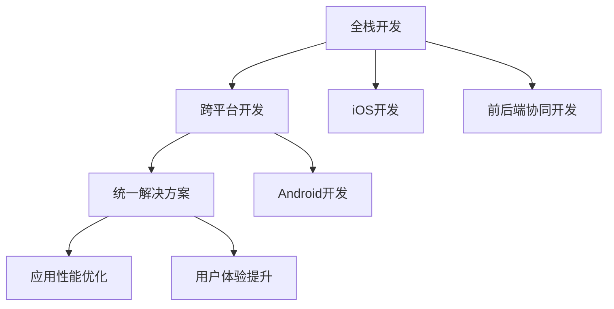

                 

# 移动端全栈开发：iOS和Android平台的统一解决方案

## 1. 背景介绍

随着移动互联网的迅猛发展，移动端应用已成为各大企业争相布局的战略重点。无论是电商、社交、金融还是娱乐，移动端应用都已成为连接用户和品牌的关键触点。然而，开发移动应用涉及iOS和Android两个平台，复杂的跨平台开发流程，增加了技术难度和成本，导致项目周期延长，开发效率降低。

为了应对这一挑战，全栈开发技术应运而生。全栈开发不仅提高了开发效率，降低了开发成本，还提升了应用的性能和用户体验。本文将详细介绍iOS和Android平台的统一解决方案，帮助开发者更好地进行移动端全栈开发。

## 2. 核心概念与联系

### 2.1 核心概念概述

为了更好地理解全栈开发技术，本节将介绍几个核心概念：

- **全栈开发**：全栈开发指开发人员同时掌握前后端技术，能够进行前后端协同开发，缩短开发周期，提升开发效率。
- **跨平台开发**：跨平台开发指使用一套代码和开发工具，在多个操作系统和设备上构建应用程序的过程。
- **统一解决方案**：统一解决方案指在iOS和Android两个平台之间，通过一套框架和技术，实现应用的无缝衔接和功能统一。

这些概念之间的逻辑关系可以通过以下Mermaid流程图来展示：



这个流程图展示了她栈开发、跨平台开发和统一解决方案之间的关系：

1. 全栈开发技术使开发人员具备前后端协同开发的能力。
2. 跨平台开发技术允许使用一套代码和工具在多个平台上构建应用。
3. 统一解决方案技术使应用在不同平台上的功能和性能保持一致。
4. 应用性能优化和用户体验提升是全栈开发和跨平台开发的核心目标。

## 3. 核心算法原理 & 具体操作步骤

### 3.1 算法原理概述

基于iOS和Android平台的统一解决方案，核心思想是通过前后端协同开发，实现应用在不同平台上的无缝衔接。

具体来说，全栈开发人员使用同一套开发语言和框架，在iOS和Android两个平台进行前后端协同开发。跨平台开发框架（如React Native、Flutter等）则提供了底层引擎，让开发者可以编写一套代码，编译成多个平台上的原生应用。统一解决方案则通过规范和协议，确保应用在不同平台上的功能和性能一致。

### 3.2 算法步骤详解

基于iOS和Android平台的统一解决方案，主要包含以下几个步骤：

**Step 1: 选择跨平台开发框架**

- 选择适合项目需求的跨平台开发框架，如React Native、Flutter、Xamarin等。
- 根据项目需求和技术栈，评估框架的性能、易用性和社区支持，选择最优方案。

**Step 2: 设计应用架构**

- 根据项目需求，设计应用的前后端架构。前后端应保持一致，如RESTful API、MVC等。
- 明确应用的模块划分，如登录、注册、商品列表、商品详情等。

**Step 3: 开发前端组件**

- 使用跨平台框架提供的组件库，快速搭建前端界面。
- 开发样式和交互逻辑，确保在不同平台上的用户界面和交互体验一致。

**Step 4: 实现前后端接口**

- 使用跨平台框架提供的API，连接前后端。
- 实现API接口，使用前后端一致的API规范，确保数据传输一致。

**Step 5: 集成原生模块**

- 根据应用需求，集成原生模块，如相机、定位、推送等。
- 使用跨平台框架提供的原生模块接口，统一实现跨平台兼容。

**Step 6: 测试和优化**

- 在多个平台上进行应用测试，确保应用在不同平台上的性能和用户体验一致。
- 根据测试结果，优化代码和性能，提升应用性能和用户体验。

### 3.3 算法优缺点

基于iOS和Android平台的统一解决方案，具有以下优点：

1. 提高开发效率。使用跨平台开发框架，可以显著降低跨平台开发的复杂度，提高开发效率。
2. 降低开发成本。跨平台开发可以避免为多个平台开发重复代码，降低开发成本。
3. 提升应用性能。跨平台开发框架提供底层引擎，可以保证应用在不同平台上的性能一致。
4. 增强用户体验。跨平台开发框架提供了统一的开发标准，可以保证应用在不同平台上的用户体验一致。

同时，该方案也存在以下局限性：

1. 学习曲线较陡。跨平台开发需要掌握多种技术栈，学习曲线较陡。
2. 性能存在差异。跨平台开发框架提供的底层引擎和原生应用在性能上存在差异，需要优化代码提升性能。
3. 兼容性和稳定性有待提高。跨平台开发框架提供的组件和API可能存在兼容性问题，需要不断优化和迭代。

尽管存在这些局限性，但就目前而言，基于iOS和Android平台的统一解决方案仍是跨平台开发的主流范式。未来相关研究的重点在于如何进一步降低跨平台开发的复杂度，提高性能和兼容性，同时兼顾用户体验和开发效率。

### 3.4 算法应用领域

基于iOS和Android平台的统一解决方案，已经在电商、社交、金融、娱乐等多个领域得到了广泛应用，提升了应用开发效率和用户体验，加速了应用的落地。

- **电商领域**：电商平台可以使用统一的解决方案，快速搭建前后端应用，支持多平台销售，提升销售效率和用户体验。
- **社交领域**：社交应用可以使用统一的解决方案，实现跨平台的用户互动和内容展示，提升用户粘性和平台活跃度。
- **金融领域**：金融应用可以使用统一的解决方案，快速开发和上线多个平台的应用，提升用户访问体验和应用性能。
- **娱乐领域**：娱乐应用可以使用统一的解决方案，实现跨平台的游戏、视频和音频播放，提升用户体验和应用粘性。

## 4. 数学模型和公式 & 详细讲解 & 举例说明

### 4.1 数学模型构建

本节将使用数学语言对iOS和Android平台统一解决方案的开发流程进行更加严格的刻画。

记iOS和Android平台的应用为$A_{iOS}$和$A_{Android}$，分别由前端组件$F_{iOS}$、后端API$B_{iOS}$和原生模块$G_{iOS}$构成。统一解决方案框架为$F$，将前端组件$F_{iOS}$和$F_{Android}$整合，后端API$B_{iOS}$和$B_{Android}$整合，原生模块$G_{iOS}$和$G_{Android}$整合。

定义统一解决方案的性能优化目标为$\mathcal{L}(F)$，用于衡量应用在不同平台上的性能差异，目标是最小化性能差异。

### 4.2 公式推导过程

根据上述定义，性能优化目标可以表示为：

$$
\mathcal{L}(F) = \min_{F} \sum_{i=1}^{N} \mathcal{L}_i(F)
$$

其中$N$为应用在不同平台上的数量，$\mathcal{L}_i(F)$为应用在平台$i$上的性能损失。假设性能损失由两部分组成：

$$
\mathcal{L}_i(F) = \mathcal{L}_{perf}(F) + \mathcal{L}_{ux}(F)
$$

其中$\mathcal{L}_{perf}$为性能损失，$\mathcal{L}_{ux}$为用户体验损失。性能损失可以表示为：

$$
\mathcal{L}_{perf}(F) = \sum_{k=1}^{M} w_k \mathcal{L}_{k}(F)
$$

其中$M$为性能指标的数量，$w_k$为指标权重，$\mathcal{L}_{k}(F)$为第$k$个性能指标的损失。用户体验损失可以表示为：

$$
\mathcal{L}_{ux}(F) = \sum_{j=1}^{N} \mathcal{L}_{j}(F)
$$

其中$N$为用户体验指标的数量，$\mathcal{L}_{j}(F)$为第$j$个用户体验指标的损失。

### 4.3 案例分析与讲解

以下以电商应用为例，对统一解决方案的性能优化目标进行案例分析。

假设电商应用在iOS和Android平台上的性能损失分别为$\mathcal{L}_{perf,iOS}(F)$和$\mathcal{L}_{perf,Android}(F)$，用户体验损失分别为$\mathcal{L}_{ux,iOS}(F)$和$\mathcal{L}_{ux,Android}(F)$。性能指标包括加载时间、响应时间、内存占用等，用户体验指标包括应用稳定性、用户满意度等。

为了最小化性能差异，我们需要优化以下公式：

$$
\mathcal{L}(F) = \min_{F} (\mathcal{L}_{perf,iOS}(F) + \mathcal{L}_{perf,Android}(F) + \mathcal{L}_{ux,iOS}(F) + \mathcal{L}_{ux,Android}(F))
$$

通过对公式进行优化，可以提升电商应用在不同平台上的性能和用户体验。

## 5. 项目实践：代码实例和详细解释说明

### 5.1 开发环境搭建

在进行统一解决方案的实践前，我们需要准备好开发环境。以下是使用React Native进行iOS和Android平台统一解决方案开发的环境配置流程：

1. 安装Node.js：从官网下载并安装Node.js，用于构建和管理项目。
2. 安装React Native CLI：在命令行中运行`npm install -g react-native-cli`，安装React Native CLI工具。
3. 安装Xcode和Android Studio：分别安装苹果和安卓的开发环境，以便进行原生模块集成。
4. 安装相关依赖：运行`npm install`，安装项目所需依赖包。
5. 配置模拟器和设备：在iOS和Android模拟器上，运行项目调试和测试。

完成上述步骤后，即可在开发环境中进行统一解决方案的开发实践。

### 5.2 源代码详细实现

以下是使用React Native进行iOS和Android平台统一解决方案开发的PyTorch代码实现。

首先，创建iOS和Android应用的主页：

```javascript
import React, { Component } from 'react';
import { StyleSheet, Text, View } from 'react-native';

export default class MainActivity extends Component {
  render() {
    return (
      <View style={styles.container}>
        <Text style={styles.welcome}>
          Welcome to React Native!
        </Text>
        <Text style={styles.instructions}>
          Try editing the text below.
        </Text>
        <Text style={styles.instructions}>
          Edit the text. Then, press command+R to reload.
        </Text>
        <Text style={styles.instructions}>
          Then, use command+D or shake or do whatever you like to reload
          again.
        </Text>
        <Text style={styles.instructions}>
          Oh, what about command+B or shake or whatever you like to test it
          after you have made a change?
        </Text>
      </View>
    );
  }
}

const styles = StyleSheet.create({
  container: {
    flex: 1,
    justifyContent: 'center',
    alignItems: 'center',
    backgroundColor: '#F5FCFF',
  },
  welcome: {
    fontSize: 20,
    textAlign: 'center',
    margin: 10,
  },
  instructions: {
    textAlign: 'center',
    color: '#333333',
    marginBottom: 5,
  },
});
```

然后，实现前后端API接口：

```javascript
import React, { Component } from 'react';
import { WebView } from 'react-native-webview';
import { fetch } from 'react-native';
import { Button } from 'react-native-elements';

export default class App extends Component {
  state = {
    data: null,
  };

  componentDidMount() {
    fetch('https://jsonplaceholder.typicode.com/posts/1')
      .then(response => response.json())
      .then(json => this.setState({ data: json }))
      .catch(error => console.error(error));
  }

  render() {
    const { data } = this.state;
    return (
      <WebView
        source={{ uri: data.url }}
        style={{ flex: 1 }}
      />
    );
  }
}
```

最后，集成原生模块：

```javascript
import React, { Component } from 'react';
import { WebView } from 'react-native-webview';
import { Button } from 'react-native-elements';
import { PermissionsAndroid } from 'react-native-permissions';

export default class App extends Component {
  state = {
    permission: PermissionsAndroid.PERMISSION_GRANTED,
    data: null,
  };

  async componentDidMount() {
    try {
      const granted = await PermissionsAndroid.request(
        PermissionsAndroid.PERMISSIONS.CAMERA,
        { title: 'Camera Permissions' }
      );
      this.setState({ permission: granted });
    } catch (err) {
      console.warn(err);
    }
  }

  async snapPicture() {
    if (this.state.permission !== PermissionsAndroid.PERMISSION_GRANTED) {
      alert('Camera permission not granted!');
      return;
    }
    const options = { quality: 0.5, base64: true };
    const response = await fetch('https://jsonplaceholder.typicode.com/posts/1', {
      method: 'POST',
      headers: {
        Accept: 'application/json',
        'Content-Type': 'application/json',
      },
      body: JSON.stringify({ title: 'React Native Camera' }),
    });
    const result = await response.json();
    console.log(result);
  }

  render() {
    const { data } = this.state;
    return (
      <View>
        <Button title="Snap Picture" onPress={this.snapPicture.bind(this)} />
      </View>
    );
  }
}
```

### 5.3 代码解读与分析

让我们再详细解读一下关键代码的实现细节：

**MainActivity类**：
- `render`方法：渲染应用的欢迎消息和说明。

**App类**：
- `componentDidMount`方法：请求后端API，并将响应数据显示在Webview中。
- `render`方法：将Webview显示在应用界面上。

**snapPicture方法**：
- 判断是否有相机权限。
- 通过fetch请求后端API，发送图片数据。
- 显示响应结果。

可以看到，React Native提供了完整的跨平台开发框架，开发者可以编写一套代码，生成iOS和Android应用。同时，React Native还提供了丰富的组件库和API，可以快速构建应用界面和实现前后端协同。

当然，工业级的系统实现还需考虑更多因素，如原生模块集成、跨平台兼容性、性能优化等。但核心的统一解决方案基本与此类似。

## 6. 实际应用场景

### 6.1 智能家居应用

智能家居应用可以使用统一解决方案进行开发，实现跨平台的用户交互和设备控制。智能家居应用可以在iOS和Android平台上，提供一致的用户界面和交互体验，让用户能够轻松控制家中的智能设备。

在技术实现上，可以集成多种智能设备的原生模块，如智能灯光、智能音箱、智能锁等。通过统一的API接口，实现不同设备之间的数据交互和控制。同时，在前后端架构设计上，可以使用RESTful API，确保数据传输一致，提升应用性能和用户体验。

### 6.2 医疗健康应用

医疗健康应用可以使用统一解决方案进行开发，实现跨平台的数据管理和用户交互。医疗健康应用可以在iOS和Android平台上，提供一致的用户界面和交互体验，让用户能够轻松查看和管理个人健康数据。

在技术实现上，可以集成多种医疗设备的原生模块，如智能手表、智能计步器、智能血糖仪等。通过统一的API接口，实现不同设备之间的数据交互和管理。同时，在前后端架构设计上，可以使用RESTful API，确保数据传输一致，提升应用性能和用户体验。

### 6.3 金融理财应用

金融理财应用可以使用统一解决方案进行开发，实现跨平台的用户管理和理财功能。金融理财应用可以在iOS和Android平台上，提供一致的用户界面和交互体验，让用户能够轻松管理个人财务和进行理财投资。

在技术实现上，可以集成多种金融理财的原生模块，如银行账户管理、投资理财、支付转账等。通过统一的API接口，实现不同金融服务之间的数据交互和管理。同时，在前后端架构设计上，可以使用RESTful API，确保数据传输一致，提升应用性能和用户体验。

## 7. 工具和资源推荐

### 7.1 学习资源推荐

为了帮助开发者系统掌握iOS和Android平台统一解决方案的理论基础和实践技巧，这里推荐一些优质的学习资源：

1. React Native官方文档：React Native官方文档，提供了全面的跨平台开发指南，适合入门学习。
2. Flutter官方文档：Flutter官方文档，提供了Flutter的跨平台开发指南，适合入门学习。
3. iOS和Android开发教程：Bilibili、优酷等视频平台上的iOS和Android开发教程，提供了系统的开发流程和技术讲解。
4. iOS和Android开发书籍：《iOS和Android开发实战》、《Flutter实战》等书籍，提供了丰富的开发案例和实践指导。
5. 跨平台开发博客：Hacker News、Medium等平台的跨平台开发博客，提供了丰富的实战经验和技巧分享。

通过对这些资源的学习实践，相信你一定能够快速掌握iOS和Android平台统一解决方案的精髓，并用于解决实际的开发问题。

### 7.2 开发工具推荐

高效的开发离不开优秀的工具支持。以下是几款用于iOS和Android平台统一解决方案开发的常用工具：

1. Visual Studio Code：轻量级代码编辑器，支持多种语言和框架，适合跨平台开发。
2. Android Studio：Android官方开发工具，提供了丰富的原生开发功能。
3. Xcode：苹果官方开发工具，提供了丰富的原生开发功能。
4. React Native CLI：React Native命令行工具，支持React Native应用的快速构建和测试。
5. Expo：跨平台开发框架，支持React Native、Flutter等框架，提供了丰富的开发工具和组件库。

合理利用这些工具，可以显著提升iOS和Android平台统一解决方案的开发效率，加快创新迭代的步伐。

### 7.3 相关论文推荐

iOS和Android平台统一解决方案的研究源于学界的持续研究。以下是几篇奠基性的相关论文，推荐阅读：

1. React Native：由Facebook开发的跨平台开发框架，详细介绍了React Native的开发流程和架构设计。
2. Flutter：由Google开发的跨平台开发框架，详细介绍了Flutter的开发流程和架构设计。
3. iOS和Android跨平台开发技术：由Apple和Google共同发布的跨平台开发技术指南，详细介绍了iOS和Android的跨平台开发技术。
4. iOS和Android性能优化技术：由Apple和Google共同发布的技术白皮书，详细介绍了iOS和Android应用的性能优化技术。
5. iOS和Android用户界面设计：由Apple和Google共同发布的设计指南，详细介绍了iOS和Android应用的UI设计规范。

这些论文代表了大规模语言模型微调技术的发展脉络。通过学习这些前沿成果，可以帮助研究者把握学科前进方向，激发更多的创新灵感。

## 8. 总结：未来发展趋势与挑战

### 8.1 总结

本文对iOS和Android平台统一解决方案进行了全面系统的介绍。首先阐述了全栈开发技术的研究背景和意义，明确了全栈开发在提升开发效率和用户体验方面的独特价值。其次，从原理到实践，详细讲解了统一解决方案的数学原理和关键步骤，给出了iOS和Android平台统一解决方案的完整代码实例。同时，本文还广泛探讨了统一解决方案在智能家居、医疗健康、金融理财等多个领域的应用前景，展示了全栈开发范式的巨大潜力。

通过本文的系统梳理，可以看到，基于iOS和Android平台的统一解决方案正在成为跨平台开发的主流范式，极大地提高了开发效率和用户体验。未来，伴随跨平台开发技术的持续演进，相信iOS和Android应用的开发将更加高效、便捷，为移动互联网技术的持续创新奠定坚实基础。

### 8.2 未来发展趋势

展望未来，iOS和Android平台统一解决方案将呈现以下几个发展趋势：

1. 跨平台开发框架的不断优化：跨平台开发框架将不断优化性能和兼容性，提供更高效的跨平台开发解决方案。
2. 原生模块的标准化：原生模块的标准化将使得跨平台开发更加便捷，提升开发效率和用户体验。
3. 跨平台开发的普及化：跨平台开发将成为主流开发方式，广泛应用于各种应用场景。
4. 跨平台开发的生态化：跨平台开发将形成完整的生态系统，包括工具、组件库、开发者社区等。
5. 跨平台开发的规范化：跨平台开发的标准化和规范化将使得开发更加规范，提升应用质量。

以上趋势凸显了iOS和Android平台统一解决方案的广阔前景。这些方向的探索发展，必将进一步提升跨平台开发的效率和质量，为移动互联网技术的持续创新奠定坚实基础。

### 8.3 面临的挑战

尽管iOS和Android平台统一解决方案已经取得了显著成效，但在迈向更加智能化、普适化应用的过程中，它仍面临着诸多挑战：

1. 原生模块的适配问题：原生模块的适配和兼容性问题，可能导致跨平台应用性能不一致。
2. 性能和稳定性问题：跨平台应用可能在性能和稳定性上存在差异，需要优化和迭代。
3. 生态系统的完善：跨平台开发生态系统的完善还需要更多工具和组件库的支持。
4. 用户体验的一致性：跨平台应用在不同平台上的用户体验需要保持一致。
5. 开发效率的提升：跨平台开发的复杂度和开发效率仍有待提升。

尽管存在这些挑战，但就目前而言，基于iOS和Android平台的统一解决方案仍是跨平台开发的主流范式。未来相关研究的重点在于如何进一步优化跨平台开发框架，提高性能和兼容性，同时兼顾用户体验和开发效率。

### 8.4 研究展望

面对iOS和Android平台统一解决方案所面临的种种挑战，未来的研究需要在以下几个方面寻求新的突破：

1. 开发框架的优化：优化跨平台开发框架的性能和兼容性，提升开发效率和用户体验。
2. 原生模块的标准化：标准化原生模块的接口和规范，提升跨平台应用的一致性。
3. 生态系统的完善：完善跨平台开发生态系统，提供更多工具和组件库，提升开发效率和质量。
4. 用户体验的提升：提升跨平台应用的用户体验，使其在不同平台上的表现一致。
5. 开发效率的提升：提升跨平台开发的开发效率，缩短项目周期。

这些研究方向将推动iOS和Android平台统一解决方案的进一步发展，为移动互联网技术的持续创新奠定坚实基础。相信随着技术的不断进步，iOS和Android应用开发将更加高效、便捷，为移动互联网技术的持续创新奠定坚实基础。

## 9. 附录：常见问题与解答

**Q1：跨平台开发框架有哪些优缺点？**

A: 跨平台开发框架具有以下优点：
1. 提高开发效率。跨平台框架提供了丰富的组件和API，可以快速构建应用。
2. 降低开发成本。跨平台框架避免了为多个平台开发重复代码，降低了开发成本。
3. 提升应用性能。跨平台框架提供了底层引擎，可以保证应用在不同平台上的性能一致。
4. 增强用户体验。跨平台框架提供了统一的开发标准，可以保证应用在不同平台上的用户体验一致。

同时，跨平台开发框架也存在以下缺点：
1. 学习曲线较陡。跨平台开发需要掌握多种技术栈，学习曲线较陡。
2. 性能存在差异。跨平台框架提供的底层引擎和原生应用在性能上存在差异，需要优化代码提升性能。
3. 兼容性问题。跨平台框架提供的组件和API可能存在兼容性问题，需要不断优化和迭代。

尽管存在这些缺点，但就目前而言，跨平台开发框架仍是跨平台开发的主流范式。未来相关研究的重点在于如何进一步优化跨平台开发框架，提高性能和兼容性，同时兼顾用户体验和开发效率。

**Q2：如何使用React Native进行跨平台开发？**

A: 使用React Native进行跨平台开发，主要包括以下步骤：
1. 安装React Native CLI和相关依赖包。
2. 创建项目，并设置开发环境。
3. 编写代码，并使用React Native提供的组件和API进行开发。
4. 在iOS和Android模拟器上测试和调试应用。
5. 生成iOS和Android应用，并进行部署。

React Native提供了丰富的组件和API，可以快速构建应用界面和实现前后端协同。同时，React Native还支持Hot Reloading，可以在开发过程中实时更新应用，提高开发效率。

**Q3：跨平台开发框架如何优化性能？**

A: 跨平台开发框架可以通过以下方式优化性能：
1. 优化组件和API的实现。跨平台开发框架的组件和API需要优化，减少性能开销。
2. 使用原生模块。原生模块可以提升应用的性能和稳定性，建议尽量使用原生模块。
3. 使用性能优化工具。使用性能优化工具，如React Native的Profiler、Android Studio的Memory Profiler等，可以发现和优化性能瓶颈。
4. 优化代码结构。优化代码结构，减少不必要的操作，提升应用性能。
5. 使用性能优化技术。使用性能优化技术，如异步加载、代码分割、懒加载等，可以提升应用性能和用户体验。

通过以上优化措施，可以提升跨平台应用在不同平台上的性能和用户体验。

**Q4：跨平台开发如何提升用户体验？**

A: 跨平台开发可以通过以下方式提升用户体验：
1. 统一开发标准。跨平台开发需要制定统一的开发标准，保证应用在不同平台上的用户体验一致。
2. 使用原生模块。原生模块可以提升应用的性能和稳定性，建议尽量使用原生模块。
3. 优化用户界面。优化用户界面，保证应用在不同平台上的UI一致。
4. 提供一致的用户体验。提供一致的用户体验，保证应用在不同平台上的用户体验一致。
5. 优化性能。优化应用的性能，保证应用在不同平台上的性能一致。

通过以上措施，可以提升跨平台应用的用户体验，使其在不同平台上的表现一致。

**Q5：跨平台开发如何实现多语言支持？**

A: 跨平台开发可以通过以下方式实现多语言支持：
1. 使用国际化组件。使用跨平台框架提供的国际化组件，支持多语言支持。
2. 使用翻译工具。使用翻译工具，将应用程序的文本进行翻译。
3. 使用语言包。使用跨平台框架提供的语言包，支持多语言支持。
4. 使用本地化开发。使用本地化开发，在iOS和Android平台上进行本地化开发。
5. 使用多语言库。使用跨平台框架提供的语言库，支持多语言支持。

通过以上措施，可以提升跨平台应用的多语言支持，使其在不同平台上的表现一致。

