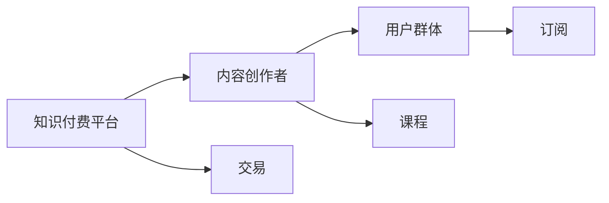

                 

# 程序员利用知识付费实现财富倍增的秘诀

## 1. 背景介绍

### 1.1 问题由来
在信息技术迅猛发展的今天，程序员的职业需求日益旺盛，但同时，技术更新速度的加快和竞争的加剧也使得这一职业的门槛越来越高。为了跟上技术潮流，程序员需要不断学习新知识，掌握新技术。然而，传统学习方式，如大学课程、企业培训等，往往难以满足这种持续学习的需求。于是，一种新兴的学习方式应运而生——知识付费。

### 1.2 问题核心关键点
知识付费是一种以在线课程、电子书、直播讲座等形式，提供有偿知识服务的方式。对于程序员而言，知识付费不仅提供了一种高效的学习途径，还帮助他们在繁忙的工作之余，快速获取前沿技术资讯和专业技能。本文将深入探讨知识付费对于程序员职业发展的重要作用，并通过具体案例分析，展现知识付费如何助力程序员实现财富倍增。

## 2. 核心概念与联系

### 2.1 核心概念概述

知识付费，是指通过互联网平台，将有价值的知识内容进行包装，向用户收取一定费用，以获取收益。核心概念包括：

- **知识付费平台**：如Coursera、Udemy、网易云课堂等，提供各种课程和资料。
- **内容创作者**：程序员、教师、专家等，提供课程、电子书、文章等。
- **用户群体**：需要获取专业技能、学习新技术的程序员。
- **交易机制**：课程购买、订阅、单次支付等形式，平台从中获取收益。

### 2.2 核心概念原理和架构的 Mermaid 流程图(Mermaid 流程节点中不要有括号、逗号等特殊字符)



此流程图展示了知识付费的三方关系和流程：

1. **知识付费平台**：作为知识传播的媒介，连接内容创作者和用户群体，提供交易机制。
2. **内容创作者**：负责生成课程、文章等知识内容，并通过平台出售给用户。
3. **用户群体**：需要不断更新技能，通过付费获取所需知识。

## 3. 核心算法原理 & 具体操作步骤

### 3.1 算法原理概述

知识付费平台通过市场机制，将知识商品化，促使内容创作者和用户群体形成良性互动。其核心算法原理如下：

1. **课程推荐算法**：通过用户的浏览、购买记录和评价，推荐最适合用户的学习内容。
2. **交易结算算法**：处理课程的订阅、购买、退款等交易流程，保证用户权益。
3. **内容审核算法**：保证课程质量和适宜性，防止低质量或不当内容上线。

### 3.2 算法步骤详解

#### 3.2.1 课程推荐算法

推荐算法通过协同过滤、基于内容的过滤、基于矩阵分解等方法，为用户推荐最相关的课程。例如，通过用户的评分和行为数据，构建用户-课程关联矩阵，使用矩阵分解技术，如奇异值分解(SVD)，寻找用户-课程间的潜在因子，得到推荐结果。

- **协同过滤**：通过用户间的行为相似性，推荐其他用户喜欢的课程。
- **基于内容的过滤**：通过课程内容的相似性，推荐相似课程。
- **基于矩阵分解**：通过因子分解模型，预测用户对课程的评分，从而推荐高评分课程。

#### 3.2.2 交易结算算法

交易结算算法主要负责处理课程订阅、购买、退款等操作，确保交易流程的顺畅和安全。

- **订阅管理**：处理用户订阅课程的管理，如激活、取消订阅等。
- **支付处理**：与第三方支付平台对接，处理课程付费。
- **退款服务**：处理用户对课程的退款请求，保护用户权益。

#### 3.2.3 内容审核算法

内容审核算法主要通过文本分析、图像识别等技术，确保上线课程的质量和适宜性。

- **文本分析**：使用NLP技术，对课程描述进行文本分析，识别不良内容。
- **图像识别**：使用图像识别技术，对课程图片进行审核，防止不良图片上线。
- **专家评审**：邀请领域专家进行课程评审，确保课程内容的准确性和专业性。

### 3.3 算法优缺点

#### 3.3.1 优点

1. **高效学习**：知识付费平台提供高效的学习途径，使得程序员能够快速掌握新知识。
2. **专业指导**：专家和领域内人士的指导，使学习更加系统、高效。
3. **资源丰富**：平台资源丰富，涵盖广泛领域和技术，满足多样化需求。

#### 3.3.2 缺点

1. **费用高昂**：部分高质量课程费用较高，增加了学习的经济负担。
2. **信息过载**：课程数量众多，选择困难，需花费大量时间筛选。
3. **依赖性强**：对平台的依赖性强，平台故障或课程下架影响学习。

### 3.4 算法应用领域

知识付费平台在程序员学习和职业发展中应用广泛，如：

- **编程语言学习**：如Python、Java等课程。
- **数据分析和机器学习**：如数据科学、机器学习等课程。
- **云计算和DevOps**：如AWS、Kubernetes等课程。
- **软件工程和架构设计**：如软件测试、架构设计等课程。

## 4. 数学模型和公式 & 详细讲解 & 举例说明

### 4.1 数学模型构建

知识付费平台的推荐系统可以构建为以下数学模型：

设用户 $u$ 对课程 $c$ 的评分 $r(u,c)$ 为已知，构建用户-课程关联矩阵 $\mathbf{R} \in \mathbb{R}^{m \times n}$，其中 $m$ 为课程数，$n$ 为用户数。推荐系统旨在最大化用户满意度和课程曝光度，可以通过最大化均方误差损失函数进行建模：

$$
\min_{\mathbf{P}} \frac{1}{2} \sum_{u=1}^n \sum_{c=1}^m (r(u,c) - \mathbf{p}_u^T \mathbf{c}_c)^2
$$

其中 $\mathbf{P} \in \mathbb{R}^{n \times k}$ 为用户-课程潜在因子矩阵，$\mathbf{p}_u$ 为第 $u$ 用户对应的潜在因子向量，$\mathbf{c}_c$ 为第 $c$ 课程对应的潜在因子向量。

### 4.2 公式推导过程

使用奇异值分解(SVD)进行模型训练：

$$
\mathbf{R} = \mathbf{U} \mathbf{\Sigma} \mathbf{V}^T
$$

其中 $\mathbf{U} \in \mathbb{R}^{m \times k}, \mathbf{\Sigma} \in \mathbb{R}^{k \times k}, \mathbf{V} \in \mathbb{R}^{n \times k}$。通过求解 $\mathbf{P} = \mathbf{V} \mathbf{\Sigma}^{1/2}$，可以得到推荐结果。

### 4.3 案例分析与讲解

**案例：Java程序员利用知识付费平台学习Spring框架**

李明是一名Java程序员，为了掌握Spring框架，他通过Coursera平台选择了一门Spring Boot课程。该课程包括12节视频和4个项目实战，每周更新一次内容。李明选择了Coursera的推荐课程，并通过订阅方式支付了199元。

在课程学习过程中，李明通过观看视频、完成作业和参与讨论，逐步掌握了Spring Boot的基本概念和应用场景。课程结束后，他通过项目实战，成功搭建了一个简单的Web应用，并上传到了GitHub上。这不仅加深了他对Spring Boot的理解，还为他后续的面试增加了谈资。

## 5. 项目实践：代码实例和详细解释说明

### 5.1 开发环境搭建

知识付费平台的开发环境搭建步骤如下：

1. 安装Python：
```bash
sudo apt-get update
sudo apt-get install python3
```

2. 安装Django：
```bash
pip install django
```

3. 创建Django项目：
```bash
django-admin startproject knowledge_purchase
```

4. 创建Django应用：
```bash
python manage.py startapp course
```

### 5.2 源代码详细实现

**用户模型(UserModel)**

```python
from django.db import models
from django.contrib.auth.models import AbstractUser

class User(AbstractUser):
    pass
```

**课程模型(CourseModel)**

```python
from django.db import models

class Course(models.Model):
    title = models.CharField(max_length=100)
    description = models.TextField()
    instructor = models.ForeignKey(User, on_delete=models.CASCADE)
    price = models.DecimalField(max_digits=10, decimal_places=2)
```

**推荐模型(RecommendationModel)**

```python
from django.db import models

class Recommendation(models.Model):
    user = models.ForeignKey(User, on_delete=models.CASCADE)
    course = models.ForeignKey(Course, on_delete=models.CASCADE)
    score = models.DecimalField(max_digits=10, decimal_places=2)
```

**订阅模型(SubscriptionModel)**

```python
from django.db import models
from django.contrib.auth.models import User

class Subscription(models.Model):
    user = models.ForeignKey(User, on_delete=models.CASCADE)
    course = models.ForeignKey(Course, on_delete=models.CASCADE)
    subscription_date = models.DateTimeField(auto_now_add=True)
```

### 5.3 代码解读与分析

**用户模型(UserModel)**

- **继承自Django内置的AbstractUser模型**：简化了用户模型的定义。

**课程模型(CourseModel)**

- **包含标题、描述、讲师、价格等字段**：用于存储课程信息。
- **与User模型建立一对一关系**：每个课程都有一个讲师。
- **使用DecimalField**：精确存储价格信息。

**推荐模型(RecommendationModel)**

- **包含用户、课程和评分字段**：记录用户对课程的评分。

**订阅模型(SubscriptionModel)**

- **包含用户、课程和订阅时间字段**：记录用户订阅课程的记录。

### 5.4 运行结果展示

通过上述模型，知识付费平台可以实现用户与课程的交互、推荐、订阅等功能。例如，李明可以通过登录系统，查看自己订阅的课程，并获得平台推荐的其他课程。

## 6. 实际应用场景

### 6.1 智能客服系统

知识付费平台可以应用于智能客服系统的开发。通过订阅付费课程，客服系统可以根据用户问题推荐合适的解答文章或视频，提高客服效率和服务质量。

### 6.2 在线教育平台

知识付费平台本身就是在线教育平台，为程序员提供高效、系统的学习途径。通过课程订阅和互动，提升程序员的专业技能和职业素养。

### 6.3 企业培训系统

企业可以通过知识付费平台，提供定制化的内部培训课程，帮助员工快速掌握新技术和新方法，提高团队整体竞争力。

### 6.4 未来应用展望

知识付费平台未来将有更广泛的应用场景，如：

- **跨领域知识整合**：跨学科、跨领域的知识整合，提升复合型人才的能力。
- **个性化学习路径**：根据用户的学习进度和兴趣，推荐个性化的学习路径。
- **虚拟现实教学**：通过VR/AR技术，提供沉浸式学习体验，提升学习效果。

## 7. 工具和资源推荐

### 7.1 学习资源推荐

1. **Coursera**：提供大量高质量课程，涵盖编程语言、数据分析、机器学习等多个领域。
2. **Udemy**：课程种类丰富，包含大量实战项目和案例分析。
3. **网易云课堂**：适合入门学习，内容易懂且结构合理。

### 7.2 开发工具推荐

1. **Django**：强大的Web框架，易于上手，适合快速开发知识付费平台。
2. **MySQL**：作为数据库，提供高效的课程和用户数据存储和管理。
3. **Redis**：作为缓存，提高课程推荐和订阅的响应速度。

### 7.3 相关论文推荐

1. **《基于协同过滤的推荐系统》**：介绍了协同过滤算法的原理和实现方法。
2. **《知识图谱在推荐系统中的应用》**：探讨了知识图谱如何提升推荐系统的性能。
3. **《深度学习在知识付费平台推荐系统中的应用》**：介绍了深度学习技术在知识付费平台推荐系统中的应用。

## 8. 总结：未来发展趋势与挑战

### 8.1 研究成果总结

本文介绍了知识付费平台的基本概念、核心算法和具体操作步骤，通过具体案例展示了其在程序员学习和职业发展中的重要性。知识付费平台不仅提供了高效的学习途径，还为程序员提供了持续成长的保障。

### 8.2 未来发展趋势

1. **个性化学习**：通过深度学习技术，实现个性化推荐，提高学习效果。
2. **多模态学习**：结合文本、图像、视频等多种形式，提升学习体验。
3. **社会化学习**：引入社交功能，促进用户间的交流和学习。
4. **实时互动**：提供实时互动功能，如在线问答、直播等，提升学习效率。

### 8.3 面临的挑战

1. **内容质量**：课程内容质量参差不齐，需要严格审核和筛选。
2. **学习效率**：部分课程冗长、复杂，需要花费大量时间学习。
3. **用户流失**：部分课程订阅率低，用户流失率较高。

### 8.4 研究展望

未来，知识付费平台将需要进一步优化内容质量、提升学习效率、增加用户粘性，从而实现可持续发展。

## 9. 附录：常见问题与解答

**Q1：知识付费平台如何保证课程内容的质量？**

A: 平台通过专家评审、用户评价和文本分析等技术手段，对课程内容进行严格审核。同时，平台也会不断优化算法，提高推荐的准确性和覆盖面。

**Q2：如何选择合适的知识付费平台？**

A: 选择知识付费平台时，应综合考虑平台的内容质量、课程种类、学习体验、技术支持等因素，选择适合自己的平台。

**Q3：知识付费平台的课程是否有效？**

A: 课程的有效性因人而异，建议在选择前试听课程，评估课程的适用性和实用性。同时，结合自己的职业需求和学习目标，选择适合的课程。

**Q4：如何利用知识付费平台提升职业竞争力？**

A: 通过系统学习编程语言、框架、工具等知识，提升编程技能和解决问题能力。同时，参与项目实战，积累项目经验，提升实践能力。

**Q5：知识付费平台的课程是否可以满足自己的职业需求？**

A: 知识付费平台提供了丰富的课程资源，但并不能完全满足所有职业需求。建议根据自己的职业规划，有针对性地选择课程，并结合实际工作进行学习。

---

作者：禅与计算机程序设计艺术 / Zen and the Art of Computer Programming

