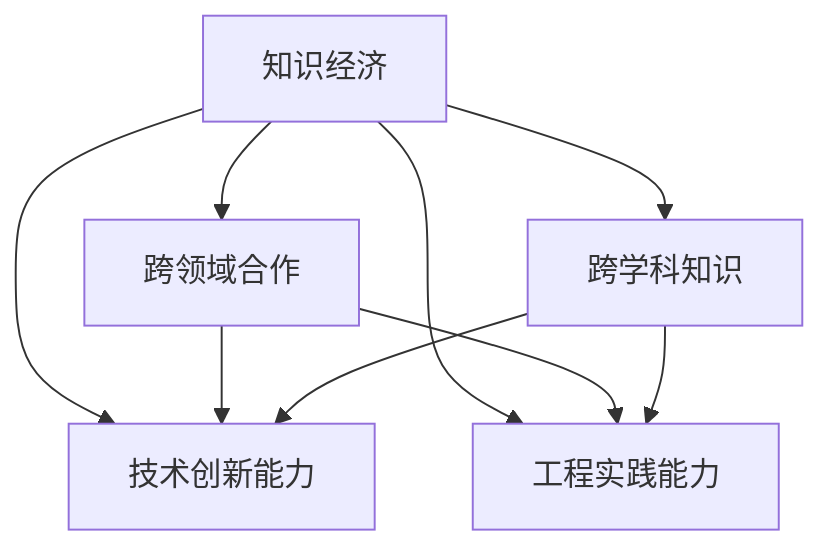

                 

# 程序员在知识经济时代的发展方向

## 1. 背景介绍

### 1.1 问题由来
随着科技的迅猛发展和互联网的普及，全球经济正步入知识经济时代。知识经济是指以知识和信息为基础的经济形态，与传统的以物质资源消耗为主的经济形态相比，知识经济更加依赖于人力资本、创新能力和信息技术。在这样的时代背景下，程序员作为知识创新的核心力量，面临着前所未有的机遇和挑战。

### 1.2 问题核心关键点
程序员在知识经济时代的发展方向，不仅在于掌握编程技能和算法知识，更在于持续学习和适应新技术，融入跨学科知识，推动跨领域合作，提升技术创新能力和工程实践能力。

## 2. 核心概念与联系

### 2.1 核心概念概述

为更好地理解程序员在知识经济时代的发展方向，本节将介绍几个密切相关的核心概念：

- **知识经济**：以知识为核心的经济形态，强调创新、信息共享和协同工作。
- **跨学科知识**：指在计算机科学之外，涉及社会科学、自然科学、人文学科等多学科的知识，如心理学、社会学、人工智能等。
- **跨领域合作**：指不同专业背景的团队成员共同合作完成复杂项目，如软件开发与设计、数据科学与市场分析等。
- **技术创新能力**：指开发新技术、改进旧技术或创新应用的能力，包括算法创新、系统架构优化、应用场景探索等。
- **工程实践能力**：指将技术理念转化为实际可用的软件系统或产品，包括需求分析、系统设计、代码实现、测试调试、运维部署等。

这些核心概念之间的逻辑关系可以通过以下Mermaid流程图来展示：



这个流程图展示了几大核心概念及其之间的关系：

1. 知识经济是整个时代的背景，程序员在这个背景下进行工作。
2. 跨学科知识和跨领域合作，都是提升技术创新能力和工程实践能力的重要手段。
3. 技术创新能力和工程实践能力，是知识经济时代程序员的核心竞争力。

## 3. 核心算法原理 & 具体操作步骤
### 3.1 算法原理概述

程序员在知识经济时代的发展，核心在于不断学习和适应新技术，推动技术创新。具体来说，需要掌握以下三个方面：

1. **跨学科知识学习**：如数据科学、人工智能、用户体验设计等。
2. **跨领域合作能力**：如与设计师、产品经理、数据科学家等合作，共同解决问题。
3. **技术创新与工程实践**：在已有技术基础上进行创新，实现从想法到产品的转化。

### 3.2 算法步骤详解

程序员在知识经济时代的发展步骤如下：

**Step 1: 确定发展方向**
- 选择合适的学习领域和目标技术。
- 制定详细的学习计划，包括学习资源、工具和评估指标。

**Step 2: 跨学科知识学习**
- 选择相关的课程、书籍和在线资源，如Coursera、edX等。
- 参加行业会议、研讨会，了解最新的技术和应用趋势。
- 进行项目实践，将理论知识转化为实际应用。

**Step 3: 跨领域合作**
- 加入开源社区，参与技术讨论和项目开发。
- 利用社交网络平台，如GitHub、LinkedIn等，扩大人脉圈。
- 组织和参与团队项目，提升沟通协作能力。

**Step 4: 技术创新与工程实践**
- 选择一个具有潜力的应用场景，进行技术创新。
- 利用GitHub、Jira等工具，进行版本控制和任务管理。
- 进行原型开发和测试，不断迭代和优化产品。

### 3.3 算法优缺点

跨学科学习和跨领域合作能够提升程序员的技术创新能力和工程实践能力，但同时也存在一些缺点：

- **时间成本高**：学习新的知识领域需要大量时间和精力。
- **沟通难度大**：不同领域的专业术语和思维模式可能存在差异，需要花费时间和精力进行沟通。
- **风险不确定性**：创新过程中存在技术失败和市场接受度低等风险。

### 3.4 算法应用领域

程序员在知识经济时代的技术创新和工程实践能力，可以应用到各种领域，如：

- **软件开发**：基于新的编程语言、框架和技术进行软件架构设计和开发。
- **人工智能与机器学习**：研究和开发新的算法和模型，提升AI系统的性能。
- **数据科学**：进行数据分析和挖掘，提取有价值的信息和洞察。
- **用户体验设计**：设计和优化用户界面，提升用户体验。
- **区块链与分布式系统**：研究和开发基于区块链和分布式技术的应用系统。
- **物联网与智能设备**：开发智能设备和物联网系统，实现自动化和智能化。
- **自然语言处理与机器翻译**：研究和开发自然语言处理和机器翻译技术，提升人机交互的流畅性。

## 4. 数学模型和公式 & 详细讲解

### 4.1 数学模型构建

程序员在知识经济时代的技术创新能力可以通过以下数学模型来量化：

1. **创新成功率模型**：
$$
P = \frac{1}{N} \sum_{i=1}^N \frac{R_i}{C_i}
$$
其中 $P$ 为创新成功率，$R_i$ 为第 $i$ 次创新的收益，$C_i$ 为第 $i$ 次创新的成本。

2. **技术创新周期模型**：
$$
T = \frac{1}{N} \sum_{i=1}^N (T_i + \Delta T_i)
$$
其中 $T$ 为技术创新的平均周期，$T_i$ 为第 $i$ 次创新周期，$\Delta T_i$ 为创新周期偏差。

### 4.2 公式推导过程

以创新成功率模型为例，公式推导过程如下：

- 假设创新 $i$ 的总收益为 $R_i$，总成本为 $C_i$，其中 $R_i$ 和 $C_i$ 为独立随机变量。
- 令 $P_i$ 为创新 $i$ 的成功率，则有：
$$
P_i = \frac{R_i}{C_i}
$$
- 对所有 $N$ 次创新，成功率 $P$ 为：
$$
P = \frac{1}{N} \sum_{i=1}^N P_i = \frac{1}{N} \sum_{i=1}^N \frac{R_i}{C_i}
$$

### 4.3 案例分析与讲解

假设某程序员在一个季度内进行了5次创新尝试，每次的收益和成本如下：

| 创新编号 | 收益 $R_i$ | 成本 $C_i$ | 成功率 $P_i$ |
|----------|----------|----------|----------|
| 1        | 5000     | 10000    | 0.5      |
| 2        | 3000     | 8000     | 0.375    |
| 3        | 7000     | 12000    | 0.583    |
| 4        | 2000     | 5000     | 0.4      |
| 5        | 4000     | 7000     | 0.571    |

则总成功率 $P$ 为：
$$
P = \frac{1}{5} (0.5 + 0.375 + 0.583 + 0.4 + 0.571) = 0.48
$$

## 5. 项目实践：代码实例和详细解释说明
### 5.1 开发环境搭建

在进行项目实践前，我们需要准备好开发环境。以下是使用Python进行PyTorch开发的环境配置流程：

1. 安装Anaconda：从官网下载并安装Anaconda，用于创建独立的Python环境。

2. 创建并激活虚拟环境：
```bash
conda create -n pytorch-env python=3.8 
conda activate pytorch-env
```

3. 安装PyTorch：根据CUDA版本，从官网获取对应的安装命令。例如：
```bash
conda install pytorch torchvision torchaudio cudatoolkit=11.1 -c pytorch -c conda-forge
```

4. 安装各类工具包：
```bash
pip install numpy pandas scikit-learn matplotlib tqdm jupyter notebook ipython
```

完成上述步骤后，即可在`pytorch-env`环境中开始项目实践。

### 5.2 源代码详细实现

这里以深度学习模型为例，展示如何使用PyTorch进行项目实践。

**Step 1: 导入所需的库和数据**
```python
import torch
import torch.nn as nn
import torch.optim as optim
from torch.utils.data import DataLoader
from torchvision import datasets, transforms

# 加载MNIST数据集
train_dataset = datasets.MNIST('data', train=True, download=True, transform=transforms.ToTensor())
test_dataset = datasets.MNIST('data', train=False, download=True, transform=transforms.ToTensor())

# 创建数据加载器
train_loader = DataLoader(train_dataset, batch_size=64, shuffle=True)
test_loader = DataLoader(test_dataset, batch_size=64, shuffle=False)
```

**Step 2: 定义模型**
```python
class Net(nn.Module):
    def __init__(self):
        super(Net, self).__init__()
        self.conv1 = nn.Conv2d(1, 10, kernel_size=5)
        self.conv2 = nn.Conv2d(10, 20, kernel_size=5)
        self.fc1 = nn.Linear(320, 50)
        self.fc2 = nn.Linear(50, 10)

    def forward(self, x):
        x = F.relu(F.max_pool2d(self.conv1(x), 2))
        x = F.relu(F.max_pool2d(self.conv2(x), 2))
        x = x.view(-1, 320)
        x = F.relu(self.fc1(x))
        x = self.fc2(x)
        return F.log_softmax(x, dim=1)
```

**Step 3: 定义训练和评估函数**
```python
def train(model, device, train_loader, optimizer, epoch):
    model.train()
    for batch_idx, (data, target) in enumerate(train_loader):
        data, target = data.to(device), target.to(device)
        optimizer.zero_grad()
        output = model(data)
        loss = F.nll_loss(output, target)
        loss.backward()
        optimizer.step()
        if batch_idx % 100 == 0:
            print('Train Epoch: {} [{}/{} ({:.0f}%)]\tLoss: {:.6f}'.format(
                epoch, batch_idx * len(data), len(train_loader.dataset),
                100. * batch_idx / len(train_loader), loss.item()))

def test(model, device, test_loader):
    model.eval()
    test_loss = 0
    correct = 0
    with torch.no_grad():
        for data, target in test_loader:
            data, target = data.to(device), target.to(device)
            output = model(data)
            test_loss += F.nll_loss(output, target, reduction='sum').item()
            pred = output.argmax(dim=1, keepdim=True)
            correct += pred.eq(target.view_as(pred)).sum().item()

    test_loss /= len(test_loader.dataset)
    print('\nTest set: Average loss: {:.4f}, Accuracy: {}/{} ({:.0f}%)\n'.format(
        test_loss, correct, len(test_loader.dataset),
        100. * correct / len(test_loader.dataset)))
```

**Step 4: 启动训练流程**
```python
device = torch.device("cuda:0" if torch.cuda.is_available() else "cpu")
model = Net().to(device)
optimizer = optim.SGD(model.parameters(), lr=0.01, momentum=0.5)

for epoch in range(1, 10):
    train(model, device, train_loader, optimizer, epoch)
    test(model, device, test_loader)
```

以上就是使用PyTorch进行深度学习项目开发的完整代码实现。可以看到，在实际项目中，开发者可以根据具体需求，选择合适的算法和数据，进行模型设计和优化。

### 5.3 代码解读与分析

让我们再详细解读一下关键代码的实现细节：

**Step 1: 导入所需的库和数据**
- 使用PyTorch和相关库进行导入，使用`torchvision`加载MNIST数据集。

**Step 2: 定义模型**
- 定义一个简单的卷积神经网络模型，包含两个卷积层和两个全连接层。

**Step 3: 定义训练和评估函数**
- 定义训练函数，使用SGD优化器进行模型训练。
- 定义测试函数，使用测试数据集进行模型评估。

**Step 4: 启动训练流程**
- 将模型和优化器部署到GPU设备上，进行模型训练和测试。

## 6. 实际应用场景
### 6.1 智能客服系统

基于深度学习模型的智能客服系统，可以广泛应用于各行各业。通过自然语言处理和机器学习技术，智能客服系统可以理解用户输入，自动回答常见问题，提升用户体验。

在技术实现上，可以收集用户的历史对话数据，使用深度学习模型进行训练，并不断优化模型参数，以提升系统的准确率和响应速度。智能客服系统可以帮助企业降低人力成本，提升服务效率，增加用户满意度。

### 6.2 医疗影像诊断

深度学习模型在医疗影像诊断中也有广泛应用。通过大量医学影像数据进行训练，深度学习模型可以自动识别病变部位和类型，辅助医生进行诊断。

在实际应用中，医生可以将病人的影像数据输入模型，模型自动分析图像并给出诊断结果，极大地提高了诊断的准确率和效率。医疗影像诊断系统不仅可以降低医生的工作负担，还能提高诊断水平，提升医疗服务的质量。

### 6.3 金融风控

金融领域广泛应用深度学习模型进行风险控制。通过大量历史数据进行训练，模型可以自动识别和预测潜在的风险事件，帮助金融机构进行风险管理和决策。

在实际应用中，金融机构可以将客户的交易数据和信用记录输入模型，模型自动分析并给出风险评估，提升风险控制能力。金融风控系统可以降低金融机构的损失风险，保障金融稳定。

### 6.4 推荐系统

推荐系统是电商、媒体、娱乐等行业的重要应用。通过深度学习模型进行用户行为分析和物品推荐，推荐系统可以个性化推荐商品、电影、音乐等内容，提升用户体验。

在实际应用中，推荐系统可以根据用户的历史行为数据进行训练，并不断优化模型参数，以提升推荐的准确率和多样性。推荐系统可以帮助企业提升用户粘性，增加收入。

## 7. 工具和资源推荐
### 7.1 学习资源推荐

为了帮助程序员掌握深度学习和机器学习技术，这里推荐一些优质的学习资源：

1. 《深度学习》书籍：Ian Goodfellow所著，系统介绍了深度学习的基本概念和算法。
2. 《机器学习》课程：Andrew Ng在Coursera开设的机器学习课程，涵盖经典算法和应用场景。
3. Kaggle平台：数据科学竞赛平台，提供大量开源数据集和竞赛题目，促进技术交流和创新。
4. TensorFlow官方文档：Google开发的深度学习框架，提供详细的使用手册和代码示例。
5. PyTorch官方文档：Facebook开发的深度学习框架，提供丰富的教程和项目案例。

通过对这些资源的学习实践，相信程序员可以系统掌握深度学习和机器学习技术，并应用于实际项目中。

### 7.2 开发工具推荐

高效的开发离不开优秀的工具支持。以下是几款用于深度学习开发的常用工具：

1. TensorFlow：Google开发的深度学习框架，支持分布式计算和GPU加速，适合大规模工程应用。
2. PyTorch：Facebook开发的深度学习框架，灵活易用，适合快速迭代研究。
3. Jupyter Notebook：交互式开发环境，方便代码调试和共享。
4. GitHub：代码托管平台，方便团队协作和项目管理。
5. Git：版本控制系统，方便代码版本控制和团队协作。

合理利用这些工具，可以显著提升深度学习和机器学习项目的开发效率，加快创新迭代的步伐。

### 7.3 相关论文推荐

深度学习和机器学习的发展源于学界的持续研究。以下是几篇奠基性的相关论文，推荐阅读：

1. AlexNet：ImageNet大规模视觉识别竞赛冠军算法，引入了卷积神经网络和Dropout技术。
2. RNN与LSTM：长短期记忆网络，解决了序列数据建模问题。
3. GAN：生成对抗网络，提出了生成模型与判别模型的博弈过程。
4. Transformer：深度学习模型，引入了自注意力机制，提升了语言模型的表现。
5. BERT：预训练语言模型，解决了传统序列模型的表示学习问题。

这些论文代表了大模型微调技术的发展脉络。通过学习这些前沿成果，可以帮助程序员掌握深度学习和机器学习技术的精髓，应用于实际项目中。

## 8. 总结：未来发展趋势与挑战
### 8.1 总结

本文对程序员在知识经济时代的发展方向进行了全面系统的介绍。首先阐述了知识经济时代对程序员提出的新要求和机遇，明确了跨学科知识、跨领域合作、技术创新能力和工程实践能力的重要性。其次，从原理到实践，详细讲解了深度学习和机器学习技术的核心算法和具体操作步骤，提供了项目实践的代码示例。同时，本文还探讨了深度学习和机器学习技术在实际应用中的广泛应用，展示了技术创新的巨大潜力。此外，本文精选了深度学习和机器学习技术的各类学习资源，力求为程序员提供全方位的技术指引。

通过本文的系统梳理，可以看到，程序员在知识经济时代的发展方向不仅在于掌握编程技能和算法知识，更在于持续学习和适应新技术，融入跨学科知识，推动跨领域合作，提升技术创新能力和工程实践能力。相信随着技术的不断进步，程序员将在知识经济时代发挥更加重要的作用，推动社会进步和人类文明的发展。

### 8.2 未来发展趋势

展望未来，程序员在知识经济时代的发展将呈现以下几个趋势：

1. **技术创新加速**：深度学习和机器学习技术不断演进，新的算法和模型不断涌现，程序员需要不断学习和掌握新知识，提升技术创新能力。
2. **跨领域合作加强**：不同领域的合作和融合成为主流趋势，程序员需要具备跨学科的思维和知识，提升团队协作能力。
3. **工程实践优化**：软件开发工具和环境不断优化，程序员需要掌握更高效的工具和流程，提升工程实践效率。
4. **数据驱动决策**：数据成为决策的重要依据，程序员需要具备数据驱动的思维方式，提升数据分析和应用能力。
5. **伦理与安全关注**：人工智能技术的应用需考虑伦理和安全问题，程序员需要关注技术对社会的积极和负面影响。

这些趋势表明，程序员在知识经济时代的发展方向将更加多元化和全面化。唯有不断学习和适应，才能在未来的竞争中占据优势。

### 8.3 面临的挑战

尽管深度学习和机器学习技术已经取得了瞩目成就，但在迈向更加智能化、普适化应用的过程中，它们仍面临着诸多挑战：

1. **数据隐私与安全**：深度学习和机器学习模型的训练和应用涉及大量数据，数据隐私和安全问题需要得到解决。
2. **模型解释性不足**：深度学习模型通常被视为"黑盒"系统，其决策过程难以解释，需要提升模型的可解释性。
3. **计算资源限制**：深度学习模型需要大量计算资源，如何优化计算效率，降低计算成本，是一个重要的研究方向。
4. **技术落地难题**：深度学习和机器学习技术往往需要在实际场景中落地，如何结合业务需求，解决实际问题，是一个重要的应用挑战。
5. **伦理与安全风险**：深度学习和机器学习技术在应用过程中，可能引发伦理和安全性问题，需要得到重视。

这些挑战需要技术界和产业界共同努力，通过不断创新和优化，才能实现深度学习和机器学习技术的广泛应用。

### 8.4 研究展望

未来，深度学习和机器学习技术的研究方向将更加多元化：

1. **跨学科融合**：深度学习和机器学习技术与人工智能、大数据、计算机视觉等学科的融合，将催生新的技术突破。
2. **伦理与法规研究**：深度学习和机器学习技术的伦理与法规问题需要得到重视，提升技术的社会责任感和透明度。
3. **计算资源优化**：如何优化计算资源，降低计算成本，提升计算效率，是一个重要的研究方向。
4. **模型解释性提升**：如何提升深度学习和机器学习模型的可解释性，使技术更加透明和可信，是一个重要的研究方向。
5. **应用场景拓展**：深度学习和机器学习技术将在更多行业和领域中得到应用，如医疗、金融、教育、制造等，需要结合具体应用场景进行优化。

只有不断推动技术创新和应用优化，才能使深度学习和机器学习技术在知识经济时代发挥更大的价值。

## 9. 附录：常见问题与解答

**Q1：程序员应该如何选择学习领域和目标技术？**

A: 选择学习领域和目标技术时，应该综合考虑自身兴趣、行业需求和技术发展趋势。可以查阅相关的市场报告和技术白皮书，与同行进行交流讨论，选择具有前景和潜力的技术进行深入学习。

**Q2：跨学科学习和跨领域合作如何提升技术创新能力？**

A: 跨学科学习和跨领域合作可以拓展程序员的知识面，提升团队协作能力。通过不同领域的知识和经验交流，程序员可以发现新的问题和方法，提升技术创新能力。

**Q3：如何进行项目实践和迭代优化？**

A: 项目实践需要进行原型开发、测试和迭代优化。可以使用GitHub等代码托管平台进行版本控制，利用Jupyter Notebook进行交互式开发，利用TensorBoard进行模型训练和评估的可视化。

**Q4：深度学习和机器学习技术面临哪些挑战？**

A: 深度学习和机器学习技术面临数据隐私与安全、模型解释性不足、计算资源限制、技术落地难题和伦理与安全风险等挑战。需要技术界和产业界共同努力，通过不断创新和优化，才能实现技术的广泛应用。

**Q5：如何提升模型的可解释性？**

A: 提升模型的可解释性需要引入可解释性技术，如LIME、SHAP等，进行局部解释和全局解释。同时，需要对模型进行透明化处理，提供模型决策的详细说明和依据。

---

作者：禅与计算机程序设计艺术 / Zen and the Art of Computer Programming

