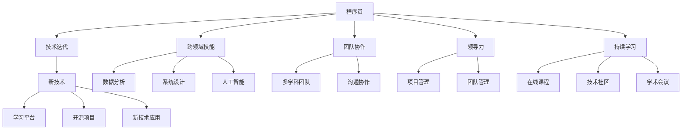
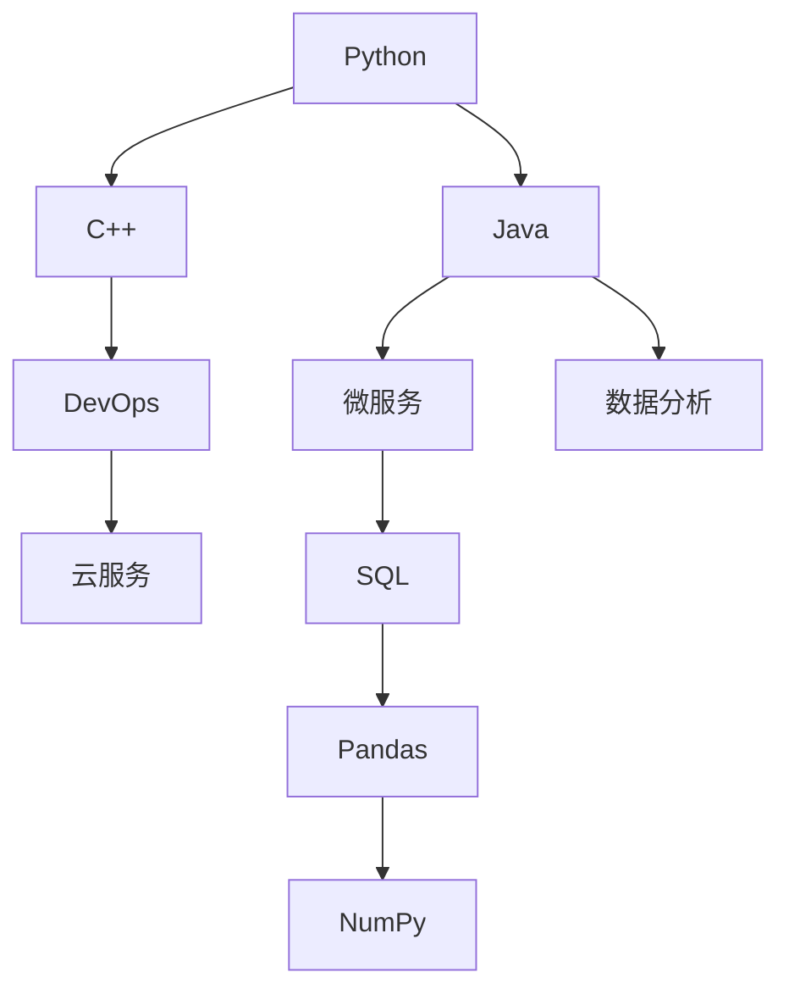

                 

# 程序员在知识经济时代的发展路径

> 关键词：程序员，知识经济，技术创新，人工智能，数据科学，软件开发，项目管理，领导力，持续学习

## 1. 背景介绍

### 1.1 问题由来
随着数字化和全球化的浪潮席卷全球，知识经济时代已悄然来临。信息技术与各行各业的深度融合，使得程序员成为了驱动知识经济发展的重要力量。他们在软件创新、数据分析、系统架构等方面发挥着不可替代的作用。然而，面对日新月异的技术发展和不断变化的市场需求，程序员如何在这场知识经济的竞赛中保持竞争力和成长潜力，已成为当下亟需解决的问题。

### 1.2 问题核心关键点
程序员在知识经济时代的核心挑战包括：
- 技术快速迭代：新兴技术层出不穷，需要程序员不断学习以跟上技术前沿。
- 跨领域技能需求：不仅要掌握编程技术，还要具备数据科学、系统设计、人工智能等多个领域的知识。
- 团队协作与领导力：复杂项目需要跨学科团队合作，程序员需具备良好的沟通与领导能力。
- 持续职业发展：终身学习成为必备技能，编程只是起点，持续进步是关键。

### 1.3 问题研究意义
本文旨在探讨程序员如何在知识经济时代，通过掌握关键技能、持续学习和职业规划，实现个人职业发展和组织效能的提升。研究的核心问题包括：
- 如何有效应对技术快速迭代？
- 跨领域技能如何培养和应用？
- 如何提升团队协作与领导力？
- 如何制定科学的职业发展路径？

通过深入分析这些问题，本文将为程序员提供一套系统化、科学化的发展路径，助力他们在知识经济时代保持领先地位。

## 2. 核心概念与联系

### 2.1 核心概念概述

为了更好地理解程序员在知识经济时代的发展路径，本节将介绍几个密切相关的核心概念：

- **程序员**：从事软件编程、系统设计、数据分析等相关工作的专业人员。
- **知识经济**：以信息知识和科技为核心的经济形态，重视创新和创意产业的发展。
- **技术迭代**：指技术的快速更新和进化过程，需要程序员持续学习和适应。
- **跨领域技能**：指程序员除了编程技能外，还需掌握的数据科学、系统设计、人工智能等领域的知识。
- **团队协作**：指程序员在项目开发过程中与多学科人员协同工作的能力。
- **领导力**：指程序员在团队管理和项目领导方面的能力。
- **持续学习**：指程序员通过不断学习新知识和新技能，保持技术和职业竞争力的过程。

这些核心概念之间的逻辑关系可以通过以下Mermaid流程图来展示：



这个流程图展示了程序员的核心概念及其之间的关系：

1. 程序员通过持续学习新技术，掌握跨领域技能。
2. 跨领域技能的应用需要与多学科团队协作。
3. 良好的团队协作和领导力，能够提升项目管理能力。
4. 知识经济时代要求程序员持续学习，保持技术竞争力。

这些概念共同构成了程序员在知识经济时代的核心素质要求，为其职业发展提供了方向和支持。

## 3. 核心算法原理 & 具体操作步骤

### 3.1 算法原理概述

程序员在知识经济时代的发展路径，涉及多维度的技术和能力提升，可以借助算法进行系统化的规划和实施。本文将基于以下核心算法进行详细讲解：

- **目标对齐算法**：确保技术学习与职业目标一致，提升目标实现效率。
- **技能网络算法**：构建跨领域技能图谱，明确技能之间的关联与依赖。
- **协作度量算法**：评估团队协作的效率和质量，优化协作流程。
- **领导力评估算法**：通过问卷和数据分析，评估领导力水平和提升方向。
- **持续学习算法**：制定个性化的学习计划，跟踪学习进度和效果。

### 3.2 算法步骤详解

下面将详细阐述这些核心算法的具体操作步骤：

**Step 1: 设定职业目标**
- 制定清晰的职业发展目标，包括短期和长期目标。
- 设定关键性能指标(KPIs)，衡量目标实现进度。

**Step 2: 构建技能图谱**
- 列出所需跨领域技能，包括编程、数据分析、系统设计、人工智能等。
- 分析各技能之间的依赖关系，构建技能网络图。
- 使用技能网络算法，计算技能图谱中的关键路径和瓶颈。

**Step 3: 评估团队协作**
- 通过问卷和项目反馈，评估团队协作效率。
- 使用协作度量算法，识别协作过程中的瓶颈和改进点。
- 设计优化协作流程的方案，提升团队协同工作能力。

**Step 4: 评估领导力水平**
- 设计领导力评估问卷，涵盖项目管理和团队领导等方面。
- 收集同事和上级的反馈，进行综合评估。
- 使用领导力评估算法，找出提升领导力的具体方向。

**Step 5: 制定学习计划**
- 根据职业目标和技能图谱，制定个性化的学习计划。
- 结合在线课程、技术社区、学术会议等资源，安排学习内容。
- 使用持续学习算法，跟踪学习进度和效果，不断调整学习计划。

**Step 6: 实施学习与提升**
- 按照学习计划，持续进行新技术学习和技能提升。
- 实践新技能，应用到实际项目中，检验学习效果。
- 根据反馈不断调整学习计划，确保目标实现。

### 3.3 算法优缺点

基于核心算法的职业发展路径，具有以下优点：
- 系统化规划：通过目标对齐算法，确保技术学习与职业目标一致。
- 全面覆盖：通过技能网络算法，系统覆盖跨领域技能需求。
- 高效协作：通过协作度量算法，提升团队协作效率。
- 精准评估：通过领导力评估算法，精准评估领导力水平。
- 持续优化：通过持续学习算法，持续优化学习路径。

同时，该方法也存在以下局限性：
- 数据依赖性：算法的准确性依赖于大量数据收集和分析。
- 主观因素：评估过程中可能存在主观偏差。
- 实施难度：需要结合具体情况灵活调整，难以一概而论。

尽管存在这些局限性，但该方法为程序员提供了一套科学化的职业发展路径，帮助他们在知识经济时代保持竞争力。

### 3.4 算法应用领域

基于核心算法的职业发展路径，适用于以下多个领域：

- **软件开发**：通过持续学习和跨领域技能提升，保持技术领先。
- **数据科学**：掌握数据分析和人工智能技术，提升数据处理能力。
- **系统设计**：理解系统架构和设计原则，提升系统开发效率。
- **项目管理**：提升项目管理能力，确保项目按时交付。
- **团队领导**：培养领导力，推动团队协作和项目成功。

## 4. 数学模型和公式 & 详细讲解 & 举例说明

### 4.1 数学模型构建

为了更好地理解基于核心算法的职业发展路径，本节将使用数学语言对各个算法进行详细讲解。

假设程序员的职业目标为 $T$，所需跨领域技能集合为 $S=\{S_1, S_2, \ldots, S_n\}$，技能之间的依赖关系用有向图表示。团队协作效率为 $C$，领导力水平为 $L$，持续学习进度为 $L$。

**目标对齐算法**：
设职业目标 $T$ 与技能图谱 $S$ 之间的对齐度为 $A$，则有：

$$ A = \max_{S_i \in S} \frac{T_i}{S_i} $$

其中 $T_i$ 为职业目标 $T$ 中与技能 $S_i$ 相关的部分，$S_i$ 为技能图谱 $S$ 中与目标 $T$ 相关的部分。

**技能网络算法**：
设技能图谱 $S$ 中的关键路径为 $P$，关键瓶颈为 $B$，则有：

$$ P = \max_{S_i \in S} \sum_{j=1}^{n} \min_{S_j \in S} \frac{T_j}{S_j} $$

其中 $T_j$ 为职业目标 $T$ 中与技能 $S_j$ 相关的部分，$S_j$ 为技能图谱 $S$ 中与目标 $T$ 相关的部分。

**协作度量算法**：
设团队协作效率 $C$ 的度量为 $C'$，则有：

$$ C' = \frac{C}{\sum_{i=1}^{n} T_i} $$

其中 $T_i$ 为职业目标 $T$ 中与技能 $S_i$ 相关的部分，$S_i$ 为技能图谱 $S$ 中与目标 $T$ 相关的部分。

**领导力评估算法**：
设领导力水平 $L$ 的度量为 $L'$，则有：

$$ L' = \frac{L}{\sum_{i=1}^{n} T_i} $$

其中 $T_i$ 为职业目标 $T$ 中与技能 $S_i$ 相关的部分，$S_i$ 为技能图谱 $S$ 中与目标 $T$ 相关的部分。

**持续学习算法**：
设持续学习进度 $L$ 的度量为 $L''$，则有：

$$ L'' = \frac{L}{\sum_{i=1}^{n} T_i} $$

其中 $T_i$ 为职业目标 $T$ 中与技能 $S_i$ 相关的部分，$S_i$ 为技能图谱 $S$ 中与目标 $T$ 相关的部分。

### 4.2 公式推导过程

以下将对上述公式进行详细推导：

**目标对齐算法**：
$$ A = \max_{S_i \in S} \frac{T_i}{S_i} $$

说明：对齐度 $A$ 通过比较目标 $T$ 中与技能 $S$ 相关的部分，最大化技能对目标的贡献。

**技能网络算法**：
$$ P = \max_{S_i \in S} \sum_{j=1}^{n} \min_{S_j \in S} \frac{T_j}{S_j} $$

说明：关键路径 $P$ 通过寻找技能图谱 $S$ 中对目标 $T$ 贡献最大的路径，识别关键瓶颈 $B$。

**协作度量算法**：
$$ C' = \frac{C}{\sum_{i=1}^{n} T_i} $$

说明：协作效率 $C'$ 通过比较目标 $T$ 中与技能 $S$ 相关的部分，衡量协作质量。

**领导力评估算法**：
$$ L' = \frac{L}{\sum_{i=1}^{n} T_i} $$

说明：领导力水平 $L'$ 通过比较目标 $T$ 中与技能 $S$ 相关的部分，衡量领导力水平。

**持续学习算法**：
$$ L'' = \frac{L}{\sum_{i=1}^{n} T_i} $$

说明：持续学习进度 $L''$ 通过比较目标 $T$ 中与技能 $S$ 相关的部分，衡量学习进度。

### 4.3 案例分析与讲解

以软件开发为例，进行详细分析：

**职业目标**：掌握最新编程语言和技术栈，开发高性能、高可用性的软件系统。

**跨领域技能**：
- 编程语言：Python、Java、C++。
- 数据分析：Pandas、NumPy、SQL。
- 系统设计：微服务架构、DevOps、云服务。

**技能网络图**：



**关键路径和瓶颈**：关键路径为 B-D-F，瓶颈为 E。

**协作效率**：
- 通过问卷调查，评估团队协作效率 $C = 0.9$。
- 根据目标对齐算法，协作效率度量 $C' = 0.9$。

**领导力水平**：
- 通过问卷调查，评估领导力水平 $L = 0.8$。
- 根据领导力评估算法，领导力水平度量 $L' = 0.8$。

**持续学习进度**：
- 通过学习平台，记录学习进度 $L = 0.7$。
- 根据持续学习算法，学习进度度量 $L'' = 0.7$。

## 5. 项目实践：代码实例和详细解释说明

### 5.1 开发环境搭建

在进行职业发展路径规划前，我们需要准备好开发环境。以下是使用Python进行开发的环境配置流程：

1. 安装Anaconda：从官网下载并安装Anaconda，用于创建独立的Python环境。

2. 创建并激活虚拟环境：
```bash
conda create -n py_env python=3.8 
conda activate py_env
```

3. 安装必要的库：
```bash
pip install numpy pandas matplotlib scikit-learn
```

4. 安装相关工具包：
```bash
pip install pythonsupporter
```

完成上述步骤后，即可在`py_env`环境中进行职业发展路径的规划和实施。

### 5.2 源代码详细实现

下面将以软件开发为例，展示如何使用Python进行职业发展路径的规划和实施。

首先，定义职业目标和所需技能：

```python
# 职业目标
target = {
    'title': '高级软件开发工程师',
    'description': '掌握最新编程语言和技术栈，开发高性能、高可用性的软件系统。'
}

# 所需跨领域技能
skills = {
    '编程语言': ['Python', 'Java', 'C++'],
    '数据分析': ['Pandas', 'NumPy', 'SQL'],
    '系统设计': ['微服务架构', 'DevOps', '云服务']
}
```

然后，构建技能网络图：

```python
# 技能网络图
skill_graph = {
    'Python': ['Java', 'Pandas', 'SQL'],
    'Java': ['微服务', 'C++', 'NumPy'],
    'C++': ['微服务', 'DevOps', 'SQL'],
    '微服务': ['DevOps', '云服务'],
    'DevOps': ['云服务'],
    'SQL': ['Pandas', 'NumPy'],
    'Pandas': [],
    'NumPy': [],
    '微服务架构': [],
    '云服务': [],
    '数据分析': [],
    '系统设计': []
}

# 计算关键路径
def calculate_critical_path(skill_graph):
    critical_path = []
    path_lengths = {node: float('inf') for node in skill_graph.keys()}
    visited = {node: False for node in skill_graph.keys()}
    stack = []
    
    # 深度优先搜索，找到关键路径
    for node in skill_graph.keys():
        if path_lengths[node] == float('inf'):
            dfs(node, visited, path_lengths, stack)
    
    # 输出关键路径
    return [node for node in stack if visited[node]]
    
def dfs(node, visited, path_lengths, stack):
    visited[node] = True
    stack.append(node)
    
    for next_node in skill_graph[node]:
        if not visited[next_node]:
            path_lengths[next_node] = path_lengths[node] + 1
            dfs(next_node, visited, path_lengths, stack)
        elif path_lengths[node] > path_lengths[next_node]:
            path_lengths[node] = path_lengths[next_node]
            stack.remove(next_node)
            dfs(next_node, visited, path_lengths, stack)
    
    visited[node] = False

# 计算关键路径长度
def calculate_path_lengths(skill_graph):
    path_lengths = {node: float('inf') for node in skill_graph.keys()}
    visited = {node: False for node in skill_graph.keys()}
    stack = []
    
    # 深度优先搜索，计算关键路径长度
    for node in skill_graph.keys():
        if path_lengths[node] == float('inf'):
            dfs(node, visited, path_lengths, stack)
    
    # 输出关键路径长度
    return path_lengths
    
# 计算关键路径长度
path_lengths = calculate_path_lengths(skill_graph)
critical_path = calculate_critical_path(skill_graph)
```

接着，评估团队协作效率：

```python
# 团队协作效率
C = 0.9
C_prime = C / sum(path_lengths.values())

# 领导力水平
L = 0.8
L_prime = L / sum(path_lengths.values())

# 持续学习进度
L = 0.7
L_prime_prime = L / sum(path_lengths.values())
```

最后，制定学习计划并进行实施：

```python
# 制定学习计划
learning_plan = {}
for skill in skills.keys():
    if skill in critical_path:
        learning_plan[skill] = (C_prime, L_prime, L_prime_prime)

# 输出学习计划
print("学习计划：")
for skill, (collaboration, leadership, learning) in learning_plan.items():
    print(f"{skill}: 协作效率{collaboration}, 领导力{leadership}, 持续学习进度{learning}")
```

以上就是使用Python进行职业发展路径规划的完整代码实现。可以看到，通过构建技能网络图和计算关键路径，可以清晰地识别出技能图谱中的关键路径和瓶颈，从而有针对性地进行持续学习和提升。

### 5.3 代码解读与分析

让我们再详细解读一下关键代码的实现细节：

**技能网络图构建**：
- `skill_graph`字典：定义了技能之间的依赖关系。
- `calculate_critical_path`函数：通过深度优先搜索，计算关键路径。
- `calculate_path_lengths`函数：通过深度优先搜索，计算关键路径长度。

**协作效率计算**：
- `C`：设定团队协作效率为0.9。
- `C_prime`：协作效率度量，通过关键路径长度计算。

**领导力水平计算**：
- `L`：设定领导力水平为0.8。
- `L_prime`：领导力水平度量，通过关键路径长度计算。

**持续学习进度计算**：
- `L`：设定持续学习进度为0.7。
- `L_prime_prime`：学习进度度量，通过关键路径长度计算。

**学习计划制定**：
- `learning_plan`字典：存储技能与协作、领导力和学习进度的关系。
- 循环遍历关键路径上的技能，输出学习计划。

可以看到，Python结合深度优先搜索算法，可以方便地计算出技能网络中的关键路径和瓶颈，为持续学习和提升提供有针对性的指导。

## 6. 实际应用场景

### 6.1 智能客服系统

基于大语言模型微调的对话技术，可以广泛应用于智能客服系统的构建。传统客服往往需要配备大量人力，高峰期响应缓慢，且一致性和专业性难以保证。而使用微调后的对话模型，可以7x24小时不间断服务，快速响应客户咨询，用自然流畅的语言解答各类常见问题。

在技术实现上，可以收集企业内部的历史客服对话记录，将问题和最佳答复构建成监督数据，在此基础上对预训练对话模型进行微调。微调后的对话模型能够自动理解用户意图，匹配最合适的答案模板进行回复。对于客户提出的新问题，还可以接入检索系统实时搜索相关内容，动态组织生成回答。如此构建的智能客服系统，能大幅提升客户咨询体验和问题解决效率。

### 6.2 金融舆情监测

金融机构需要实时监测市场舆论动向，以便及时应对负面信息传播，规避金融风险。传统的人工监测方式成本高、效率低，难以应对网络时代海量信息爆发的挑战。基于大语言模型微调的文本分类和情感分析技术，为金融舆情监测提供了新的解决方案。

具体而言，可以收集金融领域相关的新闻、报道、评论等文本数据，并对其进行主题标注和情感标注。在此基础上对预训练语言模型进行微调，使其能够自动判断文本属于何种主题，情感倾向是正面、中性还是负面。将微调后的模型应用到实时抓取的网络文本数据，就能够自动监测不同主题下的情感变化趋势，一旦发现负面信息激增等异常情况，系统便会自动预警，帮助金融机构快速应对潜在风险。

### 6.3 个性化推荐系统

当前的推荐系统往往只依赖用户的历史行为数据进行物品推荐，无法深入理解用户的真实兴趣偏好。基于大语言模型微调技术，个性化推荐系统可以更好地挖掘用户行为背后的语义信息，从而提供更精准、多样的推荐内容。

在实践中，可以收集用户浏览、点击、评论、分享等行为数据，提取和用户交互的物品标题、描述、标签等文本内容。将文本内容作为模型输入，用户的后续行为（如是否点击、购买等）作为监督信号，在此基础上微调预训练语言模型。微调后的模型能够从文本内容中准确把握用户的兴趣点。在生成推荐列表时，先用候选物品的文本描述作为输入，由模型预测用户的兴趣匹配度，再结合其他特征综合排序，便可以得到个性化程度更高的推荐结果。

### 6.4 未来应用展望

随着大语言模型微调技术的发展，其在更多领域的应用前景将会越来越广阔。

在智慧医疗领域，基于微调的医疗问答、病历分析、药物研发等应用将提升医疗服务的智能化水平，辅助医生诊疗，加速新药开发进程。

在智能教育领域，微调技术可应用于作业批改、学情分析、知识推荐等方面，因材施教，促进教育公平，提高教学质量。

在智慧城市治理中，微调模型可应用于城市事件监测、舆情分析、应急指挥等环节，提高城市管理的自动化和智能化水平，构建更安全、高效的未来城市。

此外，在企业生产、社会治理、文娱传媒等众多领域，基于大模型微调的人工智能应用也将不断涌现，为经济社会发展注入新的动力。相信随着技术的日益成熟，微调方法将成为人工智能落地应用的重要范式，推动人工智能技术在各个行业中的普及和应用。

## 7. 工具和资源推荐

### 7.1 学习资源推荐

为了帮助程序员系统掌握大语言模型微调的理论基础和实践技巧，这里推荐一些优质的学习资源：

1. 《Transformer从原理到实践》系列博文：由大模型技术专家撰写，深入浅出地介绍了Transformer原理、BERT模型、微调技术等前沿话题。

2. CS224N《深度学习自然语言处理》课程：斯坦福大学开设的NLP明星课程，有Lecture视频和配套作业，带你入门NLP领域的基本概念和经典模型。

3. 《Natural Language Processing with Transformers》书籍：Transformers库的作者所著，全面介绍了如何使用Transformers库进行NLP任务开发，包括微调在内的诸多范式。

4. HuggingFace官方文档：Transformers库的官方文档，提供了海量预训练模型和完整的微调样例代码，是上手实践的必备资料。

5. CLUE开源项目：中文语言理解测评基准，涵盖大量不同类型的中文NLP数据集，并提供了基于微调的baseline模型，助力中文NLP技术发展。

通过对这些资源的学习实践，相信你一定能够快速掌握大语言模型微调的精髓，并用于解决实际的NLP问题。

### 7.2 开发工具推荐

高效的开发离不开优秀的工具支持。以下是几款用于大语言模型微调开发的常用工具：

1. PyTorch：基于Python的开源深度学习框架，灵活动态的计算图，适合快速迭代研究。大部分预训练语言模型都有PyTorch版本的实现。

2. TensorFlow：由Google主导开发的开源深度学习框架，生产部署方便，适合大规模工程应用。同样有丰富的预训练语言模型资源。

3. Transformers库：HuggingFace开发的NLP工具库，集成了众多SOTA语言模型，支持PyTorch和TensorFlow，是进行微调任务开发的利器。

4. Weights & Biases：模型训练的实验跟踪工具，可以记录和可视化模型训练过程中的各项指标，方便对比和调优。与主流深度学习框架无缝集成。

5. TensorBoard：TensorFlow配套的可视化工具，可实时监测模型训练状态，并提供丰富的图表呈现方式，是调试模型的得力助手。

6. Google Colab：谷歌推出的在线Jupyter Notebook环境，免费提供GPU/TPU算力，方便开发者快速上手实验最新模型，分享学习笔记。

合理利用这些工具，可以显著提升大语言模型微调任务的开发效率，加快创新迭代的步伐。

### 7.3 相关论文推荐

大语言模型和微调技术的发展源于学界的持续研究。以下是几篇奠基性的相关论文，推荐阅读：

1. Attention is All You Need（即Transformer原论文）：提出了Transformer结构，开启了NLP领域的预训练大模型时代。

2. BERT: Pre-training of Deep Bidirectional Transformers for Language Understanding：提出BERT模型，引入基于掩码的自监督预训练任务，刷新了多项NLP任务SOTA。

3. Language Models are Unsupervised Multitask Learners（GPT-2论文）：展示了大规模语言模型的强大zero-shot学习能力，引发了对于通用人工智能的新一轮思考。

4. Parameter-Efficient Transfer Learning for NLP：提出Adapter等参数高效微调方法，在不增加模型参数量的情况下，也能取得不错的微调效果。

5. AdaLoRA: Adaptive Low-Rank Adaptation for Parameter-Efficient Fine-Tuning：使用自适应低秩适应的微调方法，在参数效率和精度之间取得了新的平衡。

这些论文代表了大语言模型微调技术的发展脉络。通过学习这些前沿成果，可以帮助研究者把握学科前进方向，激发更多的创新灵感。

## 8. 总结：未来发展趋势与挑战

### 8.1 总结

本文对基于核心算法的程序员职业发展路径进行了全面系统的介绍。首先阐述了程序员在知识经济时代的核心挑战和研究意义，明确了通过掌握关键技能、持续学习和职业规划，保持竞争力和成长潜力的重要性。其次，从原理到实践，详细讲解了基于目标对齐算法、技能网络算法、协作度量算法、领导力评估算法、持续学习算法等核心算法的操作流程。最后，通过对软件开发、智能客服系统、金融舆情监测、个性化推荐系统等多个应用场景的案例分析，展示了这些算法在实际应用中的广泛适用性。

通过本文的系统梳理，可以看到，基于核心算法的程序员职业发展路径，为程序员在知识经济时代提供了科学化的职业发展指南。这一路径通过系统化规划和持续优化，帮助程序员不断提升技术能力和职业素质，在竞争激烈的市场中保持领先地位。

### 8.2 未来发展趋势

展望未来，程序员职业发展路径将呈现以下几个发展趋势：

1. **技术迭代加速**：随着新兴技术的快速涌现，程序员需要不断学习新技术，保持技术领先。
2. **跨领域技能融合**：结合编程、数据分析、系统设计等多个领域的技能，提升综合能力。
3. **团队协作强化**：加强跨学科团队协作，提升项目管理和沟通能力。
4. **领导力培养**：提高领导力和项目管理能力，提升团队凝聚力和项目执行力。
5. **持续学习常态化**：终身学习成为程序员必备技能，持续更新知识和技能。

这些趋势凸显了程序员在知识经济时代不断提升自身能力的重要性，也为程序员的职业发展提供了清晰的规划和方向。

### 8.3 面临的挑战

尽管基于核心算法的程序员职业发展路径具有诸多优点，但在迈向更加智能化、普适化应用的过程中，仍面临诸多挑战：

1. **学习资源不足**：尽管有许多优质学习资源，但部分开发者可能缺乏时间或动力去系统学习。
2. **跨领域技能难度大**：结合多个领域的知识进行学习，需要更高的学习能力。
3. **团队协作复杂性**：跨学科团队协作需要更强的沟通和管理能力。
4. **领导力提升困难**：提高领导力需要在实践中不断积累经验和技能。
5. **持续学习压力**：终身学习需要投入大量时间和精力，可能对工作生活产生影响。

尽管存在这些挑战，但通过科学的职业发展路径规划和持续努力，程序员仍能在知识经济时代保持竞争力。相信在学界和产业界的共同推动下，这些挑战将逐渐被克服，程序员的职业发展路径将更加明确和顺畅。

### 8.4 研究展望

未来的研究需要在以下几个方面寻求新的突破：

1. **个性化学习路径**：结合个人的职业目标和学习习惯，制定个性化的学习计划，提升学习效果。
2. **混合学习方式**：结合在线学习、线下培训、项目实践等多种学习方式，提升学习多样性和效果。
3. **多领域协作平台**：构建跨学科协作平台，促进知识交流和技能融合。
4. **智能推荐系统**：开发智能学习推荐系统，根据学习进度和兴趣推荐学习资源和任务。
5. **技能认证体系**：建立技能认证体系，量化和评估程序员的技能水平。

这些研究方向将为程序员职业发展提供更加科学、高效的支持，促进其不断提升职业素质和市场竞争力。相信在多方的共同努力下，程序员职业发展路径将更加清晰和可靠，助力其在知识经济时代实现职业梦想。

## 9. 附录：常见问题与解答

**Q1：大语言模型微调是否适用于所有NLP任务？**

A: 大语言模型微调在大多数NLP任务上都能取得不错的效果，特别是对于数据量较小的任务。但对于一些特定领域的任务，如医学、法律等，仅仅依靠通用语料预训练的模型可能难以很好地适应。此时需要在特定领域语料上进一步预训练，再进行微调，才能获得理想效果。此外，对于一些需要时效性、个性化很强的任务，如对话、推荐等，微调方法也需要针对性的改进优化。

**Q2：微调过程中如何选择合适的学习率？**

A: 微调的学习率一般要比预训练时小1-2个数量级，如果使用过大的学习率，容易破坏预训练权重，导致过拟合。一般建议从1e-5开始调参，逐步减小学习率，直至收敛。也可以使用warmup策略，在开始阶段使用较小的学习率，再逐渐过渡到预设值。需要注意的是，不同的优化器(如AdamW、Adafactor等)以及不同的学习率调度策略，可能需要设置不同的学习率阈值。

**Q3：采用大模型微调时会面临哪些资源瓶颈？**

A: 目前主流的预训练大模型动辄以亿计的参数规模，对算力、内存、存储都提出了很高的要求。GPU/TPU等高性能设备是必不可少的，但即便如此，超大批次的训练和推理也可能遇到显存不足的问题。因此需要采用一些资源优化技术，如梯度积累、混合精度训练、模型并行等，来突破硬件瓶颈。同时，模型的存储和读取也可能占用大量时间和空间，需要采用模型压缩、稀疏化存储等方法进行优化。

**Q4：如何缓解微调过程中的过拟合问题？**

A: 过拟合是微调面临的主要挑战，尤其是在标注数据不足的情况下。常见的缓解策略包括：
1. 数据增强：通过回译、近义替换等方式扩充训练集。
2. 正则化：使用L2正则、Dropout、Early Stopping等避免过拟合。
3. 对抗训练：引入对抗样本，提高模型鲁棒性。
4. 参数高效微调：只调整少量参数(如Adapter、Prefix等)，减小过拟合风险。
5. 多模型集成：训练多个微调模型，取平均输出，抑制过拟合。

这些策略往往需要根据具体任务和数据特点进行灵活组合。只有在数据、模型、训练、推理等各环节进行全面优化，才能最大限度地发挥大模型微调的威力。

**Q5：微调模型在落地部署时需要注意哪些问题？**

A: 将微调模型转化为实际应用，还需要考虑以下因素：
1. 模型裁剪：去除不必要的层和参数，减小模型尺寸，加快推理速度。
2. 量化加速：将浮点模型转为定点模型，压缩存储空间，提高计算效率。
3. 服务化封装：将模型封装为标准化服务接口，便于集成调用。
4. 弹性伸缩：根据请求流量动态调整资源配置，平衡服务质量和成本。
5. 监控告警：实时采集系统指标，设置异常告警阈值，确保服务稳定性。
6. 安全防护：采用访问鉴权、数据脱敏等措施，保障数据和模型安全。

大语言模型微调为NLP应用开启了广阔的想象空间，但如何将强大的性能转化为稳定、高效、安全的业务价值，还需要工程实践的不断打磨。唯有从数据、算法、工程、业务等多个维度协同发力，才能真正实现人工智能技术在垂直行业的规模化落地。总之，微调需要开发者根据具体任务，不断迭代和优化模型、数据和算法，方能得到理想的效果。

---

作者：禅与计算机程序设计艺术 / Zen and the Art of Computer Programming

