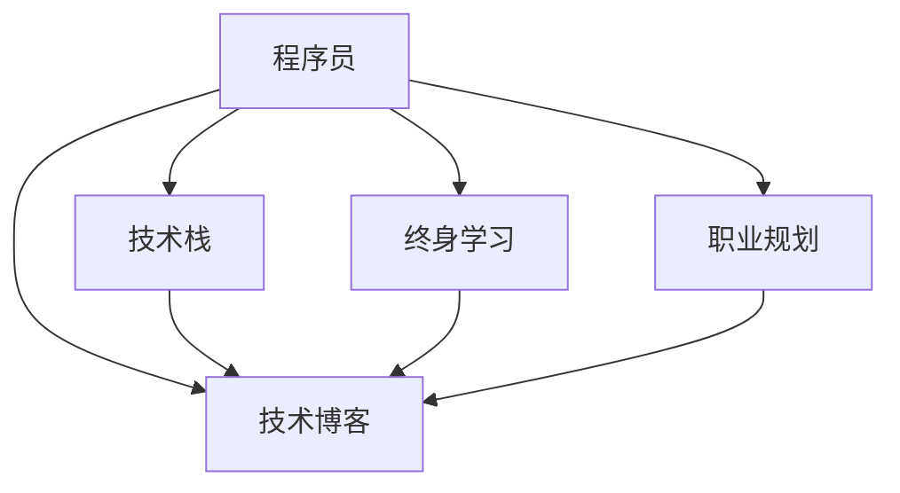
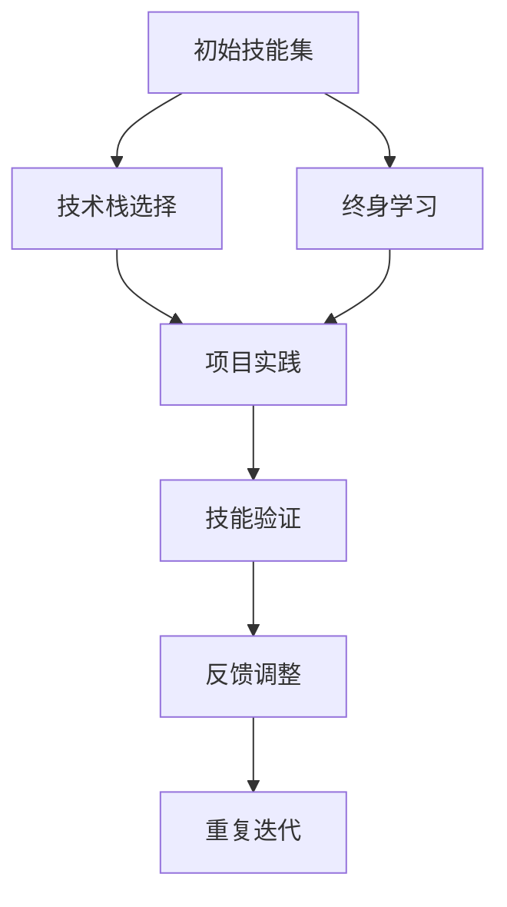

                 

# 程序员在知识经济时代的发展路径

> 关键词：程序员, 知识经济, 技术栈, 技能升级, 职业规划, 技术博客

## 1. 背景介绍

### 1.1 问题由来

在信息技术的推动下，全球经济正步入知识经济时代。知识成为推动经济发展的核心力量，对劳动力的需求也从体力劳动转向知识型、创新型人才。程序员作为信息技术领域的关键劳动力，其发展路径也在悄然改变。面对日新月异的技术变革，程序员如何把握发展机遇，提升自身价值，是每一个从业人员都必须深入思考的问题。

### 1.2 问题核心关键点

在知识经济时代，程序员的发展路径主要受到以下因素影响：

- 技术栈更新速度：新兴技术层出不穷，如何跟上技术进步，保持竞争力？
- 跨学科能力需求：编程不再是孤立的技能，而是与其他学科的深度融合，如何跨界？
- 终身学习压力：知识半衰期缩短，如何在职业生涯中不断学习新知识？
- 职业规划定位：如何在技术日新月异的环境中，定位自己的发展方向？
- 技术博客的重要性：如何通过技术博客提升自身影响力，建立专业品牌？

这些核心关键点构成了程序员在知识经济时代的职业发展路径，需要我们在接下来的章节中逐一探讨。

## 2. 核心概念与联系

### 2.1 核心概念概述

为更好地理解程序员在知识经济时代的职业发展路径，本节将介绍几个密切相关的核心概念：

- 程序员(Programmer)：使用编程语言编写软件程序的专业人员。在知识经济时代，程序员不仅需要编程技能，还需要具备全面的技术能力和跨学科知识。
- 知识经济(Knowledge Economy)：以知识为驱动力的经济形态，强调创新、科技和信息的重要性。
- 技术栈(Technology Stack)：程序员需掌握的一组技术，包括编程语言、框架、库等。技术栈的选择直接影响职业发展方向和行业适应性。
- 终身学习(Lifelong Learning)：程序员需要不断学习新技术，以应对不断变化的技术环境和市场需求。
- 职业规划(Career Planning)：结合个人兴趣和市场需求，制定合理的职业发展目标和路径。
- 技术博客(Technical Blogging)：通过撰写技术博客，分享编程经验和知识，提升自身影响力，建立专业品牌。

这些核心概念之间的逻辑关系可以通过以下Mermaid流程图来展示：



这个流程图展示了好程序员职业发展的各个关键环节：

1. 程序员通过掌握多种技术栈，掌握行业必备技能。
2. 不断通过终身学习，提升自身技术水平，保持竞争力。
3. 在职业规划指导下，制定明确的职业目标和发展路径。
4. 通过技术博客分享经验，提升影响力，建立专业品牌。

这些环节互相支持，共同推动程序员在知识经济时代的职业发展。

## 3. 核心算法原理 & 具体操作步骤
### 3.1 算法原理概述

程序员在知识经济时代的职业发展，可以视为一个动态调整和优化的过程。其核心思想是通过持续学习和技能升级，不断适应技术栈和行业需求的变化，实现自我价值的最大化。

形式化地，假设程序员当前的技能集为 $S_t$，行业需求为 $D$，目标为最大化自身价值 $V$，则职业发展过程可以表示为：

$$
\max_{S_t} V(S_t, D)
$$

其中，$S_t$ 可以通过技术栈更新和终身学习等操作动态调整，$D$ 则是市场和技术趋势的动态变化。在实际操作中，我们可以将其分解为以下几个关键步骤：

1. 分析当前技术栈和技能，识别技能差距。
2. 选择新的技术栈和技能，进行学习和实践。
3. 将新技能融入项目实践，验证其效果。
4. 不断迭代和优化，提升自身价值。

### 3.2 算法步骤详解

以下是程序员在知识经济时代的职业发展路径的具体操作步骤：

**Step 1: 技能差距分析**
- 列出当前掌握的技术栈和技能。
- 调研行业需求和新技术趋势。
- 识别技术栈和技能与行业需求的差距。

**Step 2: 技术栈和技能升级**
- 选择适合自身职业目标和兴趣的新技术栈。
- 制定学习计划，选择合适的学习资源。
- 进行系统学习，掌握新技术和工具。
- 通过项目实践，将新技能融入实际应用。

**Step 3: 技能验证和迭代**
- 参与开源项目或企业项目，验证新技能的效果。
- 通过绩效反馈，调整学习计划和职业规划。
- 不断重复上述步骤，持续提升自身价值。

### 3.3 算法优缺点

基于动态调整和优化的职业发展算法具有以下优点：

1. 灵活性高。技术栈和技能可以根据市场和技术变化灵活调整，适应性强。
2. 主动性强。通过持续学习和技能升级，掌握行业趋势，占据主动。
3. 反馈机制完善。通过实际项目验证技能效果，及时调整职业规划。

但同时也存在一些局限性：

1. 学习成本高。新技术和新技能的掌握需要时间和精力的投入。
2. 市场变化快。技术栈和技能的更新需要紧跟市场步伐，容易错过时机。
3. 职业路径不确定。技术栈和技能的调整可能导致职业路径的不确定性。

尽管如此，动态调整和优化的职业发展算法仍是目前最为有效和可行的路径，尤其是在技术日新月异的知识经济时代。

### 3.4 算法应用领域

该算法不仅适用于程序员，也适用于所有技术人员，包括但不限于：

- 软件工程师：需不断更新编程语言、框架和工具。
- 数据科学家：需掌握大数据、机器学习和深度学习等技术。
- 系统架构师：需了解新的分布式系统和微服务架构。
- 产品经理：需掌握用户体验设计和数据分析能力。

这些技术人员在知识经济时代都需要通过动态调整和优化的职业发展路径，提升自身技能和价值。

## 4. 数学模型和公式 & 详细讲解  
### 4.1 数学模型构建

本文将通过一个简化的数学模型来分析程序员的职业发展过程。

设 $t$ 为时间，$S_t$ 为程序员在时间 $t$ 的技能集，$D_t$ 为行业需求，$V(S_t, D_t)$ 为程序员在时间 $t$ 的价值。

模型的构建基于以下假设：
- 技术栈和技能 $S_t$ 在时间 $t$ 内以固定速率 $\alpha$ 增长。
- 行业需求 $D_t$ 在时间 $t$ 内以固定速率 $\beta$ 变化。
- 价值 $V(S_t, D_t)$ 是技术栈和技能的指数函数，表示技能对价值的贡献。

则模型可表示为：

$$
S_t = S_0 \cdot (1 + \alpha t)
$$

$$
D_t = D_0 \cdot (1 + \beta t)
$$

$$
V(S_t, D_t) = V_0 \cdot \left(\frac{S_t}{S_0}\right)^k \cdot \left(\frac{D_t}{D_0}\right)^m
$$

其中，$S_0$ 和 $D_0$ 为初始状态，$V_0$ 为初始价值，$k$ 和 $m$ 为参数，表示技能和需求对价值的贡献。

### 4.2 公式推导过程

将上述模型展开，得：

$$
S_t = S_0 + \alpha tS_0
$$

$$
D_t = D_0 + \beta tD_0
$$

$$
V(S_t, D_t) = V_0 \cdot \left(\frac{S_0}{S_0} + \alpha t\right)^k \cdot \left(\frac{D_0}{D_0} + \beta t\right)^m
$$

简化得：

$$
V(S_t, D_t) = V_0 \cdot (1 + \alpha t)^{kS_0} \cdot (1 + \beta t)^{mD_0}
$$

### 4.3 案例分析与讲解

假设程序员初始技能 $S_0 = 10$，需求 $D_0 = 20$，增长速率 $\alpha = 0.2$，变化速率 $\beta = 0.3$，价值对技能和需求的贡献参数 $k = 0.5$ 和 $m = 0.3$。则在 $t = 1$ 和 $t = 2$ 时，程序员的价值变化如下：

$$
V(S_1, D_1) = V_0 \cdot (1 + 0.2 \cdot 1)^{10 \cdot 0.5} \cdot (1 + 0.3 \cdot 1)^{20 \cdot 0.3}
$$

$$
V(S_2, D_2) = V_0 \cdot (1 + 0.2 \cdot 2)^{10 \cdot 0.5} \cdot (1 + 0.3 \cdot 2)^{20 \cdot 0.3}
$$

通过计算，可以得出在 $t = 1$ 和 $t = 2$ 时程序员的价值变化情况。

## 5. 项目实践：代码实例和详细解释说明
### 5.1 开发环境搭建

在进行职业发展路径的实践前，我们需要准备好开发环境。以下是使用Python进行开发的流程图：



这个流程图展示了好程序员职业发展的各个环节：

1. 从初始技能集开始，选择新的技术栈。
2. 通过终身学习掌握新技能。
3. 将新技能应用到项目实践。
4. 通过技能验证和绩效反馈调整学习计划和职业规划。
5. 不断重复上述步骤，持续提升自身价值。

### 5.2 源代码详细实现

这里给出使用Python实现的技术栈选择和学习计划的代码示例：

```python
from sympy import symbols, Eq, solve

# 定义符号
t, alpha, beta, k, m = symbols('t alpha beta k m')
S0, D0, V0 = symbols('S0 D0 V0')

# 定义技术栈增长和行业需求变化的函数
def skill_growth(t):
    return S0 * (1 + alpha * t)

def demand_growth(t):
    return D0 * (1 + beta * t)

def value_function(S, D):
    return V0 * (S / S0)**k * (D / D0)**m

# 计算t=1和t=2时的价值变化
S1 = skill_growth(1)
D1 = demand_growth(1)
V1 = value_function(S1, D1)

S2 = skill_growth(2)
D2 = demand_growth(2)
V2 = value_function(S2, D2)

# 输出结果
V1, V2
```

### 5.3 代码解读与分析

代码通过SymPy库定义了技能增长和需求变化函数，以及价值函数。通过计算不同时间点的价值变化，展示了程序员在职业发展路径中的价值增长过程。

## 6. 实际应用场景
### 6.1 软件开发项目

在软件开发项目中，程序员需要不断更新技术栈，掌握新的编程语言、框架和工具。例如，Web开发领域从早期的HTML、CSS、JavaScript，到流行的React、Vue、Node.js，再到现代的GraphQL、TypeScript等。程序员需要根据项目需求和行业趋势，灵活选择技术栈，提升自身技能，满足项目需求。

### 6.2 大数据项目

在大数据项目中，程序员需要掌握Hadoop、Spark、Flink等大数据技术。通过持续学习，掌握新的数据处理和分析工具，提升数据处理能力，解决复杂的数据挖掘和机器学习问题。

### 6.3 人工智能项目

在人工智能项目中，程序员需要掌握机器学习、深度学习、自然语言处理等技术。通过参加在线课程、开源项目等方式，不断学习新知识，提升AI能力，应用到实际项目中，解决复杂的人工智能问题。

### 6.4 未来应用展望

未来，随着技术的不断进步，程序员的职业发展路径将更加多元化和复杂化。以下是对未来发展趋势的展望：

1. 跨界融合：编程技能将与其他学科深度融合，形成新的跨学科能力。
2. 自动化和工具化：编程工具和自动化技术将进一步提升编程效率，减轻重复性工作。
3. 智能化和智能化：人工智能技术将广泛应用于编程辅助，提升编程质量和效率。
4. 伦理和道德：编程技术的应用将更加注重伦理和道德，避免有害和歧视性算法。

## 7. 工具和资源推荐
### 7.1 学习资源推荐

为了帮助程序员不断学习新知识和技能，以下是几款优质的学习资源：

1. Coursera：提供来自全球顶尖大学的在线课程，涵盖计算机科学、数据科学、人工智能等众多领域。
2. edX：提供来自哈佛、麻省理工等名校的在线课程，涵盖编程、计算机科学、数据科学等多个方向。
3. Udacity：提供与顶尖企业合作的在线课程，涵盖编程、数据科学、人工智能等。
4. Khan Academy：提供免费的在线课程，涵盖计算机科学、编程、数学等基础学科。
5. Codecademy：提供交互式编程课程，适合初学者快速入门编程语言和工具。

### 7.2 开发工具推荐

程序员在职业发展中离不开合适的开发工具。以下是几款常用的开发工具：

1. Git：版本控制系统，用于协作开发和代码管理。
2. Docker：容器化技术，方便代码部署和运行环境管理。
3. PyCharm：流行的Python IDE，提供丰富的开发和调试功能。
4. Visual Studio Code：轻量级、跨平台的代码编辑器，支持多种编程语言。
5. Jupyter Notebook：用于数据科学和机器学习项目的交互式编程环境。

### 7.3 相关论文推荐

以下是几篇具有代表性的相关论文，推荐阅读：

1. "The Developer's Guide to Lifelong Learning in Software Development"：探讨程序员如何进行终身学习，掌握新技能和工具。
2. "Career Planning for Software Developers in the Age of AI"：探讨在人工智能时代，程序员如何进行职业规划和技能升级。
3. "Blogging for Programmers: Building a Professional Brand"：探讨程序员如何通过技术博客提升自身影响力和专业品牌。
4. "Cross-Disciplinary Collaboration in Software Development"：探讨程序员如何跨界融合，提升跨学科能力。
5. "Automating Software Development with AI"：探讨如何利用AI技术，提升软件开发自动化和效率。

## 8. 总结：未来发展趋势与挑战
### 8.1 总结

本文对程序员在知识经济时代的职业发展路径进行了全面系统的介绍。首先阐述了程序员在知识经济时代的背景和挑战，明确了职业发展路径的核心关键点。其次，从原理到实践，详细讲解了动态调整和优化的职业发展算法，给出了职业发展路径的完整代码实现。同时，本文还广泛探讨了程序员在软件开发、大数据、人工智能等实际应用场景中的发展方向，展示了职业发展路径的广阔前景。最后，本文精选了程序员职业发展路径的学习资源、开发工具和相关论文，力求为读者提供全方位的职业发展指引。

通过本文的系统梳理，可以看到，程序员在知识经济时代的职业发展路径需要不断的技术栈更新和技能升级，才能适应技术环境的变化，提升自身价值。程序员需要具备终身学习的态度，积极应对市场和技术的变化，主动调整和优化自己的职业发展路径，才能在激烈的竞争中脱颖而出。

### 8.2 未来发展趋势

展望未来，程序员的职业发展路径将呈现以下几个发展趋势：

1. 技术栈的多样化和深度化。程序员将更加注重跨学科技能的学习，掌握更多元化的技术栈。
2. 自动化和工具化的普及。自动化技术将进一步提升编程效率，减轻重复性工作。
3. 智能化和智能化的发展。人工智能技术将广泛应用于编程辅助，提升编程质量和效率。
4. 伦理和道德的重视。编程技术的应用将更加注重伦理和道德，避免有害和歧视性算法。

这些趋势将深刻影响程序员的职业发展路径，带来更多机遇和挑战。

### 8.3 面临的挑战

尽管程序员在知识经济时代的职业发展路径充满机遇，但也面临着诸多挑战：

1. 学习成本高。新技术和新技能的掌握需要时间和精力的投入。
2. 市场变化快。技术栈和技能的更新需要紧跟市场步伐，容易错过时机。
3. 职业路径不确定。技术栈和技能的调整可能导致职业路径的不确定性。
4. 编程效率提升瓶颈。自动化和智能化技术的应用存在瓶颈，无法完全替代人工。
5. 技术伦理问题。人工智能技术的应用需要注重伦理和道德，避免有害和歧视性算法。

这些挑战需要程序员具备更高的自我管理和适应能力，不断提升自己的综合素质。

### 8.4 研究展望

面对程序员在知识经济时代的职业发展挑战，未来的研究需要在以下几个方面寻求新的突破：

1. 探索更加灵活的学习方法和资源。开发更多灵活高效的学习平台和工具，帮助程序员更加便捷地获取新知识和技能。
2. 研究新的自动化和智能化技术。探索如何利用最新的自动化和智能化技术，提升编程效率和质量。
3. 解决技术伦理问题。探索如何在使用人工智能技术时，注重伦理和道德，避免有害和歧视性算法。
4. 提升跨学科能力。开发更多跨学科课程和实践项目，帮助程序员提升跨界融合能力。
5. 建立持续反馈机制。建立持续的技能评估和反馈机制，帮助程序员不断调整职业规划和发展路径。

这些研究方向将引领程序员在知识经济时代的职业发展，带来更多的机遇和挑战。程序员需要在持续学习和技能升级的过程中，不断调整和优化自己的职业发展路径，才能在激烈的竞争中保持竞争力。

## 9. 附录：常见问题与解答

**Q1: 程序员应该如何选择技术栈？**

A: 选择技术栈需要考虑个人兴趣和职业目标。可以通过调研市场需求、参考行业标准、参与开源项目等方式，综合考虑选择最适合自己的技术栈。同时，也需注重技术栈的扩展性和兼容性，以应对未来技术的变化和升级。

**Q2: 程序员应该如何进行终身学习？**

A: 终身学习需要制定明确的学习计划，选择合适的学习资源，保持持续的学习动力。可以通过在线课程、阅读技术博客、参与技术社区等方式，不断获取新知识和技能。同时，也需注重实践应用，将所学知识应用到实际项目中，提升实战能力。

**Q3: 程序员应该如何进行职业规划？**

A: 职业规划需要结合自身兴趣和市场需求，制定明确的职业目标和发展路径。可以通过设定短期和长期目标、参与行业交流、积累工作经验等方式，不断提升自己的综合素质和市场竞争力。同时，也需注重技能的多样化和跨学科融合，提升自身价值和职业适应性。

**Q4: 程序员应该如何通过技术博客提升自身影响力？**

A: 技术博客需要关注技术深度和广度，不断分享自己的编程经验和知识。可以通过撰写技术文章、参与技术讨论、积累技术积累等方式，提升自身影响力和专业品牌。同时，也需注重博客的质量和可读性，吸引更多读者关注和交流。

---

作者：禅与计算机程序设计艺术 / Zen and the Art of Computer Programming

