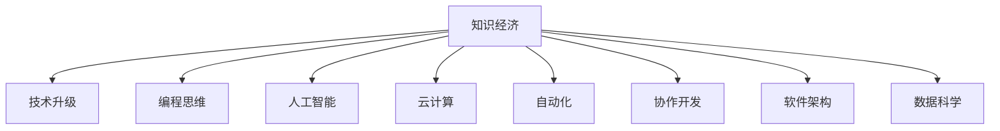

                 

# 程序员在知识经济时代的角色升级

> 关键词：知识经济, 技术升级, 编程思维, 人工智能, 云计算, 自动化, 协作开发, 软件架构, 软件开发, 数据科学

## 1. 背景介绍

### 1.1 问题由来
随着全球经济的发展，知识和信息成为最宝贵的资源，知识经济时代已经到来。在这一背景下，程序员的角色和任务也发生了深刻变化。编程不再仅仅是编码和调试，而是成为推动社会进步和经济发展的重要驱动力。程序员需要具备更广泛的技术视野和思维方式，才能在知识经济中发挥更大的作用。

### 1.2 问题核心关键点
1. **技术变革**：随着新技术的不断涌现，程序员需要不断学习新的编程语言、框架和工具，以保持其竞争力。
2. **知识融合**：除了编程技能，程序员还需要理解业务逻辑和数据科学，能够将技术和业务结合起来，解决实际问题。
3. **协作开发**：现代软件开发往往需要跨团队协作，程序员需要具备良好的沟通和团队合作能力。
4. **软件架构**：构建可扩展、可维护的软件系统，是程序员面临的重要挑战。
5. **软件开发工程化**：将软件开发视为一个工程项目，使用敏捷开发、持续集成、持续交付等方法，提升开发效率和质量。
6. **云计算与自动化**：掌握云计算和自动化技术，能够灵活利用云资源，提高开发和运维效率。
7. **数据驱动决策**：利用数据分析和机器学习技术，提升决策的科学性和准确性。

### 1.3 问题研究意义
研究程序员在知识经济时代的角色升级，对于提升软件开发质量、推动技术创新和促进经济社会发展具有重要意义：

1. **提升软件开发质量**：通过不断学习和应用新技术，程序员能够开发出更加高效、稳定、易维护的软件系统。
2. **推动技术创新**：掌握前沿技术，促进技术与业务深度融合，推动新应用、新产品的诞生。
3. **促进经济发展**：程序员作为知识经济的核心力量，其技术能力和工作效率直接影响着企业的竞争力。
4. **增强社会影响力**：程序员不仅在技术领域有所作为，还能通过技术解决社会问题，提升社会福祉。

## 2. 核心概念与联系

### 2.1 核心概念概述

为了更好地理解程序员在知识经济时代的角色升级，本节将介绍几个关键概念：

- **知识经济**：以知识资源的开发和利用为基础的经济形态，强调知识和信息的价值。
- **技术升级**：程序员通过不断学习新技术，提升自身技术水平，适应知识经济的发展需求。
- **编程思维**：程序员解决问题时所遵循的思维方式，包括抽象、分解、递归等。
- **人工智能**：一种模拟人类智能的技术，能够进行模式识别、自然语言处理等任务。
- **云计算**：一种基于互联网的计算服务模式，能够按需提供计算资源和存储资源。
- **自动化**：通过软件和工具，实现重复性、规则性任务的自动化，提升效率和减少错误。
- **协作开发**：通过团队合作，利用集体智慧和经验，共同完成软件开发任务。
- **软件架构**：设计和实现软件系统的结构框架，使其具有可扩展性、可维护性、可重用性。
- **数据科学**：通过数据收集、分析和应用，提取有价值的信息，支持决策和创新。

这些核心概念之间的逻辑关系可以通过以下Mermaid流程图来展示：



这个流程图展示了几大核心概念的相互关系：

1. 知识经济是基础，推动技术升级和编程思维的变革。
2. 技术升级和编程思维的提升，促进人工智能、云计算等技术的应用。
3. 自动化和协作开发成为软件开发的重要方法。
4. 软件架构和数据科学是技术升级和编程思维的具体体现。

## 3. 核心算法原理 & 具体操作步骤
### 3.1 算法原理概述

在知识经济时代，程序员的角色升级主要体现在以下几个方面：

- **技术升级**：不断学习新技术，掌握新工具，提升技术能力。
- **编程思维**：使用更加系统化和工程化的方式进行编程，提升代码质量和开发效率。
- **人工智能与自动化**：应用人工智能和自动化技术，提高工作效率和决策质量。
- **协作开发与软件架构**：采用敏捷开发和持续集成等方法，构建高质量的软件系统。
- **数据科学与知识应用**：利用数据分析和机器学习技术，提取知识，支持决策和创新。

### 3.2 算法步骤详解

以下是程序员在知识经济时代进行角色升级的主要步骤：

1. **技术学习与升级**：
   - 定期参加培训、研讨会，学习新技术和框架。
   - 通过在线课程、书籍等资源，深入理解新工具和库的使用。
   - 实践项目，巩固学习成果，提升实战能力。

2. **编程思维提升**：
   - 学习编程范式，如面向对象编程、函数式编程等。
   - 掌握设计模式和软件架构设计原则，提升代码可读性和可维护性。
   - 应用系统思维，从整体上思考问题，进行模块化设计和分治策略。

3. **人工智能与自动化**：
   - 学习机器学习和深度学习的基础知识，了解常见算法和应用场景。
   - 应用自然语言处理、计算机视觉等技术，解决实际问题。
   - 利用自动化工具，如CI/CD、配置管理等，提升开发效率和质量。

4. **协作开发与软件架构**：
   - 掌握敏捷开发和Scrum等方法论，提升团队协作能力。
   - 设计可扩展、可维护的软件架构，利用微服务、容器化等技术。
   - 应用DevOps理念，实现持续集成、持续交付，提升交付效率和质量。

5. **数据科学与知识应用**：
   - 学习数据分析和数据可视化工具，提升数据处理能力。
   - 应用机器学习模型，进行模式识别和预测分析。
   - 结合业务需求，提取数据中的知识和洞察，支持决策和创新。

### 3.3 算法优缺点

技术升级和编程思维的提升，能够使程序员适应快速变化的技术环境，提升自身竞争力。然而，这些变化也带来了一些挑战：

- **学习成本高**：新技术和新工具层出不穷，需要投入大量时间和精力进行学习。
- **知识体系复杂**：现代技术体系庞大，跨学科知识的应用需要综合能力。
- **协作难度大**：多团队、多项目协作需要良好的沟通和协调能力。
- **决策难度大**：数据驱动的决策需要数据科学的支撑，但数据获取和处理也存在挑战。

### 3.4 算法应用领域

基于编程思维和技术升级的转型，程序员可以在多个领域发挥重要作用：

1. **软件开发**：构建高质量、高效能的软件系统，提升开发效率和产品质量。
2. **数据分析与人工智能**：利用机器学习和数据科学，解决实际问题和创造价值。
3. **企业信息化建设**：设计和实现企业的信息化系统，提升企业运营效率和管理水平。
4. **智能制造**：应用物联网、人工智能技术，推动制造业智能化转型。
5. **智慧城市**：开发智慧城市管理平台，提升城市治理水平和居民生活质量。
6. **金融科技**：应用区块链、人工智能等技术，推动金融行业创新发展。
7. **医疗健康**：利用数据科学和人工智能，提升医疗诊断和治疗水平。

## 4. 数学模型和公式 & 详细讲解 & 举例说明

### 4.1 数学模型构建

在知识经济时代，程序员的角色升级涉及多个领域的知识和技能，包括编程、数据科学、人工智能等。以下是几个常见的数学模型和公式：

- **编程模型**：面向对象编程、函数式编程等，描述了程序结构的设计和组织方式。
- **数据科学模型**：回归模型、分类模型、聚类模型等，描述了数据分析和模型训练的基本方法。
- **人工智能模型**：神经网络模型、支持向量机模型、决策树模型等，描述了机器学习和深度学习的基本算法。

### 4.2 公式推导过程

以下是几个常见的数学公式及其推导过程：

**线性回归模型**：
$$ y = \beta_0 + \beta_1 x_1 + \beta_2 x_2 + \epsilon $$
其中，$\beta_0, \beta_1, \beta_2$ 为模型参数，$x_1, x_2$ 为自变量，$y$ 为因变量，$\epsilon$ 为误差项。

**决策树模型**：
$$ f(x) = \begin{cases} 
g_1 & \text{if } x_1 \leq t_1 \\
g_2 & \text{if } x_1 > t_1 
\end{cases} $$
其中，$g_1, g_2$ 为决策树的分支节点，$t_1$ 为决策树的分支点。

**神经网络模型**：
$$ \sigma(z) = \frac{1}{1+e^{-z}} $$
$$ h(x) = \sum_{i=1}^n \theta_i x_i + \theta_0 $$
$$ \theta = \arg\min_{\theta} \frac{1}{m} \sum_{i=1}^m L(h(x_i), y_i) $$
其中，$\sigma(z)$ 为激活函数，$h(x)$ 为神经网络的前向传播过程，$L(h(x_i), y_i)$ 为损失函数，$\theta$ 为模型参数。

### 4.3 案例分析与讲解

以下是一个使用线性回归模型进行数据分析的案例：

假设有一个数据集，包含房屋的面积、房间数和价格信息。我们需要构建一个线性回归模型，预测房价。

- **数据准备**：收集房屋的面积、房间数和价格数据，进行清洗和预处理。
- **模型训练**：使用线性回归模型，训练模型参数 $\beta_0, \beta_1, \beta_2$。
- **模型评估**：在测试集上评估模型性能，使用R^2、MSE等指标进行评估。
- **结果应用**：利用训练好的模型，对新的房屋数据进行房价预测。

## 5. 项目实践：代码实例和详细解释说明

### 5.1 开发环境搭建

在进行角色升级的实践时，我们需要准备好开发环境。以下是使用Python进行开发的环境配置流程：

1. **安装Anaconda**：从官网下载并安装Anaconda，用于创建独立的Python环境。
2. **创建虚拟环境**：
```bash
conda create -n myenv python=3.9
conda activate myenv
```
3. **安装必要的库**：
```bash
pip install numpy pandas scikit-learn matplotlib
```
4. **安装Jupyter Notebook**：
```bash
pip install jupyter notebook
```
5. **安装Git**：
```bash
conda install conda-forge::git
```
6. **安装GitHub**：
```bash
conda install anaconda-client
```

完成上述步骤后，即可在虚拟环境中进行角色升级的实践。

### 5.2 源代码详细实现

以下是一个使用Scikit-learn库进行线性回归模型训练的Python代码示例：

```python
import numpy as np
from sklearn.linear_model import LinearRegression

# 准备数据
X = np.array([[100, 2], [200, 3], [300, 4], [400, 5]])
y = np.array([200, 300, 400, 500])

# 训练模型
model = LinearRegression()
model.fit(X, y)

# 预测新数据
new_X = np.array([[150, 2.5]])
predicted_y = model.predict(new_X)

print(predicted_y)
```

### 5.3 代码解读与分析

让我们详细解读一下关键代码的实现细节：

**准备数据**：
- 创建了一个包含面积和房间数的特征矩阵 `X`，以及对应的房价向量 `y`。

**训练模型**：
- 创建了一个线性回归模型 `model`，使用 `fit` 方法对数据进行训练。

**预测新数据**：
- 创建了一个新的特征矩阵 `new_X`，用于预测新房价。
- 使用 `predict` 方法对新数据进行预测，得到预测房价 `predicted_y`。

**结果展示**：
- 打印输出预测结果 `predicted_y`。

## 6. 实际应用场景

### 6.1 智能制造

智能制造是知识经济时代的重要应用领域，程序员在这一领域可以通过编程思维和技术升级，推动制造业的智能化转型。

具体应用场景包括：

- **设备监控**：利用传感器和物联网技术，采集设备运行数据，通过编程实现实时监控和预警。
- **生产调度**：应用人工智能和自动化技术，优化生产流程和资源配置，提升生产效率。
- **质量检测**：利用图像处理和机器学习技术，进行产品缺陷检测和质量控制。

### 6.2 智慧城市

智慧城市建设涉及多个领域的知识和技能，程序员在这一领域可以通过编程思维和技术升级，提升城市治理水平。

具体应用场景包括：

- **智能交通**：通过编程实现交通流量监控、智能信号灯控制等功能，提升交通效率。
- **环境监测**：应用传感器和数据科学，实时监测空气质量、水质等环境指标，提升环境管理水平。
- **公共服务**：开发智慧政务平台，提供线上预约、智能客服等功能，提升公共服务效率。

### 6.3 金融科技

金融科技是知识经济时代的另一个重要应用领域，程序员在这一领域可以通过编程思维和技术升级，推动金融行业的创新发展。

具体应用场景包括：

- **智能投顾**：利用机器学习和人工智能技术，提供智能投资建议和风险评估。
- **反欺诈**：应用数据科学和模式识别技术，进行交易异常检测和风险控制。
- **区块链**：利用区块链技术，实现安全、透明的金融交易和数据管理。

### 6.4 未来应用展望

随着技术的不断进步，程序员在知识经济时代将面临更多的机遇和挑战。未来，程序员的角色和任务将进一步升级，具体展望如下：

1. **智能系统集成**：构建跨领域、跨技术的智能系统，实现数据、计算和应用的深度融合。
2. **边缘计算应用**：利用边缘计算技术，实现实时数据处理和智能决策，提升系统响应速度和可靠性。
3. **元宇宙开发**：参与元宇宙的开发和应用，构建虚拟现实、增强现实等新场景。
4. **绿色计算实践**：应用绿色计算技术，实现节能减排和可持续发展。

## 7. 工具和资源推荐

### 7.1 学习资源推荐

为了帮助程序员在知识经济时代不断学习和成长，以下是一些优质的学习资源：

1. **Coursera**：提供大量在线课程，涵盖计算机科学、数据科学、人工智能等多个领域。
2. **edX**：提供全球顶尖大学和机构的在线课程，内容丰富，质量高。
3. **Udacity**：提供纳米学位项目，涵盖软件开发、数据科学等多个方向。
4. **Codecademy**：提供互动式编程课程，适合初学者入门。
5. **Kaggle**：提供数据科学竞赛平台，参与实际数据挑战，提升实战能力。

### 7.2 开发工具推荐

高效的开发离不开优秀的工具支持。以下是几款用于程序员角色升级开发的常用工具：

1. **Git**：版本控制工具，协作开发必备。
2. **Jira**：项目管理工具，跟踪任务进度，优化开发流程。
3. **Slack**：团队沟通工具，提升协作效率。
4. **Zoom**：视频会议工具，远程协作必备。
5. **VSCode**：跨平台开发工具，功能强大，社区活跃。

### 7.3 相关论文推荐

以下是几篇与程序员角色升级相关的经典论文，推荐阅读：

1. **"Software Architecture Evolution: A Case Study on a Legacy System"**：研究软件架构演变的案例，探讨如何通过编程思维和技术升级提升系统可维护性。
2. **"The Agile Manifesto: Guiding Principles"**：Agile开发方法论的核心原则，指导软件开发实践。
3. **"Deep Learning with PyTorch: A 100 Page Crash Course"**：PyTorch深度学习框架的入门指南，适合初学者学习。
4. **"The Elements of Programming Style"**：经典的编程风格指南，提升代码质量和可读性。

## 8. 总结：未来发展趋势与挑战

### 8.1 总结

本文对程序员在知识经济时代的角色升级进行了全面系统的介绍。首先阐述了知识经济时代的发展背景和程序员面临的挑战，明确了程序员在技术升级、编程思维、人工智能、协作开发等方面的重要任务。其次，从原理到实践，详细讲解了编程思维和技术升级的具体步骤，给出了编程实战的代码实例。同时，本文还广泛探讨了程序员在智能制造、智慧城市、金融科技等领域的实际应用场景，展示了程序员在知识经济中的广阔应用前景。最后，本文精选了程序员角色升级的学习资源、开发工具和相关论文，力求为读者提供全方位的技术指引。

通过本文的系统梳理，可以看到，程序员在知识经济时代需要不断学习和适应新技术，提升自身能力，才能在快速变化的技术环境中保持竞争力。程序员不仅是技术的实现者，更是技术的创新者和应用的推动者。未来，程序员需要在编程思维、技术升级、协作开发等多个方面不断精进，才能更好地适应知识经济时代的发展需求。

### 8.2 未来发展趋势

展望未来，程序员的角色升级将呈现以下几个趋势：

1. **跨领域技术融合**：程序员需要具备跨领域的技术视野，能够将不同领域的技术进行深度融合，实现创新应用。
2. **智能系统构建**：构建复杂智能系统，实现数据、计算和应用的深度融合。
3. **绿色计算实践**：应用绿色计算技术，实现节能减排和可持续发展。
4. **元宇宙开发**：参与元宇宙的开发和应用，构建虚拟现实、增强现实等新场景。

### 8.3 面临的挑战

尽管程序员在知识经济时代面临众多机遇，但也存在诸多挑战：

1. **技术更新速度快**：新技术层出不穷，需要程序员不断学习，才能跟上技术发展。
2. **跨领域知识复杂**：跨领域的应用需要程序员具备综合能力，难以单独掌握。
3. **协作难度大**：多团队、多项目协作需要良好的沟通和协调能力。
4. **决策难度大**：数据驱动的决策需要数据科学的支撑，数据获取和处理也存在挑战。

### 8.4 研究展望

面向未来，程序员的角色升级需要在以下几个方面进行深入研究：

1. **编程思维的提升**：研究如何提升编程思维，提升代码质量和可读性。
2. **技术升级的路径**：研究如何通过技术升级，提升技术能力和竞争力。
3. **协作开发的方法**：研究如何提升协作开发效率和质量。
4. **数据科学的应用**：研究如何利用数据科学，提升决策的科学性和准确性。

总之，程序员在知识经济时代需要不断学习和适应新技术，提升自身能力，才能在快速变化的技术环境中保持竞争力。未来，程序员需要在编程思维、技术升级、协作开发等多个方面不断精进，才能更好地适应知识经济时代的发展需求。

## 9. 附录：常见问题与解答

**Q1：程序员如何提升编程思维？**

A: 提升编程思维需要从以下几个方面进行努力：
1. **系统学习编程范式**：掌握面向对象编程、函数式编程等编程范式。
2. **实践项目**：通过实际项目，应用编程思维解决实际问题。
3. **阅读经典书籍**：阅读《Clean Code》、《Design Patterns》等经典书籍，提升编程思维的深度和广度。

**Q2：如何提升协作开发效率？**

A: 提升协作开发效率需要从以下几个方面进行努力：
1. **使用版本控制工具**：使用Git等版本控制工具，保证代码的版本管理和合并。
2. **定期团队会议**：定期进行团队会议，讨论项目进展和问题。
3. **采用敏捷开发方法**：采用Scrum、Kanban等敏捷开发方法，提升开发效率和质量。

**Q3：如何应对新技术的快速变化？**

A: 应对新技术的快速变化需要从以下几个方面进行努力：
1. **持续学习**：通过在线课程、书籍、博客等途径，持续学习新技术和新工具。
2. **实践应用**：通过实践项目，验证和巩固新技术的应用。
3. **参与社区**：参与技术社区，关注最新技术动态，与同行交流经验。

**Q4：如何提升数据驱动决策的科学性？**

A: 提升数据驱动决策的科学性需要从以下几个方面进行努力：
1. **学习数据科学**：学习数据科学的基础知识和常用工具，如Python、R等。
2. **应用机器学习**：应用机器学习模型，进行数据处理和分析。
3. **优化模型性能**：通过交叉验证、正则化等方法，优化模型性能，提升决策的准确性。

总之，程序员在知识经济时代需要不断学习和适应新技术，提升自身能力，才能在快速变化的技术环境中保持竞争力。通过提升编程思维、技术升级、协作开发和数据科学应用等方面的能力，程序员能够在知识经济时代发挥更大的作用，推动技术创新和社会进步。

