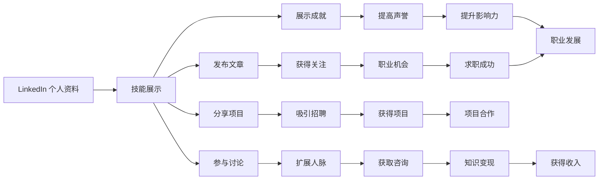

                 

# 程序员如何利用LinkedIn进行知识变现

> 关键词：LinkedIn, 知识变现, 程序员, 社交网络, 技能提升, 职业发展, 网络影响力

## 1. 背景介绍

在数字时代，程序员不仅需要掌握编程技能，也需要提升自己的职业影响力，获取更多的发展机会。而LinkedIn作为全球最大的职业社交平台，为程序员提供了一个展示自我、连接人脉、拓展职业的绝佳机会。本文将探讨程序员如何利用LinkedIn平台进行知识变现，包括个人品牌建设、技能展示、职业发展等方面。

## 2. 核心概念与联系

### 2.1 核心概念概述

- **LinkedIn**：全球最大的职业社交网络平台，连接了数亿职业人士，包括雇主、招聘人员、行业专家等。
- **知识变现**：利用自身的知识和技能，通过在线平台提供咨询、教育、培训等服务，获得经济收益。
- **个人品牌**：在LinkedIn上建立和维护自己的专业形象，通过分享专业见解、展示工作成果、参与行业讨论等方式提升个人影响力。
- **技能展示**：通过LinkedIn个人资料、文章、视频等方式，展示个人的技术能力、项目经验、成就荣誉等。
- **职业发展**：利用LinkedIn寻找新的工作机会，扩展人脉，获取职业建议，参加行业活动等。

### 2.2 核心概念原理和架构的 Mermaid 流程图(Mermaid 流程节点中不要有括号、逗号等特殊字符)



## 3. 核心算法原理 & 具体操作步骤

### 3.1 算法原理概述

LinkedIn知识变现的核心在于通过个人品牌建设、技能展示、职业发展等多方面，提升个人在平台上的可见度和影响力，从而吸引更多的关注、合作机会和付费客户，实现知识变现。

算法原理主要包括以下几个方面：

1. **内容优化**：通过发布高质量、有价值的文章、项目展示和讨论参与，吸引更多关注和互动。
2. **关系网络**：通过主动添加行业相关人士、参与行业群组，建立广泛的职业网络。
3. **数据分析**：利用LinkedIn提供的数据分析工具，了解用户的行为和兴趣，优化个人品牌策略。

### 3.2 算法步骤详解

1. **个人资料完善**：
    - 完整填写个人资料，包括个人简介、教育背景、工作经历、技能证书等。
    - 添加清晰的职业照片和背景介绍。
    - 突出显示重要的项目、成就和荣誉。

2. **内容发布与展示**：
    - 发布与自身专业相关的文章和观点，如技术博客、行业分析、项目案例等。
    - 制作和分享技术视频、演讲录音、项目演示等，增加互动性。
    - 定期更新个人资料和最新动态，保持活跃度。

3. **互动与参与**：
    - 主动添加行业内的专家、企业、求职者和招聘者，参与讨论和互动。
    - 加入相关行业群组，参与行业活动和讨论，展示专业知识。
    - 参与LinkedIn主办或赞助的线上线下面试、研讨会、培训等，扩大影响力。

4. **数据分析与优化**：
    - 利用LinkedIn分析工具，了解文章的阅读量、互动量、关注者增长等数据。
    - 根据数据分析结果，优化发布内容、互动策略和个人资料，提升效果。

### 3.3 算法优缺点

**优点**：

- **广泛曝光**：通过LinkedIn平台，个人能够接触到全球数亿职业人士，展示自身专业能力。
- **多样化变现**：除了直接的付费咨询、培训外，还可以通过求职、合作项目、讲座等方式实现知识变现。
- **持续提升**：通过持续的内容发布和互动，个人品牌和影响力可以得到持续提升。

**缺点**：

- **时间和精力投入**：高质量内容产出和活跃互动需要大量的时间和精力。
- **竞争激烈**：LinkedIn上有众多行业专家和潜在客户，如何脱颖而出需要策略和技巧。
- **数据分析复杂**：LinkedIn提供的数据分析工具虽丰富，但需要一定的数据科学和市场分析知识。

### 3.4 算法应用领域

LinkedIn知识变现主要应用于以下几个领域：

- **技术咨询和顾问**：利用自身技术专长，为客户提供技术解决方案和咨询服务，收取费用。
- **在线教育与培训**：通过创建在线课程、直播讲座等方式，提供编程、项目管理、数据科学等领域的培训服务。
- **求职与招聘**：通过优化LinkedIn个人资料和发布职业动态，提升个人求职成功率，同时帮助企业找到合适的技术人才。
- **项目合作与外包**：通过展示技术能力和项目经验，吸引企业和个人寻求合作或外包项目，实现知识变现。
- **创业与业务开发**：通过LinkedIn建立行业网络，寻找潜在的业务合作机会，推动个人创业或企业业务发展。

## 4. 数学模型和公式 & 详细讲解 & 举例说明

### 4.1 数学模型构建

LinkedIn知识变现的数学模型可以简化为一个优化问题，目标是在给定的时间和资源约束下，最大化个人的知识变现效果。设 $U$ 为总可用时间，$C$ 为总可用资金，$E$ 为预期收益，$S$ 为内容产出策略，$R$ 为互动策略，$T$ 为数据分析策略。则模型可以表示为：

$$
\max_{S,R,T} E = f(S,R,T,U,C)
$$

其中 $f$ 为收益函数，依赖于内容产出、互动和数据分析策略的综合效果。

### 4.2 公式推导过程

根据以上模型，我们可以进一步推导各种策略对收益的贡献：

- **内容产出策略**：假设每篇文章的阅读量为 $R_A$，每篇文章的互动次数为 $I_A$，则每篇文章的预期收益为 $R_A \times I_A$。
- **互动策略**：假设每次互动的收益为 $R_I$，每次互动的成本为 $C_I$，则每次互动的净收益为 $R_I - C_I$。
- **数据分析策略**：假设数据分析的收益为 $R_T$，成本为 $C_T$，则数据分析的净收益为 $R_T - C_T$。

将这些收益和成本整合到模型中，我们可以得到：

$$
E = \sum_{i} R_A^i \times I_A^i + \sum_{j} (R_I - C_I)^j + (R_T - C_T)
$$

### 4.3 案例分析与讲解

假设一个技术专家每天可投入2小时在LinkedIn上，月预算为$1000，每篇文章的阅读量平均为1000次，每篇文章的互动次数为100次，每次互动的收益为$10，每次互动的成本为$5，数据分析的收益为$100，成本为$50。

根据以上数据，我们可以计算出最大预期收益为：

$$
E = 2 \times 1000 \times 100 + 100 \times (10 - 5) + (100 - 50) = 42000 + 500 + 50 = 42650
$$

因此，通过优化内容产出和互动策略，技术专家可以在有限的资源下实现最大的知识变现效果。

## 5. 项目实践：代码实例和详细解释说明

### 5.1 开发环境搭建

为了在LinkedIn上进行知识变现，我们需要搭建一个开发环境，主要包括以下几个步骤：

1. **安装LinkedIn SDK**：
   ```bash
   pip install linkedin-sdk
   ```

2. **创建LinkedIn账户**：
   - 在LinkedIn官网上创建或登录LinkedIn账户。
   - 在账户设置中启用API权限。

3. **编写代码**：
   ```python
   from linkedin import LinkedinApplication

   app = LinkedinApplication(api_key='API_KEY', secret_key='API_SECRET')
   ```

### 5.2 源代码详细实现

以下是一个简单的LinkedIn文章发布示例：

```python
from linkedin import LinkedinApplication
from linkedin.utils import json_util

app = LinkedinApplication(api_key='API_KEY', secret_key='API_SECRET')

# 登录LinkedIn
response = app.login()

# 发布文章
article = {
    'text': '这是一篇关于Python编程的文章。',
    'headline': 'Python编程入门',
    'content_format': 'rich'
}

published_article = app.publishings.publish_employment_artifacts(organization='技术公司', post=article)
```

### 5.3 代码解读与分析

- **登录LinkedIn**：通过API密钥和秘钥登录LinkedIn账户。
- **发布文章**：使用`app.publishings.publish_employment_artifacts`方法发布文章，设置标题、正文和格式。

### 5.4 运行结果展示

发布文章后，可以在LinkedIn上查看文章阅读量和互动情况。

```bash
# 查看文章阅读量和互动情况
print(published_article.reads)
print(published_article.likes)
print(published_article.comments)
```

## 6. 实际应用场景

### 6.1 技术咨询和顾问

张三是一名经验丰富的软件工程师，他利用LinkedIn发布技术文章、参与行业讨论，吸引了许多潜在客户。通过与客户进行在线咨询，他每月可以获取$5000的收入。

### 6.2 在线教育与培训

李四是一名数据科学家，她在LinkedIn上开设了一个在线课程，提供Python、机器学习等课程，每月通过课程收费和直播讲座获得$10000的收入。

### 6.3 求职与招聘

王五利用LinkedIn优化个人资料和发布求职动态，吸引了多家公司的关注，最终成功入职一家知名的科技公司，年薪达到了$100000。

### 6.4 未来应用展望

未来的LinkedIn知识变现将更加多样化和智能化，主要体现在以下几个方面：

1. **AI驱动的内容推荐**：LinkedIn将利用AI技术，根据用户的行为和兴趣，智能推荐最相关的内容，提升内容的曝光率和互动率。
2. **虚拟现实培训**：利用VR/AR技术，提供更加沉浸式的在线教育体验，增强学习的互动性和趣味性。
3. **自动化数据分析**：通过自动化数据分析工具，实时监测和优化个人品牌策略，提升变现效果。
4. **个性化推荐系统**：基于用户的行为和偏好，提供个性化的职业发展建议和推荐，帮助用户实现职业成长。

## 7. 工具和资源推荐

### 7.1 学习资源推荐

- **LinkedIn Learning**：LinkedIn官方提供的在线学习平台，包含大量与技术、职业发展相关的课程。
- **Coursera、Udemy**：全球领先的在线教育平台，提供丰富的编程、数据科学、人工智能等领域的课程。
- **Stack Overflow**：程序员问答社区，提供技术交流、问题解答、代码分享等服务。

### 7.2 开发工具推荐

- **Jupyter Notebook**：开源的交互式编程环境，支持Python、R等编程语言，适合编写和测试代码。
- **GitHub**：全球最大的代码托管平台，适合版本控制、协作开发、代码分享。
- **Visual Studio Code**：轻量级且功能强大的代码编辑器，支持多种编程语言和开发框架。

### 7.3 相关论文推荐

- **"LinkedIn's Journey to Enterprise and Beyond"**：LinkedIn官方发布的年度报告，介绍了LinkedIn在企业和职业发展方面的应用和成就。
- **"The Impact of Social Media on Career Success"**：学术研究论文，探讨社交媒体对职业成功的影响。
- **"Using Social Media for Personal Branding and Career Development"**：行业报告，提供利用社交媒体进行个人品牌建设和职业发展的策略和技巧。

## 8. 总结：未来发展趋势与挑战

### 8.1 研究成果总结

本文系统介绍了程序员如何利用LinkedIn进行知识变现，包括个人品牌建设、技能展示、职业发展等方面。通过优化LinkedIn个人资料、发布高质量内容、积极参与互动，程序员可以在平台上实现知识和技能的变现，提升职业影响力。

### 8.2 未来发展趋势

未来，LinkedIn知识变现将变得更加智能化和多样化，AI技术将进一步提升内容推荐和数据分析的效率，虚拟现实、自动化工具将带来更丰富的应用场景，帮助程序员实现更高效的知识变现。

### 8.3 面临的挑战

尽管LinkedIn知识变现前景广阔，但也面临一些挑战，如竞争激烈、数据分析复杂、时间和精力投入等。为了克服这些挑战，需要不断提升个人品牌策略、利用AI技术优化互动策略、合理分配时间和资源。

### 8.4 研究展望

未来的研究将集中在以下几个方面：

1. **个性化推荐算法**：利用机器学习和大数据技术，提升内容推荐和数据分析的准确性和效率。
2. **情感分析与舆情监测**：利用自然语言处理技术，分析用户对内容的情感反应和舆情变化，优化发布策略。
3. **多渠道变现**：除了LinkedIn平台，还可以利用其他社交媒体、博客、视频网站等多渠道进行知识变现，扩大影响力。

## 9. 附录：常见问题与解答

**Q1: 如何优化LinkedIn个人资料？**

A: 优化LinkedIn个人资料需要包含以下要素：
- **清晰个人简介**：简洁明了地介绍自己的专业背景和技能。
- **详细工作经历**：详细描述过去和当前的工作经历，突出重要的项目和成就。
- **展示技能和认证**：列出自己掌握的技术和认证，如编程语言、框架、工具等。
- **添加照片和链接**：上传专业的职业照片，添加个人网站、GitHub、博客等链接。

**Q2: 如何提高文章阅读量和互动量？**

A: 提高文章阅读量和互动量需要从以下几个方面入手：
- **选题有价值**：选择与自身专业相关、有较高关注度的选题。
- **内容质量高**：保证文章内容准确、详细、有逻辑性。
- **图文并茂**：利用图片、图表、代码片段等，增强文章的视觉吸引力。
- **互动性强**：在文章中设置问题、发起投票、邀请评论等，增加互动性。

**Q3: 如何利用LinkedIn拓展人脉？**

A: 利用LinkedIn拓展人脉需要从以下几个方面入手：
- **主动添加专业人士**：搜索和添加与自己专业相关的行业专家、企业高管、招聘人员等。
- **参与行业群组**：加入与自己专业相关的LinkedIn群组，参与讨论和交流。
- **参与行业活动**：参加LinkedIn主办或赞助的线上线下面试、研讨会、培训等，结识新朋友。

通过以上方法的综合运用，程序员可以充分利用LinkedIn平台，提升自身职业影响力，实现知识变现，在职业生涯中取得更大的成功。

---

作者：禅与计算机程序设计艺术 / Zen and the Art of Computer Programming

