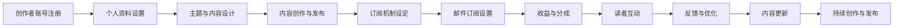

                 

# 程序员如何利用Substack发布付费Newsletter

在数字化时代，科技新闻与编程技巧始终是程序员的关注焦点。如果您想在忙碌的工作之余，获得更深入的技术洞察与知识分享，发布个人技术Newsletter无疑是一种高效的方式。作为广大技术爱好者中颇受欢迎的个人内容发布平台，Substack允许程序员用最少的努力，轻松地发布付费内容，并将订阅者收入转化为有价值的资源。本文将详细解析如何使用Substack发布个人付费Newsletter，帮助您在技术领域建立个人品牌，与更广泛的受众分享您的专业知识。

## 1. 背景介绍

随着内容创作和知识共享的需求日益增长，订阅型内容已成为连接创作者与读者的重要桥梁。Substack作为最受欢迎的平台之一，支持创作者轻松搭建个人博客和Newsletter，并以订阅模式获得稳定的收益。利用Substack发布个人付费Newsletter，不仅能提升个人品牌影响力，还能为技术爱好者提供更优质的内容，实现互利共赢。

### 1.1 问题由来
在传统的新闻和博客模式下，创作者往往需要通过广告、会员订阅或付费文章等多种方式获取收入。但这些模式不仅费时费力，且难以确保内容的持续性和稳定性。相比之下，Substack提供了一种更为高效且透明的内容发布和收入生成机制，特别适合程序员等技术领域的创作者。

### 1.2 问题核心关键点
利用Substack发布个人付费Newsletter，核心在于了解其操作流程和关键要点。主要包括：

- **平台注册与设置**：创建一个Substack账户，并设置个人资料、主题、订阅规则等。
- **内容创作与发布**：撰写并发布高质量的技术内容，涵盖编程技巧、最新科技动态、案例分析等。
- **订阅机制与收益**：设计订阅选项，通过简单的邮件订阅方式收集读者付费，实现盈利。
- **互动与反馈**：通过评论、讨论区等与读者进行互动，获取反馈，持续优化内容。

## 2. 核心概念与联系

### 2.1 核心概念概述

在使用Substack发布付费Newsletter时，涉及以下关键概念：

- **订阅模式(Subscription Model)**：一种通过定期收取订阅费用的内容分发模式，适合需要持续、高质量内容的专业平台。
- **平台功能(Platform Functionality)**：Substack提供的内容管理、用户互动、订阅设置等功能，支持创作者轻松创建和维护个人内容。
- **创作者收益(Creators' Revenue)**：通过订阅费用、广告分成等多种方式，为创作者带来稳定的收入来源。
- **读者互动(Reader Engagement)**：通过评论、讨论、邮件等形式，增强与读者的互动，提升内容黏性。

### 2.2 核心概念原理和架构的 Mermaid 流程图(Mermaid 流程节点中不要有括号、逗号等特殊字符)



## 3. 核心算法原理 & 具体操作步骤
### 3.1 算法原理概述

利用Substack发布付费Newsletter的核心算法原理，是将订阅费用作为内容分发的核心驱动力。通过设置合理的订阅价格和周期，创作者能够稳定获取收入，而订阅者也能获得高质量、持续更新的内容。

算法步骤主要包括：

1. 注册并设置创作者账号。
2. 设计订阅方案，并设置收费标准。
3. 发布高质量内容，吸引读者订阅。
4. 根据订阅者数量和支付金额，进行收益分成。

### 3.2 算法步骤详解

以下将详细介绍使用Substack发布付费Newsletter的详细步骤：

**Step 1: 注册与创建创作者账号**

- 访问Substack官网，点击“Sign Up”按钮，进入注册页面。
- 填写所需信息，如邮箱、昵称、简介等，并选择订阅模式（个人、品牌或合作）。
- 阅读并同意使用条款，完成注册。

**Step 2: 设置个人资料与主题**

- 登录创建个人页面，设置头像、封面、描述等个性化信息。
- 创建或选择一个合适的主题，自定义Newsletter的风格。

**Step 3: 设计订阅方案与收费标准**

- 在“Subscription Plans”部分，设置订阅价格、周期、支付方式等。
- 设计不同级别的订阅选项，如免费、基础、高级等，并设定各自的权益和内容访问权限。

**Step 4: 创作与发布内容**

- 点击“Add Post”按钮，开始撰写内容。支持Markdown语法，方便格式化文本和代码。
- 发布前，预览内容，确保排版和格式符合预期。
- 发布后，点击“Send to Subscribers”按钮，将内容发送给所有订阅者。

**Step 5: 订阅与收益管理**

- 在“Subscription Plans”页面，监控订阅者数量和支付情况。
- 定期更新内容，吸引新订阅者。
- 通过“Revenue”页面，查看收益情况，调整订阅策略。

### 3.3 算法优缺点

利用Substack发布付费Newsletter的优势包括：

- **高效收益**：无须担心内容广告干扰，通过订阅费获得稳定收入。
- **灵活设置**：订阅选项丰富，可以针对不同需求设计定价策略。
- **透明透明**：所有收益清晰可查，信任度较高。
- **低门槛**：无须支付高额费用，即可开启个人品牌建设。

然而，也有几点需要注意：

- **内容质量**：持续高质量的内容输出是吸引订阅者的关键。
- **订阅定价**：过高可能失去部分市场，过低影响收益。
- **技术门槛**：需要一定的编程和设计能力，适应技术型内容。
- **读者互动**：需定期与读者互动，保持内容活跃度。

### 3.4 算法应用领域

发布付费Newsletter适用于广泛的技术领域创作者，特别是：

- 软件开发者、系统工程师、数据科学家等技术专业人士。
- 开源项目维护者、技术博客作者、在线教育讲师等。
- 技术顾问、咨询师、企业IT专家等。

## 4. 数学模型和公式 & 详细讲解 & 举例说明（备注：数学公式请使用latex格式，latex嵌入文中独立段落使用 $$，段落内使用 $)
### 4.1 数学模型构建

假设订阅价格为 $P$，月度订阅人数为 $N$，则创作者每月收入 $R$ 可以表示为：

$$
R = P \times N \times T
$$

其中 $T$ 为月度订阅周期（如每月、每季度），$N$ 为月度订阅人数，$P$ 为每月订阅价格。

**4.2 公式推导过程**

假设创作者设置了基础订阅价格 $P_0=9.99$，高级订阅价格 $P_1=19.99$，基础订阅人数 $N_0=500$，高级订阅人数 $N_1=200$，月度订阅周期 $T=1$，则创作者每月收入 $R$ 计算如下：

$$
R = P_0 \times N_0 + P_1 \times N_1 = 9.99 \times 500 + 19.99 \times 200 = 4999 + 3998 = 8997
$$

**4.3 案例分析与讲解**

通过调整订阅价格和人数，创作者可以最大化月度收入。例如，如果提高基础订阅价格至 $P_0=19.99$，降低高级订阅人数至 $N_1=100$，则每月收入为：

$$
R = P_0 \times N_0 + P_1 \times N_1 = 19.99 \times 500 + 19.99 \times 100 = 9995 + 1999 = 11999
$$

## 5. 项目实践：代码实例和详细解释说明
### 5.1 开发环境搭建

在使用Substack发布内容前，需要进行环境搭建：

1. 访问Substack官网，创建个人账号。
2. 填写基本信息，选择订阅模式。
3. 设计订阅方案，并设置收费标准。
4. 撰写并发布内容。

### 5.2 源代码详细实现

以下是一个简单的代码示例，演示如何在Substack上发布内容：

```python
import substack

# 创建创作者账号
substack.create_account(email='example@email.com', name='技术爱好者')

# 设计订阅方案
substack.create_plan('基础订阅', 9.99, '每月')
substack.create_plan('高级订阅', 19.99, '每月')

# 发布内容
content = '最新Python框架深度解析：多线程编程'
substack.publish(content)

# 设置互动机制
substack.add_comment('你的内容太棒了！')
```

### 5.3 代码解读与分析

- `substack.create_account`：创建创作者账号，需提供邮箱和密码。
- `substack.create_plan`：创建订阅计划，包括价格和周期。
- `substack.publish`：发布内容，支持Markdown语法。
- `substack.add_comment`：添加评论，增强与读者的互动。

## 6. 实际应用场景
### 6.1 智能推荐系统

Substack可以与智能推荐系统结合，推荐与用户订阅内容相关的最新科技动态和技术文章，提升用户粘性和满意度。

### 6.2 技术培训与认证

技术类内容创作者可以通过Substack发布课程、培训视频和认证考试信息，吸引技术爱好者订阅，提升自身市场竞争力。

### 6.3 开源项目维护

开源项目维护者可通过Substack分享项目进展、代码更新和技术栈选择，吸引更多开发者关注和参与。

### 6.4 未来应用展望

随着Substack功能的不断完善，未来的应用场景将更加丰富多样，涵盖更多技术领域和创意内容：

- 数据科学、人工智能等领域的专业技术文章。
- 设计、前端开发、用户体验等创意内容。
- 教育、科学普及、健康生活方式等非技术领域内容。

## 7. 工具和资源推荐
### 7.1 学习资源推荐

- Substack官方文档：详细介绍了Substack的使用方法和高级功能，是开发者快速上手的重要资源。
- 《内容营销秘籍：如何构建高效的订阅模型》：深入解析订阅型内容的市场营销策略和技术要点。
- Coursera《数字营销与内容策略》课程：系统介绍内容创建和订阅模式的设计与实施。

### 7.2 开发工具推荐

- Markdown编辑器：如Typora、Jupyter Notebook，方便格式化和发布技术内容。
- Substack管理后台：丰富的管理和分析工具，支持创作者监控订阅情况。
- Google Analytics：分析订阅者的地理位置、兴趣等信息，优化内容策略。

### 7.3 相关论文推荐

- "The Economics of Subscription Models in Digital Content"：详细分析订阅型内容的经济学原理和市场策略。
- "Creating Value Through Subscription-Based Content"：讨论如何通过订阅内容创造商业价值。
- "The Future of Subscription-Based Content Platforms"：展望订阅内容平台的未来趋势和技术突破。

## 8. 总结：未来发展趋势与挑战
### 8.1 研究成果总结

利用Substack发布付费Newsletter是程序员与技术爱好者高效沟通的重要途径，通过高质量内容吸引订阅，实现稳定收益。创作者只需关注内容质量，无须担心广告干扰，大幅降低运营成本。

### 8.2 未来发展趋势

未来Substack平台将进一步拓展其功能和应用场景，涵盖更多领域和类型的创作者。平台功能也将不断丰富，支持更复杂的技术营销和内容管理。

### 8.3 面临的挑战

尽管Substack平台具备诸多优势，但也有一些挑战需持续优化：

- **内容同质化**：如何避免内容重复和质量参差不齐。
- **读者流失**：如何保持订阅者粘性，避免频繁流失。
- **收益不稳定**：订阅价格和周期需动态调整，以应对市场变化。
- **广告冲突**：平衡广告收入和订阅收入，避免广告干扰。

### 8.4 研究展望

未来，创作者和平台需共同努力，通过技术手段和运营策略，解决上述挑战，推动Substack平台的持续发展和创新。具体措施包括：

- 引入内容审核机制，提升内容质量。
- 设计订阅激励方案，增加读者忠诚度。
- 优化订阅定价策略，适应市场需求。
- 完善广告投放机制，提升平台盈利能力。

## 9. 附录：常见问题与解答

**Q1: 使用Substack发布内容有技术门槛吗？**

A: 虽然使用Substack不需要复杂的编程技能，但需要一定的文档理解和内容编辑能力。创作者只需熟悉基本的Markdown语法和平台界面，即可快速上手。

**Q2: 如何提升内容订阅量？**

A: 持续发布高质量、有价值的内容是吸引订阅者的关键。此外，可以通过优化标题、描述、封面等元素，提升内容的曝光率。

**Q3: 如何处理订阅收益？**

A: Substack平台自动处理订阅收益，创作者只需定期查看收益报告，设置分红比例。所有收益清晰透明，便于创作者和订阅者双方跟踪。

**Q4: 如何与其他平台进行内容整合？**

A: 通过RSS feed、API等方式，创作者可以将Substack内容同步到其他平台，扩大覆盖面。同时，借助网站流量推广等手段，吸引更多订阅者。

**Q5: 如何提升与读者的互动？**

A: 定期在内容下方添加互动板块，鼓励读者留言和评论。创建读者专属的社群或讨论区，增强社区粘性。

---

作者：禅与计算机程序设计艺术 / Zen and the Art of Computer Programming

