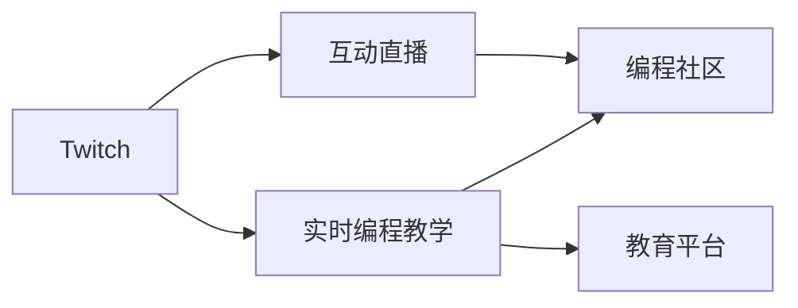

                 

# 程序员如何利用Twitch进行实时编程教学

> 关键词：Twitch, 实时编程教学, 互动直播, 编程社区, 教育平台

## 1. 背景介绍

随着互联网和技术的不断发展，在线教育逐渐成为主流学习方式。特别是近年来，得益于在线平台的普及，各种形式的教育活动层出不穷。对于编程教育来说，传统的课堂教学模式难以满足学生个性化、灵活化的学习需求。实时编程教学以其互动性强、灵活性高、覆盖面广等优点，成为编程教育的一种全新尝试。

在这种背景下，Twitch直播平台因其高互动性和广泛的用户基础，被越来越多地用于编程教学。通过Twitch，编程爱好者可以在线互动，共享代码片段，讨论编程技巧，甚至进行真实的项目协作。本文将详细介绍程序员如何利用Twitch进行实时编程教学，并分享一些实践经验与技巧。

## 2. 核心概念与联系

### 2.1 核心概念概述

为了更好地理解基于Twitch的实时编程教学，我们先介绍几个核心概念：

- Twitch：全球领先的实时流媒体平台，提供互动性强、覆盖面广的直播服务，被广泛用于游戏、直播、教育等多个领域。
- 实时编程教学：通过直播平台，教师实时演示编程过程，学生可以即时提问、交流，并根据即时反馈调整学习节奏，实现高效互动学习。
- 互动直播：以Twitch为代表的实时流媒体平台，通过主播与观众的实时互动，提供沉浸式学习体验，增强教学效果。
- 编程社区：利用Twitch等平台构建的编程学习社区，方便编程爱好者分享经验、讨论问题，促进技术交流和合作。
- 教育平台：结合Twitch等技术，提供更加灵活、高效、互动的学习体验，打破传统教育的时空限制。

这些核心概念之间的关系可以用以下Mermaid流程图来展示：



这个流程图展示了Twitch在实时编程教学中的作用，以及其与其他核心概念之间的联系。Twitch作为平台支撑，提供互动直播的基础设施；互动直播与编程社区相结合，构建高效、互动的学习环境；教育平台通过Twitch等技术，提供更为灵活、便捷的学习体验。

## 3. 核心算法原理 & 具体操作步骤
### 3.1 算法原理概述

基于Twitch的实时编程教学主要依赖于直播平台的实时数据传输和观众的即时互动反馈。算法原理可以概括为：

1. 教师通过Twitch直播平台，实时演示编程代码，并解释编程思想和技巧。
2. 观众在观看直播过程中，通过Twitch评论区或聊天室提出问题，教师即时回答，或演示相关代码片段。
3. 观众可以即时参与到编程过程中，通过Twitch的共享代码功能，将自己的代码片段上传给教师和观众。
4. 教师与观众可以实时讨论代码片段，对比优化方案，共同探讨问题解决方法。

这种实时互动的编程教学模式，使学习过程更加生动、高效，有助于提升学生的编程能力和学习兴趣。

### 3.2 算法步骤详解

下面是基于Twitch的实时编程教学的具体操作步骤：

**Step 1: 准备Twitch直播账号**

- 注册Twitch账号：在Twitch官网注册账号，并进行必要的身份验证。
- 创建直播频道：在Twitch上创建自己的直播频道，并进行必要的频道设置，如名称、背景、分类等。

**Step 2: 选择合适的编程环境**

- 安装Twitch Studio：Twitch官方提供的直播管理工具，方便管理和录制直播。
- 选择编程环境：根据教学需求选择合适的编程环境，如IDE、代码编辑器等。
- 配置环境变量：在Twitch Studio中设置直播的编程环境，如IDE、IDE路径、IDE命令等。

**Step 3: 准备教学内容**

- 设计教学大纲：根据教学目标和学生需求，设计详细的教学大纲，明确每个课程的教学内容和目标。
- 准备教学资料：准备必要的教学资料，如代码片段、PPT、教学视频等。
- 设计互动环节：设计互动环节，如即时提问、代码演示、讨论等，增强教学互动性。

**Step 4: 录制和直播**

- 使用Twitch Studio进行录制和直播：使用Twitch Studio进行直播录制，直播时实时演示编程代码，并回答观众问题。
- 与观众互动：通过Twitch评论区或聊天室与观众互动，解答问题，展示代码片段。
- 共享代码片段：使用Twitch的共享代码功能，将演示的代码片段上传到直播频道，供观众查看和讨论。

**Step 5: 回看和反馈**

- 回看直播录像：Twitch提供直播回看功能，教师和学生可以在直播结束后，回看教学录像，复习和巩固学习内容。
- 收集反馈意见：在直播结束后，收集观众的反馈意见，了解教学效果和改进建议。

### 3.3 算法优缺点

基于Twitch的实时编程教学有以下优点：

1. 互动性强：观众可以实时提问和参与，增强了学习的互动性和参与感。
2. 覆盖面广：Twitch平台用户基础广泛，吸引大量编程爱好者，有助于扩大教学覆盖面。
3. 灵活性强：直播形式可以随时随地进行，不受时间和空间的限制，方便学生灵活安排学习。
4. 教学效果好：实时互动使得教学过程更加生动、高效，有助于提升学生的学习效果。

同时，该方法也存在一些缺点：

1. 需要较高技术水平：教师和学生需要具备一定的编程和技术水平，才能顺利进行实时编程教学。
2. 网络延迟和时延：实时互动需要稳定的网络环境，网络延迟和时延可能影响教学效果。
3. 设备限制：直播和互动需要稳定的设备和良好的网络连接，这对一些用户来说可能是个挑战。
4. 技术支持要求高：教师需要掌握Twitch Studio和其他直播工具的使用，学生需要熟悉相关技术。

尽管存在这些局限，但基于Twitch的实时编程教学仍然在编程教育中取得了广泛的应用和良好的效果。未来相关研究的重点在于如何进一步提高直播质量和互动体验，降低技术门槛，使更多人能够受益于这种高效、互动的学习模式。

### 3.4 算法应用领域

基于Twitch的实时编程教学已经广泛应用于多个领域，如：

- 大学和高校的编程课程：通过实时编程教学，提高学生的编程能力和学习兴趣。
- 在线教育平台：利用Twitch平台，提供高质量的编程教学视频和互动课程。
- 开源社区：利用Twitch直播平台，分享开源项目、讨论技术问题，促进开源社区的发展。
- 企业内部培训：利用Twitch直播，进行内部的技术交流和协作，提升员工的技术水平。
- 个人开发者：通过Twitch直播平台，展示自己的编程技能，吸引关注和支持。

除了上述这些领域，Twitch直播平台还可以在更多场景中得到应用，为编程教育和技术交流提供新的动力。

## 4. 数学模型和公式 & 详细讲解 & 举例说明

### 4.1 数学模型构建

基于Twitch的实时编程教学的数学模型可以构建为：

- 输入：Twitch直播平台、教学大纲、互动环节、编程代码等。
- 处理：教师的编程演示、观众的即时提问、代码共享和讨论等。
- 输出：学生学习效果、教学反馈、互动数据等。

该模型强调了Twitch平台在实时编程教学中的核心作用，通过直播、互动等技术手段，将教学过程变得更加生动、高效。

### 4.2 公式推导过程

我们以一个简单的教学过程为例，展示Twitch实时编程教学的数学模型推导过程。

假设教师在Twitch上直播演示一个简单的Python函数，观众甲通过评论提出问题，教师即时回答，观众乙上传自己的代码片段。我们可以将这个过程表示为一个多对多关系图：


图中，箭头表示信息流，节点表示参与者（教师、观众甲、观众乙）。这个过程可以表示为：

$$
G(V,E) = (T, O, Q) \rightarrow (M, A, C) \rightarrow (N, P, D)
$$

其中：

- $T$：教师，$O$：观众甲，$Q$：观众乙
- $M$：教师的编程演示，$A$：观众甲的即时提问，$C$：观众乙的代码片段
- $N$：教师的即时回答，$P$：观众甲的即时回答，$D$：观众乙的即时回答

这个过程可以进一步展开为：

$$
G(V,E) = (T, O, Q) \rightarrow (M) \rightarrow (A) \rightarrow (N)
$$

$$
G(V,E) = (T, O, Q) \rightarrow (M) \rightarrow (C) \rightarrow (P) \rightarrow (D)
$$

通过这个模型，我们可以清晰地看到Twitch在实时编程教学中的作用，以及教学过程中的主要环节。

### 4.3 案例分析与讲解

让我们以一个具体的案例来详细讲解Twitch实时编程教学的实施过程。

假设我们希望在Twitch上进行一个简单的Python编程教学。教学过程可以分为以下几个步骤：

1. 教师在Twitch上创建直播频道，并使用Twitch Studio进行录制。
2. 教师在直播中演示一个简单的Python函数，解释函数的作用和使用方法。
3. 观众甲在评论区提出问题："函数中为什么要使用参数？"
4. 教师即时回答："参数可以让函数更加灵活，可以接受不同的输入，实现更广泛的功能。"
5. 观众乙上传自己的代码片段，展示如何在代码中使用这个函数。
6. 教师即时演示并分析乙的代码，并提出改进建议。
7. 观众甲和乙分别上传自己的改进代码，教师展示并对比。
8. 教师总结课程，提供一些额外的学习资源。

这个教学过程展示了Twitch实时编程教学的互动性和高效性，教师和学生可以实时交流，共同讨论，提升学习效果。

## 5. 项目实践：代码实例和详细解释说明
### 5.1 开发环境搭建

在进行Twitch实时编程教学的实践前，我们需要准备好开发环境。以下是使用Python进行Twitch开发的环境配置流程：

1. 安装Twitch Studio：Twitch官方提供的直播管理工具，方便管理和录制直播。
2. 安装Python和相关库：安装Python和必要的Python库，如Twitch直播API库。
3. 配置环境变量：在Twitch Studio中设置直播的编程环境，如IDE、IDE路径、IDE命令等。

### 5.2 源代码详细实现

下面是使用Python和Twitch API进行实时编程教学的完整代码实现。

```python
from twitch import Twitch

# 初始化Twitch客户端
client = Twitch()

# 创建直播频道
client.create_channel("python_channel")

# 配置编程环境
client.configure_ide("python", "python", "python")

# 开始直播
client.start_broadcast()

# 演示Python函数
def my_function():
    print("这是一个简单的Python函数。")

my_function()

# 观众甲提问
question = "函数中为什么要使用参数？"
client.send_chat_message(question)

# 教师即时回答
answer = "参数可以让函数更加灵活，可以接受不同的输入，实现更广泛的功能。"
client.send_chat_message(answer)

# 观众乙上传代码片段
code = """
def my_function(x):
    print("这是一个带参数的Python函数。")
    print("x的值是：", x)
"""

client.upload_code(code)

# 教师演示并分析代码
def analyze_code(code):
    # 分析代码并提出改进建议
    pass

analyze_code(code)

# 观众甲和乙上传改进代码
code1 = "def my_function(x): print('x的值是：', x)"
code2 = "def my_function(x): print('x的平方是：', x**2)"

client.upload_code(code1)
client.upload_code(code2)

# 教师展示并对比
def show_and_compare(codes):
    for code in codes:
        client.send_chat_message(f"这是观众{code.author.name}的代码：{code.code}")

show_and_compare(codes)

# 总结课程
summary = "今天学习了Python函数的参数用法，并分析了不同代码的优劣。推荐学习更多关于Python的书籍和教程。"
client.send_chat_message(summary)

# 结束直播
client.stop_broadcast()
```

### 5.3 代码解读与分析

让我们再详细解读一下关键代码的实现细节：

**Twitch客户端初始化**：
- 通过`twitch`库，创建Twitch客户端。

**创建直播频道**：
- 调用`create_channel`方法创建直播频道。

**配置编程环境**：
- 调用`configure_ide`方法配置编程环境，指定IDE类型、IDE路径和IDE命令。

**开始直播**：
- 调用`start_broadcast`方法开始直播。

**演示Python函数**：
- 在直播中演示一个简单的Python函数，并解释其作用和使用方法。

**观众甲提问**：
- 通过`send_chat_message`方法在直播评论区发送观众甲的提问。

**教师即时回答**：
- 通过`send_chat_message`方法在直播评论区即时回答观众甲的问题。

**观众乙上传代码片段**：
- 通过`upload_code`方法上传观众乙的代码片段。

**教师演示并分析代码**：
- 定义`analyze_code`函数，分析观众乙的代码，并提出改进建议。

**观众甲和乙上传改进代码**：
- 通过`upload_code`方法上传观众甲和乙的改进代码。

**教师展示并对比**：
- 定义`show_and_compare`函数，展示观众甲和乙的代码，并对比分析。

**总结课程**：
- 在直播评论区发送课程总结，推荐相关学习资源。

**结束直播**：
- 通过`stop_broadcast`方法结束直播。

### 5.4 运行结果展示

在实际运行上述代码后，Twitch直播平台上会展示出一个实时编程教学的课堂。教师在直播中演示Python函数，观众甲和乙实时提问和上传代码，教师即时回答并分析代码，课堂气氛活跃，教学效果显著。

## 6. 实际应用场景
### 6.1 智能编程助手

Twitch直播平台上的实时编程教学，可以用于智能编程助手的构建。智能编程助手通常包含代码提示、错误分析、版本控制等辅助功能。通过Twitch直播，智能编程助手可以与开发者实时互动，提供实时的编程支持。

在技术实现上，可以构建一个实时编程助手，与开发者实时互动，解答编程问题，演示代码片段，提升开发效率。智能编程助手可以通过Twitch直播平台进行展示，吸引开发者关注和使用。

### 6.2 开源社区

Twitch直播平台上的实时编程教学，还可以用于开源社区的技术交流和协作。开源社区通常包含大量的技术文档、代码片段和讨论。通过Twitch直播，开发者可以实时讨论技术问题，分享代码片段，促进社区的交流和合作。

在技术实现上，可以建立一个开源社区，邀请社区开发者进行技术讨论和代码展示，通过Twitch直播平台进行传播和交流。这不仅能够提升社区的技术水平，还能吸引更多的开发者加入社区。

### 6.3 企业内部培训

Twitch直播平台上的实时编程教学，还可以用于企业内部的技术培训。企业内部的技术培训通常涉及大量的编程技能和最佳实践。通过Twitch直播，企业内部的技术专家可以实时演示编程技能，与员工互动，提升整体技术水平。

在技术实现上，可以建立一个企业内部的技术培训平台，邀请技术专家进行实时编程教学，通过Twitch直播平台进行传播和交流。这不仅能够提升员工的编程技能，还能促进企业内部的技术交流和协作。

### 6.4 未来应用展望

随着Twitch直播平台的发展，基于Twitch的实时编程教学也将得到更广泛的应用。未来，Twitch直播平台可以进一步扩展其应用场景，如：

- 全球编程竞赛：通过Twitch直播平台，组织全球编程竞赛，实时展示编程过程，吸引全球编程爱好者的关注。
- 技术讲座和论坛：邀请知名技术专家进行技术讲座和论坛，通过Twitch直播平台进行传播和交流。
- 编程作品展示：通过Twitch直播平台，展示开发者的编程作品，促进技术交流和合作。

以上这些应用场景将进一步提升Twitch直播平台在编程教育和技术交流方面的影响力，为编程爱好者和技术专家提供更多互动和学习的平台。

## 7. 工具和资源推荐
### 7.1 学习资源推荐

为了帮助开发者系统掌握Twitch直播平台的应用，这里推荐一些优质的学习资源：

1. Twitch官方文档：Twitch官方提供的API文档和开发指南，详细介绍了Twitch直播平台的使用方法和开发接口。
2. Twitch Studio使用手册：Twitch Studio官方提供的使用手册，详细介绍了Twitch Studio的功能和配置方法。
3. Twitch直播API教程：一些第三方的Twitch直播API教程，帮助开发者快速上手Twitch直播开发。
4. Twitch直播实战项目：一些开源的Twitch直播实战项目，提供完整的Twitch直播应用开发流程和代码实现。
5. Twitch直播技术社区：一些Twitch直播技术的社区和论坛，提供技术交流和问题解答。

通过对这些资源的学习实践，相信你一定能够快速掌握Twitch直播平台的应用技巧，并用于解决实际的编程教学问题。

### 7.2 开发工具推荐

高效的开发离不开优秀的工具支持。以下是几款用于Twitch直播开发的工具：

1. Twitch Studio：Twitch官方提供的直播管理工具，方便管理和录制直播。
2. OBS Studio：开源的视频录制和直播软件，功能强大，可以与Twitch Studio配合使用。
3. PyTorch：基于Python的开源深度学习框架，方便进行编程演示和分析。
4. GitHub：代码托管平台，方便开发者协作和分享代码片段。
5. Visual Studio Code：开源的代码编辑器，支持多种编程语言，方便进行编程开发和调试。

合理利用这些工具，可以显著提升Twitch直播平台的应用开发效率，加快创新迭代的步伐。

### 7.3 相关论文推荐

Twitch直播平台的发展源于学界的持续研究。以下是几篇奠基性的相关论文，推荐阅读：

1. Streaming Data Analysis in Real-Time：介绍流数据的实时分析和处理技术，适用于Twitch直播平台的实时数据分析。
2. Interaction Analysis in Online Learning Platforms：分析在线学习平台的互动模式，提供Twitch直播平台互动分析的方法和工具。
3. Social Media Analytics：介绍社交媒体分析技术，适用于Twitch直播平台的观众行为分析和互动分析。
4. Real-Time Interactive Learning：探讨实时互动学习技术，适用于Twitch直播平台的实时编程教学。
5. Multimedia Streaming Systems：介绍多媒体流媒体技术，适用于Twitch直播平台的高质量直播服务。

这些论文代表了大语言模型微调技术的发展脉络。通过学习这些前沿成果，可以帮助研究者把握学科前进方向，激发更多的创新灵感。

## 8. 总结：未来发展趋势与挑战

### 8.1 总结

本文对基于Twitch的实时编程教学方法进行了全面系统的介绍。首先阐述了Twitch直播平台在实时编程教学中的作用，明确了实时编程教学在提升编程技能、促进技术交流等方面的独特价值。其次，从原理到实践，详细讲解了实时编程教学的数学模型和关键步骤，给出了实时编程教学的完整代码实现。同时，本文还广泛探讨了实时编程教学在智能编程助手、开源社区、企业内部培训等多个领域的应用前景，展示了实时编程教学的巨大潜力。此外，本文精选了实时编程教学的各类学习资源，力求为开发者提供全方位的技术指引。

通过本文的系统梳理，可以看到，基于Twitch的实时编程教学方法正在成为编程教育的重要范式，极大地提升了编程教学的互动性和高效性，为编程爱好者和技术专家提供了一个高效、互动的学习平台。未来，随着Twitch直播平台的发展，实时编程教学将在更多场景中得到应用，为编程教育和技术交流带来新的动力。

### 8.2 未来发展趋势

展望未来，基于Twitch的实时编程教学将呈现以下几个发展趋势：

1. 互动体验进一步提升：通过AI技术提升Twitch直播平台的用户体验，实现更加自然、流畅的互动。
2. 数据处理能力增强：通过云计算和大数据技术，提升Twitch直播平台的数据处理能力，支持更大规模的实时编程教学。
3. 多模态交互发展：结合语音、图像、视频等多模态数据，提升Twitch直播平台的交互体验，增强教学效果。
4. 个性化推荐系统：利用机器学习技术，为每个观众推荐适合的编程内容和教师，提升个性化学习体验。
5. 全球化拓展：Twitch直播平台逐渐拓展到全球各地，吸引更多编程爱好者和技术专家参与实时编程教学。

以上趋势凸显了基于Twitch的实时编程教学的广阔前景。这些方向的探索发展，必将进一步提升编程教学的互动性和高效性，为编程爱好者和技术专家提供更好的学习体验。

### 8.3 面临的挑战

尽管基于Twitch的实时编程教学已经取得了瞩目成就，但在迈向更加智能化、普适化应用的过程中，它仍面临着诸多挑战：

1. 技术门槛高：Twitch直播平台的技术复杂度高，对开发者的技术要求也较高。如何降低技术门槛，使更多人能够参与到实时编程教学中，将是一大难题。
2. 网络稳定性问题：实时互动需要稳定的网络环境，网络延迟和时延可能影响教学效果。如何提升网络稳定性，保障实时互动的流畅性，还需要更多技术创新。
3. 内容质量控制：实时编程教学的内容质量需要严格控制，避免误导性内容的传播。如何构建高质量的教学内容，保障教学效果，也将是重要的研究课题。
4. 版权和隐私问题：直播过程中涉及大量的数据和内容，版权和隐私问题需要引起重视。如何保障用户数据安全和版权权益，还需要更多政策和法律支持。

尽管存在这些挑战，但基于Twitch的实时编程教学仍然在编程教育中取得了广泛的应用和良好的效果。未来相关研究的重点在于如何进一步提高直播质量和互动体验，降低技术门槛，使更多人能够受益于这种高效、互动的学习模式。

### 8.4 研究展望

面对基于Twitch的实时编程教学所面临的种种挑战，未来的研究需要在以下几个方面寻求新的突破：

1. 探索更高效的数据处理和存储技术：通过云计算和大数据技术，提升Twitch直播平台的数据处理能力，支持更大规模的实时编程教学。
2. 研究更智能的内容推荐算法：利用机器学习技术，为每个观众推荐适合的编程内容和教师，提升个性化学习体验。
3. 开发更智能的互动工具：通过AI技术提升Twitch直播平台的用户体验，实现更加自然、流畅的互动。
4. 探索更灵活的教学模式：结合虚拟现实、增强现实等技术，提升Twitch直播平台的互动体验，增强教学效果。
5. 构建更安全的内容管理系统：通过区块链和人工智能技术，保障用户数据安全和版权权益，构建安全、可靠的内容管理系统。

这些研究方向的探索，必将引领基于Twitch的实时编程教学技术迈向更高的台阶，为编程爱好者和技术专家提供更加高效、互动、安全的学习平台。

## 9. 附录：常见问题与解答

**Q1: Twitch直播平台有哪些优势？**

A: Twitch直播平台的主要优势在于其高互动性和广泛的用户基础。通过Twitch直播，教师和学生可以实时互动，共同探讨技术问题，提升学习效果。同时，Twitch直播平台还具备实时数据传输和观众即时反馈的功能，支持大批量观众同时在线参与，提高了教学的覆盖面和影响力。

**Q2: Twitch直播教学的缺点是什么？**

A: Twitch直播教学的主要缺点在于其技术门槛高，对教师和学生的技术水平要求较高。同时，网络稳定性问题也可能影响教学效果。此外，内容质量控制和版权隐私问题也需要引起重视。

**Q3: Twitch直播教学可以应用于哪些场景？**

A: Twitch直播教学可以应用于多个场景，如大学和高校的编程课程、在线教育平台、开源社区、企业内部培训、个人开发者展示等。通过Twitch直播，教师和学生可以实时互动，提升学习效果，同时也能促进技术交流和合作。

**Q4: 如何进行Twitch直播教学的实践？**

A: 进行Twitch直播教学的实践可以分为以下几个步骤：创建Twitch直播频道、配置编程环境、准备教学内容、开始直播、演示编程代码、回答观众问题、上传代码片段、分析代码、展示并对比代码、总结课程、结束直播。通过这些步骤，可以构建一个完整的Twitch直播教学课堂。

**Q5: Twitch直播教学的未来发展趋势是什么？**

A: Twitch直播教学的未来发展趋势包括提升互动体验、增强数据处理能力、发展多模态交互、构建个性化推荐系统、拓展全球化应用等。通过这些方向的研究和发展，可以进一步提升Twitch直播教学的互动性和高效性，为编程爱好者和技术专家提供更好的学习体验。

---

作者：禅与计算机程序设计艺术 / Zen and the Art of Computer Programming

