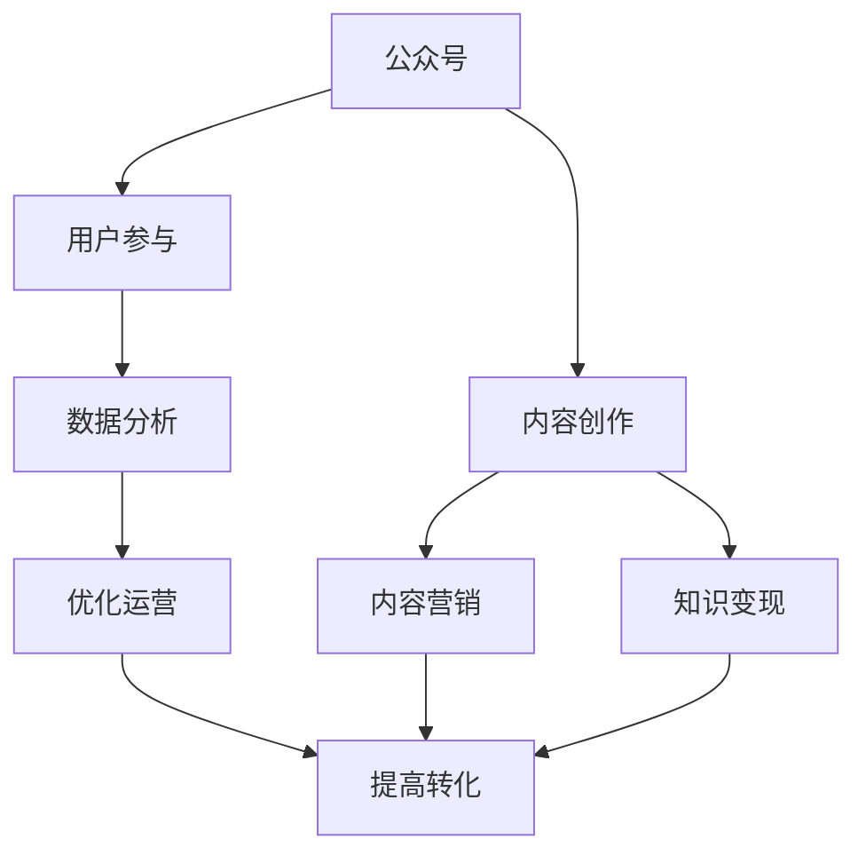

                 

# 程序员如何利用公众号进行知识变现

## 1. 背景介绍

### 1.1 问题由来

在互联网时代，技术知识的传播方式日益多样化。公众号作为一种流行的信息传播工具，已逐渐成为程序员进行知识变现的重要平台。然而，面对高度竞争的行业环境，如何通过公众号高效且精准地传播技术知识，从而实现商业变现，成为程序员面临的重要课题。

### 1.2 问题核心关键点

如何通过公众号进行有效的知识传播，并最终实现商业变现，涉及以下核心关键点：
1. **目标受众定位**：明确公众号的目标受众群体，制定相应的内容策略。
2. **内容质量保障**：产出高质量、具有实战价值的内容，增强用户粘性。
3. **变现模式探索**：探索多元化的变现方式，如广告、付费文章、课程等。
4. **社区互动管理**：建立活跃的社区互动，促进用户参与和口碑传播。
5. **数据分析优化**：利用数据分析工具优化内容策略和运营方式，提高运营效率。

## 2. 核心概念与联系

### 2.1 核心概念概述

为更好地理解如何通过公众号进行知识变现，本节将介绍几个密切相关的核心概念：

- **公众号**：一种基于微信平台的信息传播工具，通过发布文章、图文、视频等内容吸引和聚集用户。
- **知识变现**：利用技术知识进行商业变现的过程，包括内容创作、推广、转化等环节。
- **内容营销**：通过提供有价值的内容，建立品牌影响力和用户信任，从而实现商业转化。
- **用户参与**：用户通过阅读、评论、分享等方式参与内容互动，增强用户粘性和社区活跃度。
- **数据分析**：利用数据分析工具和算法，了解用户行为、优化内容策略，提升运营效果。

这些核心概念之间的逻辑关系可以通过以下Mermaid流程图来展示：



这个流程图展示了一公众号知识变现的核心概念及其之间的关系：

1. 公众号通过发布内容吸引用户。
2. 内容创作是知识变现的基础。
3. 用户参与增强了内容的传播效果。
4. 数据分析指导优化运营策略。
5. 多元化的变现模式提高了转化效率。

## 3. 核心算法原理 & 具体操作步骤

### 3.1 算法原理概述

公众号的知识变现主要基于内容营销的原理，即通过提供有价值的内容吸引用户，并在此基础上探索多种变现途径，最终实现商业转化。具体流程如下：

1. **目标受众分析**：通过调研和数据分析，确定目标受众的特征和需求，定制化内容策略。
2. **内容创作与优化**：创作高质量、实用性强的技术文章，并通过A/B测试、数据分析等方法优化内容。
3. **用户互动管理**：通过评论互动、问卷调查等方式，收集用户反馈，及时调整内容策略。
4. **多元化变现**：通过广告收入、付费文章、课程收费、品牌合作等多种方式进行变现。
5. **数据分析与优化**：利用数据分析工具，监控用户行为和运营数据，优化内容策略和运营方式。

### 3.2 算法步骤详解

下面详细介绍公众号知识变现的具体操作步骤：

**Step 1: 确定目标受众**

1. **用户画像建立**：通过问卷调查、用户分析工具等方式，了解目标受众的年龄、职业、技术水平等特征。
2. **需求分析**：调研目标受众的痛点和需求，确定他们最关心的技术话题和问题。
3. **受众定位**：根据用户画像和需求分析，制定受众定位策略，明确公众号的内容方向和风格。

**Step 2: 内容创作与优化**

1. **内容选题**：根据受众定位和需求分析，选择具有高吸引力和实用价值的内容选题。
2. **内容创作**：结合实际项目经验，撰写技术文章、视频教程等，确保内容具有深度和实战性。
3. **内容优化**：利用A/B测试、数据分析工具等方法，优化内容的标题、结构和表现形式，提高用户阅读体验。

**Step 3: 用户互动管理**

1. **互动机制建立**：通过评论互动、问答社区等方式，鼓励用户参与和反馈。
2. **用户反馈分析**：定期收集用户评论和反馈，分析用户需求和期望，及时调整内容策略。
3. **内容更新**：根据用户反馈和数据分析，持续更新和完善内容，保持公众号的活跃度。

**Step 4: 多元化变现**

1. **广告收入**：与微信广告平台合作，通过精准广告投放，获取广告收入。
2. **付费文章**：设置付费阅读功能，通过优质内容吸引用户付费阅读。
3. **课程收费**：推出系统化技术课程，通过知识付费实现变现。
4. **品牌合作**：与技术相关品牌合作，提供品牌推广和产品评测。

**Step 5: 数据分析与优化**

1. **数据监控**：利用微信数据分析工具，监控公众号的访问量、用户行为等数据。
2. **运营优化**：根据数据分析结果，优化内容发布策略、互动机制等，提升运营效果。
3. **转化率提升**：通过数据分析，优化变现途径，提高用户转化率和商业效益。

### 3.3 算法优缺点

**优点**：
1. **内容传播广**：公众号平台的用户基础庞大，内容容易扩散。
2. **互动性强**：通过评论、互动等方式，增强用户粘性。
3. **变现途径多**：通过广告、付费文章、课程等多种方式变现。
4. **数据分析便捷**：利用微信数据分析工具，快速获取运营数据，优化策略。

**缺点**：
1. **竞争激烈**：公众号数量众多，内容传播难度大。
2. **内容要求高**：高质量内容创作难度大，需要较强的技术背景和经验。
3. **用户流失率高**：部分用户难以长期保持高粘性，需要不断创新内容。
4. **广告效果不稳定**：广告收入受投放策略和受众行为影响，效果不稳定。

## 4. 数学模型和公式 & 详细讲解 & 举例说明

### 4.1 数学模型构建

为了更好地理解和分析公众号的内容传播效果和用户行为，可以构建以下数学模型：

1. **用户访问量模型**：
   $$
   U = f(C, P, A)
   $$
   其中，$U$ 表示公众号的用户访问量，$C$ 表示内容质量，$P$ 表示推广策略，$A$ 表示广告投放。

2. **用户转化率模型**：
   $$
   R = g(C, I, T)
   $$
   其中，$R$ 表示用户的转化率，$C$ 表示内容质量，$I$ 表示互动效果，$T$ 表示变现途径。

### 4.2 公式推导过程

1. **用户访问量公式推导**：
   假设内容质量 $C$ 为常数，推广策略 $P$ 和广告投放 $A$ 分别服从均值为 $\mu_P$ 和 $\mu_A$，方差为 $\sigma_P^2$ 和 $\sigma_A^2$ 的正态分布。则用户访问量 $U$ 可表示为：
   $$
   U = \mu_U + \sigma_U \times N(\mu_P, \sigma_P^2) + \sigma_U \times N(\mu_A, \sigma_A^2)
   $$
   其中，$N(\mu, \sigma^2)$ 表示均值为 $\mu$，方差为 $\sigma^2$ 的正态分布。

2. **用户转化率公式推导**：
   假设内容质量 $C$ 为常数，互动效果 $I$ 和变现途径 $T$ 分别服从均值为 $\mu_I$ 和 $\mu_T$，方差为 $\sigma_I^2$ 和 $\sigma_T^2$ 的正态分布。则用户转化率 $R$ 可表示为：
   $$
   R = \mu_R + \sigma_R \times N(\mu_I, \sigma_I^2) + \sigma_R \times N(\mu_T, \sigma_T^2)
   $$

### 4.3 案例分析与讲解

以某技术博客为例，分析其公众号的用户访问量和用户转化率：

1. **用户访问量分析**：
   假设该博客的内容质量为 $C=1$，推广策略 $P=0.8$，广告投放 $A=0.7$。通过计算，得到：
   $$
   U = 1 + 0.2 \times N(0.8, 0.2^2) + 0.2 \times N(0.7, 0.2^2)
   $$
   平均访问量为 $U=1.28$，标准差为 $\sigma_U=0.26$。

2. **用户转化率分析**：
   假设该博客的互动效果 $I=0.5$，变现途径 $T=0.6$。通过计算，得到：
   $$
   R = 0.5 + 0.1 \times N(0.5, 0.1^2) + 0.1 \times N(0.6, 0.1^2)
   $$
   平均转化率为 $R=0.55$，标准差为 $\sigma_R=0.05$。

## 5. 项目实践：代码实例和详细解释说明

### 5.1 开发环境搭建

在进行公众号知识变现的实践前，我们需要准备好开发环境。以下是使用Python进行微信公众号开发的环境配置流程：

1. 安装Python：建议使用3.8及以上版本，安装路径为 `/usr/local/bin/python3.8`。
2. 安装相关依赖：
   ```bash
   pip install wechatpy
   pip install beautifulsoup4
   ```
3. 创建公众号：在微信公众平台注册公众号，并获取相应的API密钥和令牌。

完成上述步骤后，即可在本地搭建起微信公众号开发环境。

### 5.2 源代码详细实现

下面以某技术博客为例，给出使用Python进行微信公众号开发的代码实现。

**公众号注册与认证**

```python
from wechatpy import WeChat
from wechatpy.exceptions import WeChatError

# 公众号API密钥和令牌
api_key = 'your_api_key'
access_token = 'your_access_token'

# 创建WeChat对象
wechat = WeChat(api_key=api_key, access_token=access_token)

# 获取公众号ID
公众号ID = wechat.get公众号ID()
print(f'公众号ID: {公众号ID}')
```

**内容发布与互动**

```python
from wechatpy import WeChat
from wechatpy.exceptions import WeChatError
from beautifulsoup4 import BeautifulSoup

# 公众号ID
公众号ID = 'your_公众号ID'

# 创建WeChat对象
wechat = WeChat(api_key=api_key, access_token=access_token)

# 发布文章
def publish_article(title, content):
    # 构造文章内容
    article_content = f'''
    <h1>{title}</h1>
    {content}
    '''
    # 将内容转换为HTML格式
    article_content = article_content.replace('<', '&lt;').replace('>', '&gt;')
    article_content = BeautifulSoup(article_content, 'html.parser').prettify()

    # 发送文章
    try:
        wechat.sendArticle(公众号ID, title, article_content)
    except WeChatError as e:
        print(f'发送文章失败: {e}')
```

**用户互动与反馈**

```python
from wechatpy import WeChat
from wechatpy.exceptions import WeChatError

# 公众号ID
公众号ID = 'your_公众号ID'

# 创建WeChat对象
wechat = WeChat(api_key=api_key, access_token=access_token)

# 获取互动列表
interactions = wechat.getInteractions(公众号ID)
for interaction in interactions:
    # 处理每条互动信息
    if interaction['type'] == 'comment':
        # 处理评论
        print(f'处理评论: {interaction["comment"]}')
    elif interaction['type'] == 'question':
        # 处理问答
        print(f'处理问答: {interaction["question"]}')
```

**数据分析与优化**

```python
from wechatpy import WeChat
from wechatpy.exceptions import WeChatError
from beautifulsoup4 import BeautifulSoup

# 公众号ID
公众号ID = 'your_公众号ID'

# 创建WeChat对象
wechat = WeChat(api_key=api_key, access_token=access_token)

# 获取访问量数据
access_data = wechat.getAccessData(公众号ID)
for data in access_data:
    # 处理每条访问数据
    title = data['title']
    access_count = data['access_count']
    print(f'文章标题: {title}, 访问次数: {access_count}')
```

完成上述代码后，即可在本地搭建起微信公众号开发的运行环境，并进行内容发布、用户互动和数据分析等操作。

### 5.3 代码解读与分析

让我们再详细解读一下关键代码的实现细节：

**公众号注册与认证**

- `WeChat` 类：用于创建微信公众号API对象。
- `get公众号ID` 方法：获取公众号ID，用于后续的API调用。

**内容发布与互动**

- `publish_article` 函数：用于发布文章内容。
- `sendArticle` 方法：发送文章到公众号。
- `replace` 方法：将特殊字符转义，避免HTML注入。
- `prettify` 方法：美化HTML代码，使其更易读。

**用户互动与反馈**

- `getInteractions` 方法：获取公众号的互动列表，包括评论和问答等。
- `type` 属性：互动类型，如评论、问答等。
- `comment` 属性：评论内容。
- `question` 属性：问答内容。

**数据分析与优化**

- `getAccessData` 方法：获取公众号的访问数据。
- `title` 属性：文章标题。
- `access_count` 属性：访问次数。

这些代码展示了如何使用Python进行微信公众号开发，实现了内容发布、用户互动和数据分析等功能。开发者可以根据实际需求，进行代码的定制化和优化。

## 6. 实际应用场景

### 6.1 技术博客

技术博客可以通过微信公众号进行知识传播和变现。通过发布高质量的技术文章，吸引程序员关注，并在文中插入付费文章、课程推荐等链接，实现内容变现。同时，可以通过读者互动和数据分析，优化内容策略，提升用户粘性和转化率。

### 6.2 技术社区

技术社区可以建立自己的公众号，发布技术文章、代码示例、项目分享等内容，吸引开发者关注和参与。通过广告收入、品牌合作等方式，实现商业变现。社区管理者可以通过互动数据分析，了解用户需求和反馈，优化社区内容，提升用户满意度。

### 6.3 技术培训

技术培训机构可以通过微信公众号发布培训课程、技术文章等内容，吸引学员关注和报名。通过付费文章、课程收费等方式，实现知识变现。通过互动数据分析，了解学员学习情况，优化课程内容和教学方法，提升培训效果。

### 6.4 未来应用展望

随着技术的发展，公众号的内容变现方式将更加多样化和智能化。未来，可以通过人工智能技术，如推荐系统、内容生成模型等，实现更加精准的内容推荐和个性化内容生成，提升用户体验和转化率。同时，利用大数据分析技术，深入挖掘用户行为和需求，优化运营策略，实现更高效的商业变现。

## 7. 工具和资源推荐

### 7.1 学习资源推荐

为了帮助开发者系统掌握微信公众号知识变现的理论基础和实践技巧，这里推荐一些优质的学习资源：

1. **微信公众号开发指南**：官方文档详细介绍了微信公众号的开发流程和API接口，是公众号开发的重要参考资料。
2. **微信开发者社区**：官方论坛提供丰富的开发者交流和学习资源，可以快速解决问题，获取最佳实践。
3. **微信公众号运营秘籍**：一本介绍微信公众号运营技巧和策略的书籍，帮助公众号运营者提高运营效果。
4. **数据分析与机器学习**：介绍数据分析和机器学习的基础知识和技能，为公众号的数据分析提供理论支持。
5. **微信小程序开发**：介绍微信公众号小程序的开发和部署方法，拓宽公众号的业务范围。

通过对这些资源的学习实践，相信你一定能够快速掌握微信公众号知识变现的精髓，并用于解决实际的公众号运营问题。

### 7.2 开发工具推荐

高效的开发离不开优秀的工具支持。以下是几款用于微信公众号开发和数据分析的常用工具：

1. **Python**：Python是开发微信公众号的重要语言，具有丰富的第三方库和框架，如BeautifulSoup、Pandas等。
2. **微信开发者工具**：提供可视化的API调试工具，方便开发者快速调试和测试API。
3. **数据分析工具**：如Pandas、Numpy、Scikit-learn等，用于数据处理和分析。
4. **可视化工具**：如Matplotlib、Seaborn等，用于数据可视化，分析用户行为和运营效果。
5. **自动化测试工具**：如Selenium、pytest等，用于自动化测试，确保公众号的稳定性和安全性。

合理利用这些工具，可以显著提升微信公众号知识变现的开发效率，加速创新迭代的步伐。

### 7.3 相关论文推荐

微信公众号知识变现的研究源于学界的持续研究。以下是几篇奠基性的相关论文，推荐阅读：

1. **微信公众号运营与数据分析**：介绍微信公众号的运营策略和数据分析方法，帮助运营者提高运营效果。
2. **基于微信公众平台的知识传播与变现**：研究微信公众号的内容传播和商业变现机制，探讨其优化策略。
3. **技术社区的微信公众号运营**：介绍技术社区的微信公众号运营模式，分析其成功案例。
4. **智能推荐系统在微信公众号中的应用**：探讨如何将智能推荐系统应用于微信公众号，提升内容推荐效果。
5. **微信公众号的内容生成与自动化**：研究微信公众号的内容生成和自动化技术，提升内容创作效率。

这些论文代表了大语言模型微调技术的发展脉络。通过学习这些前沿成果，可以帮助研究者把握学科前进方向，激发更多的创新灵感。

## 8. 总结：未来发展趋势与挑战

### 8.1 总结

本文对如何通过微信公众号进行知识变现进行了全面系统的介绍。首先阐述了微信公众号知识变现的理论基础和实际意义，明确了微信公众号在知识传播和商业变现中的重要地位。其次，从公众号的运营策略、内容创作、用户互动等方面，详细讲解了公众号知识变现的具体操作步骤。同时，本文还探讨了公众号在技术博客、技术社区、技术培训等多个场景中的应用，展示了公众号知识变现的广泛应用前景。

通过本文的系统梳理，可以看到，微信公众号知识变现技术为程序员提供了一条高效且精准的知识传播途径，其运营策略和变现方式也在不断创新中。未来，伴随技术的持续发展和应用场景的拓展，微信公众号知识变现必将在更多领域大放异彩，成为程序员知识变现的重要手段。

### 8.2 未来发展趋势

展望未来，微信公众号知识变现技术将呈现以下几个发展趋势：

1. **智能推荐系统普及**：通过引入智能推荐技术，公众号可以实现更加精准的内容推荐，提高用户转化率。
2. **内容自动化生成**：利用自然语言处理和生成模型，公众号可以自动化生成高质量内容，提升创作效率。
3. **互动形式多样化**：通过引入视频、直播、问答等互动形式，公众号可以提供更加丰富多样的用户体验。
4. **数据驱动运营**：通过大数据分析和机器学习技术，公众号可以实现更加精准的运营策略优化。
5. **多元化变现途径**：除了传统的广告收入，公众号还可以探索更多元的变现方式，如知识付费、品牌合作等。

以上趋势凸显了微信公众号知识变现技术的广阔前景。这些方向的探索发展，必将进一步提升公众号的知识传播效果和商业变现能力，为程序员提供更多的商业机会。

### 8.3 面临的挑战

尽管微信公众号知识变现技术已经取得了瞩目成就，但在迈向更加智能化、普适化应用的过程中，仍面临诸多挑战：

1. **内容质量保证**：高质量内容创作难度大，需要较强的技术背景和持续创新。
2. **用户互动管理**：如何保持用户高粘性，建立活跃的社区互动，是公众号运营的重要挑战。
3. **数据分析精度**：数据分析结果的准确性和实时性对运营策略优化至关重要，但现有工具的精度和时效性仍需提升。
4. **变现途径多样化**：除了广告和付费文章，公众号还需要探索更多元的变现方式，提升商业收益。
5. **技术门槛**：公众号运营需要较强的技术背景和持续学习，对技术新手有一定门槛。

这些挑战需要公众号运营者不断探索和优化，才能在激烈的竞争中保持领先。只有技术、运营和商业模式的协同发力，才能实现微信公众号知识变现技术的持续发展。

### 8.4 研究展望

面对微信公众号知识变现所面临的诸多挑战，未来的研究需要在以下几个方面寻求新的突破：

1. **内容生成与自动化**：开发更加智能的内容生成和自动化工具，提升内容创作效率和质量。
2. **智能推荐系统**：结合机器学习和大数据技术，提升公众号内容的推荐精准度。
3. **互动形式创新**：探索更多元化的互动形式，提升用户体验和用户粘性。
4. **数据驱动运营**：利用先进的数据分析和机器学习技术，优化公众号运营策略，提高运营效果。
5. **多元化变现途径**：探索更多元化的变现方式，如知识付费、品牌合作等，提升商业收益。

这些研究方向的探索，必将引领微信公众号知识变现技术迈向更高的台阶，为程序员提供更加高效、精准的知识传播和商业变现手段。

## 9. 附录：常见问题与解答

**Q1: 公众号内容创作有哪些技巧？**

A: 公众号内容创作需要注重以下几点技巧：
1. **标题吸引人**：标题要简洁明了，吸引用户点击。
2. **内容实用性强**：内容要有实际价值，解决用户问题。
3. **图文并茂**：结合图片、视频等形式，增强阅读体验。
4. **情感共鸣**：通过故事讲述和情感表达，建立与用户的共鸣。
5. **互动性强**：增加互动环节，如问答、评论等，增强用户参与度。

**Q2: 如何提高公众号用户转化率？**

A: 提高公众号用户转化率可以从以下几个方面入手：
1. **内容质量**：提供高质量、有价值的内容，增强用户粘性。
2. **互动管理**：建立良好的互动机制，及时回应用户评论和反馈。
3. **变现策略**：通过广告、付费文章、课程等多种方式，增加变现途径。
4. **数据分析**：利用数据分析工具，监控用户行为和运营数据，优化内容策略。

**Q3: 如何优化公众号数据分析？**

A: 优化公众号数据分析可以从以下几个方面入手：
1. **数据采集**：确保数据采集的准确性和全面性，建立完善的数据采集体系。
2. **数据清洗**：对采集的数据进行清洗和预处理，去除噪声和异常值。
3. **数据可视化**：利用数据可视化工具，将数据结果转化为易于理解的图标和报表。
4. **模型建立**：结合机器学习和数据分析技术，建立精准的运营模型。
5. **策略优化**：根据数据分析结果，优化内容发布策略、互动机制等，提升运营效果。

**Q4: 公众号内容推荐有哪些方法？**

A: 公众号内容推荐可以从以下几个方面入手：
1. **用户画像分析**：通过用户画像分析，了解用户兴趣和需求。
2. **内容关联分析**：分析不同内容之间的关联性和相关性，实现精准推荐。
3. **协同过滤**：利用协同过滤算法，推荐与用户兴趣相近的内容。
4. **实时推荐**：结合用户实时行为数据，动态调整推荐内容。
5. **混合推荐**：结合多种推荐算法，提升推荐效果。

这些技巧和方法可以帮助公众号运营者提高内容推荐的精准度和用户体验，提升运营效果和用户转化率。

---

作者：禅与计算机程序设计艺术 / Zen and the Art of Computer Programming

