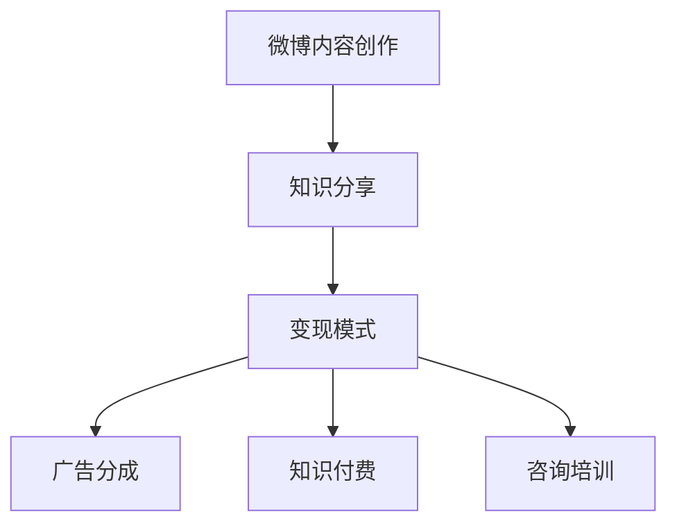

                 

# 程序员如何利用微博进行知识变现

> 关键词：程序员,微博,知识变现,技能分享,软件开发,人工智能

## 1. 背景介绍

随着互联网的快速发展，社交媒体平台成为了程序员分享知识、交流技术的重要渠道。微博作为中国最大的社交媒体平台之一，聚集了大量的程序员和技术爱好者。如何利用微博进行知识变现，既是对个人技术的展示，也是对自身能力的提升。本文将从微博内容创作、知识分享、变现模式三个方面，探讨程序员如何通过微博进行知识变现。

## 2. 核心概念与联系

### 2.1 核心概念概述

在探讨微博知识变现之前，我们首先需要理解以下几个核心概念：

- **微博内容创作**：指程序员在微博平台上发布与技术相关的原创内容，包括代码示例、技术文章、项目案例、学习心得等。这些内容需具备一定的质量和可读性，以吸引读者关注。
- **知识分享**：通过微博发布技术知识，帮助其他程序员提升技能，解决技术问题。知识分享不仅能提升个人品牌，还能建立技术社群，形成良性互动。
- **变现模式**：指程序员通过微博平台实现盈利的方式，如广告分成、知识付费、咨询培训等。这些变现模式为程序员提供了新的收入来源。

### 2.2 核心概念原理和架构的 Mermaid 流程图



## 3. 核心算法原理 & 具体操作步骤

### 3.1 算法原理概述

微博知识变现的核心在于内容的创作和分享，以及通过合理的变现模式实现盈利。基于监督学习的微博内容推荐算法和大数据技术，为程序员的知识变现提供了可能。算法通过分析用户的阅读行为和偏好，推荐相关内容，从而提高内容的曝光率和影响力。

### 3.2 算法步骤详解

**Step 1: 内容创作**
1. 确定创作主题：选择与自身技术栈、项目经验相关的热点话题或技术趋势，如云计算、人工智能、区块链等。
2. 内容规划：制定内容框架，包括标题、正文、示例代码、关键点总结等。
3. 内容撰写：结合自身项目经验和技术理解，撰写内容，确保语言通俗易懂，排版美观。

**Step 2: 知识分享**
1. 发布平台：在微博上发布内容，使用微博官方提供的标签、话题、话题标签等功能，增加内容的曝光度。
2. 互动交流：积极回应评论、私信，与读者建立良好的互动关系，收集反馈意见。
3. 内容更新：根据读者反馈和技术进步，定期更新内容，保持内容的活跃度。

**Step 3: 变现模式选择**
1. 广告分成：与微博合作，通过广告分成获取收入。
2. 知识付费：发布付费专栏、课程，为有需求的用户提供高质量技术资料。
3. 咨询培训：通过私信、微博活动等形式，提供个性化的技术咨询和培训服务。

### 3.3 算法优缺点

**优点**：
- **高效曝光**：微博平台的强社交属性和广告推荐算法，使得内容能够快速触达大量目标用户。
- **成本低廉**：相较于线下培训或企业合作，微博变现模式无需前期大额资金投入。
- **灵活多样**：变现模式灵活，可以结合自身特点选择最合适的盈利方式。

**缺点**：
- **竞争激烈**：微博平台上程序员众多，内容创作和分享难以脱颖而出。
- **变现周期长**：广告分成、知识付费等模式需要积累一定粉丝和信任度后才能变现。
- **内容维护**：需持续更新内容，保持与技术的同步，对个人时间管理要求较高。

### 3.4 算法应用领域

微博知识变现主要应用于软件开发、人工智能、云计算等技术领域。通过微博平台，程序员可以将自身的技术经验和项目案例分享给更多同行，帮助他人解决技术问题，同时也获得可观的收益。

## 4. 数学模型和公式 & 详细讲解 & 举例说明

### 4.1 数学模型构建

假设程序员在微博平台上发布的原创内容为 $C_i$，共有 $N$ 篇，每篇内容的用户阅读次数为 $R_i$，用户对该内容的点赞数为 $P_i$，评论数为 $C_i$，分享数为 $S_i$。

微博推荐算法目标是最小化预测错误率，即找到最优权重 $w$，使得预测用户阅读次数 $\hat{R}$ 与真实阅读次数 $R$ 的差异最小化。

设推荐算法模型为 $f(C_i, w)$，其中 $f$ 为线性回归模型，$w$ 为权重向量。

### 4.2 公式推导过程

$$
\min_{w} \sum_{i=1}^N (R_i - \hat{R}_i)^2
$$

其中，$\hat{R}_i = \sum_{j=1}^N w_j f(C_j, w)$。

将上式展开得：

$$
\min_{w} \sum_{i=1}^N (R_i - \sum_{j=1}^N w_j f(C_j, w))^2
$$

通过求解上述最小化问题，得到最优权重向量 $w$，即可预测新发布内容的阅读次数。

### 4.3 案例分析与讲解

以微博上的某篇技术博客为例，该博主在博客中详细讲解了如何使用最新的人工智能库进行图像识别项目，并附带了完整代码和示例。发布后，微博算法推荐该内容至相关话题，并根据读者的点赞、评论、分享等行为，逐步提升其阅读次数和曝光度。最终，博主通过广告分成和知识付费两种模式，获得了丰厚收益。

## 5. 项目实践：代码实例和详细解释说明

### 5.1 开发环境搭建

1. 安装Python：从官网下载Python 3.x版本，并进行安装。
2. 安装Jupyter Notebook：使用pip安装Jupyter Notebook。
3. 安装Pandas、NumPy等数据处理库：使用pip安装。
4. 安装scikit-learn：用于机器学习模型的训练。

### 5.2 源代码详细实现

```python
# 导入必要的库
import pandas as pd
from sklearn.linear_model import LinearRegression

# 读取微博内容数据
df = pd.read_csv('微博内容数据.csv')

# 数据预处理
X = df[['R_i', 'P_i', 'C_i', 'S_i']]
y = df['R_i']

# 构建线性回归模型
model = LinearRegression()
model.fit(X, y)

# 预测新内容阅读次数
new_content = pd.DataFrame([[1, 10, 5, 2]])
prediction = model.predict(new_content)
print(prediction)
```

### 5.3 代码解读与分析

上述代码实现了对微博内容阅读次数的预测。具体步骤如下：
1. 读取微博内容数据，包含用户阅读次数 $R_i$、点赞数 $P_i$、评论数 $C_i$、分享数 $S_i$。
2. 构建线性回归模型，训练模型参数 $w$。
3. 使用训练好的模型对新内容阅读次数进行预测。

通过以上步骤，可以较为准确地预测新发布内容在微博上的阅读次数，从而指导内容创作和分享策略。

### 5.4 运行结果展示

运行代码后，输出新内容阅读次数的预测值，可以用于内容创作和分享策略的优化。

## 6. 实际应用场景

### 6.1 软件开发

软件开发领域的程序员可以通过微博分享项目经验、代码示例和技术心得。例如，某程序员开发了一个高效的后端API，可以在微博上详细介绍项目背景、技术选型、代码实现等，并通过知识付费模式为有需求的用户提供详细文档和技术支持。

### 6.2 人工智能

人工智能领域的程序员可以分享最新的AI技术进展、开源项目和实验结果。例如，某程序员进行了一个新的图像识别项目，可以在微博上详细介绍项目动机、模型架构、训练过程和效果对比，并通过广告分成和知识付费模式吸引关注和合作。

### 6.3 云计算

云计算领域的程序员可以分享云服务的使用心得、架构设计和实践案例。例如，某程序员利用AWS进行大规模数据处理项目，可以在微博上详细介绍项目需求、技术选型、资源配置和优化方案，并通过咨询培训模式提供个性化的技术支持。

## 7. 工具和资源推荐

### 7.1 学习资源推荐

1. **《Python数据科学手册》**：该书详细介绍了Python在数据科学中的应用，包括数据分析、机器学习等，适合微博内容创作和学习。
2. **《深度学习入门》**：该书介绍了深度学习的基本原理和应用实例，适合微博内容分享和变现。
3. **Kaggle**：Kaggle平台提供大量数据集和竞赛，适合程序员通过实际项目提升技能，积累变现素材。

### 7.2 开发工具推荐

1. **Jupyter Notebook**：Jupyter Notebook提供了强大的代码编写和数据处理功能，适合微博内容创作和分享。
2. **GitHub**：GitHub是程序员进行代码共享和协作的重要平台，适合微博内容的项目管理和发布。
3. **Markdown编辑器**：如Typora、Atom等，适合编写微博上的技术博客和文章。

### 7.3 相关论文推荐

1. **《Twitter推荐算法》**：该论文介绍了Twitter推荐系统的算法原理和应用，适合微博推荐算法的研究。
2. **《社交媒体上的知识分享行为研究》**：该论文分析了社交媒体上的知识分享行为，适合微博内容创作和变现的研究。
3. **《深度学习模型在微博情感分析中的应用》**：该论文介绍了深度学习模型在微博情感分析中的应用，适合微博内容分析的研究。

## 8. 总结：未来发展趋势与挑战

### 8.1 研究成果总结

微博知识变现不仅为程序员提供了一个展示技术、分享经验的平台，也为技术社区的形成和传播提供了可能。通过微博平台，程序员可以更高效地进行技术交流和知识传播，实现个人价值和收入增长。

### 8.2 未来发展趋势

未来微博知识变现将呈现以下几个发展趋势：
1. **内容生态完善**：随着内容创作者和读者数量的增加，微博内容生态将更加丰富和多样化，吸引更多技术爱好者加入。
2. **技术合作加深**：微博平台将加强与技术社区和企业的合作，提供更多变现机会和资源支持。
3. **变现模式多样化**：除了广告分成、知识付费、咨询培训外，微博还将推出更多新的变现模式，如众筹项目、技术讲座等。

### 8.3 面临的挑战

微博知识变现面临的挑战主要在于内容质量、变现效率和用户互动。
1. **内容质量**：高质量的内容能够吸引更多读者，是微博变现的基础。需要内容创作者持续更新知识，保持内容的活跃度。
2. **变现效率**：微博变现模式需具备一定的粉丝基础和信任度，才能有效实现盈利。变现效率低可能影响内容创作的动力。
3. **用户互动**：良好的用户互动能提升内容的曝光度和影响力，但也需要内容创作者具备较强的沟通能力和时间管理能力。

### 8.4 研究展望

未来微博知识变现的研究方向主要在于内容创作优化、变现模式创新和用户互动增强。
1. **内容创作优化**：通过大数据分析，预测热门话题和技术趋势，指导内容创作方向。
2. **变现模式创新**：结合微博平台的特点，推出更多具有创新性的变现模式，如在线编程挑战、技术难题解答等。
3. **用户互动增强**：建立互动奖励机制，鼓励用户积极参与讨论和分享，形成更加活跃的技术社区。

## 9. 附录：常见问题与解答

**Q1: 如何提高微博内容的曝光度和阅读量？**

A: 提高微博内容曝光度和阅读量，可以从以下几个方面入手：
1. 选择合适的话题标签和话题，增加内容的可见性。
2. 优化内容质量，确保语言通俗易懂，排版美观，内容有价值。
3. 积极与读者互动，回应评论和私信，增强用户粘性。
4. 利用微博的多种功能，如视频、直播、文章等，丰富内容形式。

**Q2: 微博变现的效率如何？**

A: 微博变现的效率与内容质量、粉丝基础和变现模式密切相关。以下是一些提高变现效率的建议：
1. 通过优质内容吸引和积累粉丝，逐步提高变现能力。
2. 选择适合的变现模式，如知识付费、咨询培训等，最大化变现潜力。
3. 定期更新内容，保持与技术趋势同步，提高内容的活跃度和吸引力。

**Q3: 微博平台有哪些功能可以用于内容创作和分享？**

A: 微博平台提供了丰富的功能，适用于内容创作和分享。以下是一些常用的功能：
1. 话题标签：选择相关话题标签，增加内容的曝光度。
2. 私信和评论：与读者互动，获取反馈和建议。
3. 微博文章：详细描述技术细节，分享项目经验和心得。
4. 视频和直播：展示编程过程、项目演示和技术讲座，吸引更多关注。

**Q4: 微博变现有哪些注意事项？**

A: 微博变现需要注意以下几个方面：
1. 确保内容质量：高质量的内容能吸引更多读者和关注，提高变现潜力。
2. 尊重版权和隐私：在内容创作和分享时，尊重版权和隐私，避免侵权和泄露敏感信息。
3. 合理定价：选择适合的变现模式和定价策略，确保收益最大化。
4. 持续优化：根据读者反馈和技术趋势，不断优化内容创作和变现策略，保持竞争力和吸引力。

通过以上讨论，可以全面理解微博知识变现的原理和具体操作步骤，掌握相关工具和资源，从而实现个人价值和技术变现。

