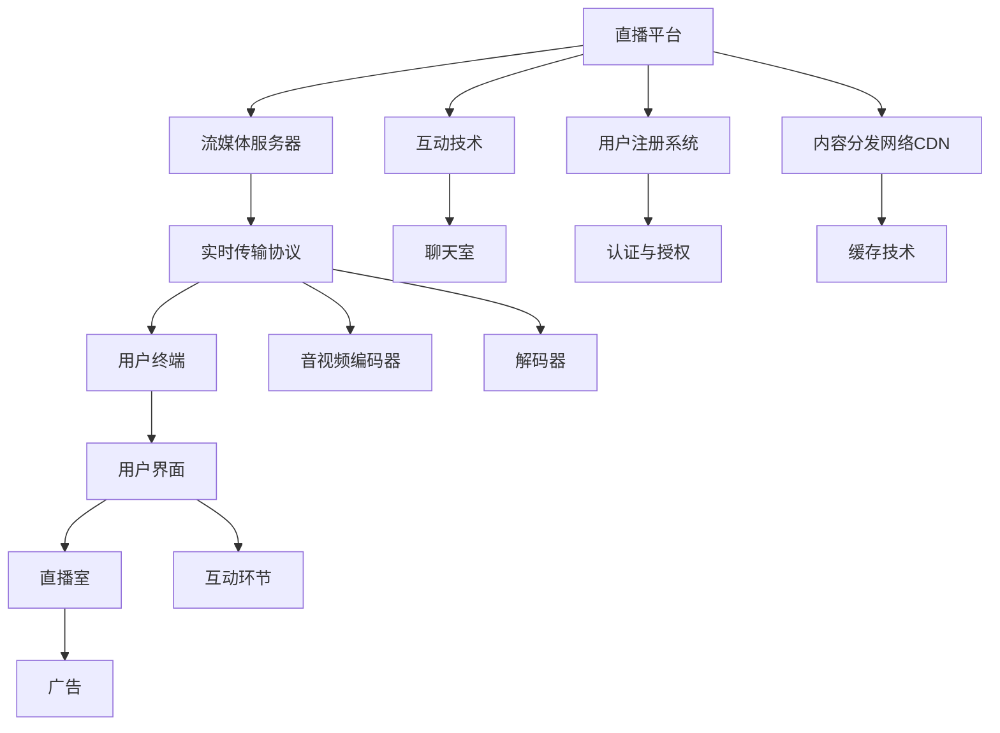

                 

# 程序员如何利用直播技术进行知识变现

## 1. 背景介绍

随着互联网技术的飞速发展，直播作为一种互动性强、传播速度快的新型媒介，在各行各业中得到了广泛应用。在IT技术领域，直播不仅仅是传播媒介，更是程序员实现知识变现的重要工具。通过直播技术，程序员可以将自身的技术经验、项目经验、职业规划等内容分享出去，为广大的编程爱好者提供帮助，同时也为自己带来收入。本文将探讨程序员如何利用直播技术进行知识变现。

## 2. 核心概念与联系

### 2.1 核心概念概述

- **直播技术**：通过互联网将实时的音频、视频等内容进行传输和展示，让多个用户同时在线观看的技术。直播技术的核心包括流媒体传输协议、视频编解码技术、用户互动技术等。
- **知识变现**：通过分享自己的专业知识、技能和经验，获得经济收益的过程。知识变现可以以多种形式进行，包括在线课程、咨询服务、技术博客、直播等。
- **程序员直播**：程序员利用直播技术分享自身的编程技能、项目经验、职业规划等内容，与观众进行互动，实现知识变现。

### 2.2 核心概念原理和架构的 Mermaid 流程图



## 3. 核心算法原理 & 具体操作步骤

### 3.1 算法原理概述

利用直播技术进行知识变现，其核心算法原理包括实时音视频传输、互动技术、广告变现等。具体步骤如下：

1. **实时音视频传输**：利用流媒体传输协议（如RTMP、WebRTC等）将音视频流实时传输到直播平台。
2. **互动技术**：通过聊天室、即时消息等方式，实现观众与主播的实时互动。
3. **广告变现**：在直播过程中插入广告，通过广告点击率、观看时长等方式获得收益。

### 3.2 算法步骤详解

#### 3.2.1 实时音视频传输

- **选择流媒体协议**：选择合适的流媒体传输协议，如RTMP、WebRTC等。
- **音视频编码和解码**：使用音视频编解码器对音视频数据进行编码，确保传输效率和清晰度。
- **流媒体服务器**：通过流媒体服务器将编码后的音视频流进行实时传输，确保直播的流畅性。
- **CDN加速**：利用CDN技术，将音视频数据缓存到全球各地的服务器中，提高直播的访问速度和稳定性。

#### 3.2.2 互动技术

- **聊天室系统**：实现主播与观众之间的实时聊天。
- **即时消息**：通过即时消息推送、弹窗等方式，实现主播与观众的即时互动。
- **投票与互动**：利用投票、问答等方式，增加互动性和趣味性。

#### 3.2.3 广告变现

- **广告插入**：在直播过程中插入广告，如横幅广告、视频广告等。
- **广告效果监测**：通过广告点击率、观看时长等方式，监测广告效果，分析用户行为。
- **收益分配**：根据广告效果，分配广告收入给主播和平台。

### 3.3 算法优缺点

#### 3.3.1 优点

- **互动性强**：直播平台提供了丰富的互动工具，如聊天室、即时消息等，可以增强主播与观众之间的互动。
- **变现效率高**：通过插入广告等方式，可以在直播过程中实现即时的收益。
- **门槛低**：只要有电脑、麦克风、摄像头等设备，就可以开启直播。

#### 3.3.2 缺点

- **技术要求高**：直播技术的实现需要一定的技术背景，如音视频编码、流媒体传输等。
- **时间成本高**：直播需要持续的时间投入，对主播的时间安排要求较高。
- **内容质量参差不齐**：由于主播水平不一，直播内容的质量也存在较大的差异。

### 3.4 算法应用领域

直播技术不仅可以用于知识变现，还可以应用于多个领域，如娱乐、教育、医疗等。在IT领域，直播技术被广泛应用于在线教育、技术分享、招聘等场景，为程序员提供了一个展示自我、分享经验、实现知识变现的平台。

## 4. 数学模型和公式 & 详细讲解 & 举例说明

### 4.1 数学模型构建

在直播技术中，实时音视频传输和互动技术的实现都涉及到复杂的数学模型和算法。以下是一个简单的实时音视频传输模型的构建：

- **传输速率**：$R = \frac{D}{T}$，其中 $D$ 为数据量，$T$ 为传输时间。
- **传输延时**：$T_{delay} = D \times \frac{1}{R} + \frac{L}{R}$，其中 $L$ 为网络延迟。
- **带宽**：$W = \frac{D}{T_{delay}}$，其中 $D$ 为数据量，$T_{delay}$ 为传输延时。

### 4.2 公式推导过程

以实时音视频传输的延时模型为例，推导如下：

1. **传输速率**：$R = \frac{D}{T}$，其中 $D$ 为数据量，$T$ 为传输时间。
2. **传输延时**：$T_{delay} = T + \frac{L}{R}$，其中 $T$ 为数据传输时间，$L$ 为网络延迟，$R$ 为传输速率。
3. **带宽**：$W = \frac{D}{T_{delay}} = \frac{D}{T + \frac{L}{R}}$，其中 $D$ 为数据量，$T$ 为数据传输时间，$L$ 为网络延迟，$R$ 为传输速率。

### 4.3 案例分析与讲解

以WebRTC为例，WebRTC是Google推出的基于标准的Web实时通信技术，利用浏览器进行实时音视频传输。WebRTC的音视频编解码器采用了H.264和VP9两种标准，可以满足不同带宽和网络环境下的实时通信需求。WebRTC还支持P2P（Peer-to-Peer）技术，可以减轻服务器的负担，提高直播的效率和稳定性。

## 5. 项目实践：代码实例和详细解释说明

### 5.1 开发环境搭建

要实现直播技术进行知识变现，需要搭建一个完整的直播平台。以下是一个基于Node.js和Socket.IO的直播平台搭建示例：

1. **安装Node.js和npm**：
```bash
curl -sL https://deb.nodesource.com/setup_16.x | sudo -E bash -
sudo apt-get install -y nodejs
sudo apt-get install -y npm
```

2. **安装Socket.IO**：
```bash
npm install socket.io
```

3. **创建项目文件夹和文件结构**：
```bash
mkdir mylivestream
cd mylivestream
npm init
```

4. **编写直播服务器代码**：
```javascript
const http = require('http');
const socketio = require('socket.io');
const fs = require('fs');

const server = http.createServer((req, res) => {
    res.writeHead(200);
    fs.createReadStream('index.html').pipe(res);
});

const io = socketio(server);
io.on('connection', (socket) => {
    console.log('User connected');

    socket.on('chat message', (msg) => {
        console.log(msg);
        io.emit('chat message', msg);
    });

    socket.on('disconnect', () => {
        console.log('User disconnected');
    });
});

server.listen(3000, () => {
    console.log('Server started on port 3000');
});
```

### 5.2 源代码详细实现

**index.html文件**：
```html
<!DOCTYPE html>
<html>
<head>
    <meta charset="utf-8">
    <title>Livestream</title>
    <script src="/socket.io/socket.io.js"></script>
    <script>
        const socket = io();
        const messageInput = document.getElementById('message');
        const messageForm = document.getElementById('message-form');

        messageForm.addEventListener('submit', (e) => {
            e.preventDefault();
            socket.emit('chat message', messageInput.value);
            messageInput.value = '';
        });
    </script>
</head>
<body>
    <h1>Livestream</h1>
    <form id="message-form">
        <input type="text" id="message" placeholder="Type a message...">
        <button type="submit">Send</button>
    </form>
    <div id="chat">
        <ul id="messages"></ul>
    </div>
    <script>
        const messages = document.getElementById('messages');
        socket.on('chat message', (msg) => {
            const li = document.createElement('li');
            li.textContent = msg;
            messages.appendChild(li);
        });
    </script>
</body>
</html>
```

**Node.js服务器代码**：
```javascript
const http = require('http');
const socketio = require('socket.io');
const fs = require('fs');

const server = http.createServer((req, res) => {
    res.writeHead(200);
    fs.createReadStream('index.html').pipe(res);
});

const io = socketio(server);
io.on('connection', (socket) => {
    console.log('User connected');

    socket.on('chat message', (msg) => {
        console.log(msg);
        io.emit('chat message', msg);
    });

    socket.on('disconnect', () => {
        console.log('User disconnected');
    });
});

server.listen(3000, () => {
    console.log('Server started on port 3000');
});
```

### 5.3 代码解读与分析

**index.html文件**：
- **代码结构**：HTML页面由一个表单和一个消息区组成。
- **表单**：用户可以在表单中输入消息，并提交到服务器。
- **消息区**：服务器接收到的消息将显示在该区域中。

**Node.js服务器代码**：
- **服务器搭建**：使用Node.js创建HTTP服务器，并监听3000端口。
- **Socket.IO集成**：使用Socket.IO中间件，实现与服务端的双向通信。
- **事件处理**：处理连接、消息发送、消息接收、断开连接等事件。

### 5.4 运行结果展示

启动服务器后，在浏览器中访问 `http://localhost:3000`，即可进入直播页面。用户在直播页面中输入消息并发送，服务器将这些消息转发给所有在线用户，实现了直播互动效果。

## 6. 实际应用场景

### 6.1 教育培训

在教育培训领域，程序员可以利用直播技术开设在线课程、技术讲座、编程培训等。通过直播平台，学生可以实时观看课程内容，与老师进行互动，提出问题并获得解答。直播平台还可以录制课程视频，供学生随时回看，增加学习效率。

### 6.2 技术分享

在技术分享领域，程序员可以利用直播技术分享自身技术经验、项目经验、职业规划等内容。通过直播平台，观众可以实时与主播互动，提出问题并获得解答。直播平台还可以存储直播视频，供观众随时回看，增加学习效率。

### 6.3 招聘

在招聘领域，程序员可以利用直播技术进行在线面试、技术讲演等。通过直播平台，招聘方可以实时与求职者互动，考察其技术水平和综合素质。直播平台还可以录制面试视频，供招聘方回顾，增加招聘效率。

## 7. 工具和资源推荐

### 7.1 学习资源推荐

- **《JavaScript高级程序设计》**：一本全面介绍JavaScript的书籍，适合初学者和进阶开发者。
- **《Node.js设计模式》**：一本介绍Node.js开发中常用设计模式的书籍，适合有一定JavaScript基础的开发者。
- **《WebRTC实战》**：一本介绍WebRTC技术的书籍，适合开发者学习WebRTC开发。
- **《Socket.IO官方文档》**：Socket.IO的官方文档，详细介绍了Socket.IO的使用方法和API。

### 7.2 开发工具推荐

- **Visual Studio Code**：一款轻量级的代码编辑器，支持JavaScript、TypeScript等多种编程语言。
- **Git**：一款分布式版本控制系统，适合团队协作开发。
- **JSDoc**：一款JavaScript文档生成工具，可以帮助开发者自动生成API文档。
- **Webpack**：一款模块打包工具，支持多种构建任务，如编译、优化、打包等。

### 7.3 相关论文推荐

- **"WebRTC: Communications in a New World of Web Browsers"**：WebRTC的官方论文，介绍了WebRTC技术的基本原理和应用场景。
- **"Socket.io - Realtime WebSockets in a Simple Package"**：Socket.IO的官方论文，介绍了Socket.IO的基本原理和使用方法。

## 8. 总结：未来发展趋势与挑战

### 8.1 研究成果总结

直播技术已成为程序员实现知识变现的重要工具。通过实时音视频传输、互动技术和广告变现等核心算法，直播平台能够提供丰富的互动体验，满足用户的多种需求。直播平台在教育培训、技术分享、招聘等多个领域中得到了广泛应用。

### 8.2 未来发展趋势

未来，直播技术将继续在教育、技术分享、招聘等多个领域中发挥重要作用。以下是未来直播技术的发展趋势：

- **VR/AR技术的应用**：通过VR/AR技术，直播平台可以提供更加沉浸式的体验，增加用户粘性。
- **人工智能技术的融合**：通过AI技术，直播平台可以自动识别用户情绪，调整音视频质量，提升用户体验。
- **区块链技术的应用**：通过区块链技术，直播平台可以实现主播和观众之间的透明交易，保障用户权益。
- **5G技术的应用**：通过5G技术，直播平台可以实现更高质量的音视频传输，增加直播平台的用户规模。

### 8.3 面临的挑战

直播技术在发展过程中也面临一些挑战：

- **技术实现复杂**：直播技术的实现需要复杂的算法和大量的技术积累，开发者需要具备较高的技术水平。
- **内容质量参差不齐**：由于主播水平不一，直播内容的质量也存在较大的差异，如何提升内容质量是一个重要的挑战。
- **用户隐私保护**：直播平台需要保护用户隐私，避免用户信息泄露。
- **平台盈利模式单一**：目前直播平台的盈利模式主要是广告变现，如何探索更多盈利模式是一个重要的挑战。

### 8.4 研究展望

未来，直播技术需要在技术实现、内容质量、用户隐私保护和盈利模式等多个方面进行全面提升。通过技术创新和模式创新，直播技术必将在教育、技术分享、招聘等多个领域中发挥更大的作用。

## 9. 附录：常见问题与解答

**Q1: 直播技术有哪些应用场景？**

A: 直播技术可以应用于多个领域，如教育培训、技术分享、招聘、娱乐等。在IT领域，直播技术被广泛应用于在线教育、技术分享、招聘等场景，为程序员提供了一个展示自我、分享经验、实现知识变现的平台。

**Q2: 如何选择直播平台？**

A: 选择直播平台时，需要考虑平台的用户规模、技术支持、服务质量、收费模式等因素。一些知名直播平台如Bilibili、YouTube、Twitch等，都拥有良好的用户基础和技术支持，适合不同需求的用户。

**Q3: 如何提升直播平台的内容质量？**

A: 提升直播平台的内容质量需要从多个方面进行努力：
- **主播培训**：对主播进行培训，提高其技术水平和表达能力。
- **内容多样化**：增加直播内容的多样性，涵盖多个领域和主题。
- **观众互动**：增加观众的互动性，鼓励观众参与讨论和提问。

**Q4: 直播平台如何保护用户隐私？**

A: 直播平台需要采取多种措施保护用户隐私，如用户身份验证、敏感信息加密、隐私政策透明化等。平台应遵守相关法律法规，保护用户隐私权益。

**Q5: 直播平台如何增加用户粘性？**

A: 增加用户粘性需要从多个方面进行努力：
- **内容多样化**：增加直播内容的多样性，满足不同用户的需求。
- **互动性增强**：增加直播的互动性，如聊天室、投票等，增强用户参与感。
- **用户激励机制**：通过奖励机制，激励用户积极参与直播互动。

通过以上探讨，我们了解了程序员如何利用直播技术进行知识变现。直播技术不仅为程序员提供了一个展示自我、分享经验、实现知识变现的平台，还在多个领域中发挥了重要作用。未来，直播技术将在更多领域中得到应用，为人类社会带来更多便利和创新。

