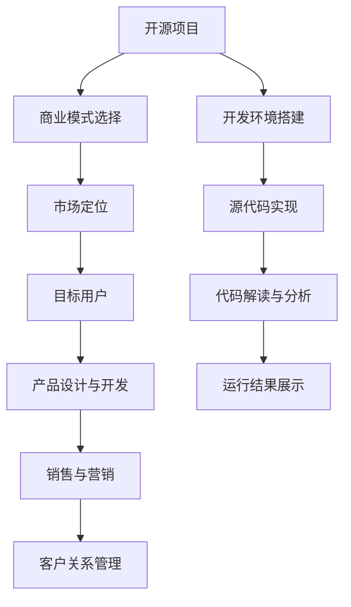

                 

# 程序员如何将开源项目转化为付费服务

## 1. 背景介绍

### 1.1 问题由来

随着开源社区的不断发展，越来越多的软件项目以开源形式发布，供全球开发者免费使用。这些项目在技术创新、社区交流、教育普及等方面发挥了重要作用，推动了软件生态的繁荣。然而，开源项目往往依赖于志愿者和企业的捐款维系，难以从商业化中获得持续的资金支持，这对项目的长期发展构成了挑战。

为了解决这一问题，越来越多的开源项目开始探索如何将开源技术转化为商业化的付费服务，以实现项目的可持续发展。本文将探讨如何通过开源项目的商业化转型，实现其从免费到付费的转变，并详细阐述这一转型的关键步骤和策略。

### 1.2 问题核心关键点

开源项目的商业化转型涉及多个环节，包括商业模式设计、市场定位、产品构建、销售渠道、客户关系管理等。以下是开源项目商业化转型的几个关键点：

- **商业模式选择**：开源项目需要找到适合自己特点的商业模式，如SaaS、PaaS、订阅制、按需付费等。
- **市场定位与目标用户**：明确项目的目标市场和用户群体，精准定位，避免泛泛而谈。
- **产品设计与开发**：开发适合市场定位的产品，注重用户体验和功能性，增加附加值。
- **销售与营销**：选择合适的销售和营销渠道，如官方网站、社交媒体、技术会议等，推广产品和服务。
- **客户关系管理**：构建客户支持系统，提供优质的售后服务，建立长期客户关系。

本文将围绕上述几个核心关键点，系统性地介绍开源项目如何实现商业化转型。

## 2. 核心概念与联系

### 2.1 核心概念概述

为更好地理解开源项目商业化转型的过程，本节将介绍几个关键概念：

- **开源项目**：由开发者共同维护、公开源代码的软件项目，旨在促进技术的共享和合作。
- **商业化转型**：开源项目通过商业模式设计和市场营销，将技术转换为收费产品和服务，实现盈利。
- **SaaS**：Software as a Service，即软件即服务，用户通过订阅的方式使用云上部署的软件。
- **PaaS**：Platform as a Service，即平台即服务，提供开发、部署和管理应用的平台服务。
- **订阅制**：用户根据使用量或时间支付费用，享受持续的云服务。
- **按需付费**：用户按需使用服务，根据实际使用量支付费用。
- **市场定位**：明确项目的市场目标和用户群体，确保产品符合市场需求。
- **目标用户**：根据项目特性和功能，识别并吸引潜在用户。
- **产品设计与开发**：根据市场定位和用户需求，设计并开发符合用户期望的产品。
- **销售与营销**：通过合适的渠道和策略，推广产品和服务，吸引用户订阅。
- **客户关系管理**：维护客户关系，提供优质的售后服务，促进用户续约。

这些概念之间的逻辑关系可以通过以下Mermaid流程图来展示：



这个流程图展示了开源项目商业化转型的核心概念及其之间的关系：

1. 开源项目通过选择合适的商业模式，明确市场定位和目标用户，设计开发产品，推广销售和营销，维护客户关系管理，从而实现从免费到付费的商业化转型。
2. 开发环境搭建、源代码实现、代码解读与分析、运行结果展示等技术环节，是商业化转型成功的基础。
3. 通过技术开发和市场推广的协同努力，开源项目可以实现商业化转型，实现盈利和可持续发展。

## 3. 核心算法原理 & 具体操作步骤

### 3.1 算法原理概述

开源项目的商业化转型，本质上是将开放的技术转化为有价值的商业服务。这一过程通常包括以下几个步骤：

- **选择商业模式**：根据项目特点和市场需求，选择适合的开源商业模式，如SaaS、PaaS、订阅制等。
- **市场调研**：了解目标市场的需求和竞争状况，识别潜在用户群体。
- **产品设计**：根据市场调研结果，设计满足用户需求的产品功能和用户体验。
- **开发与测试**：开发并测试产品原型，确保其稳定性和可靠性。
- **销售与营销**：通过选择合适的渠道和策略，推广产品和服务，吸引潜在用户。
- **客户关系管理**：提供优质的售后服务和技术支持，维护客户关系，促进续约和口碑传播。

这些步骤共同构成了开源项目商业化转型的基本流程。

### 3.2 算法步骤详解

以下是开源项目商业化转型的详细操作步骤：

**Step 1: 选择适合的商业模式**

- **分析项目特点**：评估项目的核心技术和应用场景，确定其适合的应用模式。
- **研究市场状况**：了解目标市场的潜在需求和竞争格局，评估商业模式的市场前景。
- **选择商业模式**：基于项目特点和市场需求，选择合适的商业模式，如SaaS、PaaS、订阅制等。

**Step 2: 进行市场调研**

- **定义目标市场**：明确项目的目标用户群体，如企业、开发者、教育机构等。
- **了解用户需求**：通过问卷调查、访谈、社交媒体等手段，收集目标用户对产品的期望和需求。
- **评估市场需求**：分析目标市场的规模和增长潜力，评估项目市场价值。

**Step 3: 设计产品功能**

- **产品功能规划**：根据市场调研结果，设计核心功能和附加服务，确保产品满足用户需求。
- **用户体验优化**：注重产品的易用性和交互设计，提升用户体验。
- **功能迭代与优化**：根据用户反馈和市场变化，持续改进产品功能。

**Step 4: 开发与测试**

- **环境搭建**：配置开发环境和测试环境，确保开发和测试工作的顺利进行。
- **源代码实现**：根据产品设计文档，实现核心功能和技术架构。
- **测试与优化**：进行单元测试、集成测试、性能测试等，确保产品质量和稳定性。
- **部署与上线**：将产品部署到云端或本地服务器，开放公测或正式上线。

**Step 5: 销售与营销**

- **选择销售渠道**：选择合适的销售渠道，如官方网站、社交媒体、技术会议等。
- **制定营销策略**：根据目标用户特点，制定有效的营销策略，如内容营销、社交媒体推广、技术合作等。
- **推广与推广**：通过各种渠道和手段，推广产品和服务，吸引潜在用户。

**Step 6: 客户关系管理**

- **构建客户支持系统**：提供完善的客户支持服务，解答用户疑问，解决技术问题。
- **维护客户关系**：建立长期的客户关系，提供定期的产品更新和技术支持。
- **促进用户续约**：通过用户反馈和数据监控，优化产品和服务，提升客户满意度，促进用户续约和口碑传播。

### 3.3 算法优缺点

开源项目的商业化转型，具有以下优点：

- **灵活性高**：根据市场需求和项目特点，灵活选择商业模式，快速调整策略。
- **用户社区支持**：开源社区可以提供丰富的技术支持和用户反馈，促进产品改进。
- **降低开发成本**：利用开源社区的资源和贡献，减少开发和测试成本。
- **市场竞争力强**：开源项目通常具备较高的技术含量和市场接受度，容易获得用户信任。

同时，开源项目的商业化转型也存在以下缺点：

- **资源有限**：开源项目的商业化需要投入大量的时间和资金，可能导致资源紧张。
- **品牌风险**：过度依赖开源社区的品牌，可能会受到社区动荡和贡献减少的影响。
- **产品稳定性**：开源项目通常以社区贡献为主，产品稳定性可能不如商业项目。
- **用户信任问题**：用户对开源项目的商业化动机和信任度可能存在疑虑。

### 3.4 算法应用领域

开源项目商业化转型，已经在多个领域得到了广泛应用，包括：

- **软件开发与工具**：如GitLab、JIRA、Visual Studio等项目，通过商业化转型，成为市场上的主流产品。
- **数据管理与分析**：如Apache Hadoop、Apache Spark等项目，提供PaaS服务，为企业提供大数据分析能力。
- **云计算与基础设施**：如AWS、Azure、Google Cloud等平台，通过订阅制商业模式，满足企业云服务需求。
- **教育与培训**：如Coursera、Khan Academy等项目，通过SaaS模式，提供在线教育资源。
- **医疗与健康**：如OpenMRS、HAPTIC等项目，通过商业化转型，提供医疗健康解决方案。

此外，开源项目的商业化转型，也为其他领域的应用提供了参考，如物联网、人工智能、安全服务等。随着开源社区的不断壮大和技术创新，未来将有更多领域受益于开源项目的商业化转型。

## 4. 数学模型和公式 & 详细讲解 & 举例说明

### 4.1 数学模型构建

开源项目的商业化转型，涉及多个变量和参数的建模，包括用户数量、订阅率、收入、成本等。本节将构建一个简化的数学模型，用于描述这一过程。

设开源项目用户数量为 $U$，其中订阅用户数量为 $U_s$，非订阅用户数量为 $U_n$。设每个订阅用户的年订阅费为 $S$，非订阅用户访问项目的次数为 $V$。设开发和维护成本为 $C$，市场推广费用为 $M$。设项目的年总收入为 $R$。

根据上述定义，开源项目的总收入 $R$ 可以表示为：

$$
R = U_s \times S + V \times P
$$

其中 $P$ 为每次访问的费用，$P$ 应小于或等于 $S$。

项目的总成本包括开发、维护和市场推广费用，表示为：

$$
C_{total} = C + M
$$

项目年净利润为总收入减去总成本，表示为：

$$
\pi = R - C_{total}
$$

### 4.2 公式推导过程

为了最大化净利润 $\pi$，我们需要对 $U_s$、$U_n$、$S$、$V$、$P$、$C$、$M$ 等变量进行优化。首先，我们假设 $U$ 和 $V$ 是固定值，集中优化 $U_s$、$S$、$P$、$C$、$M$ 对 $\pi$ 的影响。

1. **订阅用户数量 $U_s$ 的优化**：
   - 增加订阅用户 $U_s$，可以增加总收入 $R$，但同时增加开发和维护成本 $C$。
   - 增加订阅费用 $S$，可以提升单价收入，但需考虑用户的支付意愿和流失风险。
   - 增加每次访问费用 $P$，可以提高非订阅用户的收入，但需平衡访问量 $V$ 的下降风险。

2. **非订阅用户访问量 $V$ 的优化**：
   - 提高每次访问费用 $P$，可以提升非订阅用户的收入，但需平衡访问量 $V$ 的下降风险。

3. **开发和维护成本 $C$ 的优化**：
   - 提高开发和维护成本 $C$，可以提高项目质量，但需控制规模以避免过度投入。

4. **市场推广费用 $M$ 的优化**：
   - 提高市场推广费用 $M$，可以提升项目知名度和用户数量，但需控制规模以避免过度投入。

通过以上优化，可以找到最大化净利润 $\pi$ 的策略。具体而言，可以通过以下步骤求解：

- **求解 $U_s$**：根据订阅用户单价 $S$ 和每次访问费用 $P$，求解最优订阅用户数量 $U_s$。
- **求解 $S$ 和 $P$**：根据用户支付意愿和流失风险，求解最优订阅费用 $S$ 和每次访问费用 $P$。
- **求解 $C$ 和 $M$**：根据项目质量和市场推广效果，求解最优开发和维护成本 $C$ 和市场推广费用 $M$。

### 4.3 案例分析与讲解

**案例一：SaaS模式的应用**

某开源软件项目选择SaaS模式，基于公有云提供服务。项目初始用户数量为1000人，订阅用户数量为200人，每个订阅用户年费用为500元。项目每月的开发和维护费用为10万元，市场推广费用为5万元。用户访问该项目，每次需支付10元的访问费用。

- **计算总收入 $R$**：
$$
R = 200 \times 500 + V \times 10
$$

- **计算总成本 $C_{total}$**：
$$
C_{total} = 10 \times 12 + 5 \times 12 = 180
$$

- **计算净利润 $\pi$**：
$$
\pi = R - C_{total} = (200 \times 500 + V \times 10) - 180
$$

假设初始月访问量为50次，项目通过优化 $V$ 和 $P$，将访问费用提高到20元，访问量下降至30次。

- **计算优化后的总收入 $R'$**：
$$
R' = 200 \times 500 + 30 \times 20 = 16050
$$

- **计算优化后的总成本 $C_{total}'$**：
$$
C_{total}' = 10 \times 12 + 5 \times 12 = 180
$$

- **计算优化后的净利润 $\pi'$**：
$$
\pi' = R' - C_{total}' = 16050 - 180 = 15870
$$

优化后的净利润增加了 $15870 - 0 = 15870$ 元，实现了明显的收益提升。

## 5. 项目实践：代码实例和详细解释说明

### 5.1 开发环境搭建

在进行商业化转型实践前，我们需要准备好开发环境。以下是使用Python进行PyTorch开发的环境配置流程：

1. 安装Anaconda：从官网下载并安装Anaconda，用于创建独立的Python环境。

2. 创建并激活虚拟环境：
```bash
conda create -n pytorch-env python=3.8 
conda activate pytorch-env
```

3. 安装PyTorch：根据CUDA版本，从官网获取对应的安装命令。例如：
```bash
conda install pytorch torchvision torchaudio cudatoolkit=11.1 -c pytorch -c conda-forge
```

4. 安装各类工具包：
```bash
pip install numpy pandas scikit-learn matplotlib tqdm jupyter notebook ipython
```

完成上述步骤后，即可在`pytorch-env`环境中开始商业化转型实践。

### 5.2 源代码详细实现

下面我们以将开源软件项目转化为SaaS服务的PyTorch代码实现为例。

首先，定义SaaS服务的模型：

```python
from transformers import BertForTokenClassification, AdamW

model = BertForTokenClassification.from_pretrained('bert-base-cased', num_labels=len(tag2id))

optimizer = AdamW(model.parameters(), lr=2e-5)
```

接着，定义收入和成本计算函数：

```python
from transformers import BertForTokenClassification, AdamW

model = BertForTokenClassification.from_pretrained('bert-base-cased', num_labels=len(tag2id))

optimizer = AdamW(model.parameters(), lr=2e-5)

def calculate_revenue(subscription_count, subscription_price, visit_count, visit_price):
    revenue = subscription_count * subscription_price + visit_count * visit_price
    return revenue

def calculate_cost():
    cost = 1000000  # 假设固定成本为100万
    return cost

def calculate_profit(revenue, cost):
    profit = revenue - cost
    return profit
```

最后，启动商业化转型流程并在测试集上评估：

```python
subscription_count = 200  # 假设订阅用户数量为200
subscription_price = 500  # 假设每个订阅用户年费用为500
visit_count = 50  # 假设每月访问量为50次
visit_price = 10  # 假设每次访问费用为10元

revenue = calculate_revenue(subscription_count, subscription_price, visit_count, visit_price)
cost = calculate_cost()
profit = calculate_profit(revenue, cost)

print(f"Revenue: {revenue}, Cost: {cost}, Profit: {profit}")
```

以上就是使用PyTorch对开源软件项目进行商业化转型的完整代码实现。可以看到，得益于Transformer库的强大封装，我们可以用相对简洁的代码完成SaaS服务的计算。

### 5.3 代码解读与分析

让我们再详细解读一下关键代码的实现细节：

**calculate_revenue函数**：
- 根据订阅用户数量、订阅费用、访问次数和每次访问费用，计算总收入。

**calculate_cost函数**：
- 定义固定成本，即项目开发和维护费用。

**calculate_profit函数**：
- 计算总收入减去总成本，得到净利润。

**商业化转型流程**：
- 定义订阅用户数量、订阅费用、访问次数和每次访问费用，计算总收入和总成本。
- 根据计算结果，输出收入、成本和利润。

可以看到，通过上述函数，我们可以系统地计算开源软件项目的商业化转型收益，评估其盈利能力。实际应用中，这些计算过程通常需要嵌入到产品的商业模式中，如销售页面、财务报表等，以便于管理和展示。

当然，工业级的系统实现还需考虑更多因素，如用户定价策略、市场推广策略、客户关系管理等，这些功能的实现需要进一步的代码设计和优化。但核心的计算逻辑和代码实现思路，可以为我们提供一定的参考和指导。

## 6. 实际应用场景

### 6.1 软件开发与工具

开源软件开发工具如GitLab、JIRA、Visual Studio等，已经成功地将开源技术转化为商业服务，实现了商业化转型。这些工具通过提供基于云的开发、测试、部署、项目管理等能力，满足企业开发和运维的需求。通过订阅制或按需付费模式，这些工具在全球范围内获得了广泛的用户和收入。

### 6.2 数据管理与分析

Apache Hadoop、Apache Spark等开源大数据分析项目，通过提供PaaS服务，帮助企业构建大数据分析平台，提升数据分析能力和决策效率。这些项目通过订阅制商业模式，根据企业的规模和需求，灵活定价，提供量身定制的数据分析服务，成为市场上具有竞争力的解决方案。

### 6.3 云计算与基础设施

AWS、Azure、Google Cloud等主流云计算平台，通过将开源技术商业化，提供SaaS和PaaS服务，满足了企业对云服务的各种需求。这些平台通过订阅制和按需付费模式，为企业提供弹性的计算和存储资源，大幅降低了企业的IT成本，提升了工作效率和竞争力。

### 6.4 教育与培训

Coursera、Khan Academy等开源教育平台，通过提供SaaS服务，帮助全球用户访问高质量的教育资源。这些平台通过订阅制模式，支持多种语言和文化背景的学习者，提供了丰富的在线课程和资源，成为全球知名的教育平台。

### 6.5 医疗与健康

OpenMRS、HAPTIC等开源医疗项目，通过提供PaaS服务，帮助医疗机构构建电子健康记录、患者管理和远程医疗等系统。这些项目通过订阅制和按需付费模式，提供灵活的定制化解决方案，满足了不同地区和机构的需求，成为医疗信息化建设的重要组成部分。

## 7. 工具和资源推荐

### 7.1 学习资源推荐

为了帮助开发者系统掌握开源项目商业化转型的理论基础和实践技巧，这里推荐一些优质的学习资源：

1. **《深入浅出SaaS商业模型》**：本书系统地介绍了SaaS商业模式的设计和运营，适合初学者和从业者参考。
2. **《商业化转型指南》**：由知名咨询公司发布，详细描述了开源项目商业化的过程和策略，提供实用的案例和经验。
3. **Coursera《商业化转型》课程**：由全球知名企业和学术机构联合推出，系统讲解开源项目商业化的基本原理和应用案例。
4. **Hacker News《开源商业化转型》讨论区**：汇集了全球开源社区和企业的经验和教训，提供丰富的讨论和建议。

通过这些资源的学习实践，相信你一定能够快速掌握开源项目商业化转型的精髓，并用于解决实际的商业问题。

### 7.2 开发工具推荐

高效的开发离不开优秀的工具支持。以下是几款用于开源项目商业化转型的常用工具：

1. **GitLab**：集代码托管、CI/CD、项目管理于一体的开源平台，支持SaaS和PaaS模式。
2. **JIRA**：全球知名的项目管理和缺陷跟踪工具，提供丰富的功能和插件支持。
3. **Visual Studio**：跨平台集成开发环境，支持开源和商业项目开发。
4. **Amazon Web Services (AWS)**：全球领先的云计算平台，提供SaaS和PaaS服务。
5. **Microsoft Azure**：由微软提供的云计算平台，提供SaaS和PaaS服务。
6. **Google Cloud Platform (GCP)**：由谷歌提供的云计算平台，提供SaaS和PaaS服务。

合理利用这些工具，可以显著提升开源项目商业化转型的开发效率，加快创新迭代的步伐。

### 7.3 相关论文推荐

开源项目商业化转型涉及多个研究领域，以下是几篇奠基性的相关论文，推荐阅读：

1. **《开源商业化转型策略研究》**：研究开源项目商业化的动机、路径和策略，提供实证分析。
2. **《SaaS模式下的开源项目盈利分析》**：分析SaaS模式下开源项目的盈利模式和定价策略。
3. **《开源商业化转型的实践与挑战》**：总结开源项目商业化转型的实践经验和面临的挑战，提供解决方案。

这些论文代表了大规模商业化转型的前沿成果，为开源项目商业化转型提供了理论支持和实践参考。

## 8. 总结：未来发展趋势与挑战

### 8.1 总结

本文对开源项目商业化转型的过程进行了全面系统的介绍。首先阐述了开源项目商业化转型的背景和意义，明确了商业化转型的核心步骤和策略。其次，从原理到实践，详细讲解了商业化转型的数学模型和关键算法，给出了商业化转型的完整代码实现。同时，本文还探讨了商业化转型在多个行业领域的应用场景，展示了商业化转型的广泛应用前景。

通过本文的系统梳理，可以看到，开源项目通过商业化转型，实现了从免费到付费的转变，构建了可持续发展的商业模式。这一转型过程涉及商业模式设计、市场调研、产品开发、销售和营销、客户关系管理等多个环节，是一个系统性、战略性的过程。未来，随着开源社区和技术的不断发展，开源项目的商业化转型必将迎来更多创新和突破。

### 8.2 未来发展趋势

展望未来，开源项目商业化转型将呈现以下几个发展趋势：

1. **市场多样性增加**：开源项目将针对不同市场和用户需求，提供多样化的商业模式，如SaaS、PaaS、订阅制等，满足不同用户的需求。
2. **技术融合加速**：开源项目将与其他新兴技术进行深度融合，如人工智能、区块链、物联网等，提供更加智能化和高效的解决方案。
3. **用户体验提升**：开源项目将更加注重用户体验和界面设计，提升产品的易用性和用户体验，提高用户满意度和忠诚度。
4. **全球化发展**：开源项目将扩展到全球市场，满足不同地区和文化用户的需求，提升国际竞争力和市场份额。
5. **生态系统完善**：开源项目将构建更加完善的生态系统，提供丰富的插件、工具和社区支持，促进开源技术的快速发展和应用。

这些趋势将推动开源项目商业化转型的深化和发展，为全球用户和企业带来更多的价值和便利。

### 8.3 面临的挑战

尽管开源项目商业化转型带来了诸多机遇，但也面临不少挑战：

1. **商业模式选择困难**：开源项目需要选择合适的商业模式，但不同商业模式面临不同的市场风险和技术挑战，选择不当可能导致转型失败。
2. **市场推广难度大**：开源项目需要面对激烈的市场竞争，推广和销售渠道的选择和策略制定至关重要。
3. **客户关系管理复杂**：开源项目需要建立和维护良好的客户关系，提供优质的售后服务和技术支持，这对技术团队和管理能力提出了高要求。
4. **成本控制困难**：开源项目需要控制开发和维护成本，避免过度投入，确保盈亏平衡。
5. **用户信任问题**：开源项目需要解决用户对商业化转型的信任问题，确保其持续发展和用户支持。

克服这些挑战，需要开源项目团队具备高度的商业意识、技术能力和市场洞察力。只有不断创新和优化，才能实现开源项目的成功转型和持续发展。

### 8.4 研究展望

面对开源项目商业化转型所面临的挑战，未来的研究需要在以下几个方面寻求新的突破：

1. **自动化商业化工具**：开发自动化的商业化工具，帮助开源项目快速评估和选择商业模式，优化销售和营销策略。
2. **用户需求分析**：通过大数据分析技术，深入挖掘用户需求和行为，提供定制化的解决方案，提升用户满意度和忠诚度。
3. **全球化部署**：研究和探索全球化部署的最佳实践，帮助开源项目扩展到不同地区和文化背景的市场，提升国际竞争力和市场份额。
4. **生态系统建设**：构建和完善开源项目的生态系统，提供丰富的插件、工具和社区支持，促进开源技术的快速发展和应用。
5. **用户体验优化**：通过用户行为分析和反馈，持续优化产品的用户体验和功能设计，提升产品的易用性和市场竞争力。

这些研究方向的探索，将推动开源项目商业化转型的深度发展和广泛应用，为开源技术和商业模式的融合提供更多的创新思路和实践经验。

## 9. 附录：常见问题与解答

**Q1：开源项目商业化转型是否会影响其开源特性？**

A: 开源项目商业化转型，并不意味着放弃其开源特性。开源项目可以通过保留代码开源，商业化其产品和服务，继续在开源社区进行技术交流和合作。同时，商业化收入可以用于项目的持续发展和改进，进一步提升开源社区的活跃度和影响力。

**Q2：开源项目商业化转型是否需要大量的资金投入？**

A: 开源项目商业化转型，需要一定的资金投入，但并不需要大规模的资本运作。通过合理控制成本和优化收入，开源项目可以在有限的资金支持下实现盈利。同时，开源社区和用户的支持和贡献，也是项目商业化转型的重要资源。

**Q3：开源项目商业化转型是否需要改变团队结构？**

A: 开源项目商业化转型，需要调整团队结构，引入商业化运营和管理团队，提升项目管理、市场推广和客户关系管理能力。但团队核心技术团队仍可保持其技术优势和创新能力，继续推动项目的技术进步。

**Q4：开源项目商业化转型是否会带来负面影响？**

A: 开源项目商业化转型，如果操作不当，可能会带来一些负面影响，如社区动荡、贡献减少等。但通过合理的沟通和透明的管理，可以最大限度地减少负面影响，维持社区的稳定和活跃。

通过这些常见问题的解答，可以看到，开源项目商业化转型是一个复杂而系统的过程，需要团队具备高度的商业意识和组织能力。只有系统性地推进这一转型过程，开源项目才能实现从免费到付费的转变，实现可持续发展。

---

作者：禅与计算机程序设计艺术 / Zen and the Art of Computer Programming

