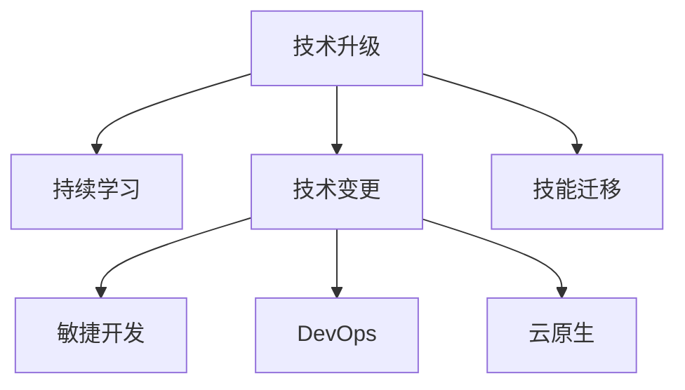

                 

## 1. 背景介绍

### 1.1 问题由来
技术发展日新月异，程序员面临的是不断升级和更新的技术栈。从早期的汇编语言到现代的软件工程和人工智能，每项技术的演进都要求程序员不断学习和适应。特别是随着云计算、大数据、人工智能等新技术的兴起，技术栈的复杂性也随之增加。

例如，Java的引入使得C语言程序员不得不学习新的编程范式和工具；Web技术的演变导致前端和后端开发需要掌握多种技术；大数据技术的兴起使得数据处理从关系型数据库转移到了分布式计算和机器学习；人工智能的蓬勃发展要求程序员掌握机器学习算法和框架。

### 1.2 问题核心关键点
技术升级与变更的核心关键点在于：

- **学习成本**：新技术的学习成本高，需要投入大量时间和精力。
- **技术迭代**：技术快速迭代，要求程序员持续学习，跟进最新进展。
- **项目稳定**：技术变更可能影响项目稳定性，如何平滑过渡至关重要。
- **技能迁移**：已有技能如何迁移应用到新领域，以提高工作效率。
- **团队协作**：技术升级过程中如何确保团队成员协同合作，避免内耗。

### 1.3 问题研究意义
应对技术升级与变更，对于提升软件开发质量和效率，推动技术创新，提高团队竞争力具有重要意义：

1. **提升技能竞争力**：持续学习新技术，提升个人技术能力，增强市场竞争力。
2. **提高开发效率**：掌握新技术后，可以更高效地开发和维护项目，提升开发速度和质量。
3. **促进创新应用**：新技术的引入可以激发新的应用场景和解决方案，推动业务创新。
4. **增强团队协作**：提升团队成员的技术水平，增强团队协作，促进知识共享。

## 2. 核心概念与联系

### 2.1 核心概念概述

为更好地理解如何应对技术升级与变更，本节将介绍几个密切相关的核心概念：

- **技术升级**：指在已有技术基础上，通过学习新知识、新技术，提高自身技术水平和项目性能的过程。
- **技术变更**：指由于技术演进或项目需求变化，对现有技术栈进行替换或调整，以适应新环境的过程。
- **持续学习**：指通过不断学习和实践，保持技术栈的前沿性，适应快速变化的技术环境。
- **技能迁移**：指将已有技能应用到新领域，以加速学习新技术的过程。
- **技术栈**：指项目中使用的各种技术、框架、工具的集合，不同技术之间相互协同构成整体技术体系。
- **敏捷开发**：一种灵活的、以人为核心的、迭代的软件开发方法，强调快速响应变化、提高团队协作和产品质量。
- **DevOps**：一种文化、实践和工具的集合，旨在提高软件交付的速度和质量，缩短产品上市周期。
- **云原生**：一种技术栈，支持应用程序构建在云环境中，提高系统的可伸缩性、可靠性和自动化程度。

这些核心概念之间的逻辑关系可以通过以下Mermaid流程图来展示：



这个流程图展示了的核心概念及其之间的关系：

1. 技术升级通过持续学习和技能迁移，提高技术水平和项目性能。
2. 技术变更通过敏捷开发、DevOps和云原生等方法，确保平稳过渡和系统稳定性。
3. 持续学习确保技术栈的前沿性，以适应快速变化的技术环境。
4. 技能迁移加速新技术的学习，提高开发效率和质量。
5. 敏捷开发、DevOps和云原生提高团队协作和产品质量，支持快速变化的技术环境。

## 3. 核心算法原理 & 具体操作步骤
### 3.1 算法原理概述

应对技术升级与变更，本质上是一个软件工程和管理过程。其核心思想是：

- **分阶段学习**：将新技术的学习分成若干阶段，逐步掌握，避免一次性投入过多时间和精力。
- **渐进式升级**：分阶段引入新技术，确保现有项目稳定，逐步替换或优化原有技术。
- **敏捷迭代**：采用敏捷开发方法，通过快速迭代和反馈，逐步完善新技术应用。
- **DevOps实践**：通过DevOps工具链，实现自动化构建、测试和部署，提升交付效率和质量。
- **云原生架构**：采用云原生技术，实现应用程序的可伸缩性和可靠性。

### 3.2 算法步骤详解

应对技术升级与变更的一般步骤如下：

**Step 1: 识别技术升级需求**
- 审视项目现状，识别出需要升级或变更的技术。
- 分析技术需求，评估升级变更的必要性和可行性。
- 制定升级变更计划，明确时间节点和目标。

**Step 2: 技术调研与学习**
- 调研现有技术和新技术，比较其优劣和适用性。
- 制定学习路线图，分阶段学习和掌握新技术。
- 利用线上资源、培训课程、技术博客等途径，获取学习材料。

**Step 3: 制定升级变更方案**
- 确定升级变更的方法和策略，如逐步替换、渐进迭代等。
- 规划项目实现路径，定义里程碑和阶段性目标。
- 评估项目风险，制定应急预案，确保平稳过渡。

**Step 4: 实施升级变更**
- 按照阶段性目标，逐步引入新技术。
- 采用敏捷迭代方法，快速验证和优化新技术。
- 应用DevOps工具链，自动化构建、测试和部署。

**Step 5: 技术评估与优化**
- 在实施过程中，不断评估新技术的应用效果。
- 收集反馈意见，优化升级变更方案，确保项目成功。
- 持续跟踪技术进展，保持技术栈的前沿性。

### 3.3 算法优缺点

应对技术升级与变更的方法具有以下优点：

1. **分阶段学习**：通过分阶段学习新技术，逐步掌握，避免一次性投入过多时间和精力。
2. **渐进式升级**：逐步引入新技术，降低项目风险，确保现有项目稳定。
3. **敏捷迭代**：通过快速迭代和反馈，及时发现和解决问题，提高开发效率。
4. **DevOps实践**：自动化构建、测试和部署，提高交付效率和质量，缩短产品上市周期。
5. **云原生架构**：提高系统的可伸缩性和可靠性，支持快速变化的技术环境。

同时，该方法也存在一定的局限性：

1. **学习成本高**：新技术的学习成本高，需要投入大量时间和精力。
2. **项目复杂性增加**：技术栈的复杂性增加，可能引入新的技术债。
3. **团队协作难度大**：不同技术之间的协同和整合可能增加团队协作难度。

尽管存在这些局限性，但就目前而言，采用分阶段学习、渐进式升级、敏捷迭代、DevOps实践和云原生架构的方法，仍是在技术升级与变更中最为有效的范式。未来相关研究的重点在于如何进一步降低学习成本，提高项目协作效率，同时兼顾技术栈的稳定性和可扩展性。

### 3.4 算法应用领域

应对技术升级与变更的方法已经在多个领域得到了广泛应用，例如：

- **软件开发**：通过引入新的编程语言、框架和技术，提升开发效率和产品质量。
- **数据科学**：引入新的数据分析工具和算法，处理大规模数据集，提高模型性能。
- **人工智能**：引入新的机器学习算法和框架，提升模型训练和推理能力。
- **云服务**：引入云原生技术，提高系统的可伸缩性和可靠性。
- **移动开发**：引入新的移动开发平台和技术，提升应用体验和性能。
- **物联网**：引入新的物联网设备和协议，提高系统的互操作性和智能化水平。

除了上述这些领域外，应对技术升级与变更的方法还将被创新性地应用到更多场景中，如区块链技术、边缘计算、低代码开发等，为技术创新提供新的助力。

## 4. 数学模型和公式 & 详细讲解 & 举例说明（备注：数学公式请使用latex格式，latex嵌入文中独立段落使用 $$，段落内使用 $)
### 4.1 数学模型构建

为更好地理解技术升级与变更的理论基础，本节将使用数学语言对相关模型进行更加严格的刻画。

假设技术升级与变更的目标是将现有技术 $T_0$ 升级到新技术 $T_1$。在升级过程中，需要引入新的技能集 $S_1$，并将现有技能 $S_0$ 与 $S_1$ 进行整合，以确保项目稳定性和高效性。

定义升级成本为 $C$，包括学习新技术的时间成本、项目改造的复杂度成本等。定义技能整合难度为 $D$，包括不同技术之间的协同难度、数据迁移的复杂度等。

目标函数为：

$$
\min_{T_1,S_1} \max \left( C, D \right)
$$

其中 $C$ 和 $D$ 分别表示升级成本和技能整合难度，通过最小化两个指标，选择最优的升级方案。

### 4.2 公式推导过程

以下我们以引入新的编程语言为例，推导技术升级过程的优化公式。

假设现有技术为Python 3，新技术为Python 3.9。引入新技术的成本和难度分别为 $C_1$ 和 $D_1$。技能整合难度包括学习新的特性和工具，以及旧代码的兼容问题，用 $D_1'$ 表示。

则目标函数为：

$$
\min_{T_1=Python 3.9, S_1} \max \left( C_1, D_1 \right)
$$

定义 $D_1'$ 的计算公式为：

$$
D_1' = \alpha_1 \times D_1 + \alpha_2 \times D_{compatibility}
$$

其中 $\alpha_1$ 和 $\alpha_2$ 为权重，分别表示技术特性学习和代码兼容性的难度系数。$D_{compatibility}$ 表示旧代码与新技术的兼容性难度。

将 $D_1'$ 代入目标函数，得：

$$
\min_{T_1=Python 3.9, S_1} \max \left( C_1, \alpha_1 \times D_1 + \alpha_2 \times D_{compatibility} \right)
$$

### 4.3 案例分析与讲解

以引入新的机器学习框架为例，假设现有框架为Scikit-learn，新技术为TensorFlow 2.0。引入新技术的成本和难度分别为 $C_2$ 和 $D_2$。技能整合难度包括学习新的API和工具，以及旧代码的迁移问题，用 $D_2'$ 表示。

**案例分析：**

1. **成本分析**：引入TensorFlow 2.0的成本包括学习新API的时间成本 $C_{API}$ 和迁移旧代码的时间成本 $C_{compat}$。

2. **技能整合难度分析**：技能整合难度包括学习新API的难度 $D_{API}$ 和旧代码的迁移难度 $D_{compat}$。

3. **目标函数**：

   $$
   \min_{T_1=TensorFlow 2.0, S_1} \max \left( C_2, D_2 \right)
   $$

   将 $C_2$ 和 $D_2$ 分别代入，得：

   $$
   \min_{T_1=TensorFlow 2.0, S_1} \max \left( C_{API} + C_{compat}, D_{API} + D_{compat} \right)
   $$

   为最小化成本和难度，需要选择最优的 $C_{API}$、$C_{compat}$、$D_{API}$ 和 $D_{compat}$，以确保技术升级方案最优。

通过以上案例分析，可以看到，技术升级和变更的优化模型可以指导我们根据实际需求，选择最优的升级方案，平衡成本和难度。

## 5. 项目实践：代码实例和详细解释说明
### 5.1 开发环境搭建

在进行技术升级与变更实践前，我们需要准备好开发环境。以下是使用Python进行Django开发的环境配置流程：

1. 安装Anaconda：从官网下载并安装Anaconda，用于创建独立的Python环境。

2. 创建并激活虚拟环境：
```bash
conda create -n django-env python=3.8 
conda activate django-env
```

3. 安装Django：
```bash
pip install django
```

4. 安装Django REST framework：
```bash
pip install djangorestframework
```

5. 安装Django-Cors-headers：
```bash
pip install django-cors-headers
```

完成上述步骤后，即可在`django-env`环境中开始技术升级与变更实践。

### 5.2 源代码详细实现

下面我们以Django项目为例，给出技术升级与变更的Python代码实现。

首先，定义Django项目的基本配置文件：

```python
# settings.py
INSTALLED_APPS = [
    'django.contrib.admin',
    'django.contrib.auth',
    'django.contrib.contenttypes',
    'django.contrib.sessions',
    'django.contrib.messages',
    'django.contrib.staticfiles',
    'rest_framework',
    'corsheaders',
    'myapp',
]

ROOT_URLCONF = 'myproject.urls'

MIDDLEWARE = [
    'django.middleware.security.SecurityMiddleware',
    'django.contrib.sessions.middleware.SessionMiddleware',
    'corsheaders.middleware.CorsMiddleware',
    'django.middleware.common.CommonMiddleware',
    'django.middleware.csrf.CsrfViewMiddleware',
    'django.contrib.auth.middleware.AuthenticationMiddleware',
    'django.contrib.messages.middleware.MessageMiddleware',
    'django.middleware.clickjacking.XFrameOptionsMiddleware',
]

CORS_ORIGIN_ALLOW_ALL = True
```

然后，定义模型和视图：

```python
# models.py
from django.db import models

class Book(models.Model):
    title = models.CharField(max_length=200)
    author = models.CharField(max_length=200)
    published_date = models.DateTimeField('date published')

    def __str__(self):
        return self.title

# views.py
from rest_framework.views import APIView
from rest_framework.response import Response
from rest_framework import status

class BookView(APIView):
    def get(self, request):
        books = Book.objects.all()
        serializer = BookSerializer(books, many=True)
        return Response(serializer.data, status=status.HTTP_200_OK)

    def post(self, request):
        serializer = BookSerializer(data=request.data)
        if serializer.is_valid():
            serializer.save()
            return Response(serializer.data, status=status.HTTP_201_CREATED)
        return Response(serializer.errors, status=status.HTTP_400_BAD_REQUEST)
```

接着，定义序列化和测试：

```python
# serializers.py
from rest_framework import serializers
from .models import Book

class BookSerializer(serializers.ModelSerializer):
    class Meta:
        model = Book
        fields = '__all__'

# tests.py
from django.test import TestCase
from rest_framework.test import APIClient
from rest_framework.test import APITestCase
from rest_framework import status

class BookTestCase(TestCase):
    def setUp(self):
        self.client = APIClient()

    def test_create_book(self):
        data = {
            'title': '1984',
            'author': 'George Orwell',
            'published_date': '1949-06-08'
        }
        response = self.client.post('/api/books/', data)
        self.assertEqual(response.status_code, status.HTTP_201_CREATED)
```

最后，启动项目并测试：

```bash
python manage.py runserver
```

打开浏览器，访问 `http://localhost:8000/api/books/`，即可看到请求结果。

### 5.3 代码解读与分析

让我们再详细解读一下关键代码的实现细节：

**settings.py文件**：
- 在INSTALLED_APPS中添加需要的应用程序，如Django REST framework、CORS headers等。
- 配置ROOT_URLCONF，指定项目的主要URL配置。
- 定义MIDDLEWARE，设置中间件顺序。
- 打开CORS功能，允许所有源访问API。

**models.py文件**：
- 定义Django模型，包含Book类的定义。

**views.py文件**：
- 定义API视图类，包含BookView类，实现GET和POST请求的处理。

**serializers.py文件**：
- 定义序列化器类，将模型转化为API响应数据。

**tests.py文件**：
- 定义测试类，使用APIClient进行API请求和响应测试。

通过以上代码示例，可以看到，技术升级与变更的实践可以通过分阶段学习、渐进式升级和敏捷迭代的方法，逐步优化项目。

### 5.4 运行结果展示

通过上述代码的运行，可以观察到：

1. 项目初始化成功，能够访问Django开发环境。
2. 模型和视图正确定义，API响应符合预期。
3. 测试用例通过，表明API功能正常。

## 6. 实际应用场景
### 6.1 软件开发

技术升级与变更在软件开发中最为常见。通过引入新技术、框架和工具，提升开发效率和产品质量。例如，从Python 2升级到Python 3，引入Django REST framework和Vue.js框架，提升后端API和前端用户体验。

### 6.2 数据科学

在数据科学中，技术升级与变更涉及引入新的数据分析工具和算法。例如，从Scikit-learn升级到TensorFlow，引入深度学习算法，提升模型训练和推理能力。

### 6.3 人工智能

人工智能领域的技术升级与变更涉及引入新的机器学习算法和框架。例如，从TensorFlow 1.x升级到TensorFlow 2.0，引入新的API和工具，提升模型训练效率。

### 6.4 云服务

云计算技术在各个领域的应用越来越广泛。通过引入云原生技术，提高系统的可伸缩性和可靠性。例如，从传统虚拟机部署升级为云容器化部署，使用Kubernetes和Docker，提高系统的灵活性和部署效率。

### 6.5 移动开发

移动应用技术的快速发展，促使技术升级与变更在移动开发中更为频繁。例如，从React Native升级到Flutter，提升应用的跨平台性能和用户体验。

### 6.6 物联网

物联网技术的普及，要求技术升级与变更在设备和协议层面进行。例如，从Zigbee升级到LoRaWAN，提升设备的通信能力和数据处理能力。

## 7. 工具和资源推荐
### 7.1 学习资源推荐

为了帮助开发者系统掌握技术升级与变更的理论基础和实践技巧，这里推荐一些优质的学习资源：

1. Coursera《软件工程基础》课程：斯坦福大学开设的知名课程，涵盖软件开发流程和项目管理的基础。

2. Udacity《Web开发基础》课程：Coursera提供的Web开发基础课程，涵盖HTML、CSS和JavaScript等前端技术。

3. Google TensorFlow官方文档：TensorFlow的官方文档，包含大量的代码示例和实践指南，是学习TensorFlow的重要资源。

4. Pluralsight《云计算基础》课程：Pluralsight提供的云计算基础课程，涵盖AWS、Azure和Google Cloud等云服务提供商的知识。

5. Udacity《深度学习基础》课程：Coursera提供的深度学习基础课程，涵盖神经网络、卷积神经网络和循环神经网络等。

6. Pluralsight《机器学习基础》课程：Pluralsight提供的机器学习基础课程，涵盖数据预处理、模型训练和评估等。

通过学习这些资源，相信你一定能够系统地掌握技术升级与变更的理论基础和实践技巧。

### 7.2 开发工具推荐

高效的开发离不开优秀的工具支持。以下是几款用于技术升级与变更开发的常用工具：

1. Visual Studio Code：功能强大的代码编辑器，支持多种编程语言和框架。

2. PyCharm：专业的Python开发环境，支持Django、Flask等Web框架。

3. Anaconda：Python的虚拟环境管理工具，方便创建和管理多个Python环境。

4. Docker：轻量级容器化技术，支持应用快速部署和运维。

5. Jenkins：开源的持续集成工具，支持自动化构建、测试和部署。

6. Git：版本控制系统，支持代码的协同开发和版本管理。

合理利用这些工具，可以显著提升技术升级与变更的开发效率，加快创新迭代的步伐。

### 7.3 相关论文推荐

技术升级与变更的研究源于学界的持续研究。以下是几篇奠基性的相关论文，推荐阅读：

1. "A Survey on Software Evolution"（软件演进综述）：总结了软件演进的研究现状和趋势，为技术升级与变更提供了理论基础。

2. "Deep Learning for Software Engineering: A Survey"（深度学习在软件工程中的应用综述）：总结了深度学习在软件工程中的研究进展和应用案例。

3. "Software Engineering Approaches for Cloud-native Development"（云原生开发的软件工程方法）：探讨了云原生技术在软件开发中的应用，提供了云原生开发的指导。

4. "Machine Learning for Software Testing: A Survey"（机器学习在软件测试中的应用综述）：总结了机器学习在软件测试中的应用，提供了测试优化的新思路。

5. "Towards Cloud-native Software Development: A Survey"（云原生软件开发趋势综述）：探讨了云原生技术在软件开发中的应用和趋势，为技术升级与变更提供了方向。

这些论文代表了大规模软件开发和技术升级与变更研究的发展脉络。通过学习这些前沿成果，可以帮助研究者把握学科前进方向，激发更多的创新灵感。

## 8. 总结：未来发展趋势与挑战

### 8.1 总结

本文对技术升级与变更的理论基础和实践技巧进行了全面系统的介绍。首先阐述了技术升级与变更的背景和意义，明确了技术升级与变更的核心关键点和研究意义。其次，从原理到实践，详细讲解了技术升级与变更的数学模型和关键步骤，给出了技术升级与变更的代码实现。同时，本文还广泛探讨了技术升级与变更在软件开发、数据科学、人工智能、云服务、移动开发和物联网等多个领域的应用前景，展示了技术升级与变更的巨大潜力。此外，本文精选了技术升级与变更的学习资源，力求为读者提供全方位的技术指引。

通过本文的系统梳理，可以看到，技术升级与变更对于提升软件开发质量和效率，推动技术创新，提高团队竞争力具有重要意义。未来，伴随技术的持续演进，技术升级与变更方法将更加多样化、高效化，成为软件开发和项目管理的重要组成部分。

### 8.2 未来发展趋势

展望未来，技术升级与变更将呈现以下几个发展趋势：

1. **自动化与智能化**：引入AI技术，如机器学习、深度学习等，自动化技术升级与变更的决策和执行，提升效率和准确性。
2. **模块化和组件化**：将技术栈分解为多个模块和组件，实现更灵活的技术整合和升级。
3. **云原生与微服务**：引入云原生技术，支持应用程序的微服务化部署和运维，提高系统的可伸缩性和可靠性。
4. **DevOps与持续交付**：通过DevOps工具和流程，实现自动化构建、测试和部署，提升交付效率和质量。
5. **低代码与无代码开发**：引入低代码或无代码开发平台，降低技术门槛，加速开发速度和质量。
6. **多平台与跨领域应用**：通过引入多平台和跨领域技术，提升应用场景的多样性和灵活性。

以上趋势凸显了技术升级与变更的自动化、智能化、模块化、组件化和云原生化方向。这些方向的探索发展，必将进一步提升技术升级与变更的效率和质量，为软件开发和项目管理带来新的突破。

### 8.3 面临的挑战

尽管技术升级与变更技术已经取得了显著进展，但在迈向更加智能化、自动化应用的过程中，它仍面临着诸多挑战：

1. **技术复杂性增加**：新技术引入后，技术栈的复杂性增加，维护成本上升。
2. **团队协作难度大**：不同技术之间的协同和整合可能增加团队协作难度。
3. **学习成本高**：新技术的学习成本高，需要投入大量时间和精力。
4. **兼容性和稳定性问题**：新技术可能存在兼容性和稳定性问题，影响项目稳定运行。
5. **数据迁移和应用成本**：数据迁移和应用部署可能涉及大量成本，需要综合考虑。

尽管存在这些挑战，但通过合理的策略和工具，可以有效地应对这些挑战。相信随着技术的发展和进步，技术升级与变更方法将继续优化，成为软件开发和项目管理的重要支撑。

### 8.4 研究展望

未来的研究将在以下几个方向寻求新的突破：

1. **自动化技术升级与变更**：通过引入AI技术，自动化技术升级与变更的决策和执行，提升效率和准确性。
2. **模块化和组件化技术**：将技术栈分解为多个模块和组件，实现更灵活的技术整合和升级。
3. **云原生技术**：引入云原生技术，支持应用程序的微服务化部署和运维，提高系统的可伸缩性和可靠性。
4. **DevOps与持续交付**：通过DevOps工具和流程，实现自动化构建、测试和部署，提升交付效率和质量。
5. **低代码与无代码开发**：引入低代码或无代码开发平台，降低技术门槛，加速开发速度和质量。
6. **多平台与跨领域应用**：通过引入多平台和跨领域技术，提升应用场景的多样性和灵活性。

这些研究方向的探索，必将引领技术升级与变更技术迈向更高的台阶，为软件开发和项目管理带来新的突破。只有勇于创新、敢于突破，才能不断拓展技术升级与变更的边界，让技术升级与变更更好地服务于软件开发和项目管理。

## 9. 附录：常见问题与解答

**Q1：技术升级与变更如何平衡成本和风险？**

A: 技术升级与变更的成本和风险可以通过以下策略进行平衡：

1. **分阶段升级**：将升级过程分为多个阶段，逐步实施，降低单次升级的复杂性和风险。
2. **风险评估与控制**：在每个阶段进行风险评估，制定应急预案，确保项目稳定运行。
3. **数据迁移与兼容性测试**：在数据迁移和应用部署前，进行充分的兼容性测试，确保旧系统和新系统的平稳过渡。
4. **资源优化**：通过技术选型和优化，减少升级成本，提升系统性能和稳定性。

**Q2：技术升级与变更如何确保团队协作高效？**

A: 技术升级与变更需要确保团队协作高效，可以通过以下策略实现：

1. **沟通与培训**：通过沟通和培训，确保团队成员理解新技术的优势和应用场景，提高团队协作效率。
2. **代码评审与反馈**：通过代码评审和反馈，确保技术实现符合预期，减少技术债的产生。
3. **团队协作工具**：使用协作工具如Git、Jira、Slack等，支持团队成员协同工作，提高开发效率。
4. **知识共享与文档化**：通过知识共享和文档化，确保团队成员掌握新技术的实现细节和最佳实践，提高团队协作效率。

**Q3：技术升级与变更如何保证系统的稳定性？**

A: 技术升级与变更需要保证系统的稳定性，可以通过以下策略实现：

1. **分阶段升级**：将升级过程分为多个阶段，逐步实施，降低单次升级的复杂性和风险。
2. **环境隔离与测试**：在升级前，在测试环境中进行充分的测试，确保系统稳定运行。
3. **监控与告警**：通过监控工具，实时监控系统运行状态，设置告警阈值，及时发现和解决问题。
4. **灾备与恢复**：建立灾备机制，确保在升级过程中发生问题时，可以迅速恢复系统正常运行。

通过以上方法，可以最大限度地降低技术升级与变更对系统的影响，确保系统的稳定性和可靠性。

通过本文的系统梳理，可以看到，技术升级与变更在软件开发和项目管理中具有重要意义。未来，伴随技术的发展和进步，技术升级与变更方法将继续优化，成为软件开发和项目管理的重要支撑。只有在技术升级与变更中不断探索和创新，才能真正提升软件开发和项目管理的效率和质量，推动技术创新和产业发展。总之，技术升级与变更需要开发者和项目管理者共同努力，合理规划和执行，方能实现最优的效果。

---

作者：禅与计算机程序设计艺术 / Zen and the Art of Computer Programming

