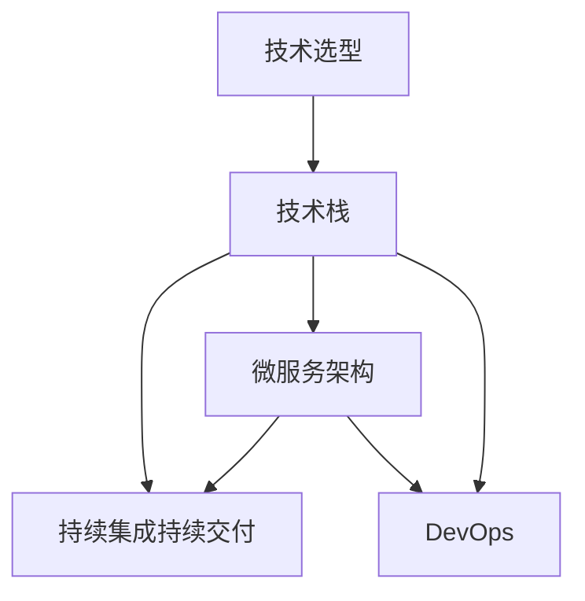

                 

# 程序员如何应对技术栈快速更新

技术栈的快速更新是每个程序员在日常工作中所面对的常态。随着互联网的迅猛发展，新技术、新框架、新工具层出不穷，如何高效应对这些变化，保持技术的领先，是每个程序员必须掌握的重要技能。本文将从背景介绍、核心概念与联系、核心算法原理与具体操作步骤、数学模型与公式讲解、项目实践、应用场景、工具和资源推荐、总结与未来展望等多个角度，深入探讨程序员如何应对技术栈的快速更新。

## 1. 背景介绍

### 1.1 问题由来
互联网行业的快速迭代和竞争加剧，使得技术更新换代的速度明显加快。无论是前端还是后端，无论是数据科学还是人工智能，技术的更新迭代无时无刻不在进行。这些变化不仅要求程序员保持持续学习的能力，还需要具备快速适应的技巧。对于技术栈的变化，如何做到既能掌握核心技术，又能兼顾新技术的尝试，是每个程序员面临的巨大挑战。

### 1.2 问题核心关键点
技术栈快速更新的核心关键点在于：
1. 持续学习：技术栈的更新迭代速度快，必须持续学习新技术，保持知识更新。
2. 多任务处理：现代项目通常需要多个技术栈的支持，需要兼顾多个技术的学习。
3. 快速适应：新技术出现后，需要快速理解并应用到实际项目中。
4. 技术评估：评估新技术的优劣，选择最适合项目需求的技术栈。

### 1.3 问题研究意义
研究如何应对技术栈的快速更新，对于提高开发效率、降低技术风险、提升项目质量，具有重要意义：

1. 提高开发效率：快速适应新技术，可以显著提升开发速度，缩短项目周期。
2. 降低技术风险：评估和选择新技术，可以减少技术引入的风险和成本。
3. 提升项目质量：新技术往往带来更高的性能和更优的用户体验，有助于提升项目整体质量。
4. 赋能技术创新：新技术的尝试和应用，可以促进技术创新，推动业务发展。

## 2. 核心概念与联系

### 2.1 核心概念概述

为更好地理解如何应对技术栈快速更新，本节将介绍几个密切相关的核心概念：

- 技术栈(Technology Stack)：指一个项目或应用所使用的所有技术和工具的集合，包括编程语言、框架、库、中间件、数据库等。
- 持续集成持续交付(CI/CD)：通过自动化测试和部署，加速技术更新迭代。
- 微服务架构(Microservices)：将应用拆分为多个小服务，便于独立开发、测试和部署。
- DevOps：强调开发与运维的紧密结合，提升软件交付速度和质量。
- 技术选型(technology selection)：评估和选择最适合项目需求的技术栈。

这些核心概念之间的逻辑关系可以通过以下Mermaid流程图来展示：



这个流程图展示了这个领域的核心概念及其之间的关系：

1. 技术栈是基础。
2. 持续集成持续交付加速技术更新。
3. 微服务架构提升系统的可扩展性和可维护性。
4. DevOps确保开发和运维的紧密协作。
5. 技术选型基于项目需求和技术栈的特点。

这些概念共同构成了技术更新的基础框架，使得技术栈的快速更新成为可能。

## 3. 核心算法原理 & 具体操作步骤
### 3.1 算法原理概述

应对技术栈快速更新的核心在于，如何快速学习、评估、选择和应用新技术。这涉及到技术栈的构建、持续学习、技术评估和部署等环节。

### 3.2 算法步骤详解

应对技术栈快速更新的基本步骤包括：

**Step 1: 技术选型**
- 评估项目需求，明确技术栈的必须性和可选性。
- 分析现有技术栈的优缺点，考虑新引入的技术的可行性。
- 综合考虑技术栈的稳定性、性能、可扩展性等因素。

**Step 2: 学习新技术**
- 选择权威的学习资源，如官方文档、开源社区、技术博客等。
- 使用模拟器、沙箱、实验环境等，模拟实际应用场景。
- 参与开源项目、技术论坛、黑客马拉松等活动，提升实战能力。

**Step 3: 评估新技术**
- 进行原型开发，验证新技术在项目中的适用性。
- 进行性能测试，对比新旧技术的性能差异。
- 收集用户反馈，评估新技术对用户体验的影响。

**Step 4: 部署新技术**
- 设计技术方案，明确新旧技术如何平滑过渡。
- 进行技术迁移，逐步引入新技术到实际项目中。
- 使用CI/CD流程，自动化测试和部署，减少人工错误。

**Step 5: 持续优化**
- 监控技术性能，收集和分析反馈。
- 定期进行技术更新，保持技术栈的前沿性。
- 优化代码结构，提升系统性能和可维护性。

### 3.3 算法优缺点

快速应对技术栈更新的方法具有以下优点：
1. 提升开发效率：快速学习和应用新技术，缩短项目周期。
2. 降低技术风险：通过评估和选择，减少技术引入的风险。
3. 提升项目质量：新引入的技术往往带来更高的性能和更好的用户体验。
4. 促进技术创新：不断尝试和应用新技术，推动技术进步。

但同时，该方法也存在一定的局限性：
1. 学习成本高：新技术的掌握需要时间和精力，可能会影响现有项目的进度。
2. 技术兼容性问题：新旧技术可能存在兼容性问题，需要进行额外的调试。
3. 技术栈复杂度增加：频繁引入新技术可能导致技术栈复杂度增加，维护难度上升。
4. 过度依赖新技术：过度依赖新技术可能导致项目的稳定性下降。

尽管存在这些局限性，但就目前而言，快速学习和应用新技术的方法仍是应对技术栈快速更新的有效手段。未来相关研究的重点在于如何更好地评估和选择新技术，降低学习成本，同时兼顾技术栈的稳定性和可维护性。

### 3.4 算法应用领域

快速应对技术栈更新的方法在软件开发、运维、数据分析、人工智能等诸多领域都有广泛的应用：

- 软件开发：在软件开发中，新技术的引入能够提升开发效率，缩短产品上市时间。如JavaScript、Node.js等新技术在Web开发中的应用。
- 运维管理：通过微服务、DevOps等技术，提升系统的可扩展性和运维效率。如Kubernetes、Docker等容器技术在分布式系统中的应用。
- 数据分析：大数据、数据湖等新技术使得数据处理和分析变得更加高效和智能。如Spark、Hadoop等大数据技术的应用。
- 人工智能：深度学习、自然语言处理等新技术为AI应用提供了新的可能性。如TensorFlow、PyTorch等框架的应用。

除了上述这些领域，快速应对技术栈更新的方法也在更多场景中得到应用，如移动应用开发、物联网、区块链等，为技术创新提供了新的动力。

## 4. 数学模型和公式 & 详细讲解 & 举例说明

### 4.1 数学模型构建

为更好地理解快速更新技术栈的方法，本节将使用数学语言对相关模型进行描述。

假设技术栈的选择过程可以分为n个步骤，每个步骤的选择概率为$p_i$，其中$i=1,2,...,n$。则技术栈的选择概率分布为：

$$
P(\theta)=\sum_{i=1}^n p_i\delta(\theta-\theta_i)
$$

其中$\theta_i$表示第i个技术栈的参数，$\delta(\cdot)$为狄拉克$\delta$函数，表示选择第i个技术栈的概率为$p_i$。

选择技术栈的过程可以看作是一个随机过程，其期望值为：

$$
E[\theta]=\sum_{i=1}^n p_i\theta_i
$$

### 4.2 公式推导过程

选择技术栈的过程可以视为一个马尔科夫过程，其状态为$\theta_i$，状态转移概率为$p_i$。推导该过程的期望值，可以通过以下公式：

$$
E[\theta]=\sum_{i=1}^n p_i\theta_i
$$

在实际应用中，我们可以通过实验数据来估计$p_i$和$\theta_i$，从而计算出期望值$E[\theta]$。

### 4.3 案例分析与讲解

以Web前端技术栈为例，我们可以分析各个技术的优势和劣势，并进行选择：

- 初始技术栈：使用JavaScript和React构建。
- 引入新技术：考虑使用Vue或Angular等替代React。
- 技术评估：通过对比不同技术的性能、易用性和社区支持，进行评估。
- 选择新栈：根据评估结果，选择最优的技术栈。

假设最终选择Vue作为新栈，那么其期望值$E[\theta]$可以通过实验数据来估计。

## 5. 项目实践：代码实例和详细解释说明
### 5.1 开发环境搭建

在开始实践之前，我们需要准备好开发环境。以下是使用Python进行Web开发的环境配置流程：

1. 安装Anaconda：从官网下载并安装Anaconda，用于创建独立的Python环境。

2. 创建并激活虚拟环境：
```bash
conda create -n web-dev python=3.8 
conda activate web-dev
```

3. 安装Flask：
```bash
pip install flask
```

4. 安装Flask-RESTful：
```bash
pip install flask-restful
```

5. 安装Gunicorn：
```bash
pip install gunicorn
```

完成上述步骤后，即可在`web-dev`环境中开始Web开发实践。

### 5.2 源代码详细实现

以下是一个使用Flask和SQLAlchemy进行Web开发的代码示例：

```python
from flask import Flask, request
from flask_sqlalchemy import SQLAlchemy

app = Flask(__name__)
app.config['SQLALCHEMY_DATABASE_URI'] = 'sqlite:///database.db'
db = SQLAlchemy(app)

class User(db.Model):
    id = db.Column(db.Integer, primary_key=True)
    name = db.Column(db.String(80), nullable=False)
    email = db.Column(db.String(120), unique=True, nullable=False)

@app.route('/')
def index():
    users = User.query.all()
    return {'users': [user.to_dict() for user in users]}

@app.route('/user', methods=['POST'])
def create_user():
    data = request.json
    new_user = User(name=data['name'], email=data['email'])
    db.session.add(new_user)
    db.session.commit()
    return {'message': 'User created successfully'}, 201

if __name__ == '__main__':
    db.create_all()
    app.run(debug=True)
```

这段代码实现了一个简单的Web API，包括获取所有用户和创建新用户的接口。

### 5.3 代码解读与分析

让我们再详细解读一下关键代码的实现细节：

**Flask初始化**：
- `app = Flask(__name__)`：创建Flask应用实例。
- `app.config['SQLALCHEMY_DATABASE_URI'] = 'sqlite:///database.db'`：设置SQLAlchemy数据库连接字符串。
- `db = SQLAlchemy(app)`：创建SQLAlchemy数据库实例。

**User模型**：
- `class User(db.Model):`：定义User模型。
- `id = db.Column(db.Integer, primary_key=True)`：定义主键。
- `name = db.Column(db.String(80), nullable=False)`：定义姓名字段，不允许为空。
- `email = db.Column(db.String(120), unique=True, nullable=False)`：定义电子邮件字段，要求唯一且不能为空。

**API接口**：
- `@app.route('/')`：定义获取所有用户的接口。
- `users = User.query.all()`：查询数据库中的所有用户。
- `return {'users': [user.to_dict() for user in users]}`：返回用户列表，其中每个用户都转换为字典形式。
- `@app.route('/user', methods=['POST'])`：定义创建新用户的接口。
- `new_user = User(name=data['name'], email=data['email'])`：创建新用户对象。
- `db.session.add(new_user)`：将新用户对象添加到数据库会话中。
- `db.session.commit()`：提交数据库会话，保存新用户。
- `return {'message': 'User created successfully'}, 201`：返回创建成功的响应。

完成以上步骤后，即可在`web-dev`环境中启动Web服务，并通过浏览器访问。

### 5.4 运行结果展示

启动Web服务后，可以在浏览器中访问`http://localhost:5000`，查看所有用户的列表。同时，通过向`http://localhost:5000/user`发送POST请求，可以创建新的用户。

## 6. 实际应用场景

### 6.1 软件开发

软件开发中的快速更新技术栈，可以提升开发效率，缩短项目周期。例如，在前端开发中，开发者可以通过学习React、Vue、Angular等新技术，替换原有的技术栈，提升界面性能和用户体验。

### 6.2 运维管理

运维管理中的技术更新，可以提升系统的可扩展性和运维效率。例如，通过引入Docker、Kubernetes等容器技术，可以将应用部署到云端，实现自动扩展和弹性伸缩。

### 6.3 数据分析

数据分析中的技术更新，可以提升数据处理和分析的效率和准确性。例如，通过引入Spark、Hadoop等大数据技术，可以处理大规模数据集，进行复杂的数据分析和机器学习。

### 6.4 人工智能

人工智能中的技术更新，可以提升模型的性能和应用范围。例如，通过引入TensorFlow、PyTorch等深度学习框架，可以构建复杂的神经网络模型，进行图像识别、自然语言处理等任务。

## 7. 工具和资源推荐

### 7.1 学习资源推荐

为了帮助开发者系统掌握快速更新技术栈的理论基础和实践技巧，这里推荐一些优质的学习资源：

1. Coursera《Web开发全栈课程》：由Google开发者提供，涵盖前端、后端、数据库等全栈开发技能。
2. Udacity《人工智能工程师纳米学位》：涵盖机器学习、深度学习、自然语言处理等AI技术。
3. edX《Python编程与数据科学微硕士》：由Harvard提供，涵盖Python编程、数据科学、机器学习等技能。
4. Kaggle：数据科学竞赛平台，提供大量开源数据集和代码示例，帮助开发者提升实战能力。
5. GitHub：开源代码托管平台，提供大量高质量代码和项目示例，帮助开发者学习新技术。

通过对这些资源的学习实践，相信你一定能够快速掌握快速更新技术栈的精髓，并用于解决实际的开发问题。

### 7.2 开发工具推荐

高效的开发离不开优秀的工具支持。以下是几款用于快速更新技术栈开发的常用工具：

1. Visual Studio Code：轻量级、功能强大的代码编辑器，支持多种编程语言和框架。
2. Git：版本控制系统，支持代码版本控制和协作开发。
3. Docker：容器化平台，支持应用的快速部署和扩展。
4. Kubernetes：容器编排工具，支持大规模应用的自动扩展和弹性伸缩。
5. Jupyter Notebook：交互式代码编辑器，支持Python、R等语言的交互式开发和数据可视化。
6. PyCharm：Java、Python等语言的集成开发环境，支持代码编辑、调试和测试。

合理利用这些工具，可以显著提升快速更新技术栈的开发效率，加快创新迭代的步伐。

### 7.3 相关论文推荐

快速更新技术栈的研究源于学界的持续研究。以下是几篇奠基性的相关论文，推荐阅读：

1. "Learning to Program with Hyper-learning"：提出超学习技术，用于提升程序自动化的效果。
2. "Software Evolution: How to Manage Change and Growth"：探讨软件演化的管理策略，提升代码的维护性和可扩展性。
3. "Continuous Learning in Software Engineering"：提出持续学习的思想，用于提升软件开发和维护的效率。
4. "Model-Based Evolution of Software Systems"：提出基于模型的演化技术，用于提升软件的演化和重构效率。
5. "Model-Driven Evolution"：提出模型驱动的演化技术，用于提升软件的演化和重构效率。

这些论文代表了大语言模型微调技术的发展脉络。通过学习这些前沿成果，可以帮助研究者把握学科前进方向，激发更多的创新灵感。

## 8. 总结：未来发展趋势与挑战

### 8.1 总结

本文对如何快速更新技术栈进行了全面系统的介绍。首先阐述了快速更新技术栈的背景和意义，明确了技术栈快速更新的关键点。其次，从原理到实践，详细讲解了技术栈快速更新的数学原理和关键步骤，给出了快速更新技术栈的完整代码实例。同时，本文还广泛探讨了快速更新技术栈在软件开发、运维管理、数据分析、人工智能等领域的实际应用，展示了快速更新技术栈的巨大潜力。此外，本文精选了快速更新技术栈的学习资源、开发工具和相关论文，力求为开发者提供全方位的技术指引。

通过本文的系统梳理，可以看到，快速更新技术栈的方法在软件开发、运维管理、数据分析、人工智能等诸多领域都有广泛的应用，为技术创新提供了新的动力。未来，伴随技术栈的不断更新和演进，相信快速更新技术栈必将在构建人机协同的智能时代中扮演越来越重要的角色。

### 8.2 未来发展趋势

展望未来，快速更新技术栈将呈现以下几个发展趋势：

1. 技术栈的复杂性增加：随着应用场景的多样化，技术栈的复杂度将不断增加，需要更灵活的编排和管理。
2. 自动化和智能化：自动化测试、持续集成、自动部署等技术将不断提升开发和运维的效率。
3. 多语言混合开发：多种编程语言和框架的混合使用将更加普遍，需要更强大的工具支持。
4. 云计算和大数据：云计算和大数据技术的应用将进一步提升应用的性能和扩展性。
5. 人工智能的融合：AI技术在软件开发、运维管理、数据分析等领域的融合将带来新的突破。

以上趋势凸显了快速更新技术栈的广阔前景。这些方向的探索发展，必将进一步提升软件开发和运维的效率，推动技术创新，满足日益复杂的应用需求。

### 8.3 面临的挑战

尽管快速更新技术栈已经取得了显著成效，但在迈向更加智能化、普适化应用的过程中，它仍面临诸多挑战：

1. 技术栈的稳定性：频繁更新技术栈可能导致系统的不稳定，需要更好地评估和选择。
2. 学习成本高：新技术的引入和学习需要时间和精力，可能会影响现有项目的进度。
3. 技术兼容性问题：新旧技术可能存在兼容性问题，需要进行额外的调试。
4. 过度依赖新技术：过度依赖新技术可能导致项目的稳定性下降。
5. 持续学习的压力：快速更新技术栈需要不断学习和适应，对开发者的能力要求更高。

尽管存在这些挑战，但通过合理的技术选型、持续学习和工具支持，可以逐步克服这些挑战，实现技术栈的快速更新。

### 8.4 研究展望

面向未来，快速更新技术栈的研究需要在以下几个方面寻求新的突破：

1. 开发更加智能的技术选择工具：开发智能化的工具，根据项目需求和历史数据，自动推荐最优的技术栈。
2. 优化新技术的引入流程：通过自动化测试、持续集成等技术，减少新技术引入的风险和成本。
3. 提升新技术的兼容性：开发新的工具和技术，解决新旧技术的兼容性问题。
4. 提高学习效率：开发更加高效的学习工具和方法，帮助开发者快速掌握新技术。
5. 引入AI技术：通过AI技术，提高技术栈的自动化和智能化水平。

这些研究方向的探索，必将引领快速更新技术栈技术迈向更高的台阶，为构建安全、可靠、可解释、可控的智能系统铺平道路。

## 9. 附录：常见问题与解答

**Q1：如何快速学习和应用新技术？**

A: 快速学习和应用新技术，需要以下几个步骤：
1. 选择权威的学习资源，如官方文档、开源社区、技术博客等。
2. 使用模拟器、沙箱、实验环境等，模拟实际应用场景。
3. 参与开源项目、技术论坛、黑客马拉松等活动，提升实战能力。

**Q2：如何选择最适合项目需求的技术栈？**

A: 选择最适合项目需求的技术栈，需要以下几个步骤：
1. 评估项目需求，明确技术栈的必须性和可选性。
2. 分析现有技术栈的优缺点，考虑新引入的技术的可行性。
3. 综合考虑技术栈的稳定性、性能、可扩展性等因素。

**Q3：如何减少新技术引入的风险？**

A: 减少新技术引入的风险，需要以下几个步骤：
1. 进行原型开发，验证新技术在项目中的适用性。
2. 进行性能测试，对比新旧技术的性能差异。
3. 收集用户反馈，评估新技术对用户体验的影响。

**Q4：如何快速部署新技术？**

A: 快速部署新技术，需要以下几个步骤：
1. 设计技术方案，明确新旧技术如何平滑过渡。
2. 进行技术迁移，逐步引入新技术到实际项目中。
3. 使用CI/CD流程，自动化测试和部署，减少人工错误。

---

作者：禅与计算机程序设计艺术 / Zen and the Art of Computer Programming

