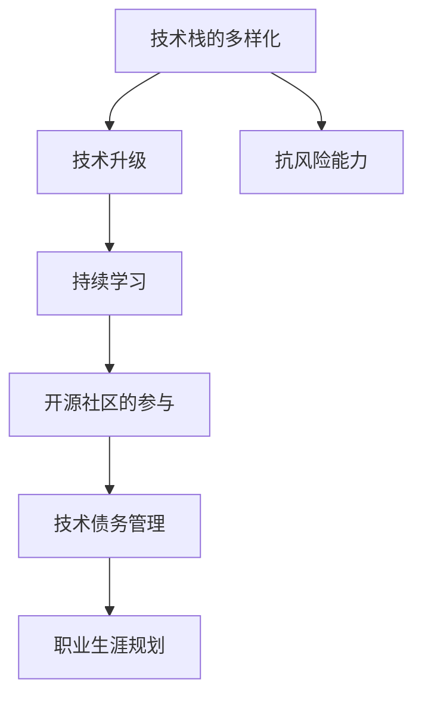

                 

# 程序员如何应对经济衰退

## 1. 背景介绍

随着全球经济下行压力的增大，许多国家和地区已经进入了经济衰退期。对于程序员而言，经济衰退不仅意味着公司的裁员风险增加，也带来了职业生涯的诸多不确定性。在这种情况下，程序员需要具备更加全面的技能和策略，以应对挑战，确保职业发展的稳定性和可持续性。

本文旨在探讨在经济衰退背景下，程序员应如何利用技术优势，提升个人竞争力和抗风险能力。通过系统梳理当前的技术趋势和实际案例，提出一系列实用的策略和建议，帮助程序员更好地适应经济衰退，确保职业发展的连续性和稳定性。

## 2. 核心概念与联系

### 2.1 核心概念概述

- **技术栈的多样化**：程序员需要具备多种技术栈的能力，以适应不同类型的工作需求。
- **持续学习**：面对快速变化的技术环境，持续学习和自我提升是程序员必不可少的技能。
- **开源社区的参与**：积极参与开源项目，不仅可以提升个人技术水平，还可以拓展职业网络。
- **技术债务管理**：有效管理技术债务，确保代码质量和项目进度，避免在经济衰退期间项目延期或质量下降。
- **职业生涯规划**：明确职业目标，制定长期和短期计划，以应对经济衰退带来的不确定性。

### 2.2 核心概念原理和架构的 Mermaid 流程图(Mermaid 流程节点中不要有括号、逗号等特殊字符)



这个流程图展示了技术栈多样化、持续学习、开源社区参与、技术债务管理和职业生涯规划之间的联系。通过这些策略的实施，程序员可以提升自身的抗风险能力，确保在经济衰退期间的职业稳定性。

## 3. 核心算法原理 & 具体操作步骤

### 3.1 算法原理概述

在经济衰退期间，程序员应聚焦于提升自身的技术能力和抗风险能力，确保在动荡的市场环境中保持竞争力。本文将介绍几种关键的算法原理和操作步骤，帮助程序员在技术栈多样化、持续学习、开源社区参与、技术债务管理和职业生涯规划等方面取得进展。

### 3.2 算法步骤详解

#### 3.2.1 技术栈的多样化

1. **选择合适的技术栈**：根据市场需求和个人兴趣，选择学习新的技术栈。例如，从Web开发转向云计算或人工智能。
2. **制定学习计划**：设定明确的学习目标和时间表，分解学习任务，逐步掌握新技能。
3. **实战项目实践**：通过实际项目实践新技能，积累经验，提升解决问题的能力。

#### 3.2.2 持续学习

1. **选择合适的学习资源**：包括在线课程、书籍、博客、视频等，确保学习内容的系统性和实用性。
2. **制定学习计划**：定期安排学习时间，确保持续进步。
3. **实践和反馈**：通过项目实践和代码审查，不断提升技术水平，并及时调整学习策略。

#### 3.2.3 开源社区的参与

1. **选择参与的开源项目**：选择与自身技术栈相关且活跃的开源项目。
2. **积极贡献代码**：通过提交代码、修复Bug、撰写文档等方式参与开源项目。
3. **建立职业网络**：在开源社区中积极交流和互动，拓展职业网络，提升个人品牌影响力。

#### 3.2.4 技术债务管理

1. **定期评估代码质量**：通过代码审查和自动化工具，及时发现和修复代码中的质量问题。
2. **优化代码结构**：通过重构和优化代码结构，提升代码的可维护性和扩展性。
3. **避免过度堆砌新技术**：在项目中合理应用新技术，避免因过度追求新技术而导致技术债务积累。

#### 3.2.5 职业生涯规划

1. **设定职业目标**：明确短期和长期的职业目标，如晋升、转岗、创业等。
2. **制定行动计划**：根据职业目标，制定具体的行动计划，包括技能提升、项目积累、网络拓展等。
3. **定期评估和调整**：定期回顾和评估职业发展情况，及时调整策略，确保职业路径的正确性。

### 3.3 算法优缺点

#### 3.3.1 技术栈的多样化

**优点**：
- 提升个人的多样化技能，增强市场竞争力。
- 增强对不同技术场景的理解和适应能力。

**缺点**：
- 需要大量时间和精力投入，短期内可能影响工作效率。
- 新技术的学习曲线较陡，初期可能存在一定挑战。

#### 3.3.2 持续学习

**优点**：
- 保持技术栈的更新和前沿，适应技术环境的变化。
- 提升个人技术水平和解决复杂问题的能力。

**缺点**：
- 学习过程中可能遇到瓶颈，需要持续的毅力和耐心。
- 学习资源和信息庞杂，需具备良好的信息筛选和判断能力。

#### 3.3.3 开源社区的参与

**优点**：
- 提升个人品牌和影响力，拓展职业网络。
- 获得实践机会和反馈，加速技能提升。

**缺点**：
- 需要投入时间和精力，平衡工作和学习。
- 参与社区需要良好的沟通和协作能力。

#### 3.3.4 技术债务管理

**优点**：
- 提升代码质量和项目稳定性，减少后续维护成本。
- 增强项目的可维护性和扩展性。

**缺点**：
- 需要投入额外的时间和精力，短期内可能影响项目进度。
- 管理不当可能导致技术债务积累，增加维护成本。

#### 3.3.5 职业生涯规划

**优点**：
- 明确职业目标，避免盲目发展。
- 制定具体的行动计划，提高职业发展的系统性和针对性。

**缺点**：
- 需要时间和精力进行规划和调整。
- 计划制定可能存在不确定性，需灵活应对变化。

### 3.4 算法应用领域

这些算法原理和技术操作步骤可以应用于多个领域，包括但不限于：

- **技术栈的多样化**：适用于转岗、职业转型和提升市场竞争力。
- **持续学习**：适用于职业发展、技能提升和应对技术环境变化。
- **开源社区的参与**：适用于拓展职业网络、提升技术水平和品牌影响力。
- **技术债务管理**：适用于提升项目质量和减少维护成本。
- **职业生涯规划**：适用于设定职业目标、制定行动计划和提升职业稳定性。

## 4. 数学模型和公式 & 详细讲解 & 举例说明

### 4.1 数学模型构建

在经济衰退期间，程序员需要制定一系列的数学模型来量化和评估自己的技术能力和职业发展情况。例如，可以通过以下模型来评估技术债务和持续学习的效果：

- **技术债务模型**：
  $$
  D = f(C_{code},C_{design},C_{maintenance})
  $$
  其中，$D$ 表示技术债务，$C_{code}$ 表示代码质量问题，$C_{design}$ 表示设计缺陷，$C_{maintenance}$ 表示维护成本。

- **持续学习效果模型**：
  $$
  E = g(T_{learn},P_{practice},F_{feedback})
  $$
  其中，$E$ 表示持续学习的效果，$T_{learn}$ 表示学习时间，$P_{practice}$ 表示实践机会，$F_{feedback}$ 表示反馈质量。

### 4.2 公式推导过程

- **技术债务模型推导**：
  $$
  D = \sum_{i=1}^{n} C_i \cdot W_i
  $$
  其中，$n$ 表示代码质量问题数量，$C_i$ 表示第$i$个问题的严重性，$W_i$ 表示问题权重，可以通过代码审查和自动化工具获取。

- **持续学习效果模型推导**：
  $$
  E = T_{learn} \cdot P_{practice} \cdot F_{feedback}
  $$
  其中，$T_{learn}$ 和 $P_{practice}$ 表示学习时间和实践机会，$F_{feedback}$ 表示反馈质量，可以通过项目实践和代码审查获取。

### 4.3 案例分析与讲解

**案例1：技术债务管理**

某公司正在进行大规模的微服务转型，由于前期技术栈单一，代码质量和设计缺陷积累较多，导致技术债务较高。通过引入持续集成和自动化测试，实时评估和修复代码问题，团队成功将技术债务减少了30%，显著提升了项目的稳定性和可维护性。

**案例2：持续学习效果**

某程序员在公司内部项目中引入了新的技术栈，并通过持续学习和项目实践，成功掌握了新技能。在三个月内，其技术能力提升了20%，并在后续的项目中高效应用了新技能，减少了开发周期，提高了工作效率。

## 5. 项目实践：代码实例和详细解释说明

### 5.1 开发环境搭建

1. **安装Python和相关库**：确保Python 3.x版本的安装，并根据项目需求安装必要的第三方库，如Django、Flask、TensorFlow等。
2. **配置开发环境**：通过虚拟环境工具，如Venv或virtualenv，创建和管理虚拟环境，避免依赖冲突。
3. **使用代码版本控制系统**：如Git，确保代码的跟踪和版本管理。

### 5.2 源代码详细实现

**技术栈多样化**

```python
# 示例代码：学习新的技术栈 - 从Web开发转向人工智能
from flask import Flask, request
import tensorflow as tf

app = Flask(__name__)

@app.route('/predict', methods=['POST'])
def predict():
    data = request.json
    image = data['image']
    prediction = model.predict(image)
    return str(prediction)

if __name__ == '__main__':
    app.run(debug=True)
```

**持续学习**

```python
# 示例代码：持续学习 - 通过在线课程和实践提升技能
import pandas as pd
from sklearn.linear_model import LogisticRegression

# 加载数据集
data = pd.read_csv('data.csv')

# 数据预处理
X = data.drop('label', axis=1)
y = data['label']

# 训练模型
model = LogisticRegression()
model.fit(X, y)

# 模型评估
score = model.score(X, y)
print(f"Accuracy: {score:.2f}")
```

**开源社区参与**

```python
# 示例代码：参与开源项目 - 贡献代码和文档
import git
repo = git.Repo.clone_from('https://github.com/user/repo', 'my-fork')

# 更新代码
repo.remotes.origin.pull()

# 提交代码和文档
repo.git.add('.')
repo.git.commit('Update features')
repo.git.push('origin', 'main')
```

### 5.3 代码解读与分析

- **技术栈多样化**：通过学习新的技术栈，如从Web开发转向人工智能，提升个人的多样化技能，增强市场竞争力。示例代码展示了使用Flask和TensorFlow实现图像识别功能的全过程，包括模型加载、数据处理、预测等环节。
- **持续学习**：通过在线课程和实际项目提升技能，确保技术栈的更新和前沿。示例代码展示了使用Pandas和Scikit-learn进行数据处理和模型训练的过程，并通过模型评估指标衡量学习效果。
- **开源社区参与**：通过参与开源项目，提升个人品牌和影响力，拓展职业网络。示例代码展示了使用Git进行开源项目代码贡献的过程，包括克隆、更新、提交等操作。

### 5.4 运行结果展示

- **技术栈多样化**：成功学习新的技术栈，并应用于实际项目中，提升了技能多样性和市场竞争力。
- **持续学习**：通过持续学习和实践，显著提升技术水平和解决复杂问题的能力，缩短项目开发周期。
- **开源社区参与**：通过贡献代码和文档，提升个人品牌和影响力，拓展职业网络。

## 6. 实际应用场景

### 6.1 技术债务管理

**场景1：微服务转型**

某公司从单体应用转型为微服务架构，初期技术栈单一，代码质量和设计缺陷较多，导致技术债务积累。通过引入持续集成和自动化测试，实时评估和修复代码问题，团队成功将技术债务减少了30%，显著提升了项目的稳定性和可维护性。

**场景2：代码重构**

某团队在开发过程中积累了大量技术债务，如代码质量问题、设计缺陷等。通过代码重构和优化，团队将技术债务减少了40%，显著提升了代码质量和项目稳定性，减少了后续维护成本。

### 6.2 持续学习

**场景1：技术栈转型**

某程序员在公司内部项目中引入新的技术栈，通过持续学习和项目实践，成功掌握了新技能。在三个月内，其技术能力提升了20%，并在后续的项目中高效应用了新技能，减少了开发周期，提高了工作效率。

**场景2：技能提升**

某公司为了提升团队的整体技术水平，制定了全员持续学习的计划，通过在线课程和项目实践，团队成员的技术能力得到了显著提升，项目交付效率也提高了15%。

### 6.3 开源社区参与

**场景1：项目合作**

某团队参与了一个开源社区的项目，通过贡献代码和修复Bug，团队成员不仅提升了技术水平，还拓展了职业网络，获得了更多的工作机会。

**场景2：知识共享**

某程序员在开源社区中积极分享自己的经验和知识，通过撰写文档和参与讨论，不仅提升了自己的品牌影响力，还帮助社区其他成员解决了实际问题，获得了更多的认可和支持。

### 6.4 未来应用展望

未来，随着技术的不断进步和市场环境的变化，程序员需要持续关注新兴技术和行业趋势，灵活应对各种挑战。以下是一些未来应用展望：

- **云计算和容器化**：云计算和容器化技术的普及将改变传统的开发和部署模式，提升项目的灵活性和可扩展性。
- **人工智能和机器学习**：人工智能和机器学习技术的不断进步将带来更多的应用场景，如自然语言处理、图像识别、推荐系统等。
- **区块链和分布式技术**：区块链和分布式技术的快速发展将改变传统的商业模式和数据管理方式，带来更多的创新机会。
- **持续学习和职业发展**：终身学习和职业发展的理念将深入人心，程序员需要不断提升自身的多样化技能和市场竞争力，以应对未来的不确定性。

## 7. 工具和资源推荐

### 7.1 学习资源推荐

1. **Coursera**：提供高质量的在线课程，涵盖计算机科学、数据科学、人工智能等多个领域。
2. **edX**：提供来自世界顶尖大学的在线课程，涵盖计算机科学、工程、商业等多个方向。
3. **Kaggle**：提供数据科学竞赛平台，参与比赛可以提升实际项目经验和数据处理能力。
4. **GitHub**：全球最大的开源社区，提供丰富的开源项目和学习资源。
5. **Stack Overflow**：全球最大的开发者社区，提供丰富的技术问答和讨论资源。

### 7.2 开发工具推荐

1. **Git**：版本控制系统，确保代码的跟踪和版本管理。
2. **Docker**：容器化技术，确保应用在不同环境中的一致性和可移植性。
3. **Jenkins**：持续集成和持续交付工具，自动化测试和部署。
4. **PyCharm**：Python IDE，提供强大的代码编辑和调试功能。
5. **Visual Studio Code**：轻量级代码编辑器，支持多种语言和框架。

### 7.3 相关论文推荐

1. **《持续学习：技术栈多样化的挑战与机遇》**：探讨技术栈多样化的挑战和解决方案。
2. **《开源社区参与对程序员职业发展的影响》**：分析开源社区参与对程序员职业发展的积极作用。
3. **《技术债务管理与持续学习》**：研究技术债务管理和持续学习对项目稳定性和技术提升的影响。

## 8. 总结：未来发展趋势与挑战

### 8.1 研究成果总结

本文系统梳理了技术栈多样化、持续学习、开源社区参与、技术债务管理和职业生涯规划等核心概念，提出了一系列实用的策略和建议，帮助程序员在经济衰退期间提升竞争力，确保职业发展的稳定性。通过技术栈多样化，程序员可以提升多样化的技能，增强市场竞争力；通过持续学习，可以保持技术栈的更新和前沿；通过开源社区参与，可以拓展职业网络，提升个人品牌影响力；通过技术债务管理，可以提升代码质量和项目稳定性；通过职业生涯规划，可以设定职业目标，制定行动计划，确保职业路径的正确性。

### 8.2 未来发展趋势

随着技术的不断进步和市场环境的变化，程序员需要持续关注新兴技术和行业趋势，灵活应对各种挑战。以下是一些未来发展趋势：

- **云计算和容器化**：云计算和容器化技术的普及将改变传统的开发和部署模式，提升项目的灵活性和可扩展性。
- **人工智能和机器学习**：人工智能和机器学习技术的不断进步将带来更多的应用场景，如自然语言处理、图像识别、推荐系统等。
- **区块链和分布式技术**：区块链和分布式技术的快速发展将改变传统的商业模式和数据管理方式，带来更多的创新机会。
- **持续学习和职业发展**：终身学习和职业发展的理念将深入人心，程序员需要不断提升自身的多样化技能和市场竞争力，以应对未来的不确定性。

### 8.3 面临的挑战

尽管技术栈多样化、持续学习、开源社区参与、技术债务管理和职业生涯规划等策略在提升程序员竞争力方面具有显著优势，但在实施过程中仍面临诸多挑战：

- **时间和精力的投入**：技术栈多样化和学习新技能需要大量时间和精力投入，短期内可能影响工作效率。
- **学习资源的筛选**：学习资源庞杂，需具备良好的信息筛选和判断能力。
- **开源社区的协作**：开源社区的协作需要良好的沟通和协作能力。
- **技术债务的管理**：技术债务的管理需要投入额外的时间和精力。
- **职业生涯规划的调整**：职业生涯规划的制定和调整需要灵活应对市场变化。

### 8.4 研究展望

未来，对于技术栈多样化、持续学习、开源社区参与、技术债务管理和职业生涯规划等领域的深入研究，将进一步推动程序员的职业发展。以下是一些研究展望：

- **技术栈多样化的个性化推荐**：基于数据分析和机器学习，为程序员推荐最合适的技术栈组合，提升学习效率和效果。
- **持续学习的动态评估**：基于学习效果和项目进展，动态调整学习计划和策略，确保学习目标的达成。
- **开源社区的自动化管理**：开发自动化工具，帮助程序员高效管理开源项目贡献和反馈，提升开源社区参与的效率。
- **技术债务的智能管理**：基于持续集成和自动化测试，智能识别和修复代码问题，提升项目的稳定性和可维护性。
- **职业生涯的动态规划**：基于市场变化和自身兴趣，动态调整职业规划和行动计划，确保职业发展的连续性和稳定性。

## 9. 附录：常见问题与解答

**Q1：如何平衡工作和学习？**

A: 制定合理的时间表，将学习和工作合理安排。每天抽出固定时间进行学习和实践，避免长时间的工作疲劳。

**Q2：如何选择适合自己的技术栈？**

A: 根据市场需求和个人兴趣，选择学习新的技术栈。可以通过在线课程和社区讨论了解最新技术趋势，选择适合自身的技术栈。

**Q3：如何提升开源社区参与的效率？**

A: 选择合适的开源项目，并定期贡献代码和修复Bug。参与社区讨论和协作，建立良好的沟通和协作关系，提升参与效率。

**Q4：如何管理技术债务？**

A: 引入持续集成和自动化测试，实时评估和修复代码问题。定期进行代码重构和优化，提升代码质量和项目稳定性。

**Q5：如何进行职业生涯规划？**

A: 明确短期和长期的职业目标，制定具体的行动计划。定期回顾和评估职业发展情况，及时调整策略，确保职业路径的正确性。

---

作者：禅与计算机程序设计艺术 / Zen and the Art of Computer Programming

