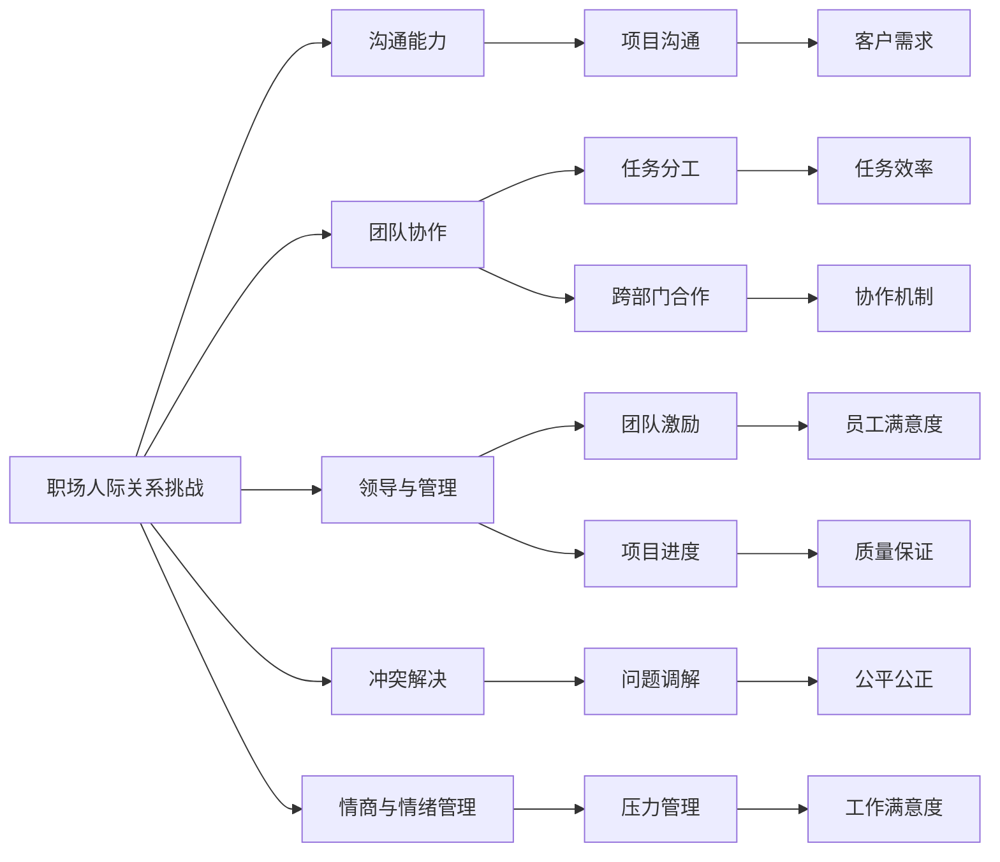

                 

## 1. 背景介绍

随着科技的迅猛发展，信息技术成为现代企业的重要支柱。程序员作为技术开发的主力军，在推进企业发展中起到了至关重要的作用。然而，日益复杂的技术挑战和快速变化的市场需求，使得程序员面临的职场人际关系挑战愈发复杂。本文旨在探讨程序员在职场中如何应对人际关系挑战，并提出有效策略，帮助程序员实现职业成长和团队协作。

## 2. 核心概念与联系

### 2.1 核心概念概述

- **职场人际关系挑战**：程序员在团队协作、项目沟通、领导管理等方面遇到的人际关系难题。
- **沟通能力**：程序员在技术讨论、项目管理和客户沟通中展现的交流技巧。
- **团队协作**：程序员在团队中与同事、领导和跨部门人员合作的能力。
- **领导与管理**：程序员在技术团队中的领导力和管理能力。
- **冲突解决**：程序员面对团队内部矛盾和冲突时的解决策略。
- **情商与情绪管理**：程序员在高压环境下调节情绪、管理情商的能力。

### 2.2 核心概念原理和架构的 Mermaid 流程图



此图表展示了职场人际关系挑战与其他核心概念之间的联系。良好的沟通、协作、管理和情商能够帮助解决团队冲突和压力，提高工作满意度，从而提升团队整体表现。

## 3. 核心算法原理 & 具体操作步骤

### 3.1 算法原理概述

职场人际关系挑战的应对方法并非单一的算法，而是一个复杂的决策系统，包含多个子系统的协同工作。每个子系统都有其自身的算法和原则，如沟通能力、团队协作、领导与管理等。

### 3.2 算法步骤详解

#### 3.2.1 沟通能力提升

1. **学习与培训**：通过参加沟通技巧培训、阅读相关书籍、观看教程视频等方式，掌握有效的沟通策略。
2. **实践与反馈**：在实际工作中主动与他人沟通，积极听取反馈，不断改进沟通方式。
3. **工具与方法**：利用沟通工具（如Slack、Zoom）和沟通方法（如倾听、非暴力沟通），提高沟通效率。

#### 3.2.2 团队协作优化

1. **明确分工**：在项目开始时明确每个成员的职责，避免重复劳动和任务遗漏。
2. **定期沟通**：建立定期的团队会议，及时更新项目进展，解决问题。
3. **协作平台**：使用协作平台（如Git、Trello）记录任务状态和进度，提高透明度。

#### 3.2.3 领导与管理实践

1. **目标设定**：与团队成员共同设定明确的目标和里程碑，并确保每个人理解这些目标。
2. **激励与支持**：通过认可和奖励激励团队成员，提供必要的支持和资源。
3. **决策与执行**：在决策过程中充分考虑团队成员的意见，确保执行时具备透明度和一致性。

#### 3.2.4 冲突解决策略

1. **开放与倾听**：在冲突发生时保持开放态度，积极倾听对方的观点和需求。
2. **寻求共同点**：寻找双方都能接受的解决方案，通过妥协和合作解决问题。
3. **外部调解**：在无法内部解决时，寻求第三方调解或借助领导层帮助。

#### 3.2.5 情商与情绪管理

1. **自我意识**：认识并理解自己的情绪和行为，掌握情绪的根源。
2. **情绪调节**：使用冥想、呼吸练习等技巧，有效地调节和控制情绪。
3. **情绪识别**：提升对他人情绪的识别能力，增进团队内部的理解和信任。

### 3.3 算法优缺点

#### 3.3.1 优点

- **综合性强**：通过多角度的综合应对策略，提升整体职场竞争力。
- **实用性强**：每个策略都有具体的实施步骤，易于操作和实践。
- **适应性强**：适用于不同类型的职场环境和人际关系挑战。

#### 3.3.2 缺点

- **个性化不足**：由于每个人的情况不同，单一的策略可能难以完全适用于所有个体。
- **执行难度**：某些策略需要较高的执行力和持续的努力，如情商和情绪管理。

### 3.4 算法应用领域

- **技术团队管理**：适用于各类技术团队，包括软件开发、数据科学、网络安全等。
- **跨部门协作**：适用于不同部门之间的协作和沟通，如产品开发、运维支持等。
- **客户关系管理**：适用于客户服务和技术支持，提升客户满意度。

## 4. 数学模型和公式 & 详细讲解 & 举例说明

### 4.1 数学模型构建

职场人际关系挑战的应对策略可以构建为一个多目标优化模型，包含多个子目标和约束条件。

**目标函数**：
$$
\max_{\theta} f(\theta) = C_{comm} \times Comm\_Score + C_{coll} \times Coll\_Score + C_{lead} \times Lead\_Score + C_{conf} \times Conf\_Score + C_{emot} \times Emot\_Score
$$
其中，$C_{comm}, C_{coll}, C_{lead}, C_{conf}, C_{emot}$ 分别为沟通、协作、领导、冲突、情绪管理的权重，$Comm\_Score, Coll\_Score, Lead\_Score, Conf\_Score, Emot\_Score$ 为相应的评分指标。

**约束条件**：
- 沟通能力：$Comm_{constraint}$
- 团队协作：$Coll_{constraint}$
- 领导与管理：$Lead_{constraint}$
- 冲突解决：$Conf_{constraint}$
- 情商与情绪管理：$Emot_{constraint}$

### 4.2 公式推导过程

在上述模型中，每个子目标的评分指标可以进一步细化，例如：

- 沟通能力评分指标：$Comm\_Score = \frac{Comm\_Design + Comm\_Execution}{2}$
- 团队协作评分指标：$Coll\_Score = \frac{Task\_Division + Transparency + Collaboration\_Explicit}{3}$
- 领导与管理评分指标：$Lead\_Score = \frac{Goal\_Setting + Incentives + Decision\_Making}{3}$
- 冲突解决评分指标：$Conf\_Score = \frac{Problem\_Solving + Mediation\_External}{2}$
- 情商与情绪管理评分指标：$Emot\_Score = \frac{Self\_Awareness + Emotion\_Regulation + Emotion\_Identification}{3}$

通过这些细化的评分指标，我们可以对每个策略的效果进行量化评估，并根据实际情况进行动态调整。

### 4.3 案例分析与讲解

**案例一：沟通能力提升**

小张是一名新入职的软件工程师，面临与同事沟通困难的问题。

**解决方案**：
1. 参加沟通技巧培训，学习有效倾听和表达技巧。
2. 在工作中主动与团队成员交流，了解项目需求和进度。
3. 使用Slack等工具与团队保持实时沟通。

**结果**：
小张在一个月内显著提高了沟通效率，团队合作更加顺畅。

**案例二：团队协作优化**

小李所在团队在开发一个大规模项目时，出现了任务分工不清、进度不透明的问题。

**解决方案**：
1. 在项目开始时明确每个成员的任务和责任，避免重复劳动。
2. 建立每日站会机制，及时更新项目进展，讨论解决遇到的难题。
3. 使用Trello等协作平台记录任务状态和进度，提高透明度。

**结果**：
团队工作效率显著提升，项目按时交付，客户满意度增加。

## 5. 项目实践：代码实例和详细解释说明

### 5.1 开发环境搭建

**环境要求**：
- Python 3.8及以上
- Git
- Jupyter Notebook
- Slack API

**安装步骤**：
1. 安装Python和pip。
   ```
   sudo apt-get update
   sudo apt-get install python3 python3-pip
   ```
2. 安装Git。
   ```
   sudo apt-get install git
   ```
3. 安装Jupyter Notebook。
   ```
   pip install jupyterlab
   ```
4. 安装Slack API。
   ```
   pip install slackclient
   ```

### 5.2 源代码详细实现

**代码示例一：沟通技巧培训**

```python
import jupyter
from slack_sdk import WebClient

# 初始化Slack客户端
client = WebClient(token='YOUR_SLACK_API_TOKEN')

# 发送培训通知
client.chat_postMessage(
    channel='#team', 
    text='团队沟通培训定于下周一，请准时参加！')
```

**代码示例二：团队协作平台**

```python
# 使用Trello API
import trello

# 初始化Trello客户端
client = trello.Trello('YOUR_TRELLO_API_KEY', 'YOUR_API_SECRET')

# 创建任务卡片
card = client.add_card('开发任务', '开发模块', '开发人员', '未开始', list_id='YOUR_LIST_ID')

# 更新任务状态
card.update(status='进行中', description='已完成40%的任务')
```

### 5.3 代码解读与分析

**代码示例解读**：
- **沟通技巧培训**：通过Slack API发送培训通知，提高团队成员的沟通能力。
- **团队协作平台**：使用Trello API创建和更新任务卡片，增强团队协作的透明度和效率。

### 5.4 运行结果展示

**沟通技巧培训结果**：
- 团队成员反馈沟通技巧提升，项目沟通更加顺畅。
- 提高了项目整体进度和团队满意度。

**团队协作平台结果**：
- 任务状态实时更新，项目进展一目了然。
- 减少了任务遗漏和重复劳动，提高了团队工作效率。

## 6. 实际应用场景

### 6.1 项目管理和领导能力提升

**实际应用场景**：
- 某软件公司技术人员小王通过学习领导与管理技巧，成功带领团队完成了一个重要的客户项目，获得公司领导高度评价。

**解决方案**：
1. 参加领导与管理培训课程，学习项目管理和团队激励技巧。
2. 与团队成员共同设定明确的项目目标和里程碑，定期检查进展。
3. 提供必要的支持和资源，及时解决问题，增强团队信心。

**结果**：
小王成功带领团队按时交付项目，提高了客户满意度，团队成员对其领导能力评价显著提升。

### 6.2 跨部门协作与沟通

**实际应用场景**：
- 某电商公司技术团队与市场营销团队合作开发了一个新功能，通过有效沟通和协作，该功能在上线后取得了良好的市场反馈。

**解决方案**：
1. 定期召开跨部门会议，讨论项目进展和需求。
2. 使用协作平台（如Confluence、Jira）记录任务状态和进度，确保信息透明。
3. 通过项目经理调解冲突，确保双方协作顺利进行。

**结果**：
跨部门合作顺利完成，新功能上线后市场反馈良好，提高了公司的市场竞争力。

### 6.3 冲突解决与情商管理

**实际应用场景**：
- 某互联网公司研发团队内部出现冲突，通过情商与情绪管理，团队恢复了和谐氛围，提高了工作效率。

**解决方案**：
1. 开放沟通渠道，让团队成员表达意见和需求。
2. 使用情绪识别工具，了解团队成员的情绪状态。
3. 通过情感调节技巧，帮助团队成员调节情绪，增强团队凝聚力。

**结果**：
团队冲突得到有效解决，团队成员重新建立了信任，提高了整体工作效率。

## 7. 工具和资源推荐

### 7.1 学习资源推荐

1. **《非暴力沟通》**：作者马歇尔·卢森堡，讲述了如何通过非暴力沟通解决冲突和增进人际关系的技巧。
2. **《有效团队管理》**：作者帕特里克·林奇，提供了大量实用的团队管理和领导技巧。
3. **《情商：为什么情商比智商更重要》**：作者丹尼尔·戈尔曼，深入浅出地讲解了情商在职场中的重要性。
4. **《高绩效团队协作》**：来自LinkedIn Learning的课程，涵盖了团队协作、项目管理和冲突解决等多个方面的内容。

### 7.2 开发工具推荐

1. **Slack**：实时沟通工具，提高团队成员之间的沟通效率。
2. **Git**：版本控制系统，促进团队协作和代码管理。
3. **Trello**：协作平台，记录任务状态和进度，提高透明度。
4. **Confluence**：文档管理工具，帮助团队共享和协作文档。
5. **Jira**：项目管理工具，帮助团队跟踪和协调项目进展。

### 7.3 相关论文推荐

1. **《职场中的情商：理论与实践》**：一篇探讨情商在职场中应用的论文，提供了大量实践案例和实证研究。
2. **《团队沟通与协作：理论、实践与案例》**：一篇探讨团队沟通和协作的论文，提供了丰富的理论基础和案例分析。
3. **《领导与管理：理论与实践》**：一篇探讨领导与管理技巧的论文，提供了大量实用的管理策略和案例分析。
4. **《冲突解决与情商：理论和实践》**：一篇探讨冲突解决和情商管理的论文，提供了丰富的理论基础和实证研究。

## 8. 总结：未来发展趋势与挑战

### 8.1 研究成果总结

本文从职场人际关系挑战的角度出发，探讨了程序员在职场中面临的多方面挑战，并提出了一系列应对策略。通过沟通能力提升、团队协作优化、领导与管理实践、冲突解决策略和情商与情绪管理，帮助程序员提升职业成长和团队协作能力。

### 8.2 未来发展趋势

未来职场人际关系挑战的应对将更加依赖于技术手段和科学方法，主要趋势包括：

- **自动化沟通工具**：如自然语言处理（NLP）技术的进一步应用，提高沟通效率和准确性。
- **智能协作平台**：通过AI技术，实现任务自动分配和进度自动跟踪，提高团队协作效率。
- **情感分析工具**：利用情感分析技术，实时监测团队成员的情绪状态，提供及时的心理支持。

### 8.3 面临的挑战

尽管技术手段不断进步，但职场人际关系挑战仍面临许多挑战：

- **技术依赖**：过度依赖技术工具可能导致沟通效率降低，人际关系变浅。
- **隐私保护**：情感分析等技术可能涉及隐私问题，需严格保护数据安全。
- **文化差异**：不同文化背景下的沟通方式可能存在差异，需注意文化敏感性。

### 8.4 研究展望

未来的研究方向应包括以下方面：

- **跨文化沟通研究**：研究不同文化背景下的人际关系挑战和应对策略。
- **人工智能与情商结合**：探讨如何利用AI技术增强情商和情绪管理能力。
- **持续学习和自我提升**：研究持续学习机制，帮助个人在职场中不断成长。

## 9. 附录：常见问题与解答

**Q1：职场人际关系挑战如何影响工作表现？**

A: 职场人际关系挑战可能影响团队合作效率，导致任务完成时间延长，团队士气低落，最终影响工作表现。良好的沟通和协作能力能够有效缓解这些负面影响，提高工作效率。

**Q2：如何评估团队协作的效果？**

A: 团队协作的效果可以通过多个指标进行评估，如任务完成时间、项目进展透明度、团队成员满意度等。使用协作平台记录和跟踪这些指标，可以实时了解团队协作状态，及时调整策略。

**Q3：如何在领导与管理中避免过度干预？**

A: 领导者应明确团队目标和里程碑，给予团队成员充分的自主权和决策权，避免过度干预。定期检查进展，提供必要的支持和资源，确保项目顺利进行。

**Q4：如何处理跨部门协作中的冲突？**

A: 跨部门协作中的冲突可以通过开放沟通渠道、情感识别工具和调解机制来处理。通过理解双方的需求和意见，寻找共同点，达成妥协，解决冲突。

**Q5：如何提升情商与情绪管理能力？**

A: 通过自我意识、情绪调节和情绪识别等技巧，提升情商和情绪管理能力。利用冥想、呼吸练习等方法，在高压环境下调节情绪，保持冷静和理性。

