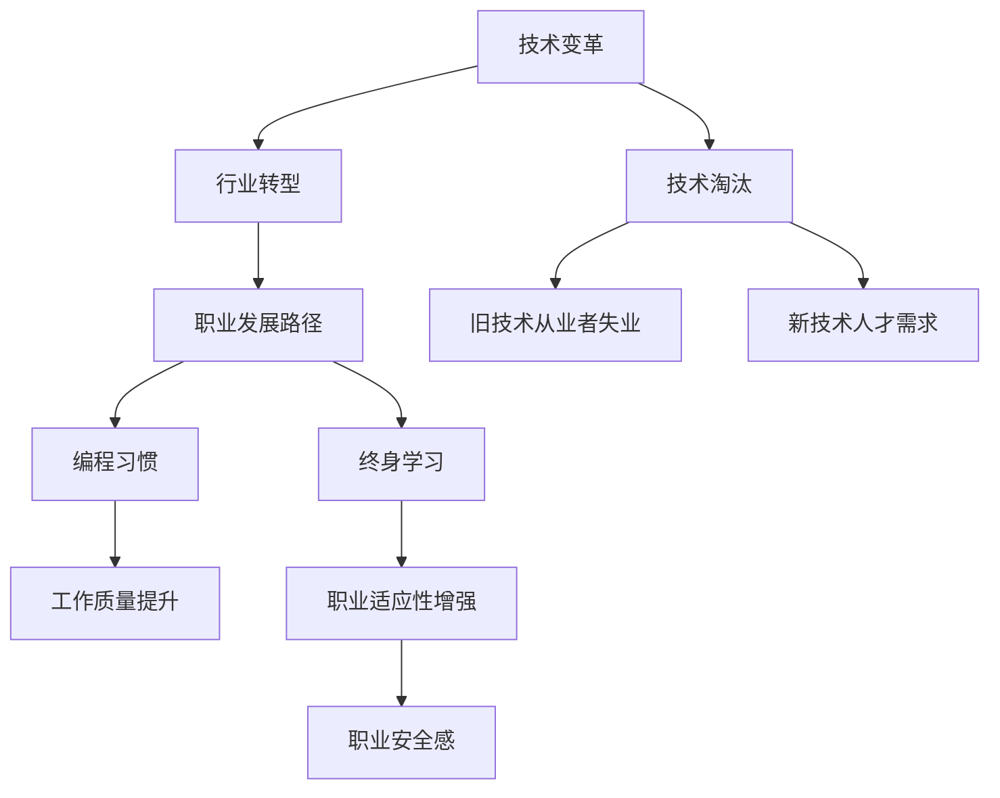

                 

# 程序员如何应对行业变革与转型

> 关键词：技术变革, 行业转型, 职业发展, 技术栈迁移, 跨领域应用, 编程习惯, 终身学习

## 1. 背景介绍

### 1.1 问题由来
随着科技的飞速发展和经济社会需求的不断变化，各行各业正经历前所未有的变革与转型。信息技术行业尤为显著，从软件工程、云计算、大数据到人工智能、区块链等新兴领域，技术迭代日新月异。这些变化对传统程序员提出了新的挑战，要求他们不仅掌握当下流行的技术栈，还必须具备快速适应新技术的能力。

### 1.2 问题核心关键点
本节将从以下几个方面展开，帮助程序员理解行业变革的本质和应对策略：

1. **技术变革的加速**：技术的发展速度远超以往，新的技术不断涌现，使得程序员需要持续学习和适应。
2. **行业转型的方向**：行业需求的变化趋势，如数字化转型、智能应用等，对程序员的技能提出了新要求。
3. **职业发展路径**：技术的更新换代对传统程序员的职业规划和未来发展方向带来了影响。
4. **编程习惯的改变**：新老技术的交替，对程序员的工作方式和编程习惯提出了新的要求。
5. **终身学习的必要性**：面对快速变化的技术生态，终身学习成为程序员职业生涯中不可或缺的一部分。

### 1.3 问题研究意义
理解行业变革的趋势，以及如何应对这些变革，对于程序员的职业发展具有重要意义：

1. **提高竞争力**：掌握最新的技术栈，可以在就业市场上保持竞争优势。
2. **开拓新领域**：跨领域应用能力，使得程序员能够涉足更多行业，拓展职业发展空间。
3. **应对工作挑战**：快速适应技术变革，可以更好地解决实际工作中遇到的各种问题。
4. **促进创新**：具备多元化的技术视野，有助于提出创新解决方案，推动企业技术进步。
5. **实现自我提升**：持续学习和实践，不断提高自身技术水平和解决问题的能力。

## 2. 核心概念与联系

### 2.1 核心概念概述

为更好地理解行业变革，本节将介绍几个核心概念：

- **技术变革**：指技术领域的快速发展和新技术的产生，包括但不限于新兴技术、技术升级、技术淘汰等。
- **行业转型**：指行业内部结构和运作模式的转变，以适应新的技术趋势和市场需求。
- **职业发展路径**：指程序员根据技术变化和个人职业目标，选择的发展方向，包括技术深度和广度两个维度。
- **编程习惯**：指程序员在工作过程中形成的一套方法和规范，包括代码风格、版本控制、文档写作等。
- **终身学习**：指在职业生涯中不断学习新知识、新技能，保持技术上的前沿性和适应性。

这些概念之间的联系和影响可以通过以下Mermaid流程图来展示：



这个流程图展示了技术变革如何驱动行业转型，进而影响职业发展路径、编程习惯和终身学习的必要性。技术淘汰可能导致部分工作岗位的消失，但同时也带来新的技术需求和就业机会。保持适应性、提升编程习惯和学习能力，是程序员应对行业变革的关键。

## 3. 核心算法原理 & 具体操作步骤
### 3.1 算法原理概述

行业变革和转型涉及的技术和需求多样，程序员应对策略的核心算法原理包括：

- **快速适应新技术**：通过持续学习新知识，快速掌握新技术。
- **技能多元化**：跨领域应用能力，使得程序员能够在多个技术栈之间灵活切换。
- **问题解决能力提升**：提高编程技巧，提升代码质量和可维护性，解决实际工作中的复杂问题。
- **跨文化沟通能力**：在多元化的技术环境中，能够与来自不同背景的团队成员有效沟通。
- **个人品牌建立**：通过技术输出和社区参与，建立个人品牌，提升职业影响力。

### 3.2 算法步骤详解

以下是应对行业变革与转型的具体步骤：

**Step 1: 持续学习新知识**  
- 选择合适的学习资源，如在线课程、书籍、技术博客等。
- 设定学习目标和计划，每天或每周安排固定学习时间。
- 学习新技术和框架，如机器学习、人工智能、区块链等。

**Step 2: 技能多元化**  
- 掌握多个编程语言和技术栈，如Python、JavaScript、Go等。
- 深入理解不同技术之间的联系和区别，进行跨领域项目实践。
- 参与开源项目，积累跨领域工作经验。

**Step 3: 问题解决能力提升**  
- 学习和实践敏捷开发方法，如Scrum、Kanban等。
- 提高代码质量和可维护性，使用设计模式和最佳实践。
- 参与代码审查，提升团队协作效率。

**Step 4: 跨文化沟通能力**  
- 学习和使用多种编程语言和工具，提升多语言支持能力。
- 增强沟通技巧，包括有效的文档编写和代码注释。
- 参与国际技术社区，了解不同文化背景下的技术交流和合作模式。

**Step 5: 个人品牌建立**  
- 在GitHub、Stack Overflow等平台贡献代码，参与技术讨论。
- 撰写技术文章，分享技术经验和见解。
- 参加技术会议、黑客马拉松等活动，展示技术实力。

### 3.3 算法优缺点

持续学习和技能多元化对程序员职业发展具有积极意义，但也存在一些缺点：

**优点**：  
1. **提升竞争力**：掌握最新技术，保持就业市场竞争力。
2. **拓展职业空间**：多元化技能可应用于多个行业和项目。
3. **应对工作挑战**：增强问题解决和编程能力，适应复杂任务。
4. **促进创新**：跨领域视角带来新的解决方案和思路。
5. **实现自我提升**：终身学习促进个人成长和技术进步。

**缺点**：  
1. **学习压力**：持续学习需要投入大量时间和精力。
2. **知识过载**：新技术层出不穷，难以跟上所有趋势。
3. **时间管理**：平衡工作和学习的挑战较大。
4. **技能选择**：如何选择学习方向和技能，需要明确的职业目标和规划。

### 3.4 算法应用领域

持续学习和技能多元化的策略，适用于以下多个领域：

- **软件开发**：无论是前端、后端还是全栈开发，都需要掌握最新技术栈和编程工具。
- **数据分析**：大数据分析、机器学习等技术的应用，要求程序员具备相关知识。
- **云计算**：云平台和服务的知识，如AWS、Azure等，对于现代软件开发至关重要。
- **区块链**：区块链技术的了解和应用，在金融、供应链等行业具有广泛应用前景。
- **人工智能**：深度学习、自然语言处理等AI技术，正在改变各个行业的运作方式。

## 4. 数学模型和公式 & 详细讲解 & 举例说明

### 4.1 数学模型构建

本节将使用数学语言对持续学习和技能多元化的过程进行更严格的刻画。

**模型假设**：
- 程序员具有固定的时间预算，每天用于学习的时长为 $t$。
- 学习资源数量为 $R$，包括书籍、课程、博客等。
- 学习新技能需要的时间为 $T_s$，学习已有技能的时间为 $T_e$。

**目标函数**：
- 最大化掌握新技能的数量，即最大化 $N_s$。

**约束条件**：
1. 时间约束：每天学习时间 $t$ 受限。
2. 资源约束：可利用的学习资源 $R$ 有限。
3. 技能平衡：已掌握技能和新技能的比例 $k$ 应保持平衡。

**目标函数和约束条件**：

$$
\max N_s \quad \text{subject to}
$$

$$
t_1 + t_2 \leq t
$$

$$
t_1 \geq 0, \quad t_2 \geq 0
$$

$$
\frac{t_1}{t} + \frac{t_2}{T_s} \leq k
$$

其中 $t_1$ 表示用于学习新技能的时间，$t_2$ 表示用于巩固已有技能的时间。

### 4.2 公式推导过程

以二分类问题为例，推导学习新技能和已有技能的数学模型。

**学习效率**：假设学习新技能 $s$ 和已有技能 $e$ 的效率分别为 $f_s$ 和 $f_e$。

**学习时间**：假设学习新技能需要的时间为 $T_s$，学习已有技能需要的时间为 $T_e$。

**目标函数**：

$$
\max N_s = f_s \times t_1 + f_e \times t_2
$$

**约束条件**：

$$
t_1 + t_2 = t
$$

$$
\frac{t_1}{t} + \frac{t_2}{T_s} = k
$$

**目标函数和约束条件**：

$$
\max f_s \times t_1 + f_e \times t_2 \quad \text{subject to}
$$

$$
t_1 + t_2 = t
$$

$$
\frac{t_1}{t} + \frac{t_2}{T_s} = k
$$

通过求解上述优化问题，可以找到最优的学习时间分配策略，最大化掌握新技能的数量。

### 4.3 案例分析与讲解

假设程序员每天有2小时可用于学习，每周学习6天，每月有1200本书籍资源可用。学习新技能的效率为每天1本，巩固已有技能的效率为每天1/2本。每月目标掌握的新技能数量为10本，已掌握技能与新技能的比例为1:1。

根据上述假设，可以计算出最优的学习时间分配：

- 用于学习新技能的时间 $t_1 = 6$ 小时/周
- 用于巩固已有技能的时间 $t_2 = 6$ 小时/周

每周可以学习2本新技能，一个月内可以掌握10本新技能。

通过此案例，可以看到如何利用数学模型对学习时间和技能掌握进行量化管理，从而优化学习策略，最大化学习效率。

## 5. 项目实践：代码实例和详细解释说明

### 5.1 开发环境搭建

在进行持续学习和技能多元化实践前，我们需要准备好开发环境。以下是使用Python进行PyTorch开发的环境配置流程：

1. 安装Anaconda：从官网下载并安装Anaconda，用于创建独立的Python环境。

2. 创建并激活虚拟环境：
```bash
conda create -n pytorch-env python=3.8 
conda activate pytorch-env
```

3. 安装PyTorch：根据CUDA版本，从官网获取对应的安装命令。例如：
```bash
conda install pytorch torchvision torchaudio cudatoolkit=11.1 -c pytorch -c conda-forge
```

4. 安装Transformers库：
```bash
pip install transformers
```

5. 安装各类工具包：
```bash
pip install numpy pandas scikit-learn matplotlib tqdm jupyter notebook ipython
```

完成上述步骤后，即可在`pytorch-env`环境中开始实践。

### 5.2 源代码详细实现

下面我们以掌握Python和JavaScript为示例，给出使用PyTorch进行技能多元化的PyTorch代码实现。

```python
import torch
import torch.nn as nn
import torch.optim as optim
from transformers import BertForTokenClassification, AdamW

# 定义一个简单的神经网络模型
class MyModel(nn.Module):
    def __init__(self, input_size, hidden_size, output_size):
        super(MyModel, self).__init__()
        self.hidden = nn.Linear(input_size, hidden_size)
        self.relu = nn.ReLU()
        self.output = nn.Linear(hidden_size, output_size)
    
    def forward(self, x):
        x = self.hidden(x)
        x = self.relu(x)
        x = self.output(x)
        return x

# 创建模型
input_size = 1024
hidden_size = 256
output_size = 2
model = MyModel(input_size, hidden_size, output_size)

# 定义优化器
optimizer = AdamW(model.parameters(), lr=2e-5)

# 训练模型
for epoch in range(10):
    loss = 0
    for batch in dataset:
        inputs, labels = batch
        optimizer.zero_grad()
        outputs = model(inputs)
        loss += nn.CrossEntropyLoss()(outputs, labels).item()
        loss.backward()
        optimizer.step()
    print('Epoch {} - Loss: {:.6f}'.format(epoch+1, loss))

# 测试模型
correct = 0
total = 0
with torch.no_grad():
    for batch in test_dataset:
        inputs, labels = batch
        outputs = model(inputs)
        _, predicted = torch.max(outputs.data, 1)
        total += labels.size(0)
        correct += (predicted == labels).sum().item()
print('Accuracy: {:.2f}%'.format(100 * correct / total))
```

### 5.3 代码解读与分析

让我们再详细解读一下关键代码的实现细节：

**MyModel类**：
- `__init__`方法：定义模型结构，包括一个线性层、一个ReLU激活函数和一个输出层。
- `forward`方法：前向传播，计算模型的输出。

**训练函数**：
- 遍历数据集，在每个批次上前向传播计算损失函数。
- 反向传播计算参数梯度，根据设定的优化器更新模型参数。
- 在每个epoch结束后输出平均loss。

**测试函数**：
- 遍历测试集，计算模型的预测结果与真实标签的匹配度。
- 输出准确率。

通过上述代码实现，可以初步了解如何搭建神经网络模型，进行基本的训练和测试。需要注意的是，实际应用中还需要考虑模型的超参数设置、正则化、数据增强等优化措施。

## 6. 实际应用场景

### 6.1 软件开发

在软件开发中，程序员需要掌握多种编程语言和框架，以便在不同项目中灵活应用。以下是一个实际场景：

**需求**：
公司需要开发一个电子商务网站，涉及前端、后端、数据库等多个模块。

**解决方案**：
- 前端使用JavaScript和React框架，后端使用Python和Django框架，数据库使用MySQL。
- 团队成员分别负责前端、后端和数据库的开发，各自掌握相应的技术和工具。
- 定期进行代码审查和知识分享，提升团队协作效率和问题解决能力。

通过掌握多种技术栈，可以在实际工作中高效应对多变的项目需求，提升开发质量和效率。

### 6.2 数据分析

数据分析师需要掌握数据处理、统计分析和机器学习等技能，以便从海量数据中提取有价值的信息。以下是一个实际场景：

**需求**：
公司需要分析用户行为数据，了解用户购买行为和偏好，以便优化产品策略。

**解决方案**：
- 使用Python进行数据清洗、特征工程和模型训练。
- 使用Pandas和NumPy进行数据处理，使用Scikit-learn进行机器学习模型的构建。
- 定期进行模型评估和调优，确保分析结果的准确性和可靠性。

通过掌握数据分析和机器学习技术，可以从数据中挖掘出有价值的信息，支持企业决策。

### 6.3 云计算

云计算工程师需要掌握云平台和服务的知识，以便在企业中构建和管理云基础设施。以下是一个实际场景：

**需求**：
公司需要搭建一个云平台，支持虚拟机、负载均衡和数据库等服务。

**解决方案**：
- 使用AWS或Azure等云平台，部署虚拟机、负载均衡和数据库服务。
- 掌握云平台的API接口和命令行工具，进行云资源的配置和管理。
- 定期进行云平台的监控和优化，确保云基础设施的稳定性和性能。

通过掌握云计算技术，可以在企业中构建和管理云基础设施，提高企业IT系统的灵活性和可扩展性。

## 7. 工具和资源推荐

### 7.1 学习资源推荐

为了帮助程序员掌握新技能和持续学习，以下是一些优质的学习资源：

1. **《深入理解计算机系统》**：这是一本深入讲解计算机系统原理的经典书籍，对于理解底层技术和系统设计非常重要。
2. **《Clean Code: A Handbook of Agile Software Craftsmanship》**：这是一本关于编写高质量代码的经典书籍，强调代码的可读性和可维护性。
3. **《The Art of Building Massive Large-Scale Cloud Services》**：这是一本关于构建大规模云服务的经典书籍，涵盖云平台设计、架构和运营等知识点。
4. **《Deep Learning with PyTorch》**：这是一本关于使用PyTorch进行深度学习的经典书籍，适合学习PyTorch的框架和应用。
5. **《Effective Python: 59 Specific Ways to Write Better Python》**：这是一本关于编写高效Python代码的经典书籍，提供了许多实用的编程技巧和最佳实践。

### 7.2 开发工具推荐

高效的开发离不开优秀的工具支持。以下是几款用于技能多元化和持续学习的常用工具：

1. **VS Code**：这是一个功能强大的代码编辑器，支持多种编程语言和扩展插件，适合跨平台开发。
2. **GitHub**：这是一个面向开源社区的代码托管平台，适合进行代码版本控制和协作开发。
3. **Docker**：这是一个容器化技术，方便在不同环境中进行软件开发和部署。
4. **Kubernetes**：这是一个容器编排系统，支持大规模云基础设施的管理和调度。
5. **Jupyter Notebook**：这是一个交互式编程环境，适合进行数据处理和机器学习实践。

### 7.3 相关论文推荐

技能多元化和持续学习是当前编程领域的研究热点，以下是几篇奠基性的相关论文，推荐阅读：

1. **"Why Programming Skills Development is the New Imperative for IT Professionals"**：这篇文章探讨了编程技能发展对IT从业人员的重要性，并提出了一些策略和建议。
2. **"Mastering the Software Development Life Cycle"**：这篇文章介绍了软件开发的生命周期，强调了持续学习和技能提升的重要性。
3. **"Learning to Learn: An Introduction to Meta-Learning"**：这篇文章介绍了元学习的概念和应用，探讨了如何通过学习来提升学习效果。
4. **"The Future of Programming Education: Trends, Challenges, and Opportunities"**：这篇文章探讨了编程教育的发展趋势和未来挑战，提供了一些改进建议。
5. **"Adaptive Learning Environments: Trends, Challenges, and Opportunities"**：这篇文章介绍了自适应学习环境的研究进展，探讨了如何通过技术手段提升学习效果。

## 8. 总结：未来发展趋势与挑战

### 8.1 研究成果总结

本文对程序员如何应对行业变革与转型进行了全面系统的介绍。首先阐述了技术变革和行业转型的趋势，明确了程序员需要掌握的新技能和知识。其次，从原理到实践，详细讲解了持续学习和新技能多元化的数学模型和操作步骤，给出了具体的代码实例和解释说明。同时，本文还广泛探讨了技能多元化和持续学习在软件开发、数据分析、云计算等多个行业领域的应用前景，展示了技术变革的巨大潜力。最后，精选了相关学习资源、开发工具和研究论文，力求为程序员提供全方位的技术指引。

### 8.2 未来发展趋势

展望未来，技能多元化和持续学习将成为程序员职业发展的核心趋势：

1. **技术栈多样化**：程序员需要掌握更多编程语言和框架，以便在不同项目中灵活应用。
2. **云计算和云服务**：云平台和服务的知识，将成为未来软件开发的关键。
3. **数据科学和机器学习**：数据驱动的决策将越来越重要，数据分析和机器学习技能将受到广泛关注。
4. **人工智能和自动化**：AI和自动化技术的应用，将改变软件开发和运维的方式。
5. **跨学科融合**：跨领域的知识整合能力，将成为未来程序员的核心竞争力。

### 8.3 面临的挑战

尽管技能多元化和持续学习对程序员职业发展具有积极意义，但在实践中仍面临诸多挑战：

1. **学习压力**：持续学习需要投入大量时间和精力，如何平衡工作和学习的挑战较大。
2. **知识过载**：新技术层出不穷，难以跟上所有趋势，容易产生知识过载。
3. **技能选择**：如何选择学习方向和技能，需要明确的职业目标和规划。
4. **资源不足**：学习资源和时间有限，难以覆盖所有领域和技能。
5. **知识应用**：如何将学到的知识应用到实际工作中，解决具体问题，需要实践和经验。

### 8.4 研究展望

为了更好地应对行业变革与转型，未来研究需要在以下几个方面寻求新的突破：

1. **自适应学习模型**：开发自适应学习算法，根据个人学习情况动态调整学习内容和策略。
2. **个性化学习路径**：根据个人的职业目标和兴趣，推荐个性化的学习资源和技能。
3. **跨领域知识图谱**：构建跨领域知识图谱，帮助程序员在不同领域之间进行知识迁移和应用。
4. **持续学习的系统支持**：开发持续学习平台，提供知识管理、学习记录和社交功能，支持长期学习。
5. **技术社区的推动**：通过技术社区和开源项目，推动知识分享和协作，加速技能传播和应用。

这些研究方向将为程序员提供更高效、更有针对性的学习支持，帮助他们在技术变革中保持竞争力和创新能力。

## 9. 附录：常见问题与解答

**Q1：持续学习是否必要？**

A: 在技术快速发展的时代，持续学习是程序员职业发展的重要组成部分。通过学习新技能，可以提升自身竞争力，开拓新的职业机会，适应不断变化的市场需求。

**Q2：如何选择学习资源？**

A: 选择学习资源时，可以考虑以下因素：
1. 学习资源的质量和可信度。
2. 资源的时效性和相关性，是否紧跟技术趋势。
3. 资源的易用性和可访问性，是否方便学习。
4. 资源的多样性，是否涵盖不同的技能和知识。

**Q3：如何平衡工作和学习？**

A: 平衡工作和学习需要制定合理的时间管理计划：
1. 制定明确的学习目标和计划。
2. 每天安排固定的学习时间，形成习惯。
3. 利用碎片时间进行学习，如通勤、午休等。
4. 将学习和工作任务合理分配，避免过度疲劳。

**Q4：如何评估学习效果？**

A: 评估学习效果的方法包括：
1. 进行实践项目，应用所学知识解决实际问题。
2. 参加技术竞赛和社区活动，检验技术水平。
3. 进行知识分享和讨论，获取反馈和建议。
4. 定期进行自我评估和总结，调整学习策略。

通过以上分析和指导，程序员可以更好地应对行业变革与转型，保持技术上的前沿性和适应性，实现职业发展和自我提升。

