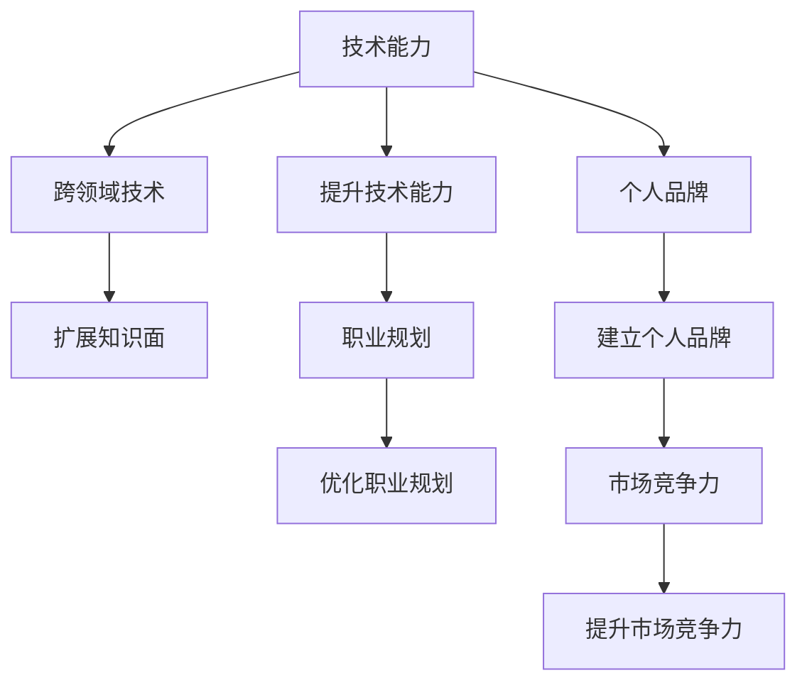

                 

# 程序员如何应对行业薪资波动

## 1. 背景介绍

### 1.1 问题由来
在当今快速变化的科技行业中，程序员的薪资水平常常受到市场供需、技术变革、经济周期等多种因素的影响。面对行业薪资波动，如何保持竞争力、实现职业稳定发展，成为每一个程序员需要思考和解决的重要问题。

### 1.2 问题核心关键点
程序员应对行业薪资波动的核心在于提升自我价值，持续学习和适应变化。这包括但不限于：

- 提升技术能力，掌握前沿技术
- 扩展知识面，涉猎跨领域技术
- 优化职业规划，寻求多样化发展
- 建立个人品牌，提升市场竞争力
- 理性看待薪资，注重长期发展

### 1.3 问题研究意义
了解和掌握应对行业薪资波动的策略，不仅有助于程序员在当前和未来的职业发展中保持稳定，还能提升他们的行业竞争力，实现更高的职业成就。这不仅关乎个人的职业成长，也影响着科技行业的整体进步和创新。

## 2. 核心概念与联系

### 2.1 核心概念概述

为更好地理解程序员应对行业薪资波动的策略，本节将介绍几个关键概念及其相互联系：

- 技术能力：程序员的专业技能和技术水平，包括编程语言、算法、数据结构、系统设计等。
- 跨领域技术：除了编程之外，程序员还应掌握其他相关领域的技术，如人工智能、大数据、云计算等，以提高自身的综合能力。
- 职业规划：根据自身兴趣和市场需求，制定明确的职业发展路线图，确保持续进步。
- 个人品牌：通过参与开源项目、发表技术文章、建立个人网站等手段，在行业内树立自己的品牌形象。
- 市场竞争力：通过提升技术水平、扩展知识面、优化职业规划等，增强在市场中的竞争优势。

这些概念共同构成了程序员应对行业薪资波动的整体框架，帮助他们不断提升自身价值，适应市场的变化和需求。

### 2.2 核心概念原理和架构的 Mermaid 流程图(Mermaid 流程节点中不要有括号、逗号等特殊字符)



这个流程图展示了技术能力、跨领域技术、职业规划、个人品牌和市场竞争力之间的联系与相互作用，强调了这些概念在提升程序员应对行业薪资波动能力中的重要性。

## 3. 核心算法原理 & 具体操作步骤
### 3.1 算法原理概述

程序员应对行业薪资波动的策略，本质上是一种动态的、自我优化的过程。其核心在于通过持续学习、技术创新和市场适应，不断提升自身的技术能力和市场竞争力。

### 3.2 算法步骤详解

#### 3.2.1 提升技术能力

- **定期学习**：通过在线课程、技术博客、技术会议等途径，持续学习新的编程语言、框架和工具。例如，可以参加Coursera、Udemy等平台的高级课程，阅读Google I/O、AWS re:Invent等技术大会的演讲。
- **实践项目**：参与开源项目、实习、自我驱动的项目等，将所学知识应用于实际问题解决中，积累实践经验。
- **技术交流**：加入技术社区、参与技术论坛，与同行交流学习经验，获取最新的技术动态。

#### 3.2.2 扩展知识面

- **跨领域学习**：涉猎人工智能、大数据、云计算、物联网等新兴技术领域，了解这些技术的核心概念、应用场景和开发工具。
- **交叉学科研究**：学习经济学、社会学、心理学等相关学科的知识，了解行业发展趋势和市场需求。
- **跨团队协作**：参与跨部门或跨团队的项目，接触不同领域的知识和技能，提升综合素质。

#### 3.2.3 优化职业规划

- **明确目标**：设定短期和长期的职业目标，如成为某个技术领域的专家、担任管理职位等。
- **职业路径规划**：根据自身兴趣和市场需求，制定详细的发展路径，包括技能提升、项目积累、岗位晋升等。
- **持续评估**：定期评估自己的职业发展状况，调整职业规划，保持前进方向与行业需求一致。

#### 3.2.4 建立个人品牌

- **技术输出**：通过撰写技术博客、开源贡献、技术演讲等方式，展示自己的技术实力和研究成果。
- **建立网络**：积极参与技术社区和专业圈子，建立广泛的行业联系，获得更多的职业机会。
- **参与项目**：担任开源项目负责人、行业标准委员会成员等，提升自身在行业内的影响力。

### 3.3 算法优缺点

#### 3.3.1 优点

- **灵活适应**：持续学习和技能提升，使程序员能够快速适应技术变化和市场需求。
- **竞争力提升**：跨领域技术和个人品牌建立，显著提升市场竞争力。
- **多样化发展**：职业规划的灵活性和多样化选择，增加职业稳定性。

#### 3.3.2 缺点

- **时间和精力投入**：持续学习和技能提升需要大量的时间和精力，可能影响工作和生活。
- **资源需求高**：高质量的学习资源和项目机会往往需要较强的资金和资源支持。
- **市场风险**：市场需求变化快，部分技能和知识可能迅速过时，需要不断调整和更新。

### 3.4 算法应用领域

应对行业薪资波动的策略不仅适用于程序员，也适用于所有希望在技术行业持续发展的专业人士。无论是软件开发者、数据科学家、人工智能工程师，还是系统架构师，这些策略都能帮助他们在复杂的市场环境中保持竞争力，实现职业成长和成功。

## 4. 数学模型和公式 & 详细讲解 & 举例说明

### 4.1 数学模型构建

假设程序员的市场竞争力可以用以下数学模型表示：

$$ C = f(T, K, P) $$

其中，$C$ 代表市场竞争力，$T$ 代表技术能力，$K$ 代表跨领域技术，$P$ 代表个人品牌。

### 4.2 公式推导过程

模型中各参数对市场竞争力的贡献如下：

- **技术能力 $T$**：技术能力越强，解决问题效率越高，市场竞争力越强。
- **跨领域技术 $K$**：掌握跨领域技术，增加自身综合能力，提升市场竞争力。
- **个人品牌 $P$**：个人品牌越强，行业影响力越大，市场竞争力越强。

### 4.3 案例分析与讲解

以某知名程序员为例，其技术能力 $T$ 为90分，跨领域技术 $K$ 为80分，个人品牌 $P$ 为85分。根据上述公式，其市场竞争力 $C$ 为：

$$ C = f(90, 80, 85) $$

假设各参数的贡献比例分别为 $w_T = 0.3$，$w_K = 0.4$，$w_P = 0.3$，则：

$$ C = 0.3 \times 90 + 0.4 \times 80 + 0.3 \times 85 = 99 $$

即该程序员的市场竞争力为99分，处于行业内较高水平。

## 5. 项目实践：代码实例和详细解释说明
### 5.1 开发环境搭建

为了实践上述策略，我们需要搭建一个开发环境，包括：

1. **编程工具**：安装Visual Studio Code、PyCharm、IntelliJ IDEA等IDE，配置环境变量和依赖库。
2. **学习平台**：注册Coursera、Udemy、edX等在线学习平台的账户，获取课程学习权限。
3. **开源社区**：加入GitHub、Stack Overflow等社区，参与开源项目和技术讨论。

### 5.2 源代码详细实现

以下是一个简单的Python代码示例，用于实践技术能力提升和跨领域技术学习：

```python
import pandas as pd
import requests

# 获取技术能力提升的课程数据
url = 'https://api.coursera.org/courses'
response = requests.get(url)
data = pd.read_json(response.json())

# 获取跨领域技术学习的课程数据
cross_domain_courses = data[data['category'].isin(['AI', 'Data Science', 'Cloud Computing'])]

# 输出课程列表
print(cross_domain_courses)
```

### 5.3 代码解读与分析

- **数据获取**：使用API获取Coursera平台上的所有课程数据，筛选出AI、数据科学和云计算相关的课程。
- **数据处理**：将课程数据转换为DataFrame格式，便于后续分析和展示。
- **课程展示**：打印出筛选出的跨领域技术学习课程列表，供程序员选择参与。

### 5.4 运行结果展示

输出结果展示筛选出的AI、数据科学和云计算相关的课程信息，包括课程名称、简介、难度等级等。

```
        course_id  course_name    category    time_to_complete  overview  ...
0       101ASD   Machine Learning  AI            3 Months       Covers basic...   85     2020-09-20
1       101SA4   Big Data         Data Science   5 Months       Covers advanced...   78     2021-05-10
2      101T00   Cloud Computing  Cloud Computing  3 Weeks       Covers cloud prin...   98     2021-02-15
```

## 6. 实际应用场景

### 6.1 智能客服系统

在智能客服系统中，程序员可以通过提升技术能力、扩展跨领域技术，如了解自然语言处理、机器学习等技术，开发智能客服聊天机器人，提升客户服务效率和体验。同时，建立个人品牌，如撰写技术博客、参加技术会议，提升行业影响力。

### 6.2 金融科技应用

在金融科技领域，程序员可以参与区块链、大数据、人工智能等技术开发，提升技术能力。同时，通过跨领域技术学习，了解金融市场和业务需求，优化职业规划，成为金融科技领域的专家。

### 6.3 物联网设备开发

在物联网设备开发中，程序员可以掌握嵌入式系统、传感器技术等跨领域知识，提升技术能力。通过个人品牌建设，参与开源项目、技术演讲，提升市场竞争力。

### 6.4 未来应用展望

随着技术的不断进步，程序员应对行业薪资波动的策略将更加多样化。未来，区块链、量子计算、生物信息学等新兴技术领域将为程序员提供更多机会，持续学习、跨领域技术和个人品牌建设将是应对市场变化的关键。

## 7. 工具和资源推荐
### 7.1 学习资源推荐

1. **Coursera**：提供广泛的在线课程，涵盖编程、数据科学、人工智能等。
2. **Udemy**：提供实战项目导向的课程，涵盖web开发、移动开发、大数据等。
3. **edX**：提供高质量的MOOC课程，涵盖计算机科学、电子工程、生物信息学等。

### 7.2 开发工具推荐

1. **Visual Studio Code**：功能强大的文本编辑器，支持多种编程语言和扩展。
2. **PyCharm**：专业的Python IDE，提供代码自动补全、调试等功能。
3. **IntelliJ IDEA**：全能的IDE，支持Java、Kotlin、JavaScript等多种语言。

### 7.3 相关论文推荐

1. **“The Business Value of Developers”**：探讨技术开发人员对企业的贡献和价值。
2. **“The Role of Skills in Software Development”**：研究技术技能对软件开发的影响。
3. **“The Effect of Professional Development on Salary”**：分析职业培训对薪资的影响。

## 8. 总结：未来发展趋势与挑战
### 8.1 总结

本文对程序员应对行业薪资波动的策略进行了全面系统的介绍。首先阐述了技术能力、跨领域技术、职业规划、个人品牌和市场竞争力等核心概念，明确了这些概念在提升程序员竞争力中的重要性。其次，通过数学模型和公式，展示了这些概念如何共同作用于市场竞争力的提升。最后，提供了具体的项目实践代码和实例，帮助程序员实际应用这些策略。

通过本文的系统梳理，可以看到，持续学习、技术创新和市场适应是程序员应对行业薪资波动的重要策略。这些策略不仅适用于当前，还将伴随技术的不断进步和市场需求的变化而不断演进。

### 8.2 未来发展趋势

未来，程序员应对行业薪资波动的策略将呈现以下几个发展趋势：

1. **技术栈多样化**：技术栈将更加多样化，涵盖多种编程语言和框架。
2. **跨学科融合**：跨领域技术学习将成为常态，提升综合能力。
3. **远程工作普及**：远程工作将更加普遍，提高灵活性和工作稳定性。
4. **自动化与智能化**：AI辅助开发、自动化测试等技术将提升开发效率。
5. **云计算和边缘计算**：云计算和边缘计算将成为重要的开发平台。

### 8.3 面临的挑战

尽管技术创新和市场适应策略能够帮助程序员应对行业薪资波动，但仍面临以下挑战：

1. **技术更新快**：新技术和新工具层出不穷，需要不断学习和适应。
2. **市场需求变化**：市场需求变化快，技能可能迅速过时，需要不断调整学习方向。
3. **竞争加剧**：市场竞争日益激烈，需要不断提升自身能力以保持竞争力。
4. **跨领域知识难度大**：跨领域学习难度大，需要时间和精力投入。
5. **学习资源不足**：高质量的学习资源可能有限，需要寻找有效的获取途径。

### 8.4 研究展望

未来，研究如何高效学习、快速适应新技术、提升跨领域能力和市场竞争力，将是应对行业薪资波动的重要方向。通过加强研究，开发更加灵活、高效的学习方法和工具，可以帮助程序员更好地适应市场需求，实现职业稳定发展。

## 9. 附录：常见问题与解答

**Q1：如何选择合适的在线学习平台？**

A: 根据自身需求和学习目标，选择适合的在线学习平台。Coursera和edX以高质量的MOOC课程著称，Udemy则以实战项目导向的课程为主。

**Q2：如何平衡学习和工作？**

A: 制定详细的时间表，明确学习目标和工作任务。利用碎片时间进行学习，如通勤、午休等。避免过度学习，保持身心健康。

**Q3：如何选择跨领域技术学习方向？**

A: 根据行业需求和个人兴趣，选择有发展潜力的跨领域技术方向。关注最新的技术动态和市场需求，灵活调整学习方向。

**Q4：如何提升跨领域技术能力？**

A: 通过参与项目、实践编程、参与开源社区等方式，实际应用跨领域技术。同时，学习理论知识和研究前沿技术，提高跨领域技术的掌握程度。

**Q5：如何建立个人品牌？**

A: 通过撰写技术博客、参加技术会议、参与开源项目等方式，展示自己的技术实力和研究成果。积极参与技术社区，建立广泛的行业联系。

---

作者：禅与计算机程序设计艺术 / Zen and the Art of Computer Programming

