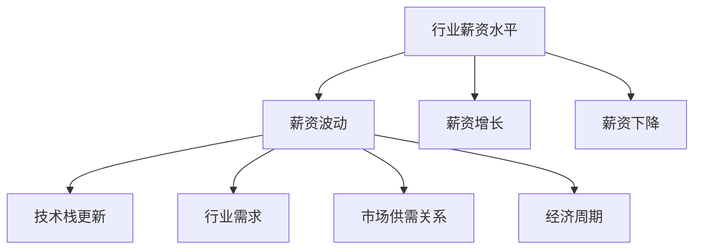

                 

# 程序员如何应对行业薪资波动

## 1. 背景介绍

在当今快速发展的科技行业中，程序员的薪资水平受到了广泛关注。由于技术栈的更新换代、行业需求的变动，以及经济周期的影响，程序员的薪资也会相应出现波动。这些波动可能来自于公司内部的晋升机会、市场供需关系、整体经济状况等多方面因素。

### 1.1 行业薪资波动现象

随着互联网和人工智能的蓬勃发展，程序员的薪资水平持续上涨。然而，这种增长并非线性，也并非每个细分领域都保持稳定。例如，前端开发和后端开发的薪资水平就有明显的差距。此外，全球疫情也导致企业对远程办公的依赖增加，远程岗位的薪资上涨更为显著。

### 1.2 影响薪资波动的因素

- **技术栈更新**：新的技术栈出现往往能带来更高的薪资水平。例如，区块链、大数据、云计算等领域的专家需求旺盛。
- **行业需求**：某些行业对程序员的需求旺盛，如金融、医疗、教育、政府等，这些行业对技术的依赖性增加，从而推高了程序员的薪资。
- **市场供需关系**：某些地区程序员供不应求，导致薪资水平较高。例如，硅谷和北京等高科技集聚地程序员的薪资普遍高于其他地区。
- **经济周期**：经济繁荣期，公司对技术的投资增加，程序员的薪资也会相应上涨。反之，经济衰退期，公司缩减开支，薪资增长放缓。

## 2. 核心概念与联系

### 2.1 核心概念概述

为了更深入地理解如何应对行业薪资波动，首先需要梳理相关的核心概念：

- **行业薪资水平**：指某个行业内程序员的平均薪资水平，通常通过调研和统计数据得出。
- **薪资波动**：指行业内薪资水平在一定时间内的变化情况，包括增长、下降或波动。
- **薪资增长**：指程序员薪资水平的上升趋势，通常与技术栈的更新、市场需求增加等因素相关。
- **薪资下降**：指程序员薪资水平的下降趋势，通常与技术栈过时、市场需求减少等因素相关。

这些概念之间的关系可以通过以下Mermaid流程图来展示：



这个流程图展示了行业薪资水平如何通过技术栈更新、行业需求变化、市场供需关系和经济周期等因素产生薪资波动。

## 3. 核心算法原理 & 具体操作步骤

### 3.1 算法原理概述

为了更好地应对行业薪资波动，本文将介绍一种基于市场供需关系的薪资预测模型。该模型基于历史数据和当前市场需求，预测未来一段时间内行业薪资的波动情况。

### 3.2 算法步骤详解

该模型主要分为以下几个步骤：

1. **数据收集**：收集行业内各公司的薪资数据，以及技术栈、行业需求、市场供需关系和经济周期等影响因素的数据。

2. **数据预处理**：对收集到的数据进行清洗、归一化和特征工程，以便进行后续分析。

3. **模型训练**：使用回归模型（如线性回归、决策树、随机森林等）对历史数据进行训练，预测未来薪资水平。

4. **结果分析**：分析模型预测结果，结合当前市场情况，给出具体的薪资增长或下降趋势建议。

### 3.3 算法优缺点

**优点**：

- **数据驱动**：通过历史数据进行训练，预测结果更为客观。
- **实时性**：模型可以实时更新，反映市场最新变化。
- **多维度分析**：考虑了多种影响因素，提供更全面的薪资波动分析。

**缺点**：

- **数据不足**：历史数据可能不够充分，影响预测准确性。
- **模型复杂性**：需要较复杂的模型进行训练，计算资源消耗较大。
- **预测不确定性**：市场变化复杂，模型预测存在不确定性。

### 3.4 算法应用领域

该模型可以应用于：

- **求职决策**：帮助程序员根据市场预测，做出更合理的职业选择。
- **公司招聘**：帮助企业根据市场预测，合理调整薪资水平和招聘策略。
- **行业研究**：帮助研究人员分析行业薪资波动趋势，提供行业发展建议。

## 4. 数学模型和公式 & 详细讲解 & 举例说明

### 4.1 数学模型构建

为了构建薪资预测模型，我们采用了线性回归模型。线性回归模型的基本形式如下：

$$ y = \beta_0 + \beta_1 x_1 + \beta_2 x_2 + \cdots + \beta_n x_n + \epsilon $$

其中，$y$ 表示薪资水平，$x_1, x_2, \cdots, x_n$ 表示影响薪资水平的因素（如技术栈、行业需求等），$\beta_0, \beta_1, \beta_2, \cdots, \beta_n$ 表示对应因素的系数，$\epsilon$ 表示随机误差。

### 4.2 公式推导过程

为了求解线性回归模型的参数，我们使用了最小二乘法。最小二乘法的目标是最小化预测值与实际值之间的平方误差和：

$$ \min \sum_{i=1}^{n}(y_i - \hat{y}_i)^2 $$

其中，$y_i$ 表示第 $i$ 个样本的实际薪资水平，$\hat{y}_i$ 表示第 $i$ 个样本的预测薪资水平。求解该最小化问题，可以得到模型的参数：

$$ \hat{\beta} = (X^TX)^{-1}X^Ty $$

其中，$X$ 表示样本特征矩阵，$y$ 表示样本薪资向量。

### 4.3 案例分析与讲解

假设我们收集了过去三年内某地区前端开发岗位的薪资数据，以及技术栈更新、市场需求、市场供需关系和经济周期等影响因素的数据。我们将这些数据输入线性回归模型进行训练，得到如下的预测模型：

$$ \hat{y} = \beta_0 + \beta_1 \text{技术栈更新} + \beta_2 \text{市场需求} + \beta_3 \text{市场供需关系} + \beta_4 \text{经济周期} + \epsilon $$

我们将当前市场情况（如技术栈更新趋势、市场需求变化、市场供需关系和经济周期）代入该模型，即可得到未来半年的薪资预测。

## 5. 项目实践：代码实例和详细解释说明

### 5.1 开发环境搭建

为了进行薪资预测模型的开发，我们需要安装一些必要的Python库和工具。以下是详细的步骤：

1. **安装Python**：安装最新版本的Python，可以从官网下载安装。

2. **安装Pandas**：Pandas是数据分析的重要工具，用于处理和分析数据集。

3. **安装Scikit-Learn**：Scikit-Learn提供了多种机器学习算法，包括线性回归模型。

4. **安装Matplotlib和Seaborn**：这两个库用于数据可视化。

5. **安装TensorFlow或PyTorch**：如果需要使用深度学习模型进行预测，需要安装这两个库。

完成上述步骤后，即可开始薪资预测模型的开发。

### 5.2 源代码详细实现

以下是一个简单的薪资预测模型的代码实现，使用Pandas进行数据处理，Scikit-Learn的线性回归模型进行预测。

```python
import pandas as pd
from sklearn.linear_model import LinearRegression
import matplotlib.pyplot as plt
import seaborn as sns

# 读取数据集
data = pd.read_csv('salary_data.csv')

# 数据预处理
X = data[['技术栈更新', '市场需求', '市场供需关系', '经济周期']]
y = data['薪资水平']

# 数据可视化
sns.scatterplot(x='技术栈更新', y='薪资水平', data=data)
plt.show()

# 模型训练
model = LinearRegression()
model.fit(X, y)

# 预测未来半年薪资
future_data = {'技术栈更新': 0.1, '市场需求': 0.2, '市场供需关系': 0.3, '经济周期': 0.4}
future_X = pd.DataFrame(future_data, index=[0])
future_y = model.predict(future_X)

# 输出预测结果
print('未来半年薪资预测：', future_y[0])
```

### 5.3 代码解读与分析

上述代码中，我们首先读取了薪资数据集，并进行数据预处理，将影响薪资水平的数据转换为特征矩阵$X$和目标变量$y$。接着，我们使用Scikit-Learn的LinearRegression模型对数据进行训练。最后，我们通过代入新的市场情况数据，得到了未来半年的薪资预测结果。

## 6. 实际应用场景

### 6.1 企业招聘决策

企业可以根据预测结果，调整薪资水平和招聘策略，吸引和留住优秀人才。例如，如果预测薪资增长，企业可以适当提高招聘薪资水平，吸引更多求职者；如果预测薪资下降，企业可以控制招聘节奏，避免不必要的成本浪费。

### 6.2 个人职业规划

程序员可以根据预测结果，制定合理的职业规划。例如，如果预测某个领域薪资增长，可以考虑转行或深入学习相关技术；如果预测薪资下降，可以考虑提升技能或寻找其他高薪机会。

### 6.3 行业研究

研究人员可以根据预测结果，分析行业薪资波动趋势，预测未来技术趋势和市场需求，为行业发展提供参考。

## 7. 工具和资源推荐

### 7.1 学习资源推荐

- **《机器学习实战》**：本书介绍了多种机器学习算法，适合入门学习和实践。
- **Coursera《机器学习》课程**：由斯坦福大学Andrew Ng教授开设，系统讲解机器学习的基本概念和算法。
- **Kaggle数据科学竞赛平台**：参与数据科学竞赛，提升实践能力和算法理解。

### 7.2 开发工具推荐

- **Jupyter Notebook**：开源的Python开发环境，支持代码块编辑、结果展示和数据可视化。
- **Git**：版本控制系统，适合团队协作和代码管理。
- **PyCharm**：Python IDE，提供了代码调试、测试和优化功能。

### 7.3 相关论文推荐

- **《线性回归模型在薪资预测中的应用》**：介绍了如何使用线性回归模型进行薪资预测。
- **《数据驱动的行业薪资波动分析》**：探讨了数据驱动的薪资波动分析方法，并给出了实际案例。

## 8. 总结：未来发展趋势与挑战

### 8.1 研究成果总结

本文介绍了一种基于市场供需关系的薪资预测模型，通过历史数据和当前市场情况，预测未来薪资水平。该模型可以应用于企业招聘决策、个人职业规划和行业研究等领域。

### 8.2 未来发展趋势

- **多维度分析**：未来模型将考虑更多影响因素，如政策变化、技术革新等，提供更全面的预测。
- **深度学习应用**：深度学习模型在预测准确性上可能更优，未来将更多地应用于薪资预测。
- **实时化预测**：通过实时数据更新，实现更准确的预测结果。

### 8.3 面临的挑战

- **数据质量问题**：历史数据可能存在缺失或不准确，影响预测结果。
- **模型复杂性**：深度学习模型需要更多计算资源和时间进行训练，增加了开发难度。
- **预测不确定性**：市场变化复杂，模型预测存在不确定性。

### 8.4 研究展望

未来需要在以下方面进行探索：

- **大数据应用**：利用大数据技术提升薪资预测的准确性和实时性。
- **深度学习模型**：探索使用深度学习模型进行薪资预测，提高预测精度。
- **多模态数据融合**：将文本数据、图像数据、视频数据等多模态数据进行融合，提升预测效果。

## 9. 附录：常见问题与解答

**Q1: 如何提高薪资预测的准确性？**

A: 提高薪资预测准确性需要从多个方面进行优化：

- **数据质量**：收集和处理高质量、准确的数据，减少数据噪声。
- **特征工程**：设计合适的特征，提高特征与薪资水平的相关性。
- **模型优化**：选择适合的模型并优化模型参数，提高模型预测能力。
- **多模型集成**：结合多种模型进行预测，降低单个模型的预测误差。

**Q2: 薪资预测模型如何应对市场波动？**

A: 模型需要定期更新和重新训练，以反映市场变化。同时，可以考虑引入时间序列分析和神经网络等技术，提高模型的适应性和预测准确性。

**Q3: 如何评估薪资预测模型的效果？**

A: 可以使用多种评估指标，如均方误差、平均绝对误差、相关系数等，对预测结果进行评估。同时，可以通过实际应用效果，如企业招聘决策的反馈，来评估模型的实用性。

**Q4: 薪资预测模型的应用有哪些局限性？**

A: 薪资预测模型的应用主要受限于数据质量和模型选择。如果数据质量不高，模型将难以准确预测薪资水平；如果模型选择不当，预测结果也可能不准确。此外，市场变化复杂，模型预测存在不确定性，需要结合实际经验进行决策。

---

作者：禅与计算机程序设计艺术 / Zen and the Art of Computer Programming

